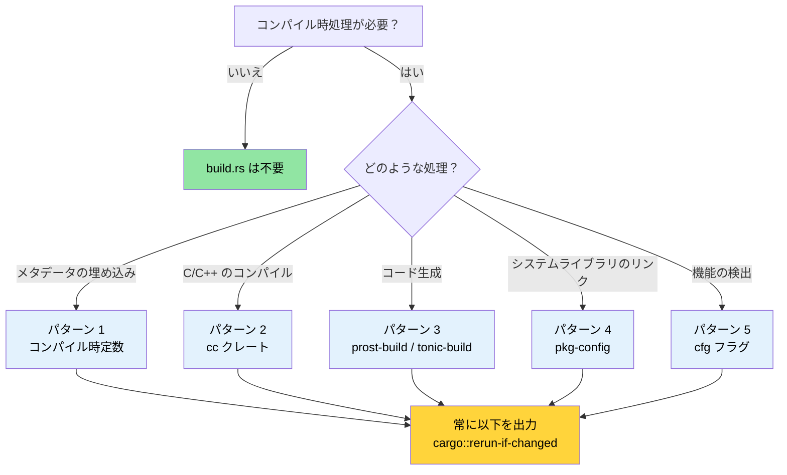

# ビルドスクリプト — `build.rs` 徹底解説 🟢

> **学ぶこと:**
> - `build.rs` が Cargo のビルドパイプラインにどのように組み込まれ、いつ実行されるか
> - 5つの本番向けパターン: コンパイル時定数、C/C++ のコンパイル、protobuf のコード生成、`pkg-config` によるリンク、機能検出
> - ビルドを遅延させたりクロスコンパイルを壊したりするアンチパターン
> - 追跡可能性（トレーサビリティ）と再現可能なビルド（Reproducible builds）のバランス

> **相互参照:** [クロスコンパイル](ch02-cross-compilation-one-source-many-target.md) ではターゲットに応じたビルドのためにビルドスクリプトを活用します · [`no_std` と機能フラグ](ch09-no-std-and-feature-verification.md) ではここで設定した `cfg` フラグを拡張します · [CI/CD パイプライン](ch11-putting-it-all-together-a-production-cic.md) では自動化フロー内でビルドスクリプトをオーケストレーションします

すべての Cargo パッケージは、クレートルートに `build.rs` という名前のファイルを配置できます。Cargo はクレートをコンパイルする**前**に、まずこのファイルをコンパイルして実行します。ビルドスクリプトは、標準出力への `println!` 命令を通じて Cargo と通信します。

### build.rs とは何か、いつ実行されるか

```text
┌─────────────────────────────────────────────────────────┐
│                 Cargo ビルドパイプライン                 │
│                                                         │
│  1. 依存関係の解決                                      │
│  2. クレートのダウンロード                              │
│  3. build.rs のコンパイル ← 通常の Rust、ホスト上で実行  │
│  4. build.rs の実行       ← stdout → Cargo への指示     │
│  5. クレートのコンパイル (ステップ4の指示を適用)        │
│  6. リンク                                              │
└─────────────────────────────────────────────────────────┘
```

重要なポイント：
- `build.rs` はターゲット環境ではなく**ホスト**マシン上で実行されます。クロスコンパイル時であっても、最終バイナリが異なるアーキテクチャ向けであるかどうかにかかわらず、ビルドスクリプトは開発マシン上で動作します。
- ビルドスクリプトのスコープは自身のパッケージ内に限定されます。パッケージの `Cargo.toml` で `links` キーを宣言し、`cargo::metadata=KEY=VALUE` 経由で依存先クレートにメタデータを渡す場合を除き、他のクレートのコンパイル方法に影響を与えることはできません。
- 再実行を制限する `cargo::rerun-if-changed` 命令を出力しない限り、Cargo が変更を検知する**たびに毎回**実行されます。

> **注意 (Rust 1.71以降)**: Rust 1.71 以降、Cargo はコンパイルされた `build.rs` バイナリのフィンガープリントをチェックするようになりました。バイナリが同一であれば、ソースのタイムスタンプが変わっていても再実行されません。しかし、`cargo::rerun-if-changed=build.rs` の指定は依然として重要です。`rerun-if-changed` 命令が一切ない場合、Cargo は（`build.rs` だけでなく）**パッケージ内のいずれかのファイル**が変更されるたびに `build.rs` を再実行します。`cargo::rerun-if-changed=build.rs` を出力しておくことで、`build.rs` 自体が変更されたときのみに再実行を限定でき、大規模クレートにおけるコンパイル時間を大幅に節約できます。
- メインクレートが利用する *cfg フラグ*、*環境変数*、*リンカ引数*、*ファイルパス* を出力できます。

最小限の `Cargo.toml` 設定：

```toml
[package]
name = "my-crate"
version = "0.1.0"
edition = "2021"
build = "build.rs"       # デフォルト — Cargo は自動的に build.rs を探します
# build = "src/build.rs" # または別の場所に配置することも可能です
```

### Cargo 命令プロトコル

ビルドスクリプトは標準出力に命令を出力することで Cargo と通信します。Rust 1.77 以降では、従来のシングルコロン形式（`cargo:`）に代わり、`cargo::` プレフィックスの使用が推奨されています。

| 命令 | 目的 |
|-------------|---------|
| `cargo::rerun-if-changed=PATH` | PATH が変更された場合のみ build.rs を再実行する |
| `cargo::rerun-if-env-changed=VAR` | 環境変数 VAR が変更された場合のみ再実行する |
| `cargo::rustc-link-lib=NAME` | ネイティブライブラリ NAME とリンクする |
| `cargo::rustc-link-search=PATH` | ライブラリ検索パスに PATH を追加する |
| `cargo::rustc-cfg=KEY` | 条件付きコンパイル用の `#[cfg(KEY)]` フラグを設定する |
| `cargo::rustc-cfg=KEY="VALUE"` | `#[cfg(KEY = "VALUE")]` フラグを設定する |
| `cargo::rustc-env=KEY=VALUE` | `env!()` 経由でアクセス可能な環境変数を設定する |
| `cargo::rustc-cdylib-link-arg=FLAG` | cdylib ターゲット用のリンカに FLAG を渡す |
| `cargo::warning=MESSAGE` | コンパイル中に警告を表示する |
| `cargo::metadata=KEY=VALUE` | 依存先クレートから参照可能なメタデータを格納する |

```rust
// build.rs — 最小限の例
fn main() {
    // build.rs 自体が変更された場合のみ再実行
    println!("cargo::rerun-if-changed=build.rs");

    // コンパイル時の環境変数を設定
    let timestamp = std::time::SystemTime::now()
        .duration_since(std::time::UNIX_EPOCH)
        .map(|d| d.as_secs().to_string())
        .unwrap_or_else(|_| "0".into());
    println!("cargo::rustc-env=BUILD_TIMESTAMP={timestamp}");
}
```

### パターン 1: コンパイル時定数

最も一般的なユースケースは、実行時に報告できるようにビルドメタデータ（Gitハッシュ、ビルド日時、CIジョブIDなど）をバイナリに焼き込むことです。

```rust
// build.rs
use std::process::Command;

fn main() {
    println!("cargo::rerun-if-changed=.git/HEAD");
    println!("cargo::rerun-if-changed=.git/refs");

    // Git のコミットハッシュ
    let output = Command::new("git")
        .args(["rev-parse", "--short", "HEAD"])
        .output()
        .expect("git not found");
    let git_hash = String::from_utf8_lossy(&output.stdout).trim().to_string();
    println!("cargo::rustc-env=GIT_HASH={git_hash}");

    // ビルドプロファイル（debug または release）
    let profile = std::env::var("PROFILE").unwrap_or_else(|_| "unknown".into());
    println!("cargo::rustc-env=BUILD_PROFILE={profile}");

    // ターゲットトリプル
    let target = std::env::var("TARGET").unwrap_or_else(|_| "unknown".into());
    println!("cargo::rustc-env=BUILD_TARGET={target}");
}
```

```rust
// src/main.rs — ビルド時の値を消費
fn print_version() {
    println!(
        "{} {} (git:{} target:{} profile:{})",
        env!("CARGO_PKG_NAME"),
        env!("CARGO_PKG_VERSION"),
        env!("GIT_HASH"),
        env!("BUILD_TARGET"),
        env!("BUILD_PROFILE"),
    );
}
```

> **標準で提供される Cargo 環境変数**:
> `build.rs` を書かなくても自動で提供される環境変数があります：
> `CARGO_PKG_NAME`, `CARGO_PKG_VERSION`, `CARGO_PKG_AUTHORS`,
> `CARGO_PKG_DESCRIPTION`, `CARGO_MANIFEST_DIR` など。
> 詳細は[完全なリスト](https://doc.rust-lang.org/cargo/reference/environment-variables.html#environment-variables-cargo-sets-for-crates)を参照してください。

### パターン 2: `cc` クレートを用いた C/C++ コードのコンパイル

Rust クレートが C ライブラリをラップする場合や、小さな C ヘルパーを必要とする場合（ハードウェアインターフェースではよくあります）、[`cc`](https://docs.rs/cc) クレートを使用すると build.rs 内でのコンパイルが非常に容易になります。

```toml
# Cargo.toml
[build-dependencies]
cc = "1.0"
```

```rust
// build.rs
fn main() {
    println!("cargo::rerun-if-changed=csrc/");

    cc::Build::new()
        .file("csrc/ipmi_raw.c")
        .file("csrc/smbios_parser.c")
        .include("csrc/include")
        .flag("-Wall")
        .flag("-Wextra")
        .opt_level(2)
        .compile("diag_helpers");
    // これにより libdiag_helpers.a が生成され、適切な
    // cargo::rustc-link-lib および cargo::rustc-link-search 命令が出力されます。
}
```

```rust
// src/lib.rs — コンパイルされた C コードへの FFI バインディング
extern "C" {
    fn ipmi_raw_command(
        netfn: u8,
        cmd: u8,
        data: *const u8,
        data_len: usize,
        response: *mut u8,
        response_len: *mut usize,
    ) -> i32;
}

/// 生の IPMI コマンドインターフェースに対する安全なラッパー。
/// 前提: enum IpmiError { CommandFailed(i32), ... }
pub fn send_ipmi_command(netfn: u8, cmd: u8, data: &[u8]) -> Result<Vec<u8>, IpmiError> {
    let mut response = vec![0u8; 256];
    let mut response_len: usize = response.len();

    // SAFETY: レスポンスバッファは十分な大きさがあり、response_len も正しく初期化されています。
    let rc = unsafe {
        ipmi_raw_command(
            netfn,
            cmd,
            data.as_ptr(),
            data.len(),
            response.as_mut_ptr(),
            &mut response_len,
        )
    };

    if rc != 0 {
        return Err(IpmiError::CommandFailed(rc));
    }
    response.truncate(response_len);
    Ok(response)
}
```

C++ コードをコンパイルする場合は、`.cpp(true)` および `.flag("-std=c++17")` を指定します：

```rust
// build.rs — C++ の場合
fn main() {
    println!("cargo::rerun-if-changed=cppsrc/");

    cc::Build::new()
        .cpp(true)
        .file("cppsrc/vendor_parser.cpp")
        .flag("-std=c++17")
        .flag("-fno-exceptions")    // Rust の例外なしモデルに合わせる
        .compile("vendor_helpers");
}
```

### パターン 3: Protocol Buffers とコード生成

ビルドスクリプトはコード生成に最適です。`.proto`、`.fbs`、`.json` などのスキーマファイルをコンパイル時に Rust ソースコードに変換できます。以下は [`prost-build`](https://docs.rs/prost-build) を使用した protobuf の例です：

```toml
# Cargo.toml
[build-dependencies]
prost-build = "0.13"
```

```rust
// build.rs
fn main() {
    println!("cargo::rerun-if-changed=proto/");

    prost_build::compile_protos(
        &["proto/diagnostics.proto", "proto/telemetry.proto"],
        &["proto/"],
    )
    .expect("Failed to compile protobuf definitions");
}
```

```rust
// src/lib.rs — 生成されたコードを取り込む
pub mod diagnostics {
    include!(concat!(env!("OUT_DIR"), "/diagnostics.rs"));
}

pub mod telemetry {
    include!(concat!(env!("OUT_DIR"), "/telemetry.rs"));
}
```

> **`OUT_DIR`** は Cargo が提供するディレクトリで、ビルドスクリプトが生成ファイルを配置すべき場所です。各クレートは `target/` 配下に固有の `OUT_DIR` を持ちます。

### パターン 4: `pkg-config` によるシステムライブラリのリンク

`.pc` ファイルを提供するシステムライブラリ（systemd、OpenSSL、libpci など）の場合、[`pkg-config`](https://docs.rs/pkg-config) クレートを使用してシステムを調査し、適切なリンク命令を出力できます：

```toml
# Cargo.toml
[build-dependencies]
pkg-config = "0.3"
```

```rust
// build.rs
fn main() {
    // libpci を検索 (PCIe デバイスの列挙に使用)
    pkg_config::Config::new()
        .atleast_version("3.6.0")
        .probe("libpci")
        .expect("libpci >= 3.6.0 が見つかりません — pciutils-dev をインストールしてください");

    // libsystemd を検索 (任意 — sd_notify との連携用)
    if pkg_config::probe_library("libsystemd").is_ok() {
        println!("cargo::rustc-cfg=has_systemd");
    }
}
```

```rust
// src/lib.rs — pkg-config の検出結果に基づく条件付きコンパイル
#[cfg(has_systemd)]
mod systemd_notify {
    extern "C" {
        fn sd_notify(unset_environment: i32, state: *const std::ffi::c_char) -> i32;
    }

    pub fn notify_ready() {
        let state = std::ffi::CString::new("READY=1").unwrap();
        // SAFETY: state は有効な null 終端 C 文字列です。
        unsafe { sd_notify(0, state.as_ptr()) };
    }
}

#[cfg(not(has_systemd))]
mod systemd_notify {
    pub fn notify_ready() {
        // systemd のないシステムでは何もしない
    }
}
```

### パターン 5: 機能検出と条件付きコンパイル

ビルドスクリプトはコンパイル環境を調査し、メインクレートが条件分岐で使用できる cfg フラグを設定できます。

**CPU アーキテクチャと OS の検出**（安全 — これらはコンパイル時定数です）：

```rust
// build.rs — CPU 機能と OS 機能を検出
fn main() {
    println!("cargo::rerun-if-changed=build.rs");

    let target = std::env::var("TARGET").unwrap();
    let target_os = std::env::var("CARGO_CFG_TARGET_OS").unwrap();

    // x86_64 上で AVX2 最適化パスを有効化
    if target.starts_with("x86_64") {
        println!("cargo::rustc-cfg=has_x86_64");
    }

    // aarch64 上で ARM NEON パスを有効化
    if target.starts_with("aarch64") {
        println!("cargo::rustc-cfg=has_aarch64");
    }

    // /dev/ipmi0 が存在するか検出 (ビルド時チェック)
    if target_os == "linux" && std::path::Path::new("/dev/ipmi0").exists() {
        println!("cargo::rustc-cfg=has_ipmi_device");
    }
}
```

> ⚠️ **アンチパターンの実例** — 以下のコードは魅力的ですが問題のあるアプローチです。**本番環境では決して使用しないでください。**

```rust
// build.rs — 悪い例: ビルド時に実行時のハードウェアを検出
fn main() {
    // アンチパターン: バイナリが「ビルドマシン」のハードウェアに固定されてしまう。
    // GPU を搭載したマシンでビルドし、GPU のないマシンにデプロイした場合、
    // バイナリは GPU が存在するものとして誤動作します。
    if std::process::Command::new("accel-query")
        .arg("--query-gpu=name")
        .arg("--format=csv,noheader")
        .output()
        .is_ok()
    {
        println!("cargo::rustc-cfg=has_accel_device");
    }
}
```

```rust
// src/gpu.rs — ビルド時の検出結果に適応するコード
pub fn query_gpu_info() -> GpuResult {
    #[cfg(has_accel_device)]
    {
        run_accel_query()
    }

    #[cfg(not(has_accel_device))]
    {
        GpuResult::NotAvailable("ビルド時に accel-query が見つかりませんでした".into())
    }
}
```

> ⚠️ **なぜこれが誤りなのか**: オプションのハードウェア検出においては、ビルド時検出よりも実行時デバイス検出のほうがほぼ常に優れています。上記で生成されたバイナリは*ビルドマシンのハードウェア構成に縛られてしまい*、デプロイ先ターゲットで異なる挙動を示します。ビルド時検出は、コンパイル時に真に固定されている機能（アーキテクチャ、OS、ライブラリの有無など）に対してのみ使用してください。GPU のようなハードウェアに対しては、実行時に `which accel-query` や `accel-mgmt` のプローブを行って検出してください。

### アンチパターンと落とし穴

| アンチパターン | 問題点 | 解決策 |
|-------------|-------------|-----|
| `rerun-if-changed` の指定漏れ | ビルドのたびに build.rs が再実行され、開発イテレーションが遅くなる | 常に最低でも `cargo::rerun-if-changed=build.rs` を出力する |
| build.rs 内でのネットワーク呼び出し | オフラインビルドが失敗し、ビルドの再現性が失われる | ファイルをベンダリング（同梱）するか、別のフェッチ手順を設ける |
| `src/` 配下へのファイル書き込み | Cargo はビルド中にソースコードが変化することを想定していない | `OUT_DIR` に書き込み、`include!()` マクロを使用する |
| 過度に重い処理の実行 | すべての `cargo build` が遅延する | `OUT_DIR` に結果をキャッシュし、`rerun-if-changed` でゲートする |
| クロスコンパイルの無視 | `$CC` を無視して `Command::new("gcc")` を直接呼び出す | クロスコンパイルツールチェーンを適切に処理する `cc` クレートを使用する |
| コンテキストなしのパニック | `unwrap()` を使うと「build script failed」という不透明なエラーになる | `.expect("詳細なメッセージ")` を使うか、`cargo::warning=` を出力する |

### 実践応用：ビルドメタデータの埋め込み

プロジェクトでは現在、バージョン報告に `env!("CARGO_PKG_VERSION")` を使用しています。ビルドスクリプトを追加することで、より豊富なメタデータを取り込めます：

```rust
// build.rs — 推奨される追加設定
fn main() {
    println!("cargo::rerun-if-changed=.git/HEAD");
    println!("cargo::rerun-if-changed=.git/refs");
    println!("cargo::rerun-if-changed=build.rs");

    // 診断レポートでの追跡可能性のために Git ハッシュを埋め込む
    if let Ok(output) = std::process::Command::new("git")
        .args(["rev-parse", "--short=10", "HEAD"])
        .output()
    {
        let hash = String::from_utf8_lossy(&output.stdout).trim().to_string();
        println!("cargo::rustc-env=APP_GIT_HASH={hash}");
    } else {
        println!("cargo::rustc-env=APP_GIT_HASH=unknown");
    }

    // レポートの相関分析のためにビルドタイムスタンプを埋め込む
    let timestamp = std::time::SystemTime::now()
        .duration_since(std::time::UNIX_EPOCH)
        .map(|d| d.as_secs().to_string())
        .unwrap_or_else(|_| "0".into());
    println!("cargo::rustc-env=APP_BUILD_EPOCH={timestamp}");

    // マルチアーキテクチャデプロイで有用なターゲットトリプルを出力
    let target = std::env::var("TARGET").unwrap_or_else(|_| "unknown".into());
    println!("cargo::rustc-env=APP_TARGET={target}");
}
```

```rust
// src/version.rs — メタデータを消費
pub struct BuildInfo {
    pub version: &'static str,
    pub git_hash: &'static str,
    pub build_epoch: &'static str,
    pub target: &'static str,
}

pub const BUILD_INFO: BuildInfo = BuildInfo {
    version: env!("CARGO_PKG_VERSION"),
    git_hash: env!("APP_GIT_HASH"),
    build_epoch: env!("APP_BUILD_EPOCH"),
    target: env!("APP_TARGET"),
};

impl BuildInfo {
    /// 必要に応じて実行時にエポック秒をパースする
    /// （安定版 Rust では文字列から整数への const fn がないため、const &str → u64 の変換は実行時に行います）。
    pub fn build_epoch_secs(&self) -> u64 {
        self.build_epoch.parse().unwrap_or(0)
    }
}

impl std::fmt::Display for BuildInfo {
    fn fmt(&self, f: &mut std::fmt::Formatter<'_>) -> std::fmt::Result {
        write!(
            f,
            "DiagTool v{} (git:{} target:{})",
            self.version, self.git_hash, self.target
        )
    }
}
```

> **実践からの重要な洞察**: 本プロジェクトの大規模コードベースでは、C 依存関係、コード生成、システムライブラリリンクが存在しないピュア Rust で構成されているため、多数のクレート全体を通じて `build.rs` が 1 つも存在しません。これらが必要になったときに `build.rs` は強力なツールとなりますが、「なんとなく」で追加すべきではありません。大規模コードベースにおいてビルドスクリプトが存在しないことは、欠落ではなく利点です。カスタムビルドロジックなしでサプライチェーンを管理する方法については、[依存関係管理](ch06-dependency-management-and-supply-chain-s.md) を参照してください。クリーンなアーキテクチャが保たれている*ポジティブ*な兆候と言えます。

### 自分で試してみよう

1. **Git メタデータの埋め込み**: 環境変数として `APP_GIT_HASH` と `APP_BUILD_EPOCH` を出力する `build.rs` を作成してください。`main.rs` で `env!()` を使ってこれらを読み取り、ビルド情報を出力します。コミット後にハッシュが変わることを確認してください。
2. **システムライブラリの検出**: `pkg-config` を使って `libz` (zlib) を調査する `build.rs` を作成してください。見つかった場合は `cargo::rustc-cfg=has_zlib` を出力します。`main.rs` で、cfg フラグに基づいて「zlib available」または「zlib not found」を条件付きで出力してください。
3. **意図的にビルドの再実行を引き起こす**: `build.rs` から `rerun-if-changed` の行を削除し、`cargo build` や `cargo test` の間に何回再実行されるか観察してください。その後、行を元に戻して違いを比較してください。

### 再現可能なビルド（Reproducible Builds）

本章ではタイムスタンプや Git ハッシュをバイナリに埋め込む方法を解説しました。これは追跡可能性には非常に有用ですが、**再現可能なビルド（Reproducible builds）**（同一のソースコードからビルドした場合に常に全く同じバイナリが生成される性質）とは**相反します**。

**トレードオフの構造:**

| 目標 | 達成手段 | コスト |
|------|-------------|------|
| 追跡可能性 | バイナリ内に `APP_BUILD_EPOCH` を含める | ビルドごとにバイナリが固有になり、ハッシュによる完全性検証が困難 |
| 再現性 | `cargo build --locked` で常に同一出力を得る | ビルド時の動的メタデータが埋め込めない |

**実践的な解決策:**

```bash
# 1. CI では常に --locked を使用する (Cargo.lock が確実に尊重される)
cargo build --release --locked
# Cargo.lock が存在しないか古い場合はビルドが失敗し、「自分の環境では動く」を防ぐ

# 2. 再現性がクリティカルなビルドでは SOURCE_DATE_EPOCH を設定する
SOURCE_DATE_EPOCH=$(git log -1 --format=%ct) cargo build --release --locked
# "現在日時" の代わりに最新コミットのタイムスタンプを使用 — 同一コミットなら同一バイナリが生成される
```

```rust
// build.rs 内: 再現性のために SOURCE_DATE_EPOCH を尊重する
let timestamp = std::env::var("SOURCE_DATE_EPOCH")
    .unwrap_or_else(|_| {
        std::time::SystemTime::now()
            .duration_since(std::time::UNIX_EPOCH)
            .map(|d| d.as_secs().to_string())
            .unwrap_or_else(|_| "0".into())
    });
println!("cargo::rustc-env=APP_BUILD_EPOCH={timestamp}");
```

> **ベストプラクティス**: リリースビルドが再現可能（`Gitハッシュ + ロックされた依存関係 + 決定論的タイムスタンプ = 同一バイナリ`）になるよう、ビルドスクリプトで `SOURCE_DATE_EPOCH` をサポートしつつ、開発ビルドでは利便性のために現在日時のタイムスタンプを取得できるようにします。

### ビルドパイプライン決定ダイアグラム



### 🏋️ 演習問題

#### 🟢 演習 1: バージョンスタンプ

現在の Git ハッシュとビルドプロファイルを環境変数に埋め込む `build.rs` を備えた最小限のクレートを作成してください。`main()` からそれらを出力します。デバッグビルドとリリースビルドで出力が変わることを確認してください。

<details>
<summary>解答例</summary>

```rust
// build.rs
fn main() {
    println!("cargo::rerun-if-changed=.git/HEAD");
    println!("cargo::rerun-if-changed=build.rs");

    let hash = std::process::Command::new("git")
        .args(["rev-parse", "--short", "HEAD"])
        .output()
        .map(|o| String::from_utf8_lossy(&o.stdout).trim().to_string())
        .unwrap_or_else(|_| "unknown".into());
    println!("cargo::rustc-env=GIT_HASH={hash}");
    println!("cargo::rustc-env=BUILD_PROFILE={}", std::env::var("PROFILE").unwrap_or_default());
}
```

```rust,ignore
// src/main.rs
fn main() {
    println!("{} v{} (git:{} profile:{})",
        env!("CARGO_PKG_NAME"),
        env!("CARGO_PKG_VERSION"),
        env!("GIT_HASH"),
        env!("BUILD_PROFILE"),
    );
}
```

```bash
cargo run          # profile:debug と表示
cargo run --release # profile:release と表示
```
</details>

#### 🟡 演習 2: 条件付きシステムライブラリ

`pkg-config` を使用して `libz` と `libpci` の両方を検索する `build.rs` を作成してください。見つかったものそれぞれに対して `cfg` フラグを出力します。`main.rs` で、ビルド時にどのライブラリが検出されたかを出力してください。

<details>
<summary>解答例</summary>

```toml
# Cargo.toml
[build-dependencies]
pkg-config = "0.3"
```

```rust,ignore
// build.rs
fn main() {
    println!("cargo::rerun-if-changed=build.rs");
    if pkg_config::probe_library("zlib").is_ok() {
        println!("cargo::rustc-cfg=has_zlib");
    }
    if pkg_config::probe_library("libpci").is_ok() {
        println!("cargo::rustc-cfg=has_libpci");
    }
}
```

```rust
// src/main.rs
fn main() {
    #[cfg(has_zlib)]
    println!("✅ zlib が検出されました");
    #[cfg(not(has_zlib))]
    println!("❌ zlib は見つかりませんでした");

    #[cfg(has_libpci)]
    println!("✅ libpci が検出されました");
    #[cfg(not(has_libpci))]
    println!("❌ libpci は見つかりませんでした");
}
```
</details>

### 重要なまとめ

- `build.rs` はコンパイル時に**ホスト**上で実行されます — 不要な再ビルドを避けるため、常に `cargo::rerun-if-changed` を出力してください。
- C/C++ のコンパイルには生の `gcc` コマンドではなく `cc` クレートを使用してください — クロスコンパイルツールチェーンを適切に処理してくれます。
- 生成ファイルは `OUT_DIR` に書き込み、決して `src/` に書き込まないでください — Cargo はビルド中にソースが変化することを想定していません。
- オプションのハードウェアに対しては、ビルド時検出ではなく実行時検出を優先してください。
- タイムスタンプを埋め込む際は、ビルドの再現性を維持するために `SOURCE_DATE_EPOCH` をサポートしてください。

---
