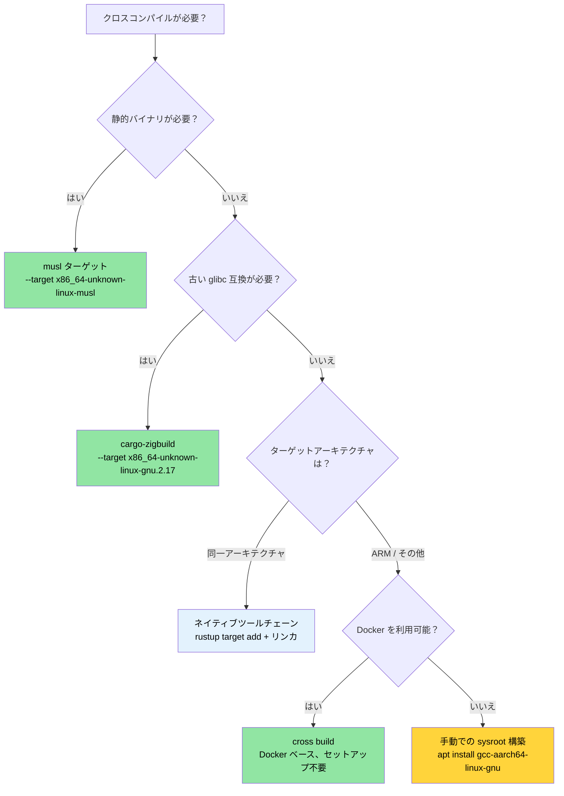

# クロスコンパイル — 1つのソースから複数のターゲットへ 🟡

> **学ぶこと:**
> - Rust のターゲットトリプルの仕組みと、`rustup` によるターゲット追加方法
> - コンテナやクラウドへのデプロイに適した静的 musl バイナリの構築
> - ネイティブツールチェーン、`cross`、`cargo-zigbuild` を用いた ARM（aarch64）へのクロスコンパイル
> - マルチアーキテクチャ CI のための GitHub Actions マトリックスビルドの設定

> **相互参照:** [ビルドスクリプト](ch01-build-scripts-buildrs-in-depth.md) — クロスコンパイル時、build.rs はホスト上で実行されます · [リリースプロファイル](ch07-release-profiles-and-binary-size.md) — クロスコンパイルされたリリースバイナリの LTO と strip 設定 · [Windows環境](ch10-windows-and-conditional-compilation.md) — Windows のクロスコンパイルと `no_std` ターゲット

クロスコンパイルとは、あるマシン（**ホスト**）上で実行ファイルをビルドし、異なるマシン（**ターゲット**）上で動作させることを指します。ホストはお手元の x86_64 ノート PC であり、ターゲットは ARM サーバー、musl ベースのコンテナ、あるいは Windows マシンかもしれません。`rustc` はそれ自体がクロスコンパイラであるため、適切なターゲットライブラリと互換性のあるリンカさえ用意すれば、Rust では極めて容易にクロスコンパイルが実現できます。

### ターゲットトリプルの構造

すべての Rust コンパイルターゲットは、**ターゲットトリプル**（名前に反して実際には4つの要素から構成されることが多い）によって識別されます：

```text
<arch>-<vendor>-<os>-<env>

例:
  x86_64  - unknown - linux  - gnu      ← 標準的な Linux (glibc)
  x86_64  - unknown - linux  - musl     ← 静的 Linux (musl libc)
  aarch64 - unknown - linux  - gnu      ← ARM 64ビット Linux
  x86_64  - pc      - windows- msvc     ← MSVC を用いた Windows
  aarch64 - apple   - darwin             ← Apple Silicon 上の macOS
  x86_64  - unknown - none              ← ベアメタル (OS なし)
```

利用可能なすべてのターゲットを一覧表示する：

```bash
# rustc がコンパイル可能なすべてのターゲットを表示 (約250ターゲット)
rustc --print target-list | wc -l

# システムにインストールされているターゲットを表示
rustup target list --installed

# 現在のデフォルトターゲットを表示
rustc -vV | grep host
```

### rustup によるツールチェーンのインストール

```bash
# ターゲットライブラリ (該当ターゲット向けの Rust std) を追加
rustup target add x86_64-unknown-linux-musl
rustup target add aarch64-unknown-linux-gnu

# これでクロスコンパイルが可能になります:
cargo build --target x86_64-unknown-linux-musl
cargo build --target aarch64-unknown-linux-gnu  # リンカが必要 — 後述参照
```

**`rustup target add` で提供されるもの**: 該当ターゲット向けに事前コンパイルされた `std`、`core`、`alloc` ライブラリです。C リンカや C 標準ライブラリは**含まれません**。C ツールチェーンを必要とするターゲット（ほとんどの `gnu` ターゲット）では、別途インストールする必要があります。

```bash
# Ubuntu/Debian — aarch64 用のクロスリンカをインストール
sudo apt install gcc-aarch64-linux-gnu

# Ubuntu/Debian — 静的ビルド用の musl ツールチェーンをインストール
sudo apt install musl-tools

# Fedora
sudo dnf install gcc-aarch64-linux-gnu
```

### `.cargo/config.toml` — ターゲットごとの設定

各コマンドで毎回 `--target` を渡す代わりに、プロジェクトルートまたはホームディレクトリの `.cargo/config.toml` にデフォルト設定を記述できます：

```toml
# .cargo/config.toml

# このプロジェクトのデフォルトターゲット (任意 — 省略時はホスト環境のデフォルト)
# [build]
# target = "x86_64-unknown-linux-musl"

# aarch64 クロスコンパイル用のリンカ
[target.aarch64-unknown-linux-gnu]
linker = "aarch64-linux-gnu-gcc"
rustflags = ["-C", "target-feature=+crc"]

# musl 静的ビルド用のリンカ (通常はシステムの musl-gcc を使用)
[target.x86_64-unknown-linux-musl]
linker = "musl-gcc"
rustflags = ["-C", "target-feature=+crc,+aes"]

# ARM 32ビット (Raspberry Pi、組み込み環境)
[target.armv7-unknown-linux-gnueabihf]
linker = "arm-linux-gnueabihf-gcc"

# すべてのターゲットに対する環境変数
[env]
# 例: カスタム sysroot の設定
# SYSROOT = "/opt/cross/sysroot"
```

**設定ファイルの探索順序**（最初に一致したものが優先されます）：
1. `<project>/.cargo/config.toml`
2. `<project>/../.cargo/config.toml`（親ディレクトリを上に遡る）
3. `$CARGO_HOME/config.toml`（通常は `~/.cargo/config.toml`）

### musl による静的バイナリの構築

最小限のコンテナ（Alpine、scratch Docker イメージ）や、ホストの glibc バージョンを制御できないシステムにデプロイする場合は、musl を使ってビルドします：

```bash
# musl ターゲットをインストール
rustup target add x86_64-unknown-linux-musl
sudo apt install musl-tools  # musl-gcc を提供

# 完全に静的にリンクされたバイナリをビルド
cargo build --release --target x86_64-unknown-linux-musl

# 静的リンクされているか検証
file target/x86_64-unknown-linux-musl/release/diag_tool
# → ELF 64-bit LSB executable, x86-64, statically linked

ldd target/x86_64-unknown-linux-musl/release/diag_tool
# → not a dynamic executable (動的実行ファイルではない)
```

**静的リンク vs 動的リンクのトレードオフ:**

| 項目 | glibc（動的リンク） | musl（静的リンク） |
|--------|-----------------|---------------|
| バイナリサイズ | 小さい（共有ライブラリを利用） | 大きい（およそ 5〜15 MB 増） |
| ポータビリティ | 一致または互換性のある glibc バージョンが必要 | Linux であれば環境を問わず動作 |
| DNS 名前解決 | `nsswitch` の完全なサポート | 基本的なリゾルバ（mDNS 等は非対応） |
| デプロイ | sysroot または実行コンテナが必要 | 単一のバイナリのみ、依存関係なし |
| パフォーマンス | やや高速な malloc | やや低速な malloc |
| `dlopen()` のサポート | あり | なし |

> **プロジェクトへの適用**: 静的 musl ビルドは、ホスト OS のバージョンを保証できない多様なサーバーハードウェア環境へのデプロイに最適です。単一バイナリによるデプロイモデルは、「自分の環境では動いた」という問題を根本から解消します。

### ARM（aarch64）へのクロスコンパイル

データセンターでは、ARM サーバー（AWS Graviton、Ampere Altra、Grace など）の採用が急速に拡大しています。x86_64 ホストから aarch64 向けにクロスコンパイルする手順は以下の通りです：

```bash
# ステップ 1: ターゲットとクロスリンカのインストール
rustup target add aarch64-unknown-linux-gnu
sudo apt install gcc-aarch64-linux-gnu

# ステップ 2: .cargo/config.toml でリンカを設定 (上記参照)

# ステップ 3: ビルドの実行
cargo build --release --target aarch64-unknown-linux-gnu

# ステップ 4: バイナリの検証
file target/aarch64-unknown-linux-gnu/release/diag_tool
# → ELF 64-bit LSB executable, ARM aarch64
```

**ターゲットアーキテクチャ向けのテスト実行**には、以下のいずれかが必要です：
- 実際の実機 ARM マシン
- QEMU ユーザモードエミュレーション

```bash
# QEMU ユーザモードをインストール (x86_64 上で ARM バイナリを実行可能にする)
sudo apt install qemu-user qemu-user-static binfmt-support

# これで cargo test が QEMU 経由でクロスコンパイルされたテストを実行可能になります
cargo test --target aarch64-unknown-linux-gnu
# (エミュレーションのため動作は低速です。日常の開発ではなく CI での検証に使用してください。)
```

`.cargo/config.toml` で QEMU をテストランナーとして設定します：

```toml
[target.aarch64-unknown-linux-gnu]
linker = "aarch64-linux-gnu-gcc"
runner = "qemu-aarch64-static -L /usr/aarch64-linux-gnu"
```

### `cross` ツール — Docker ベースのクロスコンパイル

[`cross`](https://github.com/cross-rs/cross) ツールは、事前設定済みの Docker イメージを使用することで、事前の環境構築なしにクロスコンパイル体験を提供します：

```bash
# cross をインストール (crates.io から安定版を取得)
cargo install cross
# または最新機能を試す場合は Git から取得:
# cargo install cross --git https://github.com/cross-rs/cross

# クロスコンパイルを実行 — ツールチェーンの手動セットアップは不要！
cross build --release --target aarch64-unknown-linux-gnu
cross build --release --target x86_64-unknown-linux-musl
cross build --release --target armv7-unknown-linux-gnueabihf

# クロステストの実行 — Docker イメージ内に QEMU が組み込まれています
cross test --target aarch64-unknown-linux-gnu
```

**動作の仕組み**: `cross` は `cargo` の代わりに機能し、適切なクロスコンパイルツールチェーンがあらかじめインストールされた Docker コンテナ内でビルドを実行します。ソースコードはコンテナ内にマウントされ、生成物は通常どおりホストの `target/` ディレクトリに出力されます。

`Cross.toml` による **Docker イメージのカスタマイズ**:

```toml
# Cross.toml
[target.aarch64-unknown-linux-gnu]
# 追加のシステムライブラリを含むカスタム Docker イメージを使用
image = "my-registry/cross-aarch64:latest"

# 事前にシステムパッケージをインストール
pre-build = [
    "dpkg --add-architecture arm64",
    "apt-get update && apt-get install -y libpci-dev:arm64"
]

[target.aarch64-unknown-linux-gnu.env]
# コンテナ内に環境変数を引き渡す
passthrough = ["CI", "GITHUB_TOKEN"]
```

`cross` は Docker（または Podman）を必要としますが、クロスコンパイラ、sysroot、QEMU を個別に手動インストールする手間を完全に排除できます。CI 環境でのビルドには最も推奨されるアプローチです。

### クロスコンパイルリンカとしての Zig の利用

[Zig](https://ziglang.org/) は、C コンパイラと約 40 のターゲット向けクロスコンパイル sysroot を、わずか約 40 MB の単一ダウンロードパッケージに同梱しています。これにより、Rust の極めて便利なクロスリンカとして機能します：

```bash
# Zig のインストール (単一バイナリ、パッケージマネージャ不要)
# https://ziglang.org/download/ からダウンロード
# または各種パッケージマネージャを使用:
sudo snap install zig --classic --beta  # Ubuntu
brew install zig                          # macOS

# cargo-zigbuild のインストール
cargo install cargo-zigbuild
```

**なぜ Zig なのか？** 最大の強みは **glibc バージョンの明示的なターゲティング** にあります。Zig ではリンク対象とする glibc のバージョンを正確に指定できるため、古い Linux ディストリビューションでも確実に動作するバイナリを生成できます：

```bash
# glibc 2.17 向けにビルド (CentOS 7 / RHEL 7 互換)
cargo zigbuild --release --target x86_64-unknown-linux-gnu.2.17

# glibc 2.28 向けに aarch64 でビルド (Ubuntu 18.04 以降)
cargo zigbuild --release --target aarch64-unknown-linux-gnu.2.28

# musl 向けにビルド (完全静的リンク)
cargo zigbuild --release --target x86_64-unknown-linux-musl
```

`.2.17` というサフィックスは Zig の拡張構文です。これにより Zig のリンカに glibc 2.17 のシンボルバージョンを使用するよう指示し、生成されたバイナリが CentOS 7 以降でそのまま動作するようになります。Docker も、sysroot の管理も、クロスコンパイラの個別インストールも不要です。

**比較: cross vs cargo-zigbuild vs 手動設定:**

| 機能 | 手動設定 | cross | cargo-zigbuild |
|---------|--------|-------|----------------|
| セットアップの手間 | 高い（ターゲットごとにツールチェーンが必要） | 低い（Docker が必要） | 低い（単一バイナリのみ） |
| Docker の要否 | 不要 | 必要 | 不要 |
| glibc バージョン指定 | 不可（ホストの glibc を使用） | 不可（コンテナの glibc を使用） | 可能（バージョンを明示指定） |
| テスト実行 | QEMU の個別設定が必要 | 同梱されている | QEMU の個別設定が必要 |
| macOS → Linux | 困難 | 容易 | 容易 |
| Linux → macOS | 極めて困難 | 非対応 | 制限付きで対応 |
| バイナリサイズのオーバーヘッド | なし | なし | なし |

### CI パイプライン：GitHub Actions マトリックス

複数ターゲット向けにビルドを行う本番レベルの CI ワークフロー例です：

```yaml
# .github/workflows/cross-build.yml
name: Cross-Platform Build

on: [push, pull_request]

env:
  CARGO_TERM_COLOR: always

jobs:
  build:
    strategy:
      matrix:
        include:
          - target: x86_64-unknown-linux-gnu
            os: ubuntu-latest
            name: linux-x86_64
          - target: x86_64-unknown-linux-musl
            os: ubuntu-latest
            name: linux-x86_64-static
          - target: aarch64-unknown-linux-gnu
            os: ubuntu-latest
            name: linux-aarch64
            use_cross: true
          - target: x86_64-pc-windows-msvc
            os: windows-latest
            name: windows-x86_64

    runs-on: ${{ matrix.os }}
    name: Build (${{ matrix.name }})

    steps:
      - uses: actions/checkout@v4

      - uses: dtolnay/rust-toolchain@stable
        with:
          targets: ${{ matrix.target }}

      - name: musl ツールのインストール
        if: matrix.target == 'x86_64-unknown-linux-musl'
        run: sudo apt-get install -y musl-tools

      - name: cross のインストール
        if: matrix.use_cross
        run: cargo install cross

      - name: ビルド (ネイティブ)
        if: "!matrix.use_cross"
        run: cargo build --release --target ${{ matrix.target }}

      - name: ビルド (cross)
        if: matrix.use_cross
        run: cross build --release --target ${{ matrix.target }}

      - name: テスト実行
        if: "!matrix.use_cross"
        run: cargo test --target ${{ matrix.target }}

      - name: アーティファクトのアップロード
        uses: actions/upload-artifact@v4
        with:
          name: diag_tool-${{ matrix.name }}
          path: target/${{ matrix.target }}/release/diag_tool*
```

### 実践応用：マルチアーキテクチャのサーバー向けビルド

ハードウェア診断ツールを多様なサーバーフリートにデプロイする場合、以下のような構成を追加することが推奨されます：

```text
my_workspace/
├── .cargo/
│   └── config.toml          ← ターゲットごとのリンカ設定
├── Cross.toml                ← cross ツールの設定
└── .github/workflows/
    └── cross-build.yml       ← 3ターゲット向け CI マトリックス
```

**推奨される `.cargo/config.toml` 設定:**

```toml
# プロジェクト向けの .cargo/config.toml

# リリースプロファイルの最適化設定 (Cargo.toml に記載済み、参考用)
# [profile.release]
# lto = true
# codegen-units = 1
# panic = "abort"
# strip = true

# ARM サーバー用 aarch64 (Graviton, Ampere, Grace)
[target.aarch64-unknown-linux-gnu]
linker = "aarch64-linux-gnu-gcc"

# ポータブルな静的バイナリ用 musl
[target.x86_64-unknown-linux-musl]
linker = "musl-gcc"
```

**推奨されるビルドターゲット:**

| ターゲット | ユースケース | デプロイ先 |
|--------|----------|-----------|
| `x86_64-unknown-linux-gnu` | デフォルトのネイティブビルド | 標準的な x86 サーバー |
| `x86_64-unknown-linux-musl` | 静的バイナリ、あらゆるディストリビューション対応 | コンテナ、最小構成のホスト環境 |
| `aarch64-unknown-linux-gnu` | ARM サーバー | Graviton, Ampere, Grace |

> **重要な洞察**: ワークスペースのルート `Cargo.toml` における `[profile.release]` には、すでに `lto = true`、`codegen-units = 1`、`panic = "abort"`、`strip = true` が設定されています。これはクロスコンパイルされた配布用バイナリに理想的なプロファイルです（詳細な比較表は [リリースプロファイル](ch07-release-profiles-and-binary-size.md) を参照）。musl と組み合わせることで、実行時依存関係が一切ない約 10 MB の単一静的バイナリを生成できます。

### クロスコンパイルのトラブルシューティング

| 症状 | 原因 | 解決策 |
|---------|-------|-----|
| `linker 'aarch64-linux-gnu-gcc' not found` | クロスリンカツールチェーンが不足 | `sudo apt install gcc-aarch64-linux-gnu` |
| `cannot find -lssl` (musl ターゲット) | システムの OpenSSL が glibc 向けにリンクされている | `vendored` 機能を使用: `openssl = { version = "0.10", features = ["vendored"] }` |
| `build.rs` が誤ったバイナリを実行する | build.rs はターゲットではなくホスト上で動作する | build.rs 内で `cfg!(target_os)` ではなく `CARGO_CFG_TARGET_OS` を確認する |
| ローカルではテストが通るが `cross` で失敗する | Docker イメージ内にテスト用データが存在しない | `Cross.toml` 経由でテストデータをマウント: `[build.env] volumes = ["./TestArea:/TestArea"]` |
| `undefined reference to __cxa_thread_atexit_impl` | ターゲット環境の glibc が古い | `cargo-zigbuild` で明示的な glibc バージョンを指定: `--target x86_64-unknown-linux-gnu.2.17` |
| ARM 上でバイナリが Segfault を起こす | 誤った ARM バリアント向けにコンパイルされている | ターゲットトリプルが実機ハードウェアと一致しているか確認（64ビット ARM なら `aarch64-unknown-linux-gnu`） |
| 実行時に `GLIBC_2.XX not found` エラー | ビルドマシンの glibc のほうが新しい | 静的ビルドには musl を使用するか、`cargo-zigbuild` で glibc バージョンを固定する |

### クロスコンパイル決定木



### 🏋️ 演習問題

#### 🟢 演習 1: 静的 musl バイナリの構築

任意の Rust バイナリを `x86_64-unknown-linux-musl` 向けにビルドしてください。`file` および `ldd` コマンドを使用して、静的にリンクされていることを検証します。

<details>
<summary>解答例</summary>

```bash
rustup target add x86_64-unknown-linux-musl
cargo new hello-static && cd hello-static
cargo build --release --target x86_64-unknown-linux-musl

# 検証
file target/x86_64-unknown-linux-musl/release/hello-static
# 出力例: ... statically linked ...

ldd target/x86_64-unknown-linux-musl/release/hello-static
# 出力例: not a dynamic executable
```
</details>

#### 🟡 演習 2: GitHub Actions クロスビルドマトリックス

`x86_64-unknown-linux-gnu`、`x86_64-unknown-linux-musl`、`aarch64-unknown-linux-gnu` の3つのターゲット向けに Rust プロジェクトをビルドする GitHub Actions ワークフローを作成してください。マトリックス戦略（matrix strategy）を使用します。

<details>
<summary>解答例</summary>

```yaml
name: Cross-build
on: [push]
jobs:
  build:
    runs-on: ubuntu-latest
    strategy:
      matrix:
        target:
          - x86_64-unknown-linux-gnu
          - x86_64-unknown-linux-musl
          - aarch64-unknown-linux-gnu
    steps:
      - uses: actions/checkout@v4
      - uses: dtolnay/rust-toolchain@stable
        with:
          targets: ${{ matrix.target }}
      - name: cross のインストール
        run: cargo install cross --locked
      - name: ビルド実行
        run: cross build --release --target ${{ matrix.target }}
      - uses: actions/upload-artifact@v4
        with:
          name: binary-${{ matrix.target }}
          path: target/${{ matrix.target }}/release/my-binary
```
</details>

### 重要なまとめ

- Rust の `rustc` は標準でクロスコンパイラです — 適切なターゲットとリンカさえ用意すれば動作します。
- **musl** は実行時依存関係のない完全な静的バイナリを生成します — コンテナ環境に最適です。
- **`cargo-zigbuild`** はエンタープライズ Linux ターゲットにおける「どの glibc バージョンを対象にすべきか」という課題をスマートに解決します。
- **`cross`** は ARM やその他の環境に対する最も簡単なアプローチです — Docker が sysroot を自動処理してくれます。
- デプロイ先ターゲットとバイナリが正しく一致しているか、必ず `file` と `ldd` で検証してください。

---
