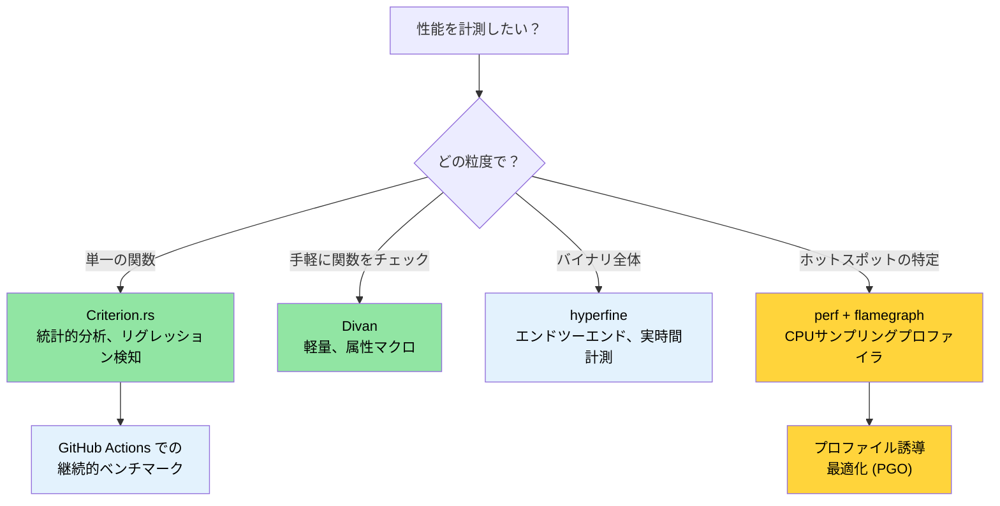

# ベンチマーク — 本質的な性能を測る 🟡

> **学ぶこと:**
> - なぜ `Instant::now()` による素朴な計測が信頼性の低い結果を生むのか
> - Criterion.rs を用いた統計的ベンチマークと、より軽量な代替手段である Divan
> - `perf`、フレームグラフ（flamegraphs）、PGO（プロファイル誘導最適化）によるホットスポットのプロファイリング
> - 性能低下（リグレッション）を自動検出するための CI での継続的ベンチマークの設定

> **相互参照:** [リリースプロファイル](ch07-release-profiles-and-binary-size.md) — ホットスポットを特定した後のバイナリ最適化 · [CI/CD パイプライン](ch11-putting-it-all-together-a-production-cic.md) — パイプライン内でのベンチマークジョブの実行 · [コードカバレッジ](ch04-code-coverage-seeing-what-tests-miss.md) — カバレッジは「何がテストされたか」を示し、ベンチマークは「どれほど速いか」を示す

「97%前後の些細な効率化については忘れるべきである。早すぎる最適化は諸悪の根源だ。しかし、極めて重要な残り3%の好機を見逃してはならない。」 — ドナルド・クヌース (Donald Knuth)

難しいのはベンチマークコードを「書く」ことではありません。**意味があり、再現可能で、アクションにつながる**数値を算出するベンチマークを作成することです。本章では、「なんとなく速くなった気がする」という状態から、「PR #347 によってパースのスループットが 4.2% 低下したという統計的証拠が得られた」と言える状態へとステップアップするためのツールと技術を解説します。

### なぜ `std::time::Instant` では不十分なのか？

よくある誘惑：

```rust
// ❌ 素朴なベンチマーク — 信頼性の低い結果
use std::time::Instant;

fn main() {
    let start = Instant::now();
    let result = parse_device_query_output(&sample_data);
    let elapsed = start.elapsed();
    println!("パース所要時間: {:?}", elapsed);
    // 問題点 1: コンパイラが `result` を最適化で消去する可能性がある (デッドコード削除)
    // 問題点 2: 測定回数が1回のみ — 統計的有意性がない
    // 問題点 3: CPU 周波数スケーリング、サーマルスロットリング、他プロセスの干渉
    // 問題点 4: コールドキャッシュとウォームキャッシュが制御されていない
}
```

手動計測の問題点：
1. **デッドコード削除 (Dead code elimination)** — 結果が後続の処理で使われない場合、コンパイラが計算そのものを完全にスキップすることがあります。
2. **ウォームアップの欠如** — 初回実行時にはキャッシュミス、OS のページフォルト、遅延初期化などの影響が含まれます。
3. **統計的分析の欠如** — 単一の測定値からは、分散、外れ値、信頼区間について何も分かりません。
4. **リグレッション検知の不在** — 過去の実行結果との自動比較ができません。

### Criterion.rs — 統計的ベンチマーク

[Criterion.rs](https://bheisler.github.io/criterion.rs/book/) は、Rust のマイクロベンチマークにおける事実上の標準ライブラリです。統計的手法を用いて信頼性の高い測定を行い、性能のリグレッション（劣化）を自動的に検出します。

**セットアップ:**

```toml
# Cargo.toml
[dev-dependencies]
criterion = { version = "0.5", features = ["html_reports", "cargo_bench_support"] }

[[bench]]
name = "parsing_bench"
harness = false  # 組み込みのテストハーネスではなく Criterion のハーネスを使用
```

**完全なベンチマークの例:**

```rust
// benches/parsing_bench.rs
use criterion::{black_box, criterion_group, criterion_main, Criterion, BenchmarkId};

/// パースされた GPU 情報を保持するデータ型
#[derive(Debug, Clone)]
struct GpuInfo {
    index: u32,
    name: String,
    temp_c: u32,
    power_w: f64,
}

/// テスト対象の関数 — デバイスクエリの CSV 出力パースをシミュレート
fn parse_gpu_csv(input: &str) -> Vec<GpuInfo> {
    input
        .lines()
        .filter(|line| !line.starts_with('#'))
        .filter_map(|line| {
            let fields: Vec<&str> = line.split(", ").collect();
            if fields.len() >= 4 {
                Some(GpuInfo {
                    index: fields[0].parse().ok()?,
                    name: fields[1].to_string(),
                    temp_c: fields[2].parse().ok()?,
                    power_w: fields[3].parse().ok()?,
                })
            } else {
                None
            }
        })
        .collect()
}

fn bench_parse_gpu_csv(c: &mut Criterion) {
    // 代表的なテストデータ
    let small_input = "0, Acme Accel-V1-80GB, 32, 65.5\n\
                       1, Acme Accel-V1-80GB, 34, 67.2\n";

    let large_input = (0..64)
        .map(|i| format!("{i}, Acme Accel-X1-80GB, {}, {:.1}\n", 30 + i % 20, 60.0 + i as f64))
        .collect::<String>();

    c.bench_function("parse_2_gpus", |b| {
        b.iter(|| parse_gpu_csv(black_box(small_input)))
    });

    c.bench_function("parse_64_gpus", |b| {
        b.iter(|| parse_gpu_csv(black_box(&large_input)))
    });
}

criterion_group!(benches, bench_parse_gpu_csv);
criterion_main!(benches);
```

**実行と結果の読み方:**

```bash
# すべてのベンチマークを実行
cargo bench

# 特定のベンチマークのみを実行
cargo bench -- parse_64

# 出力例:
# parse_2_gpus        time:   [1.2345 µs  1.2456 µs  1.2578 µs]
#                      ▲            ▲           ▲
#                      │          信頼区間
#                   下限 95%      中央値      上限 95%
#
# parse_64_gpus       time:   [38.123 µs  38.456 µs  38.812 µs]
#                     change: [-1.2345% -0.5678% +0.1234%] (p = 0.12 > 0.05)
#                     No change in performance detected. (パフォーマンスの有意な変化は検出されませんでした)
```

**`black_box()` の役割**: コンパイラに対してデッドコード削除や過度な定数畳み込みを防ぐヒントを与えます。コンパイラは `black_box` の内部を見通せないため、実際に値を計算せざるを得なくなります。

### パラメータ化ベンチマークとベンチマークグループ

複数の実装や異なる入力サイズを比較します：

```rust
// benches/comparison_bench.rs
use criterion::{criterion_group, criterion_main, Criterion, BenchmarkId, Throughput};

fn bench_parsing_strategies(c: &mut Criterion) {
    let mut group = c.benchmark_group("csv_parsing");

    // 異なる入力サイズでテスト
    for num_gpus in [1, 8, 32, 64, 128] {
        let input = generate_gpu_csv(num_gpus);

        // スループット (バイト/秒) を報告するための設定
        group.throughput(Throughput::Bytes(input.len() as u64));

        group.bench_with_input(
            BenchmarkId::new("split_based", num_gpus),
            &input,
            |b, input| b.iter(|| parse_split(input)),
        );

        group.bench_with_input(
            BenchmarkId::new("regex_based", num_gpus),
            &input,
            |b, input| b.iter(|| parse_regex(input)),
        );

        group.bench_with_input(
            BenchmarkId::new("nom_based", num_gpus),
            &input,
            |b, input| b.iter(|| parse_nom(input)),
        );
    }
    group.finish();
}

criterion_group!(benches, bench_parsing_strategies);
criterion_main!(benches);
```

**HTML レポート**: Criterion は `target/criterion/report/index.html` にバイオリンプロット、比較チャート、リグレッション分析を含む詳細なレポートを生成します。ブラウザで開いて確認できます。

### Divan — より軽量な選択肢

[Divan](https://github.com/nvzqz/divan) は、Criterion のようなマクロ DSL ではなく、属性マクロ（attribute macros）を利用する新しいベンチマークフレームワークです：

```toml
# Cargo.toml
[dev-dependencies]
divan = "0.1"

[[bench]]
name = "parsing_bench"
harness = false
```

```rust
// benches/parsing_bench.rs
use divan::black_box;

const SMALL_INPUT: &str = "0, Acme Accel-V1-80GB, 32, 65.5\n\
                          1, Acme Accel-V1-80GB, 34, 67.2\n";

fn generate_gpu_csv(n: usize) -> String {
    (0..n)
        .map(|i| format!("{i}, Acme Accel-X1-80GB, {}, {:.1}\n", 30 + i % 20, 60.0 + i as f64))
        .collect()
}

fn main() {
    divan::main();
}

#[divan::bench]
fn parse_2_gpus() -> Vec<GpuInfo> {
    parse_gpu_csv(black_box(SMALL_INPUT))
}

#[divan::bench(args = [1, 8, 32, 64, 128])]
fn parse_n_gpus(n: usize) -> Vec<GpuInfo> {
    let input = generate_gpu_csv(n);
    parse_gpu_csv(black_box(&input))
}

// Divan の出力はすっきりとしたテーブル形式です:
// ╰─ parse_2_gpus   fastest  │ slowest  │ median   │ mean     │ samples │ iters
//                   1.234 µs │ 1.567 µs │ 1.345 µs │ 1.350 µs │ 100     │ 1600
```

**Divan を選ぶ理由:**
- シンプルな API（属性マクロで記述でき、ボイラープレートが少ない）
- 高速なコンパイル（依存関係が少ない）
- 開発中の素早いパフォーマンス確認に最適

**Criterion を選ぶ理由:**
- 過去の実行結果との統計的リグレッション検知
- グラフを含むリッチな HTML レポート
- 確立されたエコシステムと豊富な CI 連携実績

### `perf` とフレームグラフによるプロファイリング

ベンチマークは「どれほど速いか」を示し、プロファイリングは「どこで時間が消費されているか」を示します。

```bash
# ステップ 1: デバッグ情報付きでビルド (リリース相当の速度でデバッグシンボルを残す)
cargo build --release
# デバッグ情報が含まれていることを確認:
# [profile.release]
# debug = true          # プロファイリング用に一時的に有効化

# ステップ 2: perf で記録
perf record --call-graph=dwarf ./target/release/diag_tool --run-diagnostics

# ステップ 3: フレームグラフを生成
# インストール: cargo install flamegraph
# インストール: cargo install addr2line --features=bin (任意、cargo-flamegraph を高速化)
cargo flamegraph --root -- --run-diagnostics
# インタラクティブな SVG フレームグラフが開きます

# 代替手段: perf + inferno を使用
perf script | inferno-collapse-perf | inferno-flamegraph > flamegraph.svg
```

**フレームグラフの読み方:**
- **横幅 (Width)** = その関数内で消費された時間の割合（広いほど時間がかかっている）
- **高さ (Height)** = コールスタックの深さ（高いからといって遅いわけではなく、呼び出し階層が深いことを示す）
- **最下部 (Bottom)** = エントリポイント、**最上部 (Top)** = 実際に処理を行っている末端（リーフ）関数
- 最上部で幅の広い「平原（プラトー）」を探してください — そこが主要なホットスポットです。

### プロファイル誘導最適化 (PGO: Profile-Guided Optimization)

プロファイル誘導最適化（PGO: Profile-Guided Optimization）は、CPU バウンドなアプリケーションのパフォーマンスを向上させるコンパイラ最適化技術です。PGO の基本概念は、プログラムの典型的な実行データ（例: どの分岐が頻繁に通るかなど）を収集し、そのデータをもとに関数のインライン化、機械語コードの配置、レジスタ割り当てなどの最適化を行うことです。

実行データの収集方法にはいくつかあります。1つは `perf` などのプロファイラ内部でプログラムを実行する方法、もう1つはデータ収集コードが組み込まれたインストルメント済みバイナリを作成して実行する方法です。後者のほうが通常より正確なデータが得られ、`rustc` でもサポートされています。

以下は、インストルメンテーションに基づく PGO の例です：

```bash
# ステップ 1: インストルメンテーション付きでビルド
RUSTFLAGS="-Cprofile-generate=/tmp/pgo-data" cargo build --release

# ステップ 2: 代表的なワークロードを実行
./target/release/diag_tool --run-full   # プロファイリングデータを生成

# ステップ 3: プロファイリングデータをマージ
# rustc の LLVM バージョンに一致する llvm-profdata を使用:
# $(rustc --print sysroot)/lib/rustlib/x86_64-unknown-linux-gnu/bin/llvm-profdata
# または llvm-tools がインストールされている場合: rustup component add llvm-tools
llvm-profdata merge -o /tmp/pgo-data/merged.profdata /tmp/pgo-data/

# ステップ 4: プロファイルフィードバックを用いて再ビルド
RUSTFLAGS="-Cprofile-use=/tmp/pgo-data/merged.profdata" cargo build --release
# 計算負荷の高いコード (パース、暗号処理、コード生成など) では通常 5〜20% の向上が得られます。
# 一方、I/O バウンドやシステムコール主体のコードでは、CPU がビジーループではなく
# 待機している時間が大半を占めるため、改善効果は限定的です。
```

コンパイラを直接操作する代わりに、直感的な CLI を持ち手動の手間を省いてくれる [cargo-pgo](https://github.com/kobzol/cargo-pgo) を利用することも可能です。

`cargo-pgo` を使用したワークフローは以下のようになります：

```bash
# ステップ 1: インストルメンテーション付きでビルド
cargo pgo build

# ステップ 2: 代表的なワークロードを実行
cargo pgo run -- --run-full

# ステップ 3: プロファイルフィードバックを用いて再ビルド
cargo pgo optimize
```

サンプリング PGO（SPGO）は、インストルメンテーション型に比べて実行時オーバーヘッドを抑えられる、より発展的なアプローチです。詳細については Clang PGO [マニュアル](https://clang.llvm.org/docs/UsersManual.html#using-sampling-profilers) を参照してください。

> **Tips**: PGO に時間をかける前に、まず [リリースプロファイル](ch07-release-profiles-and-binary-size.md) で LTO が有効になっていることを確認してください。通常、LTO のほうがはるかに少ない労力で大きな効果が得られます。

参考資料：
* PGO に関する公式 Rustc [ガイド](https://doc.rust-lang.org/rustc/profile-guided-optimization.html)
* [Awesome PGO](https://github.com/zamazan4ik/awesome-pgo) — 実アプリケーションでの PGO ベンチマーク集および各コンパイラのガイド（サンプリング PGO 含む）
* [LLVM BOLT](https://github.com/llvm/llvm-project/blob/main/bolt/README.md) — ポストリンク最適化（PLO: Post-Link Optimization）技術。PGO 適用後にさらなる最適化を施してパフォーマンスを高めることができます。`cargo-pgo` は `llvm-bolt` もサポートしています。

### `hyperfine` — クイックなエンドツーエンドの計測

[`hyperfine`](https://github.com/sharkdp/hyperfine) は個別の関数ではなく、コマンド全体の実行時間をベンチマークします。バイナリ全体のパフォーマンスを測定するのに最適です：

```bash
# インストール
cargo install hyperfine
# または: sudo apt install hyperfine  (Ubuntu 23.04+)

# 基本的なベンチマーク
hyperfine './target/release/diag_tool --run-diagnostics'

# 2つの実装を比較
hyperfine './target/release/diag_tool_v1 --run-diagnostics' \
          './target/release/diag_tool_v2 --run-diagnostics'

# ウォームアップ実行 + 最小実行回数の指定
hyperfine --warmup 3 --min-runs 10 './target/release/diag_tool --run-all'

# CI での比較用に結果を JSON 出力
hyperfine --export-json bench.json './target/release/diag_tool --run-all'
```

**`hyperfine` と Criterion の使い分け:**
- `hyperfine`: バイナリ全体の所要時間測定、リファクタリング前後の比較、I/O 主体の処理
- Criterion: 個別関数のマイクロベンチマーク、統計的な性能リグレッション検出

### CI での継続的ベンチマーク

性能リグレッションがリリースされる前に自動検知します：

```yaml
# .github/workflows/bench.yml
name: Benchmarks

on:
  pull_request:
    paths: ['**/*.rs', 'Cargo.toml', 'Cargo.lock']

jobs:
  benchmark:
    runs-on: ubuntu-latest
    steps:
      - uses: actions/checkout@v4

      - uses: dtolnay/rust-toolchain@stable

      - name: ベンチマーク実行
        # --output-format を使用するには criterion = { features = ["cargo_bench_support"] } が必要
        run: cargo bench -- --output-format bencher | tee bench_output.txt

      - name: ベンチマーク結果の保存・比較
        uses: benchmark-action/github-action-benchmark@v1
        with:
          tool: 'cargo'
          output-file-path: bench_output.txt
          github-token: ${{ secrets.GITHUB_TOKEN }}
          auto-push: true
          alert-threshold: '120%'    # 20% 悪化した場合にアラート
          comment-on-alert: true
          fail-on-alert: true        # リグレッション検出時に PR をブロック
```

**CI における重要な考慮事項:**
- 一貫した測定結果を得るため、（共有 CI ランナーではなく）**専用のベンチマークランナー**を使用する
- クラウド CI を利用する場合は、特定のインスタンスタイプにランナーを固定する
- 段階的な性能劣化を検出できるよう、履歴データを永続化する
- ワークロードの許容度に応じてしきい値を設定する（ホットパスなら 5%、重要度の低い処理なら 20% など）

### 実践応用：パース処理のパフォーマンス

ハードウェア診断ツールには、ベンチマークを行う価値が高いパース処理が複数存在します：

| パースのホットスポット | クレート | 重要である理由 |
|------------------|-------|----------------|
| アクセラレータクエリの CSV/XML 出力 | `device_diag` | GPU ごとに呼び出され、1回の実行で最大8回以上実行される |
| センサーイベントのパース | `event_log` | 高負荷サーバーでは数千件のレコードが発生する |
| PCIe トポロジー JSON | `topology_lib` | 複雑なネスト構造を持ち、ゴールデンファイルで検証される |
| レポート JSON のシリアライズ | `diag_framework` | 最終レポートの出力であり、サイズと速度が重要 |
| 設定 JSON の読み込み | `config_loader` | 起動時のレイテンシに直結する |

**推奨される最初のベンチマーク** — すでにゴールデンファイル（テスト用正解データ）が揃っているトポロジーパーサー：

```rust
// topology_lib/benches/parse_bench.rs (提案)
use criterion::{criterion_group, criterion_main, Criterion, Throughput};
use std::fs;

fn bench_topology_parse(c: &mut Criterion) {
    let mut group = c.benchmark_group("topology_parse");

    for golden_file in ["S2001", "S1015", "S1035", "S1080"] {
        let path = format!("tests/test_data/{golden_file}.json");
        let data = fs::read_to_string(&path).expect("ゴールデンファイルが見つかりません");
        group.throughput(Throughput::Bytes(data.len() as u64));

        group.bench_function(golden_file, |b| {
            b.iter(|| {
                topology_lib::TopologyProfile::from_json_str(
                    criterion::black_box(&data)
                )
            });
        });
    }
    group.finish();
}

criterion_group!(benches, bench_topology_parse);
criterion_main!(benches);
```

### 自分で試してみよう

1. **Criterion ベンチマークの作成**: 自身のコードベースから任意のパース関数を選択してください。`benches/` ディレクトリを作成し、スループット（バイト/秒）を測定する Criterion ベンチマークを設定します。`cargo bench` を実行し、生成された HTML レポートを確認してください。
2. **フレームグラフの生成**: `[profile.release]` に `debug = true` を設定してプロジェクトをビルドし、`cargo flamegraph -- <引数>` を実行します。フレームグラフの最上部にある幅の広いスタックを3つ特定してください — それらが主要なホットスポットです。
3. **`hyperfine` による比較**: `hyperfine` をインストールし、異なるフラグを指定したバイナリの全体実行時間を計測します。Criterion で測定した関数単位の時間と比較してください。Criterion では見えない時間はどこに費やされているでしょうか？（答え: I/O、システムコール、プロセス起動オーバーヘッドなど）

### ベンチマークツールの選定



### 🏋️ 演習問題

#### 🟢 演習 1: はじめての Criterion ベンチマーク

10,000 個のランダムな要素を持つ `Vec<u64>` をソートする関数を含むクレートを作成してください。その関数の Criterion ベンチマークを記述し、次にソート処理を `.sort_unstable()` に切り替えて、HTML レポートでパフォーマンスの差を観察してください。

<details>
<summary>解答例</summary>

```toml
# Cargo.toml
[[bench]]
name = "sort_bench"
harness = false

[dev-dependencies]
criterion = { version = "0.5", features = ["html_reports"] }
rand = "0.8"
```

```rust
// benches/sort_bench.rs
use criterion::{black_box, criterion_group, criterion_main, Criterion};
use rand::Rng;

fn generate_data(n: usize) -> Vec<u64> {
    let mut rng = rand::thread_rng();
    (0..n).map(|_| rng.gen()).collect()
}

fn bench_sort(c: &mut Criterion) {
    let mut group = c.benchmark_group("sort-10k");

    group.bench_function("stable", |b| {
        b.iter_batched(
            || generate_data(10_000),
            |mut data| { data.sort(); black_box(&data); },
            criterion::BatchSize::SmallInput,
        )
    });

    group.bench_function("unstable", |b| {
        b.iter_batched(
            || generate_data(10_000),
            |mut data| { data.sort_unstable(); black_box(&data); },
            criterion::BatchSize::SmallInput,
        )
    });

    group.finish();
}

criterion_group!(benches, bench_sort);
criterion_main!(benches);
```

```bash
cargo bench
open target/criterion/sort-10k/report/index.html
```
</details>

#### 🟡 演習 2: フレームグラフによるホットスポット特定

`[profile.release]` に `debug = true` を設定してプロジェクトをビルドし、フレームグラフを生成してください。最も幅の広い上位3つのコールスタックを特定します。

<details>
<summary>解答例</summary>

```toml
# Cargo.toml
[profile.release]
debug = true  # フレームグラフ用にシンボル情報を残す
```

```bash
cargo install flamegraph
cargo flamegraph --release -- <引数>
# ブラウザで flamegraph.svg が開きます
# 最上部の最も幅の広いスタックがホットスポットです
```
</details>

### 重要なまとめ

- `Instant::now()` による素朴なベンチマークは避けてください — 統計的厳密性とリグレッション検知のために Criterion.rs を使用します。
- `black_box()` はコンパイラによるベンチマーク対象コードの最適化消去を防ぎます。
- `hyperfine` はバイナリ全体の実時間を計測し、Criterion は個別関数を計測します — 双方を目的に応じて併用してください。
- フレームグラフは時間が「どこで」使われたかを示し、ベンチマークは「どれほどの」時間がかかったかを示します。
- CI で継続的ベンチマークを実施することで、性能劣化が本番に混入するのを未然に防止できます。

---
