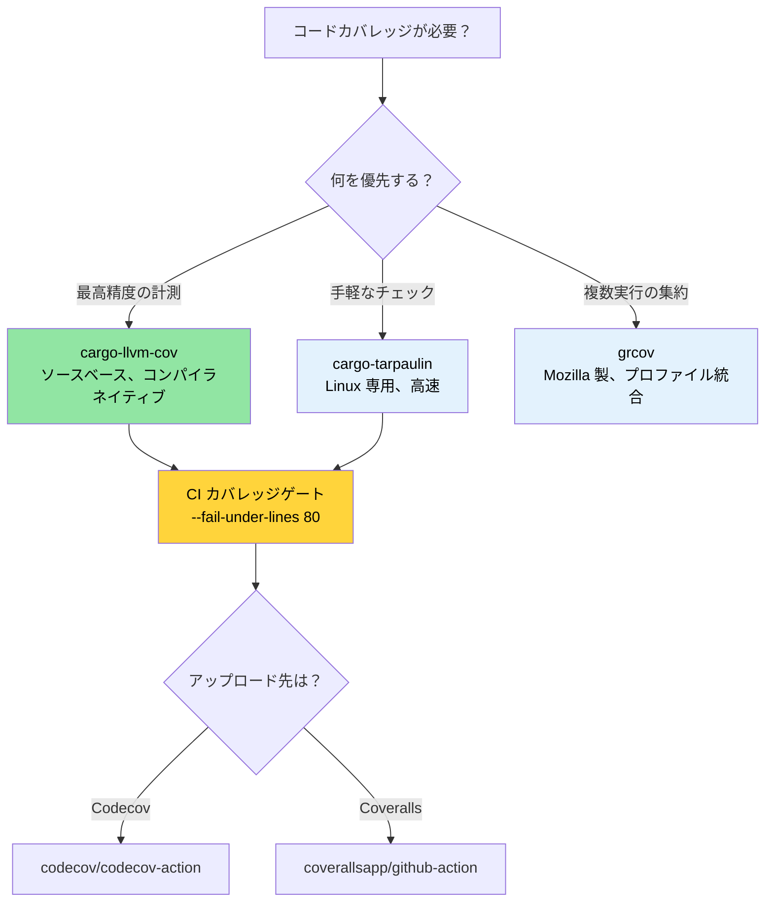

# コードカバレッジ — テストが見逃した箇所の可視化 🟢

> **学ぶこと:**
> - `cargo-llvm-cov`（最も精度の高い Rust カバレッジツール）によるソースベースカバレッジ
> - `cargo-tarpaulin` および Mozilla の `grcov` による手軽なカバレッジ計測
> - Codecov や Coveralls を用いた CI でのカバレッジゲートの設定
> - 高リスクなテスト盲点（ブラインドスポット）を優先するカバレッジ主導のテスト戦略

> **相互参照:** [Miriとサニタイザ](ch05-miri-valgrind-and-sanitizers-verifying-u.md) — カバレッジは「未テストのコード」を発見し、Miri は「テスト済みコード内の未定義動作 (UB)」を発見します · [ベンチマーク](ch03-benchmarking-measuring-what-matters.md) — カバレッジは「何がテストされたか」を示し、ベンチマークは「どれほど速いか」を示します · [CI/CD パイプライン](ch11-putting-it-all-together-a-production-cic.md) — パイプラインにおけるカバレッジゲートの組み込み

コードカバレッジは、テストがソースコードのどの行、分岐（ブランチ）、または関数を実際に実行したかを測定する指標です。カバレッジが高いからといって正しさが証明されるわけではありません（実行された行にバグが潜んでいることもあります）。しかし、いかなるテストも通過していないコードパス、すなわち**テストの盲点（ブラインドスポット）**を確実に可視化してくれます。

多数のクレートにまたがる 1,006 件のテストを抱えるプロジェクトでは、テストに対して多大な投資が行われています。カバレッジ分析は、「その投資は本当に重要なコードに届いているか？」という問いに答えてくれます。

### `llvm-cov` によるソースベースのカバレッジ

Rust は LLVM をバックエンドとして使用しており、利用可能な手法の中で最も高精度なソースベースのカバレッジインストルメンテーションを提供しています。推奨ツールは [`cargo-llvm-cov`](https://github.com/taiki-e/cargo-llvm-cov) です：

```bash
# インストール
cargo install cargo-llvm-cov

# または rustup コンポーネント経由 (生の LLVM ツール用)
rustup component add llvm-tools-preview
```

**基本的な使い方:**

```bash
# テストを実行し、ファイルごとのカバレッジサマリを表示
cargo llvm-cov

# HTML レポートを生成 (ブラウザで閲覧可能、行単位のハイライト表示)
cargo llvm-cov --html
# 出力先: target/llvm-cov/html/index.html

# LCOV 形式を生成 (CI 連携用)
cargo llvm-cov --lcov --output-path lcov.info

# ワークスペース全体のカバレッジ (すべてのクレート)
cargo llvm-cov --workspace

# 特定のパッケージのみを対象にする
cargo llvm-cov --package accel_diag --package topology_lib

# ドキュメントテストを含めてカバレッジを測定
cargo llvm-cov --doctests
```

**HTML レポートの読み方:**

```text
target/llvm-cov/html/index.html
├── Filename             │ Function │ Line   │ Branch │ Region
├─ accel_diag/src/lib.rs │  78.5%   │ 82.3%  │ 61.2%  │  74.1%
├─ sel_mgr/src/parse.rs  │  95.2%   │ 96.8%  │ 88.0%  │  93.5%
├─ topology_lib/src/..   │  91.0%   │ 93.4%  │ 79.5%  │  89.2%
└─ ...

緑 = カバー済み    赤 = 未カバー    黄 = 一部カバー (分岐の一部のみ通過)
```

**カバレッジ指標の種類と意味:**

| 種類 | 測定対象 | 意義 |
|------|------------------|-------------|
| **行カバレッジ (Line coverage)** | 実行されたソース行 | 基本的な「このコードに到達したか？」の確認 |
| **分岐カバレッジ (Branch coverage)** | 実行された `if` や `match` の各分岐 | テストされていない条件分岐の検知 |
| **関数カバレッジ (Function coverage)** | 呼び出された関数 | 使用されていないデッドコードの特定 |
| **リージョンカバレッジ (Region coverage)** | 実行されたコード領域（部分式単位） | 最も粒度の細かい網羅性の検証 |

### cargo-tarpaulin — 手軽なアプローチ

[`cargo-tarpaulin`](https://github.com/xd009642/tarpaulin) は Linux 専用のカバレッジツールで、LLVM コンポーネントの追加インストールが不要なため、より手軽にセットアップできます：

```bash
# インストール
cargo install cargo-tarpaulin

# 基本的なカバレッジレポート
cargo tarpaulin

# HTML 出力
cargo tarpaulin --out Html

# オプションを指定した実行
cargo tarpaulin \
    --workspace \
    --timeout 120 \
    --out Xml Html \
    --output-dir coverage/ \
    --exclude-files "*/tests/*" "*/benches/*" \
    --ignore-panics

# 特定のクレートを除外
cargo tarpaulin --workspace --exclude diag_tool  # バイナリクレートを除外
```

**tarpaulin vs llvm-cov の比較:**

| 項目 | cargo-llvm-cov | cargo-tarpaulin |
|---------|----------------|-----------------|
| 精度 | ソースベース（最も高精度） | ptrace ベース（過剰カウントが発生する場合あり） |
| プラットフォーム | 全プラットフォーム対応 (LLVM ベース) | Linux のみ |
| 分岐カバレッジ | 完全対応 | 限定的 |
| ドキュメントテスト | 対応 | 非対応 |
| セットアップ | `llvm-tools-preview` が必要 | 単体で完結 |
| 実行速度 | 高速（コンパイル時インストルメンテーション） | 低速（ptrace によるオーバーヘッド） |
| 安定性 | 非常に安定 | 稀に偽陽性（誤検知）あり |

**推奨事項**: 精度を重視する場合は `cargo-llvm-cov` を使用してください。LLVM ツールの追加なしで素早くチェックしたい場合は `cargo-tarpaulin` が適しています。

### grcov — Mozilla のカバレッジ集約ツール

[`grcov`](https://github.com/mozilla/grcov) は Mozilla 製のカバレッジアグリゲータです。生の LLVM プロファイリングデータを集約し、多様なフォーマットでレポートを出力します：

```bash
# インストール
cargo install grcov

# ステップ 1: カバレッジインストルメンテーション付きでビルド
export RUSTFLAGS="-Cinstrument-coverage"
export LLVM_PROFILE_FILE="target/coverage/%p-%m.profraw"
cargo build --tests

# ステップ 2: テストの実行 (.profraw ファイルが生成される)
cargo test

# ステップ 3: grcov で集約
grcov target/coverage/ \
    --binary-path target/debug/ \
    --source-dir . \
    --output-types html,lcov \
    --output-path target/coverage/report \
    --branch \
    --ignore-not-existing \
    --ignore "*/tests/*" \
    --ignore "*/.cargo/*"

# ステップ 4: レポートの確認
open target/coverage/report/html/index.html
```

**grcov を使うべきケース**: **複数の異なるテスト実行結果**（例: 単体テスト + 結合テスト + ファズテスト）を単一のレポートにマージ・集約したい場合に最も威力を発揮します。

### CI でのカバレッジ運用: Codecov と Coveralls

カバレッジデータをトラッキングサービスにアップロードし、推移グラフの確認やプルリクエストへの注記（アノテーション）を行います：

```yaml
# .github/workflows/coverage.yml
name: Code Coverage

on: [push, pull_request]

jobs:
  coverage:
    runs-on: ubuntu-latest
    steps:
      - uses: actions/checkout@v4
      - uses: dtolnay/rust-toolchain@stable
        with:
          components: llvm-tools-preview

      - name: cargo-llvm-cov のインストール
        uses: taiki-e/install-action@cargo-llvm-cov

      - name: カバレッジの生成
        run: cargo llvm-cov --workspace --lcov --output-path lcov.info

      - name: Codecov へアップロード
        uses: codecov/codecov-action@v4
        with:
          files: lcov.info
          token: ${{ secrets.CODECOV_TOKEN }}
          fail_ci_if_error: true

      # 任意: 最小カバレッジしきい値の強制
      - name: カバレッジしきい値の確認
        run: |
          cargo llvm-cov --workspace --fail-under-lines 80
          # 行カバレッジが 80% を下回った場合にビルドを失敗させる
```

**カバレッジゲート** — JSON 出力を読み取り、クレート単位で最小値を強制する：

```bash
# クレートごとのカバレッジを JSON で取得
cargo llvm-cov --workspace --json | jq '.data[0].totals.lines.percent'

# しきい値を下回った場合に失敗させる
cargo llvm-cov --workspace --fail-under-lines 80
cargo llvm-cov --workspace --fail-under-functions 70
cargo llvm-cov --workspace --fail-under-regions 60
```

### カバレッジ主導のテスト戦略

明確な戦略がなければ、カバレッジの数値自体に意味はありません。カバレッジデータを効果的に活用する方法を紹介します：

**ステップ 1: リスクに応じた優先順位付け**

```text
高カバレッジ・高リスク → ✅ 良好 — この状態を維持する
高カバレッジ・低リスク → 🔄 過剰テストの可能性 — テストが遅いなら削減を検討
低カバレッジ・高リスク → 🔴 今すぐテストを書く — バグが潜んでいる領域
低カバレッジ・低リスク → 🟡 追跡はするが慌てない
```

**ステップ 2: 行カバレッジではなく分岐カバレッジを重視する**

```rust
// 行カバレッジ 100% でも、分岐カバレッジは 50% — 依然としてリスクが高い！
pub fn classify_temperature(temp_c: i32) -> ThermalState {
    if temp_c > 105 {       // ← temp=110 でテスト済み → Critical
        ThermalState::Critical
    } else if temp_c > 85 { // ← temp=90 でテスト済み → Warning
        ThermalState::Warning
    } else if temp_c < -10 { // ← 一度もテストされていない → センサーエラー処理の見落とし
        ThermalState::SensorError
    } else {
        ThermalState::Normal  // ← temp=25 でテスト済み → Normal
    }
}
```

**ステップ 3: ノイズの除外**

```bash
# テストコード自身をカバレッジから除外 (テストコードは常に「カバー済み」と判定されるため)
cargo llvm-cov --workspace --ignore-filename-regex 'tests?\.rs$|benches/'

# 生成されたコードを除外
cargo llvm-cov --workspace --ignore-filename-regex 'target/'
```

コード内でテスト不可能なセクションをマークする：

```rust
// カバレッジツールはこのパターンを認識します
#[cfg(not(tarpaulin_include))]  // tarpaulin 用
fn unreachable_hardware_path() {
    // このパスは実際の GPU ハードウェアが接続されていないと通過しません
}

// llvm-cov の場合は、よりターゲットを絞ったアプローチをとります:
// 一部のパスには単体テストではなく結合/ハードウェアテストが必要であることを受け入れ、
// カバレッジ除外リストなどで追跡します。
```

### 補完的なテストツール

**`proptest` — プロパティベーステスト** は手書きのテストが見落としがちなエッジケースを発見します：

```toml
[dev-dependencies]
proptest = "1"
```

```rust
use proptest::prelude::*;

proptest! {
    #[test]
    fn parse_never_panics(input in "\\PC*") {
        // proptest は何千通りものランダムな文字列を自動生成します。
        // いかなる入力に対しても parse_gpu_csv がパニックを起こした場合、
        // テストは失敗し、proptest は失敗した最小の入力を特定してくれます。
        let _ = parse_gpu_csv(&input);
    }

    #[test]
    fn temperature_roundtrip(raw in 0u16..4096) {
        let temp = Temperature::from_raw(raw);
        let md = temp.millidegrees_c();
        // 特性: ミリ度は常に生データから一意に算出できるはずである
        assert_eq!(md, (raw as i32) * 625 / 10);
    }
}
```

**`insta` — スナップショットテスト** は巨大な構造化出力（JSON、テキストレポートなど）の検証に適しています：

```toml
[dev-dependencies]
insta = { version = "1", features = ["json"] }
```

```rust
#[test]
fn test_der_report_format() {
    let report = generate_der_report(&test_results);
    // 初回実行時: スナップショットファイルを作成。以降の実行時: その内容と比較検証。
    // `cargo insta review` を実行すると、差分を確認しながら対話的に受け入れることができます。
    insta::assert_json_snapshot!(report);
}
```

> **proptest / insta の導入タイミング**: 単体テストが「正常系（ハッピーパス）」ばかりになっている場合、proptest を使うことで見落としていた異常系エッジケースを発見できます。また、巨大な出力フォーマット（JSON レポートや DER レコードなど）をテストする場合、insta によるスナップショットテストのほうが手書きのアサーションよりも格段に作成・保守が容易になります。

### 実践応用：1,000以上のテストにおけるカバレッジマップ

プロジェクトには 1,000 件以上のテストが存在しますが、カバレッジの自動トラッキングは未導入です。これを導入することで、テスト投資の偏りが浮き彫りになります。カバーされていないパスは、[Miri やサニタイザ](ch05-miri-valgrind-and-sanitizers-verifying-u.md) による検証の有力な候補となります：

**推奨されるカバレッジコマンド設定:**

```bash
# ワークスペース全体のクイックカバレッジ (提案する CI コマンド)
cargo llvm-cov --workspace \
    --ignore-filename-regex 'tests?\.rs$' \
    --fail-under-lines 75 \
    --html

# クレートごとの重点的な改善用カバレッジ
for crate in accel_diag event_log topology_lib network_diag compute_diag fan_diag; do
    echo "=== $crate ==="
    cargo llvm-cov --package "$crate" --json 2>/dev/null | \
        jq -r '.data[0].totals | "Lines: \(.lines.percent | round)%  Branches: \(.branches.percent | round)%"'
done
```

**テスト密度から予想される高カバレッジのクレート:**
- `topology_lib` — 922行のゴールデンファイルテストスイートを保有
- `event_log` — `create_test_record()` ヘルパーを備えたレジストリ
- `cable_diag` — `make_test_event()` / `make_test_context()` パターン

**コード構造から予想されるカバレッジの盲点（ギャップ）:**
- IPMI 通信パスにおけるエラーハンドリング分岐
- GPU ハードウェア固有の分岐（実機 GPU が必要）
- `dmesg` パースのエッジケース（プラットフォーム依存の出力形式）

> **カバレッジの 80/20 ルール**: カバレッジを 0% から 80% に引き上げるのは比較的容易です。しかし 80% から 95% への引き上げには不自然に作り込んだテストシナリオが必要となり、95% から 100% を目指すには `#[cfg(not(...))]` による除外が必須となり、労力に見合う価値はほぼありません。現実的な下限目標としては、**行カバレッジ 80%・分岐カバレッジ 70%** を目指すのが実用的です。

### カバレッジのトラブルシューティング

| 症状 | 原因 | 解決策 |
|---------|-------|-----|
| `llvm-cov` が全ファイルで 0% を示す | インストルメンテーションが適用されていない | `cargo test` + `llvm-cov` を別々に実行するのではなく、必ず `cargo llvm-cov` を実行する |
| `unreachable!()` が未カバーとして計上される | コンパイル後のコードにその分岐が存在している | `#[cfg(not(tarpaulin_include))]` を使用するか、除外正規表現に追加する |
| カバレッジ測定中にテストバイナリがクラッシュする | インストルメンテーションとサニタイザが競合している | `cargo llvm-cov` と `-Zsanitizer=address` を同一実行で併用しない（別々に実行する） |
| `llvm-cov` と `tarpaulin` で数値が異なる | 計測技術の原理が異なる | コンパイラネイティブな `llvm-cov` を正（信頼できる情報源）とする |
| `error: profraw file is malformed` | テスト実行中にバイナリが異常終了した | 先にテストの失敗を修正する（異常終了すると profraw ファイルが破損する） |
| 分岐カバレッジが異常に低く見える | match アームや `unwrap` 等によりオプティマイザが多数の分岐を生成している | 実用的なしきい値としては*行*カバレッジを重視する（分岐カバレッジは本質的に低めに出る） |

### 自分で試してみよう

1. **プロジェクトのカバレッジ測定**: `cargo llvm-cov --workspace --html` を実行し、レポートを開いてください。カバレッジの最も低い3つのファイルを特定します。それらは単純にテストが書かれていないだけですか、それともハードウェア依存コードなどテストが本質的に難しい箇所でしょうか？
2. **カバレッジゲートの設定**: CI に `cargo llvm-cov --workspace --fail-under-lines 60` を追加してください。意図的にテストを1つコメントアウトして、CI が失敗することを確認します。その後、現在のプロジェクトの実際値マイナス 2% 程度にしきい値を調整してください。
3. **分岐カバレッジ vs 行カバレッジ**: 3つのアームを持つ `match` 式を含む関数を作成し、そのうち2つのアームのみをテストします。行カバレッジ（66% 前後）と分岐カバレッジ（50% 前後）の数値を比較してください。あなたのプロジェクトにとって、どちらの指標がより有益でしょうか？

### カバレッジツールの選定



### 🏋️ 演習問題

#### 🟢 演習 1: はじめてのカバレッジレポート

`cargo-llvm-cov` をインストールし、任意の Rust プロジェクトで実行して HTML レポートを開いてください。行カバレッジの最も低い3つのファイルを特定します。

<details>
<summary>解答例</summary>

```bash
cargo install cargo-llvm-cov
cargo llvm-cov --workspace --html --open
# レポートはカバレッジ順に並び替え可能 — 最下部に低いファイルが集まる
# 50% 未満のファイルを探す — それらがテストの盲点（ブラインドスポット）
```
</details>

#### 🟡 演習 2: CI カバレッジゲート

行カバレッジが 60% を下回った場合に失敗するカバレッジゲートを GitHub Actions ワークフローに追加してください。テストを1つコメントアウトして、ゲートが正しく失敗することを確認します。

<details>
<summary>解答例</summary>

```yaml
# .github/workflows/coverage.yml
name: Coverage
on: [push, pull_request]
jobs:
  coverage:
    runs-on: ubuntu-latest
    steps:
      - uses: actions/checkout@v4
      - uses: dtolnay/rust-toolchain@stable
        with:
          components: llvm-tools-preview
      - run: cargo install cargo-llvm-cov
      - run: cargo llvm-cov --workspace --fail-under-lines 60
```

テストをコメントアウトしてプッシュし、ワークフローが正しく失敗することを確認してください。
</details>

### 重要なまとめ

- `cargo-llvm-cov` は Rust において最も精度の高いカバレッジツールです — コンパイラ自身のインストルメンテーションを活用します。
- カバレッジは正しさを証明するものではありませんが、**「カバレッジ 0%」は「テストが全く存在しない」ことを証明します** — テストの盲点を発見するために活用してください。
- リグレッションを未然に防ぐため、CI にカバレッジゲート（例: `--fail-under-lines 80`）を設定してください。
- 100% カバレッジを盲目的に追い求めず、高リスクなコードパス（エラーハンドリング、unsafe、パース処理など）に注力してください。
- 同一の実行内でカバレッジ計測とサニタイザを併用しないでください。

---
