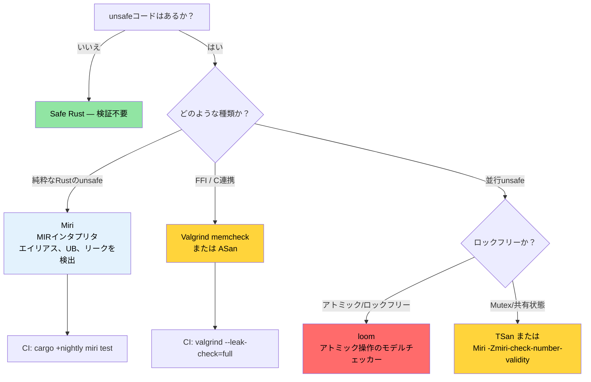

# Miri、Valgrind、サニタイザ — Unsafeコードの検証 🔴

> **学習目標:**
> - MIRインタプリタとしてのMiri — 検知できるもの（エイリアス、未定義動作（UB）、リーク）と検知できないもの（FFI、システムコール）
> - Valgrind memcheck、Helgrind（データ競合）、Callgrind（プロファイリング）、Massif（ヒープ）
> - LLVMサニタイザ: nightly の `-Zbuild-std` を用いた ASan、MSan、TSan、LSan
> - クラッシュ発見のための `cargo-fuzz` と並行性モデル検証のための `loom`
> - 適切な検証ツールを選択するための決定木
>
> **相互参照:** [コードカバレッジ](ch04-code-coverage-seeing-what-tests-miss.md) — カバレッジはテストされていないパスを発見し、Miriはテスト済みのパスを検証します · [`no_std` とフィーチャー](ch09-no-std-and-feature-verification.md) — `no_std` コードではしばしばMiriで検証可能な `unsafe` が必要になります · [CI/CDパイプライン](ch11-putting-it-all-together-a-production-cic.md) — パイプラインにおけるMiriジョブ

安全なRust（Safe Rust）は、コンパイル時にメモリ安全性とデータ競合フリーを保証します。しかし、FFI、独自データ構造の実装、またはパフォーマンス上の最適化などのために `unsafe` を記述した瞬間、それらの保証を維持することは*開発者自身*の責任になります。本章では、記述した `unsafe` コードが謳っている安全性コントラクトを実際に満たしているかどうかを検証するためのツール群について解説します。

### Miri — Unsafe Rustのためのインタプリタ

[Miri](https://github.com/rust-lang/miri) は、Rustの中間表現であるMIR（Mid-level Intermediate Representation）の**インタプリタ**です。マシンコードへコンパイルする代わりに、Miriはすべての操作において未定義動作（Undefined Behavior: UB）の網羅的なチェックを行いながら、プログラムをステップ単位で*実行*します。

```bash
# Miriをインストール（nightly専用コンポーネント）
rustup +nightly component add miri

# Miri環境下でテストスイートを実行
cargo +nightly miri test

# Miri環境下で特定のバイナリを実行
cargo +nightly miri run

# 特定のテストを実行
cargo +nightly miri test -- test_name
```

**Miriの仕組み:**

```text
ソースコード → rustc → MIR → MiriがMIRを解釈・実行
                               │
                               ├─ すべてのポインタのprovenance（出所）を追跡
                               ├─ すべてのメモリアクセスを検証
                               ├─ すべての参照外し時のアライメントをチェック
                               ├─ use-after-free（解放後使用）を検出
                               ├─ データ競合を検出（マルチスレッド時）
                               └─ Stacked Borrows / Tree Borrowsルールを強制
```

### Miriが検知できるもの（および検知できないもの）

**Miriが検出するもの:**

| カテゴリ | 例 | 実行時にクラッシュするか？ |
|----------|-----|------------------------|
| 境界外アクセス | アロケーション範囲外への `ptr.add(100).read()` | 場合による（ページレイアウトに依存） |
| 解放後使用（Use-after-free） | 生ポインタ経由でドロップ済みの `Box` を読み取る | 場合による（アロケータに依存） |
| 二重解放（Double free） | `drop_in_place` を2回呼び出す | 通常はクラッシュする |
| アライメント違反のアクセス | 奇数アドレスでの `(ptr as *const u32).read()` | 一部のアーキテクチャでクラッシュ |
| 不正な値の生成 | `transmute::<u8, bool>(2)` | 静かに壊れたまま動作する |
| ダングリング参照 | 解放済みptrに対する `&*ptr` | クラッシュしない（サイレントな破損） |
| データ競合 | 同期なしで2つのスレッドが動作（一方が書き込み） | 間欠的で再現が極めて困難 |
| Stacked Borrows違反 | `&mut` 参照のエイリアス違反 | クラッシュしない（サイレントな破損） |

**Miriが検出しない（できない）もの:**

| 制限事項 | 理由 |
|-----------|-----|
| ロジックのバグ | Miriはメモリ安全性を検証するものであり、論理的正しさは検証しない |
| 並行処理のデッドロック | Miriはデータ競合をチェックするが、ライブロック/デッドロックはチェックしない |
| パフォーマンス問題 | インタプリタ実行のため、ネイティブ実行より10〜100倍遅い |
| OS/ハードウェアとのやり取り | MiriはシステムコールやデバイスI/Oを完全にはエミュレートできない |
| すべてのFFI呼び出し | C言語コードは解釈できない（RustのMIRのみ解釈可能） |
| 網羅的なパスカバレッジ | テストスイートが到達した実行パスのみを検証する |

**具体例 — 実際には「動いてしまう」不健全（unsound）なコードの検知:**

```rust
#[cfg(test)]
mod tests {
    #[test]
    fn test_miri_catches_ub() {
        // これはリリースビルドでは「動作」してしまう可能性がありますが、未定義動作です
        let mut v = vec![1, 2, 3];
        let ptr = v.as_ptr();

        // pushによって再アロケーションが発生し、ptrが無効化される可能性があります
        v.push(4);

        // ❌ UB: 再アロケーション後、ptrはダングリングポインタになる可能性があります
        // アロケータがたまたまバッファを移動しなかった場合でも、
        // Miriはこれを確実に検出します。
        // let _val = unsafe { *ptr };
        // エラー: Miriは次のように報告します:
        //   "pointer to alloc1234 was dereferenced after this
        //    allocation got freed"
        
        // ✅ 正しいコード: 変更後に新しいポインタを取得する
        let ptr = v.as_ptr();
        let val = unsafe { *ptr };
        assert_eq!(val, 1);
    }
}
```

### 実際のクレートでMiriを実行する

**`unsafe` を含むクレートでの実践的なMiriワークフロー:**

```bash
# ステップ 1: Miri環境下ですべてのテストを実行
cargo +nightly miri test 2>&1 | tee miri_output.txt

# ステップ 2: Miriがエラーを報告した場合、対象のテストを切り分ける
cargo +nightly miri test -- failing_test_name

# ステップ 3: 診断のためにMiriのバックトレースを有効化
MIRIFLAGS="-Zmiri-backtrace=full" cargo +nightly miri test

# ステップ 4: 借用モデルの選択
# Stacked Borrows（デフォルト、より厳格）:
cargo +nightly miri test

# Tree Borrows（実験的、より寛容）:
MIRIFLAGS="-Zmiri-tree-borrows" cargo +nightly miri test
```

**一般的なシナリオ向けのMiriフラグ:**

```bash
# アイソレーション（分離）を無効化（ファイルシステムアクセスや環境変数を許可）
MIRIFLAGS="-Zmiri-disable-isolation" cargo +nightly miri test

# Miriではメモリリーク検出がデフォルトで有効になっています。
# （意図的なリークなどで）リークエラーを抑制する場合:
# MIRIFLAGS="-Zmiri-ignore-leaks" cargo +nightly miri test

# ランダム化テストで結果を再現可能にするためRNGシードを固定
MIRIFLAGS="-Zmiri-seed=42" cargo +nightly miri test

# 厳格なprovenance（出所）チェックを有効化
MIRIFLAGS="-Zmiri-strict-provenance" cargo +nightly miri test

# 複数フラグの組み合わせ
MIRIFLAGS="-Zmiri-disable-isolation -Zmiri-backtrace=full -Zmiri-strict-provenance" \
    cargo +nightly miri test
```

**CI環境でのMiri:**

```yaml
# .github/workflows/miri.yml
name: Miri
on: [push, pull_request]

jobs:
  miri:
    runs-on: ubuntu-latest
    steps:
      - uses: actions/checkout@v4
      - uses: dtolnay/rust-toolchain@nightly
        with:
          components: miri

      - name: Run Miri
        run: cargo miri test --workspace
        env:
          MIRIFLAGS: "-Zmiri-backtrace=full"
          # リークチェックはデフォルトで有効です。
          # Miriが処理できないシステムコール（ファイルI/O、ネットワーキング等）を
          # 使用するテストは除外してください。
```

> **パフォーマンスに関する注意**: Miriはネイティブ実行よりも10〜100倍遅くなります。ネイティブで5秒で完了するテストスイートが、Miriでは5分かかる場合があります。CIでは、`unsafe` コードを含むクレートのみに絞ってMiriを実行することをお勧めします。

### ValgrindとRustでの連携

[Valgrind](https://valgrind.org/) は、古典的なC/C++向けのメモリチェッカーです。コンパイル済みのRustバイナリに対しても機能し、マシンコードレベルでメモリエラーを検査します。

```bash
# Valgrindのインストール
sudo apt install valgrind  # Debian/Ubuntu
sudo dnf install valgrind  # Fedora

# デバッグ情報付きでビルド（Valgrindにはシンボルが必要）
cargo build --tests
# またはデバッグ情報付きのリリースビルド:
# cargo build --release
# [profile.release]
# debug = true

# 特定のテストバイナリをValgrind下で実行
valgrind --tool=memcheck \
    --leak-check=full \
    --show-leak-kinds=all \
    --track-origins=yes \
    ./target/debug/deps/my_crate-abc123 --test-threads=1

# メインバイナリを実行
valgrind --tool=memcheck \
    --leak-check=full \
    --error-exitcode=1 \
    ./target/debug/diag_tool --run-diagnostics
```

**memcheck以外のValgrindツール:**

| ツール | コマンド | 検知内容 |
|------|---------|---------|
| **Memcheck** | `--tool=memcheck` | メモリリーク、use-after-free、バッファオーバーフロー |
| **Helgrind** | `--tool=helgrind` | データ競合およびロック順序違反 |
| **DRD** | `--tool=drd` | データ競合（異なる検知アルゴリズムを使用） |
| **Callgrind** | `--tool=callgrind` | CPU命令プロファイリング（パス単位） |
| **Massif** | `--tool=massif` | 時系列でのヒープメモリプロファイリング |
| **Cachegrind** | `--tool=cachegrind` | キャッシュミス分析 |

**Callgrindを使用した命令レベルのプロファイリング:**

```bash
# 命令数を記録（実時間よりも安定した測定が可能）
valgrind --tool=callgrind \
    --callgrind-out-file=callgrind.out \
    ./target/release/diag_tool --run-diagnostics

# KCachegrindで可視化
kcachegrind callgrind.out
# またはテキストベースの代替手段:
callgrind_annotate callgrind.out | head -100
```

**Miri と Valgrind の比較 — どちらを使うべきか:**

| 観点 | Miri | Valgrind |
|--------|------|----------|
| Rust特有のUBチェック | ✅ Stacked/Tree Borrows | ❌ Rustのルールを認識しない |
| C FFIコードのチェック | ❌ Cコードは解釈不可 | ✅ すべてのマシンコードを検査 |
| nightlyが必要か | ✅ 必要 | ❌ 不要 |
| 実行速度 | 10〜100倍遅い | 10〜50倍遅い |
| プラットフォーム | 任意（MIRを解釈） | Linux、macOS（ネイティブコードを実行） |
| データ競合の検出 | ✅ 可能 | ✅ 可能（Helgrind/DRD） |
| リーク検出 | ✅ 可能 | ✅ 可能（より網羅的） |
| 誤検知（偽陽性） | 極めて稀 | 時折発生（特にアロケータ関連） |

**両方の併用:**
- **Miri**: 純粋なRustの `unsafe` コード（Stacked Borrows、provenance）の検証
- **Valgrind**: FFIを多用するコードおよびプログラム全体のリーク分析

### AddressSanitizer、MemorySanitizer、ThreadSanitizer

LLVMサニタイザは、コンパイル時にランタイムチェックを挿入するインストルメンテーションパスです。Valgrindよりも高速であり（オーバーヘッドはValgrindの10〜50倍に対して2〜5倍）、異なる種類のバグを検出できます。

```bash
# 必須: サニタイザのインストルメンテーション付きでstdを再構築するためのRustソースのインストール
rustup component add rust-src --toolchain nightly

# AddressSanitizer (ASan) — バッファオーバーフロー、use-after-free、スタックオーバーフロー
RUSTFLAGS="-Zsanitizer=address" \
    cargo +nightly test -Zbuild-std --target x86_64-unknown-linux-gnu

# MemorySanitizer (MSan) — 未初期化メモリの読み取り
RUSTFLAGS="-Zsanitizer=memory" \
    cargo +nightly test -Zbuild-std --target x86_64-unknown-linux-gnu

# ThreadSanitizer (TSan) — データ競合
RUSTFLAGS="-Zsanitizer=thread" \
    cargo +nightly test -Zbuild-std --target x86_64-unknown-linux-gnu

# LeakSanitizer (LSan) — メモリリーク（ASanにデフォルトで含まれています）
RUSTFLAGS="-Zsanitizer=leak" \
    cargo +nightly test --target x86_64-unknown-linux-gnu
```

> **注意**: ASan、MSan、TSanは、サニタイザ用のインストルメンテーション付きで標準ライブラリを再構築するために `-Zbuild-std` が必要です。LSanは不要です。

**サニタイザの比較:**

| サニタイザ | オーバーヘッド | 検知対象 | nightlyが必要か？ | `-Zbuild-std` が必要か？ |
|-----------|----------|---------|----------|----------------|
| **ASan** | メモリ2倍、CPU2倍 | バッファオーバーフロー、use-after-free、スタックオーバーフロー | はい | はい |
| **MSan** | メモリ3倍、CPU3倍 | 未初期化メモリの読み取り | はい | はい |
| **TSan** | メモリ5〜10倍、CPU5倍 | データ競合 | はい | はい |
| **LSan** | 最小限 | メモリリーク | はい | いいえ |

**実践例 — TSanでデータ競合を検出する:**

```rust
use std::sync::Arc;
use std::thread;

fn racy_counter() -> u64 {
    // ❌ UB: 同期されていない共有可変状態
    let data = Arc::new(std::cell::UnsafeCell::new(0u64));
    let mut handles = vec![];

    for _ in 0..4 {
        let data = Arc::clone(&data);
        handles.push(thread::spawn(move || {
            for _ in 0..1000 {
                // SAFETY: 不健全（UNSOUND）— データ競合！
                unsafe {
                    *data.get() += 1;
                }
            }
        }));
    }

    for h in handles {
        h.join().unwrap();
    }

    // 値は4000になるはずですが、競合により任意の値になり得ます
    unsafe { *data.get() }
}

// MiriとTSanの両方がこれを検出します:
// Miri:  "Data race detected between (1) write and (2) write"
// TSan:  "WARNING: ThreadSanitizer: data race"
//
// 修正方法: AtomicU64 または Mutex<u64> を使用する
```

### 関連ツール: ファジングと並行性検証

**`cargo-fuzz` — カバレッジ誘導型ファジング**（パーサーやデコーダーのクラッシュを発見）:

```bash
# インストール
cargo install cargo-fuzz

# ファズターゲットの初期化
cargo fuzz init
cargo fuzz add parse_gpu_csv
```

```rust
// fuzz/fuzz_targets/parse_gpu_csv.rs
#![no_main]
use libfuzzer_sys::fuzz_target;

fuzz_target!(|data: &[u8]| {
    if let Ok(s) = std::str::from_utf8(data) {
        // ファザーは何百万もの入力を生成し、パニックやクラッシュを探索します
        let _ = diag_tool::parse_gpu_csv(s);
    }
});
```

```bash
# ファザーの実行（中断されるかクラッシュが見つかるまで実行）
cargo +nightly fuzz run parse_gpu_csv -- -max_total_time=300  # 5分間

# クラッシュ入力の最小化
cargo +nightly fuzz tmin parse_gpu_csv artifacts/parse_gpu_csv/crash-...
```

> **ファジングを適用すべき場面**: 信頼できない/準信頼の入力（センサー出力、設定ファイル、ネットワークデータ、JSON/CSV）をパースするあらゆる関数。ファジングは、主要なRustパーサークレート（serde、regex、imageなど）のすべてで実際のバグを発見してきました。

**`loom` — 並行性モデルチェッカー**（アトミックの順序付けを網羅的にテスト）:

```toml
[dev-dependencies]
loom = "0.7"
```

```rust
#[cfg(loom)]
mod tests {
    use loom::sync::atomic::{AtomicUsize, Ordering};
    use loom::thread;

    #[test]
    fn test_counter_is_atomic() {
        loom::model(|| {
            let counter = loom::sync::Arc::new(AtomicUsize::new(0));
            let c1 = counter.clone();
            let c2 = counter.clone();

            let t1 = thread::spawn(move || { c1.fetch_add(1, Ordering::SeqCst); });
            let t2 = thread::spawn(move || { c2.fetch_add(1, Ordering::SeqCst); });

            t1.join().unwrap();
            t2.join().unwrap();

            // loomはスレッドのすべての可能なインターリーブ（交互実行順序）を探索します
            assert_eq!(counter.load(Ordering::SeqCst), 2);
        });
    }
}
```

> **`loom` を使うべき場面**: ロックフリーデータ構造やカスタム同期プリミティブを実装する場合。Loomはスレッドのインターリーブを網羅的に探索します — これはストレステストではなく、モデルチェッカーです。`Mutex` や `RwLock` ベースの通常のコードには不要です。

### どのツールをいつ使うべきか

```text
Unsafe検証のための決定木:

コードは純粋なRust（FFIなし）か？
├─ はい → Miriを使用（Rust特有のUB、Stacked Borrowsを検出）
│         多層防御のためCIでASanも実行
└─ いいえ（FFI経由でC/C++コードを呼び出す）
   ├─ メモリ安全性に懸念があるか？
   │  └─ はい → Valgrind memcheck および ASan を使用
   ├─ 並行処理に懸念があるか？
   │  └─ はい → TSan（高速）または Helgrind（より網羅的）を使用
   └─ メモリリークに懸念があるか？
      └─ はい → Valgrind --leak-check=full を使用
```

**推奨されるCIマトリクス:**

```yaml
# 高速なフィードバックを得るために全ツールを並列実行
jobs:
  miri:
    runs-on: ubuntu-latest
    steps:
      - uses: dtolnay/rust-toolchain@nightly
        with: { components: miri }
      - run: cargo miri test --workspace

  asan:
    runs-on: ubuntu-latest
    steps:
      - uses: dtolnay/rust-toolchain@nightly
      - run: |
          RUSTFLAGS="-Zsanitizer=address" \
          cargo test -Zbuild-std --target x86_64-unknown-linux-gnu

  valgrind:
    runs-on: ubuntu-latest
    steps:
      - run: sudo apt-get install -y valgrind
      - uses: dtolnay/rust-toolchain@stable
      - run: cargo build --tests
      - run: |
          for test_bin in $(find target/debug/deps -maxdepth 1 -executable -type f ! -name '*.d'); do
            valgrind --error-exitcode=1 --leak-check=full "$test_bin" --test-threads=1
          done
```

### 実践応用: Unsafeゼロ — そしてそれが必要になるとき

本プロジェクトには、9万行を超えるRustコードの中で **`unsafe` ブロックがゼロ** です。これはシステムレベルの診断ツールとしては驚くべき成果であり、安全なRust（Safe Rust）が以下の用途に十分であることを示しています:
- IPMI通信（`ipmitool` への `std::process::Command` 経由）
- GPU問い合わせ（`accel-query` への `std::process::Command` 経由）
- PCIeトポロジの解析（純粋なJSON/テキストパース）
- SELレコード管理（純粋なデータ構造）
- DERレポート生成（JSONシリアライゼーション）

**プロジェクトで `unsafe` が必要になるのはいつか？**

`unsafe` を導入する契機となり得るシナリオ:

| シナリオ | `unsafe` が必要な理由 | 推奨される検証方法 |
|----------|---------------------|-------------------|
| ioctlベースの直接IPMI | `libc::ioctl()` により `ipmitool` サブプロセスを回避 | Miri + Valgrind |
| 直接のGPUドライバ問い合わせ | `accel-query` パースに代わる accel-mgmt FFI | Valgrind（Cライブラリ） |
| メモリマップドPCIe設定 | 設定空間直接読み取りのための `mmap` | ASan + Valgrind |
| ロックフリーSELバッファ | 並行イベント収集のための `AtomicPtr` | Miri + TSan |
| 組込み/no_std版 | ベアメタル向けの生ポインタ操作 | Miri |

**準備**: `unsafe` を導入する前に、検証ツールをCIに追加しておきます:

```toml
# Cargo.toml — unsafe最適化のためのフィーチャーフラグを追加
[features]
default = []
direct-ipmi = []     # ipmitoolサブプロセスの代わりにioctlによる直接IPMIを有効化
direct-accel-api = []     # accel-queryパースの代わりにaccel-mgmt FFIを有効化
```

```rust
// src/ipmi.rs — フィーチャーフラグの背後に配置
#[cfg(feature = "direct-ipmi")]
mod direct {
    //! /dev/ipmi0 ioctl 経由の直接IPMIデバイスアクセス。
    //!
    //! # Safety
    //! このモジュールはioctlシステムコールのために `unsafe` を使用します。
    //! 検証済み: Miri（可能な範囲）、Valgrind memcheck、ASan。

    use std::os::unix::io::RawFd;

    // ... unsafe な ioctl 実装 ...
}

#[cfg(not(feature = "direct-ipmi"))]
mod subprocess {
    //! ipmitoolサブプロセス経由のIPMI（デフォルト、完全セーフ）。
    // ... 現在の実装 ...
}
```

> **重要な洞察**: `unsafe` は[フィーチャーフラグ](ch09-no-std-and-feature-verification.md)の背後に配置し、独立して検証できるようにします。[CI](ch11-putting-it-all-together-a-production-cic.md) で `cargo +nightly miri test --features direct-ipmi` を実行することで、安全なデフォルトビルドに影響を与えることなく、unsafeなコードパスを継続的に検証できます。

### `cargo-careful` — Stableにおける追加のUBチェック

[`cargo-careful`](https://github.com/RalfJung/cargo-careful) は、標準ライブラリの追加チェックを有効化してコードを実行します。nightlyやMiriの10〜100倍の処理速度低下を伴うことなく、通常のビルドでは無視される一部の未定義動作を検出できます。

```bash
# インストール（nightlyが必要ですが、コードはほぼネイティブの速度で実行されます）
cargo install cargo-careful

# 追加のUBチェック付きでテストを実行（未初期化メモリ、無効な値を検出）
cargo +nightly careful test

# 追加チェック付きでバイナリを実行
cargo +nightly careful run -- --run-diagnostics
```

**`cargo-careful` が検出する通常ビルドでは見逃される問題:**
- `MaybeUninit` や `zeroed()` における未初期化メモリの読み取り
- transmuteによる無効な `bool`、`char`、またはenum値の生成
- アライメントされていないポインタの読み取り/書き込み
- 重複する範囲に対する `copy_nonoverlapping` の使用

**検証の段階における位置づけ:**

```text
最小のオーバーヘッド                                      最も網羅的
├─ cargo test ──► cargo careful test ──► Miri ──► ASan ──► Valgrind ─┤
│  (オーバーヘッド 0倍) (~1.5倍)          (10-100倍) (2倍)    (10-50倍)  │
│  Safe Rustのみ   一部のUBを検出         純粋Rust   FFI+Rust FFI+Rust   │
```

> **推奨事項**: 高速な安全性チェックとして、CIに `cargo +nightly careful test` を追加してください。Miriとは異なりほぼネイティブの速度で実行され、安全なRustの抽象化によって隠蔽されがちな実際のバグを検出できます。

### Miriとサニタイザのトラブルシューティング

| 症状 | 原因 | 対処法 |
|---------|-------|-----|
| `Miri does not support FFI` | MiriはRustインタプリタであり、Cコードを実行できません | 代わりにFFIコードにはValgrindまたはASanを使用します |
| `error: unsupported operation: can't call foreign function` | Miriが `extern "C"` 呼び出しに遭遇しました | FFI境界をモックするか、`#[cfg(miri)]` で分離します |
| `Stacked Borrows violation` | エイリアス規則の違反 — たとえコードが「動作」していても発生します | Miriの指摘が正しいため、`&mut` と `&` のエイリアスを避けるようリファクタリングします |
| サニタイザが `DEADLYSIGNAL` を出力 | ASanがバッファオーバーフローを検出しました | 配列のインデックス指定、スライス操作、ポインタ演算を点検します |
| `LeakSanitizer: detected memory leaks` | `Box::leak()`、`forget()`、または `drop()` の欠落 | 意図的な場合: `__lsan_disable()` で抑制。意図しない場合: リークを修正します |
| Miriの実行が極めて遅い | Miriはコンパイルではなく解釈実行するため10〜100倍遅くなります | `--lib` テストのみを実行するか、遅いテストに `#[cfg_attr(miri, ignore)]` を付与します |
| アトミック操作で `TSan: false positive` が発生 | TSanがRustのアトミック順序付けモデルを完全には理解していない | 特定の抑制ルールを記述した `TSAN_OPTIONS=suppressions=tsan.supp` を追加します |

### 自分で試してみよう

1. **MiriによるUB検出を体験する**: 同一の `i32` に対する2つの `&mut` 参照を作成する `unsafe` 関数を作成します（エイリアス規則違反）。`cargo +nightly miri test` を実行し、「Stacked Borrows」エラーを確認してください。`UnsafeCell` や別個のアロケーションを使用して修正してみましょう。

2. **意図的なバグに対してASanを実行する**: `unsafe` を使って配列の範囲外アクセスを行うテストを作成します。`RUSTFLAGS="-Zsanitizer=address"` でビルドし、ASanのレポートを観察してください。問題の行番号が正確に特定される点に注目してください。

3. **Miriのオーバーヘッドをベンチマークする**: 同一のテストスイートに対して `cargo test --lib` と `cargo +nightly miri test --lib` の実行時間を計測します。速度低下の倍率を計算してください。その結果に基づいて、CIでMiriを実行すべきテストと、`#[cfg_attr(miri, ignore)]` でスキップすべきテストを判断してください。

### 安全性検証の決定木



### 🏋️ 演習問題

#### 🟡 演習 1: MiriによるUB検出の再現

同一の `i32` に対する2つの `&mut` 参照を作成する `unsafe` 関数を作成します（エイリアス違反）。`cargo +nightly miri test` を実行してStacked Borrowsエラーを確認し、それを修正してください。

<details>
<summary>解答例</summary>

```rust
#[cfg(test)]
mod tests {
    #[test]
    fn aliasing_ub() {
        let mut x: i32 = 42;
        let ptr = &mut x as *mut i32;
        unsafe {
            // バグ: 同一のメモリ位置に対する2つの &mut 参照
            let _a = &mut *ptr;
            let _b = &mut *ptr; // Miri: Stacked Borrows違反！
        }
    }
}
```

修正方法: 別のアロケーションを使用するか、`UnsafeCell` を使用します:

```rust
use std::cell::UnsafeCell;

#[test]
fn no_aliasing_ub() {
    let x = UnsafeCell::new(42);
    unsafe {
        let a = &mut *x.get();
        *a = 100;
    }
}
```
</details>

#### 🔴 演習 2: ASanによる境界外アクセスの検出

`unsafe` による配列の範囲外アクセスを含むテストを作成します。nightlyツールチェーンで `RUSTFLAGS="-Zsanitizer=address"` を指定してビルドし、ASanのレポートを確認してください。

<details>
<summary>解答例</summary>

```rust
#[test]
fn oob_access() {
    let arr = [1u8, 2, 3, 4, 5];
    let ptr = arr.as_ptr();
    unsafe {
        let _val = *ptr.add(10); // 境界外アクセス！
    }
}
```

```bash
RUSTFLAGS="-Zsanitizer=address" cargo +nightly test -Zbuild-std \
  --target x86_64-unknown-linux-gnu -- oob_access
# ASanレポート: stack-buffer-overflow at <exact address>
```
</details>

### 本章のまとめ

- **Miri** は純粋なRustの `unsafe` を検証するためのツールです — コンパイルが通りテストに合格してしまうエイリアス違反、use-after-free、リークを検出します
- **Valgrind** はFFI/C連携コード向けのツールです — 再コンパイルなしで最終バイナリに対して動作します
- **サニタイザ**（ASan、TSan、MSan）はnightlyを必要としますが、ほぼネイティブに近い速度で実行できるため、大規模なテストスイートに最適です
- **`loom`** はロックフリー並行データ構造の検証に特化したツールです
- プッシュごとにCIでMiriを実行し、メインパイプラインの遅延を避けるためにサニタイザはnightlyスケジュールで実行するのが推奨されます

---
