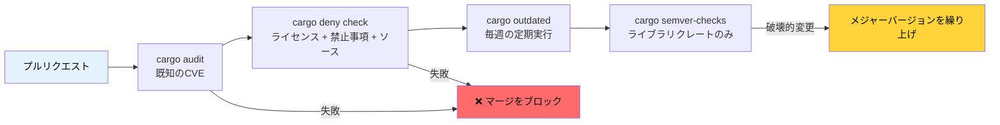

# 依存関係管理とサプライチェーンセキュリティ 🟢

> **学習目標:**
> - `cargo-audit` による既知の脆弱性のスキャン
> - `cargo-deny` によるライセンス、アドバイザリ、ソースポリシーの強制
> - Mozillaの `cargo-vet` によるサプライチェーンの信頼検証
> - 古くなった依存関係の追跡とAPI破壊的変更の検出
> - 依存関係ツリーの可視化と重複排除
>
> **相互参照:** [リリースプロファイル](ch07-release-profiles-and-binary-size.md) — `cargo-udeps` はここで見つかった未使用の依存関係を削減します · [CI/CDパイプライン](ch11-putting-it-all-together-a-production-cic.md) — パイプラインにおける audit および deny ジョブ · [ビルドスクリプト](ch01-build-scripts-buildrs-in-depth.md) — `build-dependencies` もサプライチェーンの一部です

Rustのバイナリには、自分で書いたコードだけでなく、`Cargo.lock` に含まれるすべての推移的依存関係（transitive dependencies）が含まれます。その依存ツリーのどこかに脆弱性、ライセンス違反、または悪意のあるクレートが存在すれば、それは直ちに*あなた自身の*問題となります。本章では、依存関係の管理を監査可能かつ自動化するためのツール群について解説します。

### cargo-audit — 既知の脆弱性スキャン

[`cargo-audit`](https://github.com/rustsec/rustsec/tree/main/cargo-audit) は、公開されているクレートの既知の脆弱性を追跡する [RustSec Advisory Database](https://rustsec.org/) と照合して、自身の `Cargo.lock` を検査します。

```bash
# インストール
cargo install cargo-audit

# 既知の脆弱性をスキャン
cargo audit

# 出力例:
# Crate:     chrono
# Version:   0.4.19
# Title:     Potential segfault in localtime_r invocations
# Date:      2020-11-10
# ID:        RUSTSEC-2020-0159
# URL:       https://rustsec.org/advisories/RUSTSEC-2020-0159
# Solution:  Upgrade to >= 0.4.20

# 脆弱性が存在する場合に検査を失敗させCIをブロックする
cargo audit --deny warnings

# 自動処理用のJSON出力を生成
cargo audit --json

# Cargo.lockを更新して脆弱性を修正
cargo audit fix
```

**CIへの統合:**

```yaml
# .github/workflows/audit.yml
name: Security Audit
on:
  schedule:
    - cron: '0 0 * * *'  # 毎日チェック — アドバイザリは継続的に公開される
  push:
    paths: ['Cargo.lock']

jobs:
  audit:
    runs-on: ubuntu-latest
    steps:
      - uses: actions/checkout@v4
      - uses: rustsec/audit-check@v2
        with:
          token: ${{ secrets.GITHUB_TOKEN }}
```

### cargo-deny — 包括的なポリシー強制

[`cargo-deny`](https://github.com/EmbarkStudios/cargo-deny) は、単なる脆弱性スキャンにとどまりません。以下の4つの側面からポリシーを強制します:

1. **Advisories（アドバイザリ）** — 既知の脆弱性（cargo-auditと同様）
2. **Licenses（ライセンス）** — 許可/禁止ライセンスのリスト
3. **Bans（禁止事項）** — 禁止クレートや重複バージョンの検知
4. **Sources（ソース）** — 許可されたレジストリおよびGitソース

```bash
# インストール
cargo install cargo-deny

# 設定の初期化
cargo deny init
# ドキュメント付きのデフォルト設定 deny.toml が生成される

# すべてのチェックを実行
cargo deny check

# 特定のチェックのみを実行
cargo deny check advisories
cargo deny check licenses
cargo deny check bans
cargo deny check sources
```

**`deny.toml` の設定例:**

```toml
# deny.toml

[advisories]
vulnerability = "deny"        # 既知の脆弱性があれば失敗
unmaintained = "warn"         # メンテナンスされていないクレートは警告
yanked = "deny"               # yank（取り下げ）されたクレートは失敗
notice = "warn"               # 情報提供のアドバイザリは警告

[licenses]
unlicensed = "deny"           # すべてのクレートにライセンスが必須
allow = [
    "MIT",
    "Apache-2.0",
    "BSD-2-Clause",
    "BSD-3-Clause",
    "ISC",
    "Unicode-DFS-2016",
]
copyleft = "deny"             # このプロジェクトではGPL/LGPL/AGPLを禁止
default = "deny"              # 明示的に許可されていないライセンスはすべて拒否

[bans]
multiple-versions = "warn"    # 同一クレートが2つのバージョンで存在する場合は警告
wildcards = "deny"            # 依存関係で path = "*" を禁止
highlight = "all"             # 最初の1つだけでなくすべての重複を表示

# 特定の問題のあるクレートを禁止
deny = [
    # openssl-sys はC言語のOpenSSLを引き込むため、rustls を優先する
    { name = "openssl-sys", wrappers = ["native-tls"] },
]

# 特定の重複バージョンを許可（不可避な場合）
[[bans.skip]]
name = "syn"
version = "1.0"               # syn 1.x と 2.x は共存することが多い

[sources]
unknown-registry = "deny"     # crates.io のみ許可
unknown-git = "deny"          # 出所不明のGit依存関係を禁止
allow-registry = ["https://github.com/rust-lang/crates.io-index"]
```

**ライセンスの強制** は、商用プロジェクトにおいて特に重要です:

```bash
# 依存関係ツリーにどのライセンスが含まれているかを確認
cargo deny list

# 出力例:
# MIT          — 127 crates
# Apache-2.0   — 89 crates
# BSD-3-Clause — 12 crates
# MPL-2.0      — 3 crates   ← 法務部門のレビューが必要な可能性がある
# Unicode-DFS  — 1 crate
```

### cargo-vet — サプライチェーンの信頼検証

Mozilla発の [`cargo-vet`](https://github.com/mozilla/cargo-vet) は、異なる問いに対応します。それは「このクレートに既知のバグがあるか？」ではなく、「**信頼できる人間がこのコードを実際にレビューしたか？**」です。

```bash
# インストール
cargo install cargo-vet

# 初期化（supply-chain/ ディレクトリが作成される）
cargo vet init

# レビューが必要なクレートを確認
cargo vet

# クレートをレビューした後、それを認定（certify）:
cargo vet certify serde 1.0.203
# 自身の基準に沿って serde 1.0.203 を監査したことを記録する

# 信頼できる組織から監査結果をインポート
cargo vet import mozilla
cargo vet import google
cargo vet import bytecode-alliance
```

**仕組み:**

```text
supply-chain/
├── audits.toml       ← チームによる監査認定
├── config.toml       ← 信頼設定と基準
└── imports.lock      ← 他の組織からピン留めされたインポート
```

`cargo-vet` は、サプライチェーンに対する要件が厳しい組織（政府機関、金融機関、重要インフラなど）において最も価値を発揮します。一般的なチームにとっては、`cargo-deny` で十分な保護が得られます。

### cargo-outdated と cargo-semver-checks

**`cargo-outdated`** — より新しいバージョンが存在する依存関係を検出:

```bash
cargo install cargo-outdated

cargo outdated --workspace
# 出力例:
# Name        Project  Compat  Latest   Kind
# serde       1.0.193  1.0.203 1.0.203  Normal
# regex       1.9.6    1.10.4  1.10.4   Normal
# thiserror   1.0.50   1.0.61  2.0.3    Normal  ← メジャーバージョンが利用可能
```

**`cargo-semver-checks`** — 公開前にAPIの破壊的変更を検出。ライブラリクレートには不可欠です:

```bash
cargo install cargo-semver-checks

# 変更がsemver互換であるかをチェック
cargo semver-checks

# 出力例:
# ✗ 関数 `parse_gpu_csv` が private に変更されました（以前は public）
#   → これは破壊的変更（BREAKING change）です。MAJOR バージョンを上げてください。
#
# ✗ 構造体 `GpuInfo` に必須フィールド `power_limit_w` が追加されました
#   → これは破壊的変更（BREAKING change）です。MAJOR バージョンを上げてください。
#
# ✓ 関数 `parse_gpu_csv_v2` が追加されました（非破壊的変更）
```

### cargo-tree — 依存関係の可視化と重複排除

`cargo tree` はCargoに組み込まれており（追加インストール不要）、依存関係グラフを把握する上で非常に有用です:

```bash
# 依存関係ツリーの全体表示
cargo tree

# 特定のクレートが含まれている理由を調査
cargo tree --invert --package openssl-sys
# 自身のクレートから openssl-sys へのすべてのパスを表示

# 重複しているバージョンを検出
cargo tree --duplicates
# 出力例:
# syn v1.0.109
# └── serde_derive v1.0.193
#
# syn v2.0.48
# ├── thiserror-impl v1.0.56
# └── tokio-macros v2.2.0

# 直接の依存関係のみを表示
cargo tree --depth 1

# 依存関係のフィーチャーを表示
cargo tree --format "{p} {f}"

# 依存関係の総数をカウント
cargo tree | wc -l
```

**重複排除の戦略**: `cargo tree --duplicates` で同じクレートが2つのメジャーバージョンで表示された場合、依存関係チェーンを更新して統一できないか確認してください。重複が存在するごとに、コンパイル時間とバイナリサイズが増加します。

### 実践応用: マルチクレートでの依存関係の健全性維持

本ワークスペースでは、集中型のバージョン管理のために `[workspace.dependencies]` を採用しています — これは極めて優れたプラクティスです。サイズ分析のための [`cargo tree --duplicates`](ch07-release-profiles-and-binary-size.md) と組み合わせることで、バージョンの乖離（ドリフト）を防ぎ、バイナリの肥大化を抑制できます:

```toml
# ルートの Cargo.toml — すべてのバージョンを1箇所で固定
[workspace.dependencies]
serde = { version = "1.0", features = ["derive"] }
serde_json = { version = "1.0", features = ["preserve_order"] }
regex = "1.10"
thiserror = "1.0"
anyhow = "1.0"
rayon = "1.8"
```

**本プロジェクトに推奨される追加設定:**

```bash
# CIパイプラインに追加:
cargo deny init              # 初回セットアップ
cargo deny check             # PRごと — ライセンス、アドバイザリ、禁止事項
cargo audit --deny warnings  # プッシュごと — 脆弱性スキャン
cargo outdated --workspace   # 毎週 — 利用可能なアップデートを追跡
```

**本プロジェクト向け推奨 `deny.toml`:**

```toml
[advisories]
vulnerability = "deny"
yanked = "deny"

[licenses]
allow = ["MIT", "Apache-2.0", "BSD-2-Clause", "BSD-3-Clause", "ISC", "Unicode-DFS-2016"]
copyleft = "deny"     # ハードウェア診断ツール — コピーレフトを禁止

[bans]
multiple-versions = "warn"   # 重複を追跡するが、現時点ではブロックしない
wildcards = "deny"

[sources]
unknown-registry = "deny"
unknown-git = "deny"
```

### サプライチェーン監査パイプライン



### 🏋️ 演習問題

#### 🟢 演習 1: 依存関係の監査

任意のRustプロジェクトで `cargo audit` および `cargo deny init && cargo deny check` を実行してください。いくつのアドバイザリが見つかりましたか？依存ツリーにはいくつのライセンスカテゴリが含まれていますか？

<details>
<summary>解答例</summary>

```bash
cargo audit
# アドバイザリがあれば確認 — chrono、time、古いクレートでよく見られます

cargo deny init
cargo deny list
# ライセンスの内訳を表示: MIT (N個), Apache-2.0 (N個) など

cargo deny check
# 4つの側面すべてにわたる完全な監査結果を表示
```
</details>

#### 🟡 演習 2: 重複依存関係の発見と解消

ワークスペースで `cargo tree --duplicates` を実行してください。2つのバージョンで現れているクレートを特定します。`Cargo.toml` を更新してそれらを1つに統合できますか？コンパイル時間とバイナリサイズへの影響を測定してみましょう。

<details>
<summary>解答例</summary>

```bash
cargo tree --duplicates
# よくある例: syn 1.x と syn 2.x

# 古いバージョンを引き込んでいるクレートを調査:
cargo tree --invert --package syn@1.0.109
# 出力例: serde_derive 1.0.xxx -> syn 1.0.109

# より新しい serde_derive が syn 2.x を使用しているか確認:
cargo update -p serde_derive
cargo tree --duplicates
# syn 1.x が消えていれば、重複の解消に成功

# 影響を測定:
time cargo build --release  # 前後で比較
cargo bloat --release --crates | head -20
```
</details>

### 本章のまとめ

- `cargo audit` は既知のCVEを検出します — すべてのプッシュおよび毎日の定期スケジュールで実行してください
- `cargo deny` は4つのポリシー（アドバイザリ、ライセンス、禁止事項、ソース）を強制します
- マルチクレートワークスペース全体でバージョン管理を一元化するために、`[workspace.dependencies]` を活用してください
- `cargo tree --duplicates` は無駄な肥大化を明らかにします。重複するたびにコンパイル時間とバイナリサイズが増加します
- `cargo-vet` は極めて高いセキュリティ要件が求められる環境向けです。多くのチームには `cargo-deny` で十分です

---
