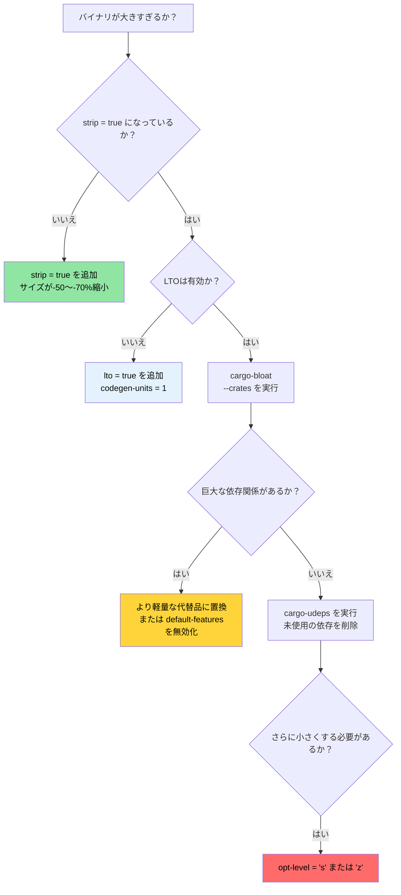

# リリースプロファイルとバイナリサイズ 🟡

> **学習目標:**
> - リリースプロファイルの構造: LTO、codegen-units、パニック戦略、strip、opt-level
> - Thin LTO、Fat LTO、クロス言語LTOのトレードオフ
> - `cargo-bloat` によるバイナリサイズの分析
> - `cargo-udeps`、`cargo-machete`、`cargo-shear` による依存関係の削減
>
> **相互参照:** [コンパイル時間と開発者ツール](ch08-compile-time-and-developer-tools.md) — 最適化のもう半分 · [ベンチマーク](ch03-benchmarking-measuring-what-matters.md) — 最適化の前に実行時間を計測する · [依存関係](ch06-dependency-management-and-supply-chain-s.md) — 依存関係の削減はサイズとコンパイル時間の両方を削減します

デフォルトの `cargo build --release` でも十分に良好な結果が得られます。しかし、本番環境へのデプロイ — 特に数千台のサーバーに配布される単一バイナリのツールなど — においては、「良好」と「高度に最適化された状態」との間には依然として大きな開きがあります。本章では、プロファイルの各種設定項目と、バイナリサイズを測定・削減するためのツール群について解説します。

### リリースプロファイルの構造

Cargoのプロファイルは、`rustc` がコードをコンパイルする方法を制御します。デフォルト値は保守的であり、最大のパフォーマンスではなく広範な互換性を目的として設計されています:

```toml
# Cargo.toml — Cargoの組み込みデフォルト設定（何も指定しなかった場合に適用される内容）

[profile.release]
opt-level = 3        # 最適化レベル（0=なし, 1=基本, 2=良好, 3=積極的）
lto = false          # リンク時最適化（LTO）は無効
codegen-units = 16   # 並列コンパイルユニット（コンパイルは高速だが最適化機会は減少）
panic = "unwind"     # パニック時にスタックをアンワインド（バイナリ肥大、catch_unwindが動作）
strip = "none"       # すべてのシンボルとデバッグ情報を保持
overflow-checks = false  # リリースビルドでは整数のオーバーフローチェックを無効化
debug = false        # リリースビルドではデバッグ情報を含めない
```

**本番向け最適化プロファイル**（本プロジェクトで採用されている設定）:

```toml
[profile.release]
lto = true           # クレートを跨いだ完全な最適化
codegen-units = 1    # 単一のコード生成ユニット — 最大限の最適化機会
panic = "abort"      # アンワインドのオーバーヘッドを排除 — より小さく、より高速
strip = true         # すべてのシンボルを削除 — バイナリサイズを縮小
```

**各設定項目の影響:**

| 設定項目 | デフォルト → 最適化値 | バイナリサイズ | 実行速度 | コンパイル時間 |
|---------|---------------------|-------------|---------------|--------------|
| `lto = false → true` | — | -10〜-20% | +5〜+20% | 2〜5倍遅くなる |
| `codegen-units = 16 → 1` | — | -5〜-10% | +5〜+10% | 1.5〜2倍遅くなる |
| `panic = "unwind" → "abort"` | — | -5〜-10% | ほぼ無視できる | ほぼ無視できる |
| `strip = "none" → true` | — | -50〜-70% | 変化なし | 変化なし |
| `opt-level = 3 → "s"` | — | -10〜-30% | -5〜-10% | 同等 |
| `opt-level = 3 → "z"` | — | -15〜-40% | -10〜-20% | 同等 |

**追加のプロファイル微調整:**

```toml
[profile.release]
# 上記のすべてに加えて:
overflow-checks = true    # リリース時でもオーバーフローチェックを保持（速度より安全性を優先）
debug = "line-tables-only" # 完全なDWARFなしでバックトレース用の最小限のデバッグ情報のみ残す
rpath = false             # ランタイムライブラリパスを埋め込まない
incremental = false       # インクリメンタルコンパイルを無効化（クリーンなビルド）

# サイズ重視のビルド向け（組込み、WASMなど）:
# opt-level = "z"         # サイズを最優先で積極的に最適化
# strip = "symbols"       # シンボルは削除しつつデバッグセクションは保持
```

**クレートごとのプロファイルオーバーライド** — ホットなクレートのみを最適化し、他はそのままにする:

```toml
# 開発ビルド: 依存関係は最適化しつつ自作コードは最適化しない（再コンパイルの高速化）
[profile.dev.package."*"]
opt-level = 2          # 開発モードですべての依存関係を最適化

# リリースビルド: 特定のクレートの最適化設定を上書き
[profile.release.package.serde_json]
opt-level = 3          # JSONパース処理を最大限最適化
codegen-units = 1

# テストプロファイル: 正確な結合テストのためにリリースの挙動に近づける
[profile.test]
opt-level = 1          # 時間のかかるテストでタイムアウトを防ぐため適度な最適化を適用
```

### LTOの詳細 — Thin vs Fat vs クロス言語

リンク時最適化（LTO: Link-Time Optimization）を使用すると、LLVMがクレートの境界を越えて最適化できるようになります — `serde_json` の関数を自作のパースコードにインライン化したり、`regex` からデッドコードを削除したりできます。LTOがない場合、各クレートは独立した最適化の孤島として扱われます。

```toml
[profile.release]
# 選択肢 1: Fat LTO（lto = true 時のデフォルト）
lto = true
# すべてのコードが単一のLLVMモジュールにマージされる → 最大限の最適化
# コンパイルが最も遅く、最も小さく高速なバイナリが得られる

# 選択肢 2: Thin LTO
lto = "thin"
# 各クレートは分離されたままですが、LLVMがモジュールを跨いだ最適化を実行
# Fat LTOよりもコンパイルが速く、ほぼ同等の最適化が得られる
# 多くのプロジェクトにとって最良のトレードオフ

# 選択肢 3: LTOなし
lto = false
# クレート内部の最適化のみ実行
# 最速でコンパイルできるが、バイナリは大きくなる

# 選択肢 4: 明示的な無効化
lto = "off"
# false と同様
```

**Fat LTO と Thin LTO の比較:**

| 観点 | Fat LTO (`true`) | Thin LTO (`"thin"`) |
|--------|-------------------|----------------------|
| 最適化の品質 | 最高 | Fat の約95% |
| コンパイル時間 | 遅い（全コードが1つのモジュールになる） | 中程度（モジュールごとに並列処理） |
| メモリ使用量 | 高い（全LLVM IRをメモリに展開） | より低い（ストリーミング処理） |
| 並列性 | なし（単一モジュール） | 良好（モジュール単位） |
| 推奨ユースケース | 最終リリースビルド | CIビルド、開発環境 |

**クロス言語LTO** — RustとCの境界を越えた最適化:

```toml
[profile.release]
lto = true

# Cargo.toml — cc クレートを使用する場合
[build-dependencies]
cc = "1.0"
```

```rust
// build.rs — クロス言語（リンカプラグイン）LTOを有効化
fn main() {
    // cc クレートは環境変数の CFLAGS を尊重します。
    // クロス言語LTOの場合、Cコードを以下でコンパイルします:
    //   -flto=thin -O2
    cc::Build::new()
        .file("csrc/fast_parser.c")
        .flag("-flto=thin")
        .opt_level(2)
        .compile("fast_parser");
}
```

```bash
# リンカプラグインLTOを有効化（互換性のあるLLDまたはgoldリンカが必要）
RUSTFLAGS="-Clinker-plugin-lto -Clinker=clang -Clink-arg=-fuse-ld=lld" \
    cargo build --release
```

クロス言語LTOにより、LLVMはC言語の関数をRustの呼び出し側にインライン展開したり、その逆を行ったりできます。これは、小さなC関数が頻繁に呼び出されるFFI中心のコード（例: IPMI ioctl ラッパー）において最も効果を発揮します。

### cargo-bloat によるバイナリサイズ分析

[`cargo-bloat`](https://github.com/RazrFalcon/cargo-bloat) は、「**バイナリ内のどの関数やクレートが最も多くの容量を占めているか？**」という疑問に答えてくれます。

```bash
# インストール
cargo install cargo-bloat

# サイズの大きい関数上位20個を表示
cargo bloat --release -n 20
# 出力例:
#  File  .text     Size          Crate    Name
#  2.8%   5.1%  78.5KiB  serde_json       serde_json::de::Deserializer::parse_...
#  2.1%   3.8%  58.2KiB  regex_syntax     regex_syntax::ast::parse::ParserI::p...
#  1.5%   2.7%  42.1KiB  accel_diag         accel_diag::vendor::parse_smi_output
#  ...

# クレート別に表示（どの依存関係が大きいか）
cargo bloat --release --crates
# 出力例:
#  File  .text     Size Crate
# 12.3%  22.1%  340KiB serde_json
#  8.7%  15.6%  240KiB regex
#  6.2%  11.1%  170KiB std
#  5.1%   9.2%  141KiB accel_diag
#  ...

# 2つのビルドを比較（最適化の前と後）
cargo bloat --release --crates > before.txt
# ... 変更を加える ...
cargo bloat --release --crates > after.txt
diff before.txt after.txt
```

**肥大化の主な要因と対策:**

| 肥大化の原因 | 一般的なサイズ | 対策 |
|-------------|-------------|-----|
| `regex`（フルエンジン） | 200〜400 KB | Unicodeが不要なら `regex-lite` を使用する |
| `serde_json`（フル機能） | 200〜350 KB | パフォーマンスが最重要なら `simd-json` や `sonic-rs` を検討する |
| ジェネリクスの単相化（Monomorphization） | 状況による | API境界で `dyn Trait` を活用する |
| フォーマット機構（`Display`, `Debug`） | 50〜150 KB | 巨大なenumに対する `#[derive(Debug)]` はコードサイズを増加させる |
| パニックメッセージ文字列 | 20〜80 KB | `panic = "abort"` でアンワインドを除去し、`strip` で文字列を削除する |
| 未使用のフィーチャー | 状況による | デフォルトフィーチャーを無効化: `serde = { version = "1", default-features = false }` |

### cargo-udeps による未使用依存関係の削減

[`cargo-udeps`](https://github.com/est31/cargo-udeps) は、`Cargo.toml` に宣言されているもののコード内で実際には使用されていない依存関係を見つけ出します:

```bash
# インストール（nightlyが必要）
cargo install cargo-udeps

# 未使用の依存関係を検出
cargo +nightly udeps --workspace
# 出力例:
# unused dependencies:
# `diag_tool v0.1.0`
# └── "tempfile" (dev-dependency)
#
# `accel_diag v0.1.0`
# └── "once_cell"    ← LazyLock導入前に必要だったが、現在は不要
```

未使用の依存関係が存在すると:
- コンパイル時間が増加する
- バイナリサイズが増加する
- サプライチェーンのリスクが増える
- ライセンス上の潜在的な複雑性が生じる

**代替ツール: `cargo-machete`** — 高速なヒューリスティックベースの手法:

```bash
cargo install cargo-machete
cargo machete
# 高速ですが、誤検知（偽陽性）が発生する可能性があります（コンパイルではなくヒューリスティックによるため）
```

**代替ツール: `cargo-shear`** — `cargo-udeps` と `cargo-machete` の中間となる優れた選択肢:

```bash
cargo install cargo-shear
cargo shear --fix
# cargo-macheteより遅いが、cargo-udepsより大幅に高速
# cargo-macheteに比べて誤検知がはるかに少ない
```

### サイズ最適化の決定木



### 🏋️ 演習問題

#### 🟢 演習 1: LTOの影響を測定する

プロジェクトをデフォルトのリリース設定でビルドした後、`lto = true` + `codegen-units = 1` + `strip = true` を適用してビルドしてください。バイナリサイズとコンパイル時間を比較してみましょう。

<details>
<summary>解答例</summary>

```bash
# デフォルトのリリースビルド
cargo build --release
ls -lh target/release/my-binary
time cargo build --release  # 所要時間を記録

# 最適化リリースビルド — Cargo.toml に以下を追加:
# [profile.release]
# lto = true
# codegen-units = 1
# strip = true
# panic = "abort"

cargo clean
cargo build --release
ls -lh target/release/my-binary  # 通常 30〜50% 縮小
time cargo build --release       # コンパイル時間は通常 2〜3倍遅くなる
```
</details>

#### 🟡 演習 2: 最も大きいクレートの特定

プロジェクトで `cargo bloat --release --crates` を実行してください。最大の容量を占める依存関係を特定します。デフォルトフィーチャーを無効化したり、より軽量な代替品に切り替えたりすることでサイズを削減できるか試してみましょう。

<details>
<summary>解答例</summary>

```bash
cargo install cargo-bloat
cargo bloat --release --crates
# 出力例:
#  File  .text     Size Crate
# 12.3%  22.1%  340KiB serde_json
#  8.7%  15.6%  240KiB regex

# regex の場合 — Unicodeが不要であれば regex-lite を試す:
# regex-lite = "0.1"  # 完全版の regex より約10倍小さい

# serde の場合 — stdが不要であればデフォルトフィーチャーを無効化:
# serde = { version = "1", default-features = false, features = ["derive"] }

cargo bloat --release --crates  # 変更後に比較
```
</details>

### 本章のまとめ

- `lto = true` + `codegen-units = 1` + `strip = true` + `panic = "abort"` が本番向けリリースプロファイルの決定版です
- Thin LTO（`lto = "thin"`）は、Fat LTOのコンパイルコストのごく一部でその効果の約80%を得られます
- `cargo-bloat --crates` は、どの依存関係がバイナリ容量を圧迫しているかを正確に教えてくれます
- `cargo-udeps`、`cargo-machete`、`cargo-shear` は、コンパイル時間とバイナリサイズを浪費している不要な依存関係をあぶり出します
- クレート単位のプロファイルオーバーライドを活用することで、ビルド全体の速度を犠牲にすることなく重要なクレートのみを徹底的に最適化できます

---
