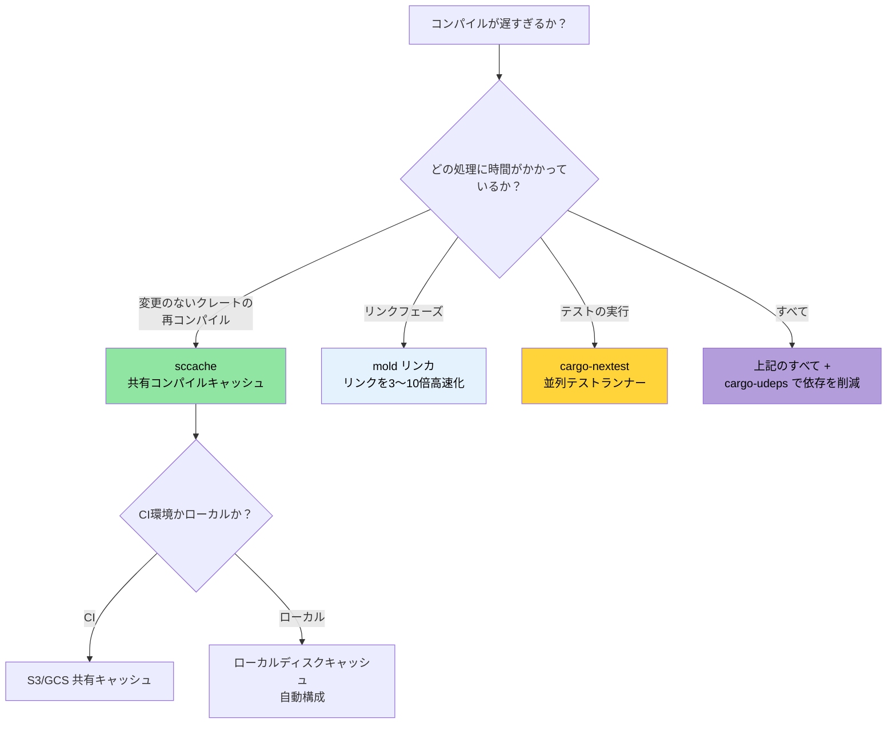

# コンパイル時間と開発者ツール 🟡

> **学習目標:**
> - ローカルおよびCIビルドのための `sccache` によるコンパイルキャッシュ
> - `mold` によるリンクの高速化（デフォルトリンカより3〜10倍高速）
> - `cargo-nextest`: より高速で情報量の多いテストランナー
> - 開発者のための可視化ツール: `cargo-expand`、`cargo-geiger`、`cargo-watch`
> - ワークスペースリント、MSRVポリシー、CIとしてのドキュメント化
>
> **相互参照:** [リリースプロファイル](ch07-release-profiles-and-binary-size.md) — LTOとバイナリサイズの最適化 · [CI/CDパイプライン](ch11-putting-it-all-together-a-production-cic.md) — これらのツールをパイプラインに統合する · [依存関係](ch06-dependency-management-and-supply-chain-s.md) — 依存関係が少ないほどコンパイルが高速になります

コンパイル時間の長さは、Rustにおける開発者の最大の悩みどころ（ペインポイント）です。以下に紹介するツール群を組み合わせることで、開発時のイテレーション時間を50〜80%削減できます:

### コンパイル時間の最適化: sccache、mold、cargo-nextest

**`sccache` — 共有コンパイルキャッシュ:**

```bash
# インストール
cargo install sccache

# Rustのラッパーとして設定
export RUSTC_WRAPPER=sccache

# または .cargo/config.toml に恒久的に設定:
# [build]
# rustc-wrapper = "sccache"

# 初回ビルド: 通常の速度（キャッシュを生成）
cargo build --release  # 3分

# クリーン後に再ビルド: 変更のないクレートはキャッシュヒット
cargo clean && cargo build --release  # 45秒

# キャッシュ統計情報の確認
sccache --show-stats
# Compile requests        1,234
# Cache hits               987 (80%)
# Cache misses             247
```

`sccache` は、チーム全体やCIでのキャッシュ共有のために、クラウドストレージ（S3、GCS、Azure Blob）による共有キャッシュをサポートしています。

**`mold` — 高速リンカ:**

リンク処理は、ビルドの中で最も時間がかかるフェーズになることがよくあります。`mold` は `lld` より3〜5倍、デフォルトのGNU `ld` より10〜20倍高速です:

```bash
# インストール
sudo apt install mold  # Ubuntu 22.04+
# 注意: mold は ELF ターゲット（Linux）向けです。macOS は ELF ではなく Mach-O を使用します。
# macOS のリンカ（ld64）は既に十分高速ですが、さらに高速化が必要な場合は以下を検討してください:
# brew install sold     # sold = Mach-O 向け mold（実験的、成熟度は低め）
# 実際には、macOS においてリンク時間がボトルネックになることは稀です。
```

```toml
# リンク処理に mold を使用
# .cargo/config.toml
[target.x86_64-unknown-linux-gnu]
rustflags = ["-C", "link-arg=-fuse-ld=mold"]
```

```bash
# 詳細: https://github.com/rui314/mold/blob/main/docs/mold.md#environment-variables
export MOLD_JOBS=1

# mold が使用されていることを確認
cargo build -v 2>&1 | grep mold
```

**`cargo-nextest` — 高速なテストランナー:**

```bash
# インストール
cargo install cargo-nextest

# テストを実行（デフォルトで並列実行、テストごとのタイムアウト、リトライ機能）
cargo nextest run

# cargo test に対する主な利点:
# - 各テストが独自のプロセスで実行される → より優れた分離性
# - スマートなスケジューリングによる並列実行
# - テストごとのタイムアウト（CIがハングアップするのを防止）
# - CI向けの JUnit XML 出力
# - 失敗したテストのリトライ機能

# 設定例
cargo nextest run --retries 2 --fail-fast

# テストバイナリのアーカイブ（CIで有用: 1台でビルドし複数台のマシンで分散テスト）
cargo nextest archive --archive-file tests.tar.zst
cargo nextest run --archive-file tests.tar.zst
```

```toml
# .config/nextest.toml
[profile.default]
retries = 0
slow-timeout = { period = "60s", terminate-after = 3 }
fail-fast = true

[profile.ci]
retries = 2
fail-fast = false
junit = { path = "test-results.xml" }
```

**開発環境の統合設定例:**

```toml
# .cargo/config.toml — 開発のインナーループを最適化
[build]
rustc-wrapper = "sccache"       # コンパイル生成物をキャッシュ

[target.x86_64-unknown-linux-gnu]
rustflags = ["-C", "link-arg=-fuse-ld=mold"]  # リンクを高速化

# 開発プロファイル: 依存関係のみ最適化し、自作コードは最適化しない
# （Cargo.toml に記述）
# [profile.dev.package."*"]
# opt-level = 2
```

### cargo-expand と cargo-geiger — 可視化ツール

**`cargo-expand`** — マクロが何を生成しているかを確認:

```bash
cargo install cargo-expand

# 特定モジュール内のすべてのマクロを展開
cargo expand --lib accel_diag::vendor

# 特定のderiveを展開
# #[derive(Debug, Serialize, Deserialize)] が付与されている場合、
# cargo expand は生成された impl ブロックを表示します
cargo expand --lib --tests
```

`#[derive]` マクロの出力や `macro_rules!` の展開をデバッグしたり、`serde` が自身の型に対して何を生成しているかを把握したりするのに非常に役立ちます。

`cargo-expand` に加えて、rust-analyzer を使ってマクロを展開することもできます:

1. 確認したいマクロにカーソルを合わせます。
2. コマンドパレットを開きます（VSCodeの場合は `F1` など）。
3. `rust-analyzer: Expand macro recursively at caret` を検索して実行します。

**`cargo-geiger`** — 依存ツリー全体の `unsafe` 使用状況をカウント:

```bash
cargo install cargo-geiger

cargo geiger
# 出力例:
# Metric output format: x/y
#   x = ビルドで使用されている unsafe コード
#   y = クレート内で見つかった全 unsafe コード
#
# Functions  Expressions  Impls  Traits  Methods
# 0/0        0/0          0/0    0/0     0/0      ✅ my_crate
# 0/5        0/23         0/2    0/0     0/3      ✅ serde
# 3/3        14/14        0/0    0/0     2/2      ❗ libc
# 15/15      142/142      4/4    0/0     12/12    ☢️ ring

# 各記号の意味:
# ✅ = unsafe が使用されていない
# ❗ = 一部 unsafe が使用されている
# ☢️ = unsafe が多用されている
```

本プロジェクトの「unsafe ゼロ」ポリシーにおいて、`cargo geiger` はコードが実際に呼び出すコールグラフ内に、依存関係が意図せず unsafe コードを持ち込んでいないかを検証するのに役立ちます。

### ワークスペースリント — `[workspace.lints]`

Rust 1.74 以降、Clippy およびコンパイラのリントを `Cargo.toml` で一元管理できるようになりました — すべてのクレートの先頭に `#![deny(...)]` を書く必要はもうありません:

```toml
# ルートの Cargo.toml — 全クレート共通のリント設定
[workspace.lints.clippy]
unwrap_used = "warn"         # ? または expect("理由") の使用を推奨
dbg_macro = "deny"           # コミット対象コードでの dbg!() を禁止
todo = "warn"                # 未実装箇所の残存を追跡
large_enum_variant = "warn"  # 意図しないサイズ肥大化を検出

[workspace.lints.rust]
unsafe_code = "deny"         # unsafe ゼロポリシーを強制
missing_docs = "warn"        # ドキュメントの記述を推奨
```

```toml
# 各クレートの Cargo.toml — ワークスペースリントの適用を宣言
[lints]
workspace = true
```

これにより、散在していた `#![deny(clippy::unwrap_used)]` 属性が不要となり、ワークスペース全体で一貫したポリシーを適用できます。

**Clippy 警告の自動修正:**

```bash
# Clippy に機械的に適用可能な提案を自動修正させる
cargo clippy --fix --workspace --all-targets --allow-dirty

# 挙動が変わる可能性がある提案も含めて修正（差分を慎重に確認してください！）
cargo clippy --fix --workspace --all-targets --allow-dirty -- -W clippy::pedantic
```

> **ヒント**: コミット前に `cargo clippy --fix` を実行してください。手作業で直すと面倒な些細な問題（未使用のインポート、冗長なクローン、型の簡略化など）を自動で処理してくれます。

### MSRVポリシーと rust-version

最低サポートRustバージョン（MSRV: Minimum Supported Rust Version）は、クレートが古いツールチェーンでもコンパイルできることを保証します。これは、Rustのバージョンが固定されている環境にデプロイする場合に重要となります。

```toml
# Cargo.toml
[package]
name = "diag_tool"
version = "0.1.0"
rust-version = "1.75"    # 必要な最低Rustバージョン
```

```bash
# MSRV への適合性を検証
cargo +1.75.0 check --workspace

# MSRV の自動検出
cargo install cargo-msrv
cargo msrv find
# 出力例: Minimum Supported Rust Version is 1.75.0

# CIでの検証
cargo msrv verify
```

**CIでのMSRV検証:**

```yaml
jobs:
  msrv:
    name: Check MSRV
    runs-on: ubuntu-latest
    steps:
      - uses: actions/checkout@v4
      - uses: dtolnay/rust-toolchain@master
        with:
          toolchain: "1.75.0"    # Cargo.toml の rust-version と一致させる
      - run: cargo check --workspace
```

**MSRV戦略:**
- **バイナリアプリケーション**（大規模プロジェクトなど）: 最新の stable を使用。MSRV の明示は不要。
- **ライブラリクレート**（crates.io に公開するもの）: 使用している全機能をサポートする最も古いRustバージョンに設定。一般的には `N-2`（最新より2バージョン前）がよく使われます。
- **エンタープライズデプロイ**: 自社のサーバー群にインストールされている最も古いRustバージョンに合わせて設定。

### 実践応用: 本番向けバイナリプロファイル

本プロジェクトには、すでに優れた[リリースプロファイル](ch07-release-profiles-and-binary-size.md)が設定されています:

```toml
# 現在のワークスペース Cargo.toml
[profile.release]
lto = true           # ✅ クレートを跨いだ完全な最適化
codegen-units = 1    # ✅ 最大限の最適化
panic = "abort"      # ✅ アンワインドのオーバーヘッドなし
strip = true         # ✅ デプロイ用にシンボルを削除

[profile.dev]
opt-level = 0        # ✅ 高速なコンパイル
debug = true         # ✅ 完全なデバッグ情報
```

**推奨される追加設定:**

```toml
# 開発モードで依存関係を最適化（テスト実行の高速化）
[profile.dev.package."*"]
opt-level = 2

# テストプロファイル: 時間のかかるテストでのタイムアウトを防ぐため適度に最適化
[profile.test]
opt-level = 1

# リリース時でもオーバーフローチェックを保持（安全性）
[profile.release]
lto = true
codegen-units = 1
panic = "abort"
strip = true
overflow-checks = true    # ← これを追加: 整数オーバーフローを検出
debug = "line-tables-only" # ← これを追加: 完全なDWARFなしでバックトレースを保持
```

**推奨される開発者向けツール設定:**

```toml
# .cargo/config.toml（提案）
[build]
rustc-wrapper = "sccache"  # 初回ビルド以降、80%以上のキャッシュヒット率

[target.x86_64-unknown-linux-gnu]
rustflags = ["-C", "link-arg=-fuse-ld=mold"]  # リンクを3〜5倍高速化
```

**本プロジェクトへの期待される効果:**

| 指標 | 現状 | 追加設定適用後 |
|------|------|---------------|
| リリースバイナリ | 約10 MB（stripped, LTO） | 同等 |
| 開発ビルド時間 | 約45秒 | 約25秒（sccache + mold） |
| 再ビルド（1ファイル変更時） | 約15秒 | 約5秒（sccache + mold） |
| テスト実行 | `cargo test` | `cargo nextest` — 2倍高速 |
| 依存関係の脆弱性スキャン | なし | CIでの `cargo audit` |
| ライセンス適合性 | 手動確認 | `cargo deny` による自動化 |
| 未使用依存関係の検出 | 手動確認 | CIでの `cargo udeps` |

### `cargo-watch` — ファイル変更時の自動再ビルド

[`cargo-watch`](https://github.com/watchexec/cargo-watch) は、ソースファイルが変更されるたびにコマンドを再実行します — 短いフィードバックループを実現する上で欠かせません:

```bash
# インストール
cargo install cargo-watch

# 保存するたびに再チェック（即座にフィードバック）
cargo watch -x check

# 変更時に clippy とテストを実行
cargo watch -x 'clippy --workspace --all-targets' -x 'test --workspace --lib'

# 特定のクレートのみ監視（大規模ワークスペースで高速化）
cargo watch -w accel_diag/src -x 'test -p accel_diag'

# 実行ごとに画面をクリア
cargo watch -c -x check
```

> **ヒント**: 前述の `mold` + `sccache` と組み合わせることで、インクリメンタルな変更に対する再チェック時間を1秒未満に短縮できます。

### `cargo doc` とワークスペースドキュメント

大規模なワークスペースにおいて、自動生成されたドキュメントはAPIの探索性を高めるために不可欠です。`cargo doc` は rustdoc を使用して、ドキュメントコメントや型のシグネチャからHTMLドキュメントを生成します:

```bash
# ワークスペース内の全クレートのドキュメントを生成（ブラウザで開く）
cargo doc --workspace --no-deps --open

# プライベートな項目も含める（開発中に便利）
cargo doc --workspace --no-deps --document-private-items

# HTMLを生成せずにドキュメント内リンクのみをチェック（高速なCIチェック）
cargo doc --workspace --no-deps 2>&1 | grep -E 'warning|error'
```

**ドキュメント内リンク（Intra-doc links）** — URLを使わずにクレートを跨いで型同士をリンク:

```rust
/// [`GpuConfig`] の設定を使用してGPU診断を実行します。
///
/// 実装の詳細は [`crate::accel_diag::run_diagnostics`] を参照してください。
/// [`DerReport`](crate::core_lib::DerReport) フォーマットにシリアライズ可能な
/// [`DiagResult`] を返します。
pub fn run_accel_diag(config: &GpuConfig) -> DiagResult {
    // ...
}
```

**ドキュメント内でプラットフォーム固有のAPIを表示:**

```rust
// Cargo.toml: [package.metadata.docs.rs]
// all-features = true
// rustdoc-args = ["--cfg", "docsrs"]

/// Windows専用: Win32 API経由でバッテリー状態を読み取る。
///
/// `cfg(windows)` ビルドでのみ利用可能です。
#[cfg(windows)]
#[doc(cfg(windows))]  // ドキュメントに「Available on Windows only」バッジを表示
pub fn get_battery_status() -> Option<u8> {
    // ...
}
```

**CIでのドキュメントチェック:**

```yaml
# CIワークフローに追加
- name: Check documentation
  run: RUSTDOCFLAGS="-D warnings" cargo doc --workspace --no-deps
  # 壊れたドキュメント内リンクをエラーとして扱う
```

> **本プロジェクトにおいて**: 多数のクレートで構成される環境では、`cargo doc --workspace` は新規チームメンバーがAPIの全体像を把握するための最適な手段です。壊れたドキュメントリンクがマージされるのを防ぐため、CIに `RUSTDOCFLAGS="-D warnings"` を追加することをお勧めします。

### コンパイル時間の決定木



### 🏋️ 演習問題

#### 🟢 演習 1: sccache + mold のセットアップ

`sccache` と `mold` をインストールし、`.cargo/config.toml` で設定した上で、クリーンからの再ビルドでコンパイル時間の短縮度を測定してください。

<details>
<summary>解答例</summary>

```bash
# インストール
cargo install sccache
sudo apt install mold  # Ubuntu 22.04+

# .cargo/config.toml の設定:
cat > .cargo/config.toml << 'EOF'
[build]
rustc-wrapper = "sccache"

[target.x86_64-unknown-linux-gnu]
linker = "clang"
rustflags = ["-C", "link-arg=-fuse-ld=mold"]
EOF

# 初回ビルド（キャッシュを生成）
time cargo build --release  # 例: 180秒

# クリーン後に再ビルド（キャッシュヒット）
cargo clean
time cargo build --release  # 例: 45秒

sccache --show-stats
# キャッシュヒット率が 60〜80% 以上になるはずです
```
</details>

#### 🟡 演習 2: cargo-nextest への切り替え

`cargo-nextest` をインストールしてテストスイートを実行してください。`cargo test` との実時間（wall-clock time）を比較してみましょう。どれくらい高速化されましたか？

<details>
<summary>解答例</summary>

```bash
cargo install cargo-nextest

# 標準のテストランナー
time cargo test --workspace 2>&1 | tail -5

# nextest（テストバイナリ単位の並列実行）
time cargo nextest run --workspace 2>&1 | tail -5

# 大規模なワークスペースでの一般的な高速化: 2〜5倍
# nextest は以下も提供します:
# - テストごとの実行時間計測
# - 不安定な（flakyな）テストのリトライ
# - CI向けの JUnit XML 出力
cargo nextest run --workspace --retries 2
```
</details>

### 本章のまとめ

- S3/GCSバックエンドを備えた `sccache` により、チーム全体やCIでコンパイルキャッシュを共有できます
- `mold` は最速のELFリンカであり、リンク時間を数秒からミリ秒単位へと短縮します
- `cargo-nextest` はテストバイナリごとに並列実行を行い、より優れた出力とリトライ機能を提供します
- `cargo-geiger` は `unsafe` の使用状況を集計します — 新しい依存関係を採用する前に実行しましょう
- `[workspace.lints]` はマルチクレートワークスペース全体でClippyおよびrustcのリント設定を一元化します

---
