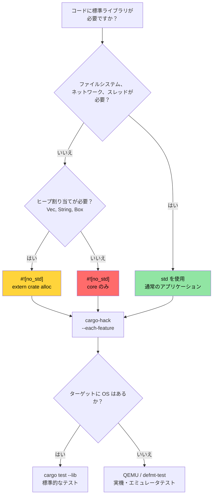

# `no_std` とフィーチャの検証 🔴

> **学べること:**
> - `cargo-hack` によるフィーチャの組み合わせの体系的な検証
> - Rust の 3 つの階層: `core` vs `alloc` vs `std` とそれぞれの使い分け
> - カスタムパニックハンドラとアロケータを備えた `no_std` クレートのビルド
> - ホスト上および QEMU を使用した `no_std` コードのテスト
>
> **関連リンク:** [Windows と条件付きコンパイル](ch10-windows-and-conditional-compilation.md) — 本トピックのプラットフォーム編 · [クロスコンパイル](ch02-cross-compilation-one-source-many-target.md) — ARM および組み込みターゲットへのクロスコンパイル · [Miri とサニタイザ](ch05-miri-valgrind-and-sanitizers-verifying-u.md) — `no_std` 環境における `unsafe` コードの検証 · [ビルドスクリプト](ch01-build-scripts-buildrs-in-depth.md) — `build.rs` から出力される `cfg` フラグ

Rust は 8 ビットマイクロコントローラからクラウドサーバーまで、あらゆる環境で動作します。本章ではその基盤となるトピック、すなわち `#![no_std]` を使って標準ライブラリを取り除き、フィーチャの組み合わせが正しくコンパイルできるかを検証する方法について扱います。

### `cargo-hack` によるフィーチャの組み合わせの検証

[`cargo-hack`](https://github.com/taiki-e/cargo-hack) は、すべてのフィーチャの組み合わせを体系的にテストします — `#[cfg(...)]` コードを含むクレートには不可欠です：

```bash
# インストール
cargo install cargo-hack

# 各フィーチャが個別にコンパイルできるかチェック
cargo hack check --each-feature --workspace

# 究極のオプション: すべてのフィーチャの組み合わせをテスト（指数関数的に増加！）
# フィーチャ数が 8 個未満のクレートでのみ現実的
cargo hack check --feature-powerset --workspace

# 現実的な妥協案: 各フィーチャ単体 + 全フィーチャ有効 + フィーチャ無効のテスト
cargo hack check --each-feature --workspace --no-dev-deps
cargo check --workspace --all-features
cargo check --workspace --no-default-features
```

**プロジェクトにおいてこれが重要な理由:**

プラットフォームフィーチャ（`linux`, `windows`, `direct-ipmi`, `direct-accel-api`）を追加する場合、`cargo-hack` は壊れた組み合わせを検出できます：

```toml
# 例: プラットフォームコードを制御するフィーチャ
[features]
default = ["linux"]
linux = []                          # Linux 固有のハードウェアアクセス
windows = ["dep:windows-sys"]       # Windows 固有の API
direct-ipmi = []                    # unsafe な IPMI ioctl（第5章参照）
direct-accel-api = []               # unsafe な accel-mgmt FFI（第5章参照）
```

```bash
# すべてのフィーチャが単体および組み合わせてコンパイルできることを検証
cargo hack check --each-feature -p diag_tool
# 検出例: "'direct-ipmi' なしでは 'windows' フィーチャがコンパイルできない"
# 検出例: "#[cfg(feature = \"linux\")] にタイポがある — 'lnux' になっている"
```

**CI への統合:**

```yaml
# CI パイプラインに追加（コンパイルチェックのみなので高速）
- name: Feature matrix check
  run: cargo hack check --each-feature --workspace --no-dev-deps
```

> **目安**: 2 つ以上のフィーチャを持つクレートでは、CI で `cargo hack check --each-feature` を実行してください。`--feature-powerset` は、フィーチャ数が 8 個未満のコアライブラリクレートでのみ実行してください（組み合わせが $2^n$ で指数関数的に増加するため）。

### `no_std` — いつ、なぜ使うのか

`#![no_std]` はコンパイラに「標準ライブラリをリンクしない」よう指示します。クレートは `core`（およびオプションで `alloc`）のみを使用できます。なぜこれが必要になるのでしょうか？

| シナリオ | `no_std` を使う理由 |
|----------|-------------|
| 組み込みファームウェア（ARM Cortex-M, RISC-V） | OS なし、ヒープなし、ファイルシステムなし |
| UEFI 診断ツール | 起動前環境、OS の API なし |
| カーネルモジュール | カーネル空間ではユーザ空間の `std` を使用不可 |
| WebAssembly (WASM) | バイナリサイズの最小化、OS 依存関係の排除 |
| ブートローダ | OS が存在する前に実行される |
| C インターフェースを持つ共有ライブラリ | 呼び出し元で Rust ランタイムの引き込みを回避 |

**ハードウェア診断において**、`no_std` は以下のようなものを構築する際に関わってきます：
- UEFI ベースの起動前診断ツール（OS がロードされる前）
- BMC ファームウェア診断（リソース制約の厳しい ARM SoC）
- カーネルレベルの PCIe 診断（カーネルモジュールまたは eBPF プローブ）

### `core` vs `alloc` vs `std` — 3 つの階層

```text
┌─────────────────────────────────────────────────────────────┐
│ std                                                         │
│  core + alloc のすべてに加えて、以下を含む:                  │
│  • ファイル I/O (std::fs, std::io)                          │
│  • ネットワーク (std::net)                                  │
│  • スレッド (std::thread)                                   │
│  • 時刻 (std::time)                                         │
│  • 環境変数・コマンドライン引数 (std::env)                  │
│  • プロセス (std::process)                                  │
│  • OS 固有機能 (std::os::unix, std::os::windows)            │
├─────────────────────────────────────────────────────────────┤
│ alloc          (グローバルアロケータがある場合、             │
│                 #![no_std] + extern crate alloc で利用可能)  │
│  • String, Vec, Box, Rc, Arc                                │
│  • BTreeMap, BTreeSet                                       │
│  • format!() マクロ                                         │
│  • ヒープを必要とするコレクションやスマートポインタ         │
├─────────────────────────────────────────────────────────────┤
│ core           (常に利用可能、#![no_std] でも利用可能)       │
│  • プリミティブ型 (u8, bool, char など)                      │
│  • Option, Result                                           │
│  • Iterator, スライス, 配列, str (スライスであり、String ではない) │
│  • トレイト: Clone, Copy, Debug, Display, From, Into        │
│  • アトミック型 (core::sync::atomic)                        │
│  • Cell, RefCell (core::cell) — Pin (core::pin)             │
│  • core::fmt (ヒープ割り当てなしのフォーマット)              │
│  • core::mem, core::ptr (低レベルメモリオペレーション)      │
│  • 数学演算: core::num, 基本的な算術演算                     │
└─────────────────────────────────────────────────────────────┘
```

**`std` がない場合に失われるもの:**
- `HashMap` がない（ハッシャーが必要 — `alloc` の `BTreeMap` や `hashbrown` を使用）
- `println!()` がない（標準出力が必要 — バッファへの `core::fmt::Write` を使用）
- `std::error::Error` がない（Rust 1.81 以降で `core` に安定化されましたが、多くのエコシステムはまだ移行していません）
- ファイル I/O、ネットワーク、スレッドがない（プラットフォーム HAL から提供されない限り）
- `Mutex` がない（`spin::Mutex` やプラットフォーム固有のロックを使用）

### `no_std` クレートの構築

```rust
// src/lib.rs — no_std ライブラリクレート
#![no_std]

// オプションでヒープ割り当てを使用
extern crate alloc;
use alloc::string::String;
use alloc::vec::Vec;
use core::fmt;

/// 温度センサからの温度読み取り値。
/// この構造体はベアメタルから Linux まで、あらゆる環境で動作します。
#[derive(Clone, Copy, Debug)]
pub struct Temperature {
    /// 生のセンサ値（一般的な I2C センサの場合、1 LSB あたり 0.0625°C）
    raw: u16,
}

impl Temperature {
    pub const fn from_raw(raw: u16) -> Self {
        Self { raw }
    }

    /// 摂氏ミリ度（1/1000°C）に変換（固定小数点、FPU 不要）
    pub const fn millidegrees_c(&self) -> i32 {
        (self.raw as i32) * 625 / 10 // 分解能 0.0625°C
    }

    pub fn degrees_c(&self) -> f32 {
        self.raw as f32 * 0.0625
    }
}

impl fmt::Display for Temperature {
    fn fmt(&self, f: &mut fmt::Formatter<'_>) -> fmt::Result {
        let md = self.millidegrees_c();
        // md / 1000 == 0 だが値が負である -0.999°C から -0.001°C の値について
        // 符号を正しく処理する
        if md < 0 && md > -1000 {
            write!(f, "-0.{:03}°C", (-md) % 1000)
        } else {
            write!(f, "{}.{:03}°C", md / 1000, (md % 1000).abs())
        }
    }
}

/// 空白区切りの温度文字列をパースする。
/// alloc を使用 — グローバルアロケータが必要。
pub fn parse_temperatures(input: &str) -> Vec<Temperature> {
    input
        .split_whitespace()
        .filter_map(|s| s.parse::<u16>().ok())
        .map(Temperature::from_raw)
        .collect()
}

/// ヒープ割り当てなしでのフォーマット — バッファへ直接書き込む。
/// `core` のみの環境で動作（alloc なし、ヒープなし）。
pub fn format_temp_into(temp: &Temperature, buf: &mut [u8]) -> usize {
    use core::fmt::Write;
    struct SliceWriter<'a> {
        buf: &'a mut [u8],
        pos: usize,
    }
    impl<'a> Write for SliceWriter<'a> {
        fn write_str(&mut self, s: &str) -> fmt::Result {
            let bytes = s.as_bytes();
            let remaining = self.buf.len() - self.pos;
            if bytes.len() > remaining {
                // バッファがいっぱい — 暗黙に切り捨てるのではなくエラーを返す。
                // 呼び出し元は返された pos を確認して部分的な書き込みを検証可能。
                return Err(fmt::Error);
            }
            self.buf[self.pos..self.pos + bytes.len()].copy_from_slice(bytes);
            self.pos += bytes.len();
            Ok(())
        }
    }
    let mut w = SliceWriter { buf, pos: 0 };
    let _ = write!(w, "{}", temp);
    w.pos
}
```

```toml
# no_std クレートの Cargo.toml
[package]
name = "thermal-sensor"
version = "0.1.0"
edition = "2021"

[features]
default = ["alloc"]
alloc = []    # Vec や String などを有効化
std = []      # 完全な std を有効化（alloc を内包）

[dependencies]
# no_std 互換のクレートを使用
serde = { version = "1.0", default-features = false, features = ["derive"] }
# ↑ default-features = false により std 依存関係を除外！
```

> **主要なクレートのパターン**: 多くの人気クレート（serde, log, rand, embedded-hal）は、`default-features = false` によって `no_std` をサポートしています。`no_std` コンテキストで使用する前に、依存関係が `std` を必要としているかどうかを常に確認してください。なお、一部のクレート（例: `regex`）は少なくとも `alloc` を必要とし、`core` のみの環境では動作しないことに注意してください。

### カスタムパニックハンドラとアロケータ

`#![no_std]` バイナリ（ライブラリではない）では、パニックハンドラと、必要に応じてグローバルアロケータを提供する必要があります：

```rust
// src/main.rs — no_std バイナリ（例: UEFI 診断ツール）
#![no_std]
#![no_main]

extern crate alloc;

use core::panic::PanicInfo;

// 必須: パニック時の処理（スタック巻き戻しは利用不可）
#[panic_handler]
fn panic(info: &PanicInfo) -> ! {
    // 組み込みの場合: LED を点滅させる、UART に書き込む、ハングさせる
    // UEFI の場合: コンソールに出力して停止する
    // 最小限の実装: 無限ループするだけ
    loop {
        core::hint::spin_loop();
    }
}

// alloc を使用する場合に必須: グローバルアロケータの提供
use alloc::alloc::{GlobalAlloc, Layout};

struct BumpAllocator {
    // 組み込み/UEFI 向けのシンプルなバンプアロケータ
    // 実際には `linked_list_allocator` や `embedded-alloc` などのクレートを使用する
}

// 警告: これは機能しないプレースホルダーです！alloc() を呼び出すと null が返され、
// 即座に未定義動作（UB）が発生します（グローバルアロケータの規約では、
// サイズが 0 でない割り当てに対して非 null を返す必要があります）。
// 実際のコードでは、実績のあるアロケータクレートを使用してください:
//   - embedded-alloc (組み込みターゲット)
//   - linked_list_allocator (UEFI / OS カーネル)
//   - talc (汎用 no_std)
unsafe impl GlobalAlloc for BumpAllocator {
    /// # Safety
    /// レイアウトのサイズは 0 より大きくなければなりません。null を返します（プレースホルダー — クラッシュします）。
    unsafe fn alloc(&self, _layout: Layout) -> *mut u8 {
        // プレースホルダー — クラッシュします！本物のアロケーションロジックに置き換えてください。
        core::ptr::null_mut()
    }
    /// # Safety
    /// `_ptr` は、互換性のあるレイアウトで `alloc` から返されたものでなければなりません。
    unsafe fn dealloc(&self, _ptr: *mut u8, _layout: Layout) {
        // バンプアロケータでは何もしない
    }
}

#[global_allocator]
static ALLOCATOR: BumpAllocator = BumpAllocator {};

// エントリポイント（fn main ではなくプラットフォーム固有）
// UEFI の場合: #[entry] または efi_main
// 組み込みの場合: #[cortex_m_rt::entry]
```

### `no_std` コードのテスト

テストは `std` を備えたホストマシン上で実行されます。テクニックとして、ライブラリ自体は `no_std` ですが、テストハーネスは `std` を使用します：

```rust
// クレート: src/lib.rs では #![no_std]
// ただしテストは自動的に std 環境で実行される:

#[cfg(test)]
mod tests {
    use super::*;
    // ここでは std が利用可能 — println!, assert!, Vec すべて動作する

    #[test]
    fn test_temperature_conversion() {
        let temp = Temperature::from_raw(800); // 50.0°C
        assert_eq!(temp.millidegrees_c(), 50000);
        assert!((temp.degrees_c() - 50.0).abs() < 0.01);
    }

    #[test]
    fn test_format_into_buffer() {
        let temp = Temperature::from_raw(800);
        let mut buf = [0u8; 32];
        let len = format_temp_into(&temp, &mut buf);
        let s = core::str::from_utf8(&buf[..len]).unwrap();
        assert_eq!(s, "50.000°C");
    }
}
```

**実際のターゲット上でのテスト**（`std` が全く利用できない場合）：

```bash
# 実機上テストには defmt-test を使用（組み込み ARM）
# UEFI ターゲットには uefi-test-runner を使用
# ハードウェアなしのクロスアーキテクチャテストには QEMU を使用

# ホスト上で no_std ライブラリテストを実行（常に動作）:
cargo test --lib

# no_std ターゲットに対して no_std コンパイルを検証:
cargo check --target thumbv7em-none-eabihf  # ARM Cortex-M
cargo check --target riscv32imac-unknown-none-elf  # RISC-V
```

### `no_std` 決定木



### 🏋️ 演習問題

#### 🟡 演習 1: フィーチャの組み合わせの検証

`cargo-hack` をインストールし、複数のフィーチャを持つプロジェクトで `cargo hack check --each-feature --workspace` を実行してください。壊れている組み合わせは見つかりましたか？

<details>
<summary>解答例</summary>

```bash
cargo install cargo-hack

# 各フィーチャを個別にチェック
cargo hack check --each-feature --workspace --no-dev-deps

# フィーチャの組み合わせが失敗した場合:
# error[E0433]: failed to resolve: use of undeclared crate or module `std`
# → これは、フィーチャゲートに #[cfg] ガードが不足していることを意味します

# 全フィーチャ + フィーチャなし + 各フィーチャ単体をチェック:
cargo hack check --each-feature --workspace
cargo check --workspace --all-features
cargo check --workspace --no-default-features
```
</details>

#### 🔴 演習 2: `no_std` ライブラリの構築

`#![no_std]` でコンパイルできるライブラリクレートを作成してください。スタック割り当てのシンプルなリングバッファを実装します。`thumbv7em-none-eabihf`（ARM Cortex-M）向けにコンパイルできることを検証してください。

<details>
<summary>解答例</summary>

```rust
// lib.rs
#![no_std]

pub struct RingBuffer<const N: usize> {
    data: [u8; N],
    head: usize,
    len: usize,
}

impl<const N: usize> RingBuffer<N> {
    pub const fn new() -> Self {
        Self { data: [0; N], head: 0, len: 0 }
    }

    pub fn push(&mut self, byte: u8) -> bool {
        if self.len == N { return false; }
        let idx = (self.head + self.len) % N;
        self.data[idx] = byte;
        self.len += 1;
        true
    }

    pub fn pop(&mut self) -> Option<u8> {
        if self.len == 0 { return None; }
        let byte = self.data[self.head];
        self.head = (self.head + 1) % N;
        self.len -= 1;
        Some(byte)
    }
}

#[cfg(test)]
mod tests {
    use super::*;

    #[test]
    fn push_pop() {
        let mut rb = RingBuffer::<4>::new();
        assert!(rb.push(1));
        assert!(rb.push(2));
        assert_eq!(rb.pop(), Some(1));
        assert_eq!(rb.pop(), Some(2));
        assert_eq!(rb.pop(), None);
    }
}
```

```bash
rustup target add thumbv7em-none-eabihf
cargo check --target thumbv7em-none-eabihf
# ✅ ベアメタル ARM 向けにコンパイル成功
```
</details>

### 重要ポイント

- `cargo-hack --each-feature` は、条件付きコンパイルを含むすべてのクレートで不可欠です — CI で実行してください。
- `core` → `alloc` → `std` は階層化されており、上位になるほど機能が増えますが、より多くのランタイムサポートが必要になります。
- ベアメタル向けの `no_std` バイナリには、カスタムパニックハンドラとアロケータが必要です。
- ホスト上で `cargo test --lib` を実行すれば、実機ハードウェアがなくても `no_std` ライブラリをテストできます。
- `--feature-powerset` は、フィーチャ数が 8 個未満のコアライブラリでのみ実行してください（組み合わせが $2^n$ になるため）。

---
