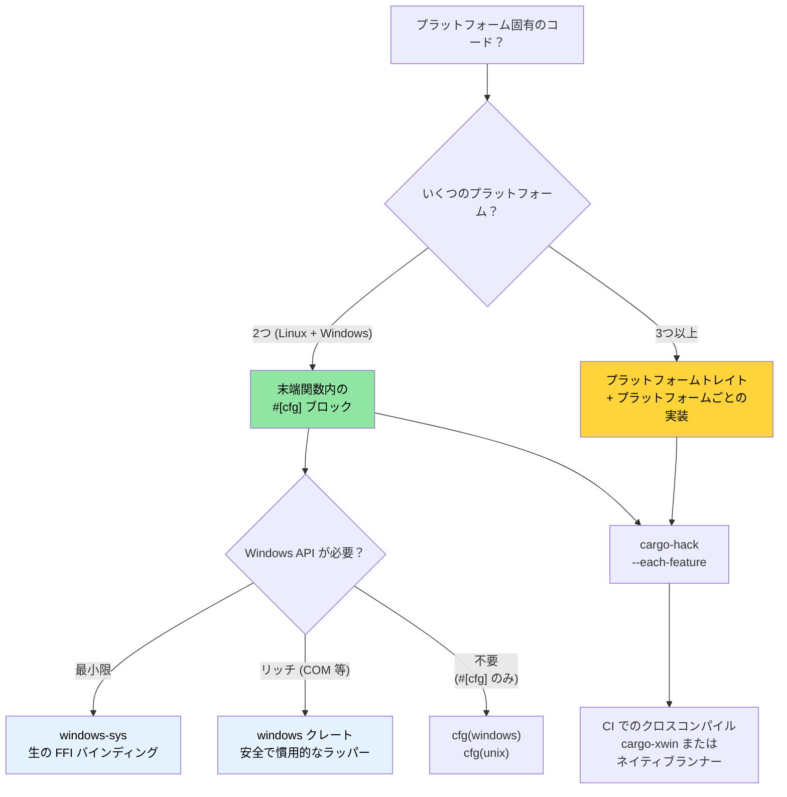

# Windows と条件付きコンパイル 🟡

> **学べること:**
> - Windows サポートのパターン: `windows-sys`/`windows` クレート、`cargo-xwin`
> - `#[cfg]` による条件付きコンパイル — プリプロセッサではなくコンパイラによってチェックされる仕組み
> - プラットフォーム抽象化のアーキテクチャ: `#[cfg]` ブロックで十分な場合とトレイトを使うべき場合
> - Linux から Windows へのクロスコンパイル
>
> **関連リンク:** [`no_std` とフィーチャの検証](ch09-no-std-and-feature-verification.md) — `cargo-hack` とフィーチャの検証 · [クロスコンパイル](ch02-cross-compilation-one-source-many-target.md) — 一般的なクロスビルド環境の構築 · [ビルドスクリプト](ch01-build-scripts-buildrs-in-depth.md) — `build.rs` から出力される `cfg` フラグ

### Windows サポート — プラットフォームの抽象化

Rust の `#[cfg()]` 属性と Cargo フィーチャを使用すると、単一のコードベースで Linux と Windows の両方を綺麗に対象にできます。本プロジェクトでは、`platform::run_command` においてすでにこのパターンが実践されています：

```rust
// プロジェクトの実装パターン — プラットフォーム固有のシェル起動
pub fn exec_cmd(cmd: &str, timeout_secs: Option<u64>) -> Result<CommandResult, CommandError> {
    #[cfg(windows)]
    let mut child = Command::new("cmd")
        .args(["/C", cmd])
        .stdout(Stdio::piped())
        .stderr(Stdio::piped())
        .spawn()?;

    #[cfg(not(windows))]
    let mut child = Command::new("sh")
        .args(["-c", cmd])
        .stdout(Stdio::piped())
        .stderr(Stdio::piped())
        .spawn()?;

    // ... 残りの処理はプラットフォーム非依存 ...
}
```

**利用可能な `cfg` 述語:**

```rust
// オペレーティングシステム
#[cfg(target_os = "linux")]         // Linux を明示的に指定
#[cfg(target_os = "windows")]       // Windows
#[cfg(target_os = "macos")]         // macOS
#[cfg(unix)]                        // Linux, macOS, BSD 等
#[cfg(windows)]                     // Windows (短縮表記)

// アーキテクチャ
#[cfg(target_arch = "x86_64")]      // x86 64 ビット
#[cfg(target_arch = "aarch64")]     // ARM 64 ビット
#[cfg(target_arch = "x86")]         // x86 32 ビット

// ポインタ幅 (アーキテクチャに依存しない代替手段)
#[cfg(target_pointer_width = "64")] // 任意の 64 ビットプラットフォーム
#[cfg(target_pointer_width = "32")] // 任意の 32 ビットプラットフォーム

// 環境 / C ライブラリ
#[cfg(target_env = "gnu")]          // glibc
#[cfg(target_env = "musl")]         // musl libc
#[cfg(target_env = "msvc")]         // Windows 上の MSVC

// エンディアン
#[cfg(target_endian = "little")]
#[cfg(target_endian = "big")]

// any(), all(), not() を使った組み合わせ
#[cfg(all(target_os = "linux", target_arch = "x86_64"))]
#[cfg(any(target_os = "linux", target_os = "macos"))]
#[cfg(not(windows))]
```

### `windows-sys` および `windows` クレート

Windows API を直接呼び出す場合：

```toml
# Cargo.toml — 生の FFI には windows-sys を使用（軽量、抽象化なし）
[target.'cfg(windows)'.dependencies]
windows-sys = { version = "0.59", features = [
    "Win32_Foundation",
    "Win32_System_Services",
    "Win32_System_Registry",
    "Win32_System_Power",
] }
# 注意: windows-sys はセマンティックバージョニング的に非互換のリリースを行います (0.48 → 0.52 → 0.59)。
# 特定のマイナーバージョンに固定してください — 各リリースで API バインディングが削除または名前変更される可能性があります。
# 新規プロジェクトを開始する前に、https://github.com/microsoft/windows-rs で最新バージョンを確認してください。

# または安全なラッパーを提供する windows クレートを使用（重量級、より人間工学的）
# windows = { version = "0.59", features = [...] }
```

```rust
// src/platform/windows.rs
#[cfg(windows)]
mod win {
    use windows_sys::Win32::System::Power::{
        GetSystemPowerStatus, SYSTEM_POWER_STATUS,
    };

    pub fn get_battery_status() -> Option<u8> {
        let mut status = SYSTEM_POWER_STATUS::default();
        // SAFETY: GetSystemPowerStatus は提供されたバッファに書き込みます。
        // バッファは適切にサイズ設定されアラインメントされています。
        let ok = unsafe { GetSystemPowerStatus(&mut status) };
        if ok != 0 {
            Some(status.BatteryLifePercent)
        } else {
            None
        }
    }
}
```

**`windows-sys` vs `windows` クレート:**

| 観点 | `windows-sys` | `windows` |
|------|---------------|-----------|
| API スタイル | 生の FFI（`unsafe` 呼び出し） | 安全な Rust ラッパー |
| バイナリサイズ | 最小限（extern 宣言のみ） | やや大きめ（ラッパーコード分） |
| コンパイル時間 | 高速 | やや遅い |
| 人間工学性（書きやすさ） | C スタイル、手動での安全性担保 | Rust に慣用的 |
| エラー処理 | 生の `BOOL` / `HRESULT` | `Result<T, windows::core::Error>` |
| 推奨用途 | パフォーマンス重視、薄いラッパー | アプリケーションコード、使いやすさ重視 |

### Linux から Windows へのクロスコンパイル

```bash
# オプション 1: MinGW (GNU ABI)
rustup target add x86_64-pc-windows-gnu
sudo apt install gcc-mingw-w64-x86-64
cargo build --target x86_64-pc-windows-gnu
# .exe を生成 — Windows 上で動作し、msvcrt とリンク

# オプション 2: xwin 経由の MSVC ABI (完全な MSVC 互換性向け)
cargo install cargo-xwin
cargo xwin build --target x86_64-pc-windows-msvc
# 自動的にダウンロードされた Microsoft の CRT および SDK ヘッダーを使用

# オプション 3: Zig ベースのクロスコンパイル
cargo zigbuild --target x86_64-pc-windows-gnu
```

**Windows における GNU vs MSVC ABI:**

| 観点 | `x86_64-pc-windows-gnu` | `x86_64-pc-windows-msvc` |
|------|-------------------------|---------------------------|
| リンカ | MinGW `ld` | MSVC `link.exe` または `lld-link` |
| C ランタイム | `msvcrt.dll`（汎用） | `ucrtbase.dll`（モダン） |
| C++ 相互運用 | GCC ABI | MSVC ABI |
| Linux からのクロスコンパイル | 容易（MinGW） | 可能（`cargo-xwin`） |
| Windows API サポート | 完全 | 完全 |
| デバッグ情報フォーマット | DWARF | PDB |
| 推奨用途 | 単純なツール、CI ビルド | 完全な Windows 統合 |

### 条件付きコンパイルのパターン

**パターン 1: プラットフォームモジュールの選択**

```rust
// src/platform/mod.rs — OS ごとに異なるモジュールをコンパイル
#[cfg(target_os = "linux")]
mod linux;
#[cfg(target_os = "linux")]
pub use linux::*;

#[cfg(target_os = "windows")]
mod windows;
#[cfg(target_os = "windows")]
pub use windows::*;

// 両モジュールとも同じ公開 API を実装:
// pub fn get_cpu_temperature() -> Result<f64, PlatformError>
// pub fn list_pci_devices() -> Result<Vec<PciDevice>, PlatformError>
```

**パターン 2: フィーチャゲートによるプラットフォームサポート**

```toml
# Cargo.toml
[features]
default = ["linux"]
linux = []              # Linux 固有のハードウェアアクセス
windows = ["dep:windows-sys"]  # Windows 固有の API

[target.'cfg(windows)'.dependencies]
windows-sys = { version = "0.59", features = [...], optional = true }
```

```rust
// フィーチャを有効にせずに Windows 向けにビルドしようとした場合、コンパイルエラーにする:
#[cfg(all(target_os = "windows", not(feature = "windows")))]
compile_error!("Windows 向けにビルドするには 'windows' フィーチャを有効にしてください");
```

**パターン 3: トレイトベースのプラットフォーム抽象化**

```rust
/// ハードウェアアクセスのためのプラットフォーム非依存インターフェース
pub trait HardwareAccess {
    type Error: std::error::Error;

    fn read_cpu_temperature(&self) -> Result<f64, Self::Error>;
    fn read_gpu_temperature(&self, gpu_index: u32) -> Result<f64, Self::Error>;
    fn list_pci_devices(&self) -> Result<Vec<PciDevice>, Self::Error>;
    fn send_ipmi_command(&self, cmd: &IpmiCmd) -> Result<IpmiResponse, Self::Error>;
}

#[cfg(target_os = "linux")]
pub struct LinuxHardware;

#[cfg(target_os = "linux")]
impl HardwareAccess for LinuxHardware {
    type Error = LinuxHwError;

    fn read_cpu_temperature(&self) -> Result<f64, Self::Error> {
        // /sys/class/thermal/thermal_zone0/temp から読み込み
        let raw = std::fs::read_to_string("/sys/class/thermal/thermal_zone0/temp")?;
        Ok(raw.trim().parse::<f64>()? / 1000.0)
    }
    // ...
}

#[cfg(target_os = "windows")]
pub struct WindowsHardware;

#[cfg(target_os = "windows")]
impl HardwareAccess for WindowsHardware {
    type Error = WindowsHwError;

    fn read_cpu_temperature(&self) -> Result<f64, Self::Error> {
        // WMI (Win32_TemperatureProbe) または Open Hardware Monitor 経由で読み込み
        todo!("WMI temperature query")
    }
    // ...
}

/// プラットフォームに応じた適切な実装を生成
pub fn create_hardware() -> impl HardwareAccess {
    #[cfg(target_os = "linux")]
    { LinuxHardware }
    #[cfg(target_os = "windows")]
    { WindowsHardware }
}
```

### プラットフォーム抽象化のアーキテクチャ

複数のプラットフォームを対象とするプロジェクトでは、コードを 3 つの階層に構造化します：

```text
┌──────────────────────────────────────────────────┐
│ アプリケーションロジック (プラットフォーム非依存) │
│  diag_tool, accel_diag, network_diag, event_log  │
│  プラットフォーム抽象化トレイトのみを使用         │
├──────────────────────────────────────────────────┤
│ プラットフォーム抽象化層 (トレイト定義)          │
│  trait HardwareAccess { ... }                     │
│  trait CommandRunner { ... }                      │
│  trait FileSystem { ... }                         │
├──────────────────────────────────────────────────┤
│ プラットフォーム固有実装 (cfg でゲート)          │
│  ┌──────────────┐  ┌──────────────┐              │
│  │ Linux 実装   │  │ Windows 実装 │              │
│  │ /sys, /proc  │  │ WMI, Registry│              │
│  │ ipmitool     │  │ ipmiutil     │              │
│  │ lspci        │  │ devcon       │              │
│  └──────────────┘  └──────────────┘              │
└──────────────────────────────────────────────────┘
```

**抽象化のテスト**: 単体テスト用にプラットフォームトレイトをモック化します：

```rust
#[cfg(test)]
mod tests {
    use super::*;

    struct MockHardware {
        cpu_temp: f64,
        gpu_temps: Vec<f64>,
    }

    impl HardwareAccess for MockHardware {
        type Error = std::io::Error;

        fn read_cpu_temperature(&self) -> Result<f64, Self::Error> {
            Ok(self.cpu_temp)
        }

        fn read_gpu_temperature(&self, index: u32) -> Result<f64, Self::Error> {
            self.gpu_temps.get(index as usize)
                .copied()
                .ok_or_else(|| std::io::Error::new(
                    std::io::ErrorKind::NotFound,
                    format!("GPU {index} not found")
                ))
        }

        fn list_pci_devices(&self) -> Result<Vec<PciDevice>, Self::Error> {
            Ok(vec![]) // モックは空を返す
        }

        fn send_ipmi_command(&self, _cmd: &IpmiCmd) -> Result<IpmiResponse, Self::Error> {
            Ok(IpmiResponse::default())
        }
    }

    #[test]
    fn test_thermal_check_with_mock() {
        let hw = MockHardware {
            cpu_temp: 75.0,
            gpu_temps: vec![82.0, 84.0],
        };
        let result = run_thermal_diagnostic(&hw);
        assert!(result.is_ok());
    }
}
```

### 実践適用: Linux ファースト、Windows 対応の準備

本プロジェクトはすでに部分的に Windows に対応しています。[`cargo-hack`](ch09-no-std-and-feature-verification.md) を使用してすべてのフィーチャの組み合わせを検証し、[クロスコンパイル](ch02-cross-compilation-one-source-many-target.md) により Linux から Windows 向けにテストを行います：

**すでに対応済みの事項:**
- `platform::run_command` はシェル選択に `#[cfg(windows)]` を使用
- テストコードはプラットフォームに応じたテストコマンドの選択に `#[cfg(windows)]` / `#[cfg(not(windows))]` を使用

**Windows サポートの推奨移行ロードマップ:**

```text
フェーズ 1: プラットフォーム抽象化トレイトの抽出 (現状 → 2 週間)
  ├─ core_lib に HardwareAccess トレイトを定義
  ├─ 現在の Linux コードを LinuxHardware 実装の背後にラップ
  └─ すべての診断モジュールが Linux 固有処理ではなくトレイトに依存するように変更

フェーズ 2: Windows スタブの追加 (2 週間)
  ├─ TODO スタブを持つ WindowsHardware を実装
  ├─ x86_64-pc-windows-msvc 向けの CI ビルド（コンパイルチェックのみ）
  └─ 全プラットフォームで MockHardware を使ったテストをパスさせる

フェーズ 3: Windows 実装 (継続的)
  ├─ ipmiutil.exe または OpenIPMI Windows ドライバ経由の IPMI
  ├─ accel-mgmt (accel-api.dll) 経由の GPU — Linux と同一の API
  ├─ Windows Setup API (SetupDiEnumDeviceInfo) 経由の PCIe
  └─ WMI (Win32_NetworkAdapter) 経由の NIC
```

**クロスプラットフォーム CI の追加:**

```yaml
# CI マトリクスに追加
- target: x86_64-pc-windows-msvc
  os: windows-latest
  name: windows-x86_64
```

これにより、Windows 向けの実装が完全に完了する前であってもコードベースが Windows 上でコンパイルできることが保証され、`cfg` の記述ミスを早期に検出できます。

> **重要な洞察**: 最初から抽象化が完璧である必要はありません。末端関数内の `#[cfg]` ブロック（すでに `exec_cmd` で行われているように）から始め、2 つ以上のプラットフォーム実装が揃った時点でトレイトへとリファクタリングしてください。時期尚早な抽象化は、`#[cfg]` ブロックのベタ書きよりも有害です。

### 条件付きコンパイルの決定木



### 🏋️ 演習問題

#### 🟢 演習 1: プラットフォーム条件付きモジュール

`get_hostname()` 関数の `#[cfg(unix)]` 実装と `#[cfg(windows)]` 実装を含むモジュールを作成してください。`cargo check` および `cargo check --target x86_64-pc-windows-msvc` の両方でコンパイルできることを確認します。

<details>
<summary>解答例</summary>

```rust
// src/hostname.rs
#[cfg(unix)]
pub fn get_hostname() -> String {
    use std::fs;
    fs::read_to_string("/etc/hostname")
        .unwrap_or_else(|_| "unknown".to_string())
        .trim()
        .to_string()
}

#[cfg(windows)]
pub fn get_hostname() -> String {
    use std::env;
    env::var("COMPUTERNAME").unwrap_or_else(|_| "unknown".to_string())
}

#[cfg(test)]
mod tests {
    use super::*;

    #[test]
    fn hostname_is_not_empty() {
        let name = get_hostname();
        assert!(!name.is_empty());
    }
}
```

```bash
# Linux 向けコンパイルの検証
cargo check

# Windows 向けコンパイルの検証 (クロスチェック)
rustup target add x86_64-pc-windows-msvc
cargo check --target x86_64-pc-windows-msvc
```
</details>

#### 🟡 演習 2: cargo-xwin による Windows 向けクロスコンパイル

`cargo-xwin` をインストールし、Linux から `x86_64-pc-windows-msvc` 向けの単純なバイナリをビルドしてください。出力が `.exe` であることを確認します。

<details>
<summary>解答例</summary>

```bash
cargo install cargo-xwin
rustup target add x86_64-pc-windows-msvc

cargo xwin build --release --target x86_64-pc-windows-msvc
# Windows SDK ヘッダー/ライブラリを自動的にダウンロード

file target/x86_64-pc-windows-msvc/release/my-binary.exe
# 出力: PE32+ executable (console) x86-64, for MS Windows

# Wine を使用してテストすることも可能:
wine target/x86_64-pc-windows-msvc/release/my-binary.exe
```
</details>

### 重要ポイント

- まずは末端関数内の `#[cfg]` ブロックから始め、3 つ以上のプラットフォームに分岐する場合にのみトレイトへリファクタリングしてください。
- `windows-sys` は生の FFI 用であり、`windows` クレートは安全で慣用的なラッパーを提供します。
- `cargo-xwin` を使えば、Linux から Windows MSVC ABI 向けにクロスコンパイルできます — Windows 実機は不要です。
- Linux 向けにのみリリースする場合でも、CI で `--target x86_64-pc-windows-msvc` を常にチェックしてください。
- オプションのプラットフォームサポート（例: `feature = "windows"`）には、`#[cfg]` と Cargo フィーチャを組み合わせて使用します。

---
