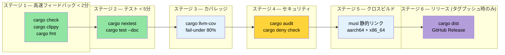

# すべての統合 — 本番環境向け CI/CD パイプライン 🟡

> **学べること:**
> - 多段 GitHub Actions CI ワークフローの構築（check → test → coverage → security → cross → release）
> - `rust-cache` と `save-if` チューニングによるキャッシュ戦略
> - 夜間スケジュールでの Miri およびサニタイザの実行
> - `Makefile.toml` と pre-commit フックによるタスク自動化
> - `cargo-dist` によるリリース自動化
>
> **関連リンク:** [ビルドスクリプト](ch01-build-scripts-buildrs-in-depth.md) · [クロスコンパイル](ch02-cross-compilation-one-source-many-target.md) · [ベンチマーク](ch03-benchmarking-measuring-what-matters.md) · [カバレッジ](ch04-code-coverage-seeing-what-tests-miss.md) · [Miri とサニタイザ](ch05-miri-valgrind-and-sanitizers-verifying-u.md) · [依存関係管理](ch06-dependency-management-and-supply-chain-s.md) · [リリースプロファイル](ch07-release-profiles-and-binary-size.md) · [コンパイル時ツール](ch08-compile-time-and-developer-tools.md) · [`no_std`](ch09-no-std-and-feature-verification.md) · [Windows](ch10-windows-and-conditional-compilation.md)

個々のツールも有用ですが、プッシュごとにそれらを自動オーケストレーションするパイプラインを構築することで、開発体験は劇的に変化します。本章では、第 1 章から第 10 章までに登場したツール群を、一貫性のある実践的な CI/CD ワークフローへと組み立てていきます。

### 完全な GitHub Actions ワークフロー

すべての検証ステージを並行実行する単一のワークフローファイルです：

```yaml
# .github/workflows/ci.yml
name: CI

on:
  push:
    branches: [main]
  pull_request:
    branches: [main]

env:
  CARGO_TERM_COLOR: always
  CARGO_ENCODED_RUSTFLAGS: "-Dwarnings"  # 警告をエラーとして扱う（トップレベルのクレートのみ）
  # 注意: RUSTFLAGS と異なり、CARGO_ENCODED_RUSTFLAGS はビルドスクリプトや
  # プロシージャルマクロには影響を与えないため、サードパーティ製クレートの警告による
  # 誤検知エラーを防ぐことができます。ビルドスクリプトにも適用したい場合は
  # RUSTFLAGS="-Dwarnings" を使用してください。

jobs:
  # ─── ステージ 1: 高速フィードバック (< 2 分) ───
  check:
    name: Check + Clippy + Format
    runs-on: ubuntu-latest
    steps:
      - uses: actions/checkout@v4
      - uses: dtolnay/rust-toolchain@stable
        with:
          components: clippy, rustfmt

      - uses: Swatinem/rust-cache@v2  # 依存関係をキャッシュ

      - name: Check Cargo.lock
        run: cargo fetch --locked

      - name: Check doc
        run: RUSTDOCFLAGS='-Dwarnings' cargo doc --workspace --all-features --no-deps

      - name: Check compilation
        run: cargo check --workspace --all-targets --all-features

      - name: Clippy lints
        run: cargo clippy --workspace --all-targets --all-features -- -D warnings

      - name: Formatting
        run: cargo fmt --all -- --check

  # ─── ステージ 2: テスト (< 5 分) ───
  test:
    name: Test (${{ matrix.os }})
    needs: check
    strategy:
      matrix:
        os: [ubuntu-latest, windows-latest]
    runs-on: ${{ matrix.os }}
    steps:
      - uses: actions/checkout@v4
      - uses: dtolnay/rust-toolchain@stable
      - uses: Swatinem/rust-cache@v2

      - name: Run tests
        run: cargo test --workspace

      - name: Run doc tests
        run: cargo test --workspace --doc

  # ─── ステージ 3: クロスコンパイル (< 10 分) ───
  cross:
    name: Cross (${{ matrix.target }})
    needs: check
    strategy:
      matrix:
        include:
          - target: x86_64-unknown-linux-musl
            os: ubuntu-latest
          - target: aarch64-unknown-linux-gnu
            os: ubuntu-latest
            use_cross: true
    runs-on: ${{ matrix.os }}
    steps:
      - uses: actions/checkout@v4
      - uses: dtolnay/rust-toolchain@stable
        with:
          targets: ${{ matrix.target }}

      - name: Install musl-tools
        if: contains(matrix.target, 'musl')
        run: sudo apt-get install -y musl-tools

      - name: Install cross
        if: matrix.use_cross
        uses: taiki-e/install-action@cross

      - name: Build (native)
        if: "!matrix.use_cross"
        run: cargo build --release --target ${{ matrix.target }}

      - name: Build (cross)
        if: matrix.use_cross
        run: cross build --release --target ${{ matrix.target }}

      - name: Upload artifact
        uses: actions/upload-artifact@v4
        with:
          name: binary-${{ matrix.target }}
          path: target/${{ matrix.target }}/release/diag_tool

  # ─── ステージ 4: カバレッジ (< 10 分) ───
  coverage:
    name: Code Coverage
    needs: check
    runs-on: ubuntu-latest
    steps:
      - uses: actions/checkout@v4
      - uses: dtolnay/rust-toolchain@stable
        with:
          components: llvm-tools-preview
      - uses: taiki-e/install-action@cargo-llvm-cov

      - name: Generate coverage
        run: cargo llvm-cov --workspace --lcov --output-path lcov.info

      - name: Enforce minimum coverage
        run: cargo llvm-cov --workspace --fail-under-lines 75

      - name: Upload to Codecov
        uses: codecov/codecov-action@v4
        with:
          files: lcov.info
          token: ${{ secrets.CODECOV_TOKEN }}

  # ─── ステージ 5: 安全性の検証 (< 15 分) ───
  miri:
    name: Miri
    needs: check
    runs-on: ubuntu-latest
    steps:
      - uses: actions/checkout@v4
      - uses: dtolnay/rust-toolchain@nightly
        with:
          components: miri

      - name: Run Miri
        run: cargo miri test --workspace
        env:
          MIRIFLAGS: "-Zmiri-backtrace=full"

  # ─── ステージ 6: ベンチマーク (PR のみ、< 10 分) ───
  bench:
    name: Benchmarks
    if: github.event_name == 'pull_request'
    needs: check
    runs-on: ubuntu-latest
    steps:
      - uses: actions/checkout@v4
      - uses: dtolnay/rust-toolchain@stable

      - name: Run benchmarks
        run: cargo bench -- --output-format bencher | tee bench.txt

      - name: Compare with baseline
        uses: benchmark-action/github-action-benchmark@v1
        with:
          tool: 'cargo'
          output-file-path: bench.txt
          github-token: ${{ secrets.GITHUB_TOKEN }}
          alert-threshold: '115%'
          comment-on-alert: true
```

**パイプライン実行フロー:**

```text
                    ┌─────────┐
                    │  check  │  ← clippy + fmt + cargo check (2 分)
                    └────┬────┘
           ┌─────────┬──┴──┬──────────┬──────────┐
           ▼         ▼     ▼          ▼          ▼
       ┌──────┐  ┌──────┐ ┌────────┐ ┌──────┐ ┌──────┐
       │ test │  │cross │ │coverage│ │ miri │ │bench │
       │ (2×) │  │ (2×) │ │        │ │      │ │(PR)  │
       └──────┘  └──────┘ └────────┘ └──────┘ └──────┘
         3 分      8 分      8 分      12 分     5 分

合計実時間: 約 14 分 (check ゲート通過後は並行実行)
```

### CI キャッシュ戦略

[`Swatinem/rust-cache@v2`](https://github.com/Swatinem/rust-cache) は、標準的な Rust CI キャッシュアクションです。実行間で `~/.cargo` と `target/` をキャッシュしますが、大規模なワークスペースではチューニングが必要です：

```yaml
# 基本設定（上記で使用したもの）
- uses: Swatinem/rust-cache@v2

# 大規模ワークスペース向けにチューニングした設定:
- uses: Swatinem/rust-cache@v2
  with:
    # ジョブごとにキャッシュを分離 — テスト成果物によるビルドキャッシュの肥大化を防止
    prefix-key: "v1-rust"
    key: ${{ matrix.os }}-${{ matrix.target || 'default' }}
    # main ブランチでのみキャッシュを保存（PR は読み取りのみで書き込みはしない）
    save-if: ${{ github.ref == 'refs/heads/main' }}
    # Cargo レジストリ + git チェックアウト + target ディレクトリをキャッシュ
    cache-targets: true
    cache-all-crates: true
```

**キャッシュ無効化の落とし穴:**

| 問題 | 解決策 |
|------|--------|
| キャッシュが無制限に肥大化 (>5 GB) | `prefix-key: "v2-rust"` を設定してクリーンなキャッシュを強制 |
| 異なるフィーチャがキャッシュを汚染 | `key: ${{ hashFiles('**/Cargo.lock') }}` を使用 |
| PR のキャッシュが main を上書き | `save-if: ${{ github.ref == 'refs/heads/main' }}` を設定 |
| クロスコンパイルのターゲットで肥大化 | ターゲットトリプルごとに個別の `key` を使用 |

**ジョブ間でのキャッシュの共有:**

`check` ジョブがキャッシュを保存し、後続のジョブ（`test`, `cross`, `coverage`）がそれを読み取ります。`save-if` を `main` のみに設定することで、PR の実行時にもキャッシュされた依存関係の恩恵を受けつつ、不要なキャッシュで上書きされるのを防ぐことができます。

> **大規模ワークスペースでの測定効果**: コールドビルド約 4 分 → キャッシュありビルド約 45 秒。キャッシュアクション単体で、パイプライン実行あたり約 25 分の CI 時間（すべての並行ジョブの合計）を節約できます。

### cargo-make による Makefile.toml

[`cargo-make`](https://sagiegurari.github.io/cargo-make/) は、（`make`/`Makefile` とは異なり）プラットフォーム間で動作するポータブルなタスクランナーを提供します：

```bash
# インストール
cargo install cargo-make
```

```toml
# Makefile.toml — ワークスペースルートに配置

[config]
default_to_workspace = false

# ─── 開発者向けワークフロー ───

[tasks.dev]
description = "ローカル環境での完全検証 (CI と同等のチェック)"
dependencies = ["check", "test", "clippy", "fmt-check"]

[tasks.check]
command = "cargo"
args = ["check", "--workspace", "--all-targets"]

[tasks.test]
command = "cargo"
args = ["test", "--workspace"]

[tasks.clippy]
command = "cargo"
args = ["clippy", "--workspace", "--all-targets", "--", "-D", "warnings"]

[tasks.fmt]
command = "cargo"
args = ["fmt", "--all"]

[tasks.fmt-check]
command = "cargo"
args = ["fmt", "--all", "--", "--check"]

# ─── カバレッジ ───

[tasks.coverage]
description = "HTML カバレッジレポートの生成"
install_crate = "cargo-llvm-cov"
command = "cargo"
args = ["llvm-cov", "--workspace", "--html", "--open"]

[tasks.coverage-ci]
description = "CI アップロード用の LCOV レポート生成"
install_crate = "cargo-llvm-cov"
command = "cargo"
args = ["llvm-cov", "--workspace", "--lcov", "--output-path", "lcov.info"]

# ─── ベンチマーク ───

[tasks.bench]
description = "すべてのベンチマークを実行"
command = "cargo"
args = ["bench"]

# ─── クロスコンパイル ───

[tasks.build-musl]
description = "静的バイナリのビルド (musl)"
command = "cargo"
args = ["build", "--release", "--target", "x86_64-unknown-linux-musl"]

[tasks.build-arm]
description = "aarch64 向けビルド (cross が必要)"
command = "cross"
args = ["build", "--release", "--target", "aarch64-unknown-linux-gnu"]

[tasks.build-all]
description = "すべてのデプロイターゲット向けにビルド"
dependencies = ["build-musl", "build-arm"]

# ─── 安全性の検証 ───

[tasks.miri]
description = "全テストに対して Miri を実行"
toolchain = "nightly"
command = "cargo"
args = ["miri", "test", "--workspace"]

[tasks.audit]
description = "既知の脆弱性をチェック"
install_crate = "cargo-audit"
command = "cargo"
args = ["audit"]

# ─── リリース ───

[tasks.release-dry]
description = "cargo-release の実行内容をプレビュー"
install_crate = "cargo-release"
command = "cargo"
args = ["release", "--workspace", "--dry-run"]
```

**使用方法:**

```bash
# CI パイプラインと同等のチェックをローカルで実行
cargo make dev

# カバレッジを生成してブラウザで確認
cargo make coverage

# すべてのターゲット向けにビルド
cargo make build-all

# 安全性チェックを実行
cargo make miri

# 脆弱性をチェック
cargo make audit
```

### Pre-Commit フック: カスタムスクリプトと `cargo-husky`

問題が CI に到達する*前*に検出します。推奨されるアプローチはカスタム git フックです — シンプルで透過的であり、外部依存関係がありません：

```bash
#!/bin/sh
# .githooks/pre-commit

set -e

echo "=== Pre-commit checks ==="

# 高速なチェックを先に実行
echo "→ cargo fmt --check"
cargo fmt --all -- --check

echo "→ cargo check"
cargo check --workspace --all-targets

echo "→ cargo clippy"
cargo clippy --workspace --all-targets -- -D warnings

echo "→ cargo test (lib only, fast)"
cargo test --workspace --lib

echo "=== All checks passed ==="
```

```bash
# フックの登録
git config core.hooksPath .githooks
chmod +x .githooks/pre-commit
```

**代替案: `cargo-husky`** (ビルドスクリプト経由でフックを自動インストール):

> ⚠️ **注意**: `cargo-husky` は 2022 年以降更新されていません。現在も機能はしますが、実質的にはメンテナンスされていません。新規プロジェクトには、上記のカスタムフックのアプローチを検討してください。

```bash
cargo install cargo-husky
```

```toml
# Cargo.toml — ルートクレートの dev-dependencies に追加
[dev-dependencies]
cargo-husky = { version = "1", default-features = false, features = [
    "precommit-hook",
    "run-cargo-check",
    "run-cargo-clippy",
    "run-cargo-fmt",
    "run-cargo-test",
] }
```

### リリースワークフロー: `cargo-release` と `cargo-dist`

**`cargo-release`** — バージョン引き上げ、タグ付け、公開作業を自動化：

```bash
# インストール
cargo install cargo-release
```

```toml
# release.toml — ワークスペースルートに配置
[workspace]
consolidate-commits = true
pre-release-commit-message = "chore: release {{version}}"
tag-message = "v{{version}}"
tag-name = "v{{version}}"

# 内部用クレートは公開しない
[[package]]
name = "core_lib"
release = false

[[package]]
name = "diag_framework"
release = false

# メインバイナリのみ公開
[[package]]
name = "diag_tool"
release = true
```

```bash
# リリースのプレビュー
cargo release patch --dry-run

# リリースを実行（バージョンの引き上げ、コミット、タグ付け、オプションで公開）
cargo release patch --execute
# 0.1.0 → 0.1.1

cargo release minor --execute
# 0.1.1 → 0.2.0
```

**`cargo-dist`** — GitHub Releases 向けにダウンロード可能なリリースバイナリを生成：

```bash
# インストール
cargo install cargo-dist

# 初期化（CI ワークフローとメタデータを作成）
cargo dist init

# ビルドされる内容のプレビュー
cargo dist plan

# リリース成果物の生成（通常はタグプッシュ時に CI が実行）
cargo dist build
```

```toml
# `cargo dist init` によって Cargo.toml に追加される内容
[workspace.metadata.dist]
cargo-dist-version = "0.28.0"
ci = "github"
targets = [
    "x86_64-unknown-linux-gnu",
    "x86_64-unknown-linux-musl",
    "aarch64-unknown-linux-gnu",
    "x86_64-pc-windows-msvc",
]
install-path = "CARGO_HOME"
```

これにより、タグがプッシュされたときに以下の処理を行う GitHub Actions ワークフローが生成されます：
1. すべてのターゲットプラットフォーム向けにバイナリをビルド
2. ダウンロード可能な `.tar.gz` / `.zip` アーカイブを添付した GitHub Release を作成
3. シェルスクリプトおよび PowerShell インストーラスクリプトを生成
4. crates.io に公開（設定されている場合）

### 実際にやってみよう — 総合演習問題

この演習ではこれまでの全章を総動員します。新規の Rust ワークスペースに対して、完全なエンジニアリングパイプラインを構築してみましょう：

1. **新規ワークスペースの作成**: ライブラリ（`core_lib`）とバイナリ（`cli`）の 2 つのクレートを作成します。`SOURCE_DATE_EPOCH` を使用して git ハッシュとビルドタイムスタンプを埋め込む `build.rs` を追加します（第 1 章）。

2. **クロスコンパイルのセットアップ**: `x86_64-unknown-linux-musl` および `aarch64-unknown-linux-gnu` 向けの設定を行います。`cargo zigbuild` または `cross` で両方のターゲットがビルドできることを検証します（第 2 章）。

3. **ベンチマークの追加**: `core_lib` の関数に対して Criterion または Divan を使用したベンチマークを追加します。ローカルで実行してベースラインを記録します（第 3 章）。

4. **コードカバレッジの測定**: `cargo llvm-cov` を使用します。最低 80% の閾値を設定し、テストがそれを満たしていることを確認します（第 4 章）。

5. **`cargo +nightly careful test` と `cargo miri test` の実行**: `unsafe` コードがある場合は、それを実行するテストを追加します（第 5 章）。

6. **`cargo-deny` の設定**: `openssl` を禁止し、MIT/Apache-2.0 ライセンスを強制する `deny.toml` を設定します（第 6 章）。

7. **リリースプロファイルの最適化**: `lto = "thin"`, `strip = true`, `codegen-units = 1` を設定します。`cargo bloat` を使用して適用前後のバイナリサイズを測定します（第 7 章）。

8. **`cargo hack --each-feature` による検証の追加**: オプションの依存関係に対するフィーチャフラグを作成し、それ単体でコンパイルできることを確認します（第 9 章）。

9. **GitHub Actions ワークフローの作成**: 6 つの全ステージを含むワークフローを作成します（本章）。`save-if` チューニングを施した `Swatinem/rust-cache@v2` を追加します。

**成功の基準**: GitHub にプッシュ → すべての CI ステージがグリーン → `cargo dist plan` でリリースターゲットが表示される。これで本番運用の水準を満たす Rust パイプラインの完成です。

### CI パイプラインのアーキテクチャ



### 重要ポイント

- CI は並行ステージとして構成する: 高速なチェックを最初に実行し、コストの高いジョブはゲートの後ろに配置する。
- `Swatinem/rust-cache@v2` と `save-if: ${{ github.ref == 'refs/heads/main' }}` の組み合わせにより、PR によるキャッシュのスラッシングを防ぐ。
- Miri や重いサニタイザは、プッシュごとではなく夜間の `schedule:` トリガーで実行する。
- `Makefile.toml`（`cargo make`）により、複数ツールのワークフローをローカル開発用の単一コマンドにまとめる。
- `cargo-dist` によりクロスプラットフォームのリリースビルドを自動化する — プラットフォームマトリクスの YAML を手書きするのはやめましょう。

---
