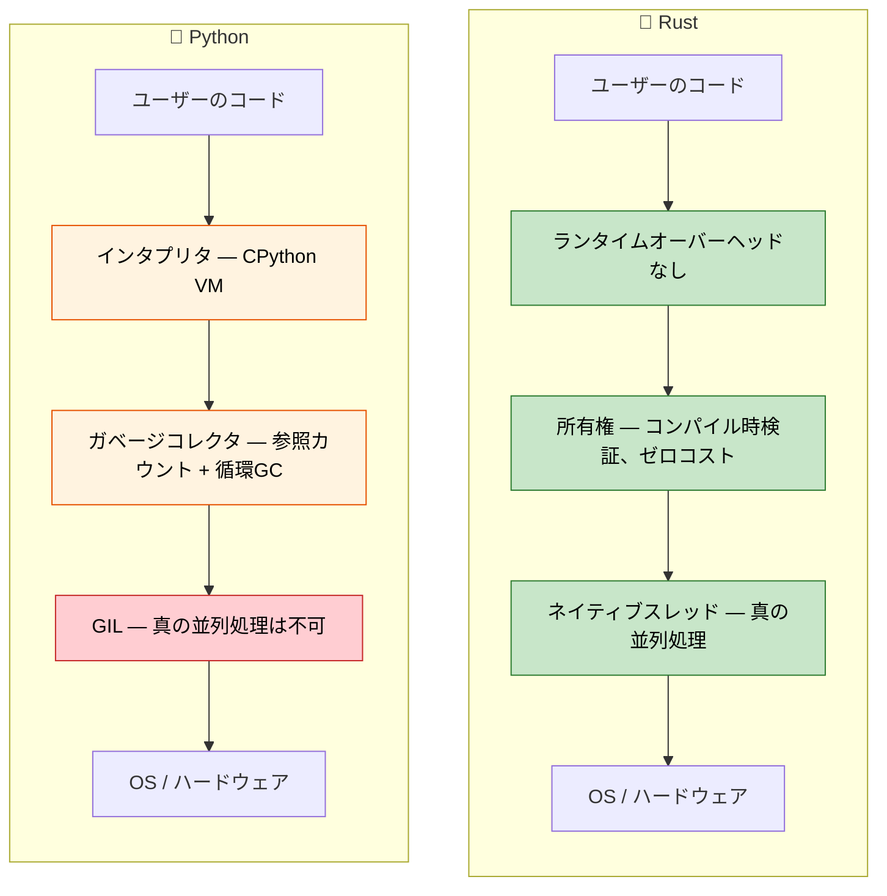

## 講師紹介と全体的なアプローチ

- 講師紹介
    - Microsoft SCHIE (Silicon and Cloud Hardware Infrastructure Engineering) チーム プリンシパルファームウェアアーキテクト
    - セキュリティ、システムプログラミング（ファームウェア、オペレーティングシステム、ハイパーバイザ）、CPUおよびプラットフォームアーキテクチャ、C++システムに関する深い専門知識を持つ業界のベテラン
    - 2017年に（@AWS EC2にて）Rustプログラミングを始め、以来この言語に魅了され続けている
- 本コースは可能な限りインタラクティブに進めることを目指しています
    - 前提：受講者がPythonとそのエコシステムを理解していること
    - 意図的にPythonの概念をRustの対応概念へとマッピングしたコード例を使用
    - **疑問点があれば、いつでも遠慮なく質問してください**

---

## Python開発者がRustを学ぶ理由

> **この章で学ぶこと:** Python開発者がなぜRustを採用しているのか、実際の現場における劇的なパフォーマンス向上事例（Dropbox、Discord、Pydantic）、Pythonを使い続けるべきケースとRustを選択すべきタイミング、そして両言語の根本的な設計思想の違いについて学びます。
>
> **難易度:** 🟢 初級

### パフォーマンス: 分単位からミリ秒単位へ

PythonはCPUバウンドな処理が遅いことで知られています。Rustは、高水準言語のような書き味を保ちつつ、C言語と同等の圧倒的なパフォーマンスを提供します。

```python
# Python — 1000万回の呼び出しで約2秒
import time

def fibonacci(n: int) -> int:
    if n <= 1:
        return n
    a, b = 0, 1
    for _ in range(2, n + 1):
        a, b = b, a + b
    return b

start = time.perf_counter()
results = [fibonacci(n % 30) for n in range(10_000_000)]
elapsed = time.perf_counter() - start
print(f"Elapsed: {elapsed:.2f}s")  # 一般的なハードウェアで約2秒
```

```rust
// Rust — 同じ1000万回の呼び出しで約0.07秒
use std::time::Instant;

fn fibonacci(n: u64) -> u64 {
    if n <= 1 {
        return n;
    }
    let (mut a, mut b) = (0u64, 1u64);
    for _ in 2..=n {
        let temp = b;
        b = a + b;
        a = temp;
    }
    b
}

fn main() {
    let start = Instant::now();
    let results: Vec<u64> = (0..10_000_000).map(|n| fibonacci(n % 30)).collect();
    println!("Elapsed: {:.2?}", start.elapsed());  // 約0.07秒
}
```
> 注: 公平なパフォーマンス比較を行うには、Rustをリリースモード（`cargo run --release`）で実行する必要があります。
> **なぜこれほどの差が出るのか？** Pythonはすべての `+` 演算ごとに辞書ルックアップを経由し、ヒープオブジェクトから整数をアンボックスし、毎操作ごとに型チェックを行います。一方、Rustは `fibonacci` を一握りの x86 `add`/`mov` 命令に直接コンパイルします — これはC言語のコンパイラが生成する機械語と実質的に同じです。

### ガベージコレクタなしでのメモリ安全性

Pythonの参照カウント式GCには、循環参照、`__del__` の実行タイミングの予測不可能性、メモリ断片化といった既知の課題があります。Rustはこれらをコンパイル時に完全に排除します。

```python
# Python — CPythonの参照カウンタでは解放できない循環参照
class Node:
    def __init__(self, value):
        self.value = value
        self.parent = None
        self.children = []

    def add_child(self, child):
        self.children.append(child)
        child.parent = self  # 循環参照が発生！

# これら2つのノードは互いを参照し合うため、参照カウントが0になることはありません。
# CPythonの循環参照ガベージコレクタが「いつかは」回収しますが、
# そのタイミングを制御することはできず、GCの一時停止オーバーヘッドが発生します。
root = Node("root")
child = Node("child")
root.add_child(child)
```

```rust
// Rust — 所有権システムにより設計段階で循環参照を防止
struct Node {
    value: String,
    children: Vec<Node>,  // 子ノードは「所有」される — 循環は構造上不可能
}

impl Node {
    fn new(value: &str) -> Self {
        Node {
            value: value.to_string(),
            children: Vec::new(),
        }
    }

    fn add_child(&mut self, child: Node) {
        self.children.push(child);  // ここで所有権が移動（ムーブ）する
    }
}

fn main() {
    let mut root = Node::new("root");
    let child = Node::new("child");
    root.add_child(child);
    // root がスコープを抜けてドロップされると、すべての子ノードも自動的にドロップされる。
    // 決定論的で、オーバーヘッドゼロ、GCも不要。
}
```

> **重要な洞察**: Rustでは、子ノードから親ノードへの逆方向の参照は保持しません。
> グラフ構造のように真に相互参照が必要な場合は、`Rc<RefCell<T>>` やインデックス参照などの明示的なメカニズムを使用します。これにより、複雑さが目に見える形で意図的に管理されます。

***

## Rustが解決するPythonの代表的な課題

### 1. 実行時型エラー

Pythonのプロダクション環境で最も頻発するバグは、関数に不正な型の引数を渡してしまうことです。型ヒントは助けになりますが、実行時に強制されるわけではありません。

```python
# Python — 型ヒントは単なる「目安」であり、強制力はない
def process_user(user_id: int, name: str) -> dict:
    return {"id": user_id, "name": name.upper()}

# 呼び出し側ではすべて「動いて」しまい、実行時にクラッシュする
process_user("not-a-number", 42)        # TypeError: int には .upper() が存在しない
process_user(None, "Alice")             # 暗黙的に None が id として保存される — 後続のコードが int を期待するまでバグが潜伏する

# mypy を導入していても、型のすり抜けは防ぎきれない:
data = json.loads('{"id": "oops"}')     # 常に Any を返す
process_user(data["id"], data["name"])  # mypy はこれを検知できない
```

```rust
// Rust — プログラムを実行する前に、コンパイラがこれらすべてを検出する
fn process_user(user_id: i64, name: &str) -> User {
    User {
        id: user_id,
        name: name.to_uppercase(),
    }
}

// process_user("not-a-number", 42);     // ❌ コンパイルエラー: expected i64, found &str
// process_user(None, "Alice");           // ❌ コンパイルエラー: expected i64, found Option
// 引数の過不足も常にコンパイルエラーになる。

// JSONのデシリアライズも型安全:
#[derive(Deserialize)]
struct UserInput {
    id: i64,      // JSON内で数値でなければならない
    name: String, // JSON内で文字列でなければならない
}
let input: UserInput = serde_json::from_str(json_str)?; // 型が一致しない場合は Err を返す
process_user(input.id, &input.name); // ✅ 正しい型であることがコンパイル時に保証される
```

### 2. None: 10億ドルの過ち（Python編）

値が期待されるあらゆる場所に `None` が紛れ込む可能性があります。Pythonには、`AttributeError: 'NoneType' object has no attribute ...` をコンパイル時に防ぐ手立てがありません。

```python
# Python — None はあらゆる場所に潜り込む
def find_user(user_id: int) -> dict | None:
    users = {1: {"name": "Alice"}, 2: {"name": "Bob"}}
    return users.get(user_id)

user = find_user(999)         # None を返す
print(user["name"])           # 💥 TypeError: 'NoneType' object is not subscriptable

# Optional 型ヒントを付けていても、チェックは強制されない:
from typing import Optional
def get_name(user_id: int) -> Optional[str]:
    return None

name: Optional[str] = get_name(1)
print(name.upper())          # 💥 AttributeError — mypy は警告するが、実行時にはクラッシュする
```

```rust
// Rust — 明示的に処理しない限り None（不在）を扱うことはできない
fn find_user(user_id: i64) -> Option<User> {
    let users = HashMap::from([
        (1, User { name: "Alice".into() }),
        (2, User { name: "Bob".into() }),
    ]);
    users.get(&user_id).cloned()
}

let user = find_user(999);  // Option<User> の None バリアントを返す
// println!("{}", user.name);  // ❌ コンパイルエラー: Option<User> にフィールド `name` は存在しない

// None のケースを「必ず」ハンドリングしなければならない:
match find_user(999) {
    Some(user) => println!("{}", user.name),
    None => println!("ユーザーが見つかりません"),
}

// またはコンビネータを使用する:
let name = find_user(999)
    .map(|u| u.name)
    .unwrap_or_else(|| "Unknown".to_string());
```

### 3. GIL: Pythonの並行処理の壁

PythonのGIL（グローバルインタプリタロック）により、複数スレッドでPythonコードを真に並列実行することはできません。`threading` はI/Oバウンドな作業にしか役立たず、CPUバウンドな処理を並列化するには（シリアライズのオーバーヘッドが伴う）`multiprocessing` やC拡張機能が必要になります。

```python
# Python — GILのせいでスレッドを使ってもCPUバウンドな処理は高速化されない
import threading
import time

def cpu_work(n):
    total = 0
    for i in range(n):
        total += i * i
    return total

start = time.perf_counter()
threads = [threading.Thread(target=cpu_work, args=(10_000_000,)) for _ in range(4)]
for t in threads:
    t.start()
for t in threads:
    t.join()
elapsed = time.perf_counter() - start
print(f"4 threads: {elapsed:.2f}s")  # 1スレッドの場合とほぼ同じ！GILが並列実行を阻止する。

# multiprocessing は一応「動作」するが、プロセス間でデータのシリアライズが発生する:
from multiprocessing import Pool
with Pool(4) as p:
    results = p.map(cpu_work, [10_000_000] * 4)  # 約4倍高速化するが、pickle のオーバーヘッドが大きい
```

```rust
// Rust — 真の並列処理、GILなし、シリアライズオーバーヘッドなし
use std::thread;

fn cpu_work(n: u64) -> u64 {
    (0..n).map(|i| i * i).sum()
}

fn main() {
    let start = std::time::Instant::now();
    let handles: Vec<_> = (0..4)
        .map(|_| thread::spawn(|| cpu_work(3_000_000)))
        .collect();

    let results: Vec<u64> = handles.into_iter()
        .map(|h| h.join().unwrap())
        .collect();

    println!("4 threads: {:.2?}", start.elapsed());  // シングルスレッドの約4倍高速
}
```

> **Rayon**（Rustの並列イテレータライブラリ）を使えば、並列化はさらに簡単になります：
> ```rust
> use rayon::prelude::*;
> let results: Vec<u64> = inputs.par_iter().map(|&n| cpu_work(n)).collect();
> ```

### 4. デプロイと配布の苦痛

Pythonのデプロイは困難を極めることで有名です。仮想環境（venv）、システムPythonとの競合、`pip install` の失敗、C拡張機能のwheelビルド、Pythonランタイム丸ごとを含んだ巨大なDockerイメージなど、課題が山積みです。

```python
# Pythonのデプロイ確認事項:
# 1. Pythonのバージョンはどれか？ 3.9? 3.10? 3.11? 3.12?
# 2. 仮想環境ツールは何を使うか？ venv, conda, poetry, pipenv?
# 3. C拡張機能: コンパイラは必要か？ manylinux wheels はあるか？
# 4. システム依存関係: libssl, libffi などは揃っているか？
# 5. Docker: python:3.12 完全版イメージは約 1.0 GB
# 6. 起動時間: インポートが多いアプリでは 200〜500ms かかる

# Docker イメージ: 約 1 GB
# FROM python:3.12-slim
# COPY requirements.txt .
# RUN pip install -r requirements.txt
# COPY . .
# CMD ["python", "app.py"]
```

```rust
// Rustのデプロイ: 単一の静的バイナリ、ランタイム不要
// cargo build --release → 約 5〜20 MB の単一バイナリを生成
// どこへでもコピーして実行可能 — Pythonもvenvも依存ライブラリも不要

// Docker イメージ: 約 5 MB（scratch または distroless ベース）
// FROM scratch
// COPY target/release/my_app /my_app
// CMD ["/my_app"]

// 起動時間: 1ms 未満
// クロスコンパイル: cargo build --target x86_64-unknown-linux-musl
```

***

## Pythonの代わりにRustを選択すべき状況

### Rustを選ぶべきケース:
- **パフォーマンスが極めて重要**: データパイプライン、リアルタイム処理、高負荷な計算サービス
- **正しさと安全性が最優先**: 金融システム、セーフティクリティカルなコード、プロトコル実装
- **デプロイをシンプルにしたい**: 単一バイナリ、ランタイム依存関係ゼロ
- **低レベルなハードウェア制御**: デバイス制御、OS統合、組み込みシステム
- **真の並行処理が必要**: GILの回避策に悩まされることのないCPU並列化
- **メモリ効率を追求したい**: メモリ集約型サービスのクラウドインフラ費用を削減
- **長時間稼働するマイクロサービス**: GC一時停止のない予測可能なレイテンシが要求される環境

### Pythonを使い続けるべきケース:
- **迅速なプロトタイピング**: 探索的データ解析、簡易スクリプト、使い捨てツール
- **機械学習 / AI ワークフロー**: PyTorch、TensorFlow、scikit-learn などの強力なエコシステム
- **グルーコード（糊付け役）**: 外部API同士の連携、データの変換・転送スクリプト
- **チームの習熟度**: Rustの学習コストに見合うメリットがプロジェクトにない場合
- **市場投入スピード（Time to Market）**: 実行速度よりも開発速度が最優先される場合
- **対話型・試行錯誤の開発**: Jupyter Notebook や REPL による開発
- **自動化スクリプト**: システム管理タスク、ちょっとしたユーティリティ作成

### 両方を組み合わせるアプローチ（PyO3 によるハイブリッド運用）:
- **高負荷な計算部分のみRustで記述**: PyO3 / maturin を介してPythonから呼び出す
- **ビジネスロジックやオーケストレーションはPythonで記述**: 慣れ親しんだ生産性を維持
- **段階的な移行**: ボトルネックとなっているホットスポットをプロファイリングで特定し、Rust拡張に置き換える
- **両方のいいとこ取り**: Pythonの豊富なエコシステム ＋ Rustの圧倒的な実行速度

***

## 実際の現場における効果: 企業がRustを採用する理由

### Dropbox: ストレージインフラストラクチャ
- **移行前（Python）**: 同期エンジンにおける高いCPU使用率とメモリオーバーヘッド
- **移行後（Rust）**: 10倍のパフォーマンス向上、メモリ使用量を50%削減
- **成果**: 何百万ドルものインフラストラクチャ費用の削減

### Discord: 音声・動画バックエンド
- **移行前（Python → Go）**: GCの一時停止（Stop-the-World）による音声の途切れ
- **移行後（Rust）**: 一貫した低レイテンシ性能を実現
- **成果**: ユーザー体験の大幅な向上、サーバー台数の削減

### Cloudflare: Edge Workers
- **Rustの採用理由**: WebAssemblyへのコンパイル、エッジ環境における予測可能な性能
- **成果**: マイクロ秒単位のコールドスタートでWorkerを実行可能に

### Pydantic V2
- **移行前**: 純粋なPythonによるデータバリデーション — 大容量ペイロードでボトルネックに
- **移行後**: コアロジックをRust（PyO3経由）で再実装 — バリデーション速度が **5〜50倍高速化**
- **成果**: Python側のAPIはそのままに、劇的なパフォーマンス向上を達成

### Python開発者にとってこれが何を意味するのか:
1. **補完的なスキルセット**: RustとPythonは異なる課題を解決する最適なパートナー
2. **PyO3 による架け橋**: Pythonから直接呼び出せるRust拡張機能を柔軟に開発可能
3. **パフォーマンスの構造的理解**: Pythonがなぜ遅いのか、ボトルネックをどう解消すべきかの解像度が上がる
4. **キャリアの発展**: システムプログラミングの専門スキルは業界で極めて高い需要がある
5. **クラウド費用の最適化**: 10倍高速なコードは、インフラ費用の劇的な削減に直結する

***

## 言語設計思想の比較

### Pythonの思想
- **読みやすさの重視**: クリーンな構文、「誰にとっても明白な唯一の方法（There should be one-- and preferably only one --obvious way to do it）」
- **Batteries included（電池付属）**: 充実した標準ライブラリ、迅速なプロトタイピング
- **ダックタイピング**: 「アヒルのように歩き、アヒルのように鳴くなら、それはアヒルだ」
- **開発者の生産性**: 実行速度よりも、コードを書く速度を最優先
- **徹底した動的性**: 実行時のクラス改変、モンキーパッチ、メタクラス

### Rustの思想
- **妥協のないパフォーマンス**: ゼロコスト抽象化、実行時オーバーヘッドなし
- **正しさを第一に**: コンパイルが通れば、膨大なカテゴリのバグが原理的に排除される
- **暗黙的よりも明示的**: 隠れた挙動や暗黙の型変換を排除
- **所有権システム**: すべてのリソース（メモリ、ファイル、ソケット）に対して単一の所有者を厳密に定義
- **恐れなき並行性（Fearless Concurrency）**: 型システムによってデータ競合をコンパイル時に防止



***

## クイックリファレンス: Rust vs Python

| **概念** | **Python** | **Rust** | **主な違い** |
|---|---|---|---|
| 型システム | 動的型付け（ダックタイピング） | 静的型付け（コンパイル時検査） | 実行前に型エラーをすべて検出 |
| メモリ管理 | ガベージコレクション（参照カウント＋循環GC） | 所有権システム | ゼロコストで決定論的な自動解放 |
| None / null | どこにでも `None` が存在可能 | `Option<T>` | コンパイル時に None 安全性を保証 |
| エラー処理 | `raise` / `try` / `except` | `Result<T, E>` | 明示的で、隠れた制御フローがない |
| 可変性 | すべてがデフォルトで可変 | デフォルトで不変（immutable） | 変更には明示的な宣言が必要（`mut`） |
| 実行速度 | インタプリタ実行（約10〜100倍遅い） | ネイティブコンパイル（C/C++と同等） | 桁違いの高速性 |
| 並行性 | GILによりスレッドの並列実行が制限 | GILなし、`Send` / `Sync` トレイト | デフォルトで真の並列処理が可能 |
| 依存関係管理 | `pip install` / `poetry add` | `cargo add` | 言語標準の統合パッケージマネージャ |
| ビルドシステム | setuptools / poetry / hatch | Cargo | 単一の標準ツールで完結 |
| パッケージ設定 | `pyproject.toml` | `Cargo.toml` | 同様の宣言的な設定ファイル |
| REPL | `python` の対話型シェル | 標準REPLなし（テストや `cargo run` を使用） | コンパイル優先のワークフロー |
| 型ヒント | 任意、実行時には強制されない | 必須、コンパイラによって厳密に強制 | 型定義は単なる飾りではない |

---

## 演習問題

<details>
<summary><strong>🏋️ 演習: メンタルモデルの確認</strong>（クリックして展開）</summary>

**課題**: 以下のPythonコードのスニペットそれぞれについて、Rustではどのような制約や記述の違いが求められるか予測してください。コードを書く必要はありません — 制約の内容を言葉で説明してください。

1. `x = [1, 2, 3]; y = x; x.append(4)` — Rustでは何が起こるでしょうか？
2. `data = None; print(data.upper())` — Rustはこれをどのように防ぐでしょうか？
3. `import threading; shared = []; threading.Thread(target=shared.append, args=(1,)).start()` — Rustは何を要求するでしょうか？

<details>
<summary>🔑 解答</summary>

1. **所有権のムーブ**: `let y = x;` を行うと `x` の所有権が `y` に移動（ムーブ）するため、以降の `x.push(4)` はコンパイルエラーになります。元の `x` を保持したい場合は `let y = x.clone();` で明示的に複製するか、`let y = &x;` で借用する必要があります。
2. **null の非存在**: `data` が明示的に `Option<String>` として定義されていない限り、`None` を代入すること自体ができません。また、`Option` 型の値に対しては、`match` や `if let`、`.unwrap()` などで中身を取り出す処理を明示的に書かない限りメソッドを呼び出せないため、予期せぬ `NoneType` エラーは発生しません。
3. **Send と Sync**: コンパイラは、スレッド間で共有される `shared` を `Arc<Mutex<Vec<i32>>>` のようなスレッドセーフな型でラップすることを要求します。ロックの取得を忘れたコードはコンパイルエラーとなり、データ競合が発生する前に弾かれます。

**重要ポイント**: Rustは、実行時の致命的な障害をコンパイル時のエラーへとシフトさせます。開発時に感じる「厳しさ」は、コンパイラが潜在的なバグを未然に摘み取ってくれている証拠です。

</details>
</details>

***
