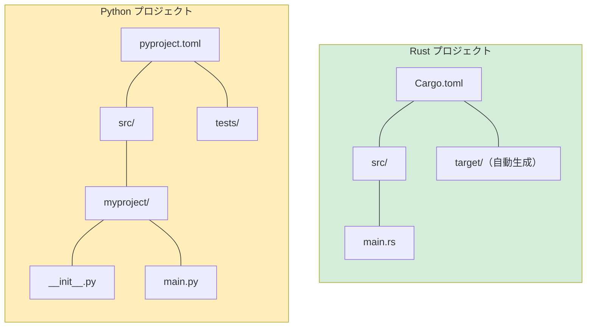

## インストールとセットアップ

> **この章で学ぶこと:** Rustとそのツールチェーンのインストール方法、Cargoビルドシステムとpip/Poetryの比較、IDEの環境構築、最初の「Hello, world!」プログラム、そしてPythonの対応概念と紐付けたRustの必須キーワードについて学びます。
>
> **難易度:** 🟢 初級

### Rustのインストール
```bash
# rustup 経由で Rust をインストール（Linux/macOS/WSL）
curl --proto '=https' --tlsv1.2 -sSf https://sh.rustup.rs | sh

# インストールの確認
rustc --version     # Rust コンパイラ
cargo --version     # ビルドツール兼パッケージマネージャ（pip + setuptools を統合したようなツール）

# Rust のアップデート
rustup update
```

### RustツールとPythonツールの比較

| 用途 | Python | Rust |
|---|---|---|
| 言語ランタイム | `python`（インタプリタ） | `rustc`（コンパイラ、直接呼び出すことは稀） |
| パッケージマネージャ | `pip` / `poetry` / `uv` | `cargo`（標準搭載） |
| プロジェクト設定 | `pyproject.toml` | `Cargo.toml` |
| ロックファイル | `poetry.lock` / `requirements.txt` | `Cargo.lock` |
| 仮想環境 | `venv` / `conda` | 不要（依存関係はプロジェクト単位で独立管理） |
| フォーマッタ | `black` / `ruff format` | `rustfmt`（標準搭載: `cargo fmt`） |
| リンター | `ruff` / `flake8` / `pylint` | `clippy`（標準搭載: `cargo clippy`） |
| 型チェッカー | `mypy` / `pyright` | コンパイラに内蔵（常に有効） |
| テストランナー | `pytest` | `cargo test`（標準搭載） |
| ドキュメント生成 | `sphinx` / `mkdocs` | `cargo doc`（標準搭載） |
| REPL | `python` / `ipython` | なし（`cargo test` や Rust Playground を活用） |

### IDEのセットアップ

**VS Code**（推奨）:
```text
推奨拡張機能:
- rust-analyzer        ← 必須: IDE機能、型ヒントのインライン表示、コード補完
- Even Better TOML     ← Cargo.toml の構文ハイライト
- CodeLLDB             ← デバッガサポート

# Python における対応関係:
# rust-analyzer ≈ Pylance（ただし常に100%の型カバレッジを提供）
# cargo clippy  ≈ ruff（ただしスタイルだけでなくコードの正しさも検証）
```

***

## 最初のRustプログラム

### Pythonの Hello World
```python
# hello.py — スクリプトを直接実行
print("Hello, World!")

# 実行方法:
# python hello.py
```

### Rustの Hello World
```rust
// src/main.rs — 最初にコンパイルが必要
fn main() {
    println!("Hello, World!");   // println! はマクロ（! が目印）
}

// ビルドして実行:
// cargo run
```

### Python開発者から見た主な相違点

```text
Python:                              Rust:
─────────                            ─────
- main() 関数は必須ではない          - fn main() が実行のエントリポイント
- インデントでブロックを表現         - 中括弧 {} でブロックを表現
- print() は通常の関数               - println!() はマクロ（末尾の ! が必須）
- セミコロン不要                     - 文の終端にセミコロン (;) が必要
- 型宣言は任意                       - 型推論されるが、すべての型が静的に決定される
- インタプリタ実行（即座に実行）     - コンパイル実行（cargo build で生成してから実行）
- エラーは実行時に発覚               - 大半のエラーがコンパイル時に検出される
```

### 最初のプロジェクトを作成する
```bash
# Python                              # Rust
mkdir myproject                        cargo new myproject
cd myproject                           cd myproject
python -m venv .venv                   # 仮想環境の作成は不要
source .venv/bin/activate              # 仮想環境の有効化も不要
# ファイルを手動作成                  # src/main.rs が自動生成される

# Python プロジェクト構造:             Rust プロジェクト構造:
# myproject/                           myproject/
# ├── pyproject.toml                   ├── Cargo.toml        (pyproject.toml に相当)
# ├── src/                             ├── src/
# │   └── myproject/                   │   └── main.rs       (エントリポイント)
# │       ├── __init__.py              └── (各フォルダへの __init__.py は不要)
# │       └── main.py
# └── tests/
#     └── test_main.py
```



> **大きな違い**: Rustのプロジェクト構造ははるかにシンプルです — `__init__.py` も、仮想環境も、`setup.py` / `setup.cfg` / `pyproject.toml` のどれを使うべきかという混乱もありません。`Cargo.toml` と `src/` だけで完結します。

***

## Cargo と pip/Poetry の比較

### プロジェクト設定ファイル

```toml
# Python — pyproject.toml
[project]
name = "myproject"
version = "0.1.0"
requires-python = ">=3.10"
dependencies = [
    "requests>=2.28",
    "pydantic>=2.0",
]

[project.optional-dependencies]
dev = ["pytest", "ruff", "mypy"]
```

```toml
# Rust — Cargo.toml
[package]
name = "myproject"
version = "0.1.0"
edition = "2021"          # Rustのエディション（Pythonのバージョン指定に相当）

[dependencies]
reqwest = "0.12"          # HTTPクライアント（requestsに相当）
serde = { version = "1.0", features = ["derive"] }  # シリアライズ（pydanticに相当）

[dev-dependencies]
# テスト用依存関係 — `cargo test` の実行時のみコンパイルされる
# （テスト専用の追加設定は不要 — `cargo test` が標準機能として統合されている）
```

### よく使われるCargoコマンド

```bash
# Python における対応操作            # Rust
pip install requests               cargo add reqwest
pip install -r requirements.txt    cargo build           # 依存関係を自動インストールしてビルド
pip install -e .                   cargo build           # 常に「編集可能（editable）」同等の状態
python -m pytest                   cargo test
python -m mypy .                   # コンパイラに内蔵 — 常に実行される
ruff check .                       cargo clippy
ruff format .                      cargo fmt
python main.py                     cargo run
python -c "..."                    # 直接の対応機能なし — cargo run かテストコードを使用

# Rust 固有のコマンド:
cargo new myproject                # 新規プロジェクトの作成
cargo build --release              # リリースビルド（デバッグビルドより10〜100倍高速）
cargo doc --open                   # ドキュメントを自動生成してブラウザで開く
cargo update                       # 依存関係を更新（pip install --upgrade に相当）
```

***

## Python開発者のための必須Rustキーワード

### 変数と可変性に関するキーワード

```rust
// let — 変数を宣言（Pythonの変数代入に似ているが、デフォルトで不変）
let name = "Alice";          // Python: name = "Alice"（ただしPythonでは常に可変）
// name = "Bob";             // ❌ コンパイルエラー！デフォルトでは変更不可

// mut — 明示的に可変性を有効化
let mut count = 0;           // Python: count = 0（Pythonでは常に可変）
count += 1;                  // ✅ `mut` を付けて宣言しているため変更可能

// const — コンパイル時定数（Pythonの大文字スネークケース慣習と異なり、コンパイラが強制）
const MAX_SIZE: usize = 1024;   // Python: MAX_SIZE = 1024（単なる慣習）

// static — グローバル変数（使用は控えめに；Pythonのモジュールレベル大域変数に相当）
static VERSION: &str = "1.0";
```

### 所有権と借用に関するキーワード

```rust
// これらには Python に直接対応する概念がありません — Rust 独自の核心概念です

// & — 借用（不変参照 / 読み取り専用参照）
fn print_name(name: &str) { }    // Python: def print_name(name: str) — ただしPythonは常に参照渡し

// &mut — 可変の借用（変更可能な参照）
fn append(list: &mut Vec<i32>) { }  // Python: def append(lst: list) — Pythonのリストは常に変更可能

// move — 所有権の移動（Rustでは代入時に暗黙的に発生するが、Pythonには存在しない）
let s1 = String::from("hello");
let s2 = s1;    // s1 の所有権が s2 に移動（ムーブ） — s1 は以降無効になる
// println!("{}", s1);  // ❌ コンパイルエラー: 所有権が移動済み（value moved）
```

### 型定義に関するキーワード

```rust
// struct — Pythonの dataclass や NamedTuple に相当
struct Point {               // @dataclass
    x: f64,                  // class Point:
    y: f64,                  //     x: float
}                            //     y: float

// enum — Pythonの Enum よりも遥かに強力（各バリアントが固有のデータを持てる）
enum Shape {                 // Pythonに直接の対応概念なし
    Circle(f64),             // 各バリアントに異なるデータ型を持たせられる
    Rectangle(f64, f64),
}

// impl — 型にメソッドを定義（クラス定義内のメソッド記述に相当）
impl Point {                 // class Point:
    fn distance(&self) -> f64 {  //     def distance(self) -> float:
        (self.x.powi(2) + self.y.powi(2)).sqrt()
    }
}

// trait — Pythonの ABC（抽象基底クラス）や Protocol（PEP 544）に相当
trait Drawable {             // class Drawable(Protocol):
    fn draw(&self);          //     def draw(self) -> None: ...
}

// type — 型エイリアス（Pythonの TypeAlias に相当）
type UserId = i64;           // UserId = int（または TypeAlias）
```

### 制御フローに関するキーワード

```rust
// match — 網羅的パターンマッチング（Python 3.10+ の match に似ているが、全パターンの網羅が強制される）
match value {
    1 => println!("one"),
    2 | 3 => println!("two or three"),
    _ => println!("other"),          // _ = ワイルドカード（Pythonの case _: に相当）
}

// if let — パターンの分解 ＋ 条件分岐（Pythonの代入演算子イディオム if (m := regex.match(s)): に相当）
if let Some(x) = optional_value {
    println!("{}", x);
}

// loop — 無限ループ（while True: に相当）
loop {
    break;  // 脱出には break が必要
}

// for — 反復処理（Pythonの for に似ているが、明示的に .iter() が必要な場合が多い）
for item in collection.iter() {      // for item in collection:
    println!("{}", item);
}

// while let — パターン分解を伴うループ
while let Some(item) = stack.pop() {
    process(item);
}
```

### 可視性に関するキーワード

```rust
// pub — 公開（Pythonには真の非公開は存在せず、_ の慣習に頼る）
pub fn greet() { }           // def greet(): — Pythonではすべてが「public」

// pub(crate) — 同一クレート（パッケージ）内からのみアクセス可能
pub(crate) fn internal() { } // def _internal(): — アンダースコア1つの慣習に相当

// （キーワードなし） — モジュール内限定のプライベート（非公開）
fn private_helper() { }      // def __private(): — アンダースコア2つのマングリングに相当

// Python において「プライベート」は紳士協定にすぎません。
// Rust では、プライベートな可視性はコンパイラによって厳格に強制されます。
```

---

## 演習問題

<details>
<summary><strong>🏋️ 演習: 最初のRustプログラム</strong>（クリックして展開）</summary>

**課題**: 新しいRustプロジェクトを作成し、以下の要件を満たすプログラムを記述してください：
1. あなたの名前を格納した変数 `name`（型 `&str`）を宣言する
2. 0から始まる可変の変数 `count` を宣言する
3. `1..=5` の範囲の `for` ループを使い、`count` をインクリメントしながら `"Hello, {name}! (count: {count})"` と出力する
4. ループ終了後、`match` 式を使って `count` が偶数（even）か奇数（odd）かを判定して出力する

<details>
<summary>🔑 解答</summary>

```bash
cargo new hello_rust && cd hello_rust
```

```rust
// src/main.rs
fn main() {
    let name = "Pythonista";
    let mut count = 0u32;

    for _ in 1..=5 {
        count += 1;
        println!("Hello, {name}! (count: {count})");
    }

    let parity = match count % 2 {
        0 => "even",
        _ => "odd",
    };
    println!("Final count {count} is {parity}");
}
```

**重要ポイント**:
- `let` はデフォルトで不変（`count` を変更するには `mut` が必要）
- `1..=5` は終端を含む範囲（Pythonの `range(1, 6)` に相当）
- `match` は値を返す「式」として扱える
- `self` や `if __name__ == "__main__":` は不要 — 単に `fn main()` を定義するだけ

</details>
</details>

***
