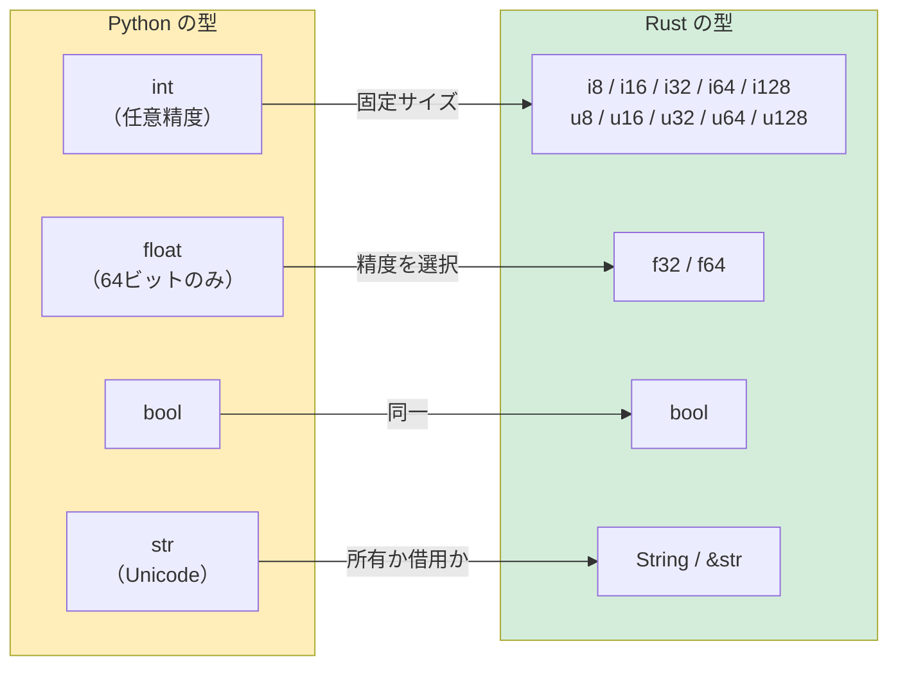

## 変数と可変性

> **この章で学ぶこと:** デフォルトで不変な変数、明示的な `mut`、Pythonの任意精度 `int` と比較したプリミティブ数値型、初学者が最も躓きやすい `String` と `&str` の違い、文字列フォーマット、そしてRustで求められる厳格な型アノテーションについて学びます。
>
> **難易度:** 🟢 初級

### Pythonの変数宣言
```python
# Python — すべてが可変、動的型付け
count = 0          # 可変、型は int と推論される
count = 5          # ✅ 動作する
count = "hello"    # ✅ 動作する — 型を変更できる！（動的型付け）

# 「定数」は単なる慣例にすぎない:
MAX_SIZE = 1024    # 後から MAX_SIZE = 999 と書き換えることを防ぐ手立てはない
```

### Rustの変数宣言
```rust
// Rust — デフォルトで不変、静的型付け
let count = 0;           // 不変、型は i32 と推論される
// count = 5;            // ❌ コンパイルエラー: 不変変数への再代入は不可
// count = "hello";      // ❌ コンパイルエラー: 整数型が期待される場所に &str が指定された

let mut count = 0;       // 明示的に可変（mut）として宣言
count = 5;               // ✅ 動作する
// count = "hello";      // ❌ mut であっても型を変更することはできない

const MAX_SIZE: usize = 1024; // 真の定数 — コンパイラによって不変性が強制される
```

### Python開発者にとっての重要な思考の転換
```rust
// Python: 変数はオブジェクトを指し示す「ラベル」
// Rust: 変数は値を「所有」する名前付きのメモリ領域

// 変数のシャドーイング（Shadowing） — Rust特有の非常に便利な機能
let input = "42";              // &str 型
let input = input.parse::<i32>().unwrap();  // i32 型になる — 同じ名前の新しい変数を宣言
let input = input * 2;         // 84 になる — さらに新しい変数を宣言

// Python では単に再代入して元の型を失うだけ:
# input = "42"
# input = int(input)   # 同じ名前で異なる型 — Pythonでも可能だが再代入扱い
# しかしRustでは、各 `let` が真に新しい変数の束縛を生成します。古い変数は隠蔽されます。
```

### 実践例: カウンター（Counter）
```python
# Python 版
class Counter:
    def __init__(self):
        self.value = 0
    
    def increment(self):
        self.value += 1
    
    def get_value(self):
        return self.value

c = Counter()
c.increment()
print(c.get_value())  # 1
```

```rust
// Rust 版
struct Counter {
    value: i64,
}

impl Counter {
    fn new() -> Self {
        Counter { value: 0 }
    }

    fn increment(&mut self) {     // &mut self = 自身（インスタンス）を変更することを宣言
        self.value += 1;
    }

    fn get_value(&self) -> i64 {  // &self = 自身を読み取り専用で借用
        self.value
    }
}

fn main() {
    let mut c = Counter::new();   // increment() を呼ぶには `mut` が必須
    c.increment();
    println!("{}", c.get_value()); // 1
}
```

> **大きな違い**: Rustでは、メソッドシグネチャの `&mut self` を見るだけで、開発者（およびコンパイラ）は `increment` がカウンターの状態を変更することを知ることができます。一方Pythonでは、どのメソッドも任意の属性を変更できるため、実際にコードを読まなければ副作用の有無がわかりません。

***

## プリミティブ型の比較



### 数値型

| Python | Rust | 備考 |
|---|---|---|
| `int`（任意精度） | `i8`, `i16`, `i32`, `i64`, `i128`, `isize` | Rustの整数型は固定ビット幅 |
| `int`（符号なし: 専用型なし） | `u8`, `u16`, `u32`, `u64`, `u128`, `usize` | 明示的な符号なし整数型 |
| `float`（64ビット IEEE 754） | `f32`, `f64` | Pythonには64ビット浮動小数点数のみ存在 |
| `bool` | `bool` | 同一の概念 |
| `complex` | 標準の組み込み型なし（`num` クレートを使用） | システムプログラミングでは稀 |

```python
# Python — 整数型は1つだけで、任意精度を持つ
x = 42                     # int — どんなに大きな値にも自動拡張される
big = 2 ** 1000            # 何千桁もの数値になっても問題なく動作する
y = 3.14                   # float — 常に64ビット
```

```rust
// Rust — 明示的なサイズ指定、オーバーフローはコンパイル時または実行時に検知
let x: i32 = 42;           // 32ビット符号付き整数
let y: f64 = 3.14;         // 64ビット浮動小数点数（Pythonの float に相当）
let big: i128 = 2_i128.pow(100); // 最大128ビット — 組み込みでの任意精度サポートはなし
// 任意精度が必要な場合: `num-bigint` クレートを使用

// 可読性のためのアンダースコア区切り（Pythonの 1_000_000 と同一）:
let million = 1_000_000;   // Pythonと同じ構文！

// 型サフィックス（接尾辞）構文:
let a = 42u8;              // u8
let b = 3.14f32;           // f32
```

### サイズ型（重要！）

```rust
// usize と isize — ポインタサイズの整数型で、インデックス指定に使用される
let length: usize = vec![1, 2, 3].len();  // .len() は usize を返す
let index: usize = 0;                     // 配列のインデックスは常に usize

// Python では len() もインデックスも int であり、区別はない。
// Rust では、i32 と usize を混在させる場合に明示的な型変換が必要:
let i: i32 = 5;
// let item = vec[i];       // ❌ エラー: usize が期待される場所に i32 が渡された
let item = vec[i as usize]; // ✅ 明示的なキャスト
```

### 型推論

```rust
// Rust は型を推論するが、推論された型は「静的に固定」される — 動的ではない
let x = 42;          // コンパイラは i32 と推論（デフォルトの整数型）
let y = 3.14;        // コンパイラは f64 と推論（デフォルトの浮動小数点数型）
let s = "hello";     // コンパイラは &str と推論（文字列スライス）
let v = vec![1, 2];  // コンパイラは Vec<i32> と推論

// 常に明示的に型注釈を付けることも可能:
let x: i64 = 42;
let y: f32 = 3.14;

// Python と異なり、一度推論された型を後から変更することは絶対にできない:
let x = 42;
// x = "hello";      // ❌ エラー: 整数型が期待される場所に &str が指定された
```

***

## 文字列型: String と &str

これはPython開発者が最初に直面する最大の驚きの1つです。Pythonの文字列型は1種類ですが、Rustには主に **2種類** の文字列型があります。

### Pythonの文字列処理
```python
# Python — 文字列型は1つのみ、不変（immutable）、参照カウント管理
name = "Alice"                # str — 不変、ヒープ割り当て
greeting = f"Hello, {name}!"  # f-string による文字列フォーマット
chars = list(name)            # 文字のリストに変換
upper = name.upper()          # 新しい文字列を返す（不変のため）
```

### Rustの文字列型
```rust
// Rust には2つの主要な文字列型が存在する:

// 1. &str（文字列スライス） — 借用された不変の参照で、文字列データへの「ビュー（表示窓）」のようなもの
let name: &str = "Alice";           // バイナリ内の文字列データを直接指し示す
                                     // Pythonの str に最も近いが、実体は「参照」

// 2. String（所有された文字列） — ヒープ割り当て、可変長、所有権を持つ
let mut greeting = String::from("Hello, ");  // 自身でデータを所有し、変更可能
greeting.push_str(name);
greeting.push('!');
// greeting は "Hello, Alice!" になる
```

### どちらをいつ使うべきか？

```rust
// このように考えると直感的です:
// &str   = 「他の誰かが所有している文字列を覗き見している」（読み取り専用ビュー）
// String = 「自分が所有している文字列データであり、自由に変更できる」（所有データ）

// 関数の引数: 原則として &str を選ぶ（両方の型を受け入れ可能）
fn greet(name: &str) -> String {          // &str と &String の両方を受け取れる
    format!("Hello, {}!", name)           // format! は新しい String を生成する
}

let s1 = "world";                         // &str リテラル
let s2 = String::from("Rust");            // String

greet(s1);      // ✅ &str を直接渡せる
greet(&s2);     // ✅ &String は Deref 変換により自動的に &str へ型変換される
```

### 実践的な操作比較

```python
# Python の文字列操作
name = "alice"
upper = name.upper()               # "ALICE"
contains = "lic" in name           # True
parts = "a,b,c".split(",")         # ["a", "b", "c"]
joined = "-".join(["a", "b", "c"]) # "a-b-c"
stripped = "  hello  ".strip()     # "hello"
replaced = name.replace("a", "A") # "Alice"
```

```rust
// Rust における同等の操作
let name = "alice";
let upper = name.to_uppercase();                      // String — 新たなヒープ割り当てが発生
let contains = name.contains("lic");                  // bool
let parts: Vec<&str> = "a,b,c".split(',').collect();  // Vec<&str>
let joined = ["a", "b", "c"].join("-");               // String
let stripped = "  hello  ".trim();                    // &str — 新たなメモリ割り当てゼロ！
let replaced = name.replace("a", "A");                // String

// 重要な洞察: 一部の操作は &str を返し（割り当てなし）、他は String を返す。
// .trim() は元の文字列のスライス（部分参照）を返すだけなので極めて効率的！
// .to_uppercase() は文字データの変更を伴うため、新しい String のメモリ確保が必要。
```

### Python開発者のための指針

```text
Python str     ≈ Rust &str     （通常、文字列を読み取るだけの用途）
Python str     ≈ Rust String   （文字列の所有や変更が必要な用途）

基本の経験則（ルール・オブ・サム）:
- 関数の引数       → &str を使用（最も柔軟で呼び出しやすい）
- 構造体のフィールド → String を使用（構造体自身がデータを所有する）
- 関数の戻り値     → String を使用（呼び出し元に所有権を渡す）
- 文字列リテラル   → 自動的に &str になる
```

***

## 出力と文字列フォーマット

### 基本的な出力
```python
# Python
print("Hello, World!")
print("Name:", name, "Age:", age)    # 空白区切りで出力
print(f"Name: {name}, Age: {age}")   # f-string
```

```rust
// Rust
println!("Hello, World!");
println!("Name: {} Age: {}", name, age);    // 位置指定の {}
println!("Name: {name}, Age: {age}");       // 変数のインライン展開（Rust 1.58+、f-string と同様！）
```

### フォーマット指定子
```python
# Python の書式指定
print(f"{3.14159:.2f}")          # "3.14" — 小数点以下2桁
print(f"{42:05d}")               # "00042" — ゼロ埋め
print(f"{255:#x}")               # "0xff" — 16進数表記
print(f"{42:>10}")               # "        42" — 右揃え
print(f"{'left':<10}|")          # "left      |" — 左揃え
```

```rust
// Rust の書式指定（Pythonと非常に酷似！）
println!("{:.2}", 3.14159);         // "3.14" — 小数点以下2桁
println!("{:05}", 42);              // "00042" — ゼロ埋め
println!("{:#x}", 255);             // "0xff" — 16進数表記
println!("{:>10}", 42);             // "        42" — 右揃え
println!("{:<10}|", "left");        // "left      |" — 左揃え
```

### デバッグ出力
```python
# Python — repr() と pprint
print(repr([1, 2, 3]))             # "[1, 2, 3]"
from pprint import pprint
pprint({"key": [1, 2, 3]})         # 整形出力（Pretty-print）
```

```rust
// Rust — {:?} と {:#?}
println!("{:?}", vec![1, 2, 3]);       // "[1, 2, 3]" — Debug フォーマット
println!("{:#?}", vec![1, 2, 3]);      // 改行・インデント付きの Debug フォーマット

// 自作の構造体を出力可能にするには、Debug トレイトを導出（derive）する:
#[derive(Debug)]
struct Point { x: f64, y: f64 }

let p = Point { x: 1.0, y: 2.0 };
println!("{:?}", p);                   // "Point { x: 1.0, y: 2.0 }"
println!("{p:?}");                     // インライン構文でも同様に出力可能
```

### クイックリファレンス

| Python | Rust | 備考 |
|---|---|---|
| `print(x)` | `println!("{}", x)` または `println!("{x}")` | Display フォーマット |
| `print(repr(x))` | `println!("{:?}", x)` | Debug フォーマット |
| `f"Hello {name}"` | `format!("Hello {name}")` | String を生成して返す |
| `print(x, end="")` | `print!("{x}")` | 末尾に改行を付加しない（`print!` vs `println!`） |
| `print(x, file=sys.stderr)` | `eprintln!("{x}")` | 標準エラー出力へ出力 |
| `sys.stdout.write(s)` | `print!("{s}")` | 改行なし出力 |

***

## 型注釈: 任意 vs 必須

### Pythonの型ヒント（任意、実行時には強制されない）
```python
# Python — 型ヒントはドキュメントとしての性質が強く、強制力はない
def add(a: int, b: int) -> int:
    return a + b

add(1, 2)         # ✅
add("a", "b")     # ✅ Python はエラーを出さない — "ab" を返す
add(1, "2")       # ✅ 実行時に到達するまでエラーにならない: TypeError

# Union 型、Optional
def find(key: str) -> int | None:
    ...

# ジェネリック型
def first(items: list[int]) -> int | None:
    return items[0] if items else None

# 型エイリアス
UserId = int
Mapping = dict[str, list[int]]
```

### Rustの型宣言（必須、コンパイラによって厳格に強制）
```rust
// Rust — 型は常に厳格に強制される。例外はない。
fn add(a: i32, b: i32) -> i32 {
    a + b
}

add(1, 2);         // ✅
// add("a", "b");  // ❌ コンパイルエラー: expected i32, found &str

// 値が存在しない可能性を表現するには Option<T> を使用
fn find(key: &str) -> Option<i32> {
    // Some(value) または None を返す
    Some(42)
}

// ジェネリック型
fn first(items: &[i32]) -> Option<i32> {
    items.first().copied()
}

// 型エイリアス
type UserId = i64;
type Mapping = HashMap<String, Vec<i32>>;
```

> **重要な洞察**: Pythonにおいて型ヒントはIDEやmypyの支援機能にすぎず、実行時の挙動には影響しません。
> しかしRustにおいて型は「プログラムそのもの」です — コンパイラは型システムを利用してメモリ安全性を保証し、データ競合を防ぎ、nullポインタエラーを根本から排除します。
>
> 📌 **関連情報**: [第6章 — 列挙型とパターンマッチング](ch06-enums-and-pattern-matching.md) では、Rustの型システムがPythonの `Union` 型や `isinstance()` チェックをどのように置き換えるのかを詳しく解説します。

---

## 演習問題

<details>
<summary><strong>🏋️ 演習: 温度変換ツール</strong>（クリックして展開）</summary>

**課題**: 摂氏から華氏へ変換する関数 `celsius_to_fahrenheit(c: f64) -> f64` と、華氏温度を受け取って閾値に基づき `"cold"`、`"mild"`、`"hot"` のいずれかを返す関数 `classify(temp_f: f64) -> &'static str` を作成してください。0度、20度、35度の摂氏温度について結果を計算し、文字列フォーマットを用いて結果を出力してください。

<details>
<summary>🔑 解答</summary>

```rust
fn celsius_to_fahrenheit(c: f64) -> f64 {
    c * 9.0 / 5.0 + 32.0
}

fn classify(temp_f: f64) -> &'static str {
    if temp_f < 50.0 { "cold" }
    else if temp_f < 77.0 { "mild" }
    else { "hot" }
}

fn main() {
    for c in [0.0, 20.0, 35.0] {
        let f = celsius_to_fahrenheit(c);
        println!("{c:.1}°C = {f:.1}°F — {}", classify(f));
    }
}
```

**重要ポイント**: Rustでは明示的な `f64` 型の扱いが求められ（暗黙的な int→float 変換はありません）、`for` は配列を直接反復処理でき（`range()` は不要）、`if/else` ブロックは値を返す「式」として動作します。

</details>
</details>

***
