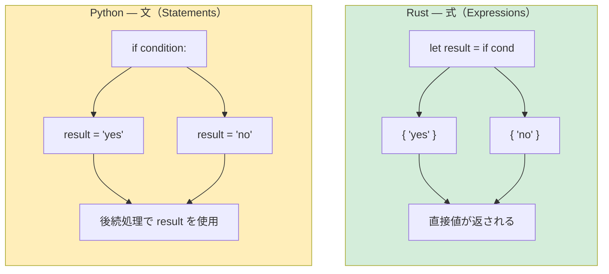

## 条件分岐

> **この章で学ぶこと:** 丸括弧なしの中括弧必須な `if`/`else`、Pythonの反復モデルと比較した `loop`/`while`/`for`、すべてが値を返す式ブロック（expression blocks）、そして戻り値の型注釈が必須となる関数シグネチャについて学びます。
>
> **難易度:** 🟢 初級

### if/else

```python
# Python
if temperature > 100:
    print("Too hot!")
elif temperature < 0:
    print("Too cold!")
else:
    print("Just right")

# 三項演算子
status = "hot" if temperature > 100 else "ok"
```

```rust
// Rust — 中括弧 {} が必須、丸括弧 () やコロン : は不要、`elif` ではなく `else if`
if temperature > 100 {
    println!("Too hot!");
} else if temperature < 0 {
    println!("Too cold!");
} else {
    println!("Just right");
}

// if は「式（EXPRESSION）」である — 値を返す（Pythonの三項演算子に似ているが、より強力）
let status = if temperature > 100 { "hot" } else { "ok" };
```

### 重要な違い
```rust
// 1. 条件式は厳密に bool 型でなければならない — truthy/falsy（暗黙の真偽値判定）は存在しない
let x = 42;
// if x { }          // ❌ エラー: expected bool, found integer
if x != 0 { }        // ✅ 明示的な比較が必須

// Python では以下はすべて truthy/falsy として扱われる:
// if []:      → False    （空のリスト）
// if "":      → False    （空文字列）
// if 0:       → False    （数値のゼロ）
// if None:    → False

// Rust では、条件式に渡せるのは bool 型のみ:
let items: Vec<i32> = vec![];
// if items { }           // ❌ エラー
if !items.is_empty() { }  // ✅ 明示的な判定メソッドの呼び出し

let name = "";
// if name { }             // ❌ エラー
if !name.is_empty() { }    // ✅ 明示的な判定メソッドの呼び出し
```

***

## ループと反復処理

### for ループ
```python
# Python
for i in range(5):
    print(i)

for item in ["a", "b", "c"]:
    print(item)

for i, item in enumerate(["a", "b", "c"]):
    print(f"{i}: {item}")

for key, value in {"x": 1, "y": 2}.items():
    print(f"{key} = {value}")
```

```rust
// Rust
for i in 0..5 {                           // range(5) → 0..5
    println!("{}", i);
}

for item in ["a", "b", "c"] {             // 配列の直接反復
    println!("{}", item);
}

for (i, item) in ["a", "b", "c"].iter().enumerate() {  // enumerate() によるインデックス付き反復
    println!("{}: {}", i, item);
}

// HashMap の反復処理
use std::collections::HashMap;
let map = HashMap::from([("x", 1), ("y", 2)]);
for (key, value) in &map {                // & でマップを参照として借用
    println!("{} = {}", key, value);
}
```

### 範囲構文（Range Syntax）
```rust
Python:              Rust:               備考:
range(5)             0..5                半開区間（終端を含まない）
range(1, 10)         1..10               半開区間（終端を含まない）
range(1, 11)         1..=10              閉区間（終端を含む）
range(0, 10, 2)      (0..10).step_by(2)  ステップ指定（構文ではなくメソッド）
```

### while ループ
```python
# Python
count = 0
while count < 5:
    print(count)
    count += 1

# 無限ループ
while True:
    data = get_input()
    if data == "quit":
        break
```

```rust
// Rust
let mut count = 0;
while count < 5 {
    println!("{}", count);
    count += 1;
}

// 無限ループ — `while true` ではなく `loop` を使用する
loop {
    let data = get_input();
    if data == "quit" {
        break;
    }
}

// loop は値を返すことができる！（Rust特有の機能）
let result = loop {
    let input = get_input();
    if let Ok(num) = input.parse::<i32>() {
        break num;  // 値を伴う `break` — ループからの早期リターンのように機能
    }
    println!("数値ではありません。もう一度入力してください");
};
```

### リスト内包表記 vs イテレータチェーン
```python
# Python — リスト内包表記
squares = [x ** 2 for x in range(10)]
evens = [x for x in range(20) if x % 2 == 0]
pairs = [(x, y) for x in range(3) for y in range(3)]
```

```rust
// Rust — イテレータチェーン (.map, .filter, .collect)
let squares: Vec<i32> = (0..10).map(|x| x * x).collect();
let evens: Vec<i32> = (0..20).filter(|x| x % 2 == 0).collect();
let pairs: Vec<(i32, i32)> = (0..3)
    .flat_map(|x| (0..3).map(move |y| (x, y)))
    .collect();

// これらは遅延評価（LAZY）される — .collect() を呼ぶまで実際の計算は実行されない
// Python の内包表記は即時評価（Eager）される
// 大規模なデータセットでは、Rust のイテレータチェーンの方がメモリ効率に優れる
```

***

## 式ブロック

Rustでは、ほぼすべての構文要素が「式（Expression）」（値を評価して返すもの）です。これは `if` や `for` が「文（Statement）」であるPythonからの大きな思考の転換となります。

```python
# Python — if は文（三項演算子を除く）
if condition:
    result = "yes"
else:
    result = "no"

# または三項演算子（単一の式に限定される）:
result = "yes" if condition else "no"
```

```rust
// Rust — if は式（値を返す）
let result = if condition { "yes" } else { "no" };

// 中括弧のブロック自体が式である — セミコロンのない最終行がブロックの評価値となる
let value = {
    let x = 5;
    let y = 10;
    x + y    // セミコロンなし → これがブロック全体の評価値（15）になる
};

// match も同様に式である
let description = match temperature {
    t if t > 100 => "boiling",
    t if t > 50 => "hot",
    t if t > 20 => "warm",
    _ => "cold",
};
```

以下のダイアグラムは、Pythonの「文ベース」の制御フローとRustの「式ベース」の制御フローの根本的な違いを示しています：



> **セミコロンの規則**: Rustでは、ブロック内の最後の式に **セミコロンを付けない** ことで、その値がブロック全体の戻り値になります。セミコロンを付けると「文」となり、値は破棄されてユニット型 `()` を返します。これはPython開発者が最初に戸惑いやすい仕様ですが、暗黙の `return` のように機能します。

***

## 関数と型シグネチャ

### Pythonの関数
```python
# Python — 型注釈は任意、動的ディスパッチ
def greet(name: str, greeting: str = "Hello") -> str:
    return f"{greeting}, {name}!"

# デフォルト引数、*args、**kwargs
def flexible(*args, **kwargs):
    pass

# 第一級関数
def apply(f, x):
    return f(x)

result = apply(lambda x: x * 2, 5)  # 10
```

### Rustの関数
```rust
// Rust — 関数シグネチャの型注釈は「必須」、デフォルト引数はなし
fn greet(name: &str, greeting: &str) -> String {
    format!("{}, {}!", greeting, name)
}

// デフォルト引数はサポートされない — ビルダーパターンや Option を活用する
fn greet_with_default(name: &str, greeting: Option<&str>) -> String {
    let greeting = greeting.unwrap_or("Hello");
    format!("{}, {}!", greeting, name)
}

// *args / **kwargs はなし — スライスや構造体を使用する
fn sum_all(numbers: &[i32]) -> i32 {
    numbers.iter().sum()
}

// 第一級関数とクロージャ
fn apply(f: fn(i32) -> i32, x: i32) -> i32 {
    f(x)
}

let result = apply(|x| x * 2, 5);  // 10
```

### 戻り値
```python
# Python — return は明示的、何も返さない場合は暗黙的に None
def divide(a, b):
    if b == 0:
        return None  # または例外を送出
    return a / b
```

```rust
// Rust — 最後の式が関数の戻り値になる（セミコロンなし）
fn divide(a: f64, b: f64) -> Option<f64> {
    if b == 0.0 {
        None              // 早期リターン（`return None;` と明示的に書くことも可能）
    } else {
        Some(a / b)       // 最後の式 — 暗黙的に返される
    }
}
```

### 複数の戻り値
```python
# Python — タプルを返す
def min_max(numbers):
    return min(numbers), max(numbers)

lo, hi = min_max([3, 1, 4, 1, 5])
```

```rust
// Rust — タプルを返す（Pythonと同じ概念！）
fn min_max(numbers: &[i32]) -> (i32, i32) {
    let min = *numbers.iter().min().unwrap();
    let max = *numbers.iter().max().unwrap();
    (min, max)
}

let (lo, hi) = min_max(&[3, 1, 4, 1, 5]);
```

### メソッド: self vs &self vs &mut self
```rust
// Python では、`self` は常にオブジェクトへの可変な参照です。
// Rust では、用途に応じて明示的に選択します:

impl MyStruct {
    fn new() -> Self { ... }                // self なし — 「静的メソッド」/「クラスメソッド」
    fn read_only(&self) { ... }             // &self — 不変の借用（内部状態を変更できない）
    fn modify(&mut self) { ... }            // &mut self — 可変の借用（内部状態を変更できる）
    fn consume(self) { ... }                // self — 所有権を消費（オブジェクトはムーブされ破棄される）
}

// Python における対応関係:
// class MyStruct:
//     @classmethod
//     def new(cls): ...                    # インスタンス不要のファクトリメソッド
//     def read_only(self): ...             # Python ではこの3つはすべて同じ扱い:
//     def modify(self): ...                # Python の self は常に変更可能
//     def consume(self): ...               # Python に self を「消費（消滅）」させる概念はない
```

---

## 演習問題

<details>
<summary><strong>🏋️ 演習: 式を活用した FizzBuzz</strong>（クリックして展開）</summary>

**課題**: Rustの式ベースの `match` を使って、1..=30 の範囲の FizzBuzz プログラムを記述してください。各数値について "Fizz"、"Buzz"、"FizzBuzz"、または数値そのものを出力します。式として `match (n % 3, n % 5)` を使用してください。

<details>
<summary>🔑 解答</summary>

```rust
fn main() {
    for n in 1..=30 {
        let result = match (n % 3, n % 5) {
            (0, 0) => String::from("FizzBuzz"),
            (0, _) => String::from("Fizz"),
            (_, 0) => String::from("Buzz"),
            _ => n.to_string(),
        };
        println!("{result}");
    }
}
```

**重要ポイント**: `match` は値を返す「式」であるため、複雑な `if/elif/else` の連鎖を書く必要がありません。ワイルドカード `_` は、Pythonの `case _:`（デフォルト分岐）の役割を果たします。

</details>
</details>

***
