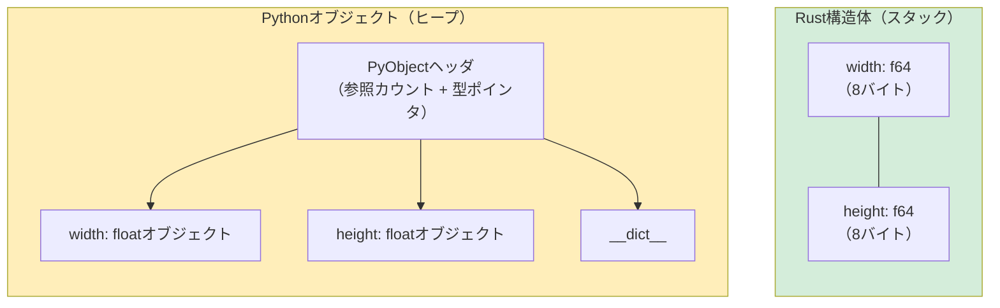

## タプルと分配束縛（Destructuring）

> **学ぶこと:** RustのタプルとPythonのタプルの比較、配列とスライス、構造体（Pythonのクラスに代わるRustの仕組み）、`Vec<T>` と `list`、`HashMap<K,V>` と `dict`、そしてドメインモデリングのためのニュータイプ（newtype）パターンについて学びます。
>
> **難易度:** 🟢 初級

### Pythonのタプル
```python
# Python — タプルはイミュータブル（不変）なシーケンス
point = (3.0, 4.0)
x, y = point                    # アンパック（Unpacking）
print(f"x={x}, y={y}")

# タプルは異なる型を混在して保持可能
record = ("Alice", 30, True)
name, age, active = record

# 明確さのための名前付きタプル（NamedTuple）
from typing import NamedTuple

class Point(NamedTuple):
    x: float
    y: float

p = Point(3.0, 4.0)
print(p.x)                      # 名前によるアクセス
```

### Rustのタプル
```rust
// Rust — タプルは固定長、型付きで、異なる型を混在して保持可能
let point: (f64, f64) = (3.0, 4.0);
let (x, y) = point;              // 分配束縛（Destructuring、Pythonのアンパックと同じ）
println!("x={x}, y={y}");

// 異なる型の混在
let record: (&str, i32, bool) = ("Alice", 30, true);
let (name, age, active) = record;

// インデックスによるアクセス（Pythonとは異なり、.0 .1 .2 構文を使用）
let first = record.0;            // "Alice"
let second = record.1;           // 30

// Python: record[0]
// Rust:   record.0      ← ブラケット（[]）ではなくドット＋インデックス
```

### タプルと構造体の使い分け
```rust
// タプル: 手軽なグループ化、関数の戻り値、一時的な値
fn min_max(data: &[i32]) -> (i32, i32) {
    (*data.iter().min().unwrap(), *data.iter().max().unwrap())
}
let (lo, hi) = min_max(&[3, 1, 4, 1, 5]);

// 構造体: 名前付きフィールド、明確な意図、メソッド
struct Point { x: f64, y: f64 }

// 判断の目安:
// - 同じ型のフィールドが2〜3個 → タプルで十分
// - 名前付きフィールドが必要   → 構造体を使用
// - メソッドが必要             → 構造体を使用
// （Pythonにおける tuple vs namedtuple vs dataclass の使い分けと同じ指針）
```

***

## 配列とスライス

### Pythonのリスト vs Rustの配列
```python
# Python — リストは動的で、ヘテロジニアス（異なる型を混在可能）
numbers = [1, 2, 3, 4, 5]       # 伸長・縮小可能、異なる型を保持可能
numbers.append(6)
mixed = [1, "two", 3.0]         # 異なる型の混在が許可される
```

```rust
// Rustには固定長 vs 動的について2つの概念があります:

// 1. 配列（Array） — 固定長、スタック割り当て（Pythonに直接の相当物なし）
let numbers: [i32; 5] = [1, 2, 3, 4, 5]; // サイズは型の一部！
// numbers.push(6);  // ❌ 配列はサイズ変更不可

// すべての要素を同じ値で初期化:
let zeros = [0; 10];            // [0, 0, 0, 0, 0, 0, 0, 0, 0, 0]

// 2. スライス（Slice） — 配列やVecへのビュー（Pythonのスライスに似ているが借用される）
let slice: &[i32] = &numbers[1..4]; // [2, 3, 4] — コピーではなく参照！

// Python: numbers[1:4] は新しいリストを作成（コピー）
// Rust:   &numbers[1..4] はビューを作成（コピーなし、アロケーションなし）
```

### 実践的な比較
```python
# Pythonのスライス — コピーを作成
data = [10, 20, 30, 40, 50]
first_three = data[:3]          # 新しいリスト: [10, 20, 30]
last_two = data[-2:]            # 新しいリスト: [40, 50]
reversed_data = data[::-1]      # 新しいリスト: [50, 40, 30, 20, 10]
```

```rust
// Rustのスライス — ビュー（参照）を作成
let data = [10, 20, 30, 40, 50];
let first_three = &data[..3];         // &[i32], ビュー: [10, 20, 30]
let last_two = &data[3..];            // &[i32], ビュー: [40, 50]

// 負のインデックスは使えない — .len() を使用
let last_two = &data[data.len()-2..]; // &[i32], ビュー: [40, 50]

// 反転: イテレータを使用
let reversed: Vec<i32> = data.iter().rev().copied().collect();
```

***

## 構造体 vs クラス

### Pythonのクラス
```python
# Python — __init__、メソッド、プロパティを持つクラス
from dataclasses import dataclass

@dataclass
class Rectangle:
    width: float
    height: float

    def area(self) -> float:
        return self.width * self.height

    def perimeter(self) -> float:
        return 2.0 * (self.width + self.height)

    def scale(self, factor: float) -> "Rectangle":
        return Rectangle(self.width * factor, self.height * factor)

    def __str__(self) -> str:
        return f"Rectangle({self.width} x {self.height})"

r = Rectangle(10.0, 5.0)
print(r.area())         # 50.0
print(r)                # Rectangle(10.0 x 5.0)
```

### Rustの構造体
```rust
// Rust — 構造体 + impl ブロック（継承はありません！）
#[derive(Debug, Clone)]
struct Rectangle {
    width: f64,
    height: f64,
}

impl Rectangle {
    // "コンストラクタ" — 関連関数（self を取らない）
    fn new(width: f64, height: f64) -> Self {
        Rectangle { width, height }   // 名前が一致する場合のフィールド初期化省略記法
    }

    fn area(&self) -> f64 {
        self.width * self.height
    }

    fn perimeter(&self) -> f64 {
        2.0 * (self.width + self.height)
    }

    fn scale(&self, factor: f64) -> Rectangle {
        Rectangle::new(self.width * factor, self.height * factor)
    }
}

// Display トレイト = Python の __str__
impl std::fmt::Display for Rectangle {
    fn fmt(&self, f: &mut std::fmt::Formatter<'_>) -> std::fmt::Result {
        write!(f, "Rectangle({} x {})", self.width, self.height)
    }
}

fn main() {
    let r = Rectangle::new(10.0, 5.0);
    println!("{}", r.area());    // 50.0
    println!("{}", r);           // Rectangle(10 x 5)
}
```



> **メモリに関する洞察**: Pythonの `Rectangle` オブジェクトは56バイトのヘッダに加えて、別個にヒープ割り当てされた浮動小数点数オブジェクトを持ちます。一方、Rustの `Rectangle` はスタック上で正確に16バイトであり、間接参照もGCプレッシャーもありません。
>
> 📌 **関連情報**: [第10章 — トレイトとジェネリクス](ch10-traits-and-generics.md) では、`Display` や `Debug` などのトレイトの実装や、構造体に対する演算子オーバーロードについて解説しています。

### 主な対応表: Pythonのダンダーメソッド → Rustのトレイト

| Python | Rust | 目的 |
|--------|------|---------|
| `__str__` | `impl Display` | 人間が読みやすい文字列 |
| `__repr__` | `#[derive(Debug)]` | デバッグ用表現 |
| `__eq__` | `#[derive(PartialEq)]` | 等価比較 |
| `__hash__` | `#[derive(Hash)]` | ハッシュ可能（辞書のキー / HashSet 用） |
| `__lt__`, `__le__` など | `#[derive(PartialOrd, Ord)]` | 順序付け |
| `__add__` | `impl Add` | `+` 演算子 |
| `__iter__` | `impl Iterator` | イテレーション（反復処理） |
| `__len__` | `.len()` メソッド | 長さ |
| `__enter__`/`__exit__` | RAII + `impl Drop` | 自動クリーンアップ。コンテキストマネージャの2段階プロトコルに対する直接の相当物はありません |
| `__init__` | `fn new()`（慣例） | コンストラクタ |
| `__getitem__` | `impl Index` | `[]` によるインデックス指定 |
| `__contains__` | `.contains()` メソッド | `in` 演算子 |

### 継承なし — 代わりにコンポジション（合成）を使用
```python
# Python — 継承
class Animal:
    def __init__(self, name: str):
        self.name = name
    def speak(self) -> str:
        raise NotImplementedError

class Dog(Animal):
    def speak(self) -> str:
        return f"{self.name} says Woof!"

class Cat(Animal):
    def speak(self) -> str:
        return f"{self.name} says Meow!"
```

```rust
// Rust — トレイト + コンポジション（継承なし）
trait Animal {
    fn name(&self) -> &str;
    fn speak(&self) -> String;
}

struct Dog { name: String }
struct Cat { name: String }

impl Animal for Dog {
    fn name(&self) -> &str { &self.name }
    fn speak(&self) -> String {
        format!("{} says Woof!", self.name)
    }
}

impl Animal for Cat {
    fn name(&self) -> &str { &self.name }
    fn speak(&self) -> String {
        format!("{} says Meow!", self.name)
    }
}

// ポリモーフィズムのためにトレイトオブジェクトを使用（Pythonのダックタイピングに似ています）:
fn animal_roll_call(animals: &[&dyn Animal]) {
    for a in animals {
        println!("{}", a.speak());
    }
}
```

> **メンタルモデル**: Pythonでは「振る舞いを継承する」と考えますが、Rustでは「規約（コントラクト）を実装する」と考えます。
> 得られる結果は似ていますが、Rustはダイヤモンド問題や傷つきやすい基底クラス問題（fragile base class problem）を回避できます。

***

## Vec vs list

`Vec<T>` はRustの伸長可能なヒープ割り当て配列であり、Pythonの `list` に最も近い相当物です。

### ベクタの作成
```python
# Python
numbers = [1, 2, 3]
empty = []
repeated = [0] * 10
from_range = list(range(1, 6))
```

```rust
// Rust
let numbers = vec![1, 2, 3];            // vec! マクロ（リストリテラルのようなもの）
let empty: Vec<i32> = Vec::new();        // 空のVec（型注釈が必要）
let repeated = vec![0; 10];              // [0, 0, 0, 0, 0, 0, 0, 0, 0, 0]
let from_range: Vec<i32> = (1..6).collect(); // [1, 2, 3, 4, 5]
```

### 一般的な操作
```python
# Python リスト操作
nums = [1, 2, 3]
nums.append(4)                   # [1, 2, 3, 4]
nums.extend([5, 6])             # [1, 2, 3, 4, 5, 6]
nums.insert(0, 0)               # [0, 1, 2, 3, 4, 5, 6]
last = nums.pop()               # 6, nums = [0, 1, 2, 3, 4, 5]
length = len(nums)              # 6
nums.sort()                     # インプレースソート
sorted_copy = sorted(nums)     # 新しいソート済みリスト
nums.reverse()                  # インプレース反転
contains = 3 in nums           # True
index = nums.index(3)          # 最初の 3 のインデックス
```

```rust
// Rust Vec 操作
let mut nums = vec![1, 2, 3];
nums.push(4);                          // [1, 2, 3, 4]
nums.extend([5, 6]);                   // [1, 2, 3, 4, 5, 6]
nums.insert(0, 0);                     // [0, 1, 2, 3, 4, 5, 6]
let last = nums.pop();                 // Some(6), nums = [0, 1, 2, 3, 4, 5]
let length = nums.len();               // 6
nums.sort();                           // インプレースソート
let mut sorted_copy = nums.clone();
sorted_copy.sort();                    // クローンをソート
nums.reverse();                        // インプレース反転
let contains = nums.contains(&3);      // true
let index = nums.iter().position(|&x| x == 3); // Some(index) または None
```

### クイックリファレンス

| Python | Rust | 備考 |
|--------|------|-------|
| `lst.append(x)` | `vec.push(x)` | |
| `lst.extend(other)` | `vec.extend(other)` | |
| `lst.pop()` | `vec.pop()` | `Option<T>` を返す |
| `lst.insert(i, x)` | `vec.insert(i, x)` | |
| `lst.remove(x)` | `vec.iter().position(\|v\| v == &x).map(\|i\| vec.remove(i))` | 最初に一致したもののみ削除（すべて削除する場合は `retain` を使用） |
| `del lst[i]` | `vec.remove(i)` | 削除された要素を返す |
| `len(lst)` | `vec.len()` | |
| `x in lst` | `vec.contains(&x)` | |
| `lst.sort()` | `vec.sort()` | |
| `sorted(lst)` | クローン + ソート、またはイテレータ | |
| `lst[i]` | `vec[i]` | 範囲外の場合はパニック |
| `lst.get(i, default)` | `vec.get(i)` | `Option<&T>` を返す |
| `lst[1:3]` | `&vec[1..3]` | スライスを返す（コピーなし） |

***

## HashMap vs dict

`HashMap<K, V>` はRustのハッシュマップであり、Pythonの `dict` に相当します。

### HashMapの作成
```python
# Python
scores = {"Alice": 100, "Bob": 85}
empty = {}
from_pairs = dict([("x", 1), ("y", 2)])
comprehension = {k: v for k, v in zip(keys, values)}
```

```rust
// Rust
use std::collections::HashMap;

let scores = HashMap::from([("Alice", 100), ("Bob", 85)]);
let empty: HashMap<String, i32> = HashMap::new();
let from_pairs: HashMap<&str, i32> = [("x", 1), ("y", 2)].into_iter().collect();
let comprehension: HashMap<_, _> = keys.iter().zip(values.iter()).collect();
```

### 一般的な操作
```python
# Python 辞書操作
d = {"a": 1, "b": 2}
d["c"] = 3                      # 挿入
val = d["a"]                     # 1 (存在しない場合は KeyError)
val = d.get("z", 0)             # 0 (存在しない場合のデフォルト値)
del d["b"]                       # 削除
exists = "a" in d               # True
keys = list(d.keys())           # ["a", "c"]
values = list(d.values())       # [1, 3]
items = list(d.items())         # [("a", 1), ("c", 3)]
length = len(d)                 # 2

# setdefault / defaultdict
from collections import defaultdict
word_count = defaultdict(int)
for word in words:
    word_count[word] += 1
```

```rust
// Rust HashMap 操作
use std::collections::HashMap;

let mut d = HashMap::new();
d.insert("a", 1);
d.insert("b", 2);
d.insert("c", 3);                       // 挿入または上書き

let val = d["a"];                        // 1 (存在しない場合はパニック)
let val = d.get("z").copied().unwrap_or(0); // 0 (安全なアクセス)
d.remove("b");                          // 削除
let exists = d.contains_key("a");       // true
let keys: Vec<_> = d.keys().collect();
let values: Vec<_> = d.values().collect();
let length = d.len();

// entry API = Pythonの setdefault / defaultdict パターン
let mut word_count: HashMap<&str, i32> = HashMap::new();
for word in words {
    *word_count.entry(word).or_insert(0) += 1;
}
```

### クイックリファレンス

| Python | Rust | 備考 |
|--------|------|-------|
| `d[key] = val` | `d.insert(key, val)` | `Option<V>`（古い値）を返す |
| `d[key]` | `d[&key]` | 存在しない場合はパニック |
| `d.get(key)` | `d.get(&key)` | `Option<&V>` を返す |
| `d.get(key, default)` | `d.get(&key).unwrap_or(&default)` | |
| `key in d` | `d.contains_key(&key)` | |
| `del d[key]` | `d.remove(&key)` | `Option<V>` を返す |
| `d.keys()` | `d.keys()` | イテレータ |
| `d.values()` | `d.values()` | イテレータ |
| `d.items()` | `d.iter()` | `(&K, &V)` のイテレータ |
| `len(d)` | `d.len()` | |
| `d.update(other)` | `d.extend(other)` | |
| `defaultdict(int)` | `.entry().or_insert(0)` | Entry API |
| `d.setdefault(k, v)` | `d.entry(k).or_insert(v)` | Entry API |

***

### その他のコレクション

| Python | Rust | 備考 |
|--------|------|-------|
| `set()` | `HashSet<T>` | `use std::collections::HashSet;` |
| `collections.deque` | `VecDeque<T>` | `use std::collections::VecDeque;` |
| `heapq` | `BinaryHeap<T>` | デフォルトで最大ヒープ |
| `collections.OrderedDict` | `IndexMap` (クレート) | HashMapは順序を保持しない |
| `sortedcontainers.SortedList` | `BTreeSet<T>` / `BTreeMap<K,V>` | ツリーベース、ソート済み |

---

## 演習問題

<details>
<summary><strong>🏋️ 演習: 単語出現頻度カウンタ</strong>（クリックして展開）</summary>

**課題**: `&str` の文を受け取り、大文字・小文字を区別しない単語の出現頻度を表す `HashMap<String, usize>` を返す関数を作成してください。Pythonでは `Counter(s.lower().split())` に相当します。これをRustに移植してください。

<details>
<summary>🔑 解答例</summary>

```rust
use std::collections::HashMap;

fn word_frequencies(text: &str) -> HashMap<String, usize> {
    let mut counts = HashMap::new();
    for word in text.split_whitespace() {
        let key = word.to_lowercase();
        *counts.entry(key).or_insert(0) += 1;
    }
    counts
}

fn main() {
    let text = "the quick brown fox jumps over the lazy fox";
    let freq = word_frequencies(text);
    for (word, count) in &freq {
        println!("{word}: {count}");
    }
}
```

**重要なポイント**: `HashMap::entry().or_insert()` は、Pythonの `defaultdict` や `Counter` に相当するRustの仕組みです。`or_insert` は `&mut usize` を返すため、参照先の値をインクリメントするには `*` による逆参照が必要です。

</details>
</details>

***
