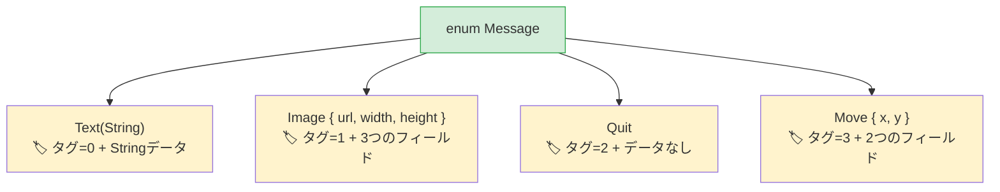

## 代数的データ型 vs ユニオン型

> **学ぶこと:** データを保持するRustの列挙型（enum）とPythonの `Union` 型の比較、網羅的な `match` と `match/case`、`None` をコンパイル時に安全に置き換える `Option<T>`、そしてマッチガードについて学びます。
>
> **難易度:** 🟡 中級

Python 3.10 では `match` 文と型の直和（Union）が導入されました。Rustの列挙型（enum）はさらに進化しており、各バリアントが異なるデータを保持でき、コンパイラがすべてのケースを漏れなく処理しているかを検証します。

### Pythonのユニオン型とMatch
```python
# Python 3.10+ — 構造的パターンマッチング
from typing import Union
from dataclasses import dataclass

@dataclass
class Circle:
    radius: float

@dataclass
class Rectangle:
    width: float
    height: float

@dataclass
class Triangle:
    base: float
    height: float

Shape = Union[Circle, Rectangle, Triangle]  # 型エイリアス

def area(shape: Shape) -> float:
    match shape:
        case Circle(radius=r):
            return 3.14159 * r * r
        case Rectangle(width=w, height=h):
            return w * h
        case Triangle(base=b, height=h):
            return 0.5 * b * h
        # ケースを書き忘れてもコンパイラの警告はありません！
        # 新しい図形を追加した場合は、コードベース全体を grep してすべての match ブロックを見つけ出す必要があります。
```

### Rustの列挙型 — データを保持するバリアント
```rust
// Rust — 列挙型のバリアントはデータを保持し、コンパイラが網羅的なマッチングを強制する
enum Shape {
    Circle(f64),                // Circle は半径（radius）を保持
    Rectangle(f64, f64),        // Rectangle は幅（width）と高さ（height）を保持
    Triangle { base: f64, height: f64 }, // 名前付きフィールドも利用可能
}

fn area(shape: &Shape) -> f64 {
    match shape {
        Shape::Circle(r) => std::f64::consts::PI * r * r,
        Shape::Rectangle(w, h) => w * h,
        Shape::Triangle { base, height } => 0.5 * base * height,
        // ❌ もし Shape::Pentagon を追加してここで処理を忘れた場合、
        //    コンパイラがビルドを拒否します。grep する必要はありません。
    }
}
```

> **重要なポイント**: Rustの `match` は**網羅的（exhaustive）**です。コンパイラはすべてのバリアントが処理されているかを検証します。列挙型に新しいバリアントを追加すると、更新が必要な `match` ブロックがどれかをコンパイラが正確に教えてくれます。Pythonの `match` にはこのような保証はありません。

### 列挙型が置き換える複数のPythonパターン

```python
# Python — Rustの列挙型によって置き換えられる複数のパターン:

# 1. 文字列定数
STATUS_PENDING = "pending"
STATUS_ACTIVE = "active"
STATUS_CLOSED = "closed"

# 2. PythonのEnum（データなし）
from enum import Enum
class Status(Enum):
    PENDING = "pending"
    ACTIVE = "active"
    CLOSED = "closed"

# 3. タグ付きユニオン（クラス + 種類を表すフィールド）
class Message:
    def __init__(self, kind, **data):
        self.kind = kind
        self.data = data
# Message(kind="text", content="hello")
# Message(kind="image", url="...", width=100)
```

```rust
// Rust — 1つの列挙型で上記3つすべて（それ以上）をカバー

// 1. シンプルな列挙型（PythonのEnumに類似）
enum Status {
    Pending,
    Active,
    Closed,
}

// 2. データを保持する列挙型（タグ付きユニオン — 型安全！）
enum Message {
    Text(String),
    Image { url: String, width: u32, height: u32 },
    Quit,                    // データなし
    Move { x: i32, y: i32 },
}
```



> **メモリに関する洞察**: Rustの列挙型は「タグ付きユニオン（tagged union）」です。コンパイラは判別用のタグ（discriminant tag）と、最大のバリアントを格納するのに十分なスペースを確保して格納します。Pythonにおける同等の表現（`Union[str, dict, None]`）にはこのようなコンパクトな表現はありません。
>
> 📌 **関連情報**: [第9章 — エラー処理](ch09-error-handling.md) では列挙型を広範囲に活用します。`Result<T, E>` や `Option<T>` も単に `match` と組み合わせて使われる列挙型です。

```rust
fn process(msg: &Message) {
    match msg {
        Message::Text(content) => println!("Text: {content}"),
        Message::Image { url, width, height } => {
            println!("Image: {url} ({width}x{height})")
        }
        Message::Quit => println!("Quitting"),
        Message::Move { x, y } => println!("Moving to ({x}, {y})"),
    }
}
```

***

## 網羅的なパターンマッチング

### Pythonのmatch — 網羅的ではない
```python
# Python — ワイルドカードケースは任意であり、コンパイラの支援はない
def describe(value):
    match value:
        case 0:
            return "zero"
        case 1:
            return "one"
        # デフォルトケースを書き忘れた場合、Pythonは暗黙的に None を返します。
        # 警告もエラーも出ません。

describe(42)  # None を返す — 潜在的なバグ
```

### Rustのmatch — コンパイラが強制
```rust
// Rust — 考えられるすべてのケースを必ず処理しなければならない
fn describe(value: i32) -> &'static str {
    match value {
        0 => "zero",
        1 => "one",
        // ❌ コンパイルエラー: non-exhaustive patterns: `i32::MIN..=-1_i32`
        //    および `2_i32..=i32::MAX` がカバーされていません
        _ => "other",   // _ = すべてに一致するキャッチオール（開かれた型には必須）
    }
}

// 列挙型の場合、キャッチオールは不要 — コンパイラがすべてのバリアントを把握しているため:
enum Color { Red, Green, Blue }

fn color_hex(c: Color) -> &'static str {
    match c {
        Color::Red => "#ff0000",
        Color::Green => "#00ff00",
        Color::Blue => "#0000ff",
        // _ は不要 — すべてのバリアントがカバーされている
        // 後から Color::Yellow を追加すると → ここでコンパイルエラーが発生
    }
}
```

### パターンマッチングの機能
```rust
// 複数の値へのマッチ（Pythonの case 1 | 2 | 3: に相当）
match value {
    1 | 2 | 3 => println!("small"),
    4..=9 => println!("medium"),    // 範囲パターン
    _ => println!("large"),
}

// マッチガード（Pythonの case x if x > 0: に相当）
match temperature {
    t if t > 100 => println!("boiling"),
    t if t < 0 => println!("freezing"),
    t => println!("normal: {t}°"),
}

// ネストした分配束縛
let point = (3, (4, 5));
match point {
    (0, _) => println!("on y-axis"),
    (_, (0, _)) => println!("y=0"),
    (x, (y, z)) => println!("x={x}, y={y}, z={z}"),
}
```

***

## None 安全性のための Option

`Option<T>` は、Python開発者にとって最も重要なRustの列挙型です。これは `None` を型安全な代替手段へと置き換えます。

### Pythonの None

```python
# Python — None はどこにでも現れうる値
def find_user(user_id: int) -> dict | None:
    users = {1: {"name": "Alice"}}
    return users.get(user_id)

user = find_user(999)
# user は None — しかしチェックを強制するものは何もない！
print(user["name"])  # 💥 実行時に TypeError
```

### Rustの Option

```rust
// Rust — Option<T> は None ケースの処理を強制する
fn find_user(user_id: i64) -> Option<User> {
    let users = HashMap::from([(1, User { name: "Alice".into() })]);
    users.get(&user_id).cloned()
}

let user = find_user(999);
// user は Option<User> — None を処理せずに使うことはできない

// 方法 1: match
match find_user(999) {
    Some(user) => println!("Found: {}", user.name),
    None => println!("Not found"),
}

// 方法 2: if let（Pythonの if (x := expr) is not None に相当）
if let Some(user) = find_user(1) {
    println!("Found: {}", user.name);
}

// 方法 3: unwrap_or
let name = find_user(999)
    .map(|u| u.name)
    .unwrap_or_else(|| "Unknown".to_string());

// 方法 4: ? 演算子（Optionを返す関数内）
fn get_user_name(id: i64) -> Option<String> {
    let user = find_user(id)?;     // 見つからない場合は早期リターンで None を返す
    Some(user.name)
}
```

### Optionのメソッド — Pythonでの対応表現

| パターン | Python | Rust |
|---------|--------|------|
| 存在するか確認 | `if x is not None:` | `if let Some(x) = opt {` |
| デフォルト値 | `x or default` | `opt.unwrap_or(default)` |
| デフォルト生成関数 | `x or compute()` | `opt.unwrap_or_else(\|\| compute())` |
| 存在する場合に変換 | `f(x) if x else None` | `opt.map(f)` |
| 検索の連鎖 | `x and x.attr and x.attr.method()` | `opt.and_then(\|x\| x.method())` |
| Noneならクラッシュ | 防ぐことは不可能 | `opt.unwrap()`（パニック）または `opt.expect("msg")` |
| 取得するか例外発生 | `x if x else raise` | `opt.ok_or(Error)?` |

---

## 演習問題

<details>
<summary><strong>🏋️ 演習: 図形の面積計算機</strong>（クリックして展開）</summary>

**課題**: `Circle(f64)`（半径）、`Rectangle(f64, f64)`（幅、高さ）、`Triangle(f64, f64)`（底辺、高さ）の各バリアントを持つ列挙型 `Shape` を定義してください。`match` を使用してメソッド `fn area(&self) -> f64` を実装してください。各バリアントを1つずつ作成し、それぞれの面積を出力してください。

<details>
<summary>🔑 解答例</summary>

```rust
use std::f64::consts::PI;

enum Shape {
    Circle(f64),
    Rectangle(f64, f64),
    Triangle(f64, f64),
}

impl Shape {
    fn area(&self) -> f64 {
        match self {
            Shape::Circle(r) => PI * r * r,
            Shape::Rectangle(w, h) => w * h,
            Shape::Triangle(b, h) => 0.5 * b * h,
        }
    }
}

fn main() {
    let shapes = [
        Shape::Circle(5.0),
        Shape::Rectangle(4.0, 6.0),
        Shape::Triangle(3.0, 8.0),
    ];
    for shape in &shapes {
        println!("Area: {:.2}", shape.area());
    }
}
```

**重要なポイント**: Rustの列挙型は、Pythonの `Union[Circle, Rectangle, Triangle]` + `isinstance()` によるチェックを置き換えます。コンパイラはすべてのバリアントを処理しているかを保証するため、`area()` を更新せずに新しい図形を追加するとコンパイルエラーになります。

</details>
</details>

***
