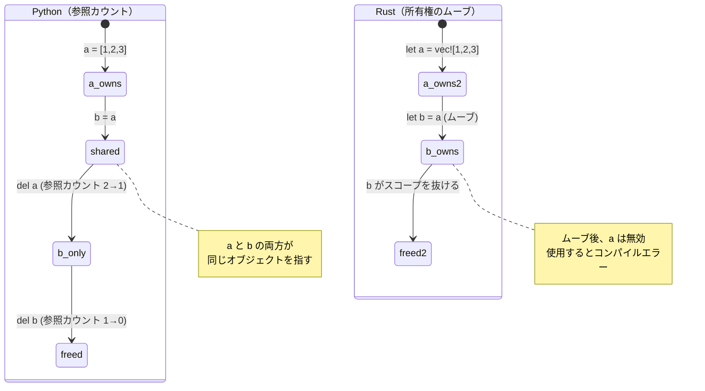
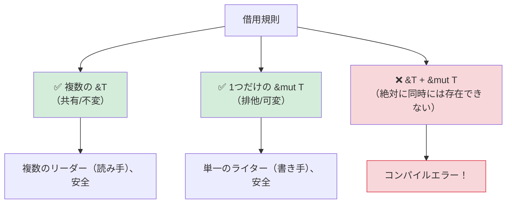

## 所有権を理解する

> **学ぶこと:** なぜRustに所有権があるのか（GCなし！）、ムーブセマンティクスとPythonの参照カウントの比較、借用（`&` と `&mut`）、ライフタイムの基本、スマートポインタ（`Box`、`Rc`、`Arc`）について学びます。
>
> **難易度:** 🟡 中級

これはPython開発者にとって最も難しい概念です。Pythonでは、ガベージコレクタ（GC）が処理するため、誰がデータを「所有」しているかを意識することはありません。しかしRustでは、すべての値には常に正確に1つの所有者が存在し、コンパイラがコンパイル時にこれを追跡します。

### Python: 至るところにある共有参照
```python
# Python — すべてが参照であり、GCがクリーンアップする
a = [1, 2, 3]
b = a              # b と a は同じリストを指す
b.append(4)
print(a)            # [1, 2, 3, 4] — なんと！ a も変更されている

# 誰がリストを所有しているのか？ a と b の両方が参照している。
# ガベージコレクタは参照が残らなくなった時点で解放する。
# このことを意識する必要は一切ない。
```

### Rust: 単一の所有権
```rust
// Rust — すべての値には正確に「1つ」の所有者が存在する
let a = vec![1, 2, 3];
let b = a;           // 所有権が a から b へムーブする
// println!("{:?}", a); // ❌ コンパイルエラー: ムーブされた後の値の使用

// a はもはや存在しません。b が唯一の所有者です。
println!("{:?}", b); // ✅ [1, 2, 3]

// b がスコープを抜けると、Vec は解放されます。決定論的であり、GCはありません。
```

### 所有権の3原則
```rust
1. 各値には、常に正確に1つの所有者変数がある。
2. 所有者がスコープを抜けると、値はドロップ（解放）される。
3. 所有権は移動（ムーブ）させることができるが、複製することはできない（Clone を除く）。
```

### ムーブセマンティクス — Python開発者が最も驚くポイント
```python
# Python — 代入はデータをコピーするのではなく、参照をコピーする
def process(data):
    data.append(42)
    # 元のリストが変更される！

my_list = [1, 2, 3]
process(my_list)
print(my_list)       # [1, 2, 3, 42] — process によって変更された！
```

```rust
// Rust — 関数に渡すと所有権がムーブする（Copy型でない場合）
fn process(mut data: Vec<i32>) -> Vec<i32> {
    data.push(42);
    data  // 所有権を呼び出し元に戻すために返却する必要がある！
}

let my_vec = vec![1, 2, 3];
let my_vec = process(my_vec);  // 所有権が関数にムーブし、また戻ってくる
println!("{:?}", my_vec);      // [1, 2, 3, 42]

// またはさらに良い方法 — ムーブする代わりに借用（borrow）する:
fn process_borrowed(data: &mut Vec<i32>) {
    data.push(42);
}

let mut my_vec = vec![1, 2, 3];
process_borrowed(&mut my_vec);  // 一時的に貸し出す
println!("{:?}", my_vec);       // [1, 2, 3, 42] — 所有権は依然として手元にある
```

### 所有権の可視化

```text
Python:                              Rust:

  a ──────┐                           a ──→ [1, 2, 3]
           ├──→ [1, 2, 3]
  b ──────┘                           let b = a; の実行後:

  (a と b は1つのオブジェクトを共有)    a  (無効、ムーブ済み)
  (参照カウント = 2)                   b ──→ [1, 2, 3]
                                      (b のみがデータを所有)

  del a → 参照カウント = 1              drop(b) → データ解放
  del b → 参照カウント = 0 → 解放       (決定論的、GCなし)
```



***

## ムーブセマンティクス vs 参照カウント

### コピー vs ムーブ
```rust
// 単純な型（整数、浮動小数点数、bool、char）はムーブではなくコピーされる
let x = 42;
let y = x;    // x は y にコピーされる（両方とも有効）
println!("{x} {y}");  // ✅ 42 42

// ヒープ割り当てされる型（String、Vec、HashMap）はムーブされる
let s1 = String::from("hello");
let s2 = s1;  // s1 は s2 にムーブされる
// println!("{s1}");  // ❌ エラー: ムーブされた後の値の使用

// ヒープデータを明示的にコピーするには、.clone() を使用する
let s1 = String::from("hello");
let s2 = s1.clone();  // ディープコピー
println!("{s1} {s2}");  // ✅ hello hello（両方とも有効）
```

### Python開発者のメンタルモデル
```text
Python:                    Rust:
─────────                  ─────
int, float, bool           Copy型 (i32, f64, bool, char)
→ 不変オブジェクトへの共有参照   → 代入時にビット単位でコピー
 （実際のコピーはされない）     （常に独立した値）
                           （注: Pythonは小さい整数をキャッシュしますが、Rustのコピーは常に予測可能です）

list, dict, str            Move型 (Vec, HashMap, String)
→ 共有参照                 → 所有権の移動（振る舞いが異なります！）
→ GCがクリーンアップ       → 所有者がデータをドロップ
→ list(x) または           → x.clone() でクローン
  copy.deepcopy(x) で複製
```

### Pythonの共有モデルがバグを引き起こす例

```python
# Python — 意図しないエイリアシング（別名参照）
def remove_duplicates(items):
    seen = set()
    result = []
    for item in items:
        if item not in seen:
            seen.add(item)
            result.append(item)
    return result

original = [1, 2, 2, 3, 3, 3]
alias = original          # エイリアス（別名）であり、コピーではない
unique = remove_duplicates(alias)
# original は依然として [1, 2, 2, 3, 3, 3] — ただし変更（ミューテーション）しなかったため
# もし remove_duplicates が入力を変更した場合、original も影響を受ける
```

```rust
use std::collections::HashSet;

// Rust — 所有権によって意図しないエイリアシングを防止
fn remove_duplicates(items: &[i32]) -> Vec<i32> {
    let mut seen = HashSet::new();
    items.iter()
        .filter(|&&item| seen.insert(item))
        .copied()
        .collect()
}

let original = vec![1, 2, 2, 3, 3, 3];
let unique = remove_duplicates(&original); // 借用 — 変更できない
// original が変更されないことが保証される — コンパイラが & を介した変更を防止
```

***

## 借用とライフタイム

### 借用 ＝ 本を貸し出すこと
```rust
所有権を「物理的な本」に例えて考えてみましょう:

Python:  全員がコピーを持っている（共有参照 + GC）
Rust:    1人の人間が本を所有している。他の人は以下ができる:
         - &book     = 本を閲覧する（不変の借用、複数人同時に可能）
         - &mut book = 本に書き込む（可変の借用、排他的に1人のみ）
         - book      = 本を誰かに譲り渡す（ムーブ）
```

### 借用規則



```rust
// 規則 1: 複数の不変の借用を持つか、単一の可変の借用を持つかのどちらか（両方は不可）

let mut data = vec![1, 2, 3];

// 複数の不変の借用 — 問題なし
let a = &data;
let b = &data;
println!("{:?} {:?}", a, b);  // ✅

// 可変の借用 — 排他的でなければならない
let c = &mut data;
c.push(4);
// println!("{:?}", a);  // ❌ エラー: 可変の借用が存在する間は不変の借用を使用できない

// これにより、コンパイル時にデータ競合（data race）を防止できます！
// Pythonにこれに相当する仕組みはありません。Pythonで「イテレーション中の辞書変更」が実行時にクラッシュするのはこれが原因です。
```

### ライフタイム — 簡単な紹介
```rust
// ライフタイムは「この参照はいつまで有効か？」に答えるものです。
// 通常、コンパイラが推論してくれるため、明示的に書くことは稀です。

// 単純なケース — コンパイラが自動処理:
fn first_word(s: &str) -> &str {
    s.split_whitespace().next().unwrap_or("")
}
// コンパイラは「返される &str は入力の &str と同じ期間生存する」と理解します

// 明示的なライフタイムが必要なケース（稀）:
fn longest<'a>(a: &'a str, b: &'a str) -> &'a str {
    if a.len() > b.len() { a } else { b }
}
// 'a は「戻り値は両方の入力と同じ期間生存する」ことを示します
```

> **Python開発者へのアドバイス**: 最初はライフタイムについて心配しすぎる必要はありません。明示的に必要な場合はコンパイラが教えてくれますし、95%のケースでは自動的に推論されます。ライフタイム注釈は、コンパイラが自力で参照の関係性を判別できない場合に与える「ヒント」だと考えてください。

***

## スマートポインタ

単一所有権では制約が厳しすぎる場合のために、Rustはスマートポインタを提供しています。これらはPythonの参照モデルに近くなりますが、明示的なオプトイン（明示的な指定）が必要です。

```rust
// Box<T> — 単一の所有者を持つヒープ割り当て（Pythonの通常の割り当てに類似）
let boxed = Box::new(42);  // ヒープ割り当てされた i32

// Rc<T> — 参照カウント方式（Pythonの参照カウントに類似！）
use std::rc::Rc;
let shared = Rc::new(vec![1, 2, 3]);
let clone1 = Rc::clone(&shared);  // 参照カウントをインクリメント
let clone2 = Rc::clone(&shared);  // 参照カウントをインクリメント
// 3つすべてが同じ Vec を指します。すべてがドロップされた時点で Vec が解放されます。
// Pythonの参照カウントに似ていますが、Rc は循環参照を処理しません —
// 循環参照を解消するには Weak<T> を使用します（PythonのGCは循環参照を自動処理します）

// Arc<T> — アトミック参照カウント（マルチスレッドコード用の Rc）
use std::sync::Arc;
let thread_safe = Arc::new(vec![1, 2, 3]);
// スレッド間で共有する場合は Arc を使用します（Rc はシングルスレッド専用）

// RefCell<T> — 実行時借用チェック（Pythonの「何でもあり」モデルに近い）
use std::cell::RefCell;
let cell = RefCell::new(42);
*cell.borrow_mut() = 99;  // 実行時に可変借用（二重借用するとパニック）
```

### 使い分けの基準

| スマートポインタ | Pythonでの類似概念 | 主なユースケース |
|---------------|----------------|----------|
| `Box<T>` | 通常のオブジェクト割り当て | サイズの大きいデータ、再帰的な型、トレイトオブジェクト |
| `Rc<T>` | Pythonのデフォルトの参照カウント | 共有所有権、シングルスレッド |
| `Arc<T>` | スレッドセーフな参照カウント | 共有所有権、マルチスレッド |
| `RefCell<T>` | Pythonの「そのまま変更する」性質 | 内部可変性（エスケープハッチ） |
| `Rc<RefCell<T>>` | Pythonの通常のオブジェクトモデル | 共有可能かつ可変（グラフ構造など） |

> **重要なポイント**: `Rc<RefCell<T>>` を使うとPythonのようなセマンティクス（共有可能で可変のデータ）が得られますが、明示的にオプトインする必要があります。Rustのデフォルト（所有とムーブ）の方が高速であり、参照カウントのオーバーヘッドを回避できます。循環参照を持つグラフのような構造の場合は、参照ループを断ち切るために `Weak<T>` を使用してください（Pythonとは異なり、Rustの `Rc` には循環参照コレクタがありません）。
>
> 📌 **関連情報**: [第13章 — 並行性](ch13-concurrency.md) では、マルチスレッドでの共有状態のために `Arc<Mutex<T>>` を扱う方法を解説しています。

---

## 演習問題

<details>
<summary><strong>🏋️ 演習: ボローチェッカーのエラーを見つける</strong>（クリックして展開）</summary>

**課題**: 以下のコードには3つのボローチェッカー（借用チェッカー）エラーがあります。それぞれを特定し、`.clone()` を使わずに修正してください:

```rust
fn main() {
    let mut names = vec!["Alice".to_string(), "Bob".to_string()];
    let first = &names[0];
    names.push("Charlie".to_string());
    println!("First: {first}");

    let greeting = make_greeting(names[0]);
    println!("{greeting}");
}

fn make_greeting(name: String) -> String {
    format!("Hello, {name}!")
}
```

<details>
<summary>🔑 解答例</summary>

```rust
fn main() {
    let mut names = vec!["Alice".to_string(), "Bob".to_string()];
    let first = &names[0];
    println!("First: {first}"); // 変更する前に借用を使用する
    names.push("Charlie".to_string()); // 有効な不変の借用がなくなったため安全

    let greeting = make_greeting(&names[0]); // 所有権ではなく参照を渡す
    println!("{greeting}");
}

fn make_greeting(name: &str) -> String { // String ではなく &str を受け取る
    format!("Hello, {name}!")
}
```

**修正したエラー**:
1. **不変の借用 + 変更（ミューテーション）**: `first` が `names` を借用している最中に、`push` で変更されています。対策: `push` する前に `first` の使用を終わらせる。
2. **Vec からのムーブ**: `names[0]` は Vec から String をムーブしようとしています（許可されていません）。対策: `&names[0]` で借用する。
3. **関数が所有権を要求している**: `make_greeting(String)` は値を消費（所有権を取得）してしまいます。対策: 代わりに `&str` を受け取るようにする。

</details>
</details>

***
