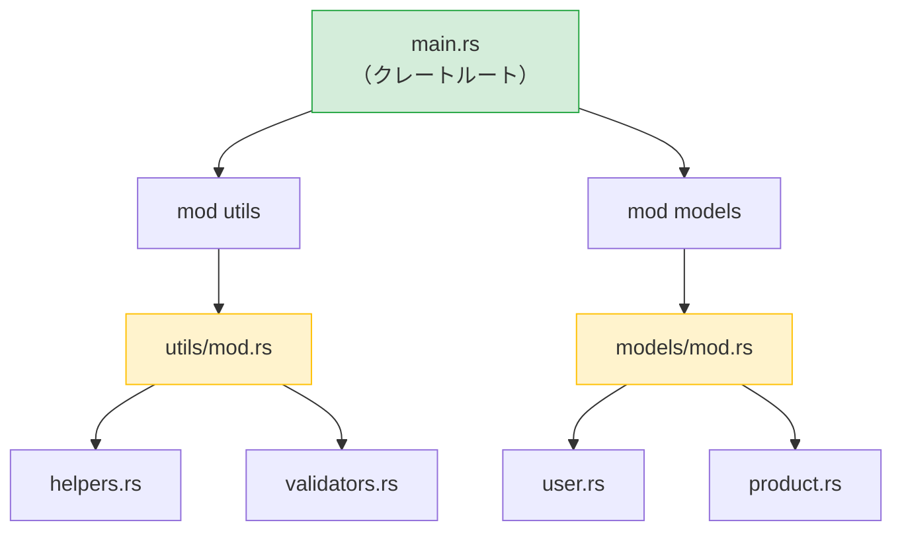

## Rustのモジュール vs Pythonのパッケージ

> **学ぶこと:** `mod` と `use` vs `import`、可視性（`pub`）とPythonの慣例による非公開の違い、Cargo.toml vs pyproject.toml、crates.io vs PyPI、そしてワークスペースとモノレポについて学びます。
>
> **難易度:** 🟢 初級

### Pythonのモジュールシステム
```python
# Python — ファイルがモジュールとなり、__init__.py を持つディレクトリがパッケージとなる

# myproject/
# ├── __init__.py          # パッケージにするためのファイル
# ├── main.py
# ├── utils/
# │   ├── __init__.py      # utils をサブパッケージにする
# │   ├── helpers.py
# │   └── validators.py
# └── models/
#     ├── __init__.py
#     ├── user.py
#     └── product.py

# インポート:
from myproject.utils.helpers import format_name
from myproject.models.user import User
import myproject.utils.validators as validators
```

### Rustのモジュールシステム
```rust
// Rust — mod 宣言がモジュールツリーを構築し、ファイルが内容を提供する

// src/
// ├── main.rs             # クレートルート — モジュールを宣言
// ├── utils/
// │   ├── mod.rs           # モジュール宣言（__init__.py に類似）
// │   ├── helpers.rs
// │   └── validators.rs
// └── models/
//     ├── mod.rs
//     ├── user.rs
//     └── product.rs

// src/main.rs 内:
mod utils;       // Rust に src/utils/mod.rs を探索するよう指示
mod models;      // Rust に src/models/mod.rs を探索するよう指示

use utils::helpers::format_name;
use models::user::User;

// src/utils/mod.rs 内:
pub mod helpers;      // helpers.rs を宣言して再エクスポート
pub mod validators;   // validators.rs を宣言して再エクスポート
```



> **Pythonでの相当物**: `mod.rs` は `__init__.py` のようなものと考えてください。モジュールが何をエクスポートするかを宣言します。クレートルート（`main.rs` / `lib.rs`）は、最上位パッケージの `__init__.py` に似ています。

### 主な違い

| 概念 | Python | Rust |
|---------|--------|------|
| モジュール ＝ ファイル | ✅ 自動的 | `mod` で宣言する必要がある |
| パッケージ ＝ ディレクトリ | `__init__.py` | `mod.rs` |
| デフォルトで公開 | ✅ すべて公開 | ❌ デフォルトで非公開（private） |
| 公開にする方法 | `_prefix` の慣例 | `pub` キーワード |
| インポート構文 | `from x import y` | `use x::y;` |
| ワイルドカードインポート | `from x import *` | `use x::*;`（非推奨） |
| 相対インポート | `from . import sibling` | `use super::sibling;` |
| 再エクスポート | `__all__` または明示的インポート | `pub use inner::Thing;` |

### 可視性 — デフォルトで非公開
```python
# Python — "私たちはみな分別ある大人である"（紳士協定）
class User:
    def __init__(self):
        self.name = "Alice"       # 公開（慣例による）
        self._age = 30            # "非公開"（慣例: アンダースコア1つ）
        self.__secret = "shhh"    # マングリング（完全な非公開ではない）

# _age や __secret にアクセスすることを防ぐものは何もない
print(user._age)                  # 正常に動作する
print(user._User__secret)        # これも動作する（名前マングリング）
```

```rust
// Rust — 非公開（private）はコンパイラによって強制される
pub struct User {
    pub name: String,      // 公開 — 誰でもアクセス可能
    age: i32,              // 非公開 — このモジュール内からのみアクセス可能
}

impl User {
    pub fn new(name: &str, age: i32) -> Self {
        User { name: name.to_string(), age }
    }

    pub fn age(&self) -> i32 {   // 公開ゲッター
        self.age
    }

    fn validate(&self) -> bool { // 非公開メソッド
        self.age > 0
    }
}

// モジュールの外部:
let user = User::new("Alice", 30);
println!("{}", user.name);        // ✅ 公開
// println!("{}", user.age);      // ❌ コンパイルエラー: フィールドは非公開
println!("{}", user.age());       // ✅ 公開メソッド（ゲッター）
```

***

## クレート vs PyPI パッケージ

### Pythonのパッケージ (PyPI)
```bash
# Python
pip install requests           # PyPI からインストール
pip install "requests>=2.28"   # バージョン制約
pip freeze > requirements.txt  # バージョンの固定（ロック）
pip install -r requirements.txt # 環境の再現
```

### Rustのクレート (crates.io)
```bash
# Rust
cargo add reqwest              # crates.io からインストール（Cargo.toml に追加）
cargo add reqwest@0.12         # バージョン制約
# Cargo.lock は自動生成される — 手動での手順は不要
cargo build                    # 依存関係をダウンロードしてコンパイル
```

### Cargo.toml vs pyproject.toml
```toml
# Rust — Cargo.toml
[package]
name = "my-project"
version = "0.1.0"
edition = "2021"

[dependencies]
serde = { version = "1.0", features = ["derive"] }  # 機能フラグ（features）付き
reqwest = { version = "0.12", features = ["json"] }
tokio = { version = "1", features = ["full"] }
log = "0.4"

[dev-dependencies]
mockall = "0.13"
```

### Python開発者のための必須クレート一覧

| Pythonライブラリ | Rustクレート | 用途 |
|---------------|------------|---------|
| `requests` | `reqwest` | HTTPクライアント |
| `json` (標準ライブラリ) | `serde_json` | JSONパース |
| `pydantic` | `serde` | シリアライズ / バリデーション |
| `pathlib` | `std::path` (標準ライブラリ) | パス操作 |
| `os` / `shutil` | `std::fs` (標準ライブラリ) | ファイル操作 |
| `re` | `regex` | 正規表現 |
| `logging` | `tracing` / `log` | ロギング |
| `click` / `argparse` | `clap` | CLI引数のパース |
| `asyncio` | `tokio` | 非同期ランタイム |
| `datetime` | `chrono` | 日時処理 |
| `pytest` | 組み込み機能 + `rstest` | テスト |
| `dataclasses` | `#[derive(...)]` | データ構造 |
| `typing.Protocol` | トレイト | 構造的型付け |
| `subprocess` | `std::process` (標準ライブラリ) | 外部コマンド実行 |
| `sqlite3` | `rusqlite` | SQLite |
| `sqlalchemy` | `diesel` / `sqlx` | ORM / SQLツールキット |
| `fastapi` | `axum` / `actix-web` | Webフレームワーク |

***

## ワークスペース vs モノレポ

### Pythonのモノレポ（一般的な構成）
```text
# Python モノレポ（さまざまなアプローチがあり、標準はない）
myproject/
├── pyproject.toml           # ルートプロジェクト
├── packages/
│   ├── core/
│   │   ├── pyproject.toml   # 各パッケージが独自の設定を持つ
│   │   └── src/core/...
│   ├── api/
│   │   ├── pyproject.toml
│   │   └── src/api/...
│   └── cli/
│       ├── pyproject.toml
│       └── src/cli/...
# ツール: poetry workspaces, pip -e ., uv workspaces — 標準は存在しない
```

### Rustのワークスペース
```toml
# Rust — ルートの Cargo.toml
[workspace]
members = [
    "core",
    "api",
    "cli",
]

# ワークスペース全体で共有される依存関係
[workspace.dependencies]
serde = { version = "1.0", features = ["derive"] }
tokio = { version = "1", features = ["full"] }
```

```text
# Rust ワークスペース構造 — 標準化されており、Cargo に組み込み
myproject/
├── Cargo.toml               # ワークスペースルート
├── Cargo.lock               # 全クレート共通の単一のロックファイル
├── core/
│   ├── Cargo.toml            # [dependencies] serde.workspace = true
│   └── src/lib.rs
├── api/
│   ├── Cargo.toml
│   └── src/lib.rs
└── cli/
    ├── Cargo.toml
    └── src/main.rs
```

```bash
# ワークスペースコマンド
cargo build                  # すべてをビルド
cargo test                   # すべてをテスト
cargo build -p core          # core クレートのみビルド
cargo test -p api            # api クレートのみテスト
cargo clippy --all           # すべてをリント
```

> **重要なポイント**: RustのワークスペースはCargoに標準で組み込まれたファーストクラスの機能です。Pythonのモノレポはサードパーティツール（poetry、uv、pantsなど）に依存しており、サポートレベルも様々です。Rustのワークスペースでは、すべてのクレートが単一の `Cargo.lock` を共有するため、プロジェクト全体で一貫した依存関係バージョンが保証されます。

---

## 演習問題

<details>
<summary><strong>🏋️ 演習: モジュールの可視性</strong>（クリックして展開）</summary>

**課題**: 以下のモジュール構造において、どの行がコンパイル可能でどの行がコンパイルエラーになるかを予測してください:

```rust
mod kitchen {
    fn secret_recipe() -> &'static str { "42 spices" }
    pub fn menu() -> &'static str { "Today's special" }

    pub mod staff {
        pub fn cook() -> String {
            format!("Cooking with {}", super::secret_recipe())
        }
    }
}

fn main() {
    println!("{}", kitchen::menu());             // Line A
    println!("{}", kitchen::secret_recipe());     // Line B
    println!("{}", kitchen::staff::cook());       // Line C
}
```

<details>
<summary>🔑 解答例</summary>

- **Line A**: ✅ コンパイル可能 — `menu()` は `pub` です。
- **Line B**: ❌ コンパイルエラー — `secret_recipe()` は `kitchen` モジュールの非公開アイテムです。
- **Line C**: ✅ コンパイル可能 — `staff::cook()` は `pub` であり、`cook()` は `super::` を介して `secret_recipe()` にアクセスできます（子モジュールは親モジュールの非公開アイテムにアクセスできます）。

**重要なポイント**: Rustでは、子モジュールは親の非公開アイテムを参照できます（Pythonの `_private` の慣例に似ていますが、コンパイラによって強制されます）。外部からはアクセスできません。これは、`_private` が単なるヒントに過ぎないPythonとは対照的です。

</details>
</details>

***
