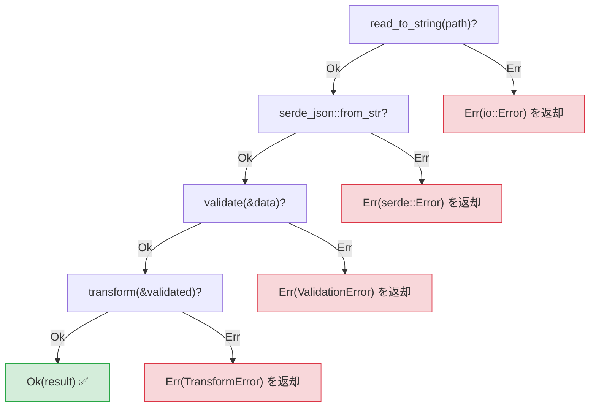
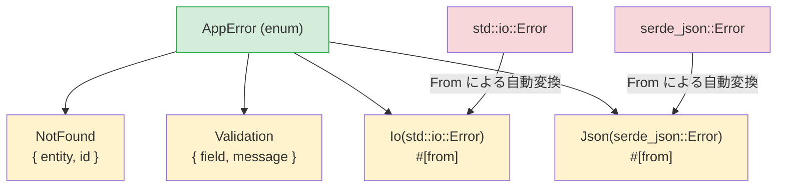

## 例外 vs Result

> **学習内容:** `Result<T, E>` と `try`/`except` の比較、簡潔なエラー伝播のための `?` 演算子、`thiserror` によるカスタムエラー型、アプリケーション向けの `anyhow`、および明示的なエラー処理が潜在的なバグを防ぐ理由
>
> **難易度:** 🟡 中級

これはPythonエンジニアにとって最も大きなマインドセットの転換（パラダイムシフト）の1つです。Pythonはエラー処理に例外を使用します。例外はどこからでもスロー（発生）でき、どこででもキャッチ（あるいは全くキャッチされず放置）できます。
一方、Rustは `Result<T, E>` を使用します。エラーは「値」であり、明示的に処理しなければなりません。

### Pythonの例外処理
```python
# Python — 例外はどこからでもスロー可能
import json

def load_config(path: str) -> dict:
    try:
        with open(path) as f:
            data = json.load(f)     # JSONDecodeError が発生する可能性あり
            if "version" not in data:
                raise ValueError("Missing version field")
            return data
    except FileNotFoundError:
        print(f"Config file not found: {path}")
        return {}
    except json.JSONDecodeError as e:
        print(f"Invalid JSON: {e}")
        return {}
    # この関数は他にどのような例外をスローする可能性があるか？
    # IOError? PermissionError? UnicodeDecodeError?
    # 関数のシグネチャからは判別できません！
```

### RustのResultベースのエラー処理
```rust
// Rust — エラーは戻り値であり、関数のシグネチャに明示される
use std::fs;
use serde_json::Value;

fn load_config(path: &str) -> Result<Value, ConfigError> {
    let contents = fs::read_to_string(path)    // Result を返す
        .map_err(|e| ConfigError::FileError(e.to_string()))?;

    let data: Value = serde_json::from_str(&contents)  // Result を返す
        .map_err(|e| ConfigError::ParseError(e.to_string()))?;

    if data.get("version").is_none() {
        return Err(ConfigError::MissingField("version".to_string()));
    }

    Ok(data)
}

#[derive(Debug)]
enum ConfigError {
    FileError(String),
    ParseError(String),
    MissingField(String),
}
```

### 主な相違点

```text
Python:                                 Rust:
─────────                               ─────
- エラーは例外（スローされる）            - エラーは値（返却される）
- 暗黙的な制御フロー（スタック巻き戻し）   - 明示的な制御フロー（? 演算子）
- シグネチャからエラーの種類が分からない   - 戻り値の型でエラーが必ず明示される
- 未捕捉の例外は実行時にクラッシュする     - 未処理の Result はコンパイル警告を生じる（常に処理が必要）
- try/except は任意（省略可能）          - Result の処理は必須
- 広い except がすべてを捕捉してしまう    - match の分岐（アーム）は網羅的
```

### 2つのResultバリアント
```rust
// Result<T, E> には正確に2つのバリアントがあります:
enum Result<T, E> {
    Ok(T),    // 成功 — 値を保持（Pythonの通常の戻り値に相当）
    Err(E),   // 失敗 — エラーを保持（Pythonの送出された例外に相当）
}

// Result の使用例:
fn divide(a: f64, b: f64) -> Result<f64, String> {
    if b == 0.0 {
        Err("Division by zero".to_string())  // raise ValueError("...") に相当
    } else {
        Ok(a / b)                             // return a / b に相当
    }
}

// Result の処理 — try/except に似ていますが明示的です
match divide(10.0, 0.0) {
    Ok(result) => println!("Result: {result}"),
    Err(msg) => println!("Error: {msg}"),
}
```

***

## `?` 演算子

`?` 演算子は、例外をコールスタックの上位に伝播させるPythonの挙動に相当しますが、コード上およびシグネチャ上で可視化され明示的です。

### Python — 暗黙的な伝播
```python
# Python — 例外はコールスタックを暗黙のうちに上位へ伝播する
def read_username() -> str:
    with open("config.txt") as f:      # FileNotFoundError が伝播する可能性あり
        return f.readline().strip()    # IOError が伝播する可能性あり

def greet():
    name = read_username()             # これが例外をスローすると、greet() も例外をスローする
    print(f"Hello, {name}!")           # エラー時にはスキップされる

# エラーの伝播は「見えない」ため、実装コードを読まなければ
# どの例外が外に漏れる可能性があるのか分かりません。
```

### Rust — `?` による明示的な伝播
```rust
// Rust — ? はエラーを伝播させますが、コード内とシグネチャの両方で明示されます
use std::fs;
use std::io;

fn read_username() -> Result<String, io::Error> {
    let contents = fs::read_to_string("config.txt")?;  // ? = Err の場合は即座に伝播
    Ok(contents.lines().next().unwrap_or("").to_string())
}

fn greet() -> Result<(), io::Error> {
    let name = read_username()?;       // ? = Err の場合、即座に Err をリターン
    println!("Hello, {name}!");        // Ok の場合のみ実行される
    Ok(())
}

// ? の意味: 「これが Err なら、直ちにこの関数からそれを return する」
// これはPythonの例外伝播に似ていますが、以下の点が異なります:
// 1. 目に見える（? が付いている）
// 2. 戻り値の型に明記されている（Result<..., io::Error>）
// 3. コンパイラがどこかで必ず処理することを保証する
```

### `?` の連鎖（チェイン）
```python
# Python — 失敗する可能性のある複数の操作
def process_file(path: str) -> dict:
    with open(path) as f:                    # 失敗する可能性あり
        text = f.read()                       # 失敗する可能性あり
    data = json.loads(text)                   # 失敗する可能性あり
    validate(data)                            # 失敗する可能性あり
    return transform(data)                    # 失敗する可能性あり
    # これらのどれでも例外が発生する可能性があり、例外の型も様々です！
```

```rust
// Rust — 同様の処理チェインを明示的に記述
fn process_file(path: &str) -> Result<Data, AppError> {
    let text = fs::read_to_string(path)?;     // ? が io::Error を伝播
    let data: Value = serde_json::from_str(&text)?;  // ? が serde エラーを伝播
    let validated = validate(&data)?;          // ? がバリデーションエラーを伝播
    let result = transform(&validated)?;       // ? が変換エラーを伝播
    Ok(result)
}
// すべての ? が早期リターン（脱出ポイント）の可能性を示しており、すべて可視化されています！
```



> ドキュメントを読まないとどの行で例外が発生するか分からないPythonのtry/exceptとは異なり、個々の `?` が明確な脱出ポイントとなっています。
>
> 📌 **参照**: [第15章 — 移行パターン](ch15-migration-patterns.md) では、実際のコードベースにおいてPythonのtry/exceptパターンをRustに変換する方法を解説しています。

***

## `thiserror` によるカスタムエラー型



> `#[from]` 属性により `impl From<io::Error> for AppError` が自動生成されるため、`?` を使うだけでライブラリのエラーがアプリケーション独自のエラー型に自動変換されます。

### Pythonのカスタム例外
```python
# Python — カスタム例外クラス
class AppError(Exception):
    pass

class NotFoundError(AppError):
    def __init__(self, entity: str, id: int):
        self.entity = entity
        self.id = id
        super().__init__(f"{entity} with id {id} not found")

class ValidationError(AppError):
    def __init__(self, field: str, message: str):
        self.field = field
        super().__init__(f"Validation error on {field}: {message}")

# 使用例:
def find_user(user_id: int) -> dict:
    if user_id not in users:
        raise NotFoundError("User", user_id)
    return users[user_id]
```

### `thiserror` を用いたRustのカスタムエラー
```rust
// Rust — thiserror によるエラー列挙型（最も一般的なアプローチ）
// Cargo.toml: thiserror = "2"

use thiserror::Error;

#[derive(Debug, Error)]
enum AppError {
    #[error("{entity} with id {id} not found")]
    NotFound { entity: String, id: i64 },

    #[error("Validation error on {field}: {message}")]
    Validation { field: String, message: String },

    #[error("IO error: {0}")]
    Io(#[from] std::io::Error),        // io::Error から自動変換

    #[error("JSON error: {0}")]
    Json(#[from] serde_json::Error),   // serde エラーから自動変換
}

// 使用例:
fn find_user(user_id: i64) -> Result<User, AppError> {
    users.get(&user_id)
        .cloned()
        .ok_or(AppError::NotFound {
            entity: "User".to_string(),
            id: user_id,
        })
}

// #[from] 属性により、? は io::Error → AppError::Io への自動変換を行う
fn load_users(path: &str) -> Result<Vec<User>, AppError> {
    let data = fs::read_to_string(path)?;  // io::Error → AppError::Io へ自動変換
    let users: Vec<User> = serde_json::from_str(&data)?;  // → AppError::Json へ自動変換
    Ok(users)
}
```

### エラー処理クイックリファレンス

| Python | Rust | 備考 |
|--------|------|-------|
| `raise ValueError("msg")` | `return Err(AppError::Validation {...})` | 明示的なリターン |
| `try: ... except:` | `match result { Ok(v) => ..., Err(e) => ... }` | 網羅的チェック |
| `except ValueError as e:` | `Err(AppError::Validation { .. }) =>` | パターンマッチング |
| `raise ... from e` | `#[from]` 属性または `.map_err()` | エラーチェイン |
| `finally:` | `Drop` トレイト（自動実行） | 決定論的クリーンアップ |
| `with open(...):` | スコープベースのドロップ（自動実行） | RAIIパターン |
| 例外が暗黙的に伝播する | `?` が可視的に伝播する | 戻り値の型に常に明記 |
| `isinstance(e, ValueError)` | `matches!(e, AppError::Validation {..})` | 型チェック |

---

## 演習問題

<details>
<summary><strong>🏋️ 演習: 設定値のパース</strong> (クリックして展開)</summary>

**課題**: 以下の要件を満たす関数 `parse_port(s: &str) -> Result<u16, String>` を作成してください:
1. 空文字列をエラー `"empty input"` として拒絶する
2. 文字列を `u16` にパースし、パースエラーを `"invalid number: {original_error}"` にマッピングする
3. 1024 未満のポート番号を `"port {n} is privileged"` として拒絶する

`""`、`"hello"`、`"80"`、`"8080"` を渡して呼び出し、結果を出力してください。

<details>
<summary>🔑 解答例</summary>

```rust
fn parse_port(s: &str) -> Result<u16, String> {
    if s.is_empty() {
        return Err("empty input".to_string());
    }
    let port: u16 = s.parse().map_err(|e| format!("invalid number: {e}"))?;
    if port < 1024 {
        return Err(format!("port {port} is privileged"));
    }
    Ok(port)
}

fn main() {
    for input in ["", "hello", "80", "8080"] {
        match parse_port(input) {
            Ok(port) => println!("✅ {input} → {port}"),
            Err(e) => println!("❌ {input:?} → {e}"),
        }
    }
}
```

**重要ポイント**: `.map_err()` を伴う `?` は、Pythonの `try/except ValueError as e: raise ConfigError(...) from e` に相当します。すべてのエラーパスが戻り値の型として可視化されます。

</details>
</details>

***
