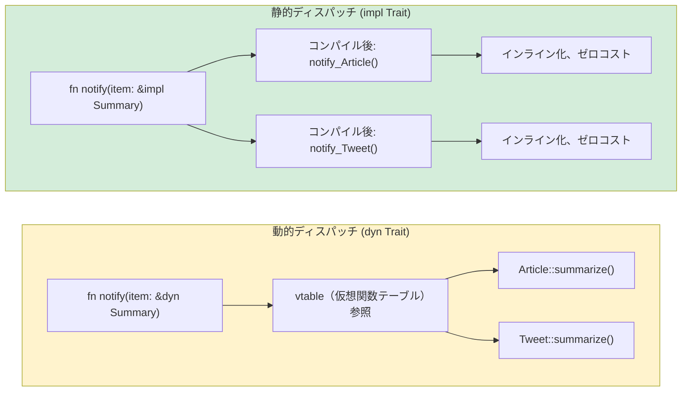

## トレイト vs ダックタイピング

> **学習内容:** 明示的な契約としてのトレイト（Pythonのダックタイピングとの比較）、`Protocol` (PEP 544) ≈ トレイト、`where` 節によるジェネリクス境界、トレイトオブジェクト（`dyn Trait`）と静的ディスパッチの比較、および主要な標準ライブラリのトレイト
>
> **難易度:** 🟡 中級

ここはPythonエンジニアにとって、Rustの型システムが真に輝く部分です。Pythonの「ダックタイピング」は、「アヒルのように歩き、アヒルのように鳴くなら、それはアヒルである」という考え方です。
一方、Rustのトレイトは、「私が必要とするアヒルの振る舞いを、コンパイル時に正確に指定する」というアプローチを取ります。

### Pythonのダックタイピング
```python
# Python — ダックタイピング: 適切なメソッドを持つオブジェクトなら何でも動作する
def total_area(shapes):
    """ .area() メソッドを持つ任意のオブジェクトで動作する """
    return sum(shape.area() for shape in shapes)

class Circle:
    def __init__(self, radius): self.radius = radius
    def area(self): return 3.14159 * self.radius ** 2

class Rectangle:
    def __init__(self, w, h): self.w, self.h = w, h
    def area(self): return self.w * self.h

# 実行時に動作 — 継承は不要！
shapes = [Circle(5), Rectangle(3, 4)]
print(total_area(shapes))  # 90.54

# しかし、.area() を持たないオブジェクトを渡すとどうなるか？
class Dog:
    def bark(self): return "Woof!"

total_area([Dog()])  # 💥 AttributeError: 'Dog' object has no attribute 'area'
# エラーは定義時ではなく「実行時」に発生する
```

### Rustのトレイト — 明示的なダックタイピング
```rust
// Rust — トレイトにより「アヒル」の契約を明示化する
trait HasArea {
    fn area(&self) -> f64;      // このトレイトを実装する任意の型は .area() を持つ
}

struct Circle { radius: f64 }
struct Rectangle { width: f64, height: f64 }

impl HasArea for Circle {
    fn area(&self) -> f64 {
        std::f64::consts::PI * self.radius * self.radius
    }
}

impl HasArea for Rectangle {
    fn area(&self) -> f64 {
        self.width * self.height
    }
}

// トレイト制約は明示的 — コンパイラがコンパイル時に検証する
fn total_area(shapes: &[&dyn HasArea]) -> f64 {
    shapes.iter().map(|s| s.area()).sum()
}

// 使用例:
let shapes: Vec<&dyn HasArea> = vec![&Circle { radius: 5.0 }, &Rectangle { width: 3.0, height: 4.0 }];
println!("{}", total_area(&shapes));  // 90.54

// struct Dog;
// total_area(&[&Dog {}]);  // ❌ コンパイルエラー: Dog は HasArea を実装していない
```

> **重要ポイント**: Pythonのダックタイピングはエラーの検出を実行時まで先送りします。Rustのトレイトはコンパイル時にエラーを捕捉します。同等の柔軟性を持ちながら、より早期にエラーを発見できます。

***

## プロトコル (PEP 544) vs トレイト

Python 3.8で構造的サブタイピングのための `Protocol` (PEP 544) が導入されました。これはPythonにおける概念の中で、Rustのトレイトに最も近いものです。

### PythonのProtocol
```python
# Python — Protocol（構造的型付け、Rustのトレイトに近い）
from typing import Protocol, runtime_checkable

@runtime_checkable
class Printable(Protocol):
    def to_string(self) -> str: ...

class User:
    def __init__(self, name: str):
        self.name = name
    def to_string(self) -> str:
        return f"User({self.name})"

class Product:
    def __init__(self, name: str, price: float):
        self.name = name
        self.price = price
    def to_string(self) -> str:
        return f"Product({self.name}, ${self.price:.2f})"

def print_all(items: list[Printable]) -> None:
    for item in items:
        print(item.to_string())

# User と Product は両方とも to_string() を持つため動作する
print_all([User("Alice"), Product("Widget", 9.99)])

# ただし: mypy はこれを検証しますが、Pythonランタイム自体は強制しません
# print_all([42])  # mypy は警告するが、Pythonは実行してクラッシュする
```

### Rustのトレイト（同等だがコンパイル時に強制される！）
```rust
// Rust — トレイトはコンパイル時に強制される
trait Printable {
    fn to_string(&self) -> String;
}

struct User { name: String }
struct Product { name: String, price: f64 }

impl Printable for User {
    fn to_string(&self) -> String {
        format!("User({})", self.name)
    }
}

impl Printable for Product {
    fn to_string(&self) -> String {
        format!("Product({}, ${:.2})", self.name, self.price)
    }
}

fn print_all(items: &[&dyn Printable]) {
    for item in items {
        println!("{}", item.to_string());
    }
}

// print_all(&[&42i32]);  // ❌ コンパイルエラー: i32 は Printable を実装していない
```

### 比較表

| 機能 | Python Protocol | Rust トレイト |
|---------|-----------------|------------|
| 構造的型付け | ✅（暗黙的） | ❌（明示的な `impl`） |
| 検証タイミング | 実行時（または mypy） | コンパイル時（常に） |
| デフォルト実装 | ❌ | ✅ |
| 外部型への追加 | ❌ | ✅（コヒーレンスルールの範囲内） |
| 複数プロトコル / トレイトの適用 | ✅ | ✅ |
| 関連型（Associated Types） | ❌ | ✅ |
| ジェネリクス制約 | ✅（`TypeVar` を使用） | ✅（トレイト境界） |

***

## ジェネリクス制約

### Pythonのジェネリクス
```python
# Python — ジェネリック関数のための TypeVar
from typing import TypeVar, Sequence

T = TypeVar('T')

def first(items: Sequence[T]) -> T | None:
    return items[0] if items else None

# 境界付き TypeVar
from typing import SupportsFloat
T = TypeVar('T', bound=SupportsFloat)

def average(items: Sequence[T]) -> float:
    return sum(float(x) for x in items) / len(items)
```

### トレイト境界を持つRustのジェネリクス
```rust
// Rust — トレイト境界を持つジェネリクス
fn first<T>(items: &[T]) -> Option<&T> {
    items.first()
}

// トレイト境界付き — 「T はこれらのトレイトを実装していなければならない」
fn average<T>(items: &[T]) -> f64
where
    T: Into<f64> + Copy,   // T は f64 への変換が可能かつ Copy でなければならない
{
    let sum: f64 = items.iter().map(|&x| x.into()).sum();
    sum / items.len() as f64
}

// 複数の境界 — 「T は Display かつ Debug かつ Clone を実装していなければならない」
fn log_and_clone<T: std::fmt::Display + std::fmt::Debug + Clone>(item: &T) -> T {
    println!("Display: {}", item);
    println!("Debug: {:?}", item);
    item.clone()
}

// impl Trait による省略記法（シンプルなケース向け）
fn print_it(item: &impl std::fmt::Display) {
    println!("{}", item);
}
```

### ジェネリクスクイックリファレンス

| Python | Rust | 備考 |
|--------|------|-------|
| `TypeVar('T')` | `<T>` | 境界なしジェネリクス |
| `TypeVar('T', bound=X)` | `<T: X>` | 境界付きジェネリクス |
| `Union[int, str]` | `enum` または トレイトオブジェクト | RustにはUnion型（直和型のない合併）は存在しない |
| `Sequence[T]` | `&[T]` (スライス) | 借用されたシーケンス |
| `Callable[[A], R]` | `Fn(A) -> R` | 関数トレイト |
| `Optional[T]` | `Option<T>` | 言語標準機能 |

***

## よく使われる標準ライブラリのトレイト

これらはPythonの「特殊メソッド（dunder methods）」のRust版であり、一般的な状況において型がどのように振る舞うかを定義します。

### Display と Debug（出力表示）
```rust
use std::fmt;

// Debug — __repr__ に相当（自動導出可能）
#[derive(Debug)]
struct Point { x: f64, y: f64 }
// println!("{:?}", point); が利用可能になる

// Display — __str__ に相当（手動実装が必要）
impl fmt::Display for Point {
    fn fmt(&self, f: &mut fmt::Formatter<'_>) -> fmt::Result {
        write!(f, "({}, {})", self.x, self.y)
    }
}
// println!("{}", point); が利用可能になる
```

### 比較トレイト
```rust
// PartialEq — __eq__ に相当
// Eq — 完全な同値関係（f64 は NaN != NaN のため PartialEq だが Eq ではない）
// PartialOrd — __lt__, __le__ 等に相当
// Ord — 全順序関係

#[derive(Debug, PartialEq, Eq, PartialOrd, Ord, Hash, Clone)]
struct Student {
    name: String,
    grade: i32,
}

// これで Student は比較、ソート、HashMap のキーとしての使用、クローンが可能になる
let mut students = vec![
    Student { name: "Charlie".into(), grade: 85 },
    Student { name: "Alice".into(), grade: 92 },
];
students.sort();  // Ord を使用 — name、次いで grade の順（構造体のフィールド定義順）でソート
```

### Iterator トレイト
```rust
// Iterator の実装 — Pythonの __iter__/__next__ に相当
struct Countdown { value: i32 }

impl Iterator for Countdown {
    type Item = i32;       // イテレータが生成する要素の型

    fn next(&mut self) -> Option<Self::Item> {
        if self.value > 0 {
            self.value -= 1;
            Some(self.value + 1)
        } else {
            None             // イテレーション完了
        }
    }
}

// 使用例:
for n in (Countdown { value: 5 }) {
    println!("{n}");  // 5, 4, 3, 2, 1
}
```

### 主なトレイト一覧

| Rust トレイト | Python 相当 | 用途 |
|-----------|-------------------|---------|
| `Display` | `__str__` | 人間が読みやすい文字列表現 |
| `Debug` | `__repr__` | デバッグ用文字列（derive可能） |
| `Clone` | `copy.deepcopy` | ディープコピー |
| `Copy` | (int/float の暗黙コピー) | 単純な型に対する暗黙のビットコピー |
| `PartialEq` / `Eq` | `__eq__` | 等価比較 |
| `PartialOrd` / `Ord` | `__lt__` など | 大小比較・順序付け |
| `Hash` | `__hash__` | ハッシュ値計算（dictのキー用） |
| `Default` | デフォルト引数付き `__init__` | デフォルト値の提供 |
| `From` / `Into` | `__init__` のオーバーロード等 | 型変換 |
| `Iterator` | `__iter__` / `__next__` | イテレーション |
| `Drop` | `__del__` / `__exit__` | クリーンアップ（リソース解放） |
| `Add`, `Sub`, `Mul` | `__add__`, `__sub__`, `__mul__` | 演算子オーバーロード |
| `Index` | `__getitem__` | `[]` によるインデックス参照 |
| `Deref` | （該当なし） | スマートポインタの参照外し |
| `Send` / `Sync` | （該当なし） | スレッド安全性のマーカー |



> **Pythonとの対比**: Pythonは*常に*動的ディスパッチ（実行時の `getattr`）を使用します。Rustはデフォルトで静的ディスパッチ（単相化：monomorphization — コンパイラが具体的な型ごと専用のコードを生成する）を行います。実行時ポリモーフィズムが真に必要な場合にのみ `dyn Trait` を使用してください。
>
> 📌 **参照**: [第11章 — From/Into トレイト](ch11-from-and-into-traits.md) では、型変換トレイト（`From`、`Into`、`TryFrom`）について詳しく解説しています。

### 関連型（Associated Types）

Rustのトレイトは「関連型（Associated Types）」を定義できます。これは各実装者が具体的な型を指定するプレースホルダーです。Pythonにこれと同等のものはありません:

```rust
// Iterator は関連型 'Item' を定義している
trait Iterator {
    type Item;
    fn next(&mut self) -> Option<Self::Item>;
}

struct Countdown { remaining: u32 }

impl Iterator for Countdown {
    type Item = u32;  // このイテレータは u32 の値を生成する
    fn next(&mut self) -> Option<u32> {
        if self.remaining > 0 {
            self.remaining -= 1;
            Some(self.remaining)
        } else {
            None
        }
    }
}
```

Pythonでは、`__iter__` / `__next__` は `Any` を返します。「このイテレータは `int` を生成する」と宣言してそれを厳格に強制する方法はありません（`Iterator[int]` による型ヒントは補助的なものにすぎません）。

### 演算子オーバーロード: `__add__` → `impl Add`

Pythonはマジックメソッド（`__add__`、`__mul__`）を使用します。Rustはトレイト実装を使用します。アイデアは同じですが、コンパイル時に型チェックが行われます:

```python
# Python
class Vec2:
    def __init__(self, x, y):
        self.x, self.y = x, y
    def __add__(self, other):
        return Vec2(self.x + other.x, self.y + other.y)  # 'other' に対する型チェックはない
```

```rust
use std::ops::Add;

#[derive(Debug, Clone, Copy)]
struct Vec2 { x: f64, y: f64 }

impl Add for Vec2 {
    type Output = Vec2;  // 関連型: + の結果として何を返すか？
    fn add(self, rhs: Vec2) -> Vec2 {
        Vec2 { x: self.x + rhs.x, y: self.y + rhs.y }
    }
}

let a = Vec2 { x: 1.0, y: 2.0 };
let b = Vec2 { x: 3.0, y: 4.0 };
let c = a + b;  // 型安全: Vec2 + Vec2 のみが許可される
```

主な違い: Pythonの `__add__` は実行時に*あらゆる* `other` を受け取ります（手動で型をチェックするか、`TypeError` になります）。Rustの `Add` トレイトはコンパイル時にオペランドの型を強制します — 明示的に `impl Add<i32> for Vec2` を実装しない限り、`Vec2 + i32` はコンパイルエラーになります。

---

## 演習問題

<details>
<summary><strong>🏋️ 演習: ジェネリックな要約トレイト</strong> (クリックして展開)</summary>

**課題**: メソッド `fn summarize(&self) -> String` を持つトレイト `Summary` を定義してください。これを2つの構造体 `Article { title: String, body: String }` と `Tweet { username: String, content: String }` に実装してください。その後、要約を出力する関数 `fn notify(item: &impl Summary)` を作成してください。

<details>
<summary>🔑 解答例</summary>

```rust
trait Summary {
    fn summarize(&self) -> String;
}

struct Article { title: String, body: String }
struct Tweet { username: String, content: String }

impl Summary for Article {
    fn summarize(&self) -> String {
        format!("{} — {}...", self.title, &self.body[..20.min(self.body.len())])
    }
}

impl Summary for Tweet {
    fn summarize(&self) -> String {
        format!("@{}: {}", self.username, self.content)
    }
}

fn notify(item: &impl Summary) {
    println!("📢 {}", item.summarize());
}

fn main() {
    let article = Article {
        title: "Rust is great".into(),
        body: "Here is why Rust beats Python for systems...".into(),
    };
    let tweet = Tweet {
        username: "rustacean".into(),
        content: "Just shipped my first crate!".into(),
    };
    notify(&article);
    notify(&tweet);
}
```

**重要ポイント**: `&impl Summary` は、`summarize` メソッドを持つPythonの `Protocol` のRust版です。しかし、Rustはこれをコンパイル時にチェックします。`Summary` を実装していない型を渡すと、実行時の `AttributeError` ではなくコンパイルエラーになります。

</details>
</details>

***
