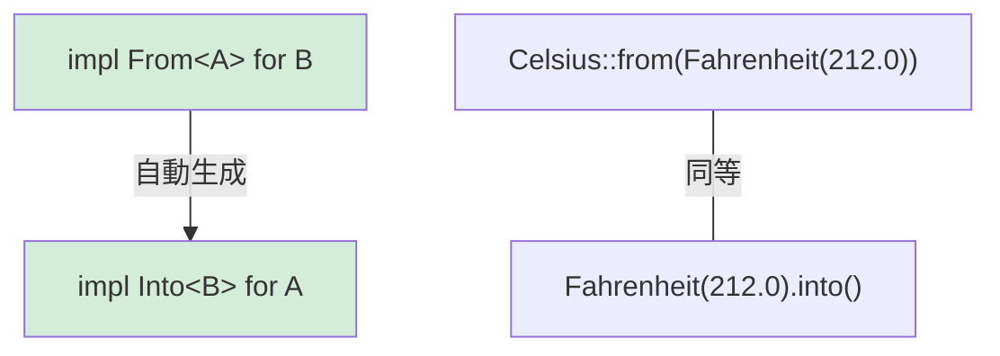

## Rustにおける型変換

> **学習内容:** ゼロコストな型変換のための `From` および `Into` トレイト、失敗する可能性のある変換のための `TryFrom`、`impl From<A> for B` がどのようにして `Into` を自動生成するか、および文字列変換パターン
>
> **難易度:** 🟡 中級

Pythonでは、コンストラクタの呼び出し（`int("42")`、`str(42)`、`float("3.14")` など）によって型変換を行います。Rustでは、型安全な変換のために `From` と `Into` トレイトを使用します。

### Pythonの型変換
```python
# Python — 変換のための明示的なコンストラクタ
x = int("42")           # str → int (ValueError が発生する可能性あり)
s = str(42)             # int → str
f = float("3.14")       # str → float
lst = list((1, 2, 3))   # tuple → list

# __init__ やクラスメソッドによるカスタム変換
class Celsius:
    def __init__(self, temp: float):
        self.temp = temp

    @classmethod
    def from_fahrenheit(cls, f: float) -> "Celsius":
        return cls((f - 32.0) * 5.0 / 9.0)

c = Celsius.from_fahrenheit(212.0)  # 100.0°C
```

### RustのFrom/Into
```rust
// Rust — From トレイトが型変換を定義する
// From<T> を実装すると、Into<U> が自動的に提供される！

struct Celsius(f64);
struct Fahrenheit(f64);

impl From<Fahrenheit> for Celsius {
    fn from(f: Fahrenheit) -> Self {
        Celsius((f.0 - 32.0) * 5.0 / 9.0)
    }
}

// これで両方の記法が機能する:
let c1 = Celsius::from(Fahrenheit(212.0));    // 明示的な From
let c2: Celsius = Fahrenheit(212.0).into();   // Into（自動導出）

// 文字列の変換:
let s: String = String::from("hello");         // &str → String
let s: String = "hello".to_string();           // 同等
let s: String = "hello".into();                // これも機能する（From が実装されているため）

let num: i64 = 42i32.into();                   // i32 → i64（情報損失がないため From が存在）
// let small: i32 = 42i64.into();              // ❌ i64 → i32 はデータ欠落の恐れがあるため From は存在しない

// 失敗する可能性のある変換には TryFrom を使用:
let n: Result<i32, _> = "42".parse();          // str → i32（失敗する可能性あり）
let n: i32 = "42".parse().unwrap();            // 数値でない場合はパニック
let n: i32 = "42".parse()?;                    // ? でエラーを伝播
```

### FromとIntoの関係性



> **実践の指針**: 常に `From` を実装し、`Into` を直接実装しないでください。`From<A> for B` を実装すれば、`Into<B> for A` が自動的に無料で手に入ります。

***

### From/Into を使用するタイミング

```rust
// 自身の型に From<T> を実装して、人間工学に基づいた（使い勝手の良い）API設計を実現する:

#[derive(Debug)]
struct UserId(i64);

impl From<i64> for UserId {
    fn from(id: i64) -> Self {
        UserId(id)
    }
}

// 関数が UserId に変換可能な任意の型を受け入れられるようにする:
fn find_user(id: impl Into<UserId>) -> Option<String> {
    let user_id = id.into();
    // ... 検索ロジック
    Some(format!("User #{:?}", user_id))
}

find_user(42i64);              // ✅ i64 は自動的に UserId に変換される
find_user(UserId(42));         // ✅ UserId はそのまま渡せる
```

***

## TryFrom — 失敗する可能性のある変換

すべての変換が常に成功するとは限りません。Pythonでは例外を送出しますが、Rustでは `Result` を返す `TryFrom` を使用します:

```python
# Python — 失敗する可能性のある変換は例外をスローする
try:
    port = int("not_a_number")   # ValueError
except ValueError as e:
    print(f"Invalid: {e}")

# __init__ でのカスタムバリデーション
class Port:
    def __init__(self, value: int):
        if not (1 <= value <= 65535):
            raise ValueError(f"Invalid port: {value}")
        self.value = value

try:
    p = Port(99999)  # 実行時に ValueError
except ValueError:
    pass
```

```rust
use std::num::ParseIntError;

// 組み込み型に対する TryFrom
let n: Result<i32, ParseIntError> = "42".try_into();   // Ok(42)
let n: Result<i32, ParseIntError> = "bad".try_into();  // Err(...)

// バリデーションのためのカスタム TryFrom
#[derive(Debug)]
struct Port(u16);

#[derive(Debug)]
enum PortError {
    Zero,
}

impl TryFrom<u16> for Port {
    type Error = PortError;

    fn try_from(value: u16) -> Result<Self, Self::Error> {
        match value {
            0 => Err(PortError::Zero),
            1..=65535 => Ok(Port(value)),
        }
    }
}

impl std::fmt::Display for PortError {
    fn fmt(&self, f: &mut std::fmt::Formatter<'_>) -> std::fmt::Result {
        match self {
            PortError::Zero => write!(f, "port cannot be zero"),
        }
    }
}

// 使用例:
let p: Result<Port, _> = 8080u16.try_into();   // Ok(Port(8080))
let p: Result<Port, _> = 0u16.try_into();       // Err(PortError::Zero)
```

> **Python → Rust のメンタルモデル**: `TryFrom` = 検証を行い失敗し得る `__init__`。ただし、例外を発生させる代わりに `Result` を返すため、呼び出し元はエラーケースを**必ず**処理しなければなりません。

***

## 文字列変換パターン

文字列は、Pythonエンジニアが最も変換に戸惑いやすいポイントです:

```rust
// String → &str（借用、コストゼロ）
let s = String::from("hello");
let r: &str = &s;              // 自動的な Deref 型強制
let r: &str = s.as_str();     // 明示的な参照

// &str → String（メモリ確保が発生、アロケーションコストあり）
let r: &str = "hello";
let s1 = String::from(r);     // From トレイト
let s2 = r.to_string();       // ToString トレイト（Display 経由）
let s3: String = r.into();    // Into トレイト

// 数値 → String
let s = 42.to_string();       // "42" — Python の str(42) に相当
let s = format!("{:.2}", 3.14); // "3.14" — Python の f"{3.14:.2f}" に相当

// String → 数値
let n: i32 = "42".parse().unwrap();       // Python の int("42") に相当
let f: f64 = "3.14".parse().unwrap();     // Python の float("3.14") に相当

// カスタム型 → String（Display を実装する）
use std::fmt;

struct Point { x: f64, y: f64 }

impl fmt::Display for Point {
    fn fmt(&self, f: &mut fmt::Formatter<'_>) -> fmt::Result {
        write!(f, "({}, {})", self.x, self.y)
    }
}

let p = Point { x: 1.0, y: 2.0 };
println!("{p}");                // (1, 2) — Python の __str__ に相当
let s = p.to_string();         // これも機能する！Display を実装すると ToString が自動提供される
```

### 型変換クイックリファレンス

| Python | Rust | 備考 |
|--------|------|-------|
| `str(x)` | `x.to_string()` | `Display` の実装が必要 |
| `int("42")` | `"42".parse::<i32>()` | `Result` を返す |
| `float("3.14")` | `"3.14".parse::<f64>()` | `Result` を返す |
| `list(iter)` | `iter.collect::<Vec<_>>()` | 型アノテーションが必要 |
| `dict(pairs)` | `pairs.collect::<HashMap<_,_>>()` | 型アノテーションが必要 |
| `bool(x)` | 直接の対応物なし | 明示的な条件判定を行う |
| `MyClass(x)` | `MyClass::from(x)` | `From<T>` を実装 |
| `MyClass(x)`（検証付き） | `MyClass::try_from(x)?` | `TryFrom<T>` を実装 |

***

## 変換チェインとエラー処理

実際のコードでは、複数の変換を連鎖させることがよくあります。アプローチを比較してみましょう:

```python
# Python — try/except を使った一連の変換
def parse_config(raw: str) -> tuple[str, int]:
    try:
        host, port_str = raw.split(":")
        port = int(port_str)
        if not (1 <= port <= 65535):
            raise ValueError(f"Bad port: {port}")
        return (host, port)
    except (ValueError, AttributeError) as e:
        raise ConfigError(f"Invalid config: {e}") from e
```

```rust
fn parse_config(raw: &str) -> Result<(String, u16), String> {
    let (host, port_str) = raw
        .split_once(':')
        .ok_or_else(|| "missing ':' separator".to_string())?;

    let port: u16 = port_str
        .parse()
        .map_err(|e| format!("invalid port: {e}"))?;

    if port == 0 {
        return Err("port cannot be zero".to_string());
    }

    Ok((host.to_string(), port))
}

fn main() {
    match parse_config("localhost:8080") {
        Ok((host, port)) => println!("Connecting to {host}:{port}"),
        Err(e) => eprintln!("Config error: {e}"),
    }
}
```

> **重要ポイント**: 各 `?` は目に見える明確な脱出ポイントです。Pythonでは `try` ブロック内のどの行が例外を投げるか分かりませんが、Rustでは `?` で終わる行だけが失敗する可能性があります。
>
> 📌 **参照**: [第9章 — エラー処理](ch09-error-handling.md) では、`Result`、`?`、および `thiserror` を使ったカスタムエラー型について詳しく解説しています。

---

## 演習問題

<details>
<summary><strong>🏋️ 演習: 温度変換ライブラリ</strong> (クリックして展開)</summary>

**課題**: ミニ温度変換ライブラリを作成してください:
1. `Celsius(f64)`、`Fahrenheit(f64)`、`Kelvin(f64)` 構造体を定義する
2. `From<Celsius> for Fahrenheit` および `From<Celsius> for Kelvin` を実装する
3. 絶対零度（-273.15°C = 0K）未満の値を拒絶する `TryFrom<f64> for Kelvin` を実装する
4. 3つの型すべてに `Display` を実装する（例: `"100.00°C"`）

<details>
<summary>🔑 解答例</summary>

```rust
use std::fmt;

struct Celsius(f64);
struct Fahrenheit(f64);
struct Kelvin(f64);

impl From<Celsius> for Fahrenheit {
    fn from(c: Celsius) -> Self {
        Fahrenheit(c.0 * 9.0 / 5.0 + 32.0)
    }
}

impl From<Celsius> for Kelvin {
    fn from(c: Celsius) -> Self {
        Kelvin(c.0 + 273.15)
    }
}

#[derive(Debug)]
struct BelowAbsoluteZero;

impl fmt::Display for BelowAbsoluteZero {
    fn fmt(&self, f: &mut fmt::Formatter<'_>) -> fmt::Result {
        write!(f, "temperature below absolute zero")
    }
}

impl TryFrom<f64> for Kelvin {
    type Error = BelowAbsoluteZero;

    fn try_from(value: f64) -> Result<Self, Self::Error> {
        if value < 0.0 {
            Err(BelowAbsoluteZero)
        } else {
            Ok(Kelvin(value))
        }
    }
}

impl fmt::Display for Celsius    { fn fmt(&self, f: &mut fmt::Formatter<'_>) -> fmt::Result { write!(f, "{:.2}°C", self.0) } }
impl fmt::Display for Fahrenheit { fn fmt(&self, f: &mut fmt::Formatter<'_>) -> fmt::Result { write!(f, "{:.2}°F", self.0) } }
impl fmt::Display for Kelvin     { fn fmt(&self, f: &mut fmt::Formatter<'_>) -> fmt::Result { write!(f, "{:.2}K",  self.0) } }

fn main() {
    let boiling = Celsius(100.0);
    let f: Fahrenheit = Celsius(100.0).into();
    let k: Kelvin = Celsius(100.0).into();
    println!("{boiling} = {f} = {k}");

    match Kelvin::try_from(-10.0) {
        Ok(k) => println!("{k}"),
        Err(e) => println!("Error: {e}"),
    }
}
```

**重要ポイント**: `From` は絶対に失敗しない変換を処理します（摂氏から華氏への変換は常に成功）。`TryFrom` は失敗する可能性のある変換を処理します（負のケルビン温度は物理的に存在しない）。Pythonはこれらを両方とも `__init__` で混在させますが、Rustは型システムの中でその違いを明確に区別します。

</details>
</details>

***
