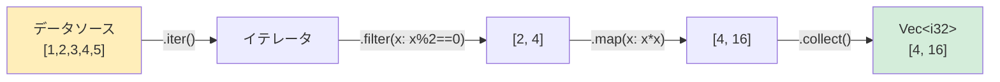

## Rustのクロージャ vs Pythonのラムダ

> **学習内容:** 複数行の処理が可能なクロージャ（単一式のみのlambdaとの比較）、`Fn`/`FnMut`/`FnOnce` のキャプチャセマンティクス、内包表記とイテレータチェインの対比、`map`/`filter`/`fold`、および `macro_rules!` の基礎
>
> **難易度:** 🟡 中級

### Pythonのクロージャとラムダ
```python
# Python — ラムダは単一式のみの無名関数
double = lambda x: x * 2
result = double(5)  # 10

# 完全なクロージャは外側のスコープから変数をキャプチャする:
def make_adder(n):
    def adder(x):
        return x + n    # 外側スコープの `n` をキャプチャ
    return adder

add_5 = make_adder(5)
print(add_5(10))  # 15

# 高階関数:
numbers = [1, 2, 3, 4, 5]
doubled = list(map(lambda x: x * 2, numbers))
evens = list(filter(lambda x: x % 2 == 0, numbers))
```

### Rustのクロージャ
```rust
// Rust — クロージャは |引数| 本体 の構文を使用する
let double = |x: i32| x * 2;
let result = double(5);  // 10

// クロージャは外側のスコープから変数をキャプチャする:
fn make_adder(n: i32) -> impl Fn(i32) -> i32 {
    move |x| x + n    // `move` により `n` の所有権がクロージャ内に移動する
}

let add_5 = make_adder(5);
println!("{}", add_5(10));  // 15

// イテレータと組み合わせた高階関数:
let numbers = vec![1, 2, 3, 4, 5];
let doubled: Vec<i32> = numbers.iter().map(|x| x * 2).collect();
let evens: Vec<i32> = numbers.iter().filter(|&&x| x % 2 == 0).copied().collect();
```

### クロージャの構文比較
```text
Python:                              Rust:
─────────                            ─────
lambda x: x * 2                      |x| x * 2
lambda x, y: x + y                   |x, y| x + y
lambda: 42                           || 42

# 複数行の記述
def f(x):                            |x| {
    y = x * 2                            let y = x * 2;
    return y + 1                         y + 1
                                     }
```

### クロージャのキャプチャ — Rustとの違い
```python
# Python — クロージャは参照によって変数をキャプチャする（遅延束縛/レイトバインディング！）
funcs = [lambda: i for i in range(3)]
print([f() for f in funcs])  # [2, 2, 2] — 驚き！すべてが同じ `i` を参照してしまう

# デフォルト引数ハックによる修正:
funcs = [lambda i=i: i for i in range(3)]
print([f() for f in funcs])  # [0, 1, 2]
```

```rust
// Rust — クロージャは正しくキャプチャを行う（遅延束縛の罠がない）
let funcs: Vec<Box<dyn Fn() -> i32>> = (0..3)
    .map(|i| Box::new(move || i) as Box<dyn Fn() -> i32>)
    .collect();

let results: Vec<i32> = funcs.iter().map(|f| f()).collect();
println!("{:?}", results);  // [0, 1, 2] — 意図通り！

// `move` は各クロージャに対して `i` のコピーをキャプチャするため、遅延束縛の問題は発生しません。
```

### 3つのクロージャトレイト
```rust
// Rustのクロージャは以下のトレイトの1つ以上を実装します:

// Fn — 複数回呼び出し可能で、キャプチャした変数を変更しない（最も一般的）
fn apply(f: impl Fn(i32) -> i32, x: i32) -> i32 { f(x) }

// FnMut — 複数回呼び出し可能で、キャプチャした変数を変更「できる」
fn apply_mut(mut f: impl FnMut(i32) -> i32, x: i32) -> i32 { f(x) }

// FnOnce — 1度だけしか呼び出せない（キャプチャした値を消費する）
fn apply_once(f: impl FnOnce() -> String) -> String { f() }

// Pythonには該当する区別がなく、クロージャは常にFnのように振る舞います。
// Rustでは、どのトレイトを実装するかをコンパイラが自動的に判断します。
```

***

## イテレータ vs ジェネレータ

### Pythonのジェネレータ
```python
# Python — yield を使ったジェネレータ
def fibonacci():
    a, b = 0, 1
    while True:
        yield a
        a, b = b, a + b

# 遅延評価 — 必要に応じて値がオンデマンドで計算される
fib = fibonacci()
first_10 = [next(fib) for _ in range(10)]

# ジェネレータ式 — 遅延評価されるリスト内包表記のようなもの
squares = (x ** 2 for x in range(1000000))  # メモリを即座に消費しない
first_5 = [next(squares) for _ in range(5)]
```

### Rustのイテレータ
```rust
// Rust — Iterator トレイト（同様の概念だが構文が異なる）
struct Fibonacci {
    a: u64,
    b: u64,
}

impl Fibonacci {
    fn new() -> Self {
        Fibonacci { a: 0, b: 1 }
    }
}

impl Iterator for Fibonacci {
    type Item = u64;

    fn next(&mut self) -> Option<Self::Item> {
        let current = self.a;
        self.a = self.b;
        self.b = current + self.b;
        Some(current)
    }
}

// 遅延評価 — Pythonのジェネレータと同様に、必要に応じて値が計算される
let first_10: Vec<u64> = Fibonacci::new().take(10).collect();

// イテレータチェイン — ジェネレータ式に相当
let squares: Vec<u64> = (0..1_000_000u64).map(|x| x * x).take(5).collect();
```

***

## 内包表記 vs イテレータチェイン

このセクションでは、Pythonの内包表記の構文をRustのイテレータチェインに対応づけて説明します。

### リスト内包表記 → map/filter/collect
```python
# Pythonの内包表記:
squares = [x ** 2 for x in range(10)]
evens = [x for x in range(20) if x % 2 == 0]
names = [user.name for user in users if user.active]
pairs = [(x, y) for x in range(3) for y in range(3)]
flat = [item for sublist in nested for item in sublist]
```



> **重要ポイント**: Rustのイテレータは遅延評価です。`.collect()` を呼ぶまで何も実行されません。Pythonのジェネレータも同様に動作しますが、リスト内包表記は即時評価（先行評価）されます。

```rust
// Rustのイテレータチェイン:
let squares: Vec<i32> = (0..10).map(|x| x * x).collect();
let evens: Vec<i32> = (0..20).filter(|x| x % 2 == 0).collect();
let names: Vec<&str> = users.iter()
    .filter(|u| u.active)
    .map(|u| u.name.as_str())
    .collect();
let pairs: Vec<(i32, i32)> = (0..3)
    .flat_map(|x| (0..3).map(move |y| (x, y)))
    .collect();
let flat: Vec<i32> = nested.iter()
    .flat_map(|sublist| sublist.iter().copied())
    .collect();
```

### 辞書内包表記 → HashMap への collect
```python
# Python
word_lengths = {word: len(word) for word in words}
inverted = {v: k for k, v in mapping.items()}
```

```rust
// Rust
let word_lengths: HashMap<&str, usize> = words.iter()
    .map(|w| (*w, w.len()))
    .collect();
let inverted: HashMap<&V, &K> = mapping.iter()
    .map(|(k, v)| (v, k))
    .collect();
```

### 集合内包表記 → HashSet への collect
```python
# Python
unique_lengths = {len(word) for word in words}
```

```rust
// Rust
let unique_lengths: HashSet<usize> = words.iter()
    .map(|w| w.len())
    .collect();
```

### 主なイテレータメソッド

| Python | Rust | 備考 |
|--------|------|-------|
| `map(f, iter)` | `.map(f)` | 各要素を変換する |
| `filter(f, iter)` | `.filter(f)` | 条件に一致する要素を残す |
| `sum(iter)` | `.sum()` | すべての要素の合計を求める |
| `min(iter)` / `max(iter)` | `.min()` / `.max()` | `Option` を返す |
| `any(f(x) for x in iter)` | `.any(f)` | いずれかが真なら true |
| `all(f(x) for x in iter)` | `.all(f)` | すべてが真なら true |
| `enumerate(iter)` | `.enumerate()` | インデックスと要素のペアを生成 |
| `zip(a, b)` | `a.zip(b)` | 2つの要素をペア化 |
| `len(list)` | `.count()`（消費する！）または `.len()` | 要素数を数える |
| `list(reversed(x))` | `.rev()` | 逆順で走査 |
| `itertools.chain(a, b)` | `a.chain(b)` | イテレータを連結 |
| `next(iter)` | `.next()` | 次の要素を取得 |
| `next(iter, default)` | `.next().unwrap_or(default)` | デフォルト値付き取得 |
| `list(iter)` | `.collect::<Vec<_>>()` | コレクションとして実体化 |
| `sorted(iter)` | collect 後に `.sort()` | 遅延ソートイテレータはない |
| `functools.reduce(f, iter)` | `.fold(init, f)` または `.reduce(f)` | 畳み込み・累積 |

### 主な相違点
```text
Pythonのイテレータ:                   Rustのイテレータ:
─────────────────                     ──────────────
- デフォルトで遅延評価（ジェネレータ）   - デフォルトで遅延評価（すべてのイテレータチェイン）
- yield でジェネレータを作成            - impl Iterator { fn next() }
- 終了時は StopIteration              - 終了時は None
- 1度だけ消費可能                     - 1度だけ消費可能
- 型安全性なし                        - 完全な型安全性
- やや低速（インタプリタ実行）           - ゼロコスト（最適化されコンパイル消去）
```

***


<!-- ch12a: Macros -->
## Rustにマクロが存在する理由

Pythonにはマクロシステムがありません。メタプログラミングにはデコレータ、メタクラス、および実行時のリフレクション（イントロスペクション）を使用します。Rustはコンパイル時のコード生成のためにマクロを使用します。

### Pythonのメタプログラミング vs Rustのマクロ
```python
# Python — メタプログラミングのためのデコレータとメタクラス
from dataclasses import dataclass
from functools import wraps

@dataclass              # インポート時に __init__, __repr__, __eq__ を生成
class Point:
    x: float
    y: float

# カスタムデコレータ
def log_calls(func):
    @wraps(func)
    def wrapper(*args, **kwargs):
        print(f"Calling {func.__name__}")
        return func(*args, **kwargs)
    return wrapper

@log_calls
def process(data):
    return data.upper()
```

```rust
// Rust — コード生成のための derive マクロおよび宣言的マクロ
#[derive(Debug, Clone, PartialEq)]  // コンパイル時に Debug, Clone, PartialEq の実装を生成
struct Point {
    x: f64,
    y: f64,
}

// 宣言的マクロ（テンプレートのようなもの）
macro_rules! log_call {
    ($func_name:expr, $body:expr) => {
        {
            println!("Calling {}", $func_name);
            $body
        }
    };
}

fn process(data: &str) -> String {
    log_call!("process", data.to_uppercase())
}
```

### よく使われる組み込みマクロ
```rust
// これらのマクロはRustのいたるところで使われています:

println!("Hello, {}!", name);           // フォーマット付き標準出力
format!("Value: {}", x);               // フォーマットされた String の生成
vec![1, 2, 3];                          // Vec の生成
assert_eq!(2 + 2, 4);                  // テストのアサーション
assert!(value > 0, "must be positive"); // 条件式のアサーション
dbg!(expression);                       // デバッグ出力: 式とその値を表示
todo!();                                // プレースホルダー — コンパイルは通るが到達するとパニック
unimplemented!();                       // 未実装コードのマーカー
panic!("something went wrong");         // メッセージ付きクラッシュ（raise RuntimeError に相当）

// なぜ関数ではなくマクロなのか？
// - println! は可変長引数を受け取れる（通常のRust関数は不可）
// - vec! は任意の型と要素数に対してコードを生成できる
// - assert_eq! は比較対象となった式のソースコードテキストを認識できる
// - dbg! は実行箇所のファイル名と行番号を把握できる
```

## `macro_rules!` を用いたシンプルなマクロの作成
```rust
// Pythonの dict() に相当するマクロ
// Python: d = dict(a=1, b=2)
// Rust:   let d = hashmap!{ "a" => 1, "b" => 2 };

macro_rules! hashmap {
    ($($key:expr => $value:expr),* $(,)?) => {
        {
            let mut map = std::collections::HashMap::new();
            $(map.insert($key, $value);)*
            map
        }
    };
}

let scores = hashmap! {
    "Alice" => 100,
    "Bob" => 85,
    "Charlie" => 90,
};
```

## Derive マクロ — トレイトの自動実装
```rust
// #[derive(...)] は Pythonの @dataclass デコレータのRust版です

// Python:
// @dataclass(frozen=True, order=True)
// class Student:
//     name: str
//     grade: int

// Rust:
#[derive(Debug, Clone, PartialEq, Eq, PartialOrd, Ord, Hash)]
struct Student {
    name: String,
    grade: i32,
}

// 主な derive マクロ:
// Debug         → {:?} フォーマット（__repr__ に相当）
// Clone         → .clone() によるディープコピー
// Copy          → 暗黙のビットコピー（単純な型のみ）
// PartialEq, Eq → == による等価比較（__eq__ に相当）
// PartialOrd, Ord → <, >, ソート（__lt__ などに相当）
// Hash          → HashMap のキーとして利用可能（__hash__ に相当）
// Default       → MyType::default()（引数なしの __init__ に相当）

// クレートが提供する一般的な derive マクロ:
// Serialize, Deserialize (serde) → JSON/YAML/TOML へのシリアライズ/デシリアライズ
//                                  （Pythonの json.dumps/loads に相当するが型安全）
```

### Pythonのデコレータ vs RustのDerive

| Python デコレータ | Rust Derive | 用途 |
|-----------------|-------------|---------|
| `@dataclass` | `#[derive(Debug, Clone, PartialEq)]` | データクラスの作成 |
| `@dataclass(frozen=True)` | デフォルトで不変 | 不変性 |
| `@dataclass(order=True)` | `#[derive(Ord, PartialOrd)]` | 比較・順序付け |
| `@total_ordering` | `#[derive(PartialOrd, Ord)]` | 完全な順序関係 |
| JSON `json.dumps(obj.__dict__)` | `#[derive(Serialize)]` | シリアライズ |
| JSON `MyClass(**json.loads(s))` | `#[derive(Deserialize)]` | デシリアライズ |

---

## 演習問題

<details>
<summary><strong>🏋️ 演習: Derive とカスタム Debug の実装</strong> (クリックして展開)</summary>

**課題**: フィールド `name: String`、`email: String`、`password_hash: String` を持つ `User` 構造体を作成してください。`Clone` と `PartialEq` を derive し、`Debug` は手動で実装して、名前とメールアドレスは表示しつつ、パスワードは伏字（`"***"`）で出力するようにしてください。

<details>
<summary>🔑 解答例</summary>

```rust
use std::fmt;

#[derive(Clone, PartialEq)]
struct User {
    name: String,
    email: String,
    password_hash: String,
}

impl fmt::Debug for User {
    fn fmt(&self, f: &mut fmt::Formatter<'_>) -> fmt::Result {
        f.debug_struct("User")
            .field("name", &self.name)
            .field("email", &self.email)
            .field("password_hash", &"***")
            .finish()
        }
}

fn main() {
    let user = User {
        name: "Alice".into(),
        email: "alice@example.com".into(),
        password_hash: "a1b2c3d4e5f6".into(),
    };
    println!("{user:?}");
    // 出力: User { name: "Alice", email: "alice@example.com", password_hash: "***" }
}
```

**重要ポイント**: Pythonの `__repr__` とは異なり、Rustでは `Debug` を自動導出（derive）できますが、機密情報が含まれるフィールドに対しては手動でオーバーライドできます。これにより、Pythonのように `print(user)` で誤って機密情報が漏洩してしまうリスクを防ぐことができます。

</details>
</details>

***
