## GILなし：真の並列処理

> **学ぶこと:** なぜGILがPythonの並行処理を制限するのか、コンパイル時スレッド安全性を保証するRustの `Send`/`Sync` トレイト、
> `Arc<Mutex<T>>` とPythonの `threading.Lock` の比較、チャネルと `queue.Queue` の比較、そしてasync/awaitの違いについて学びます。
>
> **難易度:** 🔴 上級

GIL（グローバルインタプリタロック）は、CPUバウンドなタスクにおけるPythonの最大の制約です。
RustにはGILがありません。スレッドは真に並列に実行され、型システムがデータ競合をコンパイル時に防止します。

```mermaid
gantt
    title CPUバウンドなタスク：Python GIL vs Rustスレッド
    dateFormat X
    axisFormat %s
    section Python (GIL)
        スレッド 1 :a1, 0, 4
        スレッド 2 :a2, 4, 8
        スレッド 3 :a3, 8, 12
        スレッド 4 :a4, 12, 16
    section Rust (GILなし)
        スレッド 1 :b1, 0, 4
        スレッド 2 :b2, 0, 4
        スレッド 3 :b3, 0, 4
        スレッド 4 :b4, 0, 4
```



> **重要な洞察**: PythonのスレッドはCPUバウンドなタスクでは逐次的に実行されます（GILがシリアライズするため）。Rustのスレッドは真に並列に実行されます（4スレッド = 約4倍の高速化）。
>
> 📌 **前提知識**: この章に取り組む前に、[第7章 — 所有権と借用](ch07-ownership-and-borrowing.md) を十分に理解していることを確認してください。`Arc`、`Mutex`、およびmoveクロージャはすべて所有権の概念に基づいています。

### PythonにおけるGILの問題点
```python
# Python — スレッドはCPUバウンドなタスクには役立たない
import threading
import time

counter = 0

def increment(n):
    global counter
    for _ in range(n):
        counter += 1  # スレッドセーフではありません！ただしGILが単純な操作を「保護」します

threads = [threading.Thread(target=increment, args=(1_000_000,)) for _ in range(4)]
start = time.perf_counter()
for t in threads:
    t.start()
for t in threads:
    t.join()
elapsed = time.perf_counter() - start

print(f"Counter: {counter}")    # 4,000,000 にならない場合があります！
print(f"Time: {elapsed:.2f}s")  # シングルスレッドとほぼ同じ時間（GILのため）

# 真の並列処理を実現するには、Pythonではmultiprocessingが必要です:
from multiprocessing import Pool
with Pool(4) as pool:
    results = pool.map(cpu_work, data)  # 個別のプロセス、pickleのオーバーヘッド
```

### Rust — 真の並列処理とコンパイル時の安全性
```rust
use std::sync::atomic::{AtomicI64, Ordering};
use std::sync::Arc;
use std::thread;

fn main() {
    let counter = Arc::new(AtomicI64::new(0));

    let handles: Vec<_> = (0..4).map(|_| {
        let counter = Arc::clone(&counter);
        thread::spawn(move || {
            for _ in 0..1_000_000 {
                counter.fetch_add(1, Ordering::Relaxed);
            }
        })
    }).collect();

    for h in handles {
        h.join().unwrap();
    }

    println!("Counter: {}", counter.load(Ordering::Relaxed)); // 常に 4,000,000
    // すべてのコアで実行 — 真の並列処理、GILなし
}
```

***

## スレッド安全性：型システムによる保証

### Python — 実行時エラー
```python
# Python — データ競合は実行時に検出される（あるいはまったく検出されない）
import threading

shared_list = []

def append_items(items):
    for item in items:
        shared_list.append(item)  # appendに関してはGILのおかげで「スレッドセーフ」
        # しかし、複雑な操作は安全ではありません:
        # if item not in shared_list:
        #     shared_list.append(item)  # レースコンディション（競合状態）！

# 安全のためにLockを使用する:
lock = threading.Lock()
def safe_append(items):
    for item in items:
        with lock:
            if item not in shared_list:
                shared_list.append(item)
# ロックを忘れたら？コンパイラの警告はありません。本番環境でバグが発覚します。
```

### Rust — コンパイル時エラー
```rust
use std::sync::{Arc, Mutex};
use std::thread;

fn main() {
    // 保護なしでスレッド間でVecを共有しようとする例:
    // let shared = vec![];
    // thread::spawn(move || shared.push(1));
    // ❌ コンパイルエラー: Vecは保護なしではSend/Syncではありません

    // Mutexを使用（Pythonのthreading.Lockに相当）:
    let shared = Arc::new(Mutex::new(Vec::new()));

    let handles: Vec<_> = (0..4).map(|i| {
        let shared = Arc::clone(&shared);
        thread::spawn(move || {
            let mut data = shared.lock().unwrap(); // アクセスにはロックの取得が必須
            data.push(i);
            // `data` がスコープを抜けると自動的にロックが解放される
            // 「アンロック忘れ」は発生しない — RAIIがそれを保証
        })
    }).collect();

    for h in handles {
        h.join().unwrap();
    }

    println!("{:?}", shared.lock().unwrap()); // [0, 1, 2, 3] (順序は異なる場合があります)
}
```

### Send トレイトと Sync トレイト
```rust
// Rustはスレッド安全性を強制するために2つのマーカートレイトを使用します:

// Send — 「この型は別のスレッドに転送できる」
// ほとんどの型はSendです。Rc<T>はSendではありません（スレッド間ではArc<T>を使用します）。

// Sync — 「この型は複数のスレッドから安全に参照できる」
// ほとんどの型はSyncです。Cell<T>/RefCell<T>はSyncではありません（Mutex<T>を使用します）。

// コンパイラはこれらを自動的にチェックします:
// thread::spawn(move || { ... })
//   ↑ クロージャがキャプチャする変数はSendである必要がある
//   ↑ 共有参照はSyncである必要がある
//   ↑ 満たしていない場合 → コンパイルエラー

// Pythonにはこれに相当するものがありません。スレッド安全性のバグは実行時に発見されます。
// Rustはそれらをコンパイル時に捕捉します。これが「恐れなき並行性（fearless concurrency）」です。
```

### 並行性プリミティブの比較

| Python | Rust | 用途 |
|--------|------|------|
| `threading.Lock()` | `Mutex<T>` | 相互排他（ミューテックス） |
| `threading.RLock()` | `Mutex<T>`（再帰不可） | 再帰ロック（異なる方法で使用） |
| `threading.RWLock`（なし） | `RwLock<T>` | 複数のリーダーまたは単一のライター |
| `threading.Event()` | `Condvar` | 条件変数 |
| `queue.Queue()` | `mpsc::channel()` | スレッドセーフなチャネル |
| `multiprocessing.Pool` | `rayon::ThreadPool` | スレッドプール |
| `concurrent.futures` | `rayon` / `tokio::spawn` | タスクベースの並列処理 |
| `threading.local()` | `thread_local!` | スレッドローカルストレージ |
| なし | `Atomic*` 型 | ロックフリーなカウンタおよびフラグ |

### Mutexのポイズニング（Poisoning）

スレッドが `Mutex` を保持したまま**パニック**を起こすと、そのロックは *ポイズン状態（poisoned: 毒された状態）* になります。Pythonにはこれに相当する機能はありません。スレッドが `threading.Lock()` を保持したままクラッシュした場合、ロックは解放されずに停滞したままになります。

```rust
use std::sync::{Arc, Mutex};
use std::thread;

let data = Arc::new(Mutex::new(vec![1, 2, 3]));
let data2 = Arc::clone(&data);

let _ = thread::spawn(move || {
    let mut guard = data2.lock().unwrap();
    guard.push(4);
    panic!("oops!");  // ロックはポイズン状態になる
}).join();

// その後のロック取得の試みは Err(PoisonError) を返す
match data.lock() {
    Ok(guard) => println!("データ: {guard:?}"),
    Err(poisoned) => {
        println!("ロックがポイズン状態でした！回復を試みます...");
        let guard = poisoned.into_inner();
        println!("回復成功: {guard:?}");  // [1, 2, 3, 4]
    }
}
```

### アトミック操作のメモリ順序（簡単な補足）

アトミック操作の `Ordering` パラメータは、メモリの可視性に関する保証を制御します:

| Ordering | 使用するタイミング |
|----------|-------------------|
| `Relaxed` | 順序付けが問題にならない単純なカウンタ |
| `Acquire`/`Release` | プロデューサ・コンシューマ：書き込み側は `Release`、読み取り側は `Acquire` を使用 |
| `SeqCst` | 迷った場合に使用 — 最も厳格な順序付けであり、最も直感的 |

Pythonの `threading` モジュールはこれらの詳細をGILの背後に隠しています。Rustでは明示的に選択します。プロファイリングによってより緩い順序付けが必要であることが判明するまでは、`SeqCst` を使用してください。

***

## async/await の比較

PythonとRustはどちらも `async`/`await` 構文を持っていますが、内部的な仕組みは大きく異なります。

### Pythonの async/await
```python
# Python — 並行I/Oのためのasyncio
import asyncio
import aiohttp

async def fetch_url(session, url):
    async with session.get(url) as resp:
        return await resp.text()

async def main():
    urls = ["https://example.com", "https://httpbin.org/get"]

    async with aiohttp.ClientSession() as session:
        tasks = [fetch_url(session, url) for url in urls]
        results = await asyncio.gather(*tasks)

    for url, result in zip(urls, results):
        print(f"{url}: {len(result)} bytes")

asyncio.run(main())

# Pythonのasyncはシングルスレッドです（依然としてGILの影響を受けます）！
# I/Oバウンドなタスク（ネットワークやディスクの待機）にのみ役立ちます。
# async内でCPUバウンドな処理を実行すると、イベントループがブロックされます。
```

### Rustの async/await
```rust
// Rust — 並行I/O（およびCPU並列処理！）のためのtokio
use reqwest;
use tokio;
use futures::future::join_all;  // Cargo.toml に `futures` を追加

async fn fetch_url(url: &str) -> Result<String, reqwest::Error> {
    reqwest::get(url).await?.text().await
}

#[tokio::main]
async fn main() -> Result<(), Box<dyn std::error::Error>> {
    let urls = vec!["https://example.com", "https://httpbin.org/get"];

    let tasks: Vec<_> = urls.iter()
        .map(|url| tokio::spawn(fetch_url(url)))  // GILの制限なし
        .collect();                                 // すべてのCPUコアを利用可能

    let results = futures::future::join_all(tasks).await;

    for (url, result) in urls.iter().zip(results) {
        match result {
            Ok(Ok(body)) => println!("{url}: {} バイト", body.len()),
            Ok(Err(e)) => println!("{url}: エラー {e}"),
            Err(e) => println!("{url}: タスク失敗 {e}"),
        }
    }

    Ok(())
}
```

### 主な相違点

| 項目 | Python asyncio | Rust tokio |
|------|---------------|------------|
| GIL | 依然として適用される | GILなし |
| CPU並列処理 | ❌ シングルスレッド | ✅ マルチスレッド |
| ランタイム | 組み込み（asyncio） | 外部クレート（tokio） |
| エコシステム | aiohttp, asyncpg など | reqwest, sqlx など |
| パフォーマンス | I/Oに適している | I/OおよびCPUの両方で極めて高速 |
| エラー処理 | 例外（Exceptions） | `Result<T, E>` |
| キャンセル | `task.cancel()` | Futureのドロップ（Drop） |
| 関数の色問題（Color problem） | 同期 ↔ 非同期の境界 | 同様の問題が存在 |

### Rayonによる手軽な並列処理
```python
# Python — CPU並列処理のためのmultiprocessing
from multiprocessing import Pool

def process_item(item):
    return heavy_computation(item)

with Pool(8) as pool:
    results = pool.map(process_item, items)
```

```rust
// Rust — 手軽なCPU並列処理のためのrayon（1行変更するだけ！）
use rayon::prelude::*;

// 順次処理（Sequential）:
let results: Vec<_> = items.iter().map(|item| heavy_computation(item)).collect();

// 並列処理（.iter() を .par_iter() に変更するだけ！）:
let results: Vec<_> = items.par_iter().map(|item| heavy_computation(item)).collect();

// pickleなし、プロセス生成のオーバーヘッドなし、シリアライズなし。
// Rayonが自動的に各コアへ作業を分散します。
```

---

## 💼 ケーススタディ：並列画像処理パイプライン

あるデータサイエンスチームは、毎晩5万枚の衛星画像を処理しています。彼らのPythonパイプラインでは `multiprocessing.Pool` を使用していました:

```python
# Python — CPUバウンドな画像処理のためのmultiprocessing
import multiprocessing
from PIL import Image
import numpy as np

def process_image(path: str) -> dict:
    img = np.array(Image.open(path))
    # CPUヘビーな処理: ヒストグラム平坦化、エッジ検出、分類
    histogram = np.histogram(img, bins=256)[0]
    edges = detect_edges(img)       # 1画像あたり約200ms
    label = classify(edges)          # 1画像あたり約100ms
    return {"path": path, "label": label, "edge_count": len(edges)}

# 問題点: 各サブプロセスがPythonインタプリタ全体をコピーする
# メモリ: ワーカーあたり50MB × 16ワーカー = 800MBのオーバーヘッド
# 起動時間: forkと引数のpickle化に2〜3秒
with multiprocessing.Pool(16) as pool:
    results = pool.map(process_image, image_paths)  # 5万枚の画像で約4.5時間
```

**問題点**: forkによる800MBのメモリオーバーヘッド、引数と結果のpickleシリアライズ、スレッドの使用を阻むGIL、不透明なエラー処理（ワーカースレッド内の例外はデバッグが困難）。

```rust
use rayon::prelude::*;
use image::GenericImageView;

struct ImageResult {
    path: String,
    label: String,
    edge_count: usize,
}

fn process_image(path: &str) -> Result<ImageResult, image::ImageError> {
    let img = image::open(path)?;
    // アプリケーション固有の関数（ユースケースに合わせて実装）
    let histogram = compute_histogram(&img);       // 約50ms (numpyのオーバーヘッドなし)
    let edges = detect_edges(&img);                // 約40ms (SIMD最適化)
    let label = classify(&edges);                  // 約20ms
    Ok(ImageResult {
        path: path.to_string(),
        label,
        edge_count: edges.len(),
    })
}

fn main() -> Result<(), Box<dyn std::error::Error>> {
    let paths: Vec<String> = load_image_paths()?;

    // Rayonは自動的にすべてのCPUコアを使用 — forkなし、pickleなし、GILなし
    let results: Vec<ImageResult> = paths
        .par_iter()                                // 並列イテレータ
        .filter_map(|p| process_image(p).ok())     // エラーを適切にスキップ
        .collect();                                // 並列に収集

    println!("処理済み画像数: {} 枚", results.len());
    Ok(())
}
// 5万枚の画像を約35分で処理（Pythonの4.5時間に対して）
// メモリ: 合計約50MB（スレッド間で共有、forkなし）
```

**結果**:
| 指標 | Python (multiprocessing) | Rust (rayon) |
|------|------------------------|--------------|
| 処理時間（5万画像） | 約4.5時間 | 約35分 |
| メモリオーバーヘッド | 800MB（16ワーカー） | 約50MB（共有） |
| エラー処理 | 不透明なpickleエラー | 各ステップでの `Result<T, E>` |
| 起動コスト | 2〜3秒（fork + pickle） | なし（スレッド） |

> **重要な教訓**: CPUバウンドな並列処理において、RustのスレッドとRayonは、シリアライズのオーバーヘッドゼロ、メモリ共有、そしてコンパイル時の安全性を備えてPythonの `multiprocessing` を置き換えることができます。

---

## 演習問題

<details>
<summary><strong>🏋️ 演習問題：スレッドセーフなカウンタ</strong> (クリックして展開)</summary>

**課題**: Pythonでは、共有カウンタを保護するために `threading.Lock` を使用することがあります。これをRustに移植してみましょう：10個のスレッドを起動し、それぞれが共有カウンタを1,000回インクリメントします。最終的な値（10,000になるはずです）を出力してください。`Arc<Mutex<u64>>` を使用します。

<details>
<summary>🔑 解答例</summary>

```rust
use std::sync::{Arc, Mutex};
use std::thread;

fn main() {
    let counter = Arc::new(Mutex::new(0u64));
    let mut handles = vec![];

    for _ in 0..10 {
        let counter = Arc::clone(&counter);
        handles.push(thread::spawn(move || {
            for _ in 0..1000 {
                let mut num = counter.lock().unwrap();
                *num += 1;
            }
        }));
    }

    for handle in handles {
        handle.join().unwrap();
    }

    println!("最終カウント: {}", *counter.lock().unwrap());
}
```

**重要なポイント**: `Arc<Mutex<T>>` は、Pythonの `lock = threading.Lock()` + 共有変数に相当するRustの手段です。ただし、Rustでは `Arc` や `Mutex` を忘れると*コンパイルが通りません*。一方Pythonは、競合の可能性があるプログラムを何食わぬ顔で実行し、暗黙のうちに誤った結果を返します。

</details>
</details>

***
