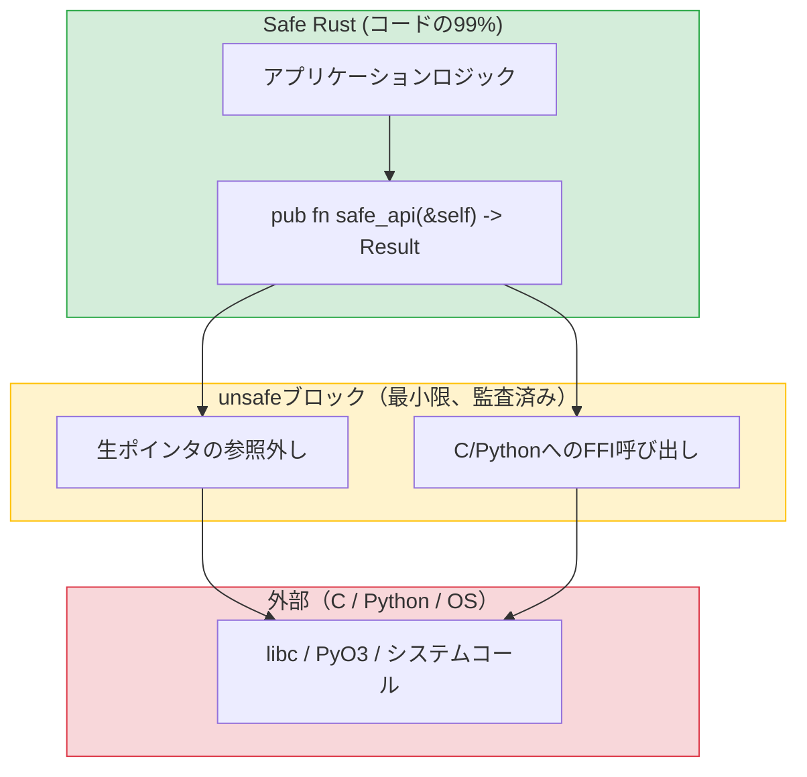

## Unsafeを使う理由とタイミング

> **学ぶこと:** `unsafe` が許可することとその存在理由、PyO3を使用したPython拡張機能の作成（Python開発者にとってのキラー機能）、
> pytestと比較したRustのテストフレームワーク、mockallによるモック、ベンチマークについて学びます。
>
> **難易度:** 🔴 上級

Rustの `unsafe` はエスケープハッチ（非常口）です。コンパイラに対して「あなたが検証できない操作を行いますが、正しいことは私が保証します」と伝えます。Pythonはメモリへの直接アクセスを決して許可しないため、これに相当するものはありません。



> **設計パターン**: 安全なAPIが小さな `unsafe` ブロックをラップします。呼び出し側が `unsafe` を意識することはありません。Pythonの `ctypes` にはこのような境界がなく、すべてのFFI呼び出しが暗黙的に安全ではありません（unsafe）。
>
> 📌 **関連情報**: [第13章 — 並行性](ch13-concurrency.md) では、コンパイラがスレッド安全性をチェックする `unsafe` な自動トレイトである `Send`/`Sync` トレイトを扱っています。

### unsafeが許可すること
```rust
// unsafeを使用すると、Safe Rustでは禁止されている「5つの操作」が可能になります:
// 1. 生ポインタの参照外し
// 2. unsafeな関数やメソッドの呼び出し
// 3. 可変な静的変数へのアクセスまたは変更
// 4. unsafeなトレイトの実装
// 5. 共用体（union）のフィールドへのアクセス

// 例: C言語の関数の呼び出し
extern "C" {
    fn abs(input: i32) -> i32;
}

fn main() {
    // SAFETY: abs() はC標準ライブラリの明確に定義された関数です。
    let result = unsafe { abs(-42) };  // Safe RustはCコードを検証できない
    println!("{result}");               // 42
}
```

### unsafeを使うタイミング
```rust
// 1. FFI — C言語ライブラリの呼び出し（最も一般的な理由）
// 2. パフォーマンスが極めて重要な内部ループ（稀）
// 3. ボローチェッカでは表現できないデータ構造（稀）

// Python開発者として、unsafeに遭遇するのは主に以下の場面です:
// - PyO3の内部実装（Python ↔ Rust間のブリッジ）
// - C言語ライブラリのバインディング
// - 低レベルのシステムコール

// 目安となる原則: ライブラリコードではなくアプリケーションコードを書いている場合、
// unsafeが必要になることはほぼありません。もし必要だと感じたら、
// まずRustコミュニティに相談してみてください。通常は安全な代替手段が存在します。
```

***

## PyO3：PythonのためのRust拡張機能

PyO3はPythonとRustをつなぐ架け橋です。Pythonから呼び出し可能なRustの関数やクラスを作成できるため、処理速度のボトルネックとなっているPythonコードを置き換えるのに最適です。

### RustでPython拡張機能を作成する
```bash
# セットアップ
pip install maturin    # Rust製Python拡張機能のビルドツール
maturin init           # プロジェクト構成の作成

# プロジェクト構成:
# my_extension/
# ├── Cargo.toml
# ├── pyproject.toml
# └── src/
#     └── lib.rs
```

```toml
# Cargo.toml
[package]
name = "my_extension"
version = "0.1.0"
edition = "2021"

[lib]
crate-type = ["cdylib"]    # Python用の共有ライブラリ

[dependencies]
pyo3 = { version = "0.22", features = ["extension-module"] }
```

```rust
// src/lib.rs — Pythonから呼び出し可能なRust関数
use pyo3::prelude::*;

/// Rustで記述された高速なフィボナッチ関数。
#[pyfunction]
fn fibonacci(n: u64) -> u64 {
    let (mut a, mut b) = (0u64, 1u64);
    for _ in 0..n {
        let temp = b;
        b = a.wrapping_add(b);
        a = temp;
    }
    a
}

/// n までのすべての素数を探索（エラトステネスの篩）。
#[pyfunction]
fn primes_up_to(n: usize) -> Vec<usize> {
    let mut is_prime = vec![true; n + 1];
    is_prime[0] = false;
    if n > 0 { is_prime[1] = false; }
    for i in 2..=((n as f64).sqrt() as usize) {
        if is_prime[i] {
            for j in (i * i..=n).step_by(i) {
                is_prime[j] = false;
            }
        }
    }
    (2..=n).filter(|&i| is_prime[i]).collect()
}

/// Pythonから利用可能なRustクラス。
#[pyclass]
struct Counter {
    value: i64,
}

#[pymethods]
impl Counter {
    #[new]
    fn new(start: i64) -> Self {
        Counter { value: start }
    }

    fn increment(&mut self) {
        self.value += 1;
    }

    fn get_value(&self) -> i64 {
        self.value
    }

    fn __repr__(&self) -> String {
        format!("Counter(value={})", self.value)
    }
}

/// Pythonモジュールの定義。
#[pymodule]
fn my_extension(m: &Bound<'_, PyModule>) -> PyResult<()> {
    m.add_function(wrap_pyfunction!(fibonacci, m)?)?;
    m.add_function(wrap_pyfunction!(primes_up_to, m)?)?;
    m.add_class::<Counter>()?;
    Ok(())
}
```

### Pythonからの使用
```bash
# ビルドとインストール:
maturin develop --release   # ビルドして現在の仮想環境にインストール
```

```python
# Python — 通常のPythonモジュールと同様にRust拡張機能を使用
import my_extension

# Rust関数の呼び出し
result = my_extension.fibonacci(50)
print(result)  # 12586269025 — マイクロ秒単位で計算完了

# Rustクラスの使用
counter = my_extension.Counter(0)
counter.increment()
counter.increment()
print(counter.get_value())  # 2
print(counter)              # Counter(value=2)

# パフォーマンス比較:
import time

# Python版
def py_primes(n):
    sieve = [True] * (n + 1)
    for i in range(2, int(n**0.5) + 1):
        if sieve[i]:
            for j in range(i*i, n+1, i):
                sieve[j] = False
    return [i for i in range(2, n+1) if sieve[i]]

start = time.perf_counter()
py_result = py_primes(10_000_000)
py_time = time.perf_counter() - start

start = time.perf_counter()
rs_result = my_extension.primes_up_to(10_000_000)
rs_time = time.perf_counter() - start

print(f"Python: {py_time:.3f}s")    # 約3.5秒
print(f"Rust:   {rs_time:.3f}s")    # 約0.05秒 — 70倍高速！
print(f"Same results: {py_result == rs_result}")  # True
```

### PyO3 クイックリファレンス

| Pythonの概念 | PyO3アトリビュート | 補足 |
|-------------|-------------------|------|
| 関数 | `#[pyfunction]` | Pythonへ公開 |
| クラス | `#[pyclass]` | Pythonから可視のクラス |
| メソッド | `#[pymethods]` | pyclassのメソッドブロック |
| `__init__` | `#[new]` | コンストラクタ |
| `__repr__` | `fn __repr__()` | 文字列表現 |
| `__str__` | `fn __str__()` | 表示用文字列 |
| `__len__` | `fn __len__()` | 長さ |
| `__getitem__` | `fn __getitem__()` | インデックスアクセス |
| プロパティ | `#[getter]` / `#[setter]` | 属性アクセス |
| 静的メソッド | `#[staticmethod]` | selfを受け取らない |
| クラスメソッド | `#[classmethod]` | clsを受け取る |

### FFIの安全性パターン

RustをPythonに公開する場合（PyO3または生のC FFI経由）、以下のルールを守ることで典型的なバグを防ぐことができます:

1. **パニックをFFI境界の外へ波及させない** — RustのパニックがPython（またはC）へと巻き戻る（unwind）ことは**未定義動作**になります。PyO3は `#[pyfunction]` においてこれを自動的に処理しますが、生の `extern "C"` 関数には明示的な保護が必要です:
    ```rust
    #[no_mangle]
    pub extern "C" fn raw_ffi_function() -> i32 {
        match std::panic::catch_unwind(|| {
            // 実際のロジック
            42
        }) {
            Ok(result) => result,
            Err(_) => -1,  // CやPythonにパニックを波及させる代わりにエラーコードを返す
        }
    }
    ```

2. **共有構造体には `#[repr(C)]` を付与する** — PythonやCが構造体のフィールドを直接読み取る場合は、C言語互換のメモリレイアウトを保証するために `#[repr(C)]` を使用する**必要があります**。不透明ポインタ（opaque pointer）を渡す場合（PyO3が `#[pyclass]` で行っている方法）は不要です。

3. **`extern "C"`** — 呼び出し規約をCやPythonが期待するものと一致させるために、生のFFI関数には必須です。PyO3の `#[pyfunction]` はこれを自動的に処理します。

> **PyO3のメリット**: PyO3は、パニックのキャッチ、型変換、GIL管理など、これら多くの安全性に関する考慮事項を自動でラップしてくれます。特別な理由がない限り、生のFFIよりもPyO3を優先して使用してください。

***


<!-- ch14a: Testing -->
## 単体テスト vs pytest

### pytestによるPythonのテスト
```python
# test_calculator.py
import pytest
from calculator import add, divide

def test_add():
    assert add(2, 3) == 5

def test_add_negative():
    assert add(-1, 1) == 0

def test_divide():
    assert divide(10, 2) == 5.0

def test_divide_by_zero():
    with pytest.raises(ZeroDivisionError):
        divide(1, 0)

# パラメータ化テスト
@pytest.mark.parametrize("a,b,expected", [
    (1, 2, 3),
    (0, 0, 0),
    (-1, -1, -2),
    (100, 200, 300),
])
def test_add_parametrized(a, b, expected):
    assert add(a, b) == expected

# フィクスチャ
@pytest.fixture
def sample_data():
    return [1, 2, 3, 4, 5]

def test_sum(sample_data):
    assert sum(sample_data) == 15
```

```bash
# テストの実行
pytest                      # すべてのテストを実行
pytest test_calculator.py   # 単一ファイルを実行
pytest -k "test_add"        # 一致するテストを実行
pytest -v                   # 詳細出力
pytest --tb=short           # トレースバックを短縮表示
```

### Rust組み込みのテスト機能
```rust
// src/calculator.rs — テストは同じファイル内に記述！
fn add(a: i32, b: i32) -> i32 {
    a + b
}

fn divide(a: f64, b: f64) -> Result<f64, String> {
    if b == 0.0 {
        Err("Division by zero".to_string())
    } else {
        Ok(a / b)
    }
}

// テストは #[cfg(test)] モジュール内に配置 — `cargo test` の実行時のみコンパイルされる
#[cfg(test)]
mod tests {
    use super::*;  // 親モジュールからすべてをインポート

    #[test]
    fn test_add() {
        assert_eq!(add(2, 3), 5);
    }

    #[test]
    fn test_add_negative() {
        assert_eq!(add(-1, 1), 0);
    }

    #[test]
    fn test_divide() {
        assert_eq!(divide(10.0, 2.0), Ok(5.0));
    }

    #[test]
    fn test_divide_by_zero() {
        assert!(divide(1.0, 0.0).is_err());
    }

    // パニックが発生することを検証（pytest.raisesに類似）
    #[test]
    #[should_panic(expected = "out of bounds")]
    fn test_out_of_bounds() {
        let v = vec![1, 2, 3];
        let _ = v[99];  // パニック発生
    }
}
```

```bash
# テストの実行
cargo test                         # すべてのテストを実行
cargo test test_add                # 一致するテストを実行
cargo test -- --nocapture          # println! の出力を表示
cargo test -p my_crate             # ワークスペース内の特定クレートをテスト
cargo test -- --test-threads=1     # 順次実行（副作用のあるテスト用）
```

### テストのクイックリファレンス

| pytest | Rust | 補足 |
|--------|------|------|
| `assert x == y` | `assert_eq!(x, y)` | 等値比較 |
| `assert x != y` | `assert_ne!(x, y)` | 不等比較 |
| `assert condition` | `assert!(condition)` | 真偽値 |
| `assert condition, "msg"` | `assert!(condition, "msg")` | メッセージ付き |
| `pytest.raises(E)` | `#[should_panic]` | パニックの期待 |
| `@pytest.fixture` | テスト内セットアップまたはヘルパー関数 | 組み込みフィクスチャ機能なし |
| `@pytest.mark.parametrize` | `rstest` クレート | パラメータ化テスト |
| `conftest.py` | `tests/common/mod.rs` | 共有テストヘルパー |
| `pytest.skip()` | `#[ignore]` | テストのスキップ |
| `tmp_path` フィクスチャ | `tempfile` クレート | 一時ディレクトリ |

***

## rstestによるパラメータ化テスト
```rust
// Cargo.toml: rstest = "0.23"

use rstest::rstest;

// @pytest.mark.parametrize と同等
#[rstest]
#[case(1, 2, 3)]
#[case(0, 0, 0)]
#[case(-1, -1, -2)]
#[case(100, 200, 300)]
fn test_add(#[case] a: i32, #[case] b: i32, #[case] expected: i32) {
    assert_eq!(add(a, b), expected);
}

// @pytest.fixture と同等
use rstest::fixture;

#[fixture]
fn sample_data() -> Vec<i32> {
    vec![1, 2, 3, 4, 5]
}

#[rstest]
fn test_sum(sample_data: Vec<i32>) {
    assert_eq!(sample_data.iter().sum::<i32>(), 15);
}
```

***

## mockallによるモック
```python
# Python — unittest.mockによるモック
from unittest.mock import Mock, patch

def test_fetch_user():
    mock_db = Mock()
    mock_db.get_user.return_value = {"name": "Alice"}

    result = fetch_user_name(mock_db, 1)
    assert result == "Alice"
    mock_db.get_user.assert_called_once_with(1)
```

```rust
// Rust — mockallクレートによるモック
// Cargo.toml: mockall = "0.13"

use mockall::{automock, predicate::*};

#[automock]                          // MockDatabase を自動生成
trait Database {
    fn get_user(&self, id: i64) -> Option<User>;
}

fn fetch_user_name(db: &dyn Database, id: i64) -> Option<String> {
    db.get_user(id).map(|u| u.name)
}

#[test]
fn test_fetch_user() {
    let mut mock = MockDatabase::new();
    mock.expect_get_user()
        .with(eq(1))                   // assert_called_with(1)
        .times(1)                      // assert_called_once
        .returning(|_| Some(User { name: "Alice".into() }));

    let result = fetch_user_name(&mock, 1);
    assert_eq!(result, Some("Alice".to_string()));
}
```

---

## 演習問題

<details>
<summary><strong>🏋️ 演習問題：Unsafeに対する安全なラッパー</strong> (クリックして展開)</summary>

**課題**: `&mut [i32]` を受け取り、中央で分割された2つの可変スライス `(&mut [i32], &mut [i32])` を返す安全な関数 `split_at_mid` を作成してください。内部では、生ポインタを用いた `unsafe` を使用します（`split_at_mut` が行っている処理の再現）。その後、それを安全なAPIでラップしてください。

<details>
<summary>🔑 解答例</summary>

```rust
fn split_at_mid(slice: &mut [i32]) -> (&mut [i32], &mut [i32]) {
    let mid = slice.len() / 2;
    let ptr = slice.as_mut_ptr();
    let len = slice.len();

    assert!(mid <= len); // unsafeに入る前の安全性チェック

    // SAFETY: mid <= len (上でアサート済み) であり、ptr は有効な &mut スライスから取得されているため、
    // 両方のサブスライスは範囲内にあり、メモリ上で重複していません。
    unsafe {
        (
            std::slice::from_raw_parts_mut(ptr, mid),
            std::slice::from_raw_parts_mut(ptr.add(mid), len - mid),
        )
    }
}

fn main() {
    let mut data = vec![1, 2, 3, 4, 5, 6];
    let (left, right) = split_at_mid(&mut data);
    left[0] = 99;
    right[0] = 88;
    println!("left: {left:?}, right: {right:?}");
    // left: [99, 2, 3], right: [88, 5, 6]
}
```

**重要なポイント**: `unsafe` ブロックは小さく抑えられており、`assert!` によって保護されています。公開されるAPIは完全に安全であり、呼び出し側が `unsafe` を意識することはありません。これがRustの設計パターン（内部はunsafe、外部インターフェースはsafe）です。Pythonの `ctypes` では、このような安全性の保証は得られません。

</details>
</details>

***
