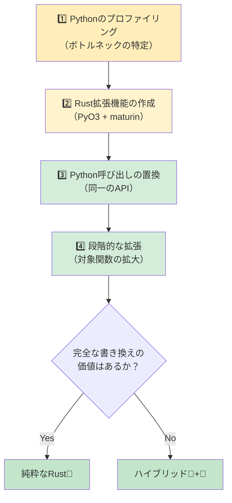

## Rustにおける一般的なPythonパターンの対比

> **学ぶこと:** 辞書（dict）→構造体（struct）、クラス→構造体+impl、リスト内包表記→イテレータチェーン、
> デコレータ→高階関数/マクロ、コンテキストマネージャ→Drop/RAII への変換方法を学びます。さらに、必須クレートや段階的な導入戦略についても解説します。
>
> **難易度:** 🟡 中級

### 辞書（Dictionary） → 構造体（Struct）
```python
# Python — データコンテナとしての辞書（非常によく使われる）
user = {
    "name": "Alice",
    "age": 30,
    "email": "alice@example.com",
    "active": True,
}
print(user["name"])
```

```rust
// Rust — 名前付きフィールドを持つ構造体
#[derive(Debug, Clone, serde::Serialize, serde::Deserialize)]
struct User {
    name: String,
    age: i32,
    email: String,
    active: bool,
}

let user = User {
    name: "Alice".into(),
    age: 30,
    email: "alice@example.com".into(),
    active: true,
};
println!("{}", user.name);
```

### コンテキストマネージャ → RAII（Drop）
```python
# Python — リソース解放のためのコンテキストマネージャ
class FileManager:
    def __init__(self, path):
        self.file = open(path, 'w')

    def __enter__(self):
        return self.file

    def __exit__(self, *args):
        self.file.close()

with FileManager("output.txt") as f:
    f.write("hello")
# `with` ブロックを抜けるとファイルは自動的にクローズされる
```

```rust
// Rust — RAII: 値がスコープを抜けるときにDropトレイトが実行される
use std::fs::File;
use std::io::Write;

fn write_file() -> std::io::Result<()> {
    let mut file = File::create("output.txt")?;
    file.write_all(b"hello")?;
    Ok(())
    // `file` がスコープを抜けると自動的にクローズされる
    // `with` は不要 — RAIIが自動処理！
}
```

### デコレータ → 高階関数またはマクロ
```python
# Python — 処理時間計測のためのデコレータ
import functools, time

def timed(func):
    @functools.wraps(func)
    def wrapper(*args, **kwargs):
        start = time.perf_counter()
        result = func(*args, **kwargs)
        elapsed = time.perf_counter() - start
        print(f"{func.__name__} took {elapsed:.4f}s")
        return result
    return wrapper

@timed
def slow_function():
    time.sleep(1)
```

```rust
// Rust — デコレータ構文はないため、ラッパー関数やマクロを使用する
use std::time::Instant;

fn timed<F, R>(name: &str, f: F) -> R
where
    F: FnOnce() -> R,
{
    let start = Instant::now();
    let result = f();
    println!("{} took {:.4?}", name, start.elapsed());
    result
}

// 使用例:
let result = timed("slow_function", || {
    std::thread::sleep(std::time::Duration::from_secs(1));
    42
});
```

### イテレータパイプライン（データ処理）
```python
# Python — 変換処理のチェーン
import csv
from collections import Counter

def analyze_sales(filename):
    with open(filename) as f:
        reader = csv.DictReader(f)
        sales = [
            row for row in reader
            if float(row["amount"]) > 100
        ]
    by_region = Counter(sale["region"] for sale in sales)
    top_regions = by_region.most_common(5)
    return top_regions
```

```rust
// Rust — 静的型付けされたイテレータチェーン
use std::collections::HashMap;

#[derive(Debug, serde::Deserialize)]
struct Sale {
    region: String,
    amount: f64,
}

fn analyze_sales(filename: &str) -> Vec<(String, usize)> {
    let data = std::fs::read_to_string(filename).unwrap();
    let mut reader = csv::Reader::from_reader(data.as_bytes());

    let mut by_region: HashMap<String, usize> = HashMap::new();
    for sale in reader.deserialize::<Sale>().flatten() {
        if sale.amount > 100.0 {
            *by_region.entry(sale.region).or_insert(0) += 1;
        }
    }

    let mut top: Vec<_> = by_region.into_iter().collect();
    top.sort_by(|a, b| b.1.cmp(&a.1));
    top.truncate(5);
    top
}
```

### グローバル設定 / シングルトン
```python
# Python — モジュールレベルのシングルトン（一般的なパターン）
# config.py
import json

class Config:
    _instance = None

    def __new__(cls):
        if cls._instance is None:
            cls._instance = super().__new__(cls)
            with open("config.json") as f:
                cls._instance.data = json.load(f)
        return cls._instance

config = Config()  # モジュールレベルのシングルトン
```

```rust
// Rust — 静的変数の遅延初期化のためのOnceLock（Rust 1.70+）
use std::sync::OnceLock;
use serde_json::Value;

static CONFIG: OnceLock<Value> = OnceLock::new();

fn get_config() -> &'static Value {
    CONFIG.get_or_init(|| {
        let data = std::fs::read_to_string("config.json")
            .expect("設定ファイルの読み込みに失敗しました");
        serde_json::from_str(&data)
            .expect("設定ファイルのパースに失敗しました")
    })
}

// 任意の場所での使用例:
let db_host = get_config()["database"]["host"].as_str().unwrap();
```

***

## Python開発者のための必須クレート

### データ処理とシリアライゼーション

| タスク | Python | Rust クレート | 補足 |
|--------|--------|--------------|------|
| JSON | `json` | `serde_json` | 型安全なシリアライゼーション |
| CSV | `csv`, `pandas` | `csv` | ストリーミング処理、低メモリ消費 |
| YAML | `pyyaml` | `serde_yaml` | 設定ファイル |
| TOML | `tomllib` | `toml` | 設定ファイル |
| データバリデーション | `pydantic` | `serde` + カスタム実装 | コンパイル時の検証 |
| 日付/時刻 | `datetime` | `chrono` | 完全なタイムゾーンサポート |
| 正規表現 | `re` | `regex` | 非常に高速 |
| UUID | `uuid` | `uuid` | 同等のコンセプト |

### Webとネットワーク

| タスク | Python | Rust クレート | 補足 |
|--------|--------|--------------|------|
| HTTPクライアント | `requests` | `reqwest` | 非同期優先（Async-first） |
| Webフレームワーク | `FastAPI`/`Flask` | `axum` / `actix-web` | 非常に高速 |
| WebSocket | `websockets` | `tokio-tungstenite` | 非同期 |
| gRPC | `grpcio` | `tonic` | 完全サポート |
| データベース（SQL） | `sqlalchemy` | `sqlx` / `diesel` | コンパイル時にチェックされるSQL |
| Redis | `redis-py` | `redis` | 非同期サポート |

### CLIとシステム

| タスク | Python | Rust クレート | 補足 |
|--------|--------|--------------|------|
| CLI引数 | `argparse`/`click` | `clap` | Deriveマクロ |
| カラー出力 | `colorama` | `colored` | ターミナルカラー |
| プログレスバー | `tqdm` | `indicatif` | 同等のUX |
| ファイル監視 | `watchdog` | `notify` | クロスプラットフォーム |
| ロギング | `logging` | `tracing` | 構造化ロギング、非同期対応 |
| 環境変数 | `os.environ` | `std::env` + `dotenvy` | .envサポート |
| サブプロセス | `subprocess` | `std::process::Command` | 標準ライブラリ組み込み |
| 一時ファイル | `tempfile` | `tempfile` | 同名クレート！ |

### テスト

| タスク | Python | Rust クレート | 補足 |
|--------|--------|--------------|------|
| テストフレームワーク | `pytest` | 組み込み + `rstest` | `cargo test` |
| モック | `unittest.mock` | `mockall` | トレイトベース |
| プロパティベーステスト | `hypothesis` | `proptest` | 類似のAPI |
| スナップショットテスト | `syrupy` | `insta` | スナップショットの承認フロー |
| ベンチマーク | `pytest-benchmark` | `criterion` | 統計的ベンチマーク |
| コードカバレッジ | `coverage.py` | `cargo-tarpaulin` | LLVMベース |

***

## 段階的な導入戦略



> 📌 **関連情報**: [第14章 — Unsafe RustとFFI](ch14-unsafe-rust-and-ffi.md) では、PyO3バインディングに必要な低レベルFFIの詳細を扱っています。

### ステップ1: ホットスポット（ボトルネック）の特定

```python
# まずはPythonコードをプロファイリングする
import cProfile
cProfile.run('main()')  # CPU負荷の高い関数を特定

# または py-spy によるサンプリングプロファイラを使用:
# py-spy top --pid <python-pid>
# py-spy record -o profile.svg -- python main.py
```

### ステップ2: ホットスポット向けのRust拡張機能の作成

```bash
# maturin を使ってRust拡張機能プロジェクトを作成
cd my_python_project
maturin init --bindings pyo3

# ボトルネックとなっている関数をRustで記述（前述のPyO3セクションを参照）
# ビルドとインストール:
maturin develop --release
```

### ステップ3: Python呼び出しをRust呼び出しに置換

```python
# 変更前:
result = python_hot_function(data)  # 遅い

# 変更後:
import my_rust_extension
result = my_rust_extension.hot_function(data)  # 高速！

# APIもテストもそのままで、10〜100倍高速化
```

### ステップ4: 段階的な拡張

```rust
1〜2週目: CPUバウンドな関数1つをRustに置き換える
3〜4週目: データパース/バリデーション層を置き換える
2ヶ月目:  コアとなるデータパイプラインを置き換える
3ヶ月目以降: メリットが見合う場合は、完全なRustへの書き換えを検討する

重要な原則: オーケストレーション（全体制御）にはPythonを残し、重い計算処理にRustを活用する。
```

---

## 💼 ケーススタディ：PyO3によるデータパイプラインの高速化

あるフィンテック系スタートアップでは、毎日2GBの取引CSVファイルを処理するPythonデータパイプラインを運用しています。深刻なボトルネックとなっていたのは、検証（バリデーション）とデータ変換のステップでした:

```python
# Python — 遅い処理部分（2GBで約12分）
import csv
from decimal import Decimal
from datetime import datetime

def validate_and_transform(filepath: str) -> list[dict]:
    results = []
    with open(filepath) as f:
        reader = csv.DictReader(f)
        for row in reader:
            # 各フィールドのパースとバリデーション
            amount = Decimal(row["amount"])
            if amount < 0:
                raise ValueError(f"負の金額です: {amount}")
            date = datetime.strptime(row["date"], "%Y-%m-%d")
            category = categorize(row["merchant"])  # 文字列マッチング、約50ルール

            results.append({
                "amount_cents": int(amount * 100),
                "date": date.isoformat(),
                "category": category,
                "merchant": row["merchant"].strip().lower(),
            })
    return results
# 1,500万行の処理に約12分。pandasを試したところ約8分になったが、RAMを6GB消費。
```

**ステップ1**: プロファイリングを行い、ボトルネックを特定（CSVパース + Decimal変換 + 文字列マッチング = 全体時間の95%）。

**ステップ2**: Rust拡張機能を記述:

```rust
// src/lib.rs — PyO3 拡張機能
use pyo3::prelude::*;
use pyo3::types::PyList;
use std::fs::File;
use std::io::BufReader;

#[derive(Debug)]
struct Transaction {
    amount_cents: i64,
    date: String,
    category: String,
    merchant: String,
}

fn categorize(merchant: &str) -> &'static str {
    // Aho-Corasickまたはシンプルなルール — 一度コンパイルされれば超高速
    if merchant.contains("amazon") { "shopping" }
    else if merchant.contains("uber") || merchant.contains("lyft") { "transport" }
    else if merchant.contains("starbucks") { "food" }
    else { "other" }
}

#[pyfunction]
fn process_transactions(path: &str) -> PyResult<Vec<(i64, String, String, String)>> {
    let file = File::open(path).map_err(|e| pyo3::exceptions::PyIOError::new_err(e.to_string()))?;
    let mut reader = csv::Reader::from_reader(BufReader::new(file));

    let mut results = Vec::with_capacity(15_000_000); // メモリの事前確保

    for record in reader.records() {
        let record = record.map_err(|e| pyo3::exceptions::PyValueError::new_err(e.to_string()))?;
        let amount_str = &record[0];
        let amount_cents = parse_amount_cents(amount_str)?;  // カスタムパーサー（Decimal不要）
        let date = &record[1];  // 既にISO形式なので検証のみ
        let merchant = record[2].trim().to_lowercase();
        let category = categorize(&merchant).to_string();

        results.push((amount_cents, date.to_string(), category, merchant));
    }
    Ok(results)
}

#[pymodule]
fn fast_pipeline(m: &Bound<'_, PyModule>) -> PyResult<()> {
    m.add_function(wrap_pyfunction!(process_transactions, m)?)?;
    Ok(())
}
```

**ステップ3**: Python側の呼び出しを1行差し替え:

```python
# 変更前:
results = validate_and_transform("transactions.csv")  # 12分

# 変更後:
import fast_pipeline
results = fast_pipeline.process_transactions("transactions.csv")  # 45秒

# Pythonのオーケストレーション、テスト、デプロイ構成はそのまま
# 置き換えたのは関数1つだけ
```

**結果**:
| 指標 | Python (csv + Decimal) | Rust (PyO3 + csv クレート) |
|------|----------------------|------------------------|
| 処理時間（2GB / 1,500万行） | 12分 | 45秒 |
| ピークメモリ | 6GB (pandas) / 2GB (csv) | 200MB |
| Python側の変更行数 | — | 1行（import + 呼び出し） |
| 記述したRustコード | — | 約60行 |
| パスしたテスト | 47/47 | 47/47（変更なし） |

> **重要な教訓**: アプリケーション全体を書き直す必要はありません。全体の95%の時間を費やしている5%のコードを見つけ出し、PyO3を使ってその部分だけをRustで書き換え、残りはすべてPythonのまま残しましょう。このチームは「サーバーを増設しなければならない」という状況から「サーバー1台で十分」という状態へと劇的に改善しました。

---

## 演習問題

<details>
<summary><strong>🏋️ 演習問題：移行判定マトリクス</strong> (クリックして展開)</summary>

**課題**: 以下のコンポーネントを持つPython Webアプリケーションがあります。それぞれについて、**Pythonのまま維持**、**Rustで完全書き換え**、または **PyO3によるブリッジ** のどれを選択すべきか判断し、その理由を説明してください。

1. Flaskのルートハンドラ（リクエストのパース、JSONレスポンスの返却）
2. 画像サムネイル生成処理（CPUバウンド、1日に1万枚処理）
3. データベースORMクエリ（SQLAlchemy）
4. 2GBの財務データCSVファイルのパーサー（夜間バッチで実行）
5. 管理者用ダッシュボード（Jinja2テンプレート）

<details>
<summary>🔑 解答例</summary>

| コンポーネント | 判断 | 理由 |
|---|---|---|
| Flaskのルートハンドラ | 🐍 Pythonのまま維持 | I/Oバウンドであり、フレームワークへの依存が大きく、Rust化による恩恵が少ない |
| 画像サムネイル生成処理 | 🦀 PyO3によるブリッジ | CPUバウンドなホットパス。Python APIを維持しつつ内部をRustで実装するのが最適 |
| データベースORMクエリ | 🐍 Pythonのまま維持 | SQLAlchemyは成熟しており、クエリ自体はI/Oバウンドであるため |
| CSVパーサー (2GB) | 🦀 PyO3ブリッジ または 完全Rust化 | CPUおよびメモリの両方がボトルネックであり、Rustのゼロコピーパースの強みが活きる |
| 管理者用ダッシュボード | 🐍 Pythonのまま維持 | UI/テンプレート処理であり、パフォーマンスの懸念がないため |

**重要なポイント**: 移行のスイートスポットは、明確な境界を持つ「CPUバウンドでパフォーマンスが重要なコード」です。グルー（接着）コードやI/Oバウンドなハンドラを書き直す必要はありません。得られるメリットに対してコストが見合わないためです。

</details>
</details>

***
