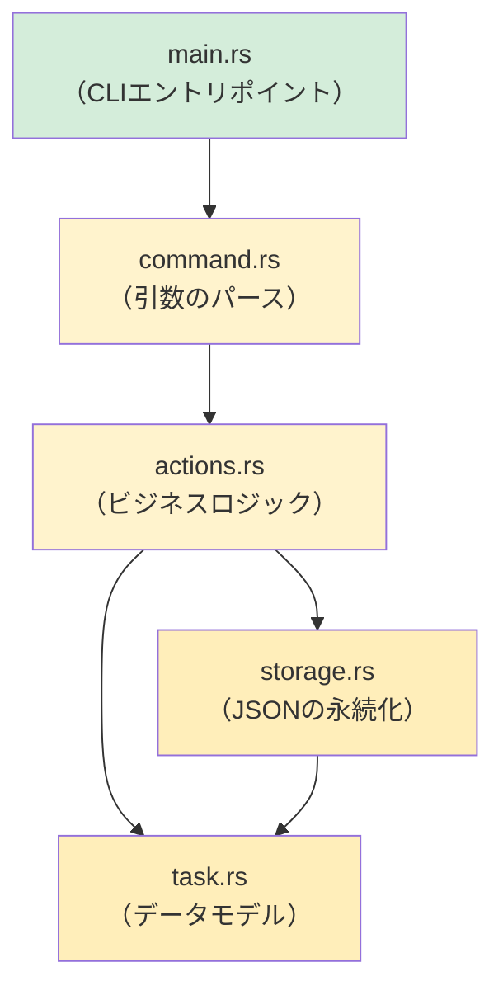

## キャップストーンプロジェクト：CLIタスクマネージャーの構築

> **学ぶこと:** Python開発者が通常 `argparse` + `json` + `pathlib` で作成するような完全なRust製CLIアプリケーションを構築し、
> 本コースで学んだすべての知識を結びつけます。
>
> **難易度:** 🔴 上級

このキャップストーンプロジェクトでは、主要な各章の概念を実践します:
- **第3章**: 型と変数（構造体、列挙型）
- **第5章**: コレクション（`Vec`、`HashMap`）
- **第6章**: 列挙型とパターンマッチング（タスクの状態、コマンド）
- **第7章**: 所有権と借用（参照の受け渡し）
- **第9章**: エラー処理（`Result`、`?`、カスタムエラー）
- **第10章**: トレイト（`Display`、`FromStr`）
- **第11章**: 型変換（`From`、`TryFrom`）
- **第12章**: イテレータとクロージャ（フィルタリング、マッピング）
- **第8章**: モジュール（整理されたプロジェクト構造）

***

## プロジェクト：`rustdo`

タスクをJSONファイルに保存するコマンドラインタスクマネージャー（Pythonの `todo.txt` ツールに類似）です。

### Pythonでの実装例（Pythonで書く場合）

```python
#!/usr/bin/env python3
"""シンプルなCLIタスクマネージャー — Python版。"""
import json
import sys
from pathlib import Path
from datetime import datetime
from enum import Enum

TASK_FILE = Path.home() / ".rustdo.json"

class Priority(Enum):
    LOW = "low"
    MEDIUM = "medium"
    HIGH = "high"

class Task:
    def __init__(self, id: int, title: str, priority: Priority, done: bool = False):
        self.id = id
        self.title = title
        self.priority = priority
        self.done = done
        self.created = datetime.now().isoformat()

def load_tasks() -> list[Task]:
    if not TASK_FILE.exists():
        return []
    data = json.loads(TASK_FILE.read_text())
    return [Task(**t) for t in data]

def save_tasks(tasks: list[Task]):
    TASK_FILE.write_text(json.dumps([t.__dict__ for t in tasks], indent=2))

# コマンド: add, list, done, remove, stats
# ... (Pythonでどのように書くかは想像できるでしょう)
```

### Rustでの実装

これをステップバイステップで構築していきます。各ステップは特定の章の概念と対応しています。

***

## ステップ1: データモデルの定義（第3, 6, 10, 11章）

```rust
// src/task.rs
use std::fmt;
use std::str::FromStr;
use serde::{Deserialize, Serialize};
use chrono::Local;

/// タスクの優先度 — Pythonの Priority(Enum) に対応
#[derive(Debug, Clone, Copy, PartialEq, Eq, Serialize, Deserialize)]
#[serde(rename_all = "lowercase")]
pub enum Priority {
    Low,
    Medium,
    High,
}

// Display トレイト（Pythonの __str__ に相当）
impl fmt::Display for Priority {
    fn fmt(&self, f: &mut fmt::Formatter<'_>) -> fmt::Result {
        match self {
            Priority::Low => write!(f, "low"),
            Priority::Medium => write!(f, "medium"),
            Priority::High => write!(f, "high"),
        }
    }
}

// FromStr トレイト（文字列のパース: "high" → Priority::High）
impl FromStr for Priority {
    type Err = String;

    fn from_str(s: &str) -> Result<Self, Self::Err> {
        match s.to_lowercase().as_str() {
            "low" | "l" => Ok(Priority::Low),
            "medium" | "med" | "m" => Ok(Priority::Medium),
            "high" | "h" => Ok(Priority::High),
            other => Err(format!("unknown priority: '{other}' (use low/medium/high)")),
        }
    }
}

/// 単一のタスク — Pythonの Task クラスに対応
#[derive(Debug, Clone, Serialize, Deserialize)]
pub struct Task {
    pub id: u32,
    pub title: String,
    pub priority: Priority,
    pub done: bool,
    pub created: String,
}

impl Task {
    pub fn new(id: u32, title: String, priority: Priority) -> Self {
        Self {
            id,
            title,
            priority,
            done: false,
            created: Local::now().format("%Y-%m-%dT%H:%M:%S").to_string(),
        }
    }
}

impl fmt::Display for Task {
    fn fmt(&self, f: &mut fmt::Formatter<'_>) -> fmt::Result {
        let status = if self.done { "✅" } else { "⬜" };
        let priority_icon = match self.priority {
            Priority::Low => "🟢",
            Priority::Medium => "🟡",
            Priority::High => "🔴",
        };
        write!(f, "{} {} [{}] {} ({})", status, self.id, priority_icon, self.title, self.created)
    }
}
```

> **Pythonとの比較**: Pythonでは `@dataclass` + `Enum` を使用します。Rustでは、`struct` + `enum` + `derive` マクロにより、シリアライゼーション、表示、パース処理を実質追加コードなしで実現できます。

***

## ステップ2: ストレージ層（第9, 7章）

```rust
// src/storage.rs
use std::fs;
use std::path::PathBuf;
use crate::task::Task;

/// タスクファイルのパスを取得 (~/.rustdo.json)
fn task_file_path() -> PathBuf {
    let home = dirs::home_dir().expect("ホームディレクトリを特定できませんでした");
    home.join(".rustdo.json")
}

/// ディスクからタスクを読み込む — ファイルが存在しない場合は空のVecを返す
pub fn load_tasks() -> Result<Vec<Task>, Box<dyn std::error::Error>> {
    let path = task_file_path();
    if !path.exists() {
        return Ok(Vec::new());
    }
    let content = fs::read_to_string(&path)?;  // ? が io::Error を伝播する
    let tasks: Vec<Task> = serde_json::from_str(&content)?;  // ? が serde のエラーを伝播する
    Ok(tasks)
}

/// タスクをディスクに保存する
pub fn save_tasks(tasks: &[Task]) -> Result<(), Box<dyn std::error::Error>> {
    let path = task_file_path();
    let json = serde_json::to_string_pretty(tasks)?;
    fs::write(&path, json)?;
    Ok(())
}
```

> **Pythonとの比較**: Pythonでは `Path.read_text()` + `json.loads()` を使用します。Rustでは `fs::read_to_string()` + `serde_json::from_str()` を使用します。`?` に注目してください。すべてのエラーが明示的に扱われ、呼び出し元へ伝播されます。

***

## ステップ3: コマンド列挙型（第6章）

```rust
// src/command.rs
use crate::task::Priority;

/// すべての可能なコマンド — アクションごとに1つの列挙型バリアント
pub enum Command {
    Add { title: String, priority: Priority },
    List { show_done: bool },
    Done { id: u32 },
    Remove { id: u32 },
    Stats,
    Help,
}

impl Command {
    /// コマンドライン引数をパースしてCommandに変換する
    /// （本番環境では `clap` を使用しますが、ここでは学習用として手動パースします）
    pub fn parse(args: &[String]) -> Result<Self, String> {
        match args.first().map(|s| s.as_str()) {
            Some("add") => {
                let title = args.get(1)
                    .ok_or("使用法: rustdo add <title> [priority]")?
                    .clone();
                let priority = args.get(2)
                    .map(|p| p.parse::<Priority>())
                    .transpose()
                    .map_err(|e| e.to_string())?
                    .unwrap_or(Priority::Medium);
                Ok(Command::Add { title, priority })
            }
            Some("list") => {
                let show_done = args.get(1).map(|s| s == "--all").unwrap_or(false);
                Ok(Command::List { show_done })
            }
            Some("done") => {
                let id: u32 = args.get(1)
                    .ok_or("使用法: rustdo done <id>")?
                    .parse()
                    .map_err(|_| "idは数値である必要があります")?;
                Ok(Command::Done { id })
            }
            Some("remove") => {
                let id: u32 = args.get(1)
                    .ok_or("使用法: rustdo remove <id>")?
                    .parse()
                    .map_err(|_| "idは数値である必要があります")?;
                Ok(Command::Remove { id })
            }
            Some("stats") => Ok(Command::Stats),
            _ => Ok(Command::Help),
        }
    }
}
```

> **Pythonとの比較**: Pythonでは `argparse` や `click` を使用します。この手作りのパーサーは、列挙型に対する `match` がPythonのif/elifチェーンをどのように置き換えるかを示しています。実際の大規模プロジェクトでは `clap` クレートを使用してください。

***

## ステップ4: ビジネスロジック（第5, 12, 7章）

```rust
// src/actions.rs
use crate::task::{Task, Priority};
use crate::storage;

pub fn add_task(title: String, priority: Priority) -> Result<(), Box<dyn std::error::Error>> {
    let mut tasks = storage::load_tasks()?;
    let next_id = tasks.iter().map(|t| t.id).max().unwrap_or(0) + 1;
    let task = Task::new(next_id, title.clone(), priority);
    println!("追加完了: {task}");
    tasks.push(task);
    storage::save_tasks(&tasks)?;
    Ok(())
}

pub fn list_tasks(show_done: bool) -> Result<(), Box<dyn std::error::Error>> {
    let tasks = storage::load_tasks()?;
    let filtered: Vec<&Task> = tasks.iter()
        .filter(|t| show_done || !t.done)   // イテレータ + クロージャ（第12章）
        .collect();

    if filtered.is_empty() {
        println!("タスクはありません！ 🎉");
        return Ok(());
    }

    for task in &filtered {
        println!("  {task}");   // Display トレイトを使用（第10章）
    }
    println!("\n表示件数: {} 件", filtered.len());
    Ok(())
}

pub fn complete_task(id: u32) -> Result<(), Box<dyn std::error::Error>> {
    let mut tasks = storage::load_tasks()?;
    let task = tasks.iter_mut()
        .find(|t| t.id == id)                // Iterator::find（第12章）
        .ok_or(format!("ID {} のタスクは見つかりませんでした", id))?;
    task.done = true;
    println!("完了済みに更新: {task}");
    storage::save_tasks(&tasks)?;
    Ok(())
}

pub fn remove_task(id: u32) -> Result<(), Box<dyn std::error::Error>> {
    let mut tasks = storage::load_tasks()?;
    let len_before = tasks.len();
    tasks.retain(|t| t.id != id);            // Vec::retain（第5章）
    if tasks.len() == len_before {
        return Err(format!("ID {} のタスクは見つかりませんでした", id).into());
    }
    println!("タスク {} を削除しました", id);
    storage::save_tasks(&tasks)?;
    Ok(())
}

pub fn show_stats() -> Result<(), Box<dyn std::error::Error>> {
    let tasks = storage::load_tasks()?;
    let total = tasks.len();
    let done = tasks.iter().filter(|t| t.done).count();
    let pending = total - done;

    // イテレータを使用して優先度別に集計（第12章）
    let high = tasks.iter().filter(|t| !t.done && t.priority == Priority::High).count();
    let medium = tasks.iter().filter(|t| !t.done && t.priority == Priority::Medium).count();
    let low = tasks.iter().filter(|t| !t.done && t.priority == Priority::Low).count();

    println!("📊 タスク統計");
    println!("   合計:     {total}");
    println!("   完了:     {done} ✅");
    println!("   未完了:   {pending}");
    println!("   🔴 高:     {high}");
    println!("   🟡 中:     {medium}");
    println!("   🟢 低:     {low}");
    Ok(())
}
```

> **使われている主なRustパターン**: `iter().map().max()`、`iter().filter().collect()`、`iter_mut().find()`、`retain()`、`iter().filter().count()`。これらはPythonのリスト内包表記、`next(x for x in ...)`、および `Counter` を置き換えるものです。

***

## ステップ5: 全体を結合する（第8章）

```rust
// src/main.rs
mod task;
mod storage;
mod command;
mod actions;

use command::Command;

fn main() {
    let args: Vec<String> = std::env::args().skip(1).collect();
    let command = match Command::parse(&args) {
        Ok(cmd) => cmd,
        Err(e) => {
            eprintln!("エラー: {e}");
            std::process::exit(1);
        }
    };

    let result = match command {
        Command::Add { title, priority } => actions::add_task(title, priority),
        Command::List { show_done } => actions::list_tasks(show_done),
        Command::Done { id } => actions::complete_task(id),
        Command::Remove { id } => actions::remove_task(id),
        Command::Stats => actions::show_stats(),
        Command::Help => {
            print_help();
            Ok(())
        }
    };

    if let Err(e) = result {
        eprintln!("エラー: {e}");
        std::process::exit(1);
    }
}

fn print_help() {
    println!("rustdo — Rustを学ぶPythonistaのためのタスクマネージャー\n");
    println!("使用法:");
    println!("  rustdo add <title> [low|medium|high]   タスクを追加");
    println!("  rustdo list [--all]                    未完了タスク一覧を表示");
    println!("  rustdo done <id>                       タスクを完了としてマーク");
    println!("  rustdo remove <id>                     タスクを削除");
    println!("  rustdo stats                           統計情報を表示");
}
```



***

## ステップ6: Cargo.toml の依存関係

```toml
[package]
name = "rustdo"
version = "0.1.0"
edition = "2021"

[dependencies]
serde = { version = "1", features = ["derive"] }
serde_json = "1"
chrono = "0.4"
dirs = "5"
```

> **Pythonでの相当物**: これは `pyproject.toml` の `[project.dependencies]` に相当します。`cargo add serde serde_json chrono dirs` は `pip install` のようなものです。

***

## ステップ7: テスト（第14章）

```rust
// src/task.rs — 末尾に追加
#[cfg(test)]
mod tests {
    use super::*;

    #[test]
    fn parse_priority() {
        assert_eq!("high".parse::<Priority>().unwrap(), Priority::High);
        assert_eq!("H".parse::<Priority>().unwrap(), Priority::High);
        assert_eq!("med".parse::<Priority>().unwrap(), Priority::Medium);
        assert!("invalid".parse::<Priority>().is_err());
    }

    #[test]
    fn task_display() {
        let task = Task::new(1, "Write Rust".to_string(), Priority::High);
        let display = format!("{task}");
        assert!(display.contains("Write Rust"));
        assert!(display.contains("🔴"));
        assert!(display.contains("⬜")); // まだ完了していない
    }

    #[test]
    fn task_serialization_roundtrip() {
        let task = Task::new(1, "Test".to_string(), Priority::Low);
        let json = serde_json::to_string(&task).unwrap();
        let recovered: Task = serde_json::from_str(&json).unwrap();
        assert_eq!(recovered.title, "Test");
        assert_eq!(recovered.priority, Priority::Low);
    }
}
```

> **Pythonでの相当物**: `pytest` によるテストに相当します。`pytest` の代わりに `cargo test` で実行します。テスト自動検出の「黒魔術」は不要で、`#[test]` がテスト関数であることを明示的に宣言します。

***

## さらなる発展課題（Stretch Goals）

基本機能が動作したら、以下の機能拡張に挑戦してみましょう:

1. **引数パースに `clap` を導入する** — 手作りのパーサーを `clap` の derive マクロに置き換える:
   ```rust
   #[derive(Parser)]
   enum Command {
       Add { title: String, #[arg(default_value = "medium")] priority: Priority },
       List { #[arg(long)] all: bool },
       Done { id: u32 },
       Remove { id: u32 },
       Stats,
   }
   ```

2. **カラー出力を追加する** — ターミナルの色付けに `colored` クレートを使用する（Pythonの `colorama` に類似）。

3. **期日（Due Date）を追加する** — `Option<NaiveDate>` フィールドを追加し、期限切れタスクをフィルタリングできるようにする。

4. **タグ/カテゴリ機能を追加する** — タグ用に `Vec<String>` を追加し、`.iter().any()` を使ってフィルタリングできるようにする。

5. **ライブラリ + バイナリ構成にする** — ロジックを再利用可能にするため、`lib.rs` + `main.rs` に分割する（第8章のモジュールパターン）。

***

## 実践した概念の振り返り

| 章 | 概念 | 登場箇所 |
|----|------|----------|
| 第3章 | 型と変数 | `Task` 構造体のフィールド、`u32`、`String`、`bool` |
| 第5章 | コレクション | `Vec<Task>`、`retain()`、`push()` |
| 第6章 | 列挙型 + match | `Priority`、`Command`、網羅的なパターンマッチング |
| 第7章 | 所有権 + 借用 | `&[Task]` vs `Vec<Task>`、タスク完了時の `&mut` |
| 第8章 | モジュール | `mod task; mod storage; mod command; mod actions;` |
| 第9章 | エラー処理 | `Result<T, E>`、`?` 演算子、`.ok_or()` |
| 第10章 | トレイト | `Display`、`FromStr`、`Serialize`、`Deserialize` |
| 第11章 | From/Into | Priority用の `FromStr`、エラー変換用の `.into()` |
| 第12章 | イテレータ | `filter`、`map`、`find`、`count`、`collect` |
| 第14章 | テスト | `#[test]`、`#[cfg(test)]`、アサーションマクロ |

> 🎓 **おめでとうございます！** このプロジェクトを構築できたなら、本書で扱った主要なRustの概念をすべて使いこなしたことになります。あなたはもはや「Rustを学んでいるPython開発者」ではなく、「Pythonも知っているRust開発者」です。

***
