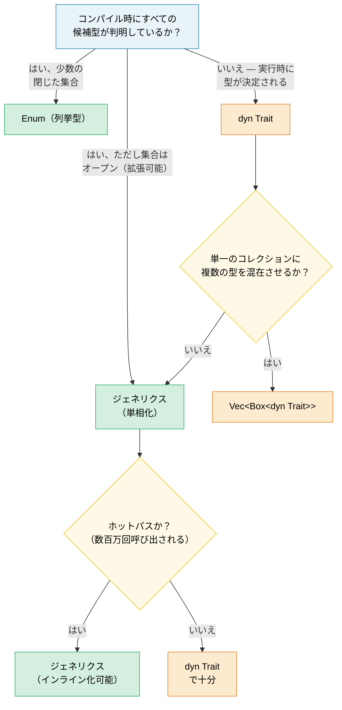

# 1. ジェネリクスの全貌 🟢

> **学べること:**
> - 単相化（Monomorphization）がゼロコストのジェネリクスを実現する仕組み — そしてそれがコード膨張（code bloat）を引き起こすケース
> - 意思決定フレームワーク: ジェネリクス vs 列挙型（Enum） vs トレイトオブジェクト
> - コンパイル時の配列長を指定するconstジェネリクスと、コンパイル時評価のための `const fn`
> - コールドパスにおいて静的ディスパッチを動的ディスパッチに切り替える判断基準

## 単相化とゼロコスト

Rustのジェネリクスは**単相化（monomorphized）**されます。コンパイラは、ジェネリック関数が使用されている具象型ごとに、特殊化されたコピーを生成します。これは、実行時にジェネリクスが型消去（erase）されるJavaやC#とは対照的です。

```rust
fn max_of<T: PartialOrd>(a: T, b: T) -> T {
    if a >= b { a } else { b }
}

fn main() {
    max_of(3_i32, 5_i32);     // コンパイラが max_of_i32 を生成
    max_of(2.0_f64, 7.0_f64); // コンパイラが max_of_f64 を生成
    max_of("a", "z");         // コンパイラが max_of_str を生成
}
```

**コンパイラが実際に生成するもの**（概念的イメージ）:

```rust
// 3つの独立した関数 — 実行時ディスパッチもvtableもありません:
fn max_of_i32(a: i32, b: i32) -> i32 { if a >= b { a } else { b } }
fn max_of_f64(a: f64, b: f64) -> f64 { if a >= b { a } else { b } }
fn max_of_str<'a>(a: &'a str, b: &'a str) -> &'a str { if a >= b { a } else { b } }
```

> **なぜ `max_of_str` には `<'a>` が必要で、`max_of_i32` には不要なのか？**  
> `i32` や `f64` は `Copy` 型であり、関数は所有された値を返します。しかし `&str` は参照であるため、コンパイラは返される参照のライフタイムを知る必要があります。`<'a>` という注釈は、「返される `&str` は両方の入力と同じかそれ以上の長さで生存する」ことを示します。

**利点**: 実行時オーバーヘッドはゼロであり、手作業で書いた特殊化コードと完全に同等です。オプティマイザは、生成された各コピーを個別にインライン化、ベクトル化、最適化できます。

**C++との比較**: RustのジェネリクスはC++のテンプレートに似ていますが、決定的な違いが1つあります。それは、**境界のチェックがインスタンス化時ではなく、定義時に行われる**点です。C++ではテンプレートが特定の型とともに使われて初めてコンパイルエラーが発生するため、ライブラリコードの奥深くで難解なエラーメッセージが出がちです。一方Rustでは、関数を定義した時点で `T: PartialOrd` が検証されるため、エラーを早期に検知でき、メッセージも明確です。

```rust,compile_fail
// Rust: 定義側でエラーが発生 — "T doesn't implement Display"
fn broken<T>(val: T) {
    println!("{val}"); // ❌ エラー: T が Display を実装していません
}
```

```rust
// 修正後: トレイト境界を追加
fn fixed<T: std::fmt::Display>(val: T) {
    println!("{val}"); // ✅
}
```

### ジェネリクスの弊害: コード膨張（Code Bloat）

単相化にはコストが伴います。それはバイナリサイズです。ユニークな具象型で呼び出されるたびに、関数本体が複製されます：

```rust,ignore
// この一見無害な関数が...
fn serialize<T: serde::Serialize>(value: &T) -> Vec<u8> {
    serde_json::to_vec(value).unwrap()
}

// ...50種類の型で使われると → バイナリ内に50個のコピーが生成されます。
```

**緩和策**:

```rust,ignore
// 1. 非ジェネリックなコア部分を切り出す（"outline" パターン）
fn serialize<T: serde::Serialize>(value: &T) -> Result<Vec<u8>, serde_json::Error> {
    // ジェネリックな部分: シリアライズの呼び出しのみ
    let json_value = serde_json::to_value(value)?;
    // 非ジェネリックな部分: 別関数へ抽出
    serialize_value(json_value)
}

fn serialize_value(value: serde_json::Value) -> Result<Vec<u8>, serde_json::Error> {
    // この関数はバイナリ内に1つだけ存在します
    serde_json::to_vec(&value)
}

// 2. インライン化が重要でない場合はトレイトオブジェクト（動的ディスパッチ）を使う
fn log_item(item: &dyn std::fmt::Display) {
    // 1つのコピー — ディスパッチにはvtableを使用
    println!("[LOG] {item}");
}
```

> **経験則（Rule of thumb）**: インライン化が効いてくるホットパスにはジェネリクスを使用します。
> vtable呼び出しのオーバーヘッドが無視できるコールドパス（エラーハンドリング、ロギング、設定読み込みなど）には `dyn Trait` を使用します。

### ジェネリクス vs 列挙型 vs トレイトオブジェクト — 意思決定ガイド

Rustで「異なる型、同じインターフェース」を扱う方法は3つあります：

| アプローチ | ディスパッチ | 解決タイミング | 拡張性 | オーバーヘッド |
|------------|--------------|----------------|--------|----------------|
| **ジェネリクス** (`impl Trait` / `<T: Trait>`) | 静的（単相化） | コンパイル時 | ✅（オープンな集合） | ゼロ — インライン化可能 |
| **列挙型（Enum）** | matchアーム | コンパイル時 | ❌（クローズドな集合） | ゼロ — vtableなし |
| **トレイトオブジェクト** (`dyn Trait`) | 動的（vtable） | 実行時 | ✅（オープンな集合） | vtableポインタ + 間接呼び出し |

```rust,ignore
// --- ジェネリクス: オープンな集合、ゼロコスト、コンパイル時 ---
fn process<H: Handler>(handler: H, request: Request) -> Response {
    handler.handle(request) // 単相化 — H ごとに1つのコピー
}

// --- 列挙型（Enum）: クローズドな集合、ゼロコスト、網羅的マッチング ---
enum Shape {
    Circle(f64),
    Rect(f64, f64),
    Triangle(f64, f64, f64),
}

impl Shape {
    fn area(&self) -> f64 {
        match self {
            Shape::Circle(r) => std::f64::consts::PI * r * r,
            Shape::Rect(w, h) => w * h,
            Shape::Triangle(a, b, c) => {
                let s = (a + b + c) / 2.0;
                (s * (s - a) * (s - b) * (s - c)).sqrt()
            }
        }
    }
}
// 新しいバリアントを追加すると、すべての match アームの更新が強制されます —
// コンパイラが網羅性を検証してくれます。「すべてのバリアントを自分で把握・管理できる」場合に最適です。

// --- トレイトオブジェクト: オープンな集合、実行時コスト、高い拡張性 ---
fn log_all(items: &[Box<dyn std::fmt::Display>]) {
    for item in items {
        println!("{item}"); // vtableディスパッチ
    }
}
```

**意思決定フローチャート**:



### Constジェネリクス

Rust 1.51以降、型だけでなく「定数値」によって型や関数をパラメータ化できるようになりました：

```rust
// 配列のサイズによってパラメータ化されたラッパー構造体
struct Matrix<const ROWS: usize, const COLS: usize> {
    data: [[f64; COLS]; ROWS],
}

impl<const ROWS: usize, const COLS: usize> Matrix<ROWS, COLS> {
    fn new() -> Self {
        Matrix { data: [[0.0; COLS]; ROWS] }
    }

    fn transpose(&self) -> Matrix<COLS, ROWS> {
        let mut result = Matrix::<COLS, ROWS>::new();
        for r in 0..ROWS {
            for c in 0..COLS {
                result.data[c][r] = self.data[r][c];
            }
        }
        result
    }
}

// コンパイラが行列の次元の整合性を強制します:
fn multiply<const M: usize, const N: usize, const P: usize>(
    a: &Matrix<M, N>,
    b: &Matrix<N, P>, // N が一致していなければならない！
) -> Matrix<M, P> {
    let mut result = Matrix::<M, P>::new();
    for i in 0..M {
        for j in 0..P {
            for k in 0..N {
                result.data[i][j] += a.data[i][k] * b.data[k][j];
            }
        }
    }
    result
}

// 使用例:
let a = Matrix::<2, 3>::new(); // 2×3
let b = Matrix::<3, 4>::new(); // 3×4
let c = multiply(&a, &b);      // 2×4 ✅

// let d = Matrix::<5, 5>::new();
// multiply(&a, &d); // ❌ コンパイルエラー: Matrix<3, _> が期待されていますが、Matrix<5, 5> が渡されました
```

> **C++との比較**: これはC++の `template<int N>` に似ていますが、Rustのconstジェネリクスは先行して厳格に型チェックされ、SFINAEのような複雑さもありません。

### Const関数（const fn）

`const fn` は、コンパイル時に評価可能な関数であることを示します（C++の `constexpr` に相当）。その戻り値は `const` や `static` のコンテキストで使用できます：

```rust
// 基本的な const fn — const コンテキストで使用された場合はコンパイル時に評価される
const fn celsius_to_fahrenheit(c: f64) -> f64 {
    c * 9.0 / 5.0 + 32.0
}

const BOILING_F: f64 = celsius_to_fahrenheit(100.0); // コンパイル時に計算
const FREEZING_F: f64 = celsius_to_fahrenheit(0.0);  // 32.0

// Const コンストラクタ — lazy_static! なしで static な値を生成
struct BitMask(u32);

impl BitMask {
    const fn new(bit: u32) -> Self {
        BitMask(1 << bit)
    }

    const fn or(self, other: BitMask) -> Self {
        BitMask(self.0 | other.0)
    }

    const fn contains(&self, bit: u32) -> bool {
        self.0 & (1 << bit) != 0
    }
}

// 静的なルックアップテーブル — 実行時コストなし、遅延初期化も不要
const GPIO_INPUT:  BitMask = BitMask::new(0);
const GPIO_OUTPUT: BitMask = BitMask::new(1);
const GPIO_IRQ:    BitMask = BitMask::new(2);
const GPIO_IO:     BitMask = GPIO_INPUT.or(GPIO_OUTPUT);

// const 配列としてのレジスタマップ:
const SENSOR_THRESHOLDS: [u16; 4] = {
    let mut table = [0u16; 4];
    table[0] = 50;   // 警告
    table[1] = 70;   // 高温
    table[2] = 85;   // 危険
    table[3] = 100;  // シャットダウン
    table
};
// テーブル全体がバイナリ内に直接埋め込まれます — ヒープ割り当てや実行時初期化は不要です。
```

**`const fn` 内で可能なこと**（Rust 1.79+ 時点）:
- 算術演算、ビット演算、比較演算
- `if`/`else`、`match`、`loop`、`while`（制御フロー）
- ローカル変数の作成と変更（`let mut`）
- 他の `const fn` の呼び出し
- 参照（`&`、`&mut` — const コンテキスト内において）
- `panic!()`（コンパイル時評価中に到達した場合はコンパイルエラーになる）
- 基本的な浮動小数点演算（`+`、`-`、`*`、`/`。`sqrt` や `sin` などの複雑な演算はまだconst対象外）

**現時点で不可能なこと**:
- ヒープ割り当て（`Box`、`Vec`、`String`）
- トレイトメソッドの呼び出し（固有メソッドのみ可能）
- I/O操作や副作用

```rust
// panic を含む const fn — コンパイル時エラーになる:
const fn checked_div(a: u32, b: u32) -> u32 {
    if b == 0 {
        panic!("ゼロ除算が発生しました"); // const 評価時に b が 0 の場合、コンパイルエラー
    }
    a / b
}

const RESULT: u32 = checked_div(100, 4);  // ✅ 25
// const BAD: u32 = checked_div(100, 0);  // ❌ コンパイルエラー: "ゼロ除算が発生しました"
```

> **C++との比較**: `const fn` はRustにおける `constexpr` です。決定的な違いは、Rustのバージョンはオプトインであり、コンパイラがconst互換の操作のみが使用されているかを厳密に検証する点です。C++では `constexpr` 関数が暗黙のうちに実行時評価へとフォールバックすることがありますが、Rustの `const` コンテキストでは**必ず**コンパイル時に評価できなければならず、評価できなければハードエラーになります。

> **実践的アドバイス**: コンストラクタや単純なユーティリティ関数は、可能な限り `const fn` にしてください。コストはかからず、呼び出し側がそれをconstコンテキストで活用できるようになります。ハードウェア診断コードでは、レジスタ定義、ビットマスクの構築、閾値テーブルなどに `const fn` が最適です。

> **重要ポイント — ジェネリクス**
> - 単相化によってゼロコスト抽象化が得られますが、コード膨張を招く可能性があります — コールドパスには `dyn Trait` を検討しましょう
> - Constジェネリクス（`[T; N]`）は、C++のテンプレートテクニックを置き換え、コンパイル時にチェックされる配列長を提供します
> - `const fn` を使えば、コンパイル時に計算可能な値に対して `lazy_static!` を使う必要がなくなります

> **参照:** トレイト境界、関連型、トレイトオブジェクトについては [第2章 — トレイトを極める](ch02-traits-in-depth.md) を参照してください。ゼロサイズ型のジェネリックマーカーについては [第4章 — PhantomData](ch04-phantomdata-types-that-carry-no-data.md) を参照してください。

---

### 演習問題: 退去機能付きジェネリックキャッシュ ★★（目安: 約30分）

設定可能な最大容量を持つキー・バリューペアを保存するジェネリック構造体 `Cache<K, V>` を作成してください。容量がいっぱいになった場合、最も古いエントリが破棄（FIFO: 先入れ先出し）されます。要件：

- `fn new(capacity: usize) -> Self`
- `fn insert(&mut self, key: K, value: V)` — 容量上限に達している場合は最古のエントリを退去
- `fn get(&self, key: &K) -> Option<&V>`
- `fn len(&self) -> usize`
- `K: Eq + Hash + Clone` のトレイト境界を設定

<details>
<summary>🔑 解答例</summary>

```rust
use std::collections::{HashMap, VecDeque};
use std::hash::Hash;

struct Cache<K, V> {
    map: HashMap<K, V>,
    order: VecDeque<K>,
    capacity: usize,
}

impl<K: Eq + Hash + Clone, V> Cache<K, V> {
    fn new(capacity: usize) -> Self {
        Cache {
            map: HashMap::with_capacity(capacity),
            order: VecDeque::with_capacity(capacity),
            capacity,
        }
    }

    fn insert(&mut self, key: K, value: V) {
        if self.capacity == 0 {
            // 容量が 0 の場合は何もしない
            return;
        }
        if self.map.contains_key(&key) {
            self.map.insert(key, value);
            return;
        }
        if self.map.len() >= self.capacity {
            if let Some(oldest) = self.order.pop_front() {
                self.map.remove(&oldest);
            }
        }
        self.order.push_back(key.clone());
        self.map.insert(key, value);
    }

    fn get(&self, key: &K) -> Option<&V> {
        self.map.get(key)
    }

    fn len(&self) -> usize {
        self.map.len()
    }
}

fn main() {
    // 基本的なキャッシュのテスト
    let mut cache = Cache::new(3);
    cache.insert("a", 1);
    cache.insert("b", 2);
    cache.insert("c", 3);
    assert_eq!(cache.len(), 3);

    cache.insert("d", 4); // "a" が退去される
    assert_eq!(cache.get(&"a"), None);
    assert_eq!(cache.get(&"d"), Some(&4));

    // 読者への課題: このような役に立たない空キャッシュを定義できないようにするには、
    // `capacity` 属性をどのような型にするべきでしょうか？
    let mut empty_cache = Cache::new(0);
    empty_cache.insert("0", 0);
    assert_eq!(empty_cache.get(&"0"), None);
    assert_eq!(empty_cache.len(), 0);

    println!("キャッシュは正常に動作しています！ len = {}", cache.len());
}
```

</details>

***
