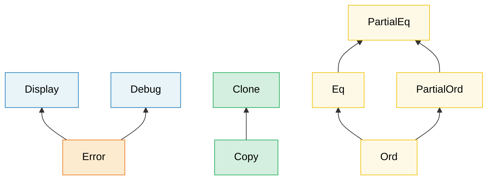

# 2. トレイトを極める 🟡

> **学べること:**
> - 関連型 vs ジェネリック型パラメータ — それぞれの使い分けと設計基準
> - GAT（総称関連型）、ブランケット実装、マーカートレイト、および dyn 互換性（旧オブジェクト安全性）ルール
> - 内部構造としての vtable（仮想関数テーブル）とファットポインタの仕組み
> - 拡張トレイト、Enumディスパッチ、型付きコマンドパターン

## 関連型 vs ジェネリック型パラメータ

どちらもトレイトを異なる型と連携させるための仕組みですが、その目的は異なります：

```rust
// --- 関連型（ASSOCIATED TYPE）: 1つの型に対して実装は1つだけ ---
trait Iterator {
    type Item; // 各イテレータが生成する要素の種類は厳密に「1つ」

    fn next(&mut self) -> Option<Self::Item>;
}

// 常に i32 を返すカスタムイテレータ — 選択の余地はありません
struct Counter { max: i32, current: i32 }

impl Iterator for Counter {
    type Item = i32; // 実装ごとに Item 型はただ1つ決まる
    fn next(&mut self) -> Option<i32> {
        if self.current < self.max {
            self.current += 1;
            Some(self.current)
        } else {
            None
        }
    }
}

// --- ジェネリックパラメータ（GENERIC PARAMETER）: 1つの型に対して複数の実装が可能 ---
trait Convert<T> {
    fn convert(&self) -> T;
}

// 単一の型が、多くの変換先型に対して Convert を実装できます:
impl Convert<f64> for i32 {
    fn convert(&self) -> f64 { *self as f64 }
}
impl Convert<String> for i32 {
    fn convert(&self) -> String { self.to_string() }
}
```

**使い分けの基準**:

| 選択 | 使うべき場面 |
|------|--------------|
| **関連型** | 実装する型に対して、自然な出力/結果が厳密に「1つ」だけ存在する場合。<br>`Iterator::Item`、`Deref::Target`、`Add::Output` |
| **ジェネリックパラメータ** | ある型が、多くの異なる型に対してそのトレイトを有意義に実装できる場合。<br>`From<T>`、`AsRef<T>`、`PartialEq<Rhs>` |

**直感的な判断方法**: 「このイテレータの `Item` は何か？」と問うのが自然であれば、関連型を使います。「これは `f64` に変換できるか？ `String` に変換できるか？ `bool` に変換できるか？」と問うのが自然であれば、ジェネリックパラメータを使います。

```rust
// 標準ライブラリの実例: std::ops::Add
trait Add<Rhs = Self> {
    type Output; // 関連型 — 加算の結果となる型は1つ
    fn add(self, rhs: Rhs) -> Self::Output;
}

// Rhs はジェネリックパラメータ — Meters に対して異なる単位を加算可能:
struct Meters(f64);
struct Centimeters(f64);

impl Add<Meters> for Meters {
    type Output = Meters;
    fn add(self, rhs: Meters) -> Meters { Meters(self.0 + rhs.0) }
}
impl Add<Centimeters> for Meters {
    type Output = Meters;
    fn add(self, rhs: Centimeters) -> Meters { Meters(self.0 + rhs.0 / 100.0) }
}
```

### Generic Associated Types（GAT: 総称関連型）

Rust 1.65以降、関連型自体にジェネリックパラメータを持たせることができるようになりました。
これにより、**Lending Iterator（貸し出しイテレータ）** — 元のコレクションではなくイテレータ自体の借用に紐づく参照を返すイテレータ — が表現可能になりました：

```rust
// GAT なしでは、貸し出しイテレータを表現できませんでした:
// trait LendingIterator {
//     type Item<'a>;  // ← 1.65 より前はコンパイルエラー
// }

// GAT あり (Rust 1.65+):
trait LendingIterator {
    type Item<'a> where Self: 'a;

    fn next(&mut self) -> Option<Self::Item<'_>>;
}

// 例: 重複するウィンドウを順番に返すイテレータ
struct WindowIter<'data> {
    data: &'data [u8],
    pos: usize,
    window_size: usize,
}

impl<'data> LendingIterator for WindowIter<'data> {
    type Item<'a> = &'a [u8] where Self: 'a;

    fn next(&mut self) -> Option<&[u8]> {
        if self.pos + self.window_size <= self.data.len() {
            let window = &self.data[self.pos..self.pos + self.window_size];
            self.pos += 1;
            Some(window)
        } else {
            None
        }
    }
}
```

> **GATが必要となる場面**: Lending Iterator、ストリーミングパーサー、または関連型のライフタイムが `&self` の借用に依存する任意のトレイト。
> 一般的なコードでは、通常の関連型で十分です。

### スーパートレイトとトレイト階層

トレイトは他のトレイトを前提条件として要求でき、これによって階層構造を形成します：



> 矢印はサブトレイトからスーパートレイトを指しています: `Error` を実装するには `Display` と `Debug` の両方が必要です。

トレイトは、実装者に対して他のトレイトの実装を義務付けることができます：

```rust
use std::fmt;

// Display と Debug は Error のスーパートレイト
trait Error: fmt::Display + fmt::Debug {
    fn source(&self) -> Option<&(dyn Error + 'static)> { None }
}
// Error を実装する型はすべて、必ず Display と Debug も実装しなければならない

// 独自の階層を構築する例:
trait Identifiable {
    fn id(&self) -> u64;
}

trait Timestamped {
    fn created_at(&self) -> chrono::DateTime<chrono::Utc>;
}

// Entity は両方を要求する:
trait Entity: Identifiable + Timestamped {
    fn is_active(&self) -> bool;
}

// Entity を実装するには、3つすべての実装が必要:
struct User { id: u64, name: String, created: chrono::DateTime<chrono::Utc> }

impl Identifiable for User {
    fn id(&self) -> u64 { self.id }
}
impl Timestamped for User {
    fn created_at(&self) -> chrono::DateTime<chrono::Utc> { self.created }
}
impl Entity for User {
    fn is_active(&self) -> bool { true }
}
```

### ブランケット実装（Blanket Implementations）

特定の境界を満たす「すべての型」に対して一括でトレイトを実装します：

```rust
// 標準ライブラリの実例: Display を実装しているすべての型は自動的に ToString を獲得する
impl<T: fmt::Display> ToString for T {
    fn to_string(&self) -> String {
        format!("{self}")
    }
}
// これにより、i32、&str、独自のカスタム型など、Display を実装するすべての型で to_string() が使えます。

// 独自のブランケット実装:
trait Loggable {
    fn log(&self);
}

// Debug を実装するすべての型は自動的に Loggable になる:
impl<T: std::fmt::Debug> Loggable for T {
    fn log(&self) {
        eprintln!("[LOG] {self:?}");
    }
}

// これで任意の Debug 型に対して .log() が呼び出せます:
// 42.log();              // [LOG] 42
// "hello".log();         // [LOG] "hello"
// vec![1, 2, 3].log();   // [LOG] [1, 2, 3]
```

> **注意**: ブランケット実装は強力ですが後戻りができません — すでにブランケット実装でカバーされている型に対して、より特化した個別実装を追加することはできません（孤児ルールとコヒーレンス制約による）。慎重に設計してください。

### マーカートレイト（Marker Traits）

メソッドを持たないトレイトであり、型が特定の性質を備えていることを印付け（マーク）します：

```rust
// 標準ライブラリのマーカートレイト:
// Send    — スレッド間での所有権の転送が安全
// Sync    — 複数スレッド間での参照の共有（&T）が安全
// Unpin   — ピン留め（pin）された後も移動が可能で安全
// Sized   — コンパイル時にサイズが既知
// Copy    — memcpy によるビット単位の複製が可能

// 独自のマーカートレイト:
/// マーカー: このセンサは工場出荷時にキャリブレーション済みであることを示す
trait Calibrated {}

struct RawSensor { reading: f64 }
struct CalibratedSensor { reading: f64 }

impl Calibrated for CalibratedSensor {}

// キャリブレーション済みのセンサのみが本番環境で使用可能:
fn record_measurement<S: Calibrated>(sensor: &S) {
    // ...
}
// record_measurement(&RawSensor { reading: 0.0 }); // ❌ コンパイルエラー
// record_measurement(&CalibratedSensor { reading: 0.0 }); // ✅
```

これは第3章で解説する**型状態（Type-State）パターン**に直結する概念です。

### Dyn互換性（旧称「オブジェクト安全性」）

> **名称に関する注記**: この概念はRust 1.84まで「オブジェクト安全性（object safety）」と呼ばれていました。この用語は、Rustにオブジェクト指向的な「オブジェクト」が存在しないこと、またメモリ安全性そのものの話ではないことから、誤解を招きやすいものでした。要するに「そのトレイトを `dyn Trait` として使用できるか？」という問題です。現在のコンパイラは `the trait 'X' is not dyn compatible`（エラーコード `E0038`）と出力しますが、既存の記事やドキュメント、Stack Overflowの回答などでは依然として「object safe」と表記されていることが多いため、同じ概念だと理解してください。

すべてのトレイトが `dyn Trait` として使えるわけではありません。トレイトが **dyn互換（dyn compatible）** であるためには、以下の条件を満たす必要があります：

1. **`Sized` がスーパートレイトであってはならない** — すなわち、トレイトが `Self: Sized` を要求してはならない
2. メソッドに**ジェネリック型パラメータが存在しないこと** — ライフタイムパラメータはコード生成前に消去され、余分なvtableスロットを必要としないため許可されます
3. レシーバの型を除き、メソッドシグネチャのいかなる場所にも **`Self` が出現しないこと** — 引数および戻り値の両方に適用されます
4. **すべての関連関数がディスパッチ可能であるか、あるいはオプトアウトされていること。** ディスパッチ可能なメソッドは、`&self`、`&mut self`、`self: Box<Self>`、`self: Rc<Self>`、`self: Arc<Self>`、または `self: Pin<P>`（`P` は前述のいずれか）の型のレシーバを持つ必要があります。それ以外のもの — レシーバのない `fn create() -> Self` など — は、`where Self: Sized` を付与してvtableから除外する必要があります
5. **すべてのスーパートレイト自身がdyn互換であること** — この性質は継承されます
6. **関連定数を持たないこと**、および**ジェネリクスを持つ関連型（GAT）を持たないこと**。通常の関連型は問題ありませんが、使用時に `dyn Iterator<Item = u32>` のように型を具体的に指定する必要があり、単なる `dyn Iterator` は不可です
7. ディスパッチ可能なメソッドの戻り値型が**不透明型（opaque type）でないこと** — `async fn`（裏で `Future` 型を隠蔽する）も、戻り値位置の `impl Trait` も不可です

```rust
// ✅ dyn互換 — dyn Drawable として使用可能
trait Drawable {
    fn draw(&self);
    fn bounding_box(&self) -> (f64, f64, f64, f64);
}

let shapes: Vec<Box<dyn Drawable>> = vec![/* ... */]; // ✅ 動作する

// ❌ dyn互換ではない — レシーバ以外の場所で Self を参照している
trait Cloneable {
    fn clone_self(&self) -> Self;
    //                      ^^^^ "...because method `clone_self` references
    //                            the `Self` type in its return type"
}
// let items: Vec<Box<dyn Cloneable>> = ...; // ❌ コンパイルエラー

// ❌ 同じルールが引数位置にも適用 — PartialEq が dyn互換でないのはこのため
trait Comparable {
    fn equals(&self, other: &Self) -> bool;
    //                       ^^^^ "...references the `Self` type in this parameter"
}

// ⚠️ Box でラップしても解決しない — Box<Self> も依然として Self を指している
trait Spawner {
    fn spawn(&self) -> Box<Self>; // ❌ やはり dyn互換ではない
}

// ✅ 代わりに Box<dyn Trait> を返す — これは Self ではなく具象型です。
// これはトレイトオブジェクト経由でクローンを行う標準的なイディオムです:
trait CloneableDyn {
    fn clone_box(&self) -> Box<dyn CloneableDyn>;
}

// ❌ dyn互換ではない — ジェネリックメソッド
trait Converter {
    fn convert<T>(&self) -> T;
    //        ^^^ vtable は無限の単相化コピーを保持できない
}

// ✅ dyn互換 — ジェネリックライフタイムは問題なし。禁止されているのは型パラメータのみ
trait Tokenizer {
    fn first_token<'a>(&self, input: &'a str) -> &'a str;
    //            ^^^^ ライフタイムは消去されるため、1つの vtable スロットで十分
}

// ❌ dyn互換ではない — レシーバを持たない関連関数
trait Factory {
    fn create() -> Self;
    // "...because associated function `create` has no `self` parameter"
}

// ✅ 同じ関数を vtable からオプトアウト（除外）する — トレイトは再び dyn互換になる
trait FactoryFixed {
    fn describe(&self) -> String;          // ディスパッチ可能
    fn create() -> Self where Self: Sized; // vtable から除外される
}

// ❌ dyn互換ではない — dyn互換でないスーパートレイトから継承している。
//    Derived 自体に問題はなくとも、コンパイラは Base::make を指摘します。
trait Base {
    fn make() -> Self;
}
trait Derived: Base {
    fn show(&self);
}
// let d: &dyn Derived = ...; // ❌ コンパイルエラー（Base::make が原因）

// ❌ dyn互換ではない — 関連定数は vtable で表現できない
trait Sensor {
    const MAX: f64;
    //    ^^^ "...because it contains associated const `MAX`"
    fn read(&self) -> f64;
}
// 回避策: メソッドにする — `fn max_reading(&self) -> f64`。なお、ここには
// `where Self: Sized` のような逃げ道はありません。安定版（stable）では
// `const MAX: f64 where Self: Sized;` という構文自体が受理されません。

// ❌ dyn互換ではない — GAT は単一の型ではなく型の族（family）である
trait LendingIterator {
    type Item<'a> where Self: 'a;
    //   ^^^^ "...because it contains generic associated type `Item`"
    fn next(&mut self) -> Option<Self::Item<'_>>;
}
// これは上述の GAT の節の LendingIterator と同じです:
// 貸し出しイテレータの代償として、`dyn LendingIterator` は存在できません。

// ❌ dyn互換ではない — 不透明な戻り値型 (RPITIT)
trait Container {
    fn items(&self) -> impl Iterator<Item = u32>;
    //                 ^^^^ "...references an `impl Trait` type in its return type"
}

// ❌ dyn互換ではない — `async fn` も糖衣構文の裏で同じ問題を抱えている
trait DataStore {
    async fn get(&self, key: &str) -> Option<String>;
    // "...because method `get` is `async`"
}
// 両者の回避策: 自分で型消去を行い、具象の boxed トレイトオブジェクトを返す —
// `Box<dyn Iterator<Item = u32> + '_>` や
// `Pin<Box<dyn Future<Output = Option<String>> + '_>>` は通常の型であるため、
// 通常の vtable スロットを獲得できます。

// ⚠️ 値渡しの `self` はディスパッチ可能なレシーバではない — 暗黙に
//    `where Self: Sized` を意味する。トレイト自体は dyn互換のままですが、
//    そのメソッドは vtable に含まれず、`dyn Trait` 経由では呼び出せません:
trait Consume {
    fn describe(&self) -> String; // vtable に含まれる
    fn consume(self) -> String;   // 暗黙に `where Self: Sized`
}
// let t: &dyn Consume = &token;  // ✅ トレイトオブジェクト自体は有効
// boxed.consume();               // ❌ error[E0161]: cannot move a value of type `dyn Consume`
```

**回避策**:

```rust
// メソッドを vtable から除外するために `where Self: Sized` を追加:
trait MyTrait {
    fn regular_method(&self); // vtable に含まれる

    fn generic_method<T>(&self) -> T
    where
        Self: Sized; // vtable から除外 — dyn MyTrait 経由では呼び出せない
}

// これで dyn MyTrait は有効になりますが、generic_method は
// 具象型が判明している場合にのみ呼び出せます。
```

> **経験則**: `dyn Trait` を使う予定があるなら、メソッドをシンプルに保ちましょう — ジェネリック型パラメータを使わず、レシーバ以外で `Self` を使わず、スーパートレイトに `Sized` を指定しないことです。非対称性に注意してください：`trait Widget: Sized` は致命的（dyn互換にならない）ですが、個々のメソッドに対する `where Self: Sized` は上記のように公式に認められたオプトアウト手段です。迷ったときは `let _: Box<dyn YourTrait>;` と書いてコンパイラに尋ねてみましょう。

> **なぜ `AsyncFn` は dyn互換ではないのか**: Rust Reference では `AsyncFn`、`AsyncFnMut`、`AsyncFnOnce` を独立したルールとして挙げていますが、コンパイラのエラーを見ると実際には上記の GAT ルールの系（帰結）であることがわかります。標準ライブラリの定義にある総称関連型 `AsyncFnMut::CallRefFuture<'a>` が原因と指摘されます。一方、通常の `Fn`/`FnMut`/`FnOnce` にはそのようなメンバーが存在しないため dyn互換であり、`Box<dyn Fn(u32) -> u32>` は問題なく動作します。

> **参照**: 下記の RPITIT のセクションではトレイト定義で `-> impl Trait` を使用しています。これは便利ですが、トレイトの dyn互換性を損ないます。[Async Book — 第10章](../async-book/ch10-async-traits.html) では、`async fn` 側の問題と `Pin<Box<dyn Future>>` による回避策を詳しく扱っています。

### トレイトオブジェクトの内部構造 — vtable とファットポインタ

`&dyn Trait`（または `Box<dyn Trait>`）は**ファットポインタ（fat pointer）**であり、2マシンワードのサイズを持ちます：

```text
┌──────────────────────────────────────────────────┐
│  &dyn Drawable (64ビット環境では合計16バイト)    │
├──────────────┬───────────────────────────────────┤
│  data_ptr    │  vtable_ptr                       │
│  (8バイト)   │  (8バイト)                        │
│  ↓           │  ↓                                │
│  ┌─────────┐ │  ┌──────────────────────────────┐ │
│  │ Circle  │ │  │ <Circle as Drawable> の      │ │
│  │ {       │ │  │ vtable                       │ │
│  │  r: 5.0 │ │  │                              │ │
│  │ }       │ │  │  drop_in_place: 0x7f...a0    │ │
│  └─────────┘ │  │  size:           8           │ │
│              │  │  align:          8           │ │
│              │  │  draw:          0x7f...b4    │ │
│              │  │  bounding_box:  0x7f...c8    │ │
│              │  └──────────────────────────────┘ │
└──────────────┴───────────────────────────────────┘
```

**vtable経由の呼び出しの流れ**（例: `shape.draw()`）:

1. ファットポインタから `vtable_ptr` を読み出す（2番目のワード）
2. vtable をインデックス参照して `draw` 関数のポインタを見つける
3. `data_ptr` を `self` 引数として渡し、関数を呼び出す

これはコスト面では C++ の仮想関数ディスパッチと類似しています（呼び出しごとに1回のポインタ間接参照）。ただし Rust では、vtable ポインタをオブジェクトの内部ではなくファットポインタ側に保持するため、スタック上にある通常の `Circle` は vtable ポインタを一切持ちません。

```rust
trait Drawable {
    fn draw(&self);
    fn area(&self) -> f64;
}

struct Circle { radius: f64 }

impl Drawable for Circle {
    fn draw(&self) { println!("円を描画 r={}", self.radius); }
    fn area(&self) -> f64 { std::f64::consts::PI * self.radius * self.radius }
}

struct Square { side: f64 }

impl Drawable for Square {
    fn draw(&self) { println!("正方形を描画 s={}", self.side); }
    fn area(&self) -> f64 { self.side * self.side }
}

fn main() {
    let shapes: Vec<Box<dyn Drawable>> = vec![
        Box::new(Circle { radius: 5.0 }),
        Box::new(Square { side: 3.0 }),
    ];

    // 各要素はファットポインタ: (data_ptr, vtable_ptr)
    // Circle と Square の vtable は「異なります」
    for shape in &shapes {
        shape.draw();  // vtableディスパッチ → Circle::draw または Square::draw
        println!("  面積 = {:.2}", shape.area());
    }

    // サイズの比較:
    println!("size_of::<&Circle>()        = {}", size_of::<&Circle>());
    // → 8バイト（ポインタ1つ分 — コンパイラが具象型を知っている）
    println!("size_of::<&dyn Drawable>()  = {}", size_of::<&dyn Drawable>());
    // → 16バイト（data_ptr + vtable_ptr）
}
```

**パフォーマンスコストの比較**:

| 観点 | 静的ディスパッチ (`impl Trait` / ジェネリクス) | 動的ディスパッチ (`dyn Trait`) |
|------|----------------------------------------------|-------------------------------|
| 呼び出しオーバーヘッド | ゼロ — LLVMによってインライン化可能 | 呼び出しごとに1回のポインタ間接参照 |
| インライン化 | ✅ コンパイラがインライン化可能 | ❌ 不透明な関数ポインタ |
| バイナリサイズ | 肥大化しやすい（型ごとに1コピー） | 小さい（共有された1つの関数） |
| ポインタサイズ | 通常のポインタ（1ワード） | ファットポインタ（2ワード） |
| 異種型の混在コレクション | ❌ 不可 | ✅ `Vec<Box<dyn Trait>>` で可能 |

> **vtableのコストが問題になるケース**: トレイトメソッドを数百万回呼び出すようなタイトなループでは、間接参照やインライン化阻害によるオーバーヘッドが顕著になることがあります（2〜10倍遅くなることも）。一方、コールドパス、設定管理、プラグインアーキテクチャなどでは、`dyn Trait` のもたらす柔軟性はわずかなコストに見合う価値があります。

### 高階トレイト境界（HRTB: Higher-Ranked Trait Bounds）

特定のライフタイムではなく、*あらゆる*ライフタイムの参照に対して機能する関数が必要になる場合があります。ここで登場するのが `for<'a>` 構文です：

```rust
// 課題: この関数は、特定の1つのライフタイムだけでなく、
// 「任意の」ライフタイムを持つ参照を処理できるクロージャを必要としています。

// ❌ これでは制約が強すぎる — 'a が呼び出し側によって固定されてしまう:
// fn apply<'a, F: Fn(&'a str) -> &'a str>(f: F, data: &'a str) -> &'a str

// ✅ HRTB: F は起こり得る「すべての」ライフタイムに対して機能しなければならない:
fn apply<F>(f: F, data: &str) -> &str
where
    F: for<'a> Fn(&'a str) -> &'a str,
{
    f(data)
}

fn main() {
    let result = apply(|s| s.trim(), "  hello  ");
    println!("{result}"); // "hello"
}
```

**HRTBに遭遇するケース**:
- `Fn(&T) -> &U` トレイト — ほとんどの場合、コンパイラが自動的に `for<'a>` を推論します
- 異なる借用期間にまたがって機能しなければならないカスタムトレイト実装
- `serde` を用いたデシリアライズ: `for<'de> Deserialize<'de>`

```rust,ignore
// serde の DeserializeOwned は次のように定義されています:
// trait DeserializeOwned: for<'de> Deserialize<'de> {}
// 意味: 「任意のライフタイムを持つデータからデシリアライズ可能」
// （すなわち、結果が入力データのライフタイムを借用しない）

use serde::de::DeserializeOwned;

fn parse_json<T: DeserializeOwned>(input: &str) -> T {
    serde_json::from_str(input).unwrap()
}
```

> **実践的アドバイス**: 自分で明示的に `for<'a>` を書く機会は多くありません。主にクロージャ引数のトレイト境界に現れ、コンパイラが暗黙的に処理してくれます。しかしエラーメッセージ（「`for<'a> Fn(&'a ...)` の境界が期待されています」など）で見かけたときに、コンパイラが何を求めているのかを理解する上で重要です。

### `impl Trait` — 引数位置 vs 戻り値位置

`impl Trait` は2つの位置に出現し、**それぞれ意味が異なります**：

```rust
// --- 引数位置の impl Trait (APIT) ---
// 「呼び出し側が型を選ぶ」 — ジェネリックパラメータの糖衣構文
fn print_all(items: impl Iterator<Item = i32>) {
    for item in items { println!("{item}"); }
}
// 次と等価:
fn print_all_verbose<I: Iterator<Item = i32>>(items: I) {
    for item in items { println!("{item}"); }
}
// 呼び出し側が型を決定: print_all(vec![1,2,3].into_iter())
//                     print_all(0..10)

// --- 戻り値位置の impl Trait (RPIT) ---
// 「関数（実装）側が型を選ぶ」 — 関数が1つの具象型を選択して返す
fn evens(limit: i32) -> impl Iterator<Item = i32> {
    (0..limit).filter(|x| x % 2 == 0)
    // 実際の具象型は Filter<Range<i32>, Closure> ですが、
    // 呼び出し側には「何らかの Iterator<Item = i32>」としか見えません
}
```

**重要な違い**:

| 項目 | APIT (`fn foo(x: impl T)`) | RPIT (`fn foo() -> impl T`) |
|---|---|---|
| 誰が型を選ぶか？ | 呼び出し側 | 関数自身（関数の実装コード） |
| 単相化されるか？ | はい — 型ごとに1つのコピー | はい — 1つの具象型 |
| ターボフィッシュ（Turbofish） | 不可（`foo::<X>()` は使えない） | 該当なし |
| 何と等価か | `fn foo<X: T>(x: X)` | 存在型（Existential type） |

#### トレイト定義における RPIT（RPITIT）

Rust 1.75以降、トレイトのメソッド定義において `-> impl Trait` を直接記述できるようになりました：

```rust
trait Container {
    fn items(&self) -> impl Iterator<Item = &str>;
    //                 ^^^^ 実装ごとに独自の具象型を返せる
}

struct CsvRow {
    fields: Vec<String>,
}

impl Container for CsvRow {
    fn items(&self) -> impl Iterator<Item = &str> {
        self.fields.iter().map(String::as_str)
    }
}

struct FixedFields;

impl Container for FixedFields {
    fn items(&self) -> impl Iterator<Item = &str> {
        ["host", "port", "timeout"].into_iter()
    }
}
```

> **Rust 1.75 より前**は、これをトレイト内で実現するには `Box<dyn Iterator>` を使うか、関連型を定義する必要がありました。RPITIT により不要なヒープ割り当てを排除できます。
>
> **ただし dyn互換性は失われます**: `-> impl Trait` は不透明な戻り値型であるため、`dyn Container` は拒絶されます（[dyn互換性](#dyn互換性旧称オブジェクト安全性)のルール7を参照）。トレイトオブジェクトが必要な場合は、ヒープ割り当てのコストを受け入れて `Box<dyn Iterator<Item = &str> + '_>` を返す設計を維持してください。

#### `impl Trait` vs `dyn Trait` — 意思決定ガイド

```text
コンパイル時に具象型が判明しているか？
├── はい → impl Trait またはジェネリクスを使用（ゼロコスト、インライン化可能）
└── いいえ → 異種型の混在コレクションが必要か？
     ├── はい → dyn Trait（Box<dyn T>, &dyn T）を使用
     └── いいえ → APIの境界を越えて「同一の」トレイトオブジェクトを共有する必要があるか？
          ├── はい → dyn Trait を使用
          └── いいえ → ジェネリクス / impl Trait を使用
```

| 機能 | `impl Trait` | `dyn Trait` |
|------|-------------|------------|
| ディスパッチ | 静的（単相化） | 動的（vtable） |
| パフォーマンス | 最高（インライン化可能） | 呼び出しごとに1回の間接参照 |
| 異種型の混在コレクション | ❌ | ✅ |
| 型ごとのバイナリサイズ | 型ごとに1コピー | 共有コード |
| トレイトの dyn互換性が必要か | 不要 | 必要 |
| トレイト定義内での利用 | ✅ (Rust 1.75+) | 常に可能 |

***

## `Any` と `TypeId` による型消去

C言語の `void*` や C# の `object` のように、*未知*の型の値を保存し、後からダウンキャストしたい場合があります。Rust では `std::any::Any` を通じてこれを提供します：

```rust
use std::any::Any;

// 異種型の値を保存・ログ出力する:
fn log_value(value: &dyn Any) {
    if let Some(s) = value.downcast_ref::<String>() {
        println!("String: {s}");
    } else if let Some(n) = value.downcast_ref::<i32>() {
        println!("i32: {n}");
    } else {
        // TypeId により実行時に型を検査可能:
        println!("未知の型: {:?}", value.type_id());
    }
}

// プラグインシステム、イベントバス、ECS風アーキテクチャに有用:
struct AnyMap(std::collections::HashMap<std::any::TypeId, Box<dyn Any + Send>>);

impl AnyMap {
    fn new() -> Self { AnyMap(std::collections::HashMap::new()) }

    fn insert<T: Any + Send + 'static>(&mut self, value: T) {
        self.0.insert(std::any::TypeId::of::<T>(), Box::new(value));
    }

    fn get<T: Any + Send + 'static>(&self) -> Option<&T> {
        self.0.get(&std::any::TypeId::of::<T>())?
            .downcast_ref()
    }
}

fn main() {
    let mut map = AnyMap::new();
    map.insert(42_i32);
    map.insert(String::from("hello"));

    assert_eq!(map.get::<i32>(), Some(&42));
    assert_eq!(map.get::<String>().map(|s| s.as_str()), Some("hello"));
    assert_eq!(map.get::<f64>(), None); // 挿入されていない
}
```

> **`Any` を使うべき場面**: プラグイン/拡張システム、型をインデックスとするマップ（`typemap`）、エラーのダウンキャスト（`anyhow::Error::downcast_ref`）。型の集合がコンパイル時に分かっている場合はジェネリクスやトレイトオブジェクトを優先してください — `Any` はコンパイル時の安全性を柔軟性と引き換えにする最後の手段です。

***

## 拡張トレイト（Extension Traits） — 所有していない型へのメソッド追加

Rustの孤児ルール（orphan rule）により、外部クレートの型に対して外部クレートのトレイトを実装することはできません。
拡張トレイトはこの制約に対する標準的な回避策です：自作クレート内で**新しいトレイト**を定義し、ある境界を満たすすべての型に対してそのトレイトをブランケット実装します。呼び出し側がそのトレイトを `use` でインポートすれば、既存の型に新しいメソッドが生えたように見えます。

このパターンは Rust エコシステム全体で広く使われています：`itertools::Itertools`、`futures::StreamExt`、`tokio::io::AsyncReadExt`、`tower::ServiceExt` など。

### 課題

```rust
// f64 を生成するすべてのイテレータに .mean() メソッドを追加したい。
// しかし Iterator は std で定義され、f64 はプリミティブであるため、孤児ルールに阻まれる:
//
// impl<I: Iterator<Item = f64>> I {   // ❌ 外部の型に固有メソッドを追加することはできない
//     fn mean(self) -> f64 { ... }
// }
```

### 解決策: 拡張トレイト

```rust
/// 数値を生成するイテレータのための拡張メソッド
pub trait IteratorExt: Iterator {
    /// 算術平均を計算する。空のイテレータの場合は `None` を返す。
    fn mean(self) -> Option<f64>
    where
        Self: Sized,
        Self::Item: Into<f64>;
}

// ブランケット実装 — 条件を満たすすべてのイテレータに自動的に適用される
impl<I: Iterator> IteratorExt for I {
    fn mean(self) -> Option<f64>
    where
        Self: Sized,
        Self::Item: Into<f64>,
    {
        let mut sum: f64 = 0.0;
        let mut count: u64 = 0;
        for item in self {
            sum += item.into();
            count += 1;
        }
        if count == 0 { None } else { Some(sum / count as f64) }
    }
}

// 使用法 — トレイトをインポートするだけ:
use crate::IteratorExt;  // インポートするだけで、すべてのイテレータにメソッドが現れる

fn analyze_temperatures(readings: &[f64]) -> Option<f64> {
    readings.iter().copied().mean()  // .mean() が利用可能！
}

fn analyze_sensor_data(data: &[i32]) -> Option<f64> {
    data.iter().copied().mean()  // i32 でも動作する (i32: Into<f64>)
}
```

### 実践例: 診断結果（Diagnostic Result）の拡張

```rust
use std::collections::HashMap;

struct DiagResult {
    component: String,
    passed: bool,
    message: String,
}

/// Vec<DiagResult> のための拡張トレイト — ドメイン固有の集計メソッドを追加
pub trait DiagResultsExt {
    fn passed_count(&self) -> usize;
    fn failed_count(&self) -> usize;
    fn overall_pass(&self) -> bool;
    fn failures_by_component(&self) -> HashMap<String, Vec<&DiagResult>>;
}

impl DiagResultsExt for Vec<DiagResult> {
    fn passed_count(&self) -> usize {
        self.iter().filter(|r| r.passed).count()
    }

    fn failed_count(&self) -> usize {
        self.iter().filter(|r| !r.passed).count()
    }

    fn overall_pass(&self) -> bool {
        self.iter().all(|r| r.passed)
    }

    fn failures_by_component(&self) -> HashMap<String, Vec<&DiagResult>> {
        let mut map = HashMap::new();
        for r in self.iter().filter(|r| !r.passed) {
            map.entry(r.component.clone()).or_default().push(r);
        }
        map
    }
}

// これで任意の Vec<DiagResult> がこれらのメソッドを持つようになる:
fn report(results: Vec<DiagResult>) {
    if !results.overall_pass() {
        let failures = results.failures_by_component();
        for (component, fails) in &failures {
            eprintln!("{component}: {} 件の失敗", fails.len());
        }
    }
}
```

### 命名規則

Rust エコシステムでは一貫して `Ext` 接尾辞を使用します：

| クレート | 拡張トレイト | 拡張対象 |
|----------|--------------|----------|
| `itertools` | `Itertools` | `Iterator` |
| `futures` | `StreamExt`, `FutureExt` | `Stream`, `Future` |
| `tokio` | `AsyncReadExt`, `AsyncWriteExt` | `AsyncRead`, `AsyncWrite` |
| `tower` | `ServiceExt` | `Service` |
| `bytes` | `BufMut`（一部） | `&mut [u8]` |
| 自作クレート | `DiagResultsExt` | `Vec<DiagResult>` |

### 使い分け

| 状況 | 拡張トレイトを使うべきか？ |
|------|:---:|
| 外部の型に便利なメソッドを追加したい | ✅ |
| ジェネリックなコレクションにドメイン固有のロジックを集約したい | ✅ |
| メソッドが型のプライベートフィールドにアクセスする必要がある | ❌（ラッパー/ニュータイプを使用） |
| メソッドが自分が管理している新しい型に論理的に属している | ❌（その型の固有メソッドとして追加する） |
| トレイトのインポートなしでメソッドを使えるようにしたい | ❌（固有メソッドのみ可能） |

***

## Enumディスパッチ — `dyn` なしの静的ポリモーフィズム

トレイトを実装する型の集合が**クローズド（既知・有限）**である場合、`dyn Trait` の代わりに具象型をバリアントとして保持する enum を使用できます。これにより、呼び出し側のインターフェースを維持したまま、vtableの間接参照やヒープ割り当てを完全に排除できます。

### `dyn Trait` の問題点

```rust
trait Sensor {
    fn read(&self) -> f64;
    fn name(&self) -> &str;
}

struct Gps { lat: f64, lon: f64 }
struct Thermometer { temp_c: f64 }
struct Accelerometer { g_force: f64 }

impl Sensor for Gps {
    fn read(&self) -> f64 { self.lat }
    fn name(&self) -> &str { "GPS" }
}
impl Sensor for Thermometer {
    fn read(&self) -> f64 { self.temp_c }
    fn name(&self) -> &str { "温度計" }
}
impl Sensor for Accelerometer {
    fn read(&self) -> f64 { self.g_force }
    fn name(&self) -> &str { "加速度計" }
}

// dyn を使った異種コレクション — 動作するがコストがある:
fn read_all_dyn(sensors: &[Box<dyn Sensor>]) -> Vec<f64> {
    sensors.iter().map(|s| s.read()).collect()
    // 各 .read() は vtable 間接参照を経由する
    // 各 Box はヒープ割り当てを行う
}
```

### Enumディスパッチによる解決策

```rust
// トレイトオブジェクトを列挙型（enum）に置き換える:
enum AnySensor {
    Gps(Gps),
    Thermometer(Thermometer),
    Accelerometer(Accelerometer),
}

impl AnySensor {
    fn read(&self) -> f64 {
        match self {
            AnySensor::Gps(s) => s.read(),
            AnySensor::Thermometer(s) => s.read(),
            AnySensor::Accelerometer(s) => s.read(),
        }
    }

    fn name(&self) -> &str {
        match self {
            AnySensor::Gps(s) => s.name(),
            AnySensor::Thermometer(s) => s.name(),
            AnySensor::Accelerometer(s) => s.name(),
        }
    }
}

// ヒープ割り当てなし、vtableなし、インラインにメモリ配置:
fn read_all(sensors: &[AnySensor]) -> Vec<f64> {
    sensors.iter().map(|s| s.read()).collect()
    // 各 .read() は match 分岐 — コンパイラがすべてインライン化可能
}

fn main() {
    let sensors = vec![
        AnySensor::Gps(Gps { lat: 47.6, lon: -122.3 }),
        AnySensor::Thermometer(Thermometer { temp_c: 72.5 }),
        AnySensor::Accelerometer(Accelerometer { g_force: 1.02 }),
    ];

    for sensor in &sensors {
        println!("{}: {:.2}", sensor.name(), sensor.read());
    }
}
```

### Enum自体にトレイトを実装する

相互運用性を高めるため、Enum自体に元のトレイトを実装することができます：

```rust
impl Sensor for AnySensor {
    fn read(&self) -> f64 {
        match self {
            AnySensor::Gps(s) => s.read(),
            AnySensor::Thermometer(s) => s.read(),
            AnySensor::Accelerometer(s) => s.read(),
        }
    }

    fn name(&self) -> &str {
        match self {
            AnySensor::Gps(s) => s.name(),
            AnySensor::Thermometer(s) => s.name(),
            AnySensor::Accelerometer(s) => s.name(),
        }
    }
}

// これで AnySensor は、ジェネリクス経由で Sensor が期待される任意の場所で利用可能になります:
fn report<S: Sensor>(s: &S) {
    println!("{}: {:.2}", s.name(), s.read());
}
```

### マクロによるボイラープレートの削減

match アームの委譲コードは冗長になりがちです。マクロを使えばこれを簡潔に記述できます：

```rust
macro_rules! dispatch_sensor {
    ($self:expr, $method:ident $(, $arg:expr)*) => {
        match $self {
            AnySensor::Gps(s) => s.$method($($arg),*),
            AnySensor::Thermometer(s) => s.$method($($arg),*),
            AnySensor::Accelerometer(s) => s.$method($($arg),*),
        }
    };
}

impl Sensor for AnySensor {
    fn read(&self) -> f64     { dispatch_sensor!(self, read) }
    fn name(&self) -> &str    { dispatch_sensor!(self, name) }
}
```

規模の大きいプロジェクトでは、`enum_dispatch` クレートを使用することでこの処理を完全に自動化できます：

```rust
use enum_dispatch::enum_dispatch;

#[enum_dispatch]
trait Sensor {
    fn read(&self) -> f64;
    fn name(&self) -> &str;
}

#[enum_dispatch(Sensor)]
enum AnySensor {
    Gps,
    Thermometer,
    Accelerometer,
}
// すべての委譲コードが自動生成される
```

### `dyn Trait` vs Enumディスパッチ — 意思決定ガイド

```text
型の集合はクローズド（コンパイル時に判明している）か？
├── はい → Enumディスパッチを優先（高速、ヒープ割り当てなし）
│         ├── バリアントが少数（20未満）？     → 手動で enum を定義
│         └── バリアントが多数、または増加予定？ → enum_dispatch クレート
└── いいえ → dyn Trait を使う必要がある（プラグイン、ユーザー提供の型）
```

| 特性 | `dyn Trait` | Enumディスパッチ |
|------|:-----------:|:---------------:|
| ディスパッチコスト | vtable間接参照（約2ns） | 分岐予測（約0.3ns） |
| ヒープ割り当て | 通常あり（Box） | なし（インライン） |
| キャッシュ効率 | 低い（ポインタ追跡） | 高い（連続配置） |
| 新しい型へのオープン性 | ✅（誰でも実装可能） | ❌（クローズドな集合） |
| コードサイズ | 共有 | バリアントごとにコピー |
| トレイトの dyn互換性 | 必要 | 不要 |
| バリアントの追加 | 既存コードの変更不要 | enum と match アームの更新が必要 |

### Enumディスパッチの適用シナリオ

| シナリオ | 推奨方針 |
|----------|----------|
| 診断テストの種類（CPU、GPU、NIC、メモリなど） | ✅ Enumディスパッチ — クローズドであり、コンパイル時に既知 |
| バスプロトコル（SPI、I2C、UARTなど） | ✅ Enumディスパッチ または 設定トレイト |
| プラグインシステム（実行時に .so をロード） | ❌ `dyn Trait` を使用 |
| 2〜3個のバリアント | ✅ 手動での Enumディスパッチ |
| 10個以上のバリアントと多数のメソッド | ✅ `enum_dispatch` クレート |
| パフォーマンスが極めて重要なインナーループ | ✅ Enumディスパッチ（vtableを排除） |

***

## ケイパビリティ・ミックスイン — ゼロコスト合成としての関連型

Ruby開発者は**ミックスイン（mixin）**を用いて振る舞いを合成します（`include SomeModule` でクラスにメソッドを注入）。Rustのトレイトにおいて、**関連型 + デフォルトメソッド + ブランケット実装**を組み合わせることで、これと同じ合成を実現できます。しかも以下の利点があります：

* すべてが**コンパイル時**に解決される — `method_missing` のような実行時の予期せぬエラーがない
* 各関連型が「調整ノブ」となり、デフォルトメソッドが生成する振る舞いをカスタマイズできる
* コンパイラが各組み合わせを**単相化**する — vtable オーバーヘッドはゼロ

### 課題: 横断的なハードウェアバスの依存関係

ハードウェアの診断ルーチンには共通の操作（IPMIセンサの読み取り、GPIOレールの切り替え、SPI経由の温度サンプリングなど）が多く存在します。しかし、診断の種類によって必要な組み合わせは異なります。Rustには継承階層が存在せず、すべてのバスハンドルを関数の引数として渡し回すとシグネチャが肥大化します。必要なバスのケイパビリティ（機能）をアラカルト形式で**ミックスイン**する手段が求められます。

### ステップ 1 — 「構成要素（Ingredient）」トレイトの定義

各構成要素は、関連型を通じて1つのハードウェア機能を提供します：

```rust
use std::io;

// ── バス抽象化（ハードウェアチームが提供するトレイト） ──────────
pub trait SpiBus {
    fn spi_transfer(&self, tx: &[u8], rx: &mut [u8]) -> io::Result<()>;
}

pub trait I2cBus {
    fn i2c_read(&self, addr: u8, reg: u8, buf: &mut [u8]) -> io::Result<()>;
    fn i2c_write(&self, addr: u8, reg: u8, data: &[u8]) -> io::Result<()>;
}

pub trait GpioPin {
    fn set_high(&self) -> io::Result<()>;
    fn set_low(&self) -> io::Result<()>;
    fn read_level(&self) -> io::Result<bool>;
}

pub trait IpmiBmc {
    fn raw_command(&self, net_fn: u8, cmd: u8, data: &[u8]) -> io::Result<Vec<u8>>;
    fn read_sensor(&self, sensor_id: u8) -> io::Result<f64>;
}

// ── 構成要素トレイト — バスごとに1つ、関連型を保持 ───
pub trait HasSpi {
    type Spi: SpiBus;
    fn spi(&self) -> &Self::Spi;
}

pub trait HasI2c {
    type I2c: I2cBus;
    fn i2c(&self) -> &Self::I2c;
}

pub trait HasGpio {
    type Gpio: GpioPin;
    fn gpio(&self) -> &Self::Gpio;
}

pub trait HasIpmi {
    type Ipmi: IpmiBmc;
    fn ipmi(&self) -> &Self::Ipmi;
}
```

各構成要素は非常に小さく、ジェネリックであり、単体でテスト可能です。

### ステップ 2 — 「ミックスイン」トレイトの定義

ミックスイントレイトは、必要な構成要素をスーパートレイトとして宣言し、すべてのメソッドを**デフォルト実装**として提供します — 実装側はこれらを無償で獲得できます：

```rust
/// ミックスイン: ファン診断 — I2C（タコメータ） + GPIO（PWM有効化）が必要
pub trait FanDiagMixin: HasI2c + HasGpio {
    /// I2C経由でタコメータICからファンの回転数（RPM）を読み取る
    fn read_fan_rpm(&self, fan_id: u8) -> io::Result<u32> {
        let mut buf = [0u8; 2];
        self.i2c().i2c_read(0x48 + fan_id, 0x00, &mut buf)?;
        Ok(u16::from_be_bytes(buf) as u32 * 60) // カウント値 → RPM 変換
    }

    /// GPIO経由でファンPWM出力を有効化/無効化する
    fn set_fan_pwm(&self, enable: bool) -> io::Result<()> {
        if enable { self.gpio().set_high() }
        else      { self.gpio().set_low() }
    }

    /// ファン健全性チェック — RPMを読み取り閾値内か検証する
    fn check_fan_health(&self, fan_id: u8, min_rpm: u32) -> io::Result<bool> {
        let rpm = self.read_fan_rpm(fan_id)?;
        Ok(rpm >= min_rpm)
    }
}

/// ミックスイン: 温度監視 — SPI（熱電対ADC） + IPMI（BMCセンサ）が必要
pub trait TempMonitorMixin: HasSpi + HasIpmi {
    /// SPI ADC（MAX31855など）経由で熱電対の値を読み取る
    fn read_thermocouple(&self) -> io::Result<f64> {
        let mut rx = [0u8; 4];
        self.spi().spi_transfer(&[0x00; 4], &mut rx)?;
        let raw = i32::from_be_bytes(rx) >> 18; // 14ビット符号付き
        Ok(raw as f64 * 0.25)
    }

    /// IPMI経由でBMC管理下の温度センサを読み取る
    fn read_bmc_temp(&self, sensor_id: u8) -> io::Result<f64> {
        self.ipmi().read_sensor(sensor_id)
    }

    /// 相互検証: 熱電対とBMCセンサの値が許容誤差（delta）内に収まっているか確認する
    fn validate_temps(&self, sensor_id: u8, max_delta: f64) -> io::Result<bool> {
        let tc = self.read_thermocouple()?;
        let bmc = self.read_bmc_temp(sensor_id)?;
        Ok((tc - bmc).abs() <= max_delta)
    }
}

/// ミックスイン: 電源シーケンス — GPIO（レール有効化） + IPMI（イベントログ）が必要
pub trait PowerSeqMixin: HasGpio + HasIpmi {
    /// Power-Good GPIO をアサートし、IPMIセンサで検証する
    fn enable_power_rail(&self, sensor_id: u8) -> io::Result<bool> {
        self.gpio().set_high()?;
        std::thread::sleep(std::time::Duration::from_millis(50));
        let voltage = self.ipmi().read_sensor(sensor_id)?;
        Ok(voltage > 0.8) // 公称値の80%以上なら正常
    }

    /// 電源を遮断し、IPMI OEMコマンド経由でシャットダウンを記録する
    fn disable_power_rail(&self) -> io::Result<()> {
        self.gpio().set_low()?;
        // BMCに OEM "power rail disabled" イベントを記録
        self.ipmi().raw_command(0x2E, 0x01, &[0x00, 0x01])?;
        Ok(())
    }
}
```

### ステップ 3 — ブランケット実装による「完全自動ミックスイン」

必要な構成要素を実装するだけで、自動的にメソッド群が付与されます：

```rust
impl<T: HasI2c + HasGpio>  FanDiagMixin    for T {}
impl<T: HasSpi  + HasIpmi>  TempMonitorMixin for T {}
impl<T: HasGpio + HasIpmi>  PowerSeqMixin   for T {}
```

適切な構成要素トレイトを実装した構造体は、ボイラープレートや転送メソッド、継承を書くことなく、**自動的に**すべてのミックスインメソッドを獲得します。

### ステップ 4 — 本番環境への接続

```rust
// ── 具象バス実装（Linuxプラットフォーム） ────────────────
struct LinuxSpi  { dev: String }
struct LinuxI2c  { dev: String }
struct SysfsGpio { pin: u32 }
struct IpmiTool  { timeout_secs: u32 }

impl SpiBus for LinuxSpi {
    fn spi_transfer(&self, _tx: &[u8], _rx: &mut [u8]) -> io::Result<()> {
        // spidev ioctl — 簡略化のため省略
        Ok(())
    }
}
impl I2cBus for LinuxI2c {
    fn i2c_read(&self, _addr: u8, _reg: u8, _buf: &mut [u8]) -> io::Result<()> {
        // i2c-dev ioctl — 簡略化のため省略
        Ok(())
    }
    fn i2c_write(&self, _addr: u8, _reg: u8, _data: &[u8]) -> io::Result<()> { Ok(()) }
}
impl GpioPin for SysfsGpio {
    fn set_high(&self) -> io::Result<()>  { /* /sys/class/gpio */ Ok(()) }
    fn set_low(&self) -> io::Result<()>   { Ok(()) }
    fn read_level(&self) -> io::Result<bool> { Ok(true) }
}
impl IpmiBmc for IpmiTool {
    fn raw_command(&self, _nf: u8, _cmd: u8, _data: &[u8]) -> io::Result<Vec<u8>> {
        // ipmitool 呼び出し — 簡略化のため省略
        Ok(vec![])
    }
    fn read_sensor(&self, _id: u8) -> io::Result<f64> { Ok(25.0) }
}

// ── 本番用プラットフォーム — 4つのバスすべてを統合 ─────────────────────────
struct DiagPlatform {
    spi:  LinuxSpi,
    i2c:  LinuxI2c,
    gpio: SysfsGpio,
    ipmi: IpmiTool,
}

impl HasSpi  for DiagPlatform { type Spi  = LinuxSpi;  fn spi(&self)  -> &LinuxSpi  { &self.spi  } }
impl HasI2c  for DiagPlatform { type I2c  = LinuxI2c;  fn i2c(&self)  -> &LinuxI2c  { &self.i2c  } }
impl HasGpio for DiagPlatform { type Gpio = SysfsGpio; fn gpio(&self) -> &SysfsGpio { &self.gpio } }
impl HasIpmi for DiagPlatform { type Ipmi = IpmiTool;  fn ipmi(&self) -> &IpmiTool  { &self.ipmi } }

// DiagPlatform はすべてのミックスインメソッドを使用可能:
fn production_diagnostics(platform: &DiagPlatform) -> io::Result<()> {
    let rpm = platform.read_fan_rpm(0)?;       // FanDiagMixin より
    let tc  = platform.read_thermocouple()?;   // TempMonitorMixin より
    let ok  = platform.enable_power_rail(42)?;  // PowerSeqMixin より
    println!("ファン: {rpm} RPM, 温度: {tc}°C, 電源: {ok}");
    Ok(())
}
```

### ステップ 5 — モックを用いたテスト（実機ハードウェア不要）

```rust
#[cfg(test)]
mod tests {
    use super::*;
    use std::cell::Cell;

    struct MockSpi  { temp: Cell<f64> }
    struct MockI2c  { rpm: Cell<u32> }
    struct MockGpio { level: Cell<bool> }
    struct MockIpmi { sensor_val: Cell<f64> }

    impl SpiBus for MockSpi {
        fn spi_transfer(&self, _tx: &[u8], rx: &mut [u8]) -> io::Result<()> {
            // モックの温度を MAX31855 形式にエンコード
            let raw = ((self.temp.get() / 0.25) as i32) << 18;
            rx.copy_from_slice(&raw.to_be_bytes());
            Ok(())
        }
    }
    impl I2cBus for MockI2c {
        fn i2c_read(&self, _addr: u8, _reg: u8, buf: &mut [u8]) -> io::Result<()> {
            let tach = (self.rpm.get() / 60) as u16;
            buf.copy_from_slice(&tach.to_be_bytes());
            Ok(())
        }
        fn i2c_write(&self, _: u8, _: u8, _: &[u8]) -> io::Result<()> { Ok(()) }
    }
    impl GpioPin for MockGpio {
        fn set_high(&self)  -> io::Result<()>   { self.level.set(true);  Ok(()) }
        fn set_low(&self)   -> io::Result<()>   { self.level.set(false); Ok(()) }
        fn read_level(&self) -> io::Result<bool> { Ok(self.level.get()) }
    }
    impl IpmiBmc for MockIpmi {
        fn raw_command(&self, _: u8, _: u8, _: &[u8]) -> io::Result<Vec<u8>> { Ok(vec![]) }
        fn read_sensor(&self, _: u8) -> io::Result<f64> { Ok(self.sensor_val.get()) }
    }

    // ── 部分的プラットフォーム: ファン関連のバスのみ ─────────────────
    struct FanTestRig {
        i2c:  MockI2c,
        gpio: MockGpio,
    }
    impl HasI2c  for FanTestRig { type I2c  = MockI2c;  fn i2c(&self)  -> &MockI2c  { &self.i2c  } }
    impl HasGpio for FanTestRig { type Gpio = MockGpio; fn gpio(&self) -> &MockGpio { &self.gpio } }
    // FanTestRig は FanDiagMixin を獲得するが、TempMonitorMixin や PowerSeqMixin は獲得しない

    #[test]
    fn fan_health_check_passes_above_threshold() {
        let rig = FanTestRig {
            i2c:  MockI2c  { rpm: Cell::new(6000) },
            gpio: MockGpio { level: Cell::new(false) },
        };
        assert!(rig.check_fan_health(0, 4000).unwrap());
    }

    #[test]
    fn fan_health_check_fails_below_threshold() {
        let rig = FanTestRig {
            i2c:  MockI2c  { rpm: Cell::new(2000) },
            gpio: MockGpio { level: Cell::new(false) },
        };
        assert!(!rig.check_fan_health(0, 4000).unwrap());
    }
}
```

`FanTestRig` は `HasI2c + HasGpio` のみを実装しているため、自動的に `FanDiagMixin` は獲得しますが、`HasSpi` が満たされていないため、コンパイラは `rig.read_thermocouple()` の呼び出しを**拒絶**します。これがコンパイル時に強制されるミックスインのスコープ制御です。

### 条件付きメソッド — Rubyの先を行く機能

個別のデフォルトメソッドに `where` 境界を追加できます。そのメソッドは、関連型が追加の境界を満たしている場合にのみ**存在**します：

```rust
/// DMA対応 SPIコントローラのマーカートレイト
pub trait DmaCapable: SpiBus {
    fn dma_transfer(&self, tx: &[u8], rx: &mut [u8]) -> io::Result<()>;
}

/// 割り込み対応 GPIOピンのマーカートレイト
pub trait InterruptCapable: GpioPin {
    fn wait_for_edge(&self, timeout_ms: u32) -> io::Result<bool>;
}

pub trait AdvancedDiagMixin: HasSpi + HasGpio {
    // 常に利用可能
    fn basic_probe(&self) -> io::Result<bool> {
        let mut rx = [0u8; 1];
        self.spi().spi_transfer(&[0xFF], &mut rx)?;
        Ok(rx[0] != 0x00)
    }

    // SPIコントローラが DMA をサポートしている場合にのみ存在
    fn bulk_sensor_read(&self, buf: &mut [u8]) -> io::Result<()>
    where
        Self::Spi: DmaCapable,
    {
        self.spi().dma_transfer(&vec![0x00; buf.len()], buf)
    }

    // GPIOピンが割り込みをサポートしている場合にのみ存在
    fn wait_for_fault_signal(&self, timeout_ms: u32) -> io::Result<bool>
    where
        Self::Gpio: InterruptCapable,
    {
        self.gpio().wait_for_edge(timeout_ms)
    }
}

impl<T: HasSpi + HasGpio> AdvancedDiagMixin for T {}
```

プラットフォームのSPIがDMAに対応していない場合、`bulk_sensor_read()` を呼び出すと実行時クラッシュではなく**コンパイルエラー**になります。Ruby の `respond_to?` によるチェックに似ていますが、判定は実行時ではなくコンパイル時に行われます。

### 合成性: ミックスインの積み重ね

複数のミックスインが同じ構成要素を共有できます — 多重継承のような菱形継承問題（diamond problem）は発生しません：

```text
┌─────────────┐    ┌───────────┐    ┌──────────────┐
│ FanDiagMixin│    │TempMonitor│    │ PowerSeqMixin│
│  (I2C+GPIO) │    │ (SPI+IPMI)│    │  (GPIO+IPMI) │
└──────┬──────┘    └─────┬─────┘    └──────┬───────┘
       │                 │                 │
       │   ┌─────────────┴─────────────┐   │
       └──►│      DiagPlatform         │◄──┘
           │ HasSpi+HasI2c+HasGpio     │
           │        +HasIpmi           │
           └───────────────────────────┘
```

`DiagPlatform` は `HasGpio` を**1回**だけ実装し、`FanDiagMixin` と `PowerSeqMixin` の双方が同じ `self.gpio()` を使用します。Ruby では2つのモジュールが共に `self.gpio_pin` を呼び出すことになりますが、異なるピン番号を期待していた場合は実行時まで衝突がわかりません。Rust では型レベルで曖昧さを排除できます。

### 比較: Rubyのミックスイン vs Rustのケイパビリティ・ミックスイン

| 観点 | Rubyのミックスイン | Rustのケイパビリティ・ミックスイン |
|------|-------------------|-----------------------------------|
| ディスパッチ | 実行時（メソッドテーブルの探索） | コンパイル時（単相化） |
| 安全な合成 | MRO（探索順序）の線形化が競合を隠蔽 | コンパイラが曖昧さを拒絶 |
| 条件付きメソッド | 実行時に `respond_to?` | コンパイル時に `where` 境界 |
| オーバーヘッド | メソッド呼び出し + GC | ゼロコスト（インライン化） |
| テスタビリティ | メタプログラミングによるスタブ/モック | モック型に対するジェネリクス |
| 新しいバスの追加 | 実行時に `include` | 構成要素トレイトを追加して再コンパイル |
| 実行時の柔軟性 | `extend`、`prepend`、オープンクラス | なし（完全に静的） |

### ケイパビリティ・ミックスインの使いどころ

| シナリオ | ミックスインを使うべきか？ |
|----------|:---:|
| 複数の診断ルーチンでバス読み取りロジックを共有する | ✅ |
| テストハーネスでバスの異なる部分集合が必要 | ✅（部分的な構成要素構造体） |
| 特定のバス機能（DMA、IRQ）でのみ有効なメソッド | ✅（条件付き `where` 境界） |
| 実行時のモジュール動的読み込みが必要（プラグイン） | ❌（`dyn Trait` または Enumディスパッチ） |
| 1つのバスしか持たない単一構造体 — 共有不要 | ❌（シンプルに保つ） |
| クレート境界を跨ぎ、コヒーレンス制約（孤児ルール）に抵触する | ⚠️（ニュータイプラッパーを使用） |

> **重要ポイント — ケイパビリティ・ミックスイン**
>
> 1. **構成要素トレイト** = 関連型 + アクセサメソッド（例: `HasSpi`）
> 2. **ミックスイントレイト** = 構成要素に対するスーパートレイト境界 + デフォルトメソッド本体
> 3. **ブランケット実装** = `impl<T: HasX + HasY> Mixin for T {}` — メソッドの自動注入
> 4. **条件付きメソッド** = 個別のデフォルトメソッドに対する `where Self::Spi: DmaCapable`
> 5. **部分プラットフォーム** = 必要な構成要素のみを実装したテスト用構造体
> 6. **実行時コストゼロ** — コンパイラがプラットフォーム型ごとに特殊化されたコードを生成

***

## 型付きコマンド — GADTスタイルの戻り値型安全性

Haskellでは、**一般化代数データ型（GADT: Generalised Algebraic Data Types）**を用いることで、データ型の各コンストラクタが型パラメータを精密化（refine）できます。これにより `Expr Int` や `Expr Bool` が型チェッカーによって厳格に強制されます。Rustには直接的なGADT構文はありませんが、**関連型を持つトレイト**によって同様の保証を実現できます。コマンド型がレスポンスの型を**一意に決定**し、それらを混同することはコンパイルエラーとなります。

このパターンはハードウェア診断において特に強力です。IPMIコマンド、レジスタ読み取り、センサクエリはそれぞれ異なる物理量を返し、決して取り違えてはならないからです。

### 課題: 型付けされていない `Vec<u8>` の沼

C/C++ の多くの IPMI スタック — そして安易に移植された Rust コード — では、至る所で生のバイト列が使用されます：

```rust
use std::io;

struct BmcConnectionUntyped { timeout_secs: u32 }

impl BmcConnectionUntyped {
    fn raw_command(&self, net_fn: u8, cmd: u8, data: &[u8]) -> io::Result<Vec<u8>> {
        // ... ipmitool を呼び出す ...
        Ok(vec![0x00, 0x19, 0x00]) // スタブ
    }
}

fn diagnose_thermal_untyped(bmc: &BmcConnectionUntyped) -> io::Result<()> {
    // CPU温度の読み取り — センサID 0x20
    let raw = bmc.raw_command(0x04, 0x2D, &[0x20])?;
    let cpu_temp = raw[0] as f64;  // 🤞 バイト0が測定値であることを祈る

    // ファン速度の読み取り — センサID 0x30
    let raw = bmc.raw_command(0x04, 0x2D, &[0x30])?;
    let fan_rpm = raw[0] as u32;  // 🐛 バグ: ファン速度はリトルエンディアンの2バイト

    // 入力電圧の読み取り — センサID 0x40
    let raw = bmc.raw_command(0x04, 0x2D, &[0x40])?;
    let voltage = raw[0] as f64;  // 🐛 バグ: 1000 で割る必要がある（mV → V）

    // 🐛 °C と RPM を比較 — コンパイルは通るが意味不明
    if cpu_temp > fan_rpm as f64 {
        println!("問題が発生しました");
    }

    // 🐛 電圧を温度として渡している — 警告なくコンパイルが通ってしまう
    log_temp_untyped(voltage);
    log_volts_untyped(cpu_temp);

    Ok(())
}

fn log_temp_untyped(t: f64)  { println!("温度: {t}°C"); }
fn log_volts_untyped(v: f64) { println!("電圧: {v}V"); }
```

**すべての測定値が `f64`** になってしまっています — コンパイラは、ある値が温度であり、別の値がRPMであり、また別の値が電圧であることを知り得ません。以下の4つの異なるバグが、何のエラーも警告もなくコンパイルを通ってしまいます：

| # | バグの内容 | 影響 | 発覚のタイミング |
|---|------------|------|------------------|
| 1 | ファン回転数を2バイトではなく1バイトとしてパース | 6400 RPM のはずが 25 RPM と誤読 | 本番運用中、午前3時のファン異常アラート乱発 |
| 2 | 電圧を1000で割り忘れた | 12.0V のはずが 12000V となる | 閾値判定で全電源ユニット（PSU）が異常判定 |
| 3 | °C と RPM を比較している | 無意味な真偽値判定 | おそらく永遠に気づかれない |
| 4 | 電圧を `log_temp_untyped()` に渡した | ログ内の暗黙的なデータ破損 | 半年後、過去のログを調査した時 |

### 解決策: 関連型を用いた型付きコマンド

#### ステップ 1 — ドメイン固有のニュータイプ（Newtype）

```rust
#[derive(Debug, Clone, Copy, PartialEq, PartialOrd)]
struct Celsius(f64);

#[derive(Debug, Clone, Copy, PartialEq, PartialOrd)]
struct Rpm(u32);

#[derive(Debug, Clone, Copy, PartialEq, PartialOrd)]
struct Volts(f64);

#[derive(Debug, Clone, Copy, PartialEq, PartialOrd)]
struct Watts(f64);
```

#### ステップ 2 — コマンドトレイト（GADTに相当）

関連型 `Response` が鍵となります — 各コマンドをその戻り値型と強固に結びつけます：

```rust
trait IpmiCmd {
    /// GADT の「型インデックス」 — execute() が何を返すかを決定する
    type Response;

    fn net_fn(&self) -> u8;
    fn cmd_byte(&self) -> u8;
    fn payload(&self) -> Vec<u8>;

    /// パース処理は「ここ」にカプセル化される — 各コマンドが自身のバイトレイアウトを熟知している
    fn parse_response(&self, raw: &[u8]) -> io::Result<Self::Response>;
}
```

#### ステップ 3 — コマンドごとに構造体を定義し、パース処理を一度だけ記述

```rust
struct ReadTemp { sensor_id: u8 }
impl IpmiCmd for ReadTemp {
    type Response = Celsius;  // ← 「このコマンドは温度を返す」
    fn net_fn(&self) -> u8 { 0x04 }
    fn cmd_byte(&self) -> u8 { 0x2D }
    fn payload(&self) -> Vec<u8> { vec![self.sensor_id] }
    fn parse_response(&self, raw: &[u8]) -> io::Result<Celsius> {
        // IPMI SDR 仕様に基づく符号付きバイト — 記述もテストも一度きり
        Ok(Celsius(raw[0] as i8 as f64))
    }
}

struct ReadFanSpeed { fan_id: u8 }
impl IpmiCmd for ReadFanSpeed {
    type Response = Rpm;     // ← 「このコマンドは RPM を返す」
    fn net_fn(&self) -> u8 { 0x04 }
    fn cmd_byte(&self) -> u8 { 0x2D }
    fn payload(&self) -> Vec<u8> { vec![self.fan_id] }
    fn parse_response(&self, raw: &[u8]) -> io::Result<Rpm> {
        // 2バイトリトルエンディアン — 正しいレイアウトを一度だけ定義
        Ok(Rpm(u16::from_le_bytes([raw[0], raw[1]]) as u32))
    }
}

struct ReadVoltage { rail: u8 }
impl IpmiCmd for ReadVoltage {
    type Response = Volts;   // ← 「このコマンドは電圧を返す」
    fn net_fn(&self) -> u8 { 0x04 }
    fn cmd_byte(&self) -> u8 { 0x2D }
    fn payload(&self) -> Vec<u8> { vec![self.rail] }
    fn parse_response(&self, raw: &[u8]) -> io::Result<Volts> {
        // ミリボルト → ボルト変換、常に正確
        Ok(Volts(u16::from_le_bytes([raw[0], raw[1]]) as f64 / 1000.0))
    }
}

struct ReadFru { fru_id: u8 }
impl IpmiCmd for ReadFru {
    type Response = String;
    fn net_fn(&self) -> u8 { 0x0A }
    fn cmd_byte(&self) -> u8 { 0x11 }
    fn payload(&self) -> Vec<u8> { vec![self.fru_id, 0x00, 0x00, 0xFF] }
    fn parse_response(&self, raw: &[u8]) -> io::Result<String> {
        Ok(String::from_utf8_lossy(raw).to_string())
    }
}
```

#### ステップ 4 — 実行エンジン（エグゼキュータ: `dyn` なし、単相化）

```rust
struct BmcConnection { timeout_secs: u32 }

impl BmcConnection {
    /// 任意のコマンドに対してジェネリック — コンパイラがコマンド型ごとに1つのバージョンを生成
    fn execute<C: IpmiCmd>(&self, cmd: &C) -> io::Result<C::Response> {
        let raw = self.raw_send(cmd.net_fn(), cmd.cmd_byte(), &cmd.payload())?;
        cmd.parse_response(&raw)
    }

    fn raw_send(&self, _nf: u8, _cmd: u8, _data: &[u8]) -> io::Result<Vec<u8>> {
        Ok(vec![0x19, 0x00]) // スタブ — 実際の実装では ipmitool を呼び出す
    }
}
```

#### ステップ 5 — 呼び出し側コード: 4つのバグすべてがコンパイルエラーになる

```rust
fn diagnose_thermal(bmc: &BmcConnection) -> io::Result<()> {
    let cpu_temp: Celsius = bmc.execute(&ReadTemp { sensor_id: 0x20 })?;
    let fan_rpm:  Rpm     = bmc.execute(&ReadFanSpeed { fan_id: 0x30 })?;
    let voltage:  Volts   = bmc.execute(&ReadVoltage { rail: 0x40 })?;

    // バグ #1 — 発生不可能: パース処理は ReadFanSpeed::parse_response に隠蔽
    // バグ #2 — 発生不可能: スケール変換は ReadVoltage::parse_response に隠蔽

    // バグ #3 — コンパイルエラー:
    // if cpu_temp > fan_rpm { }
    //    ^^^^^^^^   ^^^^^^^
    //    Celsius    Rpm      → 型の不一致（mismatched types） ❌

    // バグ #4 — コンパイルエラー:
    // log_temperature(voltage);
    //                 ^^^^^^^  Volts が渡されたが、Celsius が期待されている ❌

    // 正しい比較のみがコンパイルを通る:
    if cpu_temp > Celsius(85.0) {
        println!("CPUが過熱しています: {:?}", cpu_temp);
    }
    if fan_rpm < Rpm(4000) {
        println!("ファンの回転数が低すぎます: {:?}", fan_rpm);
    }

    Ok(())
}

fn log_temperature(t: Celsius) { println!("温度: {:?}", t); }
fn log_voltage(v: Volts)       { println!("電圧: {:?}", v); }
```

### 診断スクリプト用マクロDSL

多数のコマンドを連続して実行する大規模な診断ルーチンでは、マクロを使用することで完全な型安全性を維持しながら簡潔な宣言的構文を実現できます：

```rust
/// 一連の型付き IPMI コマンドを実行し、結果のタプルを返す。
/// タプルの各要素は、各コマンド固有の Response 型を持つ。
macro_rules! diag_script {
    ($bmc:expr; $($cmd:expr),+ $(,)?) => {{
        ( $( $bmc.execute(&$cmd)?, )+ )
    }};
}

fn full_pre_flight(bmc: &BmcConnection) -> io::Result<()> {
    // 展開後: (Celsius, Rpm, Volts, String) — すべての型が厳格に追跡される
    let (temp, rpm, volts, board_pn) = diag_script!(bmc;
        ReadTemp     { sensor_id: 0x20 },
        ReadFanSpeed { fan_id:    0x30 },
        ReadVoltage  { rail:      0x40 },
        ReadFru      { fru_id:    0x00 },
    );

    println!("ボード型番: {:?}", board_pn);
    println!("CPU: {:?}, ファン: {:?}, 12V: {:?}", temp, rpm, volts);

    // 型安全な閾値チェック:
    assert!(temp  < Celsius(95.0), "CPUの温度が高すぎます");
    assert!(rpm   > Rpm(3000),     "ファンの回転数が遅すぎます");
    assert!(volts > Volts(11.4),   "12Vレールの電圧が低下しています");

    Ok(())
}
```

このマクロは単なる糖衣構文です — タプル型 `(Celsius, Rpm, Volts, String)` はコンパイラによって完全に推論されます。2つのコマンドの順序を入れ替えると、実行時ではなくコンパイル時にパターンマッチの分解がエラーになります。

### 異種コマンドリストのためのEnumディスパッチ

JSONから読み込んだ設定可能なスクリプトなど、異なるコマンドが混在した `Vec` が必要な場合は、Enumディスパッチを用いることで `dyn` を使わずに実装できます：

```rust
enum AnyReading {
    Temp(Celsius),
    Rpm(Rpm),
    Volt(Volts),
    Text(String),
}

enum AnyCmd {
    Temp(ReadTemp),
    Fan(ReadFanSpeed),
    Voltage(ReadVoltage),
    Fru(ReadFru),
}

impl AnyCmd {
    fn execute(&self, bmc: &BmcConnection) -> io::Result<AnyReading> {
        match self {
            AnyCmd::Temp(c)    => Ok(AnyReading::Temp(bmc.execute(c)?)),
            AnyCmd::Fan(c)     => Ok(AnyReading::Rpm(bmc.execute(c)?)),
            AnyCmd::Voltage(c) => Ok(AnyReading::Volt(bmc.execute(c)?)),
            AnyCmd::Fru(c)     => Ok(AnyReading::Text(bmc.execute(c)?)),
        }
    }
}

/// 動的診断スクリプト — 実行時に読み込まれるコマンド群
fn run_script(bmc: &BmcConnection, script: &[AnyCmd]) -> io::Result<Vec<AnyReading>> {
    script.iter().map(|cmd| cmd.execute(bmc)).collect()
}
```

要素ごとの個別型の追跡は失われますが（すべて `AnyReading` に包まれる）、実行時の柔軟性が得られ、かつパース処理自体は各 `IpmiCmd` 実装の中に綺麗にカプセル化されたままです。

### 型付きコマンドのテスト

```rust
#[cfg(test)]
mod tests {
    use super::*;

    struct StubBmc {
        responses: std::collections::HashMap<u8, Vec<u8>>,
    }

    impl StubBmc {
        fn execute<C: IpmiCmd>(&self, cmd: &C) -> io::Result<C::Response> {
            let key = cmd.payload()[0]; // センサIDをキーとする
            let raw = self.responses.get(&key)
                .ok_or_else(|| io::Error::new(io::ErrorKind::NotFound, "スタブデータがありません"))?;
            cmd.parse_response(raw)
        }
    }

    #[test]
    fn read_temp_parses_signed_byte() {
        let bmc = StubBmc {
            responses: [( 0x20, vec![0xE7] )].into() // i8 としての -25 = 0xE7
        };
        let temp = bmc.execute(&ReadTemp { sensor_id: 0x20 }).unwrap();
        assert_eq!(temp, Celsius(-25.0));
    }

    #[test]
    fn read_fan_parses_two_byte_le() {
        let bmc = StubBmc {
            responses: [( 0x30, vec![0x00, 0x19] )].into() // 0x1900 = 6400
        };
        let rpm = bmc.execute(&ReadFanSpeed { fan_id: 0x30 }).unwrap();
        assert_eq!(rpm, Rpm(6400));
    }

    #[test]
    fn read_voltage_scales_millivolts() {
        let bmc = StubBmc {
            responses: [( 0x40, vec![0xE8, 0x2E] )].into() // 0x2EE8 = 12008 mV
        };
        let v = bmc.execute(&ReadVoltage { rail: 0x40 }).unwrap();
        assert!((v.0 - 12.008).abs() < 0.001);
    }
}
```

各コマンドのパース処理は完全に独立してテストできます。もし IPMI 仕様の改定により `ReadFanSpeed` が「2バイトLE」から「4バイトBE」に変更されたとしても、更新すべき `parse_response` は**1箇所**だけであり、既存のテストがリグレッションを確実に捕捉します。

### HaskellのGADTとの対応関係

```text
Haskell GADT                         Rustの対応機能
────────────────                     ───────────────────────
data Cmd a where                     trait IpmiCmd {
  ReadTemp :: SensorId -> Cmd Temp       type Response;
  ReadFan  :: FanId    -> Cmd Rpm        ...
                                     }

eval :: Cmd a -> IO a                fn execute<C: IpmiCmd>(&self, cmd: &C)
                                         -> io::Result<C::Response>

case 分岐における型の精密化         単相化: コンパイラが以下を生成
                                     execute::<ReadTemp>() → Celsius を返す
                                     execute::<ReadFanSpeed>() → Rpm を返す
```

どちらも**コマンドが戻り値の型を一意に決定する**ことを保証します。Rust はこれを型レベルの case 分析ではなくジェネリクスの単相化によって達成しており、同等の安全性を実行時コストゼロで実現しています。

### 導入前後の比較まとめ

| 比較項目 | 型なし (`Vec<u8>`) | 型付きコマンド |
|----------|:---:|:---:|
| センサあたりの行数 | 約3行（呼び出し箇所ごとに重複） | 約15行（1回書いて1回テスト） |
| パースエラー発生の可能性 | 全ての呼び出し箇所 | 単一の `parse_response` 実装内のみ |
| 単位混同バグ | 無限に発生し得る | ゼロ（コンパイルエラー） |
| 新規センサの追加 | N個のファイルを修正、パースをコピペ | 構造体1つ + impl 1つを追加 |
| 実行時オーバーヘッド | — | 同等（単相化される） |
| IDEオートコンプリート | 至る所に `f64` | `Celsius`、`Rpm`、`Volts` — 自己文書化 |
| コードレビューの負担 | 生バイトパースを毎回検証 | センサごとに1つの `parse_response` を検証 |
| マクロDSL | 不可 | `diag_script!(bmc; ReadTemp{..}, ReadFan{..})` → `(Celsius, Rpm)` |
| 動的スクリプト | 手動ディスパッチ | `AnyCmd` 列挙型 — それでも `dyn` 不要 |

### 型付きコマンドの使いどころ

| シナリオ | 推奨方針 |
|----------|:--------:|
| 物理単位が明確に異なる IPMI センサ読み取り | ✅ 型付きコマンド |
| フィールド幅が異なるレジスタマップ | ✅ 型付きコマンド |
| ネットワークプロトコルメッセージ（リクエスト → レスポンス） | ✅ 型付きコマンド |
| 戻り値フォーマットが1種類しかない単一コマンド型 | ❌ オーバースペック — 直接戻り値型を返せばよい |
| 未知のデバイスに対するプロトタイピング/初期調査 | ❌ まずは生バイト列で、後から型付けする |
| コマンドがコンパイル時に確定しないプラグインシステム | ⚠️ `AnyCmd` による Enumディスパッチを検討 |

> **重要ポイント — トレイト**
> - 関連型 = 型ごとに1つの実装。ジェネリックパラメータ = 型ごとに複数の実装
> - GAT により、Lending Iterator やトレイト内非同期処理のパターンが実現可能に
> - クローズドな型の集合には Enumディスパッチ（高速）を、オープンな型の集合には `dyn Trait`（柔軟）を使用する
> - コンパイル時に型が不明な場合の脱出ハッチとして `Any` + `TypeId` がある

> **参照:** 単相化およびジェネリクスによるコード膨張については [第1章 — ジェネリクス](ch01-generics-the-full-picture.md) を参照してください。設定トレイトパターンとトレイトの活用については [第3章 — ニュータイプと型状態](ch03-the-newtype-and-type-state-patterns.md) を参照してください。

---

### 演習問題: 関連型を持つリポジトリ ★★★（目安: 約40分）

関連型 `Error`、`Id`、`Item` を持つ `Repository` トレイトを設計してください。これをインメモリのデータストアに対して実装し、コンパイル時の型安全性を実証してください。

<details>
<summary>🔑 解答例</summary>

```rust
use std::collections::HashMap;

trait Repository {
    type Item;
    type Id;
    type Error;

    fn get(&self, id: &Self::Id) -> Result<Option<&Self::Item>, Self::Error>;
    fn insert(&mut self, item: Self::Item) -> Result<Self::Id, Self::Error>;
    fn delete(&mut self, id: &Self::Id) -> Result<bool, Self::Error>;
}

#[derive(Debug, Clone)]
struct User {
    name: String,
    email: String,
}

struct InMemoryUserRepo {
    data: HashMap<u64, User>,
    next_id: u64,
}

impl InMemoryUserRepo {
    fn new() -> Self {
        InMemoryUserRepo { data: HashMap::new(), next_id: 1 }
    }
}

impl Repository for InMemoryUserRepo {
    type Item = User;
    type Id = u64;
    type Error = std::convert::Infallible;

    fn get(&self, id: &u64) -> Result<Option<&User>, Self::Error> {
        Ok(self.data.get(id))
    }

    fn insert(&mut self, item: User) -> Result<u64, Self::Error> {
        let id = self.next_id;
        self.next_id += 1;
        self.data.insert(id, item);
        Ok(id)
    }

    fn delete(&mut self, id: &u64) -> Result<bool, Self::Error> {
        Ok(self.data.remove(id).is_some())
    }
}

fn create_and_fetch<R: Repository>(repo: &mut R, item: R::Item) -> Result<(), R::Error>
where
    R::Item: std::fmt::Debug,
    R::Id: std::fmt::Debug,
{
    let id = repo.insert(item)?;
    println!("IDで挿入完了: {id:?}");
    let retrieved = repo.get(&id)?;
    println!("取得結果: {retrieved:?}");
    Ok(())
}

fn main() {
    let mut repo = InMemoryUserRepo::new();
    create_and_fetch(&mut repo, User {
        name: "Alice".into(),
        email: "alice@example.com".into(),
    }).unwrap();
}
```

</details>

***
