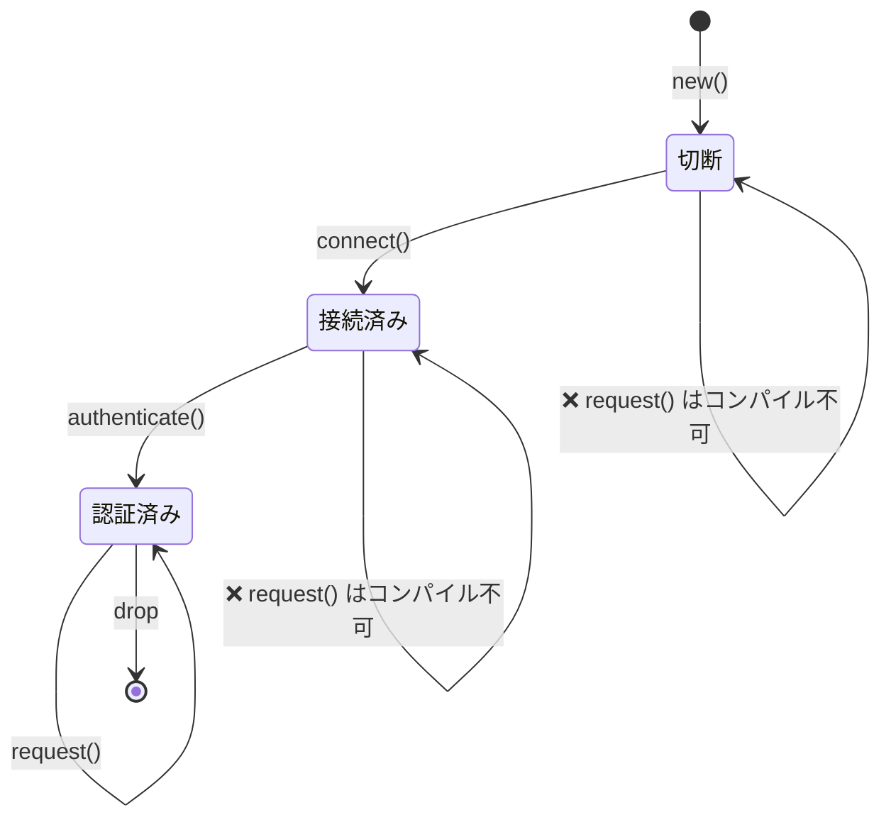
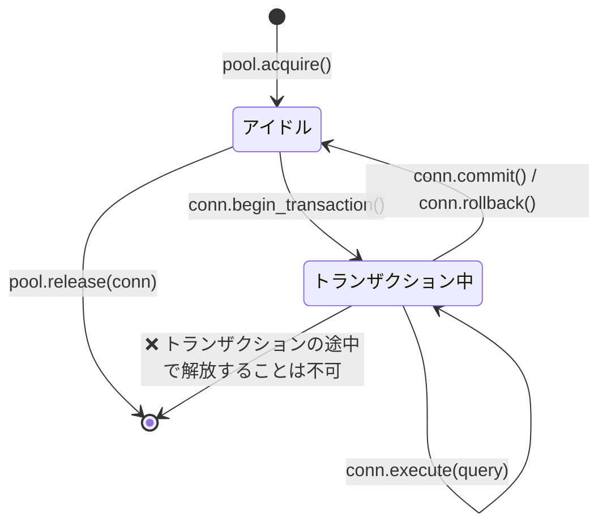
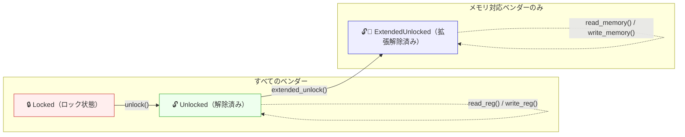
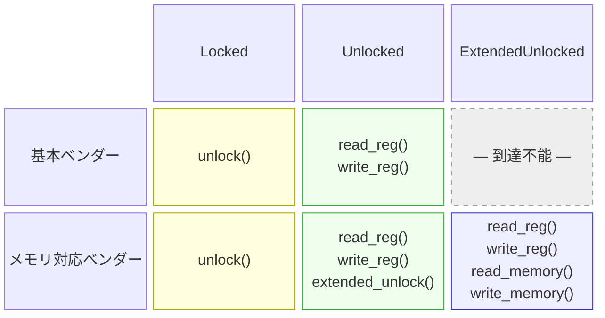

# 3. ニュータイプと型状態（Type-State）パターン 🟡

> **学べること:**
> - ゼロコストでコンパイル時の型安全性を実現するニュータイプ（Newtype）パターン
> - 不正な状態遷移をコンパイル時に表現不可能にする型状態（Type-State）パターン
> - コンパイル時に必須フィールドの設定を保証する型状態ビルダーパターン
> - ジェネリック型パラメータの爆発を抑え込む設定トレイト（Config Trait）パターン

## ニュータイプ: ゼロコストの型安全性

ニュータイプパターンとは、既存の型を単一フィールドのタプル構造体でラップし、実行時オーバーヘッドなしに独立した新しい型を作り出す手法です：

```rust
// ニュータイプを使わない場合 — 引数の順序を取り違えやすい:
fn create_user(name: String, email: String, age: u32, employee_id: u32) { }
// create_user(name, email, age, id);  — もし age と id を逆に渡してしまったら？
// create_user(name, email, id, age);  — 正常にコンパイルが通ってしまい、深刻なバグに

// ニュータイプを使う場合 — コンパイラが間違いを検出してくれる:
struct UserName(String);
struct Email(String);
struct Age(u32);
struct EmployeeId(u32);

fn create_user(name: UserName, email: Email, age: Age, id: EmployeeId) { }
// create_user(name, email, EmployeeId(42), Age(30));
// ❌ コンパイルエラー: Age が期待されている箇所に EmployeeId が渡されました
```

### ニュータイプに対する `impl Deref` — 強力さと落とし穴

ニュータイプに対して `Deref` を実装すると、内部の型の参照へと自動的に型強制（Deref coercion）されるようになり、内部の型のメソッド群が「無償で」すべて利用可能になります：

```rust
use std::ops::Deref;

struct Email(String);

impl Email {
    fn new(raw: &str) -> Result<Self, &'static str> {
        if raw.contains('@') {
            Ok(Email(raw.to_string()))
        } else {
            Err("無効なメールアドレス: @ が含まれていません")
        }
    }
}

impl Deref for Email {
    type Target = str;
    fn deref(&self) -> &str { &self.0 }
}

// これで Email は自動的に &str へデリファレンス（Deref）されます:
let email = Email::new("user@example.com").unwrap();
println!("長さ: {}", email.len()); // Deref 経由で str::len を使用
```

これは一見便利ですが、内部の型の*あらゆる*メソッドがラッパー型から呼び出せるようになるため、ニュータイプが築いた抽象化の境界に**事実上の大穴を開ける**ことになります。

#### `Deref` の実装が「適切」な場合

| シナリオ | 実例 | 適切な理由 |
|----------|------|-----------|
| スマートポインタラッパー | `Box<T>`、`Arc<T>`、`MutexGuard<T>` | ラッパーの本来の目的が `T` のように振る舞うことだから |
| 透過的な「薄い」ラッパー | `String` → `str`、`PathBuf` → `Path`、`Vec<T>` → `[T]` | ラッパーが対象の型の真のスーパーセット（拡張）であるため |
| ニュータイプが本質的に内部の型そのものである場合 | `struct Hostname(String)` で、常に完全な文字列操作を許可したい場合 | APIを制限することに価値がないため |

#### `Deref` が「アンチパターン」となる場合

| シナリオ | 問題点 |
|----------|--------|
| **不変条件（Invariant）を持つドメイン型** | `Email` が `&str` にデリファレンスされると、呼び出し側は `.split_at()` や `.trim()` などを呼べてしまいます。これらは「@ を含む」という不変条件を保証しません。トリムされた `&str` から再構築された場合、不変条件が崩れるリスクがあります。 |
| **制限されたAPIを提供したい型** | `struct Password(String)` に `Deref<Target = str>` を実装すると、隠蔽すべき `.as_bytes()`、`.chars()`、`Debug` 出力などがすべて漏洩してしまいます。 |
| **疑似的な継承** | `ManagerWidget` を `Widget` に自動デリファレンスさせるために `Deref` を使うのは、OOPの継承を模倣する行為です。これは明確に非推奨とされています（Rust API Guidelines C-DEREF を参照）。 |

> **経験則**: ニュータイプが「型安全性を高める」あるいは「APIを制限する」ために存在しているなら、`Deref` を実装してはいけません。一方、スマートポインタのように内部の型の全機能を維持しつつ「機能や権限を追加する」ために存在しているなら、`Deref` は適切な選択肢です。

#### `DerefMut` — リスクが倍増する

`DerefMut` まで実装してしまうと、呼び出し側が内部の値を直接*変更*できるようになり、コンストラクタで行ったあらゆるバリデーション（検証）を完全にバイパスされてしまいます：

```rust
use std::ops::{Deref, DerefMut};

struct PortNumber(u16);

impl Deref for PortNumber {
    type Target = u16;
    fn deref(&self) -> &u16 { &self.0 }
}

impl DerefMut for PortNumber {
    fn deref_mut(&mut self) -> &mut u16 { &mut self.0 }
}

let mut port = PortNumber(443);
*port = 0; // バリデーションを無視して直接書き換え可能 — 不正なポート番号になってしまう
```

内部の型に保護すべき不変条件が一切存在しない場合にのみ、`DerefMut` の実装を検討してください。

#### 代替案: 明示的な委譲（Explicit Delegation）

内部の型が持つメソッドの一部だけを公開したい場合は、明示的な委譲メソッドを定義します：

```rust
struct Email(String);

impl Email {
    fn new(raw: &str) -> Result<Self, &'static str> {
        if raw.contains('@') { Ok(Email(raw.to_string())) }
        else { Err("@ が見つかりません") }
    }

    // 意味のあるメソッドのみを公開する:
    pub fn as_str(&self) -> &str { &self.0 }
    pub fn len(&self) -> usize { self.0.len() }
    pub fn domain(&self) -> &str {
        self.0.split('@').nth(1).unwrap_or("")
    }
    // .split_at() や .trim(), .replace() などは公開しない
}
```

#### Clippy とエコシステムのベストプラクティス

- **`clippy::wrong_self_convention`**: `Deref` の型強制により、意図したメソッド解決がシャドーイングされたり狂ったりした際に警告されることがあります。
- **Rust API Guidelines (C-DEREF)** では、*「スマートポインタのみが `Deref` を実装すべきである」*と明記されています。これを強力なデフォルト方針とし、例外は明確な正当化理由がある場合のみにしてください。
- トレイトの互換性（例: `&str` を期待する関数に `Email` を渡したい）が必要な場合は、代わりに `AsRef<str>` や `Borrow<str>` を実装することを検討してください。予期せぬ自動型強制を伴わない明示的な変換が可能です。

#### 意思決定マトリクス

```text
内部の型の「すべての」メソッドを呼び出し可能にしたいか？
  ├─ はい → 不変条件を保護したりAPIを制限したりする必要があるか？
  │    ├─ いいえ → impl Deref ✅（スマートポインタ / 透過的ラッパー）
  │    └─ はい   → Deref は実装しない ❌（不変条件の漏洩）
  └─ いいえ → Deref は実装しない ❌（AsRef や明示的委譲を使用）
```

### 型状態（Type-State）: コンパイル時のプロトコル強制

型状態パターンは、型システムを利用して操作が正しい順序で実行されることを強制します。不正な状態は**表現不可能（unrepresentable）**になります。



> 各状態遷移は `self` を**消費（ムーブ）**して新しい型を返します — コンパイラが正しい操作順序を強制します。

```rust
// 課題: 以下のプロトコルを順守しなければならないネットワーク接続:
// 1. 作成（new）
// 2. 接続（connect）
// 3. 認証（authenticate）
// 4. その後リクエスト送信（request）
// authenticate() の前に request() を呼ぶとコンパイルエラーになるべき。

// --- 型状態マーカー（ゼロサイズ型: ZST） ---
struct Disconnected;
struct Connected;
struct Authenticated;

// --- 状態でパラメータ化された接続構造体 ---
struct Connection<State> {
    address: String,
    _state: std::marker::PhantomData<State>,
}

// Disconnected（切断）状態の接続のみが connect できる:
impl Connection<Disconnected> {
    fn new(address: &str) -> Self {
        Connection {
            address: address.to_string(),
            _state: std::marker::PhantomData,
        }
    }

    fn connect(self) -> Connection<Connected> {
        println!("{} に接続中...", self.address);
        Connection {
            address: self.address,
            _state: std::marker::PhantomData,
        }
    }
}

// Connected（接続済み）状態の接続のみが authenticate できる:
impl Connection<Connected> {
    fn authenticate(self, _token: &str) -> Connection<Authenticated> {
        println!("認証中...");
        Connection {
            address: self.address,
            _state: std::marker::PhantomData,
        }
    }
}

// Authenticated（認証済み）状態の接続のみがリクエストを発行できる:
impl Connection<Authenticated> {
    fn request(&self, path: &str) -> String {
        format!("GET {} from {}", path, self.address)
    }
}

fn main() {
    let conn = Connection::new("api.example.com");
    // conn.request("/data"); // ❌ コンパイルエラー: Connection<Disconnected> に `request` メソッドは存在しません

    let conn = conn.connect();
    // conn.request("/data"); // ❌ コンパイルエラー: Connection<Connected> に `request` メソッドは存在しません

    let conn = conn.authenticate("secret-token");
    let response = conn.request("/data"); // ✅ 認証後にのみ呼び出し可能
    println!("{response}");
}
```

> **核心となるポイント**: 各状態遷移は `self` を**消費**し、新しい型のインスタンスを返します。
> 遷移前の古い状態は所有権がムーブされているため二度と使えません — コンパイラがこれを強制します。
> 実行時コストはゼロです — `PhantomData` はサイズが0であり、状態情報はコンパイル時に完全に消去されます。

**C++/C#との比較**: C++やC#では、これを実行時チェック（`if (!authenticated) throw ...`）で防ぐのが一般的です。Rustの型状態パターンは、これらのチェックをコンパイル時へと移行させます。不正な状態は型システム上、文字通り「記述不能」になります。

### 型状態ビルダーパターン

実践的な応用例として、必須フィールドの指定をコンパイル時に強制するビルダーを紹介します：

```rust
use std::marker::PhantomData;

// 必須フィールドの指定状態を表すマーカー型
struct NeedsName;
struct NeedsPort;
struct Ready;

struct ServerConfig<State> {
    name: Option<String>,
    port: Option<u16>,
    max_connections: usize, // オプション設定（デフォルト値あり）
    _state: PhantomData<State>,
}

impl ServerConfig<NeedsName> {
    fn new() -> Self {
        ServerConfig {
            name: None,
            port: None,
            max_connections: 100,
            _state: PhantomData,
        }
    }

    fn name(self, name: &str) -> ServerConfig<NeedsPort> {
        ServerConfig {
            name: Some(name.to_string()),
            port: self.port,
            max_connections: self.max_connections,
            _state: PhantomData,
        }
    }
}

impl ServerConfig<NeedsPort> {
    fn port(self, port: u16) -> ServerConfig<Ready> {
        ServerConfig {
            name: self.name,
            port: Some(port),
            max_connections: self.max_connections,
            _state: PhantomData,
        }
    }
}

impl ServerConfig<Ready> {
    fn max_connections(mut self, n: usize) -> Self {
        self.max_connections = n;
        self
    }

    fn build(self) -> Server {
        Server {
            name: self.name.unwrap(),
            port: self.port.unwrap(),
            max_connections: self.max_connections,
        }
    }
}

struct Server {
    name: String,
    port: u16,
    max_connections: usize,
}

fn main() {
    // name を指定し、次に port を指定して初めて build 可能になる:
    let server = ServerConfig::new()
        .name("my-server")
        .port(8080)
        .max_connections(500)
        .build();

    // ServerConfig::new().port(8080); // ❌ コンパイルエラー: NeedsName に `port` メソッドは存在しません
    // ServerConfig::new().name("x").build(); // ❌ コンパイルエラー: NeedsPort に `build` メソッドは存在しません
}
```

***

## ケーススタディ: 型安全なコネクションプール

実運用システムでは、コネクションが明確に定義された状態を遷移するコネクションプールが必要です。型状態パターンを使って、プールの正確性をコンパイル時に保証する方法を示します：



```rust
use std::marker::PhantomData;

// 状態マーカー
struct Idle;
struct InTransaction;

struct PooledConnection<State> {
    id: u32,
    _state: PhantomData<State>,
}

struct Pool {
    next_id: u32,
}

impl Pool {
    fn new() -> Self { Pool { next_id: 0 } }

    fn acquire(&mut self) -> PooledConnection<Idle> {
        self.next_id += 1;
        println!("[pool] コネクション #{} を取得", self.next_id);
        PooledConnection { id: self.next_id, _state: PhantomData }
    }

    // アイドル状態のコネクションのみが返却可能 — トランザクション途中のリークを防止
    fn release(&self, conn: PooledConnection<Idle>) {
        println!("[pool] コネクション #{} を返却", conn.id);
    }
}

impl PooledConnection<Idle> {
    fn begin_transaction(self) -> PooledConnection<InTransaction> {
        println!("[conn #{}] BEGIN", self.id);
        PooledConnection { id: self.id, _state: PhantomData }
    }
}

impl PooledConnection<InTransaction> {
    fn execute(&self, query: &str) {
        println!("[conn #{}] 実行: {}", self.id, query);
    }

    fn commit(self) -> PooledConnection<Idle> {
        println!("[conn #{}] COMMIT", self.id);
        PooledConnection { id: self.id, _state: PhantomData }
    }

    fn rollback(self) -> PooledConnection<Idle> {
        println!("[conn #{}] ROLLBACK", self.id);
        PooledConnection { id: self.id, _state: PhantomData }
    }
}

fn main() {
    let mut pool = Pool::new();

    let conn = pool.acquire();
    let conn = conn.begin_transaction();
    conn.execute("INSERT INTO users VALUES ('Alice')");
    conn.execute("INSERT INTO orders VALUES (1, 42)");
    let conn = conn.commit(); // アイドル状態へ戻る
    pool.release(conn);       // ✅ アイドル状態のコネクションのみ返却可能

    // pool.release(conn_active); // ❌ コンパイルエラー: InTransaction のコネクションは返却できません
}
```

**本番環境における重要性**: トランザクションの途中で放置されたコネクションは、データベースのロックを無期限に保持し続けます。型状態パターンはこのミスを完全に防止します — コミットまたはロールバックされるまで、コネクションをプールに返却すること自体が物理的に不可能です。

***

## 設定トレイト（Config Trait）パターン — ジェネリックパラメータの爆発を抑え込む

### 課題

構造体が複数の責務を担い、それぞれがトレイト制約付きのジェネリクスで構成されるようになると、型シグネチャが制御不能なほど肥大化していきます：

```rust
trait SpiBus   { fn spi_transfer(&self, tx: &[u8], rx: &mut [u8]) -> Result<(), BusError>; }
trait ComPort  { fn com_send(&self, data: &[u8]) -> Result<usize, BusError>; }
trait I3cBus   { fn i3c_read(&self, addr: u8, buf: &mut [u8]) -> Result<(), BusError>; }
trait SmBus    { fn smbus_read_byte(&self, addr: u8, cmd: u8) -> Result<u8, BusError>; }
trait GpioBus  { fn gpio_set(&self, pin: u32, high: bool); }

// ❌ 新しいバストレイトを追加するたびに、ジェネリックパラメータが増えていく
struct DiagController<S: SpiBus, C: ComPort, I: I3cBus, M: SmBus, G: GpioBus> {
    spi: S,
    com: C,
    i3c: I,
    smbus: M,
    gpio: G,
}
// impl ブロック、関数シグネチャ、呼び出し側のすべてでこの長いリストを復唱しなければならない。
// 6つ目のバスを追加するとなると、DiagController<S, C, I, M, G> を使っている箇所をすべて書き直す羽目になる。
```

これは**「ジェネリックパラメータの爆発（Generic Parameter Explosion）」**と呼ばれます。`impl` ブロック、関数の引数、下流のコードすべてに波及し、長い型パラメータリストの再記述を強いることになります。

### 解決策: 設定トレイト（Config Trait）

すべての関連型を1つのトレイトに束ねます。これにより、構造体がどれほど多くのコンポーネントを含んでいようと、ジェネリックパラメータは常に**1つ**だけで済みます：

```rust
#[derive(Debug)]
enum BusError {
    Timeout,
    NakReceived,
    HardwareFault(String),
}

// --- バストレイト群（そのまま） ---
trait SpiBus {
    fn spi_transfer(&self, tx: &[u8], rx: &mut [u8]) -> Result<(), BusError>;
    fn spi_write(&self, data: &[u8]) -> Result<(), BusError>;
}

trait ComPort {
    fn com_send(&self, data: &[u8]) -> Result<usize, BusError>;
    fn com_recv(&self, buf: &mut [u8], timeout_ms: u32) -> Result<usize, BusError>;
}

trait I3cBus {
    fn i3c_read(&self, addr: u8, buf: &mut [u8]) -> Result<(), BusError>;
    fn i3c_write(&self, addr: u8, data: &[u8]) -> Result<(), BusError>;
}

// --- 設定トレイト: コンポーネントごとに関連型を1つ定義 ---
trait BoardConfig {
    type Spi: SpiBus;
    type Com: ComPort;
    type I3c: I3cBus;
}

// --- DiagController のジェネリックパラメータは厳密に「1つ」だけ ---
struct DiagController<Cfg: BoardConfig> {
    spi: Cfg::Spi,
    com: Cfg::Com,
    i3c: Cfg::I3c,
}
```

`DiagController<Cfg>` のジェネリックパラメータがこれ以上増えることはありません。
4つ目のバスを追加する場合でも、`BoardConfig` に関連型を1つ追加し、`DiagController` にフィールドを1つ追加するだけで完了します — 下流コードのシグネチャを書き換える必要はありません。

### コントローラの実装

```rust
impl<Cfg: BoardConfig> DiagController<Cfg> {
    fn new(spi: Cfg::Spi, com: Cfg::Com, i3c: Cfg::I3c) -> Self {
        DiagController { spi, com, i3c }
    }

    fn read_flash_id(&self) -> Result<u32, BusError> {
        let cmd = [0x9F]; // JEDEC Read ID
        let mut id = [0u8; 4];
        self.spi.spi_transfer(&cmd, &mut id)?;
        Ok(u32::from_be_bytes(id))
    }

    fn send_bmc_command(&self, cmd: &[u8]) -> Result<Vec<u8>, BusError> {
        self.com.com_send(cmd)?;
        let mut resp = vec![0u8; 256];
        let n = self.com.com_recv(&mut resp, 1000)?;
        resp.truncate(n);
        Ok(resp)
    }

    fn read_sensor_temp(&self, sensor_addr: u8) -> Result<i16, BusError> {
        let mut buf = [0u8; 2];
        self.i3c.i3c_read(sensor_addr, &mut buf)?;
        Ok(i16::from_be_bytes(buf))
    }

    fn run_full_diag(&self) -> Result<DiagReport, BusError> {
        let flash_id = self.read_flash_id()?;
        let bmc_resp = self.send_bmc_command(b"VERSION\n")?;
        let cpu_temp = self.read_sensor_temp(0x48)?;
        let gpu_temp = self.read_sensor_temp(0x49)?;

        Ok(DiagReport {
            flash_id,
            bmc_version: String::from_utf8_lossy(&bmc_resp).to_string(),
            cpu_temp_c: cpu_temp,
            gpu_temp_c: gpu_temp,
        })
    }
}

#[derive(Debug)]
struct DiagReport {
    flash_id: u32,
    bmc_version: String,
    cpu_temp_c: i16,
    gpu_temp_c: i16,
}
```

### 本番環境の配線（Wiring）

単一の `impl BoardConfig` によって具象ハードウェアドライバを一括指定します：

```rust
struct PlatformSpi  { dev: String, speed_hz: u32 }
struct UartCom      { dev: String, baud: u32 }
struct LinuxI3c     { dev: String }

impl SpiBus for PlatformSpi {
    fn spi_transfer(&self, tx: &[u8], rx: &mut [u8]) -> Result<(), BusError> {
        // 本番では ioctl(SPI_IOC_MESSAGE) などを呼び出す
        rx[0..4].copy_from_slice(&[0xEF, 0x40, 0x18, 0x00]);
        Ok(())
    }
    fn spi_write(&self, _data: &[u8]) -> Result<(), BusError> { Ok(()) }
}

impl ComPort for UartCom {
    fn com_send(&self, _data: &[u8]) -> Result<usize, BusError> { Ok(0) }
    fn com_recv(&self, buf: &mut [u8], _timeout: u32) -> Result<usize, BusError> {
        let resp = b"BMC v2.4.1\n";
        buf[..resp.len()].copy_from_slice(resp);
        Ok(resp.len())
    }
}

impl I3cBus for LinuxI3c {
    fn i3c_read(&self, _addr: u8, buf: &mut [u8]) -> Result<(), BusError> {
        buf[0] = 0x00; buf[1] = 0x2D; // 45°C
        Ok(())
    }
    fn i3c_write(&self, _addr: u8, _data: &[u8]) -> Result<(), BusError> { Ok(()) }
}

// ✅ 構造体1つ、impl 1つ — すべての具象型がここで解決される
struct ProductionBoard;
impl BoardConfig for ProductionBoard {
    type Spi = PlatformSpi;
    type Com = UartCom;
    type I3c = LinuxI3c;
}

fn main() {
    let ctrl = DiagController::<ProductionBoard>::new(
        PlatformSpi { dev: "/dev/spidev0.0".into(), speed_hz: 10_000_000 },
        UartCom     { dev: "/dev/ttyS0".into(),     baud: 115200 },
        LinuxI3c    { dev: "/dev/i3c-0".into() },
    );
    let report = ctrl.run_full_diag().unwrap();
    println!("{report:#?}");
}
```

### テスト環境の配線（モックの活用）

異なる `BoardConfig` を定義するだけで、ハードウェア層全体を一瞬でモックに差し替えられます：

```rust
struct MockSpi  { flash_id: [u8; 4] }
struct MockCom  { response: Vec<u8> }
struct MockI3c  { temps: std::collections::HashMap<u8, i16> }

impl SpiBus for MockSpi {
    fn spi_transfer(&self, _tx: &[u8], rx: &mut [u8]) -> Result<(), BusError> {
        rx[..4].copy_from_slice(&self.flash_id);
        Ok(())
    }
    fn spi_write(&self, _data: &[u8]) -> Result<(), BusError> { Ok(()) }
}

impl ComPort for MockCom {
    fn com_send(&self, _data: &[u8]) -> Result<usize, BusError> { Ok(0) }
    fn com_recv(&self, buf: &mut [u8], _timeout: u32) -> Result<usize, BusError> {
        let n = self.response.len().min(buf.len());
        buf[..n].copy_from_slice(&self.response[..n]);
        Ok(n)
    }
}

impl I3cBus for MockI3c {
    fn i3c_read(&self, addr: u8, buf: &mut [u8]) -> Result<(), BusError> {
        let temp = self.temps.get(&addr).copied().unwrap_or(0);
        buf[..2].copy_from_slice(&temp.to_be_bytes());
        Ok(())
    }
    fn i3c_write(&self, _addr: u8, _data: &[u8]) -> Result<(), BusError> { Ok(()) }
}

struct TestBoard;
impl BoardConfig for TestBoard {
    type Spi = MockSpi;
    type Com = MockCom;
    type I3c = MockI3c;
}

#[cfg(test)]
mod tests {
    use super::*;

    fn make_test_controller() -> DiagController<TestBoard> {
        let mut temps = std::collections::HashMap::new();
        temps.insert(0x48, 45i16);
        temps.insert(0x49, 72i16);

        DiagController::<TestBoard>::new(
            MockSpi  { flash_id: [0xEF, 0x40, 0x18, 0x00] },
            MockCom  { response: b"BMC v2.4.1\n".to_vec() },
            MockI3c  { temps },
        )
    }

    #[test]
    fn test_flash_id() {
        let ctrl = make_test_controller();
        assert_eq!(ctrl.read_flash_id().unwrap(), 0xEF401800);
    }

    #[test]
    fn test_sensor_temps() {
        let ctrl = make_test_controller();
        assert_eq!(ctrl.read_sensor_temp(0x48).unwrap(), 45);
        assert_eq!(ctrl.read_sensor_temp(0x49).unwrap(), 72);
    }

    #[test]
    fn test_full_diag() {
        let ctrl = make_test_controller();
        let report = ctrl.run_full_diag().unwrap();
        assert_eq!(report.flash_id, 0xEF401800);
        assert_eq!(report.cpu_temp_c, 45);
        assert_eq!(report.gpu_temp_c, 72);
        assert!(report.bmc_version.contains("2.4.1"));
    }
}
```

### 後から新しいバスを追加する場合

4つ目のバスが必要になった場合でも、変更が必要なのは `BoardConfig` と `DiagController` の2箇所だけです。**下流コードの関数シグネチャへの影響はありません。** ジェネリックパラメータの数は1つのままです：

```rust
trait SmBus {
    fn smbus_read_byte(&self, addr: u8, cmd: u8) -> Result<u8, BusError>;
}

// 1. 関連型を1つ追加:
trait BoardConfig {
    type Spi: SpiBus;
    type Com: ComPort;
    type I3c: I3cBus;
    type Smb: SmBus;     // ← 追加
}

// 2. フィールドを1つ追加:
struct DiagController<Cfg: BoardConfig> {
    spi: Cfg::Spi,
    com: Cfg::Com,
    i3c: Cfg::I3c,
    smb: Cfg::Smb,       // ← 追加
}

// 3. 各 config 実装で具象型を指定:
impl BoardConfig for ProductionBoard {
    type Spi = PlatformSpi;
    type Com = UartCom;
    type I3c = LinuxI3c;
    type Smb = LinuxSmbus; // ← 追加
}
```

### パターンの使いどころ

| 状況 | 設定トレイトを使うべきか？ | 代替手段 |
|------|:---:|---|
| 構造体に3つ以上のトレイト制約付きジェネリクスがある | ✅ 推奨 | — |
| ハードウェア/プラットフォーム層全体を丸ごと差し替えたい | ✅ 推奨 | — |
| ジェネリクスが1〜2個程度 | ❌ オーバースペック | 直接ジェネリクスを指定 |
| 実行時ポリモーフィズムが必要 | ❌ | `dyn Trait` オブジェクト |
| オープンエンドなプラグインシステム | ❌ | Type-map / `Any` |
| コンポーネントトレイトが自然なグループ（基板、プラットフォーム）を形成している | ✅ 推奨 | — |

### 主な特徴

- **永続的に単一のジェネリックパラメータ** — `DiagController<Cfg>` が `<A, B, C, ...>` のように増殖することはありません
- **完全な静的ディスパッチ** — vtableなし、`dyn` なし、トレイトオブジェクトのためのヒープ割り当てなし
- **クリーンなテスト差し替え** — モック実装を備えた `TestBoard` を定義するだけでよく、条件付きコンパイル（`#[cfg]`）の乱用を回避
- **コンパイル時の完全な安全性** — 関連型を1つでも実装し忘れると、実行時クラッシュではなくコンパイルエラーになる
- **実戦で実証済み** — これは Substrate / Polkadot の Frame システムにおいて、20以上の関連型を単一の `Config` トレイトで管理するために用いられている標準パターンです

> **重要ポイント — ニュータイプと型状態**
> - ニュータイプにより、実行時コストゼロでコンパイル時の型安全性を獲得できる
> - 型状態パターンにより、不正な状態遷移を実行時バグではなくコンパイルエラーにできる
> - 設定トレイトにより、大規模システムにおけるジェネリックパラメータの爆発を抑え込める

> **参照:** 型状態の基礎となるゼロサイズマーカーについては [第4章 — PhantomData](ch04-phantomdata-types-that-carry-no-data.md) を参照してください。設定トレイトパターンで活用される関連型については [第2章 — トレイトを極める](ch02-traits-in-depth.md) を参照してください。

---

## ケーススタディ: 2軸の型状態 — ベンダー × プロトコル状態

これまでに紹介したパターンは1つの軸を扱っていました。型状態は「プロトコル手順」を強制し、トレイト抽象化は「複数ベンダーの差異」を吸収します。しかし実際のシステムでは、**その両方を同時に扱う**必要が頻繁に生じます。すなわち、「どのベンダーが接続されているか」**かつ**「現在どのような状態にあるか」に応じて呼び出し可能なメソッドが変化する `Handle<Vendor, State>` のような設計です。

この節では、ベンダーのトレイト境界と状態マーカートレイトの双方に条件付けられた **2軸条件付き `impl`（Dual-Axis Conditional `impl`）** パターンを紹介します。

### 2次元の課題

デバッグプローブのインターフェース（JTAG/SWD）を考えます。プローブには複数のベンダー製が存在し、レジスタにアクセスするためにはすべてのプローブを事前に「ロック解除（unlock）」しなければなりません。さらに一部のベンダーは直接メモリアクセスもサポートしていますが、それはメモリアクセスポートを設定する「拡張ロック解除（extended unlock）」を行った後にしか利用できません：



どの（ベンダー, 状態）の組み合わせでどのメソッドが存在するかという**ケイパビリティ・マトリクス（能力表）**は2次元になります：



課題は、このマトリクスを静的ディスパッチを用いて**完全にコンパイル時のみで表現する**ことです。基本プローブに対して `extended_unlock()` を呼んだり、拡張解除されていないハンドルに対して `read_memory()` を呼んだりした場合は、すべてコンパイルエラーにならなければなりません。

### 解決策: マーカー型を用いた `Jtag<V, S>`

**ステップ 1 — 状態トークンとケイパビリティマーカー:**

```rust,ignore
use std::marker::PhantomData;

// ゼロサイズ状態トークン — 実行時コストなし
struct Locked;
struct Unlocked;
struct ExtendedUnlocked;

// 各状態がどのような能力を持つかを表現するマーカートレイト
trait HasRegAccess {}
impl HasRegAccess for Unlocked {}
impl HasRegAccess for ExtendedUnlocked {}

trait HasMemAccess {}
impl HasMemAccess for ExtendedUnlocked {}
```

> **なぜ具象状態だけでなくマーカートレイトを使うのか？**  
> `impl<V, S: HasRegAccess> Jtag<V, S>` と書くことで、レジスタアクセス権を持つ「任意の」状態に対して `read_reg()` が機能するようになります。現時点では `Unlocked` と `ExtendedUnlocked` の2つですが、将来 `DebugHalted` などの新しい状態を追加した際も、`impl HasRegAccess for DebugHalted {}` を1行追加するだけで済みます。すべてのレジスタ関数が自動的に適用され、既存コードの変更はゼロです。

**ステップ 2 — ベンダートレイト（低レベル基本操作）:**

```rust,ignore
// すべてのプローブベンダーが実装する共通トレイト
trait JtagVendor {
    fn raw_unlock(&mut self);
    fn raw_read_reg(&self, addr: u32) -> u32;
    fn raw_write_reg(&mut self, addr: u32, val: u32);
}

// メモリアクセス対応ベンダーはスーパートレイトとしてこれも実装する
trait JtagMemoryVendor: JtagVendor {
    fn raw_extended_unlock(&mut self);
    fn raw_read_memory(&self, addr: u64, buf: &mut [u8]);
    fn raw_write_memory(&mut self, addr: u64, data: &[u8]);
}
```

**ステップ 3 — 条件付き `impl` ブロックを持つラッパー構造体:**

```rust,ignore
struct Jtag<V, S = Locked> {
    vendor: V,
    _state: PhantomData<S>,
}

// 初期化 — 常に Locked 状態からスタート
impl<V: JtagVendor> Jtag<V, Locked> {
    fn new(vendor: V) -> Self {
        Jtag { vendor, _state: PhantomData }
    }

    fn unlock(mut self) -> Jtag<V, Unlocked> {
        self.vendor.raw_unlock();
        Jtag { vendor: self.vendor, _state: PhantomData }
    }
}

// レジスタ I/O — 任意のベンダー、HasRegAccess を満たす任意の状態
impl<V: JtagVendor, S: HasRegAccess> Jtag<V, S> {
    fn read_reg(&self, addr: u32) -> u32 {
        self.vendor.raw_read_reg(addr)
    }
    fn write_reg(&mut self, addr: u32, val: u32) {
        self.vendor.raw_write_reg(addr, val);
    }
}

// 拡張ロック解除 — メモリ対応ベンダーのみ、かつ Unlocked 状態からのみ
impl<V: JtagMemoryVendor> Jtag<V, Unlocked> {
    fn extended_unlock(mut self) -> Jtag<V, ExtendedUnlocked> {
        self.vendor.raw_extended_unlock();
        Jtag { vendor: self.vendor, _state: PhantomData }
    }
}

// メモリ I/O — メモリ対応ベンダーのみ、かつ ExtendedUnlocked 状態のみ
impl<V: JtagMemoryVendor, S: HasMemAccess> Jtag<V, S> {
    fn read_memory(&self, addr: u64, buf: &mut [u8]) {
        self.vendor.raw_read_memory(addr, buf);
    }
    fn write_memory(&mut self, addr: u64, data: &[u8]) {
        self.vendor.raw_write_memory(addr, data);
    }
}
```

各 `impl` ブロックが、ケイパビリティ・マトリクスの1つのセル（または行）を表現しています。
コンパイラがマトリクスの整合性を厳密に検証するため、実行時チェックは一切不要です。

### ベンダーごとの実装

新しいベンダーを追加する際は、**単一の構造体**に対して低レベルメソッドを実装するだけで済みます — 状態ごとに構造体を重複定義したり、委譲ボイラープレートを書いたりする必要はありません：

```rust,ignore
// ベンダーA: 基本プローブ — レジスタアクセスのみ
struct BasicProbe { port: u16 }

impl JtagVendor for BasicProbe {
    fn raw_unlock(&mut self)                    { /* TAPリセットシーケンス */ }
    fn raw_read_reg(&self, addr: u32) -> u32    { /* DRスキャン */  0 }
    fn raw_write_reg(&mut self, addr: u32, val: u32) { /* DRスキャン */ }
}
// BasicProbe は JtagMemoryVendor を実装していません。
// したがって Jtag<BasicProbe, _> に対して extended_unlock() を呼ぶとコンパイルエラーになります。

// ベンダーB: 多機能プローブ — レジスタ + メモリ操作対応
struct DapProbe { serial: String }

impl JtagVendor for DapProbe {
    fn raw_unlock(&mut self)                    { /* SWD切り替え、DPIDR読み取り */ }
    fn raw_read_reg(&self, addr: u32) -> u32    { /* APレジスタ読み取り */ 0 }
    fn raw_write_reg(&mut self, addr: u32, val: u32) { /* APレジスタ書き込み */ }
}

impl JtagMemoryVendor for DapProbe {
    fn raw_extended_unlock(&mut self)           { /* MEM-AP選択、パワーアップ */ }
    fn raw_read_memory(&self, addr: u64, buf: &mut [u8])  { /* MEM-AP読み取り */ }
    fn raw_write_memory(&mut self, addr: u64, data: &[u8]) { /* MEM-AP書き込み */ }
}
```

### コンパイラが防止する不正操作

| 試行されたコード | 発生するコンパイルエラー | 理由 |
|-----------------|------------------------|------|
| `Jtag<_, Locked>::read_reg()` | `read_reg` メソッドが存在しない | `Locked` は `HasRegAccess` を実装していない |
| `Jtag<BasicProbe, _>::extended_unlock()` | `extended_unlock` メソッドが存在しない | `BasicProbe` は `JtagMemoryVendor` を実装していない |
| `Jtag<_, Unlocked>::read_memory()` | `read_memory` メソッドが存在しない | `Unlocked` は `HasMemAccess` を実装していない |
| `unlock()` を2回呼ぶ | ムーブ後の値の使用（use of moved value） | `unlock()` が `self` を消費するため |

これら4つのミスはすべて**コンパイル時**に捕捉されます。パニックも、`Option` のアンラップも、実行時状態を表す enum も一切不要です。

### ジェネリック関数の記述

関数は、自身が必要とする軸にのみ制約を設けることができます：

```rust,ignore
/// レジスタアクセス権を持つ「任意の」ベンダー、「任意の」状態で動作する関数
fn read_idcode<V: JtagVendor, S: HasRegAccess>(jtag: &Jtag<V, S>) -> u32 {
    jtag.read_reg(0x00)
}

/// メモリ対応ベンダーかつ ExtendedUnlocked 状態でのみコンパイルを通る関数
fn dump_firmware<V: JtagMemoryVendor, S: HasMemAccess>(jtag: &Jtag<V, S>) {
    let mut buf = [0u8; 256];
    jtag.read_memory(0x0800_0000, &mut buf);
}
```

`read_idcode` は、対象が `Unlocked` か `ExtendedUnlocked` かを気にしません — `HasRegAccess` さえ満たしていれば動作します。シグネチャに特定の具象状態をハードコードせず、マーカートレイトを挟むメリットがここにあります。

### 別ドメインでの同じパターン: ストレージバックエンド

2軸のテクニックはハードウェアに限定されません。トランザクションをサポートするストレージ層でも全く同じ構造が適用できます：

```rust,ignore
// 状態
struct Closed;
struct Open;
struct InTransaction;

trait HasReadWrite {}
impl HasReadWrite for Open {}
impl HasReadWrite for InTransaction {}

// ベンダートレイト
trait StorageBackend {
    fn raw_open(&mut self);
    fn raw_read(&self, key: &[u8]) -> Option<Vec<u8>>;
    fn raw_write(&mut self, key: &[u8], value: &[u8]);
}

trait TransactionalBackend: StorageBackend {
    fn raw_begin(&mut self);
    fn raw_commit(&mut self);
    fn raw_rollback(&mut self);
}

// ラッパー
struct Store<B, S = Closed> { backend: B, _s: PhantomData<S> }

impl<B: StorageBackend> Store<B, Closed> {
    fn open(mut self) -> Store<B, Open> { self.backend.raw_open(); /* ... */ todo!() }
}
impl<B: StorageBackend, S: HasReadWrite> Store<B, S> {
    fn read(&self, key: &[u8]) -> Option<Vec<u8>>  { self.backend.raw_read(key) }
    fn write(&mut self, key: &[u8], val: &[u8])    { self.backend.raw_write(key, val) }
}
impl<B: TransactionalBackend> Store<B, Open> {
    fn begin(mut self) -> Store<B, InTransaction>   { /* ... */ todo!() }
}
impl<B: TransactionalBackend> Store<B, InTransaction> {
    fn commit(mut self) -> Store<B, Open>           { /* ... */ todo!() }
    fn rollback(mut self) -> Store<B, Open>         { /* ... */ todo!() }
}
```

フラットファイルバックエンドは `StorageBackend` のみを実装するため、`begin()` はコンパイルが通りません。データベースバックエンドは `TransactionalBackend` も実装するため、`Open → InTransaction → Open` の完全なサイクルが利用可能になります。

### このパターンを採用すべき基準

| 兆候・要件 | 2軸パターンが適している理由 |
|-----------|---------------------------|
| 「誰が提供するか」と「どの状態にあるか」の2つの独立した軸がある | `impl` ブロックのマトリクスが両者を直接エンコードできる |
| 一部のプロバイダが他方より明らかに多くの能力を備えている | スーパートレイト（`MemoryVendor: Vendor`） + 条件付き `impl` |
| 状態や能力の誤用がセキュリティや安全性の致命的バグになる | コンパイル時防止 > 実行時チェック |
| 静的ディスパッチ（vtableなし）を望んでいる | `PhantomData` + ジェネリクス = ゼロコスト |

| 兆候・要件 | よりシンプルなアプローチを検討すべき理由 |
|-----------|----------------------------------------|
| 変動する軸が1つだけ（状態またはベンダーのどちらか一方のみ） | 単軸の型状態、または通常のトレイトオブジェクトで十分 |
| 3つ以上の独立した軸がある | 設定トレイトパターン（前述）で軸を関連型に束ねるべき |
| 実行時のポリモーフィズムで十分 | `enum` 状態 + `dyn` ディスパッチの方がシンプル |

> **2軸が3軸以上に増えた場合:**  
> もし `Handle<V, S, D, T>`（ベンダー、状態、デバッグレベル、トランスポート）のように型パラメータが増殖し始めたら、それは設計を見直すシグナルです。
> *ベンダー*側の軸を前述の[設定トレイトパターン](#設定トレイトconfig-traitパターン--ジェネリックパラメータの爆発を抑え込む)によって関連型にまとめ、ジェネリックパラメータとしては*状態（State）*軸のみを残す `Handle<Cfg, S>` を検討してください。設定トレイトが `type Vendor`、`type Transport` などを1つのパラメータに集約し、状態軸は厳格なコンパイル時状態遷移の保証を維持します。これは全面的な書き直しではなく自然なリファクタリングです — ベンダー関連の型を `Cfg` に持ち上げても、型状態のメカニズム自体には手を加える必要がありません。

> **重要なまとめ:** 2軸パターンは、型状態とトレイトベースの抽象化が交差する位置にあります。各 `impl` ブロックが (ベンダー × 状態) マトリクスの1つのセルに対応します。コンパイラがマトリクス全体を強制するため、実行時の状態チェックも、不正状態によるパニックも、オーバーヘッドも一切ありません。

---

### 演習問題: 型安全な状態機械 ★★（目安: 約30分）

型状態パターンを用いて信号機の状態機械を実装してください。信号機は `赤（Red） → 青（Green） → 黄（Yellow） → 赤（Red）` の順序でのみ遷移可能とし、他の順序での遷移はコンパイル時に拒絶されるようにしてください。

<details>
<summary>🔑 解答例</summary>

```rust
use std::marker::PhantomData;

struct Red;
struct Green;
struct Yellow;

struct TrafficLight<State> {
    _state: PhantomData<State>,
}

impl TrafficLight<Red> {
    fn new() -> Self {
        println!("🔴 赤 — 停止");
        TrafficLight { _state: PhantomData }
    }

    fn go(self) -> TrafficLight<Green> {
        println!("🟢 青 — 進行");
        TrafficLight { _state: PhantomData }
    }
}

impl TrafficLight<Green> {
    fn caution(self) -> TrafficLight<Yellow> {
        println!("🟡 黄 — 注意");
        TrafficLight { _state: PhantomData }
    }
}

impl TrafficLight<Yellow> {
    fn stop(self) -> TrafficLight<Red> {
        println!("🔴 赤 — 停止");
        TrafficLight { _state: PhantomData }
    }
}

fn main() {
    let light = TrafficLight::new(); // 赤
    let light = light.go();          // 青
    let light = light.caution();     // 黄
    let _light = light.stop();       // 赤

    // light.caution(); // ❌ コンパイルエラー: TrafficLight<Red> に `caution` メソッドは存在しません
    // TrafficLight::new().stop(); // ❌ コンパイルエラー: TrafficLight<Red> に `stop` メソッドは存在しません
}
```

**重要なポイント**: 不正な遷移は実行時パニックではなく、コンパイルエラーとして検出されます。

</details>

***
