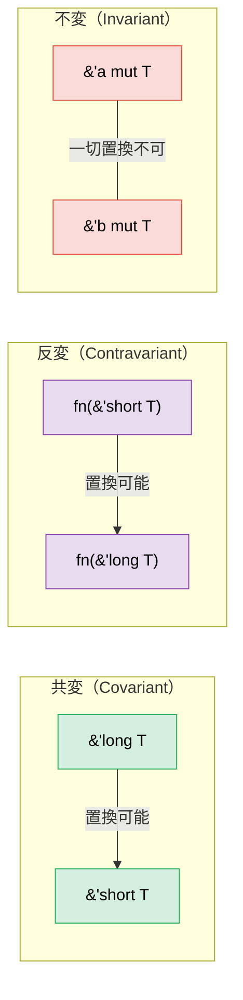

# 4. PhantomData — データを保持しない型 🔴

> **学べること:**
> - `PhantomData<T>` が存在する理由と、それが解決する3つの課題
> - コンパイル時のスコープ制限を強制するライフタイムブランディング
> - 次元の安全な計算を実現する単位系（Unit-of-Measure）パターン
> - 変性（共変・反変・不変）の仕組みと、PhantomData によるその制御

## PhantomData が解決するもの

`PhantomData<T>` は、メモリを一切消費することなく、コンパイラに対して「この構造体は実際には `T` を保持していないが、論理的に `T` と関連づけられている」と伝えるためのゼロサイズ型（ZST）です。変性（variance）、ドロップチェック（drop checking）、自動トレイト（auto trait）の推論に影響を与えます。

```rust
use std::marker::PhantomData;

// PhantomData を使わない場合:
struct Slice<'a, T> {
    ptr: *const T,
    len: usize,
    // 課題: コンパイラは、この構造体が 'a から借用していることも、
    // ドロップチェックの観点で T と関連していることも認識できない
}

// PhantomData を使う場合:
struct Slice<'a, T> {
    ptr: *const T,
    len: usize,
    _marker: PhantomData<&'a T>,
    // これによりコンパイラは以下を理解する:
    // 1. この構造体はライフタイム 'a を持つデータを借用している
    // 2. 'a に関して共変（covariant）である（ライフタイムの縮小が可能）
    // 3. ドロップチェック時に T を考慮する
}
```

**PhantomData の3つの役割**:

| 役割 | 実例 | 具体的な動作 |
|------|------|-------------|
| **ライフタイムの束縛** | `PhantomData<&'a T>` | 構造体がライフタイム `'a` のデータを借用しているものとして扱われる |
| **所有権のシミュレーション** | `PhantomData<T>` | ドロップチェックにおいて、構造体が `T` を所有していると見なされる |
| **変性の制御** | `PhantomData<fn(T)>` | 構造体を `T` に関して反変（contravariant）にする |

### ライフタイムブランディング

`PhantomData` を利用して、異なる「セッション」や「コンテキスト」の値が混ざり合うのを防ぐことができます：

```rust
use std::cell::RefCell;
use std::marker::PhantomData;

/// 特定のアリーナインスタンスにブランド付け（刻印）されたハンドル。
/// 'arena に関して不変（invariant） — あるアリーナのハンドルを別のアリーナで使うのを防ぐ。
struct ArenaHandle<'arena> {
    index: usize,
    _brand: PhantomData<*mut &'arena ()>,
}

/// 各ハンドルに固有のライフタイムをブランド付けするアリーナ。
struct Arena<'arena> {
    data: RefCell<Vec<String>>,
    _phantom: PhantomData<&'arena ()>,
}

/// アリーナを作成し、クロージャに渡す。
/// 呼び出しごとに偽造不可能な固有かつ不透明なライフタイムが割り当てられる。
fn with_arena<R>(f: impl for<'arena> FnOnce(&Arena<'arena>) -> R) -> R {
    let arena = Arena {
        data: RefCell::new(Vec::new()),
        _phantom: PhantomData,
    };
    f(&arena)
}

impl<'arena> Arena<'arena> {
    /// 文字列をアロケートし、ブランド付けされたハンドルを返す
    fn alloc(&self, value: String) -> ArenaHandle<'arena> {
        let mut data = self.data.borrow_mut();
        let index = data.len();
        data.push(value);
        ArenaHandle { index, _brand: PhantomData }
    }

    /// ハンドルによる値の取得 — 「この」アリーナから発行されたハンドルのみ受け付ける
    fn get(&self, handle: &ArenaHandle<'arena>) -> String {
        let data = self.data.borrow();
        data[handle.index].clone()
    }
}

fn main() {
    with_arena(|arena1| {
        let handle1 = arena1.alloc("hello".to_string());
        println!("{}", arena1.get(&handle1)); // ✅

        // handle1 を別のアリーナで使用することはできない — コンパイルエラーになる
        // with_arena(|arena2| {
        //     arena2.get(&handle1); // ❌ 借用データがクロージャの外に漏洩する
        // });
    });
}
```

### 単位系（Unit-of-Measure）パターン

互換性のない単位同士の混同を、実行時オーバーヘッドゼロでコンパイル時に防止します：

```rust
use std::marker::PhantomData;
use std::ops::{Add, Mul};

// 単位を表すマーカー型（ゼロサイズ）
struct Meters;
struct Seconds;
struct MetersPerSecond;

#[derive(Debug, Clone, Copy)]
struct Quantity<Unit> {
    value: f64,
    _unit: PhantomData<Unit>,
}

impl<U> Quantity<U> {
    fn new(value: f64) -> Self {
        Quantity { value, _unit: PhantomData }
    }
}

// 同一の単位同士のみ加算可能:
impl<U> Add for Quantity<U> {
    type Output = Quantity<U>;
    fn add(self, rhs: Self) -> Self::Output {
        Quantity::new(self.value + rhs.value)
    }
}

// メートル / 秒 = メートル毎秒 (カスタム除算)
impl std::ops::Div<Quantity<Seconds>> for Quantity<Meters> {
    type Output = Quantity<MetersPerSecond>;
    fn div(self, rhs: Quantity<Seconds>) -> Quantity<MetersPerSecond> {
        Quantity::new(self.value / rhs.value)
    }
}

fn main() {
    let dist = Quantity::<Meters>::new(100.0);
    let time = Quantity::<Seconds>::new(9.58);
    let speed = dist / time; // Quantity<MetersPerSecond>
    println!("速度: {:.2} m/s", speed.value); // 10.44 m/s

    // let nonsense = dist + time; // ❌ コンパイルエラー: Meters と Seconds は加算できない
}
```

> **型システムの驚くべき力** — `PhantomData<Meters>` はサイズが0であるため、`Quantity<Meters>` のメモリレイアウトは通常の `f64` と完全に同一です。実行時のラッパーオーバーヘッドは一切なく、コンパイル時に完全な単位安全性が得られます。

### PhantomData とドロップチェック（Drop Check）

構造体のデストラクタが有効期限の切れたデータにアクセスする可能性があるかをコンパイラが検証する際、`PhantomData` の有無と型を手がかりに判定します：

```rust
use std::marker::PhantomData;

// PhantomData<T> — コンパイラは「この型は T をドロップする可能性がある」とみなす
// つまり、T はこの構造体よりも長生きでなければならない
struct OwningSemantic<T> {
    ptr: *const T,
    _marker: PhantomData<T>,  // 「論理的に T を所有している」
}

// PhantomData<*const T> — コンパイラは「T を所有していない」とみなす
// より寛容 — T がこの構造体より長生きである必要はない
struct NonOwningSemantic<T> {
    ptr: *const T,
    _marker: PhantomData<*const T>,  // 「単に T を指しているだけ」
}
```

**実践的なルール**: 生ポインタ（raw pointer）をラップする際は、PhantomData を慎重に選択してください：
- データを所有するコンテナを書く場合 → `PhantomData<T>`
- ビューや参照の型を書く場合 → `PhantomData<&'a T>` または `PhantomData<*const T>`

### 変性（Variance） — なぜ PhantomData の型パラメータが重要なのか

**変性（Variance）**は、ジェネリック型において、部分型（サブタイプ）や上位型（スーパータイプ）への代入・置換が可能かどうかを決定します（Rustにおいて「部分型」とは主に「より長いライフタイムを持つ型」を意味します）。変性を誤って設定すると、本来安全なコードがコンパイル拒絶されたり、不健全なコードが誤って受理されたりする原因になります。



#### 3つの変性

| 変性 | 意味 | 「〜を代入・置換できるか？」 | Rustにおける実例 |
|------|------|-----------------------------|-----------------|
| **共変（Covariant）** | 部分型関係がそのまま維持される | `'short` が期待される場所に `'long` を渡せる ✅ | `&'a T`、`Vec<T>`、`Box<T>` |
| **反変（Contravariant）** | 部分型関係が逆転する | `'long` が期待される場所に `'short` を渡せる ✅ | `fn(T)`（引数位置） |
| **不変（Invariant）** | 置換が一切許可されない | どちらの方向への置換も不可 ❌ | `&mut T`、`Cell<T>`、`UnsafeCell<T>` |

#### なぜ `&'a T` は `'a` に関して共変なのか

```rust
fn print_str(s: &str) {
    println!("{s}");
}

fn main() {
    let owned = String::from("hello");
    // owned は関数全体で生存している（'long）
    // print_str は単なる呼び出しの間だけの参照を期待している（'short）
    print_str(&owned); // ✅ 共変性: 'long → 'short への縮小は安全
    // より長く生存する参照は、より短い生存期間が求められる場所へ常に代入可能です。
}
```

#### なぜ `&mut T` は `T` に関して不変なのか

```rust
// もし &mut T が T に関して共変だったとすると、以下の不正なコードがコンパイルを通ってしまう:
fn evil(s: &mut &'static str) {
    // &'static str スロットに、より短命なローカルの &str を書き込めてしまう！
    let local = String::from("一時的な文字列");
    // *s = &local; // ← ダングリング（解放済み）な &'static str を生み出してしまう
}

// 不変性（Invariance）がこれを防止する: ミュータブル参照経由での書き換え時、
// &'static str と &'a str は厳密に同一でなければならない。
// コンパイラはこの置換を完全に拒否します。
```

#### PhantomData による変性の制御

`PhantomData<X>` を持たせることで、構造体に **`X` と全く同じ変性**を付与できます：

```rust
use std::marker::PhantomData;

// 'a に関して共変 — Ref<'long> を Ref<'short> として使用可能
struct Ref<'a, T> {
    ptr: *const T,
    _marker: PhantomData<&'a T>,  // 'a に関して共変、T に関して共変
}

// T に関して不変 — T のライフタイムが不健全に縮小されるのを防ぐ
struct MutRef<'a, T> {
    ptr: *mut T,
    _marker: PhantomData<&'a mut T>,  // 'a に関して共変、T に関して「不変」
}

// T に関して反変 — コールバックのコンテナなどに有用
struct CallbackSlot<T> {
    _marker: PhantomData<fn(T)>,  // T に関して反変
}
```

**PhantomData の変性チートシート**:

| PhantomData の型 | `T` に関する変性 | `'a` に関する変性 | 使うべき場面 |
|------------------|------------------|-------------------|--------------|
| `PhantomData<T>` | 共変 | — | `T` を論理的に所有している場合 |
| `PhantomData<&'a T>` | 共変 | 共変 | ライフタイム `'a` の `T` を借用している場合 |
| `PhantomData<&'a mut T>` | **不変** | 共変 | `T` を可変借用している場合 |
| `PhantomData<*const T>` | 共変 | — | `T` を指す非所有の生ポインタ |
| `PhantomData<*mut T>` | **不変** | — | 非所有の可変生ポインタ |
| `PhantomData<fn(T)>` | **反変** | — | `T` が引数位置に出現する場合 |
| `PhantomData<fn() -> T>` | 共変 | — | `T` が戻り値位置に出現する場合 |
| `PhantomData<fn(T) -> T>` | **不変** | — | 引数と戻り値の両方に `T` がある場合（相殺） |

#### 実践的な実例: なぜこれが重要なのか

```rust
use std::marker::PhantomData;

// 値にセッションライフタイムをブランド付けするトークン。
// 呼び出し側が短い借用を必要とする関数に渡せるよう、
// 'a に関して必ず「共変」でなければならない。
struct SessionToken<'a> {
    id: u64,
    _brand: PhantomData<&'a ()>,  // ✅ 共変 — 呼び出し側が 'a を縮小可能
    // _brand: PhantomData<fn(&'a ())>,  // ❌ 反変 — 人間工学（使い勝手）が破壊される
    // _brand: PhantomData<&'a mut ()>;  // これも 'a に関しては共変（T は () に固定されているため不変なのは () のみ）
}

fn use_token(token: &SessionToken<'_>) {
    println!("トークン {} を使用中", token.id);
}

fn main() {
    let token = SessionToken { id: 42, _brand: PhantomData };
    use_token(&token); // ✅ SessionToken が 'a に関して共変であるため動作する
}
```

> **意思決定ルール**: まずは `PhantomData<&'a T>`（共変）から始めましょう。自作の抽象化が `T` への可変アクセス（`&mut T`）を外部へ公開・提供する場合にのみ、`PhantomData<&'a mut T>`（不変）に切り替えます。`PhantomData<fn(T)>`（反変）は、コールバックを直接保持する特殊なシナリオを除き、ほとんど使う機会はありません。

> **重要ポイント — PhantomData**
> - `PhantomData<T>` は実行時コストゼロで型やライフタイムの情報を伝達する
> - ライフタイムブランディング、変性の制御、単位系パターンに活用される
> - ドロップチェック: `PhantomData<T>` はコンパイラに「この型は論理的に `T` を所有している」と通知する

> **参照:** PhantomData を活用する型状態パターンについては [第3章 — ニュータイプと型状態](ch03-the-newtype-and-type-state-patterns.md) を参照してください。PhantomData と生ポインタの連携については [第12章 — Unsafe Rust](ch12-unsafe-rust-controlled-danger.md) を参照してください。

---

### 演習問題: PhantomData を用いた単位系 ★★（目安: 約30分）

単位系パターンを拡張し、以下の演算をサポートしてください：
- `Meters`（メートル）、`Seconds`（秒）、`Kilograms`（キログラム）
- 同一単位同士の加算
- 乗算: `Meters * Meters = SquareMeters`（平方メートル）
- 除算: `Meters / Seconds = MetersPerSecond`（メートル毎秒）

<details>
<summary>🔑 解答例</summary>

```rust
use std::marker::PhantomData;
use std::ops::{Add, Mul, Div};

#[derive(Clone, Copy)]
struct Meters;
#[derive(Clone, Copy)]
struct Seconds;
#[derive(Clone, Copy)]
struct Kilograms;
#[derive(Clone, Copy)]
struct SquareMeters;
#[derive(Clone, Copy)]
struct MetersPerSecond;

#[derive(Debug, Clone, Copy)]
struct Qty<U> {
    value: f64,
    _unit: PhantomData<U>,
}

impl<U> Qty<U> {
    fn new(v: f64) -> Self { Qty { value: v, _unit: PhantomData } }
}

impl<U> Add for Qty<U> {
    type Output = Qty<U>;
    fn add(self, rhs: Self) -> Self::Output { Qty::new(self.value + rhs.value) }
}

impl Mul<Qty<Meters>> for Qty<Meters> {
    type Output = Qty<SquareMeters>;
    fn mul(self, rhs: Qty<Meters>) -> Qty<SquareMeters> {
        Qty::new(self.value * rhs.value)
    }
}

impl Div<Qty<Seconds>> for Qty<Meters> {
    type Output = Qty<MetersPerSecond>;
    fn div(self, rhs: Qty<Seconds>) -> Qty<MetersPerSecond> {
        Qty::new(self.value / rhs.value)
    }
}

fn main() {
    let width = Qty::<Meters>::new(5.0);
    let height = Qty::<Meters>::new(3.0);
    let area = width * height; // Qty<SquareMeters>
    println!("面積: {:.1} m²", area.value);

    let dist = Qty::<Meters>::new(100.0);
    let time = Qty::<Seconds>::new(9.58);
    let speed = dist / time;
    println!("速度: {:.2} m/s", speed.value);

    let sum = width + height; // 同じ単位 ✅
    println!("合計: {:.1} m", sum.value);

    // let bad = width + time; // ❌ コンパイルエラー: Meters と Seconds は加算できません
}
```

</details>

***
