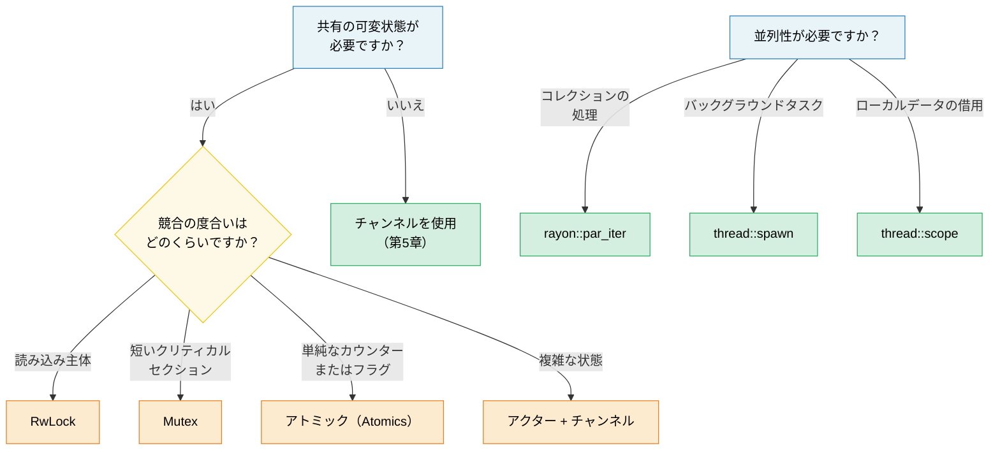

# 6. 並行性 vs 並列性 vs スレッド 🟡

> **学習内容:**
> - 並行性（Concurrency）と並列性（Parallelism）の明確な違い
> - OS スレッド、スコープ付きスレッド、およびデータ並列性のための rayon
> - 共有状態プリミティブ: Arc, Mutex, RwLock, Atomics, Condvar
> - OnceLock / LazyLock による遅延初期化とロックフリーパターン

## 用語の整理: 並行性 ≠ 並列性

これらの用語は混同されがちです。明確な違いは以下の通りです：

| | 並行性（Concurrency） | 並列性（Parallelism） |
|---|---|---|
| **定義** | 進行可能な複数のタスクを管理すること | 複数のタスクを同時に実行すること |
| **ハードウェア要件** | 単一コアで十分 | 複数コアが必要 |
| **例え** | 1人の料理人が複数の料理を（切り替えながら）作る | 複数の料理人がそれぞれ1つの料理を同時に作る |
| **Rust のツール** | `async/await`、チャンネル、`select!` | `rayon`、`thread::spawn`、`par_iter()` |

```text
並行性 (単一コア):                   並列性 (マルチコア):
                                      
タスク A: ██░░██░░██                 タスク A: ██████████
タスク B: ░░██░░██░░                 タスク B: ██████████
─────────────────→ 時間             ─────────────────→ 時間
(1つのコア上でインターリーブ)       (2つのコア上で同時実行)
```

### std::thread — OS スレッド

Rust のスレッドは OS スレッドと 1:1 に対応します。各スレッドは独自のスタック（通常 2〜8 MB）を持ちます：

```rust
use std::thread;
use std::time::Duration;

fn main() {
    // スレッドを生成 — クロージャを受け取る
    let handle = thread::spawn(|| {
        for i in 0..5 {
            println!("spawned thread: {i}");
            thread::sleep(Duration::from_millis(100));
        }
        42 // 戻り値
    });

    // メインスレッドでも同時に作業を実行
    for i in 0..3 {
        println!("main thread: {i}");
        thread::sleep(Duration::from_millis(150));
    }

    // スレッドの終了を待機し、その戻り値を取得
    let result = handle.join().unwrap(); // スレッドがパニックした場合は unwrap がパニックする
    println!("Thread returned: {result}");
}
```

**thread::spawn の型要件**:

```rust
// クロージャは以下を満たす必要があります:
// 1. Send — 別のスレッドへ転送可能
// 2. 'static — 呼び出し元スコープから借用できない
// 3. FnOnce — キャプチャした変数の所有権を取得する

let data = vec![1, 2, 3];

// ❌ data を借用している — 'static ではない
// thread::spawn(|| println!("{data:?}"));

// ✅ 所有権をスレッド内にムーブする
thread::spawn(move || println!("{data:?}"));
// ここでは data にアクセスできなくなる
```

### スコープ付きスレッド (std::thread::scope)

Rust 1.63 以降、スコープ付きスレッドによって `'static` 要件が解決され、スレッドが親スコープから安全に借用できるようになりました：

```rust
use std::thread;

fn main() {
    let mut data = vec![1, 2, 3, 4, 5];

    thread::scope(|s| {
        // スレッド 1: 共有参照を借用
        s.spawn(|| {
            let sum: i32 = data.iter().sum();
            println!("合計: {sum}");
        });

        // スレッド 2: こちらも共有参照を借用（複数のリーダーは問題なし）
        s.spawn(|| {
            let max = data.iter().max().unwrap();
            println!("最大値: {max}");
        });

        // ❌ 共有借用が存在する間は可変借用できない:
        // s.spawn(|| data.push(6));
    });
    // すべてのスコープ付きスレッドはここで join される — スコープから戻る前に保証される

    // すべてのスレッドが終了したため、安全に変更可能
    data.push(6);
    println!("更新後: {data:?}");
}
```

> **これは非常に重要です**: スコープ付きスレッドが登場する前は、スレッドと共有するためにすべてを `Arc::clone()` する必要がありました。今では直接借用でき、コンパイラはデータがスコープを抜ける前にすべてのスレッドが確実に終了することを検証します。

### rayon — データ並列性

`rayon` は、スレッドプール全体に作業を自動的に分散する並列イテレータを提供します：

```rust,ignore
// Cargo.toml: rayon = "1"
use rayon::prelude::*;

fn main() {
    let data: Vec<u64> = (0..1_000_000).collect();

    // 順次処理:
    let sum_seq: u64 = data.iter().map(|x| x * x).sum();

    // 並列処理 — .iter() を .par_iter() に変えるだけ:
    let sum_par: u64 = data.par_iter().map(|x| x * x).sum();

    assert_eq!(sum_seq, sum_par);

    // 並列ソート:
    let mut numbers = vec![5, 2, 8, 1, 9, 3];
    numbers.par_sort();

    // map/filter/collect を用いた並列処理:
    let results: Vec<_> = data
        .par_iter()
        .filter(|&&x| x % 2 == 0)
        .map(|&x| expensive_computation(x))
        .collect();
}

fn expensive_computation(x: u64) -> u64 {
    // CPU 負荷の高い処理をシミュレート
    (0..1000).fold(x, |acc, _| acc.wrapping_mul(7).wrapping_add(13))
}
```

**rayon とスレッドの使い分け**:

| 用途 | タイミング |
|-----|------|
| `rayon::par_iter()` | コレクションの並列処理（map, filter, reduce） |
| `thread::spawn` | 長時間実行されるバックグラウンドタスク、I/O ワーカー |
| `thread::scope` | ローカルデータを借用する短命な並列タスク |
| `async` + `tokio` | I/O バウンドな並行処理（ネットワーク、ファイル I/O） |

### 共有状態: Arc, Mutex, RwLock, Atomics

スレッド間で可変状態を共有する必要がある場合、Rust は安全な抽象化を提供します：

> **注意:** これらの例では簡潔さのために `.lock()`、`.read()`、`.write()` に `.unwrap()` を使用しています。これらの呼び出しが失敗するのは、ロックを保持している間に別のスレッドがパニックした場合（「ポイズニング / poisoning」）のみです。プロダクションコードでは、ポイズンされたロックから回復するかエラーを伝播するかを判断してください。

```rust
use std::sync::{Arc, Mutex, RwLock};
use std::sync::atomic::{AtomicU64, Ordering};
use std::thread;

// --- Arc<Mutex<T>>: 共有 + 排他アクセス ---
fn mutex_example() {
    let counter = Arc::new(Mutex::new(0u64));
    let mut handles = vec![];

    for _ in 0..10 {
        let counter = Arc::clone(&counter);
        handles.push(thread::spawn(move || {
            for _ in 0..1000 {
                let mut guard = counter.lock().unwrap();
                *guard += 1;
            } // ガードがドロップされる → ロック解除
        }));
    }

    for h in handles { h.join().unwrap(); }
    println!("カウンター: {}", counter.lock().unwrap()); // 10000
}

// --- Arc<RwLock<T>>: 複数のリーダー または 単一のライター ---
fn rwlock_example() {
    let config = Arc::new(RwLock::new(String::from("initial")));

    // 多数のリーダー — 互いにブロックしない
    let readers: Vec<_> = (0..5).map(|id| {
        let config = Arc::clone(&config);
        thread::spawn(move || {
            let guard = config.read().unwrap();
            println!("リーダー {id}: {guard}");
        })
    }).collect();

    // ライター — ブロックし、すべてのリーダーが終了するのを待機する
    {
        let mut guard = config.write().unwrap();
        *guard = "updated".to_string();
    }

    for r in readers { r.join().unwrap(); }
}

// --- Atomics: 単純な値に対するロックフリー ---
fn atomic_example() {
    let counter = Arc::new(AtomicU64::new(0));
    let mut handles = vec![];

    for _ in 0..10 {
        let counter = Arc::clone(&counter);
        handles.push(thread::spawn(move || {
            for _ in 0..1000 {
                counter.fetch_add(1, Ordering::Relaxed);
                // ロックも Mutex もなし — ハードウェアのアトミック命令
            }
        }));
    }

    for h in handles { h.join().unwrap(); }
    println!("アトミックカウンター: {}", counter.load(Ordering::Relaxed)); // 10000
}
```

### クイック比較

| プリミティブ | ユースケース | コスト | 競合 |
|-----------|----------|------|------------|
| `Mutex<T>` | 短いクリティカルセクション | ロック + アンロック | スレッドが順番待ちをする |
| `RwLock<T>` | 読み込み主体、稀な書き込み | リーダー・ライターロック | 読み込みは並行、書き込みは排他 |
| `AtomicU64` など | カウンター、フラグ | ハードウェア CAS | ロックフリー — 待機なし |
| チャンネル | メッセージパッシング | キュー操作 | プロデューサーとコンシューマーの疎結合 |

### 条件変数 (`Condvar`)

`Condvar`（条件変数）を使うと、ビジーループすることなく、別のスレッドがある条件が真になったことをシグナルするまでスレッドを**待機**させることができます。常に `Mutex` とペアで使用されます：

```rust
use std::sync::{Arc, Mutex, Condvar};
use std::thread;

let pair = Arc::new((Mutex::new(false), Condvar::new()));
let pair2 = Arc::clone(&pair);

// 生成されたスレッド: ready == true になるまで待機
let handle = thread::spawn(move || {
    let (lock, cvar) = &*pair2;
    let mut ready = lock.lock().unwrap();
    while !*ready {
        ready = cvar.wait(ready).unwrap(); // アトミックにロック解除 + スリープ
    }
    println!("ワーカー: 条件が満たされたため、処理を続行します");
});

// メインスレッド: ready = true に設定し、シグナルを送信
{
    let (lock, cvar) = &*pair;
    let mut ready = lock.lock().unwrap();
    *ready = true;
    cvar.notify_one(); // 待機中の1つのスレッドを起こす（複数の場合は notify_all を使用）
}
handle.join().unwrap();
```

> **パターン**: OS による偽りの起床（spurious wakeup）が許可されているため、`wait()` から復帰した後は常に `while` ループで条件を再確認してください。

### 遅延初期化: OnceLock と LazyLock

Rust 1.80 より前は、実行時の計算（設定ファイルのパースや正規表現のコンパイルなど）を必要とするグローバル static 変数の初期化には、`lazy_static!` マクロや `once_cell` クレートが必要でした。現在、標準ライブラリはこれらのユースケースをネイティブにカバーする2つの型を提供しています：

```rust
use std::sync::{OnceLock, LazyLock};
use std::collections::HashMap;

// OnceLock — `get_or_init` を介して初回使用時に初期化。
// 初期化値が実行時引数に依存する場合に有用。
static CONFIG: OnceLock<HashMap<String, String>> = OnceLock::new();

fn get_config() -> &'static HashMap<String, String> {
    CONFIG.get_or_init(|| {
        // コスト高: 設定ファイルを読み込んでパース — 厳密に1回だけ実行される。
        let mut m = HashMap::new();
        m.insert("log_level".into(), "info".into());
        m
    })
}

// LazyLock — 初回アクセス時に初期化、クロージャは定義場所で提供。
// マクロなしで lazy_static! と同等。
static REGEX: LazyLock<regex::Regex> = LazyLock::new(|| {
    regex::Regex::new(r"^[a-zA-Z0-9_]+$").unwrap()
});

fn is_valid_identifier(s: &str) -> bool {
    REGEX.is_match(s) // 初回呼び出し時に正規表現をコンパイル。以後の呼び出しでは再利用。
}
```

| 型 | 安定化バージョン | 初期化のタイミング | 使用場面 |
|------|-----------|-------------|----------|
| `OnceLock<T>` | Rust 1.70 | 呼び出し時 (`get_or_init`) | 初期化が実行時引数に依存する場合 |
| `LazyLock<T>` | Rust 1.80 | 定義時 (クロージャ) | 初期化が自己完結している場合 |
| `lazy_static!` | — | 定義時 (マクロ) | 1.80 未満のコードベース（移行推奨） |
| `const fn` + `static` | 常に | コンパイル時 | 値がコンパイル時に計算可能な場合 |

> **移行のヒント**: `lazy_static! { static ref X: T = expr; }` を `static X: LazyLock<T> = LazyLock::new(|| expr);` に置き換えてください — 同じセマンティクスで、マクロも外部依存も不要になります。

### ロックフリーパターン

高パフォーマンスが求められるコードでは、ロックを完全に回避します：

```rust
use std::sync::atomic::{AtomicBool, AtomicUsize, Ordering};
use std::sync::Arc;

// パターン 1: スピンロック（学習用 — 通常は std::sync::Mutex を推奨）
// ⚠️ 警告: これは学習用の例に過ぎません。実用的なスピンロックには以下が必要です:
//   - RAII ガード（保持中のパニックによる永続的なデッドロックを防止）
//   - 公平性の保証（競合下での飢餓を防ぐ）
//   - バックオフ戦略（指数バックオフ、OS への yield）
// プロダクションでは std::sync::Mutex または parking_lot::Mutex を使用してください。
struct SpinLock {
    locked: AtomicBool,
}

impl SpinLock {
    fn new() -> Self { SpinLock { locked: AtomicBool::new(false) } }

    fn lock(&self) {
        while self.locked
            .compare_exchange_weak(false, true, Ordering::Acquire, Ordering::Relaxed)
            .is_err()
        {
            std::hint::spin_loop(); // CPU ヒント: スピン中であることを通知
        }
    }

    fn unlock(&self) {
        self.locked.store(false, Ordering::Release);
    }
}

// パターン 2: ロックフリー SPSC（単一プロデューサー、単一コンシューマー）
// プロダクションでは crossbeam::queue::ArrayQueue などを使用してください。
// 自作は学習目的に留めてください。

// パターン 3: ウェイトフリーな読み込みのためのシーケンスカウンター
// ⚠️ 単一マシンワードの型 (u64, f64) に最適です。より広い T では読み込み時にデータの不整合（ティアリング）が発生する可能性があります。
struct SeqLock<T: Copy> {
    seq: AtomicUsize,
    data: std::cell::UnsafeCell<T>,
}

unsafe impl<T: Copy + Send> Sync for SeqLock<T> {}

impl<T: Copy> SeqLock<T> {
    fn new(val: T) -> Self {
        SeqLock {
            seq: AtomicUsize::new(0),
            data: std::cell::UnsafeCell::new(val),
        }
    }

    fn read(&self) -> T {
        loop {
            let s1 = self.seq.load(Ordering::Acquire);
            if s1 & 1 != 0 { continue; } // 書き込み中のためリトライ

            // SAFETY: コンパイラによる読み込みの並べ替えやキャッシュを防ぐため ptr::read_volatile を使用。
            // SeqLock プロトコル（読み込み後に s1 == s2 を確認）により、ライターがアクティブだった場合は確実にリトライする。
            // これは並行処理下でのデータ破壊を防ぐために揮発性/Relaxed セマンティクスを使用する必要がある C の SeqLock パターンを反映している。
            let value = unsafe { core::ptr::read_volatile(self.data.get() as *const T) };

            // Acquire フェンス: 上記のデータ読み込みが、シーケンスカウンターの
            // 再確認よりも前に順序付けられることを保証する。
            std::sync::atomic::fence(Ordering::Acquire);
            let s2 = self.seq.load(Ordering::Relaxed);

            if s1 == s2 { return value; } // ライターによる割り込みなし
            // それ以外の場合はリトライ
        }
    }

    /// # 安全性に関する契約（Safety contract）
    /// 一度に `write()` を呼び出せるスレッドは1つだけです。複数のライターが必要な場合は、
    /// `write()` の呼び出しを外部の `Mutex` でラップしてください。
    fn write(&self, val: T) {
        // 奇数にインクリメント（書き込み中であることを通知）。
        // AcqRel: Acquire 側により、後続のデータ書き込みがこのインクリメントより前に
        // 並べ替えられるのを防ぐ（リーダーは部分的な書き込みを観測する前に奇数を見る必要がある）。
        // Release 側は単一ライターにとっては厳密には不要だが、無害で一貫性がある。
        self.seq.fetch_add(1, Ordering::AcqRel);
        // SAFETY: 単一ライターの不変条件は呼び出し元によって維持される（上記のドキュメント参照）。
        // UnsafeCell は内部可変性を許可し、seq カウンターがリーダーを保護する。
        unsafe { *self.data.get() = val; }
        // 偶数にインクリメント（書き込み完了を通知）。
        // Release: リーダーが偶数の seq を見る前に、データの書き込みが可視化されることを保証する。
        self.seq.fetch_add(1, Ordering::Release);
    }
}
```

> **⚠️ Rust メモリモデルに関する注意点**: `write()` における `UnsafeCell` を介した非アトミックな書き込みと、`read()` における非アトミックな `ptr::read_volatile` の並行実行は、Rust の抽象機械においては厳密にはデータ競合にあたります — たとえ SeqLock プロトコルによってリーダーが古いデータに対して常にリトライするとしてもです。これは C カーネルの SeqLock パターンを反映しており、単一マシンワード（`u64` など）に収まる型 `T` については、最新のすべてのハードウェアで実際に健全に動作します。よりサイズの大きな型の場合は、データフィールドに `AtomicU64` を使用するか、アクセスを `Mutex` でラップすることを検討してください。`UnsafeCell` の並行性に関する最新の動向については、[Rust unsafe code guidelines](https://rust-lang.github.io/unsafe-code-guidelines/) を参照してください。

> **実践的なアドバイス**: ロックフリーコードを正しく実装するのは困難です。プロファイリングによってロックの競合がボトルネックであることが判明しない限り、`Mutex` や `RwLock` を使用してください。ロックフリーが必要な場合でも、自作するのではなく実績のあるクレート（`crossbeam`, `arc-swap`, `dashmap` など）を利用しましょう。

> **重要なポイント — 並行性**
> - スコープ付きスレッド（`thread::scope`）により、`Arc` なしでスタックデータを借用できます
> - `rayon::par_iter()` は1つのメソッド呼び出しでイテレータを並列化します
> - `lazy_static!` の代わりに `OnceLock`/`LazyLock` を使用し、アトミックに手を出す前にまずは `Mutex` を検討してください
> - ロックフリーコードは困難です — 自作の実装よりも実績のあるクレートを優先してください

> **関連項目:** メッセージパッシング並行処理については [第5章 — チャンネル](ch05-channels-and-message-passing.md) を参照してください。Arc/Rc の詳細については [第8章 — スマートポインタ](ch09-smart-pointers-and-interior-mutability.md) を参照してください。



---

### 演習: スコープ付きスレッドを用いた並列 map ★★（約25分）

スライス `data` を `num_threads` 個のチャンクに分割し、それぞれをスコープ付きスレッドで処理する関数 `parallel_map<T, R>(data: &[T], f: fn(&T) -> R, num_threads: usize) -> Vec<R>` を作成してください。`rayon` は使用せず、`std::thread::scope` を使用してください。

<details>
<summary>🔑 解答例</summary>

```rust
fn parallel_map<T: Sync, R: Send>(data: &[T], f: fn(&T) -> R, num_threads: usize) -> Vec<R> {
    let chunk_size = (data.len() + num_threads - 1) / num_threads;
    let mut results = Vec::with_capacity(data.len());

    std::thread::scope(|s| {
        let mut handles = Vec::new();
        for chunk in data.chunks(chunk_size) {
            handles.push(s.spawn(move || {
                chunk.iter().map(f).collect::<Vec<_>>()
            }));
        }
        for h in handles {
            results.extend(h.join().unwrap());
        }
    });

    results
}

fn main() {
    let data: Vec<u64> = (1..=20).collect();
    let squares = parallel_map(&data, |x| x * x, 4);
    assert_eq!(squares, (1..=20).map(|x: u64| x * x).collect::<Vec<_>>());
    println!("Parallel squares: {squares:?}");
}
```

</details>

***
