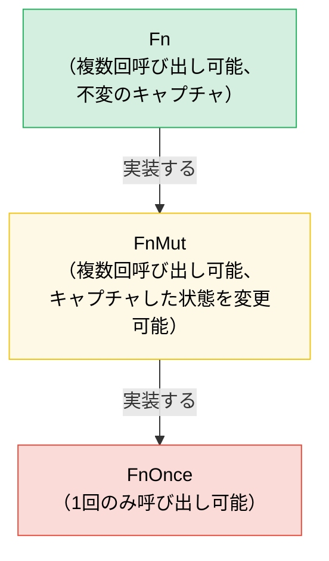

# 7. クロージャと高階関数 🟢

> **学習内容:**
> - 3つのクロージャトレイト（`Fn`、`FnMut`、`FnOnce`）とキャプチャの仕組み
> - クロージャを引数として渡す方法と関数から返す方法
> - 関数型プログラミングのためのコンビネータチェーンとイテレータアダプタ
> - 適切なトレイト境界を用いた独自の高階 API の設計

## Fn、FnMut、FnOnce — クロージャトレイト

Rust のすべてのクロージャは、変数をどのようにキャプチャするかに基づいて、3つのトレイトのうち1つ以上を実装します：

```rust
// FnOnce — キャプチャした値を消費する（1回しか呼び出せない）
let name = String::from("Alice");
let greet = move || {
    println!("Hello, {name}!"); // `name` の所有権を取得
    drop(name); // name は消費される
};
greet(); // ✅ 1回目の呼び出し
// greet(); // ❌ 再度呼び出すことはできない — `name` はすでに消費されている

// FnMut — キャプチャした値を可変借用する（何回でも呼び出せる）
let mut count = 0;
let mut increment = || {
    count += 1; // `count` を可変借用
};
increment(); // count == 1
increment(); // count == 2

// Fn — キャプチャした値を不変借用する（何回でも、並行しても呼び出せる）
let prefix = "Result";
let display = |x: i32| {
    println!("{prefix}: {x}"); // `prefix` を不変借用
};
display(1);
display(2);
```

**階層関係**: `Fn` : `FnMut` : `FnOnce` — それぞれが次のサブトレイト（部分トレイト）です：

```text
FnOnce  ← すべてのクロージャは少なくとも1回呼び出せる
 ↑
FnMut   ← 繰り返し呼び出せる（状態を変更する可能性がある）
 ↑
Fn      ← 繰り返し、かつ並行して呼び出せる（状態の変更なし）
```

クロージャが `Fn` を実装している場合、自動的に `FnMut` と `FnOnce` も実装します。

### 引数および戻り値としてのクロージャ

```rust
// --- 引数 ---

// 静的ディスパッチ（単相化 — 最速）
fn apply_twice<F: Fn(i32) -> i32>(f: F, x: i32) -> i32 {
    f(f(x))
}

// impl Trait を用いた記述も可能:
fn apply_twice_v2(f: impl Fn(i32) -> i32, x: i32) -> i32 {
    f(f(x))
}

// 動的ディスパッチ（トレイトオブジェクト — 柔軟だがわずかなオーバーヘッドあり）
fn apply_dyn(f: &dyn Fn(i32) -> i32, x: i32) -> i32 {
    f(x)
}

// --- 戻り値 ---

// ボクシングなしではクロージャを値として返せない（無名型を持つため）:
fn make_adder(n: i32) -> Box<dyn Fn(i32) -> i32> {
    Box::new(move |x| x + n)
}

// impl Trait を使用する場合（よりシンプルで単相化されるが、動的にはできない）:
fn make_adder_v2(n: i32) -> impl Fn(i32) -> i32 {
    move |x| x + n
}

fn main() {
    let double = |x: i32| x * 2;
    println!("{}", apply_twice(double, 3)); // 12

    let add5 = make_adder(5);
    println!("{}", add5(10)); // 15
}
```

### コンビネータチェーンとイテレータアダプタ

高階関数はイテレータで真価を発揮します — これが慣用的な Rust（idiomatic Rust）です：

```rust
// C 言語スタイルのループ（命令型）:
let data = vec![1, 2, 3, 4, 5, 6, 7, 8, 9, 10];
let mut result = Vec::new();
for x in &data {
    if x % 2 == 0 {
        result.push(x * x);
    }
}

// 慣用的な Rust（関数型コンビネータチェーン）:
let result: Vec<i32> = data.iter()
    .filter(|&&x| x % 2 == 0)
    .map(|&x| x * x)
    .collect();

// 同等のパフォーマンス — イテレータは遅延評価され、LLVM によって最適化される
assert_eq!(result, vec![4, 16, 36, 64, 100]);
```

**一般的なコンビネータのチートシート**:

| コンビネータ | 機能 | 例 |
|-----------|-------------|---------|
| `.map(f)` | 各要素を変換する | `.map(\|x\| x * 2)` |
| `.filter(p)` | 述語が真である要素を残す | `.filter(\|x\| x > &5)` |
| `.filter_map(f)` | マップとフィルタを1ステップで実行（`Option` を返す） | `.filter_map(\|x\| x.parse().ok())` |
| `.flat_map(f)` | マップしてからネストしたイテレータをフラット化する | `.flat_map(\|s\| s.chars())` |
| `.fold(init, f)` | 単一の値に畳み込む（C# の `Aggregate` に相当） | `.fold(0, \|acc, x\| acc + x)` |
| `.any(p)` / `.all(p)` | ショートサーキットによる真偽値チェック | `.any(\|x\| x > 100)` |
| `.enumerate()` | インデックスを付加する | `.enumerate().map(\|(i, x)\| ...)` |
| `.zip(other)` | 別のイテレータとペアにする | `.zip(labels.iter())` |
| `.take(n)` / `.skip(n)` | 先頭 N 個を取得 / スキップ | `.take(10)` |
| `.chain(other)` | 2つのイテレータを連結する | `.chain(extra.iter())` |
| `.peekable()` | 消費せずに先読みする | `.peek()` |
| `.collect()` | コレクションに収集する | `.collect::<Vec<_>>()` |

### 独自の高階 API の実装

カスタマイズ用のクロージャを受け取る API を設計します：

```rust
/// 設定可能な戦略を用いて操作をリトライする
fn retry<T, E, F, S>(
    mut operation: F,
    mut should_retry: S,
    max_attempts: usize,
) -> Result<T, E>
where
    F: FnMut() -> Result<T, E>,
    S: FnMut(&E, usize) -> bool, // (error, attempt) → 再試行するか？
{
    for attempt in 1..=max_attempts {
        match operation() {
            Ok(val) => return Ok(val),
            Err(e) if attempt < max_attempts && should_retry(&e, attempt) => {
                continue;
            }
            Err(e) => return Err(e),
        }
    }
    unreachable!()
}

// 使い方 — 呼び出し元がリトライロジックを制御:
```

```rust
# fn connect_to_database() -> Result<(), String> { Ok(()) }
# fn http_get(_url: &str) -> Result<String, String> { Ok(String::new()) }
# trait TransientError { fn is_transient(&self) -> bool; }
# impl TransientError for String { fn is_transient(&self) -> bool { true } }
# let url = "http://example.com";
let result = retry(
    || connect_to_database(),
    |err, attempt| {
        eprintln!("試行 {attempt} が失敗しました: {err}");
        true // 常にリトライ
    },
    3,
);

// 使い方 — 特定のエラーのみリトライ:
let result = retry(
    || http_get(url),
    |err, _| err.is_transient(), // 一時的なエラーのみリトライ
    5,
);
```

### `with` パターン — ブラケットされたリソースアクセス

呼び出し側のコードがどのように終了したか（早期リターン、`?`、パニック）に関わらず、操作の実行中だけリソースが特定のリソース状態にあることを保証し、終了後に確実に元の状態に復元する必要がある場合があります。リソースを直接公開して呼び出し元がセットアップと後片付け（ティアダウン）を忘れないように期待するのではなく、**クロージャを介してリソースを貸し出します**:

```text
セットアップ → リソースを渡してクロージャを実行 → 後片付け
```

呼び出し元はセットアップや後片付けに直接触れることはありません。忘れることも、間違えることも、クロージャのスコープ外へリソースを持ち出すこともできません。

#### 例: GPIO ピンの方向制御

GPIO コントローラは、双方向 I/O をサポートするピンを管理します。一部の呼び出し元はピンを入力として構成する必要があり、他の呼び出し元は出力として構成する必要があります。生のピンアクセスを公開して呼び出し元が正しく方向を設定することに期待するのではなく、コントローラは `with_pin_input` と `with_pin_output` を提供します：

```rust
/// GPIO ピンの方向 — 非公開であり、呼び出し元が直接設定することは決してない。
#[derive(Debug, Clone, Copy, PartialEq)]
enum Direction { In, Out }

/// クロージャに貸し出される GPIO ピンハンドル。保存やクローンは不可 —
/// コールバックの実行中のみ存在する。
pub struct GpioPin<'a> {
    pin_number: u8,
    _controller: &'a GpioController,
}

impl GpioPin<'_> {
    pub fn read(&self) -> bool {
        // ハードウェアレジスタからピンのレベルを読み取る
        println!("  reading pin {}", self.pin_number);
        true // スタブ
    }

    pub fn write(&self, high: bool) {
        // ハードウェアレジスタを介してピンのレベルを出力する
        println!("  writing pin {} = {high}", self.pin_number);
    }
}

pub struct GpioController {
    current_direction: std::cell::Cell<Option<Direction>>,
}

impl GpioController {
    pub fn new() -> Self {
        GpioController {
            current_direction: std::cell::Cell::new(None),
        }
    }

    /// ピンを入力として構成し、クロージャを実行して、状態を復元する。
    /// 呼び出し元はコールバックの間だけ有効な `GpioPin` を受け取る。
    pub fn with_pin_input<R>(
        &self,
        pin: u8,
        mut f: impl FnMut(&GpioPin<'_>) -> R,
    ) -> R {
        let prev = self.current_direction.get();
        self.set_direction(pin, Direction::In);
        let handle = GpioPin { pin_number: pin, _controller: self };
        let result = f(&handle);
        // 以前の方向を復元する（またはそのまま維持する — ポリシーの選択）
        if let Some(dir) = prev {
            self.set_direction(pin, dir);
        }
        result
    }

    /// ピンを出力として構成し、クロージャを実行して、状態を復元する。
    pub fn with_pin_output<R>(
        &self,
        pin: u8,
        mut f: impl FnMut(&GpioPin<'_>) -> R,
    ) -> R {
        let prev = self.current_direction.get();
        self.set_direction(pin, Direction::Out);
        let handle = GpioPin { pin_number: pin, _controller: self };
        let result = f(&handle);
        if let Some(dir) = prev {
            self.set_direction(pin, dir);
        }
        result
    }

    fn set_direction(&self, pin: u8, dir: Direction) {
        println!("  [hw] pin {pin} → {dir:?}");
        self.current_direction.set(Some(dir));
    }
}

fn main() {
    let gpio = GpioController::new();

    // 呼び出し元 1: 入力が必要 — 方向がどのように管理されているかは知る必要がない
    let level = gpio.with_pin_input(4, |pin| {
        pin.read()
    });
    println!("ピン 4 のレベル: {level}");

    // 呼び出し元 2: 出力が必要 — 同じ API 形状で異なる保証
    gpio.with_pin_output(4, |pin| {
        pin.write(true);
        // さらに作業を行う...
        pin.write(false);
    });

    // ピンハンドルをクロージャの外部で使用することはできない:
    // let escaped_pin = gpio.with_pin_input(4, |pin| pin);
    // ❌ ERROR: borrowed value does not live long enough
}
```

**`with` パターンが保証すること:**
- 呼び出し側のコードが実行される**前に必ず**方向が設定される
- クロージャが早期リターンした場合でも、**事後に必ず**方向が復元される
- `GpioPin` ハンドルはクロージャの外部へ**エスケープできない** — コントローラの参照に結び付けられたライフタイムを介して借用チェッカーがこれを強制する
- 呼び出し元が `Direction` をインポートしたり、`set_direction` を呼び出すことはない — API の誤用が不可能な設計

#### このパターンが登場する場面

`with` パターンは Rust の標準ライブラリやエコシステムのいたるところに現れます：

| API | セットアップ | コールバック | 後片付け |
|-----|-------|----------|----------|
| `std::thread::scope` | スコープの作成 | `\|s\| { s.spawn(...) }` | すべてのスレッドを join |
| `Mutex::lock` | ロックの取得 | `MutexGuard` を使用（クロージャではなく RAII だが同じ思想） | ドロップ時に解放 |
| `tempfile::tempdir` | 一時ディレクトリの作成 | パスを使用 | ドロップ時に削除 |
| `std::io::BufWriter::new` | 書き込みのバッファリング | 書き込み操作 | ドロップ時にフラッシュ |
| GPIO `with_pin_*` (上記) | ピン方向の設定 | ピンハンドルを使用 | ピン方向の復元 |

クロージャベースのバリアントが最も適しているのは次のような場合です：
- **セットアップと後片付けがペアになっており**、どちらかを忘れるとバグになる場合
- **リソースが操作の寿命を超えて生存してはならない場合** — 借用チェッカーがこれを自然に強制します
- **複数の設定が存在する場合**（`with_pin_input` vs `with_pin_output`） — 各 `with_*` メソッドは設定を呼び出し元に公開することなく、異なるセットアップをカプセル化します

> **`with` vs RAII (Drop):** どちらもクリーンアップを保証します。複数の文や関数呼び出しにまたがって呼び出し元がリソースを保持し続ける必要がある場合は RAII / `Drop` を使用してください。操作が**ブラケット化（前後を挟み込む形）**されており（1つのセットアップ、1つの作業ブロック、1つの後片付け）、呼び出し元がその枠組みを壊せないようにしたい場合は `with` を使用してください。

> **API 設計における FnMut vs Fn**: デフォルトの境界としては `FnMut` を使用してください — これが最も柔軟です（呼び出し元は `Fn` または `FnMut` のクロージャを渡せます）。クロージャを並行して呼び出す必要がある場合（複数のスレッドからなど）にのみ `Fn` を要求してください。厳密に1回だけ呼び出す場合にのみ `FnOnce` を要求してください。

> **重要なポイント — クロージャ**
> - `Fn` は借用、`FnMut` は可変借用、`FnOnce` は消費 — API が必要とする最も弱い境界を受け入れる
> - 引数には `impl Fn`、ストレージには `Box<dyn Fn>`、戻り値には `impl Fn`（動的な場合は `Box<dyn Fn>`）
> - コンビネータチェーン（`map`、`filter`、`and_then`）は綺麗に合成され、インライン化されて緊密なループになる
> - `with` パターン（クロージャを介したブラケットアクセス）はセットアップ/後片付けを保証し、リソースのエスケープを防ぐ — 呼び出し元が設定のライフサイクルを管理すべきでない場合に使用する

> **関連項目:** `Fn`/`FnMut`/`FnOnce` とトレイトオブジェクトの関係については [第2章 — トレイトの詳細](ch02-traits-in-depth.md) を参照してください。ループよりもコンビネータを選択すべきタイミングについては [第8章 — 関数型 vs 命令型](ch08-functional-vs-imperative-when-elegance-wins.md) を参照してください。エルゴノミックな引数パターンについては [第15章 — API 設計](ch15-crate-architecture-and-api-design.md) を参照してください。



> すべての `Fn` は `FnMut` でもあり、すべての `FnMut` は `FnOnce` でもあります。デフォルトでは `FnMut` を受け入れるようにしてください — これが呼び出し元にとって最も柔軟な境界です。

---

### 演習: 高階コンビネータパイプライン ★★（約25分）

変換処理をチェーンする `Pipeline` 構造体を作成してください。変換を追加する `.pipe(f)` と、チェーン全体を実行する `.execute(input)` をサポートする必要があります。

<details>
<summary>🔑 解答例</summary>

```rust
struct Pipeline<T> {
    transforms: Vec<Box<dyn Fn(T) -> T>>,
}

impl<T: 'static> Pipeline<T> {
    fn new() -> Self {
        Pipeline { transforms: Vec::new() }
    }

    fn pipe(mut self, f: impl Fn(T) -> T + 'static) -> Self {
        self.transforms.push(Box::new(f));
        self
    }

    fn execute(self, input: T) -> T {
        self.transforms.into_iter().fold(input, |val, f| f(val))
    }
}

fn main() {
    let result = Pipeline::new()
        .pipe(|s: String| s.trim().to_string())
        .pipe(|s| s.to_uppercase())
        .pipe(|s| format!(">>> {s} <<<"))
        .execute("  hello world  ".to_string());

    println!("{result}"); // >>> HELLO WORLD <<<

    let result = Pipeline::new()
        .pipe(|x: i32| x * 2)
        .pipe(|x| x + 10)
        .pipe(|x| x * x)
        .execute(5);

    println!("{result}"); // (5*2 + 10)^2 = 400
}
```

</details>

***
