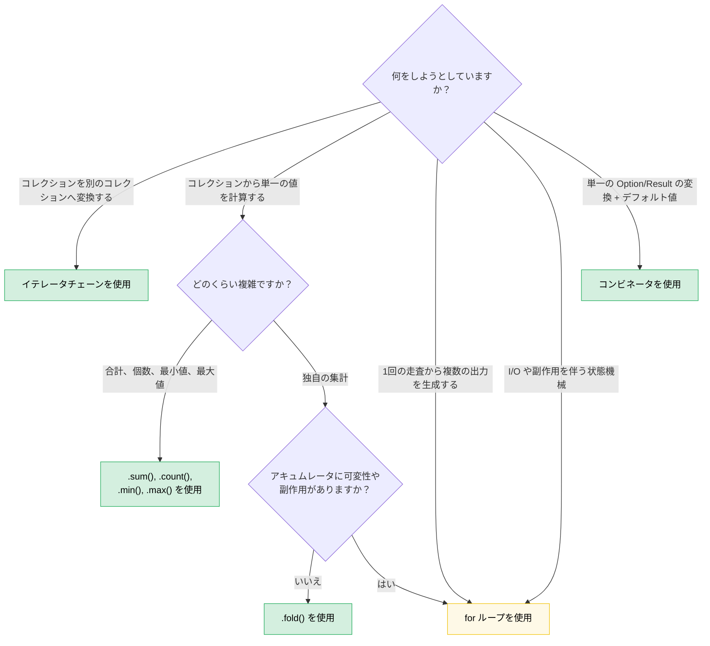

# 8. 関数型 vs. 命令型: エレガンスが勝る時（そして勝てない時）

> **難易度:** 🟡 中級 | **所要時間:** 2〜3時間 | **前提知識:** [第7章 — クロージャ](ch07-closures-and-higher-order-functions.md)

Rust は関数型スタイルと命令型スタイルの間で真の同等性（パリティ）を提供します。Haskell（宣言的に関数型）や C（デフォルトで命令型）とは異なり、Rust ではどちらを選択することも可能です — そして適切な選択は、何を表現しようとしているかによって決まります。本章では、適切な選択をするための判断力を養います。

**基本原則:** 関数型スタイルは、*パイプラインを通じてデータを変換する*場合に真価を発揮します。命令型スタイルは、*副作用を伴う状態遷移を管理する*場合に真価を発揮します。実際のコードの大半にはその両方が含まれており、スキルの本質はどこにその境界線を引くかを知ることにあります。

---

## 8.1 自分でも気づいていなかったコンビネータ

多くの Rust 開発者は次のように書きます：

```rust
let value = if let Some(x) = maybe_config() {
    x
} else {
    default_config()
};
process(value);
```

しかし、次のように書くこともできます：

```rust
process(maybe_config().unwrap_or_else(default_config));
```

あるいは、よくある以下のパターン：

```rust
let display_name = if let Some(name) = user.nickname() {
    name.to_uppercase()
} else {
    "ANONYMOUS".to_string()
};
```

これは次のように書けます：

```rust
let display_name = user.nickname()
    .map(|n| n.to_uppercase())
    .unwrap_or_else(|| "ANONYMOUS".to_string());
```

関数型バージョンは単に短いだけではありません — 制御フローを追跡させることなく、*何*が行われているか（変換、そしてフォールバック）を明確に伝えます。`if let` バージョンでは、両方のパスが最終的に同じ場所に到達することを確認するために分岐を読み解く必要があります。

### Option コンビネータファミリー

メンタルモデルは次の通りです: `Option<T>` は「1要素または空のコレクション」です。`Option` 上のすべてのコンビネータには、コレクション操作とのアナロジーが存在します。

| 書くべきコード... | これの代わりに... | 伝達する意図 |
|---|---|---|
| `opt.unwrap_or(default)` | `if let Some(x) = opt { x } else { default }` | 「この値を使用するか、フォールバックする」 |
| `opt.unwrap_or_else(\|\| expensive())` | `if let Some(x) = opt { x } else { expensive() }` | 同上、ただしデフォルト値は遅延評価 |
| `opt.map(f)` | `match opt { Some(x) => Some(f(x)), None => None }` | 「中身を変換し、値がない状態はそのまま伝播する」 |
| `opt.and_then(f)` | `match opt { Some(x) => f(x), None => None }` | 「失敗する可能性のある操作を連鎖させる」（フラットマップ） |
| `opt.filter(\|x\| pred(x))` | `match opt { Some(x) if pred(&x) => Some(x), _ => None }` | 「条件をパスした場合のみ残す」 |
| `opt.zip(other)` | `if let (Some(a), Some(b)) = (opt, other) { Some((a,b)) } else { None }` | 「両方揃っているか、さもなくば None」 |
| `opt.or(fallback)` | `if opt.is_some() { opt } else { fallback }` | 「最初に利用可能なもの」 |
| `opt.or_else(\|\| try_another())` | `if opt.is_some() { opt } else { try_another() }` | 「代替案を順番に試す」 |
| `opt.map_or(default, f)` | `if let Some(x) = opt { f(x) } else { default }` | 「変換するか、さもなくばデフォルト値」— 1行で表現 |
| `opt.map_or_else(default_fn, f)` | `if let Some(x) = opt { f(x) } else { default_fn() }` | 同上、両側がクロージャ |
| `opt?` | `match opt { Some(x) => x, None => return None }` | 「値が存在しない状態を呼び出し元へ伝播する」 |

### Result コンビネータファミリー

同じパターンが `Result<T, E>` にも当てはまります：

| 書くべきコード... | これの代わりに... | 伝達する意図 |
|---|---|---|
| `res.map(f)` | `match res { Ok(x) => Ok(f(x)), Err(e) => Err(e) }` | 成功パスを変換する |
| `res.map_err(f)` | `match res { Ok(x) => Ok(x), Err(e) => Err(f(e)) }` | エラーを変換する |
| `res.and_then(f)` | `match res { Ok(x) => f(x), Err(e) => Err(e) }` | 失敗する可能性のある操作を連鎖させる |
| `res.unwrap_or_else(\|e\| default(e))` | `match res { Ok(x) => x, Err(e) => default(e) }` | エラーから回復する |
| `res.ok()` | `match res { Ok(x) => Some(x), Err(_) => None }` | 「エラーの詳細は無視する」 |
| `res?` | `match res { Ok(x) => x, Err(e) => return Err(e.into()) }` | エラーを呼び出し元へ伝播する |

### `if let` が真に優れている場合

コンビネータが適さないのは次のような場合です：

- **`Some` 分岐内で複数の文が必要な場合。** 5行の map クロージャは、5行の `if let` よりも読みにくくなります。
- **制御フローそのものが目的である場合。** `if let Some(connection) = pool.try_get() { /* 使用する */ } else { /* ログ記録、リトライ、アラート */ }` — 2つの分岐は「変換かデフォルトか」ではなく、根本的に異なる実行パスです。
- **副作用が支配的である場合。** 両方の分岐が異なるエラーハンドリングを伴う I/O を実行する場合、コンビネータバージョンは重要な差異を覆い隠してしまいます。

**経験則:** `else` 分岐が `Some` 分岐と*同じ型*を生成し、ブロックの中身が短い式である場合は、コンビネータを使用してください。各分岐が根本的に異なる処理を行う場合は、`if let` または `match` を使用してください。

---

## 8.2 Bool コンビネータ: `.then()` と `.then_some()`

必要以上に頻繁に見られるもう一つのパターンです：

```rust
let label = if is_admin {
    Some("ADMIN")
} else {
    None
};
```

Rust 1.62 以降では次のように書けます：

```rust
let label = is_admin.then_some("ADMIN");
```

あるいは計算が必要な値の場合：

```rust
let permissions = is_admin.then(|| compute_admin_permissions());
```

これはチェーンの中で特に威力を発揮します：

```rust
// 命令型
let mut tags = Vec::new();
if user.is_admin { tags.push("admin"); }
if user.is_verified { tags.push("verified"); }
if user.score > 100 { tags.push("power-user"); }

// 関数型
let tags: Vec<&str> = [
    user.is_admin.then_some("admin"),
    user.is_verified.then_some("verified"),
    (user.score > 100).then_some("power-user"),
]
.into_iter()
.flatten()
.collect();
```

関数型バージョンはパターンを明確にします: 「条件付き要素からリストを構築する」。命令型バージョンでは、各 `if` を読んでそれらがすべて同じこと（タグの追加）を行っているか確認する必要があります。

---

## 8.3 イテレータチェーン vs ループ: 意思決定フレームワーク

第7章ではメカニズムを学びました。本節ではその判断基準を構築します。

### イテレータが勝る場合

**データパイプライン** — 一連のステップを通じてコレクションを変換する場合：

```rust
// 命令型: 8行、2つの可変変数
let mut results = Vec::new();
for item in inventory {
    if item.category == Category::Server {
        if let Some(temp) = item.last_temperature() {
            if temp > 80.0 {
                results.push((item.id, temp));
            }
        }
    }
}

// 関数型: 6行、可変変数ゼロ、単一のパイプライン
let results: Vec<_> = inventory.iter()
    .filter(|item| item.category == Category::Server)
    .filter_map(|item| item.last_temperature().map(|t| (item.id, t)))
    .filter(|(_, temp)| *temp > 80.0)
    .collect();
```

関数型バージョンが勝る理由：
- 各フィルタが独立して読みやすい
- `mut` がない — データが一方向に流れる
- 構造を作り変えることなく、パイプラインステージを追加・削除・並べ替えできる
- LLVM はイテレータアダプタをループと同じ機械語コードにインライン化する

**集約** — コレクションから単一の値を計算する場合：

```rust
// 命令型
let mut total_power = 0.0;
let mut count = 0;
for server in fleet {
    total_power += server.power_draw();
    count += 1;
}
let avg = total_power / count as f64;

// 関数型
let (total_power, count) = fleet.iter()
    .map(|s| s.power_draw())
    .fold((0.0, 0usize), |(sum, n), p| (sum + p, n + 1));
let avg = total_power / count as f64;
```

合計だけが必要な場合はさらにシンプルです：

```rust
let total: f64 = fleet.iter().map(|s| s.power_draw()).sum();
```

### ループが勝る場合

**複雑な状態を伴う早期終了:**

```rust
// 明確で直接的
let mut best_candidate = None;
for server in fleet {
    let score = evaluate(server);
    if score > threshold {
        if server.is_available() {
            best_candidate = Some(server);
            break; // 見つかった — 直ちに停止
        }
    }
}

// 関数型バージョンはやや不自然
let best_candidate = fleet.iter()
    .filter(|s| evaluate(s) > threshold)
    .find(|s| s.is_available());
```

少し待ってください — この関数型バージョンは実際にはかなり綺麗です。今度は明確に不利になるケースを見てみましょう：

**複数の出力を同時に構築する場合:**

```rust
// 命令型: 明確であり、各分岐が異なる処理を行う
let mut warnings = Vec::new();
let mut errors = Vec::new();
let mut stats = Stats::default();

for event in log_stream {
    match event.severity {
        Severity::Warn => {
            warnings.push(event.clone());
            stats.warn_count += 1;
        }
        Severity::Error => {
            errors.push(event.clone());
            stats.error_count += 1;
            if event.is_critical() {
                alert_oncall(&event);
            }
        }
        _ => stats.other_count += 1,
    }
}

// 関数型バージョン: 無理があり不格好で、誰も読みたくない
let (warnings, errors, stats) = log_stream.iter().fold(
    (Vec::new(), Vec::new(), Stats::default()),
    |(mut w, mut e, mut s), event| {
        match event.severity {
            Severity::Warn => { w.push(event.clone()); s.warn_count += 1; }
            Severity::Error => {
                e.push(event.clone()); s.error_count += 1;
                if event.is_critical() { alert_oncall(event); }
            }
            _ => s.other_count += 1,
        }
        (w, e, s)
    },
);
```

この fold バージョンは*より長く*、*読みにくく*、しかも結局ミューテーションが存在します（パターンマッチで分解された `mut` アキュムレータ）。ループが勝る理由は以下の通りです：
- 複数の出力が並行して構築されている
- ロジックの中に副作用（アラート送信）が混ざっている
- 分岐の本体が式ではなく文である

**I/O を伴う状態機械:**

```rust
// トークンを読み取るパーサー — ループそのものがアルゴリズム
let mut state = ParseState::Start;
loop {
    let token = lexer.next_token()?;
    state = match state {
        ParseState::Start => match token {
            Token::Keyword(k) => ParseState::GotKeyword(k),
            Token::Eof => break,
            _ => return Err(ParseError::UnexpectedToken(token)),
        },
        ParseState::GotKeyword(k) => match token {
            Token::Ident(name) => ParseState::GotName(k, name),
            _ => return Err(ParseError::ExpectedIdentifier),
        },
        // ...その他の状態
    };
}
```

これよりクリーンな関数型の同等物は存在しません。`match state` を伴うループこそが、状態機械の最も自然な表現です。

### 意思決定フローチャート



### サイドバー: スコープ付き可変性 — 内側は命令型、外側は関数型

Rust のブロックは式です。これにより、ミューテーションを構築フェーズのみに閉じ込め、結果を不変としてバインドできます：

```rust
use rand::random;

let samples = {
    let mut buf = Vec::with_capacity(10);
    while buf.len() < 10 {
        let reading: f64 = random();
        buf.push(reading);
        if random::<u8>() % 3 == 0 { break; } // ランダムに早期停止
    }
    buf
};
// samples は不変 — 1〜10個の要素を含む
```

内側の `buf` はブロック内でのみ可変です。ブロックが値を返すと、外側のバインディング `samples` は不変となり、コンパイラはそれ以降のいかなる `samples.push(...)` も拒絶します。

**なぜイテレータチェーンにしないのか？** 次のように試みるかもしれません：

```rust
let samples: Vec<f64> = std::iter::from_fn(|| Some(random()))
    .take(10)
    .take_while(|_| random::<u8>() % 3 != 0)
    .collect();
```

しかし、`take_while` は述語に一致しなかった要素を*除外*してしまうため、命令型バージョンが保証する「最低1要素」ではなく、0〜10個の要素を生成してしまいます。`scan` や `chain` で回避することはできますが、命令型バージョンの方が明確です。

**スコープ付き可変性が真に優れている場面:**

| シナリオ | イテレータが苦戦する理由 |
|---|---|
| **ソートして凍結** (`sort_unstable()` + `dedup()`) | どちらも `()` を返す — 連鎖可能な出力がない（itertools が利用可能なら `.sorted().dedup()` が使える） |
| **ステートフルな終了条件**（データとは無関係な条件での停止） | `take_while` は境界要素をドロップしてしまう |
| **複数ステップにわたる構造体の構築**（異なるソースからフィールドごとに設定） | 単一の自然なパイプラインが存在しない |

**率直な評価:** ほとんどのコレクション構築タスクでは、イテレータチェーンまたは [itertools](https://docs.rs/itertools) が推奨されます。構築ロジックに分岐、早期終了、あるいは単一のパイプラインにマップできないインプレース変更が含まれる場合に、スコープ付き可変性を採用してください。このパターンの真の価値は、*ミューテーションのスコープを変数のライフタイムよりも小さくできる*ことを学べる点にあります — これは C++、C#、Python から移行してきた開発者にとって新鮮な Rust の基本概念です。

---

## 8.4 `?` 演算子: 関数型と命令型の出会う場所

`?` 演算子は、両スタイルの最もエレガントな統合です。本質的には `.and_then()` と早期リターンの組み合わせです：

```rust
// この and_then のチェーンは...
fn load_config() -> Result<Config, Error> {
    read_file("config.toml")
        .and_then(|contents| parse_toml(&contents))
        .and_then(|table| validate_config(table))
        .and_then(|valid| Config::from_validated(valid))
}

// ...これとまったく等価です
fn load_config() -> Result<Config, Error> {
    let contents = read_file("config.toml")?;
    let table = parse_toml(&contents)?;
    let valid = validate_config(table)?;
    Config::from_validated(valid)
}
```

どちらも精神的には関数型（エラーを自動的に伝播する）ですが、`?` バージョンでは名前付きの中間変数が得られます。これは以下のような場合に重要です：

- 後で `contents` を再度使用する必要がある場合
- 各ステップに `.context("while parsing config")?` などを追加したい場合
- デバッグ時に中間値をインスペクトしたい場合

**アンチパターン:** `?` が使用できる状況での長い `.and_then()` チェーン。チェーン内のすべてのクロージャが `|x| next_step(x)` であるなら、可読性を損なったまま `?` を再発明しているに過ぎません。

**`.and_then()` が `?` よりも適している場合:**

```rust
// 早期リターンせずに、Option の内部で変換を行う場合
let port: Option<u16> = config.get("port")
    .and_then(|v| v.parse::<u16>().ok())
    .filter(|&p| p > 0 && p < 65535);
```

ここではリターン対象となる外側の関数が存在しないため、`?` は使用できません — エラーを伝播するのではなく、`Option` を構築しているからです。

---

## 8.5 コレクションの構築: `collect()` vs. Push ループ

`collect()` は多くの開発者が認識している以上に強力です：

### Result への collect

```rust
// 命令型: リストをパースし、最初のエラーで失敗する
let mut numbers = Vec::new();
for s in input_strings {
    let n: i64 = s.parse().map_err(|_| Error::BadInput(s.clone()))?;
    numbers.push(n);
}

// 関数型: Result<Vec<_>, _> に collect する
let numbers: Vec<i64> = input_strings.iter()
    .map(|s| s.parse::<i64>().map_err(|_| Error::BadInput(s.clone())))
    .collect::<Result<_, _>>()?;
```

`collect::<Result<Vec<_>, _>>()` のテクニックが機能するのは、`Result` が `FromIterator` を実装しているためです。`?` を伴うループと同様に、最初の `Err` でショートサーキットします。

### HashMap への collect

```rust
// 命令型
let mut index = HashMap::new();
for server in fleet {
    index.insert(server.id.clone(), server);
}

// 関数型
let index: HashMap<_, _> = fleet.into_iter()
    .map(|s| (s.id.clone(), s))
    .collect();
```

### String への collect

```rust
// 命令型
let mut csv = String::new();
for (i, field) in fields.iter().enumerate() {
    if i > 0 { csv.push(','); }
    csv.push_str(field);
}

// 関数型
let csv = fields.join(",");

// より複雑なフォーマットの場合:
let csv: String = fields.iter()
    .map(|f| format!("\"{f}\""))
    .collect::<Vec<_>>()
    .join(",");
```

### ループ版が勝る場合

`collect()` は新しいコレクションを割り当てます。*インプレース（破壊的）に変更*している場合は、ループの方が明確かつ効率的です：

```rust
// インプレース更新 — これより優れた関数型の同等物は存在しない
for server in &mut fleet {
    if server.needs_refresh() {
        server.refresh_telemetry()?;
    }
}
```

関数型で書こうとすると `.iter_mut().for_each(|s| { ... })` が必要になりますが、これは構文が無駄に増えたループに過ぎません。

---

## 8.6 関数ディスパッチとしてのパターンマッチング

Rust の `match` は関数型の構成要素ですが、多くの開発者は命令型のように使用しています。以下は関数型の視点です：

### ルックアップテーブルとしての match

```rust
// 命令型の発想: 「各ケースをチェックする」
fn status_message(code: StatusCode) -> &'static str {
    if code == StatusCode::OK { "Success" }
    else if code == StatusCode::NOT_FOUND { "Not found" }
    else if code == StatusCode::INTERNAL { "Server error" }
    else { "Unknown" }
}

// 関数型の発想: 「定義域から値域への写像」
fn status_message(code: StatusCode) -> &'static str {
    match code {
        StatusCode::OK => "Success",
        StatusCode::NOT_FOUND => "Not found",
        StatusCode::INTERNAL => "Server error",
        _ => "Unknown",
    }
}
```

`match` バージョンは単なるスタイルの問題ではありません — コンパイラが網羅性を検証してくれます。新しいバリアントを追加すると、それを処理していないすべての `match` がコンパイルエラーになります。`if/else` チェーンでは静かにデフォルトケースにフォールスルーしてしまいます。

### パイプラインとしての match + 分解

```rust
// コマンドの解析 — 各アームが抽出と変換を行う
fn execute(cmd: Command) -> Result<Response, Error> {
    match cmd {
        Command::Get { key } => db.get(&key).map(Response::Value),
        Command::Set { key, value } => db.set(key, value).map(|_| Response::Ok),
        Command::Delete { key } => db.delete(&key).map(|_| Response::Ok),
        Command::Batch(cmds) => cmds.into_iter()
            .map(execute)
            .collect::<Result<Vec<_>, _>>()
            .map(Response::Batch),
    }
}
```

各アームは同じ型を返す式になっています。これは関数ディスパッチとしてのパターンマッチングです — `match` の各アームは本質的に列挙型のバリアントによってインデックス付けされた関数テーブルです。

---

## 8.7 カスタム型に対するメソッドチェーン

関数型スタイルは標準ライブラリの型にとどまりません。ビルダーパターンや流れるような API（Fluent API）は、変装した関数型プログラミングです：

```rust
// これは独自の型に対するコンビネータチェーンです
let query = QueryBuilder::new("servers")
    .filter("status", Eq, "active")
    .filter("rack", In, &["A1", "A2", "B1"])
    .order_by("temperature", Desc)
    .limit(50)
    .build();
```

**重要な洞察:** 自分の型が `self` を受け取って `Self`（または変換された型）を返すメソッドを持っているなら、コンビネータを構築したことになります。ここでも同じ関数型 / 命令型の判断が適用されます：

```rust
// 良い例: 各ステップが単純な変換であるためチェーン可能
let config = Config::default()
    .with_timeout(Duration::from_secs(30))
    .with_retries(3)
    .with_tls(true);

// 悪い例: チェーン可能だが、1つのチェーンが無関係な処理を詰め込みすぎている
let result = processor
    .load_data(path)?       // I/O
    .validate()             // 純粋関数
    .transform(rule_set)    // 純粋関数
    .save_to_disk(output)?  // I/O
    .notify_downstream()?;  // 副作用

// より良い設計: 純粋なパイプラインと I/O の前後処理を分離する
let data = load_data(path)?;
let processed = data.validate().transform(rule_set);
save_to_disk(output, &processed)?;
notify_downstream()?;
```

純粋な変換と I/O が混在するとチェーンは破綻します。読み手にはどの呼び出しが失敗する可能性があり、どれが副作用を持ち、どこで実際のデータ変換が行われているかが判断できなくなります。

---

## 8.8 パフォーマンス: 実はどちらも同じ

よくある誤解: 「関数型スタイルはクロージャやアロケーションが多くて遅い」。

Rust において、**イテレータチェーンは手書きのループと同じ機械語コードにコンパイルされます。** LLVM はクロージャの呼び出しをインライン化し、イテレータアダプタ構造体を排除して、しばしば同一のアセンブリを生成します。これは*ゼロコスト抽象化（Zero-cost abstractions）*と呼ばれ、単なる理想ではなく測定された事実です。

```rust
// これらはリリースビルドで同一のアセンブリを生成します:

// 関数型
let sum: i64 = (0..1000).filter(|n| n % 2 == 0).map(|n| n * n).sum();

// 命令型
let mut sum: i64 = 0;
for n in 0..1000 {
    if n % 2 == 0 {
        sum += n * n;
    }
}
```

**唯一の例外:** `.collect()` はメモリを割り当てます。もし `.map().collect().iter().map().collect()` のように中間コレクションをチェーンしているなら、ループバージョンでは回避できるメモリ割り当てのコストを支払っています。解決策: アダプタを直接チェーンして中間の collect を排除するか、他の理由で中間コレクションが必要な場合はループを使用してください。

---

## 8.9 テイストテスト: 変換処理のカタログ

よくある「6行書いたけれど、実は1行で書ける」パターンのリファレンステーブルです：

| 命令型パターン | 関数型の同等表現 | 関数型を優先すべき場合 |
|---|---|---|
| `if let Some(x) = opt { f(x) } else { default }` | `opt.map_or(default, f)` | 両側が短い式である場合 |
| `if let Some(x) = opt { Some(g(x)) } else { None }` | `opt.map(g)` | 常に — これこそが `map` の存在理由 |
| `if condition { Some(x) } else { None }` | `condition.then_some(x)` | 常に |
| `if condition { Some(compute()) } else { None }` | `condition.then(compute)` | 常に |
| `match opt { Some(x) if pred(x) => Some(x), _ => None }` | `opt.filter(pred)` | 常に |
| `for x in iter { if pred(x) { result.push(f(x)); } }` | `iter.filter(pred).map(f).collect()` | パイプラインが1画面で読める場合 |
| `if a.is_some() && b.is_some() { Some((a?, b?)) }` | `a.zip(b)` | 常に — `.zip()` はまさにこのためのもの |
| `match (a, b) { (Some(x), Some(y)) => x + y, _ => 0 }` | `a.zip(b).map(\|(x,y)\| x + y).unwrap_or(0)` | 状況判断 — 複雑さによる |
| `iter.map(f).collect::<Vec<_>>()[0]` | `iter.map(f).next().unwrap()` | 1要素のために Vec をアロケートしない |
| `let mut v = vec; v.sort(); v` | `{ let mut v = vec; v.sort(); v }` | Rust 標準には `.sorted()` がない（itertools を使用） |

---

## 8.10 アンチパターン

### 過剰な関数型化: 誰にも読めない5階層のチェーン

```rust
// これはエレガントではありません。パズルです。
let result = data.iter()
    .filter_map(|x| x.metadata.as_ref())
    .flat_map(|m| m.tags.iter())
    .filter(|t| t.starts_with("env:"))
    .map(|t| t.strip_prefix("env:").unwrap())
    .filter(|env| allowed_envs.contains(env))
    .map(|env| env.to_uppercase())
    .collect::<HashSet<_>>()
    .into_iter()
    .sorted()
    .collect::<Vec<_>>();
```

チェーンのアダプタ数が4つを超えるような場合は、名前付き中間変数で分割するか、ヘルパー関数に抽出してください：

```rust
let env_tags = data.iter()
    .filter_map(|x| x.metadata.as_ref())
    .flat_map(|m| m.tags.iter());

let allowed: Vec<_> = env_tags
    .filter_map(|t| t.strip_prefix("env:"))
    .filter(|env| allowed_envs.contains(env))
    .map(|env| env.to_uppercase())
    .sorted()
    .collect();
```

### 不足した関数型化: Rust に専用の名前がある C スタイルのループ

```rust
// これは単なる .any() です
let mut found = false;
for item in &list {
    if item.is_expired() {
        found = true;
        break;
    }
}

// 代わりにこう書きましょう
let found = list.iter().any(|item| item.is_expired());
```

```rust
// これは単なる .find() です
let mut target = None;
for server in &fleet {
    if server.id == target_id {
        target = Some(server);
        break;
    }
}

// 代わりにこう書きましょう
let target = fleet.iter().find(|s| s.id == target_id);
```

```rust
// これは単なる .all() です
let mut all_healthy = true;
for server in &fleet {
    if !server.is_healthy() {
        all_healthy = false;
        break;
    }
}

// 代わりにこう書きましょう
let all_healthy = fleet.iter().all(|s| s.is_healthy());
```

標準ライブラリにこれらが用意されているのには理由があります。語彙を身につければ、パターンはおのずと明白になります。

---

## 重要なポイント

> - **Option と Result は1要素のコレクションです。** それらのコンビネータ（`.map()`、`.and_then()`、`.unwrap_or_else()`、`.filter()`、`.zip()`）は、大半の `if let` / `match` のボイラープレートを置き換えます。
> - **`bool::then_some()` を活用しましょう** — `if cond { Some(x) } else { None }` をあらゆる場面で置き換えられます。
> - **データパイプラインにはイテレータチェーンが勝ります** — 可変状態ゼロでの filter / map / collect。ループと同じ機械語コードにコンパイルされます。
> - **複数出力の状態機械にはループが勝ります** — 複数のコレクションを構築したり、分岐内で I/O を実行したり、状態遷移を管理したりする場合です。
> - **`?` 演算子は両スタイルの最良の部分を併せ持ちます** — 命令型の可読性を備えた関数型のエラー伝播。
> - **約4つ以上のアダプタチェーンは分割しましょう** — 可読性のために名前付き中間変数を使用してください。過剰な関数型化は、不足した関数型化と同じくらい有害です。
> - **標準ライブラリの語彙を学びましょう** — `.any()`、`.all()`、`.find()`、`.position()`、`.sum()`、`.min_by_key()` — それぞれが複数行のループを意図を明示した単一の呼び出しに置き換えます。

> **関連項目:** クロージャの仕組みと `Fn` トレイト階層については [第7章](ch07-closures-and-higher-order-functions.md) を参照してください。エラーコンビネータパターンについては [第10章](ch10-error-handling-patterns.md) を参照してください。流れるような API 設計については [第15章](ch15-crate-architecture-and-api-design.md) を参照してください。

---

### 演習: 命令型から関数型へのリファクタリング ★★（約30分）

以下の関数を命令型スタイルから関数型スタイルにリファクタリングしてください。その後、関数型バージョンの方が*劣っている*箇所を1つ特定し、その理由を説明してください。

```rust
fn summarize_fleet(fleet: &[Server]) -> FleetSummary {
    let mut healthy = Vec::new();
    let mut degraded = Vec::new();
    let mut failed = Vec::new();
    let mut total_power = 0.0;
    let mut max_temp = f64::NEG_INFINITY;

    for server in fleet {
        match server.health_status() {
            Health::Healthy => healthy.push(server.id.clone()),
            Health::Degraded(reason) => degraded.push((server.id.clone(), reason)),
            Health::Failed(err) => failed.push((server.id.clone(), err)),
        }
        total_power += server.power_draw();
        if server.max_temperature() > max_temp {
            max_temp = server.max_temperature();
        }
    }

    FleetSummary {
        healthy,
        degraded,
        failed,
        avg_power: total_power / fleet.len() as f64,
        max_temp,
    }
}
```

<details>
<summary>🔑 解答例</summary>

`total_power` と `max_temp` はクリーンな関数型への書き換えが可能です：

```rust
fn summarize_fleet(fleet: &[Server]) -> FleetSummary {
    let avg_power: f64 = fleet.iter().map(|s| s.power_draw()).sum::<f64>()
        / fleet.len() as f64;

    let max_temp = fleet.iter()
        .map(|s| s.max_temperature())
        .fold(f64::NEG_INFINITY, f64::max);

    // しかし、3方向の振り分け（パーティション）はループの方が優れています。
    // 関数型バージョンでは3回の独立した走査が必要になるか、
    // 3つの可変アキュムレータを持つ不格好な fold になってしまいます。
    let mut healthy = Vec::new();
    let mut degraded = Vec::new();
    let mut failed = Vec::new();

    for server in fleet {
        match server.health_status() {
            Health::Healthy => healthy.push(server.id.clone()),
            Health::Degraded(reason) => degraded.push((server.id.clone(), reason)),
            Health::Failed(err) => failed.push((server.id.clone(), err)),
        }
    }

    FleetSummary { healthy, degraded, failed, avg_power, max_temp }
}
```

**なぜ3方向の振り分けにおいてループの方が優れているのか:** 関数型バージョンでは、3回の `.filter().collect()` パス（3倍のイテレーション）を行うか、タプル内に3つの `mut Vec` アキュムレータを持つ `.fold()` を使用する必要があります — しかしそれはループをより悪化した構文で書き直しただけに過ぎません。命令型の1パスのループの方がより明確で効率的であり、拡張も容易です。

</details>

***
