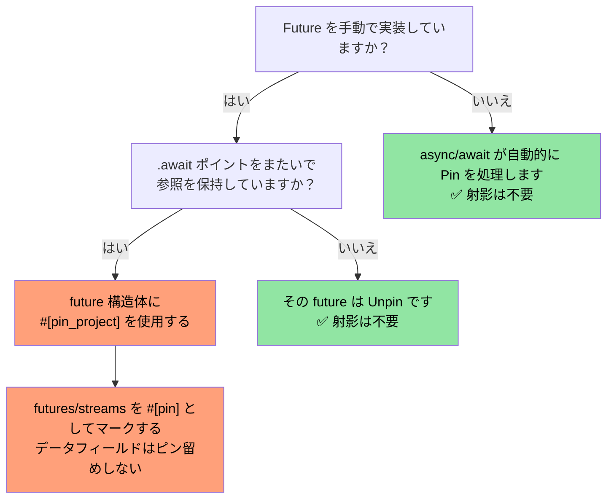
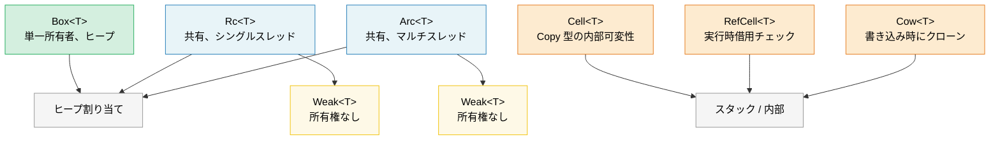

# 9. スマートポインタと内部可変性 🟡

> **学習内容:**
> - ヒープ割り当てと共有所有権のための Box、Rc、Arc
> - Rc/Arc の循環参照を解消するための弱参照（Weak）
> - 内部可変性パターンのための Cell、RefCell、Cow
> - 自己参照型のための Pin とライフサイクル制御のための ManuallyDrop

## Box、Rc、Arc — ヒープ割り当てと共有

```rust
// --- Box<T>: 単一の所有者、ヒープ割り当て ---
// 使用場面: 再帰的型、巨大な値、トレイトオブジェクト
let boxed: Box<i32> = Box::new(42);
println!("{}", *boxed); // i32 へ Deref

// 再帰的型には Box が必要（そうでないと無限のサイズになる）:
enum List<T> {
    Cons(T, Box<List<T>>),
    Nil,
}

// トレイトオブジェクト（動的ディスパッチ）:
let writer: Box<dyn std::io::Write> = Box::new(std::io::stdout());

// --- Rc<T>: 複数の所有者、シングルスレッド ---
// 使用場面: 1つのスレッド内での共有所有権（Send/Sync ではない）
use std::rc::Rc;

let a = Rc::new(vec![1, 2, 3]);
let b = Rc::clone(&a); // 参照カウントをインクリメント（ディープクローンではない）
let c = Rc::clone(&a);
println!("参照カウント: {}", Rc::strong_count(&a)); // 3

// 3つすべてが同じ Vec を指している。最後の Rc がドロップされると、
// Vec のメモリが解放される。

// --- Arc<T>: 複数の所有者、スレッドセーフ ---
// 使用場面: スレッド間での共有所有権
use std::sync::Arc;

let shared = Arc::new(String::from("shared data"));
let handles: Vec<_> = (0..5).map(|_| {
    let shared = Arc::clone(&shared);
    std::thread::spawn(move || println!("{shared}"))
}).collect();
for h in handles { h.join().unwrap(); }
```

### 弱参照 — 循環参照の解消

`Rc` と `Arc` は参照カウントを使用しているため、循環参照（A → B → A）を解放できません。
`Weak<T>` は強参照カウントをインクリメント**しない**、所有権を持たないハンドルです：

```rust
use std::rc::{Rc, Weak};
use std::cell::RefCell;

struct Node {
    value: i32,
    parent: RefCell<Weak<Node>>,   // 親を生かし続けない（所有権を持たない）
    children: RefCell<Vec<Rc<Node>>>,
}

let parent = Rc::new(Node {
    value: 0, parent: RefCell::new(Weak::new()), children: RefCell::new(vec![]),
});
let child = Rc::new(Node {
    value: 1, parent: RefCell::new(Rc::downgrade(&parent)), children: RefCell::new(vec![]),
});
parent.children.borrow_mut().push(Rc::clone(&child));

// 子から親へアクセス — Option<Rc<Node>> を返す:
if let Some(p) = child.parent.borrow().upgrade() {
    println!("子の親の値: {}", p.value); // 0
}
// `parent` がドロップされると、strong_count が 0 になり、メモリが解放される。
// その後 `child.parent.upgrade()` を呼ぶと `None` が返される。
```

**経験則**: 所有権のエッジには `Rc`/`Arc` を使用し、逆参照やキャッシュには `Weak` を使用してください。スレッドセーフなコードの場合は、`Arc<T>` と `sync::Weak<T>` を使用します。

### Cell と RefCell — 内部可変性

共有（`&`）参照の背後にあるデータを変更する必要がある場合があります。Rust は実行時借用チェックを伴う*内部可変性（Interior Mutability）*を提供します：

```rust
use std::cell::{Cell, RefCell};

// --- Cell<T>: コピーベースの内部可変性 ---
// Copy 型（または値を丸ごとスワップする型）にのみ適用
struct Counter {
    count: Cell<u32>,
}

impl Counter {
    fn new() -> Self { Counter { count: Cell::new(0) } }

    fn increment(&self) { // &mut self ではなく &self!
        self.count.set(self.count.get() + 1);
    }

    fn value(&self) -> u32 { self.count.get() }
}

// --- RefCell<T>: 実行時借用チェック ---
// 実行時に借用ルールに違反するとパニックする
struct Cache {
    data: RefCell<Vec<String>>,
}

impl Cache {
    fn new() -> Self { Cache { data: RefCell::new(Vec::new()) } }

    fn add(&self, item: String) { // &self — 外部からは不変に見える
        self.data.borrow_mut().push(item); // 実行時チェック付きの &mut
    }

    fn get_all(&self) -> Vec<String> {
        self.data.borrow().clone() // 実行時チェック付きの &
    }

    fn bad_example(&self) {
        let _guard1 = self.data.borrow();
        // let _guard2 = self.data.borrow_mut();
        // ❌ 実行時にパニック — & が存在している間は &mut を取得できない
    }
}
```

> **Cell vs RefCell**: `Cell` は決してパニックしません（値をコピーまたはスワップします）が、`Copy` 型でのみ動作するか、`swap()`/`replace()` を経由する必要があります。`RefCell` は任意の型で動作しますが、二重の可変借用が発生した場合は実行時にパニックします。どちらも `Sync` ではないため、マルチスレッドでの使用については `Mutex`/`RwLock` を参照してください。

### Cow — 書き込み時にクローン (Clone on Write)

`Cow`（Clone on Write）は、借用された値または所有された値のいずれかを保持します。変更が必要になった場合に*のみ*クローン（複製）を行います：

```rust
use std::borrow::Cow;

// 変更が不要な場合はアロケーションを回避:
fn normalize(input: &str) -> Cow<'_, str> {
    if input.contains('\t') {
        // タブの置換が必要な場合のみアロケート
        Cow::Owned(input.replace('\t', "    "))
    } else {
        // アロケーションなし — 単に参照を返す
        Cow::Borrowed(input)
    }
}

fn main() {
    let clean = "no tabs here";
    let dirty = "tabs\there";

    let r1 = normalize(clean); // Cow::Borrowed — アロケーションゼロ
    let r2 = normalize(dirty); // Cow::Owned — 新しい String をアロケート

    println!("{r1}");
    println!("{r2}");
}

// 所有権が必要になる「かもしれない」関数の引数にも便利:
fn process(data: Cow<'_, [u8]>) {
    // コピーすることなくデータを読み取れる
    println!("長さ: {}", data.len());
    // 変更が必要な場合、Cow は自動的にクローンする:
    let mut owned = data.into_owned(); // Borrowed の場合のみクローン
    owned.push(0xFF);
}
```

#### バイナリデータのための `Cow<'_, [u8]>`

`Cow` は、データに変更（チェックサムの挿入、パディング、エスケープなど）が必要な場合と不要な場合が混在するバイト指向の API に特に役立ちます。これにより、一般的な高速パスにおいて `Vec<u8>` のアロケーションを回避できます：

```rust
use std::borrow::Cow;

/// フレームを最小長までパディングし、パディングが不要な場合は借用する。
fn pad_frame(frame: &[u8], min_len: usize) -> Cow<'_, [u8]> {
    if frame.len() >= min_len {
        Cow::Borrowed(frame)  // すでに十分な長さ — アロケーションゼロ
    } else {
        let mut padded = frame.to_vec();
        padded.resize(min_len, 0x00);
        Cow::Owned(padded)    // パディングが必要な場合のみアロケート
    }
}

let short = pad_frame(&[0xDE, 0xAD], 8);    // Owned — 8バイトにパディングされた
let long  = pad_frame(&[0; 64], 8);          // Borrowed — すでに ≥ 8
```

> **ヒント**: 変換される可能性のあるバッファを参照カウントで共有する必要がある場合は、`Cow<[u8]>` と `bytes::Bytes`（第10章）を組み合わせて使用してください。

### 各ポインタの使い分け

| ポインタ | 所有者の数 | スレッドセーフ | 可変性 | 使用場面 |
|---------|:-----------:|:-----------:|:----------:|----------|
| `Box<T>` | 1 | ✅ (T: Send の場合) | `&mut` 経由 | ヒープ割り当て、トレイトオブジェクト、再帰的型 |
| `Rc<T>` | N | ❌ | なし (Cell/RefCell でラップ) | 共有所有権、シングルスレッド、グラフ/木構造 |
| `Arc<T>` | N | ✅ | なし (Mutex/RwLock でラップ) | スレッド間での共有所有権 |
| `Cell<T>` | — | ❌ | `.get()` / `.set()` | Copy 型に対する内部可変性 |
| `RefCell<T>` | — | ❌ | `.borrow()` / `.borrow_mut()` | 任意の型に対する内部可変性、シングルスレッド |
| `Cow<'_, T>` | 0 または 1 | ✅ (T: Send の場合) | 書き込み時にクローン | データが変更されないことが多い場合のアロケーション回避 |

### Pin と自己参照型

`Pin<P>` は、値がメモリ内で移動（ムーブ）されるのを防ぎます。これは**自己参照型**（自身のデータへのポインタを含む構造体）や、`.await` ポイントをまたいで参照を保持する可能性のある `Future` にとって不可欠です。

```rust
use std::pin::Pin;
use std::marker::PhantomPinned;

// 自己参照構造体（簡略化版）:
struct SelfRef {
    data: String,
    ptr: *const String, // 上記の `data` を指すポインタ
    _pin: PhantomPinned, // Unpin をオプトアウト — 移動できなくなる
}

impl SelfRef {
    fn new(s: &str) -> Pin<Box<Self>> {
        let val = SelfRef {
            data: s.to_string(),
            ptr: std::ptr::null(),
            _pin: PhantomPinned,
        };
        let mut boxed = Box::pin(val);

        // SAFETY: ポインタを設定した後はデータを移動させない
        let self_ptr: *const String = &boxed.data;
        unsafe {
            let mut_ref = Pin::as_mut(&mut boxed);
            Pin::get_unchecked_mut(mut_ref).ptr = self_ptr;
        }
        boxed
    }

    fn data(&self) -> &str {
        &self.data
    }

    fn ptr_data(&self) -> &str {
        // SAFETY: ptr はピン留めされている間に self.data を指すように設定された
        unsafe { &*self.ptr }
    }
}

fn main() {
    let pinned = SelfRef::new("hello");
    assert_eq!(pinned.data(), pinned.ptr_data()); // どちらも "hello"
    // std::mem::swap は ptr を無効化してしまうが、Pin がそれを防ぐ
}
```

**主要概念**:

| 概念 | 意味 |
|---------|--------|
| `Unpin`（自動トレイト） | 「この型は移動しても安全」。ほとんどの型はデフォルトで `Unpin` です。 |
| `!Unpin` / `PhantomPinned` | 「内部ポインタがあるため、移動しないでください」。 |
| `Pin<&mut T>` | `T` が移動しないことを保証する可変参照 |
| `Pin<Box<T>>` | 所有権を持ち、ヒープ上でピン留めされた値 |

**これが非同期（async）にとって重要な理由**: すべての `async fn` は、`.await` ポイントをまたいで参照を保持する可能性のある `Future` へと脱糖（desugar）され、自己参照型になります。非同期ランタイムは `Pin<&mut Future>` を使用して、一度ポーリングされた Future が二度と移動されないことを保証します。

```rust
// 次のように書いた場合:
async fn fetch(url: &str) -> String {
    let response = http_get(url).await; // await をまたいで参照が保持される
    response.text().await
}

// コンパイラは !Unpin である状態機械構造体を生成し、
// ランタイムは Future::poll() を呼び出す前にそれをピン留めする。
```

> **Pin を意識すべきタイミング**: (1) `Future` を手動で実装する場合、(2) 非同期ランタイムやコンビネータを作成する場合、(3) 自己参照ポインタを持つ任意の構造体。一般的なアプリケーションコードでは、`async/await` がピン留めを透過的に処理します。より深い内容については、姉妹編の *Async Rust Training* を参照してください。
>
> **クレートによる代替手段**: 手動で `Pin` を扱わずに自己参照構造体を作成したい場合は、[`ouroboros`](https://crates.io/crates/ouroboros) または [`self_cell`](https://crates.io/crates/self_cell) の使用を検討してください — 正しいピン留めとドロップのセマンティクスを備えた安全なラッパーを生成してくれます。

### Pin 射影 — 構造的ピン留め

`Pin<&mut MyStruct>` を持っている場合、個々のフィールドにアクセスする必要がしばしば生じます。**Pin 射影（Pin Projection）**は、`Pin<&mut Struct>` から安全に `Pin<&mut Field>`（ピン留めされたフィールド用）または `&mut Field`（ピン留めされていないフィールド用）へと変換するパターンです。

#### 問題点: ピン留めされた型に対するフィールドアクセス

```rust
use std::pin::Pin;
use std::marker::PhantomPinned;

struct MyFuture {
    data: String,              // 通常のフィールド — 移動しても安全
    state: InternalState,      // 自己参照 — ピン留めを維持する必要がある
    _pin: PhantomPinned,
}

enum InternalState {
    Waiting { ptr: *const String }, // `data` を指す — 自己参照
    Done,
}

// `Pin<&mut MyFuture>` がある場合、どのように `data` と `state` にアクセスするか？
// 単に `pinned.data` とすることはできない — コンパイラは unsafe なしに
// ピン留めされた値のフィールドへの &mut の取得を許可しない。
```

#### 手動 Pin 射影 (unsafe)

```rust
impl MyFuture {
    // `data` への射影 — このフィールドは構造的にピン留めされていない（移動しても安全）
    fn data(self: Pin<&mut Self>) -> &mut String {
        // SAFETY: `data` は構造的にピン留めされていない。`data` 単体を移動しても
        // 構造体全体が移動するわけではないため、Pin の保証は維持される。
        unsafe { &mut self.get_unchecked_mut().data }
    }

    // `state` への射影 — このフィールドは構造的にピン留めされている
    fn state(self: Pin<&mut Self>) -> Pin<&mut InternalState> {
        // SAFETY: `state` は構造的にピン留めされている — Pin<&mut InternalState> を
        // 返すことでピン留めの不変条件を維持する。
        unsafe { Pin::new_unchecked(&mut self.get_unchecked_mut().state) }
    }
}
```

**構造的ピン留めのルール** — 以下の条件を満たす場合、フィールドは「構造的にピン留めされている」とみなされます：
1. そのフィールド単体を移動またはスワップすると、自己参照が無効化される可能性がある
2. 構造体の `Drop` 実装がそのフィールドを移動させてはならない
3. 構造体が `!Unpin` でなければならない（`PhantomPinned` または `!Unpin` なフィールドによって強制される）

#### `pin-project` — 安全な Pin 射影（unsafe ゼロ）

`pin-project` クレートは、コンパイル時に正しさが証明された射影を生成し、手動での `unsafe` の必要性を排除します：

```rust
use pin_project::pin_project;
use std::pin::Pin;
use std::future::Future;
use std::task::{Context, Poll};

#[pin_project]                   // <-- 射影メソッドを生成
struct TimedFuture<F: Future> {
    #[pin]                       // <-- 構造的にピン留め（Future であるため）
    inner: F,
    started_at: std::time::Instant, // ピン留めされない — 単なるデータ
}

impl<F: Future> Future for TimedFuture<F> {
    type Output = (F::Output, std::time::Duration);

    fn poll(self: Pin<&mut Self>, cx: &mut Context<'_>) -> Poll<Self::Output> {
        let this = self.project();  // 安全！pin_project によって生成される
        //   this.inner   : Pin<&mut F>              — ピン留めされたフィールド
        //   this.started_at : &mut std::time::Instant — ピン留めされていないフィールド

        match this.inner.poll(cx) {
            Poll::Ready(output) => {
                let elapsed = this.started_at.elapsed();
                Poll::Ready((output, elapsed))
            }
            Poll::Pending => Poll::Pending,
        }
    }
}
```

#### `pin-project` vs 手動射影

| 側面 | 手動 (`unsafe`) | `pin-project` |
|--------|-------------------|---------------|
| 安全性 | 不変条件を自身で証明する | コンパイラが検証 |
| ボイラープレート | 少ない（ただしエラーが起きやすい） | ゼロ — derive マクロ |
| `Drop` との相互作用 | ピン留めされたフィールドを移動してはならない | `#[pinned_drop]` で強制 |
| コンパイル時間のコスト | なし | 手続き型マクロの展開 |
| ユースケース | プリミティブ、`no_std` | アプリケーション / ライブラリコード |

#### `#[pinned_drop]` — ピン留めされた型に対する Drop

型に `#[pin]` フィールドがある場合、`pin-project` はピン留めされたフィールドを誤って移動することを防ぐため、通常の `Drop` 実装の代わりに `#[pinned_drop]` を要求します：

```rust
use pin_project::{pin_project, pinned_drop};
use std::pin::Pin;

#[pin_project(PinnedDrop)]
struct Connection<F> {
    #[pin]
    future: F,
    buffer: Vec<u8>,  // ピン留めされない — drop 内で移動可能
}

#[pinned_drop]
impl<F> PinnedDrop for Connection<F> {
    fn drop(self: Pin<&mut Self>) {
        let this = self.project();
        // `this.future` は Pin<&mut F> — 移動できず、その場でのみドロップ可能
        // `this.buffer` は &mut Vec<u8> — drain や clear などが可能
        this.buffer.clear();
        println!("Connection dropped, buffer cleared");
    }
}
```

#### 実務において Pin 射影が重要となる場面

> **注意**: 下記のダイアグラムには Mermaid 構文を使用しています。GitHub および Mermaid をサポートするツール（`mermaid` プラグイン付きの mdBook や Mermaid 拡張機能付きの VS Code）でレンダリングされます。プレーンな Markdown ビューアでは生のソースが表示されます。



> **経験則**: 別の `Future` や `Stream` をラップする場合は `pin-project` を使用してください。`async/await` を用いてアプリケーションコードを書いている場合、直接 Pin 射影を扱う必要はまずありません。Pin 射影を使用する非同期コンビネータのパターンについては、姉妹編の *Async Rust Training* を参照してください。

### ドロップ順序と ManuallyDrop

Rust のドロップ順序は決定論的ですが、知っておく価値のあるルールがあります：

#### ドロップ順序のルール

```rust
struct Label(&'static str);

impl Drop for Label {
    fn drop(&mut self) { println!("Dropping {}", self.0); }
}

fn main() {
    let a = Label("first");   // 最初に宣言
    let b = Label("second");  // 2番目に宣言
    let c = Label("third");   // 3番目に宣言
}
// 出力:
//   Dropping third    ← ローカル変数は宣言の逆順でドロップされる
//   Dropping second
//   Dropping first
```

**3つのルール**:

| 対象 | ドロップ順序 | 理由 |
|------|-----------|----------|
| **ローカル変数** | 宣言の逆順 | 後で宣言された変数が、先に宣言された変数を参照している可能性があるため |
| **構造体のフィールド** | 宣言順（上から下） | 構築順序と一致（Rust 1.0 から安定、[RFC 1857](https://rust-lang.github.io/rfcs/1857-stabilize-drop-order.html) で保証） |
| **タプルの要素** | 宣言順（左から右） | `(a, b, c)` → `a`、次に `b`、最後に `c` がドロップ |

```rust
struct Server {
    listener: Label,  // 1番目にドロップ
    handler: Label,   // 2番目にドロップ
    logger: Label,    // 3番目にドロップ
}
// フィールドは上から下（宣言順）にドロップされる。
// これはフィールド同士が参照し合っている場合やリソースを保持している場合に重要。
```

> **実践的な影響**: 構造体に `JoinHandle` と `Sender` が含まれている場合、フィールドの順序によってどちらが先にドロップされるかが決まります。スレッドがチャンネルから読み取っている場合、スレッドが終了するように先に `Sender` をドロップ（チャンネルを閉じる）し、その後にハンドルを join する必要があります。構造体内では `JoinHandle` よりも上に `Sender` を配置してください。

#### `ManuallyDrop<T>` — 自動ドロップの抑制

`ManuallyDrop<T>` は値をラップし、デストラクタが自動的に実行されるのを防ぎます。ドロップする（または意図的にリークさせる）責任をプログラマ自身が負うことになります：

```rust
use std::mem::ManuallyDrop;

// ユースケース 1: unsafe コードでの二重解放（double-free）の防止
struct TwoPhaseBuffer {
    // タイミングを制御するために自身で Vec をドロップする必要がある
    data: ManuallyDrop<Vec<u8>>,
    committed: bool,
}

impl TwoPhaseBuffer {
    fn new(capacity: usize) -> Self {
        TwoPhaseBuffer {
            data: ManuallyDrop::new(Vec::with_capacity(capacity)),
            committed: false,
        }
    }

    fn write(&mut self, bytes: &[u8]) {
        self.data.extend_from_slice(bytes);
    }

    fn commit(&mut self) {
        self.committed = true;
        println!("{} バイトをコミットしました", self.data.len());
    }
}

impl Drop for TwoPhaseBuffer {
    fn drop(&mut self) {
        if !self.committed {
            println!("ロールバック中 — 未コミットのデータを破棄します");
        }
        // SAFETY: data はここでは常に有効であり、1回しかドロップしない。
        unsafe { ManuallyDrop::drop(&mut self.data); }
    }
}
```

```rust
// ユースケース 2: 意図的なリーク（例: グローバルシングルトン）
fn leaked_string() -> &'static str {
    // Box::leak() は &'static 参照を作成するための慣用的な方法:
    let s = String::from("lives forever");
    Box::leak(s.into_boxed_str())
    // ⚠️ これは制御されたメモリリークです。String のヒープ割り当ては
    // 決して解放されません。生存期間の長いシングルトンにのみ使用してください。
}

// ManuallyDrop による代替手段（unsafe が必要）:
// ⚠️ 上記の Box::leak() を優先してください — これは ManuallyDrop の
// セマンティクス（ヒープデータを維持しながら Drop を抑制する）を説明するためにのみ示しています。
fn leaked_string_manual() -> &'static str {
    use std::mem::ManuallyDrop;
    let md = ManuallyDrop::new(String::from("lives forever"));
    // SAFETY: ManuallyDrop はメモリ解放を防ぐ。ヒープデータは
    // 永続するため、'static 参照は有効。
    unsafe { &*(md.as_str() as *const str) }
}
```

```rust
// ユースケース 3: 共用体（Union）のフィールド（一度に1つのバリアントのみ有効）
use std::mem::ManuallyDrop;

union IntOrString {
    i: u64,
    s: ManuallyDrop<String>,
    // String は Drop 実装を持つため、共用体内では ManuallyDrop で
    // ラップしなければならない — コンパイラはどのフィールドがアクティブかを判断できないため。
}

// 自動的な Drop は行われない — IntOrString を構築したコードがクリーンアップも
// 処理する必要がある。String バリアントがアクティブな場合は次を呼び出す:
//   unsafe { ManuallyDrop::drop(&mut value.s); }
// Drop 実装がない場合、共用体は単にリークする（未定義動作ではなく、単なるリーク）。
```

**ManuallyDrop vs `mem::forget`**:

| | `ManuallyDrop<T>` | `mem::forget(value)` |
|---|---|---|
| タイミング | 構築時にラップ | 後で消費 |
| 内部へのアクセス | `&*md` / `&mut *md` | 値は失われる |
| 後でドロップ | `ManuallyDrop::drop(&mut md)` | 不可能 |
| ユースケース | きめ細かなライフサイクル制御 | 投げっぱなし（fire-and-forget）のリーク |

> **ルール**: デストラクタが実行されるタイミングを*厳密に*制御する必要がある unsafe な抽象化において `ManuallyDrop` を使用してください。安全なアプリケーションコードでは、ほとんど必要ありません — Rust の自動ドロップ順序が正しく処理してくれます。

> **重要なポイント — スマートポインタ**
> - ヒープ上の単一所有権には `Box`、共有所有権（シングル/マルチスレッド）には `Rc`/`Arc`
> - `Cell`/`RefCell` は内部可変性を提供し、`RefCell` は借用ルール違反時に実行時パニックを起こす
> - `Cow` は一般的なパスでのアロケーションを回避し、`Pin` は自己参照型のムーブを防止する
> - ドロップ順序: フィールドは宣言順（RFC 1857）、ローカル変数は宣言の逆順でドロップされる

> **関連項目:** Arc + Mutex パターンについては [第6章 — 並行性](ch06-concurrency-vs-parallelism-vs-threads.md) を参照してください。スマートポインタとともに使用される PhantomData については [第4章 — PhantomData](ch04-phantomdata-types-that-carry-no-data.md) を参照してください。



---

### 演習: 参照カウントを用いたグラフ ★★（約30分）

各ノードが名前と子ノードのリストを持つ有向グラフを `Rc<RefCell<Node>>` を使用して構築してください。循環参照（A → B → C → A）を作成し、逆方向のエッジを解消するために `Weak` を使用してください。`Rc::strong_count` を使用してメモリリークが発生していないことを検証してください。

<details>
<summary>🔑 解答例</summary>

```rust
use std::cell::RefCell;
use std::rc::{Rc, Weak};

struct Node {
    name: String,
    children: Vec<Rc<RefCell<Node>>>,
    back_ref: Option<Weak<RefCell<Node>>>,
}

impl Node {
    fn new(name: &str) -> Rc<RefCell<Self>> {
        Rc::new(RefCell::new(Node {
            name: name.to_string(),
            children: Vec::new(),
            back_ref: None,
        }))
    }
}

impl Drop for Node {
    fn drop(&mut self) {
        println!("Dropping {}", self.name);
    }
}

fn main() {
    let a = Node::new("A");
    let b = Node::new("B");
    let c = Node::new("C");

    // A → B → C、かつ C は Weak 経由で A を逆参照
    a.borrow_mut().children.push(Rc::clone(&b));
    b.borrow_mut().children.push(Rc::clone(&c));
    c.borrow_mut().back_ref = Some(Rc::downgrade(&a)); // 弱参照！

    println!("A の強参照カウント: {}", Rc::strong_count(&a)); // 1 (`a` バインディングのみ)
    println!("B の強参照カウント: {}", Rc::strong_count(&b)); // 2 (b + A の子)
    println!("C の強参照カウント: {}", Rc::strong_count(&c)); // 2 (c + B の子)

    // 弱参照をアップグレードして機能していることを確認:
    let c_ref = c.borrow();
    if let Some(back) = &c_ref.back_ref {
        if let Some(a_ref) = back.upgrade() {
            println!("C は以下を逆参照しています: {}", a_ref.borrow().name);
        }
    }
    // a, b, c がスコープを抜けると、すべての Node がドロップされる（循環リークなし！）
}
```

</details>

***
