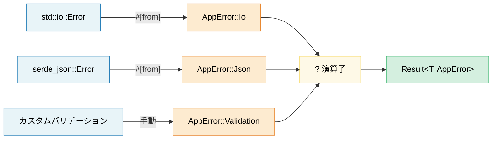

# 10. エラー処理パターン 🟢

> **学習内容:**
> - `thiserror`（ライブラリ向け）と `anyhow`（アプリケーション向け）の使い分け
> - `#[from]` と `.context()` ラッパーによるエラー変換チェーン
> - `?` 演算子の脱糖（desugar）の仕組みと `main()` での動作
> - パニックとエラー返却の使い分け、およびFFI境界での `catch_unwind`

## thiserror vs anyhow — ライブラリとアプリケーション

Rust のエラー処理は `Result<T, E>` 型を中心に行われます。主に2つのクレートが広く使われています:

```rust,ignore
// --- thiserror: ライブラリ向け ---
// derive マクロを通じて Display, Error, From の実装を自動生成
use thiserror::Error;

#[derive(Error, Debug)]
pub enum DatabaseError {
    #[error("connection failed: {0}")]
    ConnectionFailed(String),

    #[error("query error: {source}")]
    QueryError {
        #[source]
        source: sqlx::Error,
    },

    #[error("record not found: table={table} id={id}")]
    NotFound { table: String, id: u64 },

    #[error(transparent)] // 内部エラーへ Display を委譲
    Io(#[from] std::io::Error), // From<io::Error> を自動生成
}

// --- anyhow: アプリケーション向け ---
// 動的エラー型 — エラーを上位へ伝播させたいトップレベルのコードに最適
use anyhow::{Context, Result, bail, ensure};

fn read_config(path: &str) -> Result<Config> {
    let content = std::fs::read_to_string(path)
        .with_context(|| format!("設定ファイルの読み込みに失敗しました: {path}"))?;

    let config: Config = serde_json::from_str(&content)
        .context("設定JSONのパースに失敗しました")?;

    ensure!(config.port > 0, "ポート番号は正の値でなければなりません。指定値: {}", config.port);

    Ok(config)
}

fn main() -> Result<()> {
    let config = read_config("server.toml")?;

    if config.name.is_empty() {
        bail!("サーバー名を空にすることはできません"); // 即座に Err を返す
    }

    Ok(())
}
```

**使い分けの基準**:

| | `thiserror` | `anyhow` |
|---|---|---|
| **使用場所** | ライブラリ、共有クレート | アプリケーション、バイナリ |
| **エラー型** | 具体的な列挙型（enum）— 呼び出し元でマッチ可能 | `anyhow::Error` — 隠蔽（不透明） |
| **実装の手間** | エラー列挙型の定義が必要 | `Result<T>` を使うだけ |
| **ダウンキャスト** | 不要 — パターンマッチで処理 | `error.downcast_ref::<MyError>()` |

### エラー変換チェーン (#[from])

```rust,ignore
use thiserror::Error;

#[derive(Error, Debug)]
enum AppError {
    #[error("I/O error: {0}")]
    Io(#[from] std::io::Error),

    #[error("JSON error: {0}")]
    Json(#[from] serde_json::Error),

    #[error("HTTP error: {0}")]
    Http(#[from] reqwest::Error),
}

// これにより ? 演算子が自動的に型変換を行います:
fn fetch_and_parse(url: &str) -> Result<Config, AppError> {
    let body = reqwest::blocking::get(url)?.text()?;  // reqwest::Error → AppError::Http
    let config: Config = serde_json::from_str(&body)?; // serde_json::Error → AppError::Json
    Ok(config)
}
```

### コンテキストとエラーのラッピング

元のエラー情報を失うことなく、人間にわかりやすいコンテキストを追加します:

```rust,ignore
use anyhow::{Context, Result};

fn process_file(path: &str) -> Result<Data> {
    let content = std::fs::read_to_string(path)
        .with_context(|| format!("{path} の読み込みに失敗しました"))?;

    let data = parse_content(&content)
        .with_context(|| format!("{path} のパースに失敗しました"))?;

    validate(&data)
        .context("バリデーションに失敗しました")?;

    Ok(data)
}

// エラー出力例:
// Error: バリデーションに失敗しました
//
// Caused by:
//    0: config.json のパースに失敗しました
//    1: expected ',' at line 5 column 12
```

### ? 演算子の詳細

`?` は `match` + `From` による変換 + 早期リターン（early return）の糖衣構文（シンタックスシュガー）です:

```rust
// 次のコードは:
let value = operation()?;

// 以下のように脱糖（展開）されます:
let value = match operation() {
    Ok(v) => v,
    Err(e) => return Err(From::from(e)),
    //                  ^^^^^^^^^^^^^^
    //                  From トレイトによる自動変換
};
```

**`?` は `Option` でも機能します**（`Option` を返す関数内にて）:

```rust
fn find_user_email(users: &[User], name: &str) -> Option<String> {
    let user = users.iter().find(|u| u.name == name)?; // 見つからなければ None を返す
    let email = user.email.as_ref()?; // email が None なら None を返す
    Some(email.to_uppercase())
}
```

### パニック、catch_unwind、そしてアボートすべき場合

```rust
// パニック: 想定されるエラーではなく、バグ（プログラムの不具合）に対して使用
fn get_element(data: &[i32], index: usize) -> &i32 {
    // これがパニックする場合、それはプログラミングエラー（バグ）です。
    // エラーとして「処理」するのではなく、呼び出し元を修正してください。
    &data[index]
}

// catch_unwind: 境界部分（FFI、スレッドプール等）で使用
use std::panic;

let result = panic::catch_unwind(|| {
    // パニックする可能性のあるコードを安全に実行
    risky_operation()
});

match result {
    Ok(value) => println!("成功: {value:?}"),
    Err(_) => eprintln!("処理がパニックしました — 安全に継続します"),
}

// 使い分けの指針:
// - Result<T, E> → 予期される失敗（ファイルが見つからない、ネットワークタイムアウト等）
// - panic!()     → プログラミング上のバグ（インデックス範囲外アクセス、不変条件の破綻等）
// - process::abort() → 回復不能な状態（セキュリティ侵害、データの破損等）
```

> **C++ との比較**: `Result<T, E>` は、予期されるエラーに対する例外を置き換えるものです。
> `panic!()` は `assert()` や `std::terminate()` に相当し、制御フローのためではなくバグのために存在します。
> Rust の `?` 演算子は、予測不能な制御フローを引き起こすことなく、例外と同等のエルゴノミクス（使いやすさ）でエラーを伝播させます。

> **エラー処理の重要ポイント**
> - ライブラリ: 構造化されたエラー列挙型を定義するために `thiserror` を使用。アプリケーション: 人間工学的な伝播のために `anyhow` を使用
> - `#[from]` は `From` 実装を自動生成し、`.context()` は人間に読みやすいラッパーを追加する
> - `?` は `From::from()` + 早期リターンに脱糖される。`Result` を返す `main()` でも機能する

> **関連情報:** 「parse, don't validate（バリデーションではなくパースせよ）」パターンについては [第15章 — クレートアーキテクチャとAPI設計](ch15-crate-architecture-and-api-design.md) を、serde のエラー処理については [第11章 — シリアライゼーション](ch11-serialization-zero-copy-and-binary-data.md) を参照してください。



---

### 演習: thiserror によるエラー階層設計 ★★（約30分）

I/O、パース（JSON および CSV）、バリデーションの各フェーズで失敗する可能性のあるファイル処理アプリケーション向けのエラー型階層を設計してください。`thiserror` を使用し、`?` による伝播を実演してください。

<details>
<summary>🔑 解答例</summary>

```rust,ignore
use thiserror::Error;

#[derive(Error, Debug)]
pub enum AppError {
    #[error("I/O error: {0}")]
    Io(#[from] std::io::Error),

    #[error("JSON parse error: {0}")]
    Json(#[from] serde_json::Error),

    #[error("CSV error at line {line}: {message}")]
    Csv { line: usize, message: String },

    #[error("validation error: {field} — {reason}")]
    Validation { field: String, reason: String },
}

fn read_file(path: &str) -> Result<String, AppError> {
    Ok(std::fs::read_to_string(path)?) // #[from] により io::Error → AppError::Io
}

fn parse_json(content: &str) -> Result<serde_json::Value, AppError> {
    Ok(serde_json::from_str(content)?) // serde_json::Error → AppError::Json
}

fn validate_name(value: &serde_json::Value) -> Result<String, AppError> {
    let name = value.get("name")
        .and_then(|v| v.as_str())
        .ok_or_else(|| AppError::Validation {
            field: "name".into(),
            reason: "nullでない文字列でなければなりません".into(),
        })?;

    if name.is_empty() {
        return Err(AppError::Validation {
            field: "name".into(),
            reason: "空文字であってはなりません".into(),
        });
    }

    Ok(name.to_string())
}

fn process_file(path: &str) -> Result<String, AppError> {
    let content = read_file(path)?;
    let json = parse_json(&content)?;
    let name = validate_name(&json)?;
    Ok(name)
}

fn main() {
    match process_file("config.json") {
        Ok(name) => println!("名前: {name}"),
        Err(e) => eprintln!("エラー: {e}"),
    }
}
```

</details>

***
