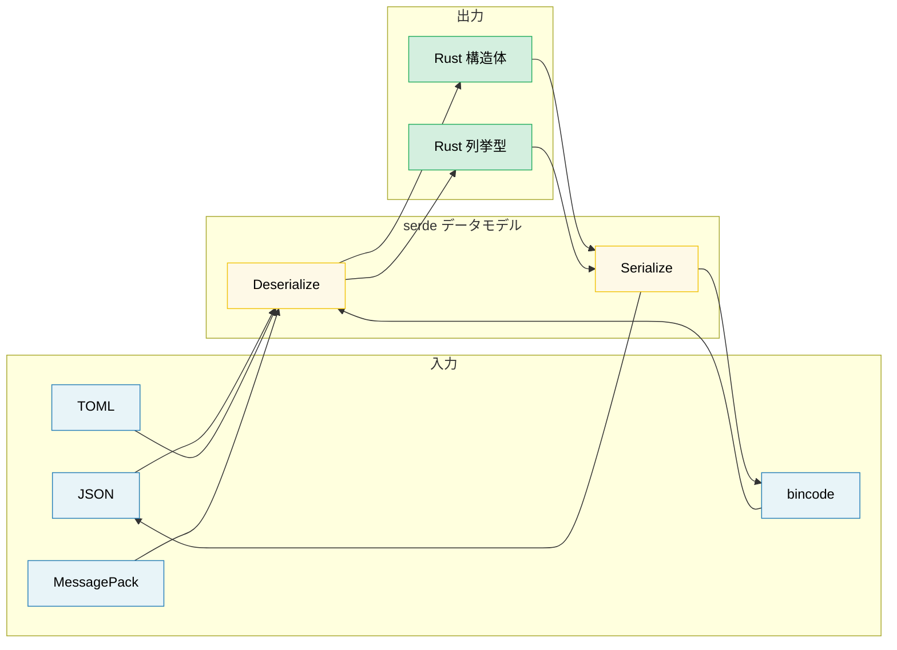

# 11. シリアライゼーション、ゼロコピー、バイナリデータ 🟡

> **学習内容:**
> - serde の基本: derive マクロ、属性、列挙型（enum）の表現形式
> - 読み取り負荷の高いワークロード向けのゼロコピーデシリアライゼーション
> - serde のフォーマットエコシステム（JSON、TOML、bincode、MessagePack）
> - `repr(C)`、zerocopy、`bytes::Bytes` を用いたバイナリデータの取り扱い

## serde の基本

`serde`（SERialize/DEserialize）は Rust におけるデファクトスタンダードのシリアライゼーションフレームワークです。
**データモデル**（自作の構造体）と**フォーマット**（JSON、TOML、バイナリなど）を明確に分離します:

```rust,ignore
use serde::{Serialize, Deserialize};

#[derive(Debug, Serialize, Deserialize)]
struct ServerConfig {
    name: String,
    port: u16,
    #[serde(default)]                    // 欠落している場合は Default::default() を使用
    max_connections: usize,
    #[serde(skip_serializing_if = "Option::is_none")]
    tls_cert_path: Option<String>,
}

fn main() -> Result<(), Box<dyn std::error::Error>> {
    // JSON からデシリアライズ:
    let json_input = r#"{
        "name": "hw-diag",
        "port": 8080
    }"#;
    let config: ServerConfig = serde_json::from_str(json_input)?;
    println!("{config:?}");
    // ServerConfig { name: "hw-diag", port: 8080, max_connections: 0, tls_cert_path: None }

    // JSON へシリアライズ:
    let output = serde_json::to_string_pretty(&config)?;
    println!("{output}");

    // 同じ構造体で異なるフォーマットに対応 — コード変更は不要:
    let toml_input = r#"
        name = "hw-diag"
        port = 8080
    "#;
    let config: ServerConfig = toml::from_str(toml_input)?;
    println!("{config:?}");

    Ok(())
}
```

> **重要なポイント**: 構造体に対して一度 `Serialize` と `Deserialize` を derive すれば、JSON、TOML、YAML、bincode、MessagePack、CBOR、postcard など、serde と互換性のある*あらゆる*フォーマットでそのまま利用できます。

### よく使われる serde 属性

serde はフィールド属性やコンテナ属性を通じて、シリアライゼーションのきめ細かな制御を提供します:

```rust,ignore
use serde::{Serialize, Deserialize};

// --- コンテナ属性（構造体/列挙型全体に適用） ---
#[derive(Serialize, Deserialize)]
#[serde(rename_all = "camelCase")]       // JSON の慣例: field_name → fieldName
#[serde(deny_unknown_fields)]            // 未知のキーを拒否 — 厳格なパース
struct DiagResult {
    test_name: String,                   // "testName" としてシリアライズ
    pass_count: u32,                     // "passCount" としてシリアライズ
    fail_count: u32,                     // "failCount" としてシリアライズ
}

// --- フィールド属性 ---
#[derive(Serialize, Deserialize)]
struct Sensor {
    #[serde(rename = "sensor_id")]       // シリアライズ時のフィールド名を上書き
    id: u64,

    #[serde(default)]                    // 入力に存在しない場合は Default を使用
    enabled: bool,

    #[serde(default = "default_threshold")]
    threshold: f64,

    #[serde(skip)]                       // シリアライズ/デシリアライズから完全に除外
    cached_value: Option<f64>,

    #[serde(skip_serializing_if = "Vec::is_empty")]
    tags: Vec<String>,

    #[serde(flatten)]                    // ネストされた構造体のフィールドをフラットに展開
    metadata: Metadata,

    #[serde(with = "hex_bytes")]         // カスタムのシリアライズ/デシリアライズモジュールを使用
    raw_data: Vec<u8>,
}

fn default_threshold() -> f64 { 1.0 }

#[derive(Serialize, Deserialize)]
struct Metadata {
    vendor: String,
    model: String,
}
// #[serde(flatten)] を指定すると、JSON は次のようになります:
// { "sensor_id": 1, "vendor": "Intel", "model": "X200", ... }
// 以下のようなネスト構造にはなりません:
// { "sensor_id": 1, "metadata": { "vendor": "Intel", ... } }
```

**頻出属性のチートシート**:

| 属性 | レベル | 効果 |
|-----------|-------|--------|
| `rename_all = "camelCase"` | コンテナ | 全フィールド名を camelCase / snake_case / SCREAMING_SNAKE_CASE に変換 |
| `deny_unknown_fields` | コンテナ | 未定義のキーが存在する場合にエラーとする（厳格モード） |
| `default` | フィールド | フィールドが存在しない場合に `Default::default()` を使用 |
| `rename = "..."` | フィールド | シリアライズ名を個別指定 |
| `skip` | フィールド | シリアライズ・デシリアライズから完全に除外 |
| `skip_serializing_if = "fn"` | フィールド | 条件付きでシリアライズを除外（例: `Option::is_none`） |
| `flatten` | フィールド | ネストされた構造体のフィールドをインライン展開 |
| `with = "module"` | フィールド | カスタムのシリアライズ/デシリアライズ関数モジュールを指定 |
| `alias = "..."` | フィールド | デシリアライズ時に受け付ける別名を指定 |
| `deserialize_with = "fn"` | フィールド | デシリアライズ時のみカスタム関数を使用 |
| `untagged` | 列挙型 | 各ヴァリアントを順に試行（出力にタグ・判別子を含めない） |

### 列挙型（enum）の表現形式

serde は JSON などのフォーマットにおいて、列挙型に対して4つの表現形式を提供しています:

```rust,ignore
use serde::{Serialize, Deserialize};

// 1. 外部タグ付き（Externally tagged — デフォルト）:
#[derive(Serialize, Deserialize)]
enum Command {
    Reboot,
    RunDiag { test_name: String, timeout_secs: u64 },
    SetFanSpeed(u8),
}
// "Reboot"                                          → Command::Reboot
// {"RunDiag": {"test_name": "gpu", "timeout_secs": 60}}  → Command::RunDiag { ... }

// 2. 内部タグ付き（Internally tagged）— #[serde(tag = "type")]:
#[derive(Serialize, Deserialize)]
#[serde(tag = "type")]
enum Event {
    Start { timestamp: u64 },
    Error { code: i32, message: String },
    End   { timestamp: u64, success: bool },
}
// {"type": "Start", "timestamp": 1706000000}
// {"type": "Error", "code": 42, "message": "timeout"}

// 3. 隣接タグ付き（Adjacently tagged）— #[serde(tag = "t", content = "c")]:
#[derive(Serialize, Deserialize)]
#[serde(tag = "t", content = "c")]
enum Payload {
    Text(String),
    Binary(Vec<u8>),
}
// {"t": "Text", "c": "hello"}
// {"t": "Binary", "c": [0, 1, 2]}

// 4. タグなし（Untagged）— #[serde(untagged)]:
#[derive(Serialize, Deserialize)]
#[serde(untagged)]
enum StringOrNumber {
    Str(String),
    Num(f64),
}
// "hello" → StringOrNumber::Str("hello")
// 42.0    → StringOrNumber::Num(42.0)
// ⚠️ 定義順に試行され、最初にマッチしたヴァリアントが採用されます
```

> **どの表現形式を選ぶべきか**: 大半の JSON API では内部タグ付き（`tag = "type"`）が推奨されます。最も可読性が高く、Go、Python、TypeScript などの一般的な規約とも合致します。タグなし（untagged）は、データ構造の形状だけで一意に判別できる「Union」型に限定して使用してください。

### ゼロコピーデシリアライゼーション

serde は新しい文字列をヒープに割り当てることなく、入力バッファから直接借用（borrow）してデシリアライズできます。これは高パフォーマンスなパース処理を実現する鍵となります:

```rust,ignore
use serde::Deserialize;

// --- 所有型（メモリ割り当てを伴う） ---
// 各 String フィールドは入力からバイト列をコピーし、新たなヒープ領域に割り当てます。
#[derive(Deserialize)]
struct OwnedRecord {
    name: String,           // 新しい String を割り当て
    value: String,          // 別の String を割り当て
}

// --- ゼロコピー（借用） ---
// &'de str フィールドは入力から直接参照 — アロケーションはゼロです。
#[derive(Deserialize)]
struct BorrowedRecord<'a> {
    name: &'a str,          // 入力バッファの内部を指す
    value: &'a str,         // 入力バッファの内部を指す
}

fn main() {
    let input = r#"{"name": "cpu_temp", "value": "72.5"}"#;

    // 所有型: 2つの String オブジェクトをヒープ割り当て
    let owned: OwnedRecord = serde_json::from_str(input).unwrap();

    // ゼロコピー: `name` と `value` は `input` を直接参照 — アロケーションなし
    let borrowed: BorrowedRecord = serde_json::from_str(input).unwrap();

    // 出力はライフタイムに束縛される: borrowed は input より長く生存できない
    println!("{}: {}", borrowed.name, borrowed.value);
}
```

**ライフタイムの理解**:

```rust,ignore
// Deserialize<'de> — 構造体はライフタイム 'de のデータから借用可能:
//   struct BorrowedRecord<'a> where 'a == 'de
//   入力バッファが十分長く生存する場合にのみ動作
//
// DeserializeOwned — 構造体がすべてのデータを所有し、借用しない:
//   trait DeserializeOwned: for<'de> Deserialize<'de> {}
//   入力のライフタイムに制約されない（構造体が独立している）

use serde::de::DeserializeOwned;

// この関数は所有型を要求 — 入力データは一時的なものでもよい
fn parse_owned<T: DeserializeOwned>(input: &str) -> T {
    serde_json::from_str(input).unwrap()
}

// この関数は借用を許容 — 効率的だがライフタイムの制約を受ける
fn parse_borrowed<'a, T: Deserialize<'a>>(input: &'a str) -> T {
    serde_json::from_str(input).unwrap()
}
```

**ゼロコピーを使うべき場合**:
- 少数のフィールドしか必要としない巨大なファイルのパース
- 高スループットなパイプライン（ネットワークパケット、ログ行など）
- 入力バッファがすでに十分長く生存している場合（メモリマップドファイルなど）

**ゼロコピーを使うべきではない場合**:
- 入力データが短命な場合（再利用されるネットワーク受信バッファなど）
- パース結果を入力データのライフタイムを超えて保持する必要がある場合
- フィールドの変換が必要な場合（エスケープ解除、正規化など）

> **実践的なヒント**: `Cow<'a, str>` を使うと両者の利点が得られます。可能な限り借用し、必要な場合（JSON エスケープシーケンスの解除など）にのみアロケーションを行います。serde は `Cow` をネイティブにサポートしています。

### フォーマットのエコシステム

| フォーマット | クレート | 可読性（人間向け） | サイズ | 速度 | 主な用途 |
|--------|-------|:--------------:|:----:|:-----:|----------|
| JSON | `serde_json` | ✅ | 大 | 良好 | 設定ファイル、REST API、ロギング |
| TOML | `toml` | ✅ | 中 | 良好 | 設定ファイル（Cargo.toml スタイル） |
| YAML | `serde_yaml` | ✅ | 中 | 良好 | 設定ファイル（複雑なネスト構造） |
| bincode | `bincode` | ❌ | 小 | 高速 | プロセス間通信（IPC）、キャッシュ、Rust 間通信 |
| postcard | `postcard` | ❌ | 極小 | 極めて高速 | 組み込みシステム、`no_std` |
| MessagePack | `rmp-serde` | ❌ | 小 | 高速 | 言語横断のバイナリプロトコル |
| CBOR | `ciborium` | ❌ | 小 | 高速 | IoT、リソース制約環境 |

```rust
// 同一の構造体を多様なフォーマットで扱う — serde の真価:

#[derive(serde::Serialize, serde::Deserialize, Debug)]
struct DiagConfig {
    name: String,
    tests: Vec<String>,
    timeout_secs: u64,
}

let config = DiagConfig {
    name: "accel_diag".into(),
    tests: vec!["memory".into(), "compute".into()],
    timeout_secs: 300,
};

// JSON:   {"name":"accel_diag","tests":["memory","compute"],"timeout_secs":300}
let json = serde_json::to_string(&config).unwrap();       // 67 バイト

// bincode: コンパクトなバイナリ — 約40バイト、フィールド名は含まれない
let bin = bincode::serialize(&config).unwrap();            // はるかに小さい

// postcard: さらに小型、可変長整数（varint）エンコーディング — 組み込みに最適
// let post = postcard::to_allocvec(&config).unwrap();
```

> **フォーマット選定の目安**:
> - 人間が編集する設定ファイル → TOML または JSON
> - Rust 同士の IPC やキャッシュ → bincode（高速・軽量、ただし他言語非対応）
> - 言語横断のバイナリ通信 → MessagePack または CBOR
> - 組み込み / `no_std` → postcard

### バイナリデータと repr(C)

ハードウェア診断では、バイナリプロトコルデータのパースが頻出します。Rust は安全かつゼロコピーでバイナリデータを処理するための強力なツールを提供しています:

```rust
// --- #[repr(C)]: 予測可能なメモリレイアウト ---
// C 言語のパディング規則に従い、宣言順にフィールドを配置することを保証します。
// ハードウェアレジスタのレイアウトやプロトコルヘッダと一致させるために不可欠です。

#[repr(C)]
#[derive(Debug, Clone, Copy)]
struct IpmiHeader {
    rs_addr: u8,
    net_fn_lun: u8,
    checksum: u8,
    rq_addr: u8,
    rq_seq_lun: u8,
    cmd: u8,
}

// --- 手動デシリアライズによる安全なバイナリパース ---
impl IpmiHeader {
    fn from_bytes(data: &[u8]) -> Option<Self> {
        if data.len() < size_of::<Self>() {
            return None;
        }
        Some(IpmiHeader {
            rs_addr:     data[0],
            net_fn_lun:  data[1],
            checksum:    data[2],
            rq_addr:     data[3],
            rq_seq_lun:  data[4],
            cmd:         data[5],
        })
    }

    fn net_fn(&self) -> u8 { self.net_fn_lun >> 2 }
    fn lun(&self)    -> u8 { self.net_fn_lun & 0x03 }
}

// --- エンディアンを考慮したパース ---
fn read_u16_le(data: &[u8], offset: usize) -> u16 {
    u16::from_le_bytes([data[offset], data[offset + 1]])
}

fn read_u32_be(data: &[u8], offset: usize) -> u32 {
    u32::from_be_bytes([
        data[offset], data[offset + 1],
        data[offset + 2], data[offset + 3],
    ])
}

// --- #[repr(C, packed)]: パディングの排除（アライメント = 1） ---
#[repr(C, packed)]
#[derive(Debug, Clone, Copy)]
struct PcieCapabilityHeader {
    cap_id: u8,        // ケーパビリティ ID
    next_cap: u8,      // 次のケーパビリティへのポインタ
    cap_reg: u16,      // ケーパビリティ固有レジスタ
}
// ⚠️ パックされた構造体: &field で参照を取るとミスアライメント参照になり未定義動作（UB）を引き起こします。
// 必ず値をコピーして取り出してください: let id = header.cap_id; // OK (Copy)
// 決して行ってはならない例: let r = &header.cap_reg;            // アライメント違反時は UB
```

### zerocopy と bytemuck — 安全な型変換（Transmutation）

`unsafe` な `transmute` の代わりに、コンパイル時にレイアウトの安全性を検証するクレートを使用します:

```rust
// --- zerocopy: コンパイル時に検証されるゼロコピー変換 ---
// Cargo.toml: zerocopy = { version = "0.8", features = ["derive"] }

use zerocopy::{FromBytes, IntoBytes, KnownLayout, Immutable};

#[derive(FromBytes, IntoBytes, KnownLayout, Immutable, Debug)]
#[repr(C)]
struct SensorReading {
    sensor_id: u16,
    flags: u8,
    _reserved: u8,
    value: u32,     // 固定小数点: 実測値 = value / 1000.0
}

fn parse_sensor(raw: &[u8]) -> Option<&SensorReading> {
    // 安全なゼロコピー: アライメントとサイズをコンパイル時に検証
    SensorReading::ref_from_bytes(raw).ok()
    // raw の内部を指す &SensorReading を返す — コピーもアロケーションもなし
}

// --- bytemuck: シンプルで実績のあるクレート ---
// Cargo.toml: bytemuck = { version = "1", features = ["derive"] }

use bytemuck::{Pod, Zeroable};

#[derive(Pod, Zeroable, Clone, Copy, Debug)]
#[repr(C)]
struct GpuRegister {
    address: u32,
    value: u32,
}

fn cast_registers(data: &[u8]) -> &[GpuRegister] {
    // 安全なキャスト: Pod はすべてのビットパターンが有効であることを保証
    bytemuck::cast_slice(data)
}
```

**使い分けの基準**:

| アプローチ | 安全性 | オーバーヘッド | 使用すべきケース |
|----------|:------:|:--------:|----------|
| 手動フィールド単位パース | ✅ 安全 | フィールドのコピー | 小さな構造体、複雑なレイアウト |
| `zerocopy` | ✅ 安全 | ゼロコピー | 大きなバッファ、多数の読み込み、コンパイル時検証 |
| `bytemuck` | ✅ 安全 | ゼロコピー | シンプルな `Pod` 型、スライスのキャスト |
| `unsafe { transmute() }` | ❌ 不安全 | ゼロコピー | 最後の手段 — アプリケーションコードでは避けるべき |

### bytes::Bytes — 参照カウント付きバッファ

`bytes` クレート（tokio、hyper、tonic 等で利用）は、参照カウントを用いたゼロコピーのバイトバッファを提供します。`Bytes` と `Vec<u8>` の関係は、`Arc<[u8]>` と所有スライスの関係に相当します:

```rust
use bytes::{Bytes, BytesMut, Buf, BufMut};

fn main() {
    // --- BytesMut: データ構築用の可変バッファ ---
    let mut buf = BytesMut::with_capacity(1024);
    buf.put_u8(0x01);                    // 1バイト書き込み
    buf.put_u16(0x1234);                 // u16 を書き込み（ビッグエンディアン）
    buf.put_slice(b"hello");             // 生のバイト列を書き込み
    buf.put(&b"world"[..]);              // スライスから書き込み

    // 不変の Bytes に固定（ゼロコスト）:
    let data: Bytes = buf.freeze();

    // --- Bytes: 不変、参照カウント付き、クローン可能 ---
    let data2 = data.clone();            // 安価: 参照カウントをインクリメントするのみ（ディープコピーではない）
    let slice = data.slice(3..8);        // ゼロコピーのサブスライス（同一バッファを共有）

    // Buf トレイトを使って Bytes から読み取り:
    let mut reader = &data[..];
    let byte = reader.get_u8();          // 0x01
    let short = reader.get_u16();        // 0x1234

    // コピーなしでバッファを分割:
    let mut original = Bytes::from_static(b"HEADER\x00PAYLOAD");
    let header = original.split_to(6);   // header = "HEADER", original = "\x00PAYLOAD"

    println!("header: {:?}", &header[..]);
    println!("payload: {:?}", &original[1..]);
}
```

**`bytes` vs `Vec<u8>`**:

| 機能 | `Vec<u8>` | `Bytes` |
|---------|-----------|---------|
| クローンコスト | O(n) ディープコピー | O(1) 参照カウントの加算 |
| サブスライス | ライフタイム付き借用 | 所有型、参照カウントで追跡 |
| スレッド安全性 | `Sync` ではない（`Arc` が必要） | `Send + Sync` を標準サポート |
| 可変性 | 直接 `&mut` で変更可能 | 事前に `BytesMut` への分割が必要 |
| エコシステム | 標準ライブラリ | tokio, hyper, tonic, axum |

> **bytes を使うべき場面**: ネットワークプロトコル、パケット解析など、受信したバッファを分割して異なるコンポーネントやスレッドで処理するシナリオに最適です。ゼロコピーでのスライス分割は非常に強力な機能です。

> **シリアライゼーション＆バイナリデータの重要ポイント**
> - serde の derive マクロが90%のユースケースに対応。残りは各種属性（`rename`, `skip`, `default` など）で細かく制御
> - ゼロコピーデシリアライゼーション（構造体内の `&'a str`）により、読み取り負荷の高い処理でのヒープアロケーションを回避
> - ハードウェアレジスタのレイアウトには `repr(C)` + `zerocopy`/`bytemuck` を使用。参照カウント付きバッファには `bytes::Bytes` を活用

> **関連情報:** serde のエラーと `thiserror` の連携については [第10章 — エラー処理パターン](ch10-error-handling-patterns.md) を、`repr(C)` と FFI データレイアウトについては [第12章 — Unsafe Rust](ch12-unsafe-rust-controlled-danger.md) を参照してください。



---

### 演習: カスタム serde デシリアライザ ★★★（約45分）

`"30s"`, `"5m"`, `"2h"` のような人間にとって読みやすい文字列からデシリアライズを行うカスタム serde デシリアライザを備えた `HumanDuration` ラッパーを設計してください。また、同一の文字列表中現へ再シリアライズできるようにしてください。

<details>
<summary>🔑 解答例</summary>

```rust,ignore
use serde::{Deserialize, Deserializer, Serialize, Serializer};
use std::fmt;

#[derive(Debug, Clone, PartialEq)]
struct HumanDuration(std::time::Duration);

impl HumanDuration {
    fn from_str(s: &str) -> Result<Self, String> {
        let s = s.trim();
        if s.is_empty() { return Err("空の期間文字列です".into()); }

        let (num_str, suffix) = s.split_at(
            s.find(|c: char| !c.is_ascii_digit()).unwrap_or(s.len())
        );
        let value: u64 = num_str.parse()
            .map_err(|_| format!("無効な数値です: {num_str}"))?;

        let duration = match suffix {
            "s" | "sec"  => std::time::Duration::from_secs(value),
            "m" | "min"  => std::time::Duration::from_secs(value * 60),
            "h" | "hr"   => std::time::Duration::from_secs(value * 3600),
            "ms"         => std::time::Duration::from_millis(value),
            other        => return Err(format!("未知の接尾辞です: {other}")),
        };
        Ok(HumanDuration(duration))
    }
}

impl fmt::Display for HumanDuration {
    fn fmt(&self, f: &mut fmt::Formatter<'_>) -> fmt::Result {
        let secs = self.0.as_secs();
        if secs == 0 {
            write!(f, "{}ms", self.0.as_millis())
        } else if secs % 3600 == 0 {
            write!(f, "{}h", secs / 3600)
        } else if secs % 60 == 0 {
            write!(f, "{}m", secs / 60)
        } else {
            write!(f, "{}s", secs)
        }
    }
}

impl Serialize for HumanDuration {
    fn serialize<S: Serializer>(&self, serializer: S) -> Result<S::Ok, S::Error> {
        serializer.serialize_str(&self.to_string())
    }
}

impl<'de> Deserialize<'de> for HumanDuration {
    fn deserialize<D: Deserializer<'de>>(deserializer: D) -> Result<Self, D::Error> {
        let s = String::deserialize(deserializer)?;
        HumanDuration::from_str(&s).map_err(serde::de::Error::custom)
    }
}

#[derive(Debug, Deserialize, Serialize)]
struct Config {
    timeout: HumanDuration,
    retry_interval: HumanDuration,
}

fn main() {
    let json = r#"{ "timeout": "30s", "retry_interval": "5m" }"#;
    let config: Config = serde_json::from_str(json).unwrap();

    assert_eq!(config.timeout.0, std::time::Duration::from_secs(30));
    assert_eq!(config.retry_interval.0, std::time::Duration::from_secs(300));

    let serialized = serde_json::to_string(&config).unwrap();
    assert!(serialized.contains("30s"));
    println!("設定: {serialized}");
}
```

</details>

***
