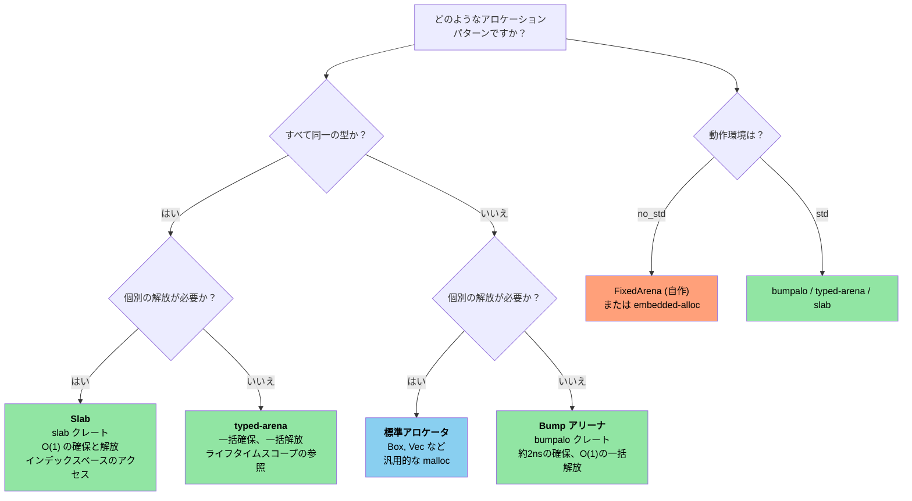

# 12. Unsafe Rust — 制御された危険 🔴

> **学習内容:**
> - 5つの Unsafe スーパーパワーとそれぞれが必要となる場面
> - 健全（sound）な抽象化の構築: 安全な API と unsafe な内部実装
> - Rust から C を呼び出す（およびその逆の）FFI パターン
> - よくある未定義動作（UB）の落とし穴とアリーナ/スラブアロケータパターン

## 5つの Unsafe スーパーパワー

`unsafe` キーワードは、コンパイラが安全性を検証できない5つの操作を解放します:

```rust
// SAFETY: 各操作の安全性に関する理由は以下のインラインコメントで説明しています。
unsafe {
    // 1. 生ポインタ（raw pointer）の参照外し
    let ptr: *const i32 = &42;
    let value = *ptr; // ダングリングポインタやヌルポインタの可能性がある

    // 2. unsafe な関数やメソッドの呼び出し
    let layout = std::alloc::Layout::new::<u64>();
    let mem = std::alloc::alloc(layout);

    // 3. 可変静的変数（mutable static）へのアクセス
    static mut COUNTER: u32 = 0;
    COUNTER += 1; // 複数スレッドからアクセスされるとデータ競合が発生する

    // 4. unsafe なトレイトの実装
    // unsafe impl Send for MyType {}

    // 5. 共用体（union）のフィールドへのアクセス
    // union IntOrFloat { i: i32, f: f32 }
    // let u = IntOrFloat { i: 42 };
    // let f = u.f; // ビット列の再解釈 — 不正な値になる可能性がある
}
```

> **重要な原則**: `unsafe` は借用チェッカーや型システムを無効化するわけではありません。
> これら特定の5つの機能のみを解放します。その他のすべての Rust の規則は依然として適用されます。

### 健全な抽象化の構築

`unsafe` の目的は、安全ではない操作をカプセル化して**安全な抽象化（safe abstraction）**を構築することです:

```rust
/// 固定容量のスタック割り当てバッファ。
/// すべてのパブリックメソッドは安全（safe）であり、unsafe は内部にカプセル化されています。
pub struct StackBuf<T, const N: usize> {
    data: [std::mem::MaybeUninit<T>; N],
    len: usize,
}

impl<T, const N: usize> StackBuf<T, N> {
    pub fn new() -> Self {
        StackBuf {
            // 各要素は個別に MaybeUninit であり、unsafe は不要です。
            // `const { ... }` ブロック（Rust 1.79+）により、非 Copy な
            // 定数式を N 回繰り返すことができます。
            data: [const { std::mem::MaybeUninit::uninit() }; N],
            len: 0,
        }
    }

    pub fn push(&mut self, value: T) -> Result<(), T> {
        if self.len >= N {
            return Err(value); // バッファが満杯 — 呼び出し元に値を返却
        }
        // SAFETY: len < N であるため、data[len] は境界内にあります。
        // MaybeUninit のスロットに有効な T を書き込みます。
        self.data[self.len] = std::mem::MaybeUninit::new(value);
        self.len += 1;
        Ok(())
    }

    pub fn get(&self, index: usize) -> Option<&T> {
        if index < self.len {
            // SAFETY: index < len であり、data[0..len] はすべて初期化されています。
            Some(unsafe { self.data[index].assume_init_ref() })
        } else {
            None
        }
    }
}

impl<T, const N: usize> Drop for StackBuf<T, N> {
    fn drop(&mut self) {
        // SAFETY: data[0..len] は初期化済みであるため、適切にドロップします。
        for i in 0..self.len {
            unsafe { self.data[i].assume_init_drop(); }
        }
    }
}
```

**健全な unsafe コードの3原則**:
1. **不変条件の文書化** — すべての `// SAFETY:` コメントで、なぜその操作が正当であるかを説明する
2. **カプセル化** — unsafe な処理を安全な API の内側に閉じ込め、利用者が未定義動作（UB）を引き起こせないようにする
3. **局所化（最小化）** — `unsafe` ブロックは必要最小限の範囲に留める

### FFI パターン: Rust から C を呼び出す

```rust
// C 関数のシグネチャを宣言:
extern "C" {
    fn strlen(s: *const std::ffi::c_char) -> usize;
    fn printf(format: *const std::ffi::c_char, ...) -> std::ffi::c_int;
}

// 安全なラッパー関数:
fn safe_strlen(s: &str) -> usize {
    let c_string = std::ffi::CString::new(s).expect("文字列にヌルバイトが含まれています");
    // SAFETY: c_string は呼び出しの間生存する有効なヌル終端文字列です。
    unsafe { strlen(c_string.as_ptr()) }
}

// C から Rust を呼び出す（関数をエクスポート）:
#[no_mangle]
pub extern "C" fn rust_add(a: i32, b: i32) -> i32 {
    a + b
}
```

**一般的な FFI 型の対応表**:

| Rust | C | 備考 |
|------|---|-------|
| `i32` / `u32` | `int32_t` / `uint32_t` | 固定幅、安全 |
| `*const T` / `*mut T` | `const T*` / `T*` | 生ポインタ |
| `std::ffi::CStr` | `const char*`（借用） | ヌル終端、借用文字列 |
| `std::ffi::CString` | `char*`（所有） | ヌル終端、所有文字列 |
| `std::ffi::c_void` | `void` | 不透明（opaque）なポインタのターゲット |
| `Option<fn(...)>` | ヌル許容関数ポインタ | `None` = NULL |

### よくある未定義動作（UB）の落とし穴

| 落とし穴 | 例 | なぜ未定義動作（UB）なのか |
|---------|---------|------------|
| ヌルポインタの参照外し | `*std::ptr::null::<i32>()` | ヌルポインタの参照外しは常に UB |
| ダングリングポインタ | `drop()` 後の参照外し | メモリが再利用されている可能性がある |
| データ競合 | 2つのスレッドが `static mut` に書き込む | 同期されていない並行書き込み |
| 誤った `assume_init` | `MaybeUninit::<String>::uninit().assume_init()` | 未初期化メモリの読み込み。**注意**: `[const { MaybeUninit::uninit() }; N]` (Rust 1.79+) は `MaybeUninit` の配列を安全に作成する方法であり、`unsafe` や `assume_init` は不要です（上記の `StackBuf::new()` を参照）。 |
| エイリアシングルール違反 | 同一データに対して2つの `&mut` を作成 | Rust の排他エイリアシングモデルに違反 |
| 不正な列挙型の値 | `std::mem::transmute::<u8, bool>(2)` | `bool` は 0 または 1 のみ有効 |

> **本番環境で `unsafe` を使うべき場合**:
> - FFI 境界（C/C++ コードとの相互運用）
> - 性能が極めて重要なホットループ（境界線チェックの回避など）
> - 基本的なデータ構造の構築（`Vec`, `HashMap` などの内部実装）
> - 回避可能であれば、通常のアプリケーションロジック内では決して使用しない

### カスタムアロケータ — アリーナパターンとスラブパターン

C 言語では、特定の確保パターンに応じて独自の `malloc()` 代替実装を作成することがよくありました。すべてを一度に解放するアリーナアロケータ、固定サイズオブジェクト用のスラブアロケータ、高スループットシステム向けのプールアロケータなどです。Rust は `GlobalAlloc` トレイトや各種アロケータクレートを通じて同等のパワーを提供し、さらに**コンパイル時に Use-After-Free を防ぐ**ライフタイムスコープのアリーナという大きな利点も備えています。

#### アリーナアロケータ — 一括確保・一括解放

アリーナは、ポインタを進める（bump する）だけでメモリを割り当てます。個々の要素を個別に解放することはできず、アリーナ全体を一度に解放します。これはリクエスト単位やフレーム単位のメモリ割り当てに最適です:

```rust
use bumpalo::Bump;

fn process_sensor_frame(raw_data: &[u8]) {
    // このフレームの割り当て用アリーナを作成
    let arena = Bump::new();

    // アリーナ内にオブジェクトを割り当て — それぞれ約2ns（単なるポインタの加算）
    let header = arena.alloc(parse_header(raw_data));
    let readings: &mut [f32] = arena.alloc_slice_fill_default(header.sensor_count);

    for (i, chunk) in raw_data[header.payload_offset..].chunks(4).enumerate() {
        if i < readings.len() {
            readings[i] = f32::from_le_bytes(chunk.try_into().unwrap());
        }
    }

    // readings を使用...
    let avg = readings.iter().sum::<f32>() / readings.len() as f32;
    println!("フレーム平均値: {avg:.2}");

    // `arena` はここでスコープを抜けてドロップ — すべての割り当てが O(1) で一括解放される
    // 個別のデストラクタ呼び出しオーバーヘッドやメモリの断片化（フラグメンテーション）は発生しない
}
# fn parse_header(_: &[u8]) -> Header { Header { sensor_count: 4, payload_offset: 8 } }
# struct Header { sensor_count: usize, payload_offset: usize }
```

**アリーナ vs 標準アロケータ**:

| 項目 | `Vec::new()` / `Box::new()` | `Bump` アリーナ |
|--------|---------------------------|--------------|
| 確保速度 | 約25ns (malloc) | 約2ns (ポインタの加算) |
| 解放速度 | オブジェクトごとのデストラクタ | O(1) の一括解放 |
| 断片化 | あり（長時間稼働プロセス） | アリーナ内では皆無 |
| ライフタイムの安全性 | ヒープ — `Drop` 時に解放 | アリーナの参照 — コンパイル時にスコープ検証 |
| 主な用途 | 汎用 | リクエスト/フレーム/バッチ処理 |

#### `typed-arena` — 型安全なアリーナ

アリーナ内のすべてのオブジェクトが同じ型である場合、`typed-arena` を使用すると、アリーナのライフタイムに結びついた参照を返すよりシンプルな API が利用できます:

```rust
use typed_arena::Arena;

struct AstNode<'a> {
    value: i32,
    children: Vec<&'a AstNode<'a>>,
}

fn build_tree() {
    let arena: Arena<AstNode<'_>> = Arena::new();

    // ノードを割り当て — arena のライフタイムに紐づく &AstNode を返す
    let root = arena.alloc(AstNode { value: 1, children: vec![] });
    let left = arena.alloc(AstNode { value: 2, children: vec![] });
    let right = arena.alloc(AstNode { value: 3, children: vec![] });

    // ツリーを構築 — すべての参照は `arena` が生存している限り有効
    // （真に変更可能なツリーを構築するには内部可変性が必要）

    println!("ルート: {}, 左: {}, 右: {}", root.value, left.value, right.value);

    // `arena` はここでドロップ — すべてのノードが一括解放される
}
```

#### スラブアロケータ — 固定長オブジェクトプール

スラブアロケータは、固定サイズのスロットのプールを事前に確保します。オブジェクトは個別に割り当てられ返却されますが、すべてのスロットが同じサイズであるため、断片化を排除し、O(1) の確保・解放を実現します:

```rust
use slab::Slab;

struct Connection {
    id: u64,
    buffer: [u8; 1024],
    active: bool,
}

fn connection_pool_example() {
    // コネクション用のスラブを事前確保
    let mut connections: Slab<Connection> = Slab::with_capacity(256);

    // insert はキー（usize のインデックス）を返す — O(1)
    let key1 = connections.insert(Connection {
        id: 1001,
        buffer: [0; 1024],
        active: true,
    });

    let key2 = connections.insert(Connection {
        id: 1002,
        buffer: [0; 1024],
        active: true,
    });

    // キーによるアクセス — O(1)
    if let Some(conn) = connections.get_mut(key1) {
        conn.buffer[0..5].copy_from_slice(b"hello");
    }

    // remove は値を返す — O(1)、スロットは次回の insert で再利用される
    let removed = connections.remove(key2);
    assert_eq!(removed.id, 1002);

    // 次の insert は解放されたスロットを再利用 — 断片化なし
    let key3 = connections.insert(Connection {
        id: 1003,
        buffer: [0; 1024],
        active: true,
    });
    assert_eq!(key3, key2); // 同じスロットが再利用される！
}
```

#### 最小限のアリーナの実装（`no_std` 向け）

`bumpalo` を導入できないベアメタル環境向けに、`unsafe` を使って構築した最小限のアリーナを以下に示します:

```rust
#![cfg_attr(not(test), no_std)]

use core::alloc::Layout;
use core::cell::{Cell, UnsafeCell};

/// 固定サイズのバイト配列をバックエンドとするシンプルなバンプアロケータ。
/// スレッドセーフではありません — コアごとに分離するか、マルチスレッド環境ではロックと併用してください。
///
/// **重要**: `bumpalo` と同様に、このアリーナはアリーナ自身がドロップされたときに
/// 確保された要素のデストラクタを呼び出しません。`Drop` 実装を持つ型は
/// そのリソース（ファイルハンドルやソケットなど）をリークします。意味のある `Drop` 実装を
/// 持たない型のみを割り当てるか、アリーナより前に手動でドロップしてください。
pub struct FixedArena<const N: usize> {
    // ここでは UnsafeCell が必須です: `&self` 経由で `buf` を変更します。
    // UnsafeCell なしで &self.buf を *mut u8 にキャストすると未定義動作（UB）になります
    // （Rust のエイリアシングモデルに違反 — 共有参照は不変であることを意味するため）。
    buf: UnsafeCell<[u8; N]>,
    offset: Cell<usize>, // &self での割り当てを可能にする内部可変性
}

impl<const N: usize> FixedArena<N> {
    pub const fn new() -> Self {
        FixedArena {
            buf: UnsafeCell::new([0; N]),
            offset: Cell::new(0),
        }
    }

    /// アリーナ内に `T` を割り当てます。空き容量が不足している場合は `None` を返します。
    pub fn alloc<T>(&self, value: T) -> Option<&mut T> {
        let layout = Layout::new::<T>();
        let current = self.offset.get();

        // アライメントの切り上げ計算
        let aligned = (current + layout.align() - 1) & !(layout.align() - 1);
        let new_offset = aligned + layout.size();

        if new_offset > N {
            return None; // アリーナが満杯
        }

        self.offset.set(new_offset);

        // SAFETY:
        // - `aligned` は `buf` の境界内にある（上記で確認済み）
        // - アライメントは正しい（T のアライメント要件に整合している）
        // - エイリアシングなし: 各 alloc は重複しない一意の領域を返す
        // - UnsafeCell により &self 経由での変更が許可されている
        // - アリーナは返された参照よりも長く生存する（呼び出し元が保証する必要あり）
        let ptr = unsafe {
            let base = (self.buf.get() as *mut u8).add(aligned);
            let typed = base as *mut T;
            typed.write(value);
            &mut *typed
        };

        Some(ptr)
    }

    /// アリーナをリセット — 過去のすべての割り当てを無効化します。
    ///
    /// # Safety
    /// 呼び出し元は、アリーナ割り当てデータへの参照が残存していないことを保証しなければなりません。
    pub unsafe fn reset(&self) {
        self.offset.set(0);
    }

    pub fn used(&self) -> usize {
        self.offset.get()
    }

    pub fn remaining(&self) -> usize {
        N - self.offset.get()
    }
}
```

#### アロケータ戦略の選択

> **注意**: 下図は Mermaid 構文を使用しています。GitHub や Mermaid をサポートするツール（`mermaid` プラグイン付き mdBook、Mermaid 拡張機能付き VS Code など）で正しくレンダリングされます。



| C 言語のパターン | Rust での対応 | 主な利点 |
|-----------|----------------|---------------|
| 独自の `malloc()` プール | `#[global_allocator]` 実装 | 型安全、デバッグ容易 |
| `obstack` (GNU) | `bumpalo::Bump` | ライフタイムスコープ、Use-After-Free の排除 |
| カーネルスラブ (`kmem_cache`) | `slab::Slab<T>` | 型安全、インデックスベース |
| スタック割り当て一時バッファ | `FixedArena<N>` (上記) | ヒープ不要、`const` 構築可能 |
| `alloca()` | `[T; N]` または `SmallVec` | コンパイル時サイズ決定、UB なし |

> **相互参照**: ベアメタル環境でのアロケータセットアップ（`embedded-alloc` を用いた `#[global_allocator]`）については、『C プログラマのための Rust 入門』第15.1章「グローバルアロケータのセットアップ」を参照してください。組み込み固有のブートストラップ処理を網羅しています。

> **Unsafe Rust の重要ポイント**
> - 不変条件を文書化し（`SAFETY:` コメント）、安全な API の背後にカプセル化して、unsafe の適用範囲を最小限に留める
> - `[const { MaybeUninit::uninit() }; N]`（Rust 1.79+）は、従来の `assume_init` アンチパターンを置き換える推奨手法
> - FFI では `extern "C"`、`#[repr(C)]`、および慎重なヌルポインタやライフタイムの管理が必須
> - アリーナアロケータやスラブアロケータは、汎用的な柔軟性を犠牲にすることで圧倒的な割り当て速度を獲得する

> **関連情報:** 変性と unsafe コードにおけるドロップチェックの相互作用については [第4章 — PhantomData](ch04-phantomdata-types-that-carry-no-data.md) を、Pin と自己参照型については [第9章 — スマートポインタと内部可変性](ch09-smart-pointers-and-interior-mutability.md) を参照してください。

---

### 演習: Unsafe をラップする安全な抽象化 ★★★（約45分）

固定容量のスタック割り当てベクタである `FixedVec<T, const N: usize>` を実装してください。
要件:
- `push(&mut self, value: T) -> Result<(), T>`: 満杯時は `Err(value)` を返す
- `pop(&mut self) -> Option<T>`: 最後の要素を取り出して返す
- `as_slice(&self) -> &[T]`: 初期化された要素のスライスを借用する
- すべてのパブリックメソッドは安全（safe）でなければならず、すべての unsafe な処理は `SAFETY:` コメントを付与してカプセル化すること
- `Drop` で初期化済み要素を適切に解放・クリーンアップすること

<details>
<summary>🔑 解答例</summary>

```rust
use std::mem::MaybeUninit;

pub struct FixedVec<T, const N: usize> {
    data: [MaybeUninit<T>; N],
    len: usize,
}

impl<T, const N: usize> FixedVec<T, N> {
    pub fn new() -> Self {
        FixedVec {
            data: [const { MaybeUninit::uninit() }; N],
            len: 0,
        }
    }

    pub fn push(&mut self, value: T) -> Result<(), T> {
        if self.len >= N { return Err(value); }
        // SAFETY: len < N であるため、data[len] は境界内にあります。
        self.data[self.len] = MaybeUninit::new(value);
        self.len += 1;
        Ok(())
    }

    pub fn pop(&mut self) -> Option<T> {
        if self.len == 0 { return None; }
        self.len -= 1;
        // SAFETY: data[len] は初期化済みです（デクリメント前に len > 0 であったため）。
        Some(unsafe { self.data[self.len].assume_init_read() })
    }

    pub fn as_slice(&self) -> &[T] {
        // SAFETY: data[0..len] はすべて初期化されており、
        // MaybeUninit<T> は T と同一のメモリレイアウトを持ちます。
        unsafe { std::slice::from_raw_parts(self.data.as_ptr() as *const T, self.len) }
    }

    pub fn len(&self) -> usize { self.len }
    pub fn is_empty(&self) -> bool { self.len == 0 }
}

impl<T, const N: usize> Drop for FixedVec<T, N> {
    fn drop(&mut self) {
        // SAFETY: data[0..len] は初期化されています — それぞれを適切にドロップします。
        for i in 0..self.len {
            unsafe { self.data[i].assume_init_drop(); }
        }
    }
}

fn main() {
    let mut v = FixedVec::<String, 4>::new();
    v.push("hello".into()).unwrap();
    v.push("world".into()).unwrap();
    assert_eq!(v.as_slice(), &["hello", "world"]);
    assert_eq!(v.pop(), Some("world".into()));
    assert_eq!(v.len(), 1);
}
```

</details>

***
