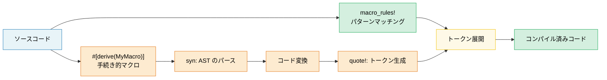

# 13. マクロ — コードを書くコード 🟡

> **学習内容:**
> - パターンマッチングと繰り返し構文を用いた宣言的マクロ（`macro_rules!`）
> - ジェネリクス/トレイトとマクロの適切な使い分け
> - 手続き的マクロ（Proc Macro）の種類: derive、属性型、関数型マクロ
> - `syn` と `quote` を用いたカスタム derive マクロの作成

## 宣言的マクロ (macro_rules!)

マクロは構文上のパターンにマッチし、コンパイル時にコードを展開します:

```rust
// HashMap を作成するシンプルなマクロ
macro_rules! hashmap {
    // マッチ対象: カンマ区切りの key => value ペア
    ( $( $key:expr => $value:expr ),* $(,)? ) => {
        {
            let mut map = std::collections::HashMap::new();
            $( map.insert($key, $value); )*
            map
        }
    };
}

let scores = hashmap! {
    "Alice" => 95,
    "Bob" => 87,
    "Carol" => 92,
};
// 展開結果:
// let mut map = HashMap::new();
// map.insert("Alice", 95);
// map.insert("Bob", 87);
// map.insert("Carol", 92);
// map
```

**マクロのフラグメント型**:

| フラグメント | マッチ対象 | 例 |
|----------|---------|---------|
| `$x:expr` | 任意の式 | `42`, `a + b`, `foo()` |
| `$x:ty` | 型 | `i32`, `Vec<String>` |
| `$x:ident` | 識別子 | `my_var`, `Config` |
| `$x:pat` | パターン | `Some(x)`, `_` |
| `$x:stmt` | 文（statement） | `let x = 5;` |
| `$x:tt` | 単一のトークンツリー | 任意（最も柔軟） |
| `$x:literal` | リテラル値 | `42`, `"hello"`, `true` |

**繰り返し（Repetition）**: `$( ... ),*` は「0個以上のカンマ区切り」を意味します

```rust
// テスト関数を自動生成する
macro_rules! test_cases {
    ( $( $name:ident: $input:expr => $expected:expr ),* $(,)? ) => {
        $(
            #[test]
            fn $name() {
                assert_eq!(process($input), $expected);
            }
        )*
    };
}

test_cases! {
    test_empty: "" => "",
    test_hello: "hello" => "HELLO",
    test_trim: "  spaces  " => "SPACES",
}
// 3つの独立した #[test] 関数が生成される
```

### マクロを使うべき場合・使うべきでない場合

**マクロを使うべき場合**:
- トレイトやジェネリクスでは対応できないボイラープレートの削減（可変長引数、DRY なテストケース生成など）
- ドメイン特化言語（DSL）の作成（`html!`, `sql!`, `vec!` など）
- 条件付きコード生成（`cfg!`, `compile_error!` など）

**マクロを使うべきでない場合**:
- 通常の関数やジェネリクスで事足りる場合（マクロはデバッグが難しく、コード補完の恩恵も受けにくい）
- マクロ内部で型チェックが必要な場合（マクロは型ではなく構文トークンを操作するため）
- そのパターンが1〜2箇所でしか使われない場合（抽象化のコストに見合わない）

```rust
// ❌ 不要なマクロ — 通常の関数で十分:
macro_rules! double {
    ($x:expr) => { $x * 2 };
}

// ✅ 通常の関数を使用:
fn double(x: i32) -> i32 { x * 2 }

// ✅ 適切なマクロの利用例 — 可変長引数は通常の関数では扱えない:
macro_rules! println {
    ($($arg:tt)*) => { /* フォーマット文字列 + 引数 */ };
}
```

### 手続き的マクロ（Proc Macro）の概要

手続き的マクロ（Procedural Macro）は、トークンストリームを受け取って変換する Rust の関数です。`proc-macro = true` を指定した独立したクレートが必要です:

```rust
// 手続き的マクロの3つの種類:

// 1. Derive マクロ — #[derive(MyTrait)]
// 構造体の定義からトレイトの実装を生成
#[derive(Debug, Clone, Serialize, Deserialize)]
struct Config {
    name: String,
    port: u16,
}

// 2. 属性型マクロ — #[my_attribute]
// アノテーションされた構文要素自体を変換
#[route(GET, "/api/users")]
async fn list_users() -> Json<Vec<User>> { /* ... */ }

// 3. 関数型マクロ — my_macro!(...)
// 独自のカスタム構文を定義
let query = sql!(SELECT * FROM users WHERE id = ?);
```

### 実践的な Derive マクロ

最も広く使われている手続き的マクロの形式です。以下は `#[derive(Debug)]` の概念的な仕組みです:

```rust
// 入力（ユーザー定義の構造体）:
#[derive(Debug)]
struct Point {
    x: f64,
    y: f64,
}

// derive マクロが生成するコード:
impl std::fmt::Debug for Point {
    fn fmt(&self, f: &mut std::fmt::Formatter<'_>) -> std::fmt::Result {
        f.debug_struct("Point")
            .field("x", &self.x)
            .field("y", &self.y)
            .finish()
    }
}
```

**よく使われる derive マクロ**:

| Derive | クレート | 生成される機能 |
|--------|-------|-------------------|
| `Debug` | std | `fmt::Debug` 実装（デバッグ出力） |
| `Clone`, `Copy` | std | 値の複製 |
| `PartialEq`, `Eq` | std | 等値比較 |
| `Hash` | std | HashMap キー用のハッシュ計算 |
| `Serialize`, `Deserialize` | serde | JSON/YAML 等のエンコード・デコード |
| `Error` | thiserror | `std::error::Error` + `Display` 実装 |
| `Parser` | `clap` | コマンドライン引数のパース |
| `Builder` | derive_builder | Builder パターンの自動実装 |

> **実践的なアドバイス**: derive マクロは積極的に活用してください。ヒューマンエラーの起きやすい定型コードを排除できます。独自の手続き的マクロを自作するのは高度なトピックです。まずは既存の確立されたマクロ（`serde`, `thiserror`, `clap` 等）を利用しましょう。

### マクロの健全性（Hygiene）と `$crate`

**健全性（Hygiene）**とは、マクロの内部で作成された識別子が呼び出し元のスコープにある識別子と衝突しない性質のことです。Rust の `macro_rules!` は*部分的に健全（partially hygienic）*です:

```rust
macro_rules! make_var {
    () => {
        let x = 42; // この 'x' はマクロ内部のスコープに属する
    };
}

fn main() {
    let x = 10;
    make_var!();   // 別の 'x' を作成（健全性による分離）
    println!("{x}"); // 42 ではなく 10 が出力される — マクロの x は外に漏れない
}
```

**`$crate`**: ライブラリ内でマクロを定義する場合は、自身のクレートを参照するために `$crate` を使用します。これにより、利用者がどのような名前でクレートをインポートしても正しく解決されます:

```rust
// my_diagnostics クレート内:

pub fn log_result(msg: &str) {
    println!("[diag] {msg}");
}

#[macro_export]
macro_rules! diag_log {
    ($($arg:tt)*) => {
        // ✅ 利用者が Cargo.toml でクレート名を変更していても、
        // $crate は常に my_diagnostics に正しく解決されます
        $crate::log_result(&format!($($arg)*))
    };
}

// ❌ $crate を使用しない場合:
// my_diagnostics::log_result(...)  ← 利用者が以下のようにリネームすると壊れる:
//   [dependencies]
//   diag = { package = "my_diagnostics", version = "1" }
```

> **鉄則**: `#[macro_export]` するマクロ内では常に `$crate::` を使用してください。自身のクレート名を直接記述してはなりません。

### 再帰マクロと `tt` マンチング（tt Munching）

再帰マクロは入力を1トークンずつ処理します。この手法は **`tt` マンチング（token-tree munching）** と呼ばれます:

```rust
// マクロに渡された式の個数をカウントする
macro_rules! count {
    // 基底ケース: トークンが残っていない場合
    () => { 0usize };
    // 再帰ケース: 1つの式を消費し、残りを再帰的にカウント
    ($head:expr $(, $tail:expr)* $(,)?) => {
        1usize + count!($($tail),*)
    };
}

fn main() {
    let n = count!("a", "b", "c", "d");
    assert_eq!(n, 4);

    // コンパイル時定数としても動作:
    const N: usize = count!(1, 2, 3);
    assert_eq!(N, 3);
}
```

```rust
// 式のリストからヘテロジニアス（異種型）なタプルを構築する:
macro_rules! tuple_from {
    // 基底ケース: 単一要素
    ($single:expr $(,)?) => { ($single,) };
    // 再帰ケース: 先頭要素 + 残りの要素
    ($head:expr, $($tail:expr),+ $(,)?) => {
        ($head, tuple_from!($($tail),+))
    };
}

let t = tuple_from!(1, "hello", 3.14, true);
// 展開結果: (1, ("hello", (3.14, (true,))))
```

**フラグメント指定子の注意点**:

| フラグメント | 注意点 |
|----------|--------|
| `$x:expr` | 貪欲にパースされる — `1 + 2` は3つのトークンではなく「1つの式」として扱われる |
| `$x:ty` | 貪欲にパースされる — `Vec<String>` は1つの型。直後に `+` や `<` を続けることはできない |
| `$x:tt` | 厳密に1つのトークンツリーにマッチ — 最も柔軟だが構文チェックは最小限 |
| `$x:ident` | 単純な識別子のみ — `std::io` のようなパスはマッチしない |
| `$x:pat` | Rust 2021 では `A \| B` パターンにマッチ。単一パターンの場合は `$x:pat_param` を使用 |

> **`tt` を使うべき場合**: パーサーによる厳格な制約をかけずに、トークンをそのまま別のマクロに転送したい場合に使用します。`$($args:tt)*` はあらゆる入力を受け付けるパターンであり、`println!`, `format!`, `vec!` 等で活用されています。

### syn と quote を用いた Derive マクロの作成

derive マクロは独立したクレート（`proc-macro = true`）に配置され、`syn`（Rust コードの構文解析）と `quote`（Rust コードの生成）を用いてトークンストリームを変換します:

```toml
# my_derive/Cargo.toml
[lib]
proc-macro = true

[dependencies]
syn = { version = "2", features = ["full"] }
quote = "1"
proc-macro2 = "1"
```

```rust
// my_derive/src/lib.rs
use proc_macro::TokenStream;
use quote::quote;
use syn::{parse_macro_input, DeriveInput};

/// 構造体名とフィールド名一覧を返す `describe()` メソッドを
/// 自動生成する derive マクロ。
#[proc_macro_derive(Describe)]
pub fn derive_describe(input: TokenStream) -> TokenStream {
    let input = parse_macro_input!(input as DeriveInput);
    let name = &input.ident;
    let name_str = name.to_string();

    // フィールド名を抽出（名前付きフィールドを持つ構造体のみ対象）
    let fields = match &input.data {
        syn::Data::Struct(data) => {
            data.fields.iter()
                .filter_map(|f| f.ident.as_ref())
                .map(|id| id.to_string())
                .collect::<Vec<_>>()
        }
        _ => vec![],
    };

    let field_list = fields.join(", ");

    let expanded = quote! {
        impl #name {
            pub fn describe() -> String {
                format!("{} {{ {} }}", #name_str, #field_list)
            }
        }
    };

    TokenStream::from(expanded)
}
```

```rust
// アプリケーションクレート側での利用:
use my_derive::Describe;

#[derive(Describe)]
struct SensorReading {
    sensor_id: u16,
    value: f64,
    timestamp: u64,
}

fn main() {
    println!("{}", SensorReading::describe());
    // 出力: "SensorReading { sensor_id, value, timestamp }"
}
```

**マクロ処理の流れ**: `TokenStream`（生のトークン列）→ `syn::parse`（抽象構文木: AST）→ 検証・変換 → `quote!`（トークン列の生成）→ `TokenStream`（コンパイラへ返却）。

| クレート | 役割 | 主な型 |
|-------|------|-----------|
| `proc-macro` | コンパイラとのインターフェース | `TokenStream` |
| `syn` | Rust ソースを AST にパース | `DeriveInput`, `ItemFn`, `Type` |
| `quote` | テンプレートから Rust トークン列を生成 | `quote!{}`, `#variable` による展開 |
| `proc-macro2` | syn/quote と proc-macro 間のブリッジ | `TokenStream`, `Span` |

> **実践的なヒント**: 独自のマクロを書く前に、`thiserror` や `derive_more` などのシンプルな derive マクロの実装を参考にすることをお勧めします。また、`cargo-expand` ツールによる `cargo expand` コマンドは、マクロがどのように展開されたかを確認でき、デバッグ時に極めて有用です。

> **マクロの重要ポイント**
> - 単純なコード生成には `macro_rules!` を、複雑な derive には手続き的マクロ（`syn` + `quote`）を使用する
> - 可能であればジェネリクスやトレイトを優先する — マクロはデバッグや保守が難しくなる傾向がある
> - `$crate` で健全性を担保し、`tt` マンチングで再帰的なパターンマッチングを実現する

> **関連情報:** トレイトやジェネリクスがマクロより優れているケースについては [第2章 — トレイト詳説](ch02-traits-in-depth.md) を、マクロが生成したコードのテスト手法については [第14章 — テストとベンチマークパターン](ch14-testing-and-benchmarking-patterns.md) を参照してください。



---

### 演習: 宣言的マクロ — `map!` ★（約15分）

キー・バリューのペアから `HashMap` を生成する `map!` マクロを作成してください:

```rust,ignore
let m = map! {
    "host" => "localhost",
    "port" => "8080",
};
assert_eq!(m.get("host"), Some(&"localhost"));
```

要件: 末尾のカンマ（trailing comma）および引数なしの呼び出し `map!{}` をサポートすること。

<details>
<summary>🔑 解答例</summary>

```rust
macro_rules! map {
    () => { std::collections::HashMap::new() };
    ( $( $key:expr => $val:expr ),+ $(,)? ) => {{
        let mut m = std::collections::HashMap::new();
        $( m.insert($key, $val); )+
        m
    }};
}

fn main() {
    let config = map! {
        "host" => "localhost",
        "port" => "8080",
        "timeout" => "30",
    };
    assert_eq!(config.len(), 3);
    assert_eq!(config["host"], "localhost");

    let empty: std::collections::HashMap<String, String> = map!();
    assert!(empty.is_empty());

    let scores = map! { 1 => 100, 2 => 200 };
    assert_eq!(scores[&1], 100);
}
```

</details>

***
