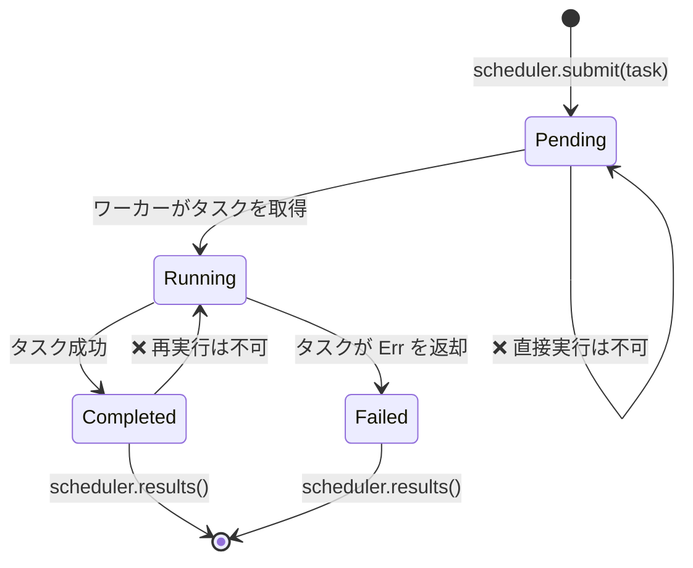

# 総合演習プロジェクト: 型安全なタスクスケジューラ

本書全体で学んだパターンを統合し、実用レベルの単一システムを構築します。ジェネリクス、トレイト、型状態（タイプステート）、チャンネル、エラー処理、テストを活用した、**型安全で並行なタスクスケジューラ**を作成します。

**所要時間（目安）**: 4〜6 時間 | **難易度**: ★★★

> **演習で実践する内容:**
> - ジェネリクスとトレイト境界（第1〜2章）
> - タスクライフサイクルのための型状態パターン（第3章）
> - ゼロコスト状態マーカーのための PhantomData（第4章）
> - ワーカー間通信のためのチャンネル（第5章）
> - スコープ付きスレッドによる並行処理（第6章）
> - `thiserror` によるエラー処理（第10章）
> - プロパティベーステストによるテスト手法（第14章）
> - `TryFrom` とバリデーション済み型による API 設計（第15章）

## 課題の概要

以下を満たすタスクスケジューラを構築します:

1. **タスク**は型付けされたライフサイクルを持つ: `Pending → Running → Completed`（または `Failed`）
2. **ワーカー**はチャンネルからタスクを取り出して実行し、結果を報告する
3. **スケジューラ**はタスクの登録、ワーカーの協調、および結果の収集を管理する
4. 不正な状態遷移は**コンパイル時エラー**となる



## ステップ 1: タスク型の定義

型状態マーカーとジェネリックな `Task` から始めます:

```rust
use std::marker::PhantomData;

// --- 状態マーカー（ゼロサイズ型） ---
struct Pending;
struct Running;
struct Completed;
struct Failed;

// --- タスク ID（型安全性のためのニュータイプ） ---
#[derive(Debug, Clone, Copy, PartialEq, Eq, Hash)]
struct TaskId(u64);

// --- ライフサイクルの状態によってパラメータ化された Task 構造体 ---
struct Task<State, R> {
    id: TaskId,
    name: String,
    _state: PhantomData<State>,
    _result: PhantomData<R>,
}
```

**課題**: 以下を満たすように状態遷移を実装してください:
- `Task<Pending, R>` は `Task<Running, R>` へ遷移可能（`start()` 経由）
- `Task<Running, R>` は `Task<Completed, R>` または `Task<Failed, R>` へ遷移可能
- それ以外の遷移はコンパイルエラーとなる

<details>
<summary>💡 ヒント</summary>

各遷移メソッドは `self` を消費し、新しい状態を返すべきです:

```rust
impl<R> Task<Pending, R> {
    fn start(self) -> Task<Running, R> {
        Task {
            id: self.id,
            name: self.name,
            _state: PhantomData,
            _result: PhantomData,
        }
    }
}
```

</details>

## ステップ 2: 処理関数の定義

タスクには実行すべき処理関数が必要です。Box 化されたクロージャを使用します:

```rust
struct WorkItem<R: Send + 'static> {
    id: TaskId,
    name: String,
    work: Box<dyn FnOnce() -> Result<R, String> + Send>,
}
```

**課題**: タスク名とクロージャを受け取る `WorkItem::new()` を実装してください。
`TaskId` 生成器（単純なアトミックカウンタまたは Mutex で保護されたカウンタ）を追加してください。

## ステップ 3: エラー処理

`thiserror` を用いてスケジューラのエラー型を定義します:

```rust,ignore
use thiserror::Error;

#[derive(Error, Debug)]
pub enum SchedulerError {
    #[error("スケジューラはシャットダウンされています")]
    ShutDown,

    #[error("タスク {0:?} が失敗しました: {1}")]
    TaskFailed(TaskId, String),

    #[error("チャンネル送信エラー")]
    ChannelError(#[from] std::sync::mpsc::SendError<()>),

    #[error("ワーカーがパニックしました")]
    WorkerPanic,
}
```

## ステップ 4: スケジューラの実装

チャンネル（第5章）とスコープ付きスレッド（第6章）を用いてスケジューラを構築します:

```rust
use std::sync::mpsc;

struct Scheduler<R: Send + 'static> {
    sender: Option<mpsc::Sender<WorkItem<R>>>,
    results: mpsc::Receiver<TaskResult<R>>,
    num_workers: usize,
}

struct TaskResult<R> {
    id: TaskId,
    name: String,
    outcome: Result<R, String>,
}
```

**課題**: 以下を実装してください:
- `Scheduler::new(num_workers: usize) -> Self` — チャンネルを作成し、ワーカーを生成する
- `Scheduler::submit(&self, item: WorkItem<R>) -> Result<TaskId, SchedulerError>`
- `Scheduler::shutdown(self) -> Vec<TaskResult<R>>` — 送信側をドロップし、ワーカーを join し、結果を収集する

<details>
<summary>💡 ヒント — ワーカーのループ処理</summary>

```rust
fn worker_loop<R: Send + 'static>(
    rx: std::sync::Arc<std::sync::Mutex<mpsc::Receiver<WorkItem<R>>>>,
    result_tx: mpsc::Sender<TaskResult<R>>,
    worker_id: usize,
) {
    loop {
        let item = {
            let rx = rx.lock().unwrap();
            rx.recv()
        };
        match item {
            Ok(work_item) => {
                let outcome = (work_item.work)();
                let _ = result_tx.send(TaskResult {
                    id: work_item.id,
                    name: work_item.name,
                    outcome,
                });
            }
            Err(_) => break, // チャンネルが閉じた
        }
    }
}
```

</details>

## ステップ 5: 統合テスト

以下を検証するテストを作成してください:

1. **正常系（Happy path）**: 10 個のタスクを投入し、シャットダウンして、10 個すべての結果が `Ok` であることを検証
2. **エラー処理**: 失敗するタスクを投入し、`TaskResult.outcome` が `Err` であることを検証
3. **空のスケジューラ**: 作成して直ちにシャットダウン — パニックが発生しないこと
4. **プロパティテスト**（発展）: `proptest` を使用して、任意の N 個のタスク (1..100) に対して、スケジューラが常に正確に N 個の結果を返すことを検証

```rust
#[cfg(test)]
mod tests {
    use super::*;

    #[test]
    fn happy_path() {
        let scheduler = Scheduler::<String>::new(4);

        for i in 0..10 {
            let item = WorkItem::new(
                format!("task-{i}"),
                move || Ok(format!("result-{i}")),
            );
            scheduler.submit(item).unwrap();
        }

        let results = scheduler.shutdown();
        assert_eq!(results.len(), 10);
        for r in &results {
            assert!(r.outcome.is_ok());
        }
    }

    #[test]
    fn handles_failures() {
        let scheduler = Scheduler::<String>::new(2);

        scheduler.submit(WorkItem::new("good", || Ok("ok".into()))).unwrap();
        scheduler.submit(WorkItem::new("bad", || Err("boom".into()))).unwrap();

        let results = scheduler.shutdown();
        assert_eq!(results.len(), 2);

        let failures: Vec<_> = results.iter()
            .filter(|r| r.outcome.is_err())
            .collect();
        assert_eq!(failures.len(), 1);
    }
}
```

## ステップ 6: すべてを組み合わせる

システム全体の実演を行う `main()` の例です:

```rust,ignore
fn main() {
    let scheduler = Scheduler::<String>::new(4);

    // 様々なワークロードを持つタスクを投入
    for i in 0..20 {
        let item = WorkItem::new(
            format!("compute-{i}"),
            move || {
                // 処理をシミュレート
                std::thread::sleep(std::time::Duration::from_millis(10));
                if i % 7 == 0 {
                    Err(format!("タスク {i} でシミュレートされたエラーが発生"))
                } else {
                    Ok(format!("タスク {i} が値 {} で完了", i * i))
                }
            },
        );
        // 注: 簡潔さのために .unwrap() を使用しています — 本番コードでは SendError を適切に処理してください。
        scheduler.submit(item).unwrap();
    }

    println!("すべてのタスクを投入しました。シャットダウン中...");
    let results = scheduler.shutdown();

    let (ok, err): (Vec<_>, Vec<_>) = results.iter()
        .partition(|r| r.outcome.is_ok());

    println!("\n✅ 成功: {}", ok.len());
    for r in &ok {
        println!("  {} → {}", r.name, r.outcome.as_ref().unwrap());
    }

    println!("\n❌ 失敗: {}", err.len());
    for r in &err {
        println!("  {} → {}", r.name, r.outcome.as_ref().unwrap_err());
    }
}
```

## 評価基準

| 基準 | 目標 |
|-----------|--------|
| 型安全性 | 不正な状態遷移がコンパイルエラーになること |
| 並行性 | ワーカーが並列に動作し、データ競合が発生しないこと |
| エラー処理 | すべての失敗が `TaskResult` に捕捉され、パニックしないこと |
| テスト | 3つ以上のテストが存在すること（proptest があれば加点） |
| コード構成 | クリーンなモジュール構成、公開 API でバリデーション済み型を採用していること |
| ドキュメント | 主要な型に不変条件（invariant）を説明する doc コメントが付与されていること |

## 発展アイデア

基本のスケジューラが動作したら、以下の機能拡張に挑戦してみてください:

1. **優先度付きキュー**: `Priority` ニュータイプ (1〜10) を追加し、高優先度のタスクを先に処理する
2. **リトライポリシー**: 失敗したタスクを完全に失敗とみなす前に、最大 N 回再試行する
3. **キャンセル処理**: 待機中のタスクを削除する `cancel(TaskId)` メソッドを追加する
4. **非同期版への移行**: `tokio::spawn` と `tokio::sync::mpsc` チャンネルを使用する構成に移植する（第16章）
5. **メトリクス計測**: ワーカーごとのタスク処理数、平均実行時間、失敗率を追跡・記録する

***
