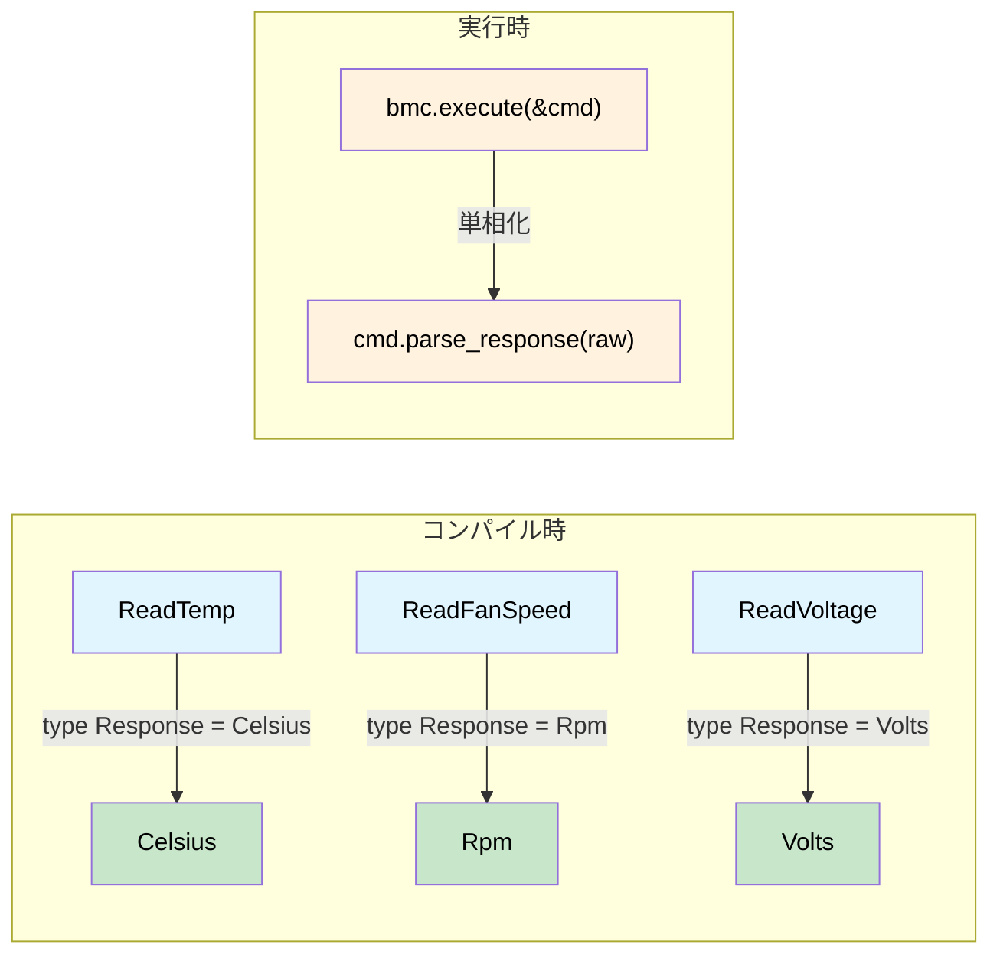

# 型付けされたコマンドインターフェース — リクエストがレスポンスを決定する 🟡

> **学べること:** コマンドトレイト上の関連型を用いてリクエストとレスポンスの間にコンパイル時の結合を作り出し、IPMI、Redfish、NVMeなどのプロトコルにおいて、パースの不一致、単位の混同、暗黙の型変換を排除する方法。
>
> **関連章:** [第1章](ch01-the-philosophy-why-types-beat-tests.md)（哲学）、[第6章](ch06-dimensional-analysis-making-the-compiler.md)（次元型）、[第7章](ch07-validated-boundaries-parse-dont-validate.md)（検証された境界）、[第10章](ch10-putting-it-all-together-a-complete-diagn.md)（統合）

## 型付けされていない泥沼（The Untyped Swamp）

ほとんどのハードウェア管理スタック（IPMI、Redfish、NVMe Admin、PLDM など）は、最初は「生のバイト列を入力し、生のバイト列を出力する（`raw bytes in → raw bytes out`）」ものとして作られます。これにより、テストでは一部しか検出できないようなバグのカテゴリが生み出されます。

```rust,ignore
use std::io;

struct BmcRaw { /* ipmitool handle */ }

impl BmcRaw {
    fn raw_command(&self, net_fn: u8, cmd: u8, data: &[u8]) -> io::Result<Vec<u8>> {
        // ... ipmitool を呼び出す ...
        Ok(vec![0x00, 0x19, 0x00]) // スタブ
    }
}

fn diagnose_thermal(bmc: &BmcRaw) -> io::Result<()> {
    let raw = bmc.raw_command(0x04, 0x2D, &[0x20])?;
    let cpu_temp = raw[0] as f64;        // 🤞 0バイト目が読み取り値であっているか？

    let raw = bmc.raw_command(0x04, 0x2D, &[0x30])?;
    let fan_rpm = raw[0] as u32;         // 🐛 ファン速度はリトルエンディアンの2バイト

    let raw = bmc.raw_command(0x04, 0x2D, &[0x40])?;
    let voltage = raw[0] as f64;         // 🐛 1000 で割る必要がある

    if cpu_temp > fan_rpm as f64 {       // 🐛 °C と RPM を比較している
        println!("問題発生");
    }

    log_temp(voltage);                   // 🐛 電圧（Volts）を温度として渡している
    Ok(())
}

fn log_temp(t: f64) { println!("温度: {t}°C"); }
```

| # | バグ | 発覚するタイミング |
|---|-----|------------|
| 1 | ファン回転数を2バイトではなく1バイトとしてパース | 本番環境、午前3時 |
| 2 | 電圧のスケーリング忘れ | すべてのPSUが過電圧と判定される |
| 3 | °C と RPM の比較 | おそらく永遠に気づかない |
| 4 | 電圧を温度ロガーに渡してしまう | 6か月後、過去の履歴データを閲覧したとき |

**根本原因:** すべてが `Vec<u8>` → `f64` → 祈る（pray）という流れになっていることです。

## 型付きコマンドパターン

### ステップ1 — ドメイン newtype

```rust,ignore
#[derive(Debug, Clone, Copy, PartialEq, PartialOrd)]
pub struct Celsius(pub f64);

#[derive(Debug, Clone, Copy, PartialEq, PartialOrd)]
pub struct Rpm(pub u32);  // u32: 生のIPMIセンサー値（整数のRPM）

#[derive(Debug, Clone, Copy, PartialEq, PartialOrd)]
pub struct Volts(pub f64);

#[derive(Debug, Clone, Copy, PartialEq, PartialOrd)]
pub struct Watts(pub f64);
```

> **`Rpm(u32)` と `Rpm(f64)` に関する補足:** 本章では、IPMI センサーの読み取り値が整数値であるため、内部型を `u32` としています。第6章（次元解析）では、算術演算（平均化やスケーリング）をサポートするために `Rpm` で `f64` を使用します。どちらのアプローチも有効です — 内部型が何であれ、newtype は単位の取り違えを確実に防止します。

### ステップ2 — コマンドトレイト（型インデックスによるディスパッチ）

関連型 `Response` が鍵となります。これが各コマンド構造体をその戻り値の型へと束縛します。実装する各構造体が `Response` を特定のドメイン型に固定するため、`execute()` は常に厳密に正しい型を返します。

```rust,ignore
pub trait IpmiCmd {
    /// 「型インデックス」 — execute() が返す型を決定する。
    type Response;

    fn net_fn(&self) -> u8;
    fn cmd_byte(&self) -> u8;
    fn payload(&self) -> Vec<u8>;

    /// パース処理をここにカプセル化 — 各コマンドが自身のバイトレイアウトを認識している。
    fn parse_response(&self, raw: &[u8]) -> io::Result<Self::Response>;
}
```

### ステップ3 — コマンドごとに1つの構造体を定義

```rust,ignore
pub struct ReadTemp { pub sensor_id: u8 }
impl IpmiCmd for ReadTemp {
    type Response = Celsius;
    fn net_fn(&self) -> u8 { 0x04 }
    fn cmd_byte(&self) -> u8 { 0x2D }
    fn payload(&self) -> Vec<u8> { vec![self.sensor_id] }
    fn parse_response(&self, raw: &[u8]) -> io::Result<Celsius> {
        if raw.is_empty() {
            return Err(io::Error::new(io::ErrorKind::InvalidData, "レスポンスが空です"));
        }
        // 注意: 第1章の型付けされていない例では、SDR メタデータのない汎用的なパースを
        // 示すために `raw[0] as i8 as f64`（符号付き）を使用していました。
        // ここでは、IPMI 仕様 §35.5 の SDR 線形化計算式によって符号なしの生の読み取り値が
        // 校正値に変換されるため、符号なし（`as f64`）を使用しています。
        // 本番環境では、完全な SDR 計算式を適用してください: 結果 = (M × raw + B) × 10^(R_exp)
        Ok(Celsius(raw[0] as f64))  // 符号なしの生バイト、SDR計算式に従って変換
    }
}

pub struct ReadFanSpeed { pub fan_id: u8 }
impl IpmiCmd for ReadFanSpeed {
    type Response = Rpm;
    fn net_fn(&self) -> u8 { 0x04 }
    fn cmd_byte(&self) -> u8 { 0x2D }
    fn payload(&self) -> Vec<u8> { vec![self.fan_id] }
    fn parse_response(&self, raw: &[u8]) -> io::Result<Rpm> {
        if raw.len() < 2 {
            return Err(io::Error::new(io::ErrorKind::InvalidData,
                format!("ファン速度には2バイト必要ですが、{}バイトしかありません", raw.len())));
        }
        Ok(Rpm(u16::from_le_bytes([raw[0], raw[1]]) as u32))
    }
}

pub struct ReadVoltage { pub rail: u8 }
impl IpmiCmd for ReadVoltage {
    type Response = Volts;
    fn net_fn(&self) -> u8 { 0x04 }
    fn cmd_byte(&self) -> u8 { 0x2D }
    fn payload(&self) -> Vec<u8> { vec![self.rail] }
    fn parse_response(&self, raw: &[u8]) -> io::Result<Volts> {
        if raw.len() < 2 {
            return Err(io::Error::new(io::ErrorKind::InvalidData,
                format!("電圧には2バイト必要ですが、{}バイトしかありません", raw.len())));
        }
        Ok(Volts(u16::from_le_bytes([raw[0], raw[1]]) as f64 / 1000.0))
    }
}
```

### ステップ4 — エグゼキュータ（`dyn` ゼロ、単相化）

```rust,ignore
pub struct BmcConnection { pub timeout_secs: u32 }

impl BmcConnection {
    pub fn execute<C: IpmiCmd>(&self, cmd: &C) -> io::Result<C::Response> {
        let raw = self.raw_send(cmd.net_fn(), cmd.cmd_byte(), &cmd.payload())?;
        cmd.parse_response(&raw)
    }

    fn raw_send(&self, _nf: u8, _cmd: u8, _data: &[u8]) -> io::Result<Vec<u8>> {
        Ok(vec![0x19, 0x00]) // スタブ
    }
}
```

### ステップ5 — 4つのバグすべてがコンパイルエラーに

```rust,ignore
fn diagnose_thermal_typed(bmc: &BmcConnection) -> io::Result<()> {
    let cpu_temp: Celsius = bmc.execute(&ReadTemp { sensor_id: 0x20 })?;
    let fan_rpm:  Rpm     = bmc.execute(&ReadFanSpeed { fan_id: 0x30 })?;
    let voltage:  Volts   = bmc.execute(&ReadVoltage { rail: 0x40 })?;

    // バグ #1 — 発生不可能: パース処理は ReadFanSpeed::parse_response に閉じ込められている
    // バグ #2 — 発生不可能: 単位のスケーリングは ReadVoltage::parse_response に閉じ込められている

    // バグ #3 — コンパイルエラー:
    // if cpu_temp > fan_rpm { }
    //    ^^^^^^^^   ^^^^^^^ Celsius vs Rpm → 「型の不一致（mismatched types）」 ❌

    // バグ #4 — コンパイルエラー:
    // log_temperature(voltage);
    //                 ^^^^^^^ Volts ですが Celsius が期待されています ❌

    if cpu_temp > Celsius(85.0) { println!("CPU過熱: {:?}", cpu_temp); }
    if fan_rpm < Rpm(4000)      { println!("ファン回転数低下: {:?}", fan_rpm); }

    Ok(())
}

fn log_temperature(t: Celsius) { println!("温度: {:?}", t); }
fn log_voltage(v: Volts)       { println!("電圧: {:?}", v); }
```

## IPMI: 混同しようのないセンサー読み取り

新しいセンサーの追加は、1つの構造体＋1つの実装だけで完結し、パース処理があちこちに散らばることもありません。

```rust,ignore
pub struct ReadPowerDraw { pub domain: u8 }
impl IpmiCmd for ReadPowerDraw {
    type Response = Watts;
    fn net_fn(&self) -> u8 { 0x04 }
    fn cmd_byte(&self) -> u8 { 0x2D }
    fn payload(&self) -> Vec<u8> { vec![self.domain] }
    fn parse_response(&self, raw: &[u8]) -> io::Result<Watts> {
        if raw.len() < 2 {
            return Err(io::Error::new(io::ErrorKind::InvalidData,
                format!("消費電力には2バイト必要ですが、{}バイトしかありません", raw.len())));
        }
        Ok(Watts(u16::from_le_bytes([raw[0], raw[1]]) as f64))
    }
}

// bmc.execute(&ReadPowerDraw { domain: 0 }) を使用するすべての呼び出し側は、
// 自動的に Watts を受け取ります — 他の場所にパースコードを書く必要はありません
```

### 各コマンドを個別にテストする

```rust,ignore
#[cfg(test)]
mod tests {
    use super::*;

    struct StubBmc {
        responses: std::collections::HashMap<u8, Vec<u8>>,
    }

    impl StubBmc {
        fn execute<C: IpmiCmd>(&self, cmd: &C) -> io::Result<C::Response> {
            let key = cmd.payload()[0];
            let raw = self.responses.get(&key)
                .ok_or_else(|| io::Error::new(io::ErrorKind::NotFound, "スタブがありません"))?;
            cmd.parse_response(raw)
        }
    }

    #[test]
    fn read_temp_parses_raw_byte() {
        let bmc = StubBmc {
            responses: [(0x20, vec![0x19])].into(), // 10進数の 25 = 0x19
        };
        let temp = bmc.execute(&ReadTemp { sensor_id: 0x20 }).unwrap();
        assert_eq!(temp, Celsius(25.0));
    }

    #[test]
    fn read_fan_parses_two_byte_le() {
        let bmc = StubBmc {
            responses: [(0x30, vec![0x00, 0x19])].into(), // 0x1900 = 6400
        };
        let rpm = bmc.execute(&ReadFanSpeed { fan_id: 0x30 }).unwrap();
        assert_eq!(rpm, Rpm(6400));
    }

    #[test]
    fn read_voltage_scales_millivolts() {
        let bmc = StubBmc {
            responses: [(0x40, vec![0xE8, 0x2E])].into(), // 0x2EE8 = 12008 mV
        };
        let v = bmc.execute(&ReadVoltage { rail: 0x40 }).unwrap();
        assert!((v.0 - 12.008).abs() < 0.001);
    }
}
```

## Redfish: スキーマで型付けされた REST エンドポイント

Redfish にはさらに適しています。各エンドポイントは DMTF 定義の JSON スキーマを返すためです。

```rust,ignore
use serde::Deserialize;

#[derive(Debug, Deserialize)]
pub struct ThermalResponse {
    #[serde(rename = "Temperatures")]
    pub temperatures: Vec<RedfishTemp>,
    #[serde(rename = "Fans")]
    pub fans: Vec<RedfishFan>,
}

#[derive(Debug, Deserialize)]
pub struct RedfishTemp {
    #[serde(rename = "Name")]
    pub name: String,
    #[serde(rename = "ReadingCelsius")]
    pub reading: f64,
    #[serde(rename = "UpperThresholdCritical")]
    pub critical_hi: Option<f64>,
    #[serde(rename = "Status")]
    pub status: RedfishHealth,
}

#[derive(Debug, Deserialize)]
pub struct RedfishFan {
    #[serde(rename = "Name")]
    pub name: String,
    #[serde(rename = "Reading")]
    pub rpm: u32,
    #[serde(rename = "Status")]
    pub status: RedfishHealth,
}

#[derive(Debug, Deserialize)]
pub struct PowerResponse {
    #[serde(rename = "Voltages")]
    pub voltages: Vec<RedfishVoltage>,
    #[serde(rename = "PowerSupplies")]
    pub psus: Vec<RedfishPsu>,
}

#[derive(Debug, Deserialize)]
pub struct RedfishVoltage {
    #[serde(rename = "Name")]
    pub name: String,
    #[serde(rename = "ReadingVolts")]
    pub reading: f64,
    #[serde(rename = "Status")]
    pub status: RedfishHealth,
}

#[derive(Debug, Deserialize)]
pub struct RedfishPsu {
    #[serde(rename = "Name")]
    pub name: String,
    #[serde(rename = "PowerOutputWatts")]
    pub output_watts: Option<f64>,
    #[serde(rename = "Status")]
    pub status: RedfishHealth,
}

#[derive(Debug, Deserialize)]
pub struct ProcessorResponse {
    #[serde(rename = "Model")]
    pub model: String,
    #[serde(rename = "TotalCores")]
    pub cores: u32,
    #[serde(rename = "Status")]
    pub status: RedfishHealth,
}

#[derive(Debug, Deserialize)]
pub struct RedfishHealth {
    #[serde(rename = "State")]
    pub state: String,
    #[serde(rename = "Health")]
    pub health: Option<String>,
}

/// 型付けされた Redfish エンドポイント — それぞれが自身のレスポンス型を認識している。
pub trait RedfishEndpoint {
    type Response: serde::de::DeserializeOwned;
    fn method(&self) -> &'static str;
    fn path(&self) -> String;
}

pub struct GetThermal { pub chassis_id: String }
impl RedfishEndpoint for GetThermal {
    type Response = ThermalResponse;
    fn method(&self) -> &'static str { "GET" }
    fn path(&self) -> String {
        format!("/redfish/v1/Chassis/{}/Thermal", self.chassis_id)
    }
}

pub struct GetPower { pub chassis_id: String }
impl RedfishEndpoint for GetPower {
    type Response = PowerResponse;
    fn method(&self) -> &'static str { "GET" }
    fn path(&self) -> String {
        format!("/redfish/v1/Chassis/{}/Power", self.chassis_id)
    }
}

pub struct GetProcessor { pub system_id: String, pub proc_id: String }
impl RedfishEndpoint for GetProcessor {
    type Response = ProcessorResponse;
    fn method(&self) -> &'static str { "GET" }
    fn path(&self) -> String {
        format!("/redfish/v1/Systems/{}/Processors/{}", self.system_id, self.proc_id)
    }
}

pub struct RedfishClient {
    pub base_url: String,
    pub auth_token: String,
}

impl RedfishClient {
    pub fn execute<E: RedfishEndpoint>(&self, endpoint: &E) -> io::Result<E::Response> {
        let url = format!("{}{}", self.base_url, endpoint.path());
        let json_bytes = self.http_request(endpoint.method(), &url)?;
        serde_json::from_slice(&json_bytes)
            .map_err(|e| io::Error::new(io::ErrorKind::InvalidData, e))
    }

    fn http_request(&self, _method: &str, _url: &str) -> io::Result<Vec<u8>> {
        Ok(vec![]) // スタブ — 実際の実装では reqwest や hyper を使用
    }
}

// 使用例 — 完全に型付けされ、自己文書化されている
fn redfish_pre_flight(client: &RedfishClient) -> io::Result<()> {
    let thermal: ThermalResponse = client.execute(&GetThermal {
        chassis_id: "1".into(),
    })?;
    let power: PowerResponse = client.execute(&GetPower {
        chassis_id: "1".into(),
    })?;

    // ❌ コンパイルエラー — PowerResponse を温度チェックに渡すことはできない:
    // check_thermals(&power);  → 「ThermalResponse が期待されましたが、PowerResponse が見つかりました」

    for temp in &thermal.temperatures {
        if let Some(crit) = temp.critical_hi {
            if temp.reading > crit {
                println!("重大（CRITICAL）: {} が {}°C です（閾値: {}°C）",
                    temp.name, temp.reading, crit);
            }
        }
    }
    Ok(())
}
```

## NVMe Admin: Identify コマンドがログページを返すことはない

NVMe Admin コマンドもまったく同じ構造をとります。コントローラはコマンドのオプコードを識別しますが、C言語では呼び出し側が 4 KB の完了バッファにどの構造体をオーバーレイすべきかを把握していなければなりません。型付きコマンドパターンを適用すれば、これを間違えることはあり得なくなります。

```rust,ignore
use std::io;

/// NVMe Admin コマンドトレイト — IpmiCmd と同じ構造。
pub trait NvmeAdminCmd {
    type Response;
    fn opcode(&self) -> u8;
    fn parse_completion(&self, data: &[u8]) -> io::Result<Self::Response>;
}

// ── Identify（オプコード 0x06） ──

#[derive(Debug, Clone)]
pub struct IdentifyResponse {
    pub model_number: String,   // バイト 24〜63
    pub serial_number: String,  // バイト 4〜23
    pub firmware_rev: String,   // バイト 64〜71
    pub total_capacity_gb: u64,
}

pub struct Identify {
    pub nsid: u32, // 0 = コントローラ, >0 = ネームスペース
}

impl NvmeAdminCmd for Identify {
    type Response = IdentifyResponse;
    fn opcode(&self) -> u8 { 0x06 }
    fn parse_completion(&self, data: &[u8]) -> io::Result<IdentifyResponse> {
        if data.len() < 4096 {
            return Err(io::Error::new(io::ErrorKind::InvalidData, "Identifyデータが短すぎます"));
        }
        Ok(IdentifyResponse {
            serial_number: String::from_utf8_lossy(&data[4..24]).trim().to_string(),
            model_number: String::from_utf8_lossy(&data[24..64]).trim().to_string(),
            firmware_rev: String::from_utf8_lossy(&data[64..72]).trim().to_string(),
            total_capacity_gb: u64::from_le_bytes(
                data[280..288].try_into().unwrap()
            ) / (1024 * 1024 * 1024),
        })
    }
}

// ── Get Log Page（オプコード 0x02） ──

#[derive(Debug, Clone)]
pub struct SmartLog {
    pub critical_warning: u8,
    pub temperature_kelvin: u16,
    pub available_spare_pct: u8,
    pub data_units_read: u128,
}

pub struct GetLogPage {
    pub log_id: u8, // 0x02 = SMART / ヘルス情報
}

impl NvmeAdminCmd for GetLogPage {
    type Response = SmartLog;
    fn opcode(&self) -> u8 { 0x02 }
    fn parse_completion(&self, data: &[u8]) -> io::Result<SmartLog> {
        if data.len() < 512 {
            return Err(io::Error::new(io::ErrorKind::InvalidData, "ログページが短すぎます"));
        }
        Ok(SmartLog {
            critical_warning: data[0],
            temperature_kelvin: u16::from_le_bytes([data[1], data[2]]),
            available_spare_pct: data[3],
            data_units_read: u128::from_le_bytes(data[32..48].try_into().unwrap()),
        })
    }
}

// ── エグゼキュータ ──

pub struct NvmeController { /* fd, BAR など */ }

impl NvmeController {
    pub fn admin_cmd<C: NvmeAdminCmd>(&self, cmd: &C) -> io::Result<C::Response> {
        let raw = self.submit_and_wait(cmd.opcode())?;
        cmd.parse_completion(&raw)
    }

    fn submit_and_wait(&self, _opcode: u8) -> io::Result<Vec<u8>> {
        Ok(vec![0u8; 4096]) // スタブ — 実際の実装ではドアベルを鳴らして CQ（完了キュー）エントリを待機
    }
}

// ── 使用例 ──

fn nvme_health_check(ctrl: &NvmeController) -> io::Result<()> {
    let id: IdentifyResponse = ctrl.admin_cmd(&Identify { nsid: 0 })?;
    let smart: SmartLog = ctrl.admin_cmd(&GetLogPage { log_id: 0x02 })?;

    // ❌ コンパイルエラー — Identify は SmartLog ではなく IdentifyResponse を返す:
    // let smart: SmartLog = ctrl.admin_cmd(&Identify { nsid: 0 })?;

    println!("{} (FW {}): {}°C, 予備領域 {}%",
        id.model_number, id.firmware_rev,
        smart.temperature_kelvin.saturating_sub(273),
        smart.available_spare_pct);

    Ok(())
}
```

これら3つのプロトコルの展開は、**段階的な学習曲線（Graduated Arc）**を描いています（第7章の検証された境界でも同じ手法を用いています）。

| 段階 | プロトコル | 複雑さ | 追加される要素 |
|:----:|----------|-----------|--------------|
| 1 | IPMI | シンプル: センサーID → 読み取り値 | コアパターン: `トレイト + 関連型` |
| 2 | Redfish | REST: エンドポイント → 型付けされた JSON | Serde の統合、スキーマで型付けされたレスポンス |
| 3 | NVMe | バイナリ: オプコード → 4 KB 構造体のオーバーレイ | 生バッファのパース、複数構造体からなる完了データ |

## 発展: コマンドスクリプト用のマクロ DSL

```rust,ignore
/// 一連の型付けされた IPMI コマンドを実行し、結果のタプルを返す。
macro_rules! diag_script {
    ($bmc:expr; $($cmd:expr),+ $(,)?) => {{
        ( $( $bmc.execute(&$cmd)?, )+ )
    }};
}

fn full_pre_flight(bmc: &BmcConnection) -> io::Result<()> {
    let (temp, rpm, volts) = diag_script!(bmc;
        ReadTemp     { sensor_id: 0x20 },
        ReadFanSpeed { fan_id:    0x30 },
        ReadVoltage  { rail:      0x40 },
    );
    // 型: (Celsius, Rpm, Volts) — 完全に推論され、順序の入れ替えはコンパイルエラーになる
    assert!(temp  < Celsius(95.0), "CPU温度が高すぎます");
    assert!(rpm   > Rpm(3000),     "ファン回転数が低すぎます");
    assert!(volts > Volts(11.4),   "12Vレールが低下しています");
    Ok(())
}
```

## 発展: 動的スクリプトのための Enum ディスパッチ

実行時に JSON 設定などからコマンドが動的に供給される場合:

```rust,ignore
pub enum AnyReading {
    Temp(Celsius),
    Rpm(Rpm),
    Volt(Volts),
    Watt(Watts),
}

pub enum AnyCmd {
    Temp(ReadTemp),
    Fan(ReadFanSpeed),
    Voltage(ReadVoltage),
    Power(ReadPowerDraw),
}

impl AnyCmd {
    pub fn execute(&self, bmc: &BmcConnection) -> io::Result<AnyReading> {
        match self {
            AnyCmd::Temp(c)    => Ok(AnyReading::Temp(bmc.execute(c)?)),
            AnyCmd::Fan(c)     => Ok(AnyReading::Rpm(bmc.execute(c)?)),
            AnyCmd::Voltage(c) => Ok(AnyReading::Volt(bmc.execute(c)?)),
            AnyCmd::Power(c)   => Ok(AnyReading::Watt(bmc.execute(c)?)),
        }
    }
}

fn run_dynamic_script(bmc: &BmcConnection, script: &[AnyCmd]) -> io::Result<Vec<AnyReading>> {
    script.iter().map(|cmd| cmd.execute(bmc)).collect()
}
```

## パターンファミリー

このパターンは、**あらゆる**ハードウェア管理プロトコルに適用可能です。

| プロトコル | リクエスト型 | レスポンス型 |
|----------|-------------|---------------|
| IPMI センサー読み取り | `ReadTemp` | `Celsius` |
| Redfish REST | `GetThermal` | `ThermalResponse` |
| NVMe Admin | `Identify` | `IdentifyResponse` |
| PLDM | `GetFwParams` | `FwParamsResponse` |
| MCTP | `GetEid` | `EidResponse` |
| PCIe 構成空間（Config Space） | `ReadCapability` | `CapabilityHeader` |
| SMBIOS/DMI | `ReadType17` | `MemoryDeviceInfo` |

リクエスト型がレスポンス型を**決定**し、コンパイラが例外なくそれを強制します。

## 型付きコマンドのフロー



## 演習問題: PLDM の型付きコマンド

次の2つの PLDM コマンドを対象に、（`IpmiCmd` と同様の構造を持つ）`PldmCmd` トレイトを設計してください。
- `GetFwParams` → `FwParamsResponse { active_version: String, pending_version: Option<String> }`
- `QueryDeviceIds` → `DeviceIdResponse { descriptors: Vec<Descriptor> }`

要件: 静的ディスパッチであること、`parse_response` が `io::Result<Self::Response>` を返すこと。

<details>
<summary>解答例</summary>

```rust,ignore
use std::io;

pub trait PldmCmd {
    type Response;
    fn pldm_type(&self) -> u8;
    fn command_code(&self) -> u8;
    fn parse_response(&self, raw: &[u8]) -> io::Result<Self::Response>;
}

#[derive(Debug, Clone)]
pub struct FwParamsResponse {
    pub active_version: String,
    pub pending_version: Option<String>,
}

pub struct GetFwParams;
impl PldmCmd for GetFwParams {
    type Response = FwParamsResponse;
    fn pldm_type(&self) -> u8 { 0x05 } // ファームウェアアップデート
    fn command_code(&self) -> u8 { 0x02 }
    fn parse_response(&self, raw: &[u8]) -> io::Result<FwParamsResponse> {
        // 簡略化 — 実際の実装では PLDM ファームウェアアップデート仕様のフィールドをデコード
        if raw.len() < 4 {
            return Err(io::Error::new(io::ErrorKind::InvalidData, "データが短すぎます"));
        }
        Ok(FwParamsResponse {
            active_version: String::from_utf8_lossy(&raw[..4]).to_string(),
            pending_version: None,
        })
    }
}

#[derive(Debug, Clone)]
pub struct Descriptor { pub descriptor_type: u16, pub data: Vec<u8> }

#[derive(Debug, Clone)]
pub struct DeviceIdResponse { pub descriptors: Vec<Descriptor> }

pub struct QueryDeviceIds;
impl PldmCmd for QueryDeviceIds {
    type Response = DeviceIdResponse;
    fn pldm_type(&self) -> u8 { 0x05 }
    fn command_code(&self) -> u8 { 0x04 }
    fn parse_response(&self, raw: &[u8]) -> io::Result<DeviceIdResponse> {
        Ok(DeviceIdResponse { descriptors: vec![] }) // スタブ
    }
}
```

</details>

## 主なまとめ

1. **関連型 ＝ コンパイル時の契約** — コマンドトレイト上の `type Response` により、各リクエストが厳密に1つのレスポンス型に固定されます。
2. **パース処理のカプセル化** — バイトレイアウトに関する知識は `parse_response` 内に閉じ込められ、呼び出し側に散乱しません。
3. **ゼロコストディスパッチ** — ジェネリックな `execute<C: IpmiCmd>` は vtable を介さない直接呼び出しへと単相化（monomorphise）されます。
4. **1つのパターン、多数のプロトコル** — IPMI、Redfish、NVMe、PLDM、MCTP のすべてが同一の `trait Cmd { type Response; }` という構造に適合します。
5. **Enum ディスパッチが静的と動的を架橋する** — 型付けされたコマンドを enum でラップすることで、各 match アーム内の型安全性を失うことなく、実行時に駆動されるスクリプトを扱えます。
6. **段階的な複雑さが理解を深める** — IPMI（センサーID → 読み取り値）、Redfish（エンドポイント → JSON スキーマ）、NVMe（オプコード → 4 KB 構造体のオーバーレイ）はいずれも同じトレイト構造を使用していますが、段階が進むごとにパースの複雑さのレイヤーが追加されます。

---
