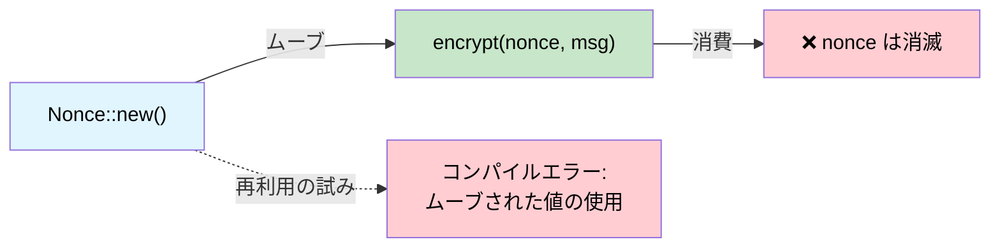

# 単一使用型 — 所有権による暗号学的保証 🟡

> **学べること:** Rustのムーブセマンティクスがいかに線形型システムとして機能し、ノンス（Nonce）の再利用、鍵合意（Key Agreement）の二重実行、偶発的なヒューズの再プログラミングなどをコンパイル時に不可能にするか。
>
> **関連章:** [第1章](ch01-the-philosophy-why-types-beat-tests.md)（哲学）、[第4章](ch04-capability-tokens-zero-cost-proof-of-aut.md)（ケーパビリティトークン）、[第5章](ch05-protocol-state-machines-type-state-for-r.md)（型状態）、[第14章](ch14-testing-type-level-guarantees.md)（コンパイル失敗のテスト）

## ノンス再利用の致命的な脅威（The Nonce Reuse Catastrophe）

認証付き暗号（AES-GCM、ChaCha20-Poly1305など）において、同一の鍵でノンス（Nonce）を再利用することは**致命的（Catastrophic）**です。2つの平文のXORが漏洩し、多くの場合認証鍵そのものまで漏洩します。これは単なる理論上の懸念ではありません。

- **2016年**: TLS における AES-GCM への「Forbidden Attack」— ノンスの再利用により平文の復元が可能に
- **2020年**: 劣悪な RNG（乱数生成器）が原因で、複数の IoT ファームウェアアップデートシステムにおいてノンスの再利用が発覚

C/C++ では、ノンスは単なる `uint8_t[12]` にすぎません。2回使用することを防ぐ仕組みは何一つありません。

```c
// C — ノンスの再利用を止めるものは何もない
uint8_t nonce[12];
generate_nonce(nonce);
encrypt(key, nonce, msg1, out1);   // ✅ 1回目の使用
encrypt(key, nonce, msg2, out2);   // 🐛 致命的: 同一ノンスの再利用
```

## 線形型としてのムーブセマンティクス

Rustの所有権システムは、事実上の**線形型システム（Linear Type System）**です。`Copy` を実装していない限り、値は厳密に一度だけ使用（ムーブ）されます。`ring` クレートはこの性質を巧みに活用しています。

```rust,ignore
// ring::aead::Nonce は:
// - Clone ではない
// - Copy ではない
// - 使用時に値渡しによって消費される
pub struct Nonce(/* プライベート */);

impl Nonce {
    pub fn try_assume_unique_for_key(value: &[u8]) -> Result<Self, Unspecified> {
        // ...
    }
    // Clone なし、Copy なし — 一度しか使用できない
}
```

`Nonce` を `seal_in_place()` に渡すと、**それはムーブします**:

```rust,ignore
// ring の API 形状を模した疑似コード
fn seal_in_place(
    key: &SealingKey,
    nonce: Nonce,       // ← 借用ではなくムーブされる
    data: &mut Vec<u8>,
) -> Result<(), Error> {
    // ... データをインプレースで暗号化 ...
    // nonce は消費され、二度と使用できない
    Ok(())
}
```

これを再利用しようとすると:

```rust,ignore
fn bad_encrypt(key: &SealingKey, data1: &mut Vec<u8>, data2: &mut Vec<u8>) {
    // 12バイトの配列は常に有効なノンスであるため、.unwrap() は安全
    let nonce = Nonce::try_assume_unique_for_key(&[0u8; 12]).unwrap();
    seal_in_place(key, nonce, data1).unwrap();  // ✅ nonce はここでムーブされる
    // seal_in_place(key, nonce, data2).unwrap();
    //                    ^^^^^ エラー: ムーブされた値の使用 ❌
}
```

コンパイラは、各ノンスが厳密に一度だけ使用されることを**証明**します。テストを書く必要すらありません。

## ケーススタディ: ring の Nonce

`ring` クレートは、ノンスを**生成**し、自身も複製不能であるトレイト `NonceSequence` によってさらに踏み込んでいます。

```rust,ignore
/// 一意なノンスのシーケンス。
/// Clone ではない — 一度鍵にバインドされると複製不可能。
pub trait NonceSequence {
    fn advance(&mut self) -> Result<Nonce, Unspecified>;
}

/// SealingKey は NonceSequence をラップする — 各 seal() 呼び出しで自動的に進む。
pub struct SealingKey<N: NonceSequence> {
    key: UnboundKey,   // 構築時に消費される
    nonce_seq: N,
}

impl<N: NonceSequence> SealingKey<N> {
    pub fn new(key: UnboundKey, nonce_seq: N) -> Self {
        // UnboundKey はムーブされる — シーリング（暗号化）とオープニング（復号）の両方に使い回すことはできない
        SealingKey { key, nonce_seq }
    }

    pub fn seal_in_place_append_tag(
        &mut self,       // &mut — 排他的アクセス
        aad: Aad<&[u8]>,
        in_out: &mut Vec<u8>,
    ) -> Result<(), Unspecified> {
        let nonce = self.nonce_seq.advance()?; // 一意なノンスを自動生成
        // ... ノンスを用いて暗号化 ...
        Ok(())
    }
}
# pub struct UnboundKey;
# pub struct Aad<T>(T);
# pub struct Unspecified;
```

この所有権チェーンによって以下が防止されます。
1. **ノンスの再利用** — `Nonce` は `Clone` ではなく、呼び出しごとに消費される
2. **鍵の二重使用** — `UnboundKey` は `SealingKey` にムーブされるため、同時に `OpeningKey` を作成することはできない
3. **シーケンスの複製** — `NonceSequence` は `Clone` ではないため、2つの鍵が同じカウンタを共有することはない

**これらはいずれも実行時チェックを必要としません。** コンパイラがこれら3つすべてを強制します。

## ケーススタディ: エフェメラル鍵合意

エフェメラル（一時的）な Diffie-Hellman 鍵は、**厳密に一度だけ**使用されなければなりません（それが「エフェメラル」の意味そのものです）。`ring` はこれを強制します。

```rust,ignore
/// エフェメラル秘密鍵。Clone でも Copy でもない。
/// agree_ephemeral() によって消費される。
pub struct EphemeralPrivateKey { /* ... */ }

/// 共有シークレットを計算する — 秘密鍵を消費する。
pub fn agree_ephemeral(
    my_private_key: EphemeralPrivateKey,  // ← ムーブされる
    peer_public_key: &UnparsedPublicKey,
    error_value: Unspecified,
    kdf: impl FnOnce(&[u8]) -> Result<SharedSecret, Unspecified>,
) -> Result<SharedSecret, Unspecified> {
    // ... DH 計算 ...
    // my_private_key は消費され、再利用は不可能になる
    # kdf(&[])
}
# pub struct UnparsedPublicKey;
# pub struct SharedSecret;
# pub struct Unspecified;
```

`agree_ephemeral()` を呼び出した後、秘密鍵は**もはやメモリ上に存在しません**（ドロップされます）。C++ 開発者であれば `memset(key, 0, len)` を忘れずに呼び出し、それがコンパイラの最適化によって消去されないことを祈る必要があります。Rust では、鍵は単純に消滅します。

## ハードウェアへの適用: 1回限りのヒューズプログラミング

サーバープラットフォームには、セキュリティキー、ボードシリアル番号、機能フラグなどのための **OTP（One-Time Programmable: 1回書き込み可能）ヒューズ** が備わっています。ヒューズへの書き込みは不可逆であり、異なるデータで2回書き込もうとするとボードが文鎮化（brick）します。これはムーブセマンティクスに完全に合致するユースケースです。

```rust,ignore
use std::io;

/// ヒューズ書き込みペイロード。Clone でも Copy でもない。
/// ヒューズがプログラミングされるときに消費される。
pub struct FusePayload {
    address: u32,
    data: Vec<u8>,
    // プライベートコンストラクタ — 検証済みビルダー経由でのみ生成可能
}

/// ヒューズプログラマが正しい状態にあることの証明。
pub struct FuseController {
    /* ハードウェアハンドル */
}

impl FuseController {
    /// ヒューズをプログラミングする — ペイロードを消費し、二重書き込みを防止する。
    pub fn program(
        &mut self,
        payload: FusePayload,  // ← ムーブされる — 二重使用は不可能
    ) -> io::Result<()> {
        // ... OTP ハードウェアに書き込み ...
        // payload は消費される — 同一の payload で再度プログラミングを
        // 試みるとコンパイルエラーになる
        Ok(())
    }
}

/// 検証機能付きビルダー — FusePayload を作成する唯一の方法。
pub struct FusePayloadBuilder {
    address: Option<u32>,
    data: Option<Vec<u8>>,
}

impl FusePayloadBuilder {
    pub fn new() -> Self {
        FusePayloadBuilder { address: None, data: None }
    }

    pub fn address(mut self, addr: u32) -> Self {
        self.address = Some(addr);
        self
    }

    pub fn data(mut self, data: Vec<u8>) -> Self {
        self.data = Some(data);
        self
    }

    pub fn build(self) -> Result<FusePayload, &'static str> {
        let address = self.address.ok_or("アドレスが必要です")?;
        let data = self.data.ok_or("データが必要です")?;
        if data.len() > 32 { return Err("ヒューズデータが長すぎます"); }
        Ok(FusePayload { address, data })
    }
}

// 使用例:
fn program_board_serial(ctrl: &mut FuseController) -> io::Result<()> {
    let payload = FusePayloadBuilder::new()
        .address(0x100)
        .data(b"SN12345678".to_vec())
        .build()
        .map_err(|e| io::Error::new(io::ErrorKind::InvalidInput, e))?;

    ctrl.program(payload)?;      // ✅ payload が消費される

    // ctrl.program(payload);    // ❌ エラー: ムーブされた値の使用
    //              ^^^^^^^ ムーブ後に使用された値

    Ok(())
}
```

## ハードウェアへの適用: 単一使用のキャリブレーション（校正）トークン

一部のセンサーでは、電源サイクルごとに**厳密に1回だけ**実行されなければならないキャリブレーション（校正）手順が必要です。キャリブレーショントークンを用いれば、これを強制できます。

```rust,ignore
/// 電源投入時に一度だけ発行される。Clone でも Copy でもない。
pub struct CalibrationToken {
    _private: (),
}

pub struct SensorController {
    calibrated: bool,
}

impl SensorController {
    /// 電源投入時に一度だけ呼び出される — キャリブレーショントークンを返す。
    pub fn power_on() -> (Self, CalibrationToken) {
        (
            SensorController { calibrated: false },
            CalibrationToken { _private: () },
        )
    }

    /// センサーをキャリブレーションする — トークンを消費する。
    pub fn calibrate(&mut self, _token: CalibrationToken) -> io::Result<()> {
        // ... キャリブレーションシーケンスを実行 ...
        self.calibrated = true;
        Ok(())
    }

    /// センサーの値を読み取る — キャリブレーション完了後にのみ有効。
    ///
    /// **制約事項:** ムーブセマンティクスによる保証は「部分的」です。呼び出し側が
    /// calibrate() を呼び出さずに drop(cal_token) した場合、トークンは破棄されますが
    /// キャリブレーションは実行されません。#[must_use] 属性（後述）を付与することで
    /// 警告を生成できますが、ハードエラーにはなりません。
    ///
    /// ここでの実行時 self.calibrated チェックは、その隙間を塞ぐ「セーフティネット」です。
    /// 完全にコンパイル時のみで解決する方法については、第5章の型状態パターン
    /// （send_command() が IpmiSession<Active> にのみ存在する仕組み）を参照してください。
    pub fn read(&self) -> io::Result<f64> {
        if !self.calibrated {
            return Err(io::Error::new(io::ErrorKind::Other, "キャリブレーションされていません"));
        }
        Ok(25.0) // スタブ
    }
}

fn sensor_workflow() -> io::Result<()> {
    let (mut ctrl, cal_token) = SensorController::power_on();

    // cal_token はどこかで使用されなければならない — Copy ではないため、
    // 消費せずに drop すると警告（#[must_use] の場合はエラー）が生成される
    ctrl.calibrate(cal_token)?;

    // これで読み取りが可能になる:
    let temp = ctrl.read()?;
    println!("温度: {temp}°C");

    // 再度キャリブレーションすることはできない — トークンは消費済み:
    // ctrl.calibrate(cal_token);  // ❌ ムーブされた値の使用

    Ok(())
}
```

### 単一使用型を使うべき場面

| シナリオ | 単一使用（ムーブ）セマンティクスを使うべきか？ |
|----------|:------:|
| 暗号学的ノンス | ✅ 常に — ノンス再利用は致命的 |
| エフェメラル鍵（DH、ECDH） | ✅ 常に — 再利用は前方秘匿性を損なう |
| OTP ヒューズの書き込み | ✅ 常に — 二重書き込みはハードウェアを文鎮化させる |
| ライセンスアクティベーションコード | ✅ 基本的に — 二重アクティベーションの防止 |
| キャリブレーショントークン | ✅ 基本的に — セッションあたり1回の強制 |
| ファイル書き込みハンドル | ⚠️ プロトコルによる |
| データベーストランザクションハンドル | ⚠️ 状況による — commit/rollback は単一使用 |
| 一般的なデータバッファ | ❌ 再利用が必要 — `&mut [u8]` を使用すべき |

## 単一使用の所有権フロー



## 演習問題: 単一使用のファームウェア署名トークン

ファームウェアイメージの署名に厳密に一度だけ使用できる `SigningToken` を設計してください。
- `SigningToken::issue(key_id: &str) -> SigningToken`（Clone でも Copy でもない）
- `sign(token: SigningToken, image: &[u8]) -> SignedImage`（トークンを消費する）
- 2回署名しようとするとコンパイルエラーになること。

<details>
<summary>解答例</summary>

```rust,ignore
pub struct SigningToken {
    key_id: String,
    // Clone ではない、Copy ではない
}

pub struct SignedImage {
    pub signature: Vec<u8>,
    pub key_id: String,
}

impl SigningToken {
    pub fn issue(key_id: &str) -> Self {
        SigningToken { key_id: key_id.to_string() }
    }
}

pub fn sign(token: SigningToken, _image: &[u8]) -> SignedImage {
    // トークンはムーブによって消費される — 再利用は不可能
    SignedImage {
        signature: vec![0xDE, 0xAD],  // スタブ
        key_id: token.key_id,
    }
}

// ✅ コンパイル成功:
// let tok = SigningToken::issue("release-key");
// let signed = sign(tok, &firmware_bytes);
//
// ❌ コンパイルエラー:
// let signed2 = sign(tok, &other_bytes);  // エラー: ムーブされた値の使用
```

</details>

## 主なまとめ

1. **ムーブ ＝ 線形な使用** — `Clone` でも `Copy` でもない型は厳密に一度だけ消費でき、コンパイラがこれを強制します。
2. **ノンスの再利用は致命的** — Rustの所有権システムは、開発者の注意力（規律）ではなく構造によってそれを防止します。
3. **暗号以外にも広く適用可能** — OTP ヒューズ、キャリブレーショントークン、監査エントリなど、最大でも一度しか実行してはならないあらゆる操作に適用できます。
4. **エフェメラル鍵は前方秘匿性を追加コストなしで獲得する** — 鍵合意値は導出されたシークレットへとムーブされ、メモリから消滅します。
5. **迷ったら `Clone` を外す** — 後から追加することはいつでも可能ですが、一度公開した API から削除することは破壊的変更（Breaking Change）になります。

---
