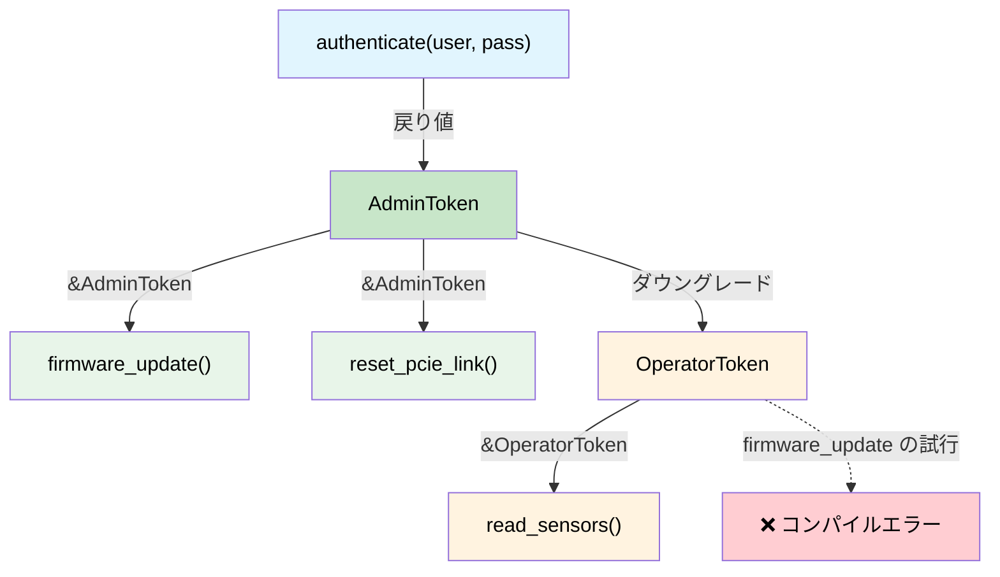

# ケーパビリティトークン — 権限のゼロコスト証明 🟡

> **学べること:** サイズゼロ型（ZST: Zero-Sized Types）がいかにコンパイル時の証明トークンとして機能し、特権階層、電源シーケンス、失効可能な権限をすべて実行時コストゼロで強制できるか。
>
> **関連章:** [第3章](ch03-single-use-types-cryptographic-guarantee.md)（単一使用型）、[第5章](ch05-protocol-state-machines-type-state-for-r.md)（型状態）、[第8章](ch08-capability-mixins-compile-time-hardware-.md)（Mixin）、[第10章](ch10-putting-it-all-together-a-complete-diagn.md)（統合）

## 課題: 誰に何の実行が許可されているか？

ハードウェア診断において、一部の操作は**危険**を伴います。

- BMC ファームウェアのプログラミング
- PCIe リンクのリセット
- OTP ヒューズへの書き込み
- 高電圧テストモードの有効化

C/C++ では、これらは実行時チェックによって保護されます。

```c
// C — 実行時の権限チェック
int reset_pcie_link(bmc_handle_t bmc, int slot) {
    if (!bmc->is_admin) {        // 実行時チェック
        return -EPERM;
    }
    if (!bmc->link_trained) {    // 別の実行時チェック
        return -EINVAL;
    }
    // ... 危険な処理を実行 ...
    return 0;
}
```

危険な操作を行うすべての関数で、これらのチェックを繰り返さなければなりません。1つでも忘れると、特権昇格のバグが発生します。

## 証明トークンとしてのサイズゼロ型（ZST）

**ケーパビリティトークン（Capability Token）**とは、呼び出し側があるアクションを実行する権限を持っていることを証明するサイズゼロ型（ZST: Zero-Sized Type）です。実行時には**0バイト**のコストしかかからず、型システムの中だけに存在します。

```rust,ignore
use std::marker::PhantomData;

/// 呼び出し側が管理者権限を持っていることの証明。
/// サイズゼロ — コンパイル時に完全に消去される。
/// Clone ではない、Copy ではない — 明示的に渡す必要がある。
pub struct AdminToken {
    _private: (),   // このモジュール外での構築を防止する
}

/// PCIe リンクがトレーニング済みで準備完了していることの証明。
pub struct LinkTrainedToken {
    _private: (),
}

pub struct BmcController { /* ... */ }

impl BmcController {
    /// 管理者として認証する — ケーパビリティトークンを返す。
    /// これが AdminToken を作成する唯一の方法。
    pub fn authenticate_admin(
        &mut self,
        credentials: &[u8],
    ) -> Result<AdminToken, &'static str> {
        // ... 認証情報を検証 ...
        # let valid = true;
        if valid {
            Ok(AdminToken { _private: () })
        } else {
            Err("認証に失敗しました")
        }
    }

    /// PCIe リンクをトレーニングする — トレーニング完了の証明を返す。
    pub fn train_link(&mut self) -> Result<LinkTrainedToken, &'static str> {
        // ... リンクトレーニングを実行 ...
        Ok(LinkTrainedToken { _private: () })
    }

    /// PCIe リンクをリセットする — 管理者権限とリンクトレーニング済みの両方の証明が必要。
    /// 実行時チェックは不要 — トークン自体が証明となっている。
    pub fn reset_pcie_link(
        &mut self,
        _admin: &AdminToken,         // 権限のゼロコスト証明
        _trained: &LinkTrainedToken,  // 状態のゼロコスト証明
        slot: u32,
    ) -> Result<(), &'static str> {
        println!("スロット {slot} の PCIe リンクをリセット中");
        Ok(())
    }
}
```

使用例 — 型システムがワークフローを強制します:

```rust,ignore
fn maintenance_workflow(bmc: &mut BmcController) -> Result<(), &'static str> {
    // ステップ1: 認証 — 管理者証明を取得
    let admin = bmc.authenticate_admin(b"secret")?;

    // ステップ2: リンクトレーニング — トレーニング済み証明を取得
    let trained = bmc.train_link()?;

    // ステップ3: リセット — コンパイラが両方のトークンを要求する
    bmc.reset_pcie_link(&admin, &trained, 0)?;

    Ok(())
}

// これはコンパイルを通りません:
fn unprivileged_attempt(bmc: &mut BmcController) -> Result<(), &'static str> {
    let trained = bmc.train_link()?;
    // bmc.reset_pcie_link(???, &trained, 0)?;
    //                     ^^^ AdminToken がない — これを呼び出すことはできない
    Ok(())
}
```

`AdminToken` と `LinkTrainedToken` は、コンパイル後のバイナリ内では**0バイト**です。これらは型検査の間にのみ存在します。関数シグネチャ `fn reset_pcie_link(&mut self, _admin: &AdminToken, ...)` は**証明責務（Proof Obligation）** — 「`AdminToken` を提示できる場合にのみ呼び出してよい」 — であり、それを提示する唯一の方法は `authenticate_admin()` を通すことです。

## 電源シーケンスの制御権限

サーバーの電源投入シーケンスには厳密な順序があります: スタンバイ（standby）→ 補助電源（auxiliary）→ 主電源（main）→ CPU。この順序を逆転させるとハードウェアが破損する恐れがあります。ケーパビリティトークンを用いれば、順序を強制できます。

```rust,ignore
/// 状態トークン — 各トークンが前のステップが完了したことを証明する。
pub struct StandbyOn { _p: () }
pub struct AuxiliaryOn { _p: () }
pub struct MainOn { _p: () }
pub struct CpuPowered { _p: () }

pub struct PowerController { /* ... */ }

impl PowerController {
    /// ステップ1: スタンバイ電源を有効化。前提条件なし。
    pub fn enable_standby(&mut self) -> Result<StandbyOn, &'static str> {
        println!("スタンバイ電源 オン");
        Ok(StandbyOn { _p: () })
    }

    /// ステップ2: 補助電源を有効化 — スタンバイの証明が必要。
    pub fn enable_auxiliary(
        &mut self,
        _standby: &StandbyOn,
    ) -> Result<AuxiliaryOn, &'static str> {
        println!("補助電源 オン");
        Ok(AuxiliaryOn { _p: () })
    }

    /// ステップ3: 主電源を有効化 — 補助電源の証明が必要。
    pub fn enable_main(
        &mut self,
        _aux: &AuxiliaryOn,
    ) -> Result<MainOn, &'static str> {
        println!("主電源 オン");
        Ok(MainOn { _p: () })
    }

    /// ステップ4: CPU へ給電 — 主電源の証明が必要。
    pub fn power_cpu(
        &mut self,
        _main: &MainOn,
    ) -> Result<CpuPowered, &'static str> {
        println!("CPU 給電 オン");
        Ok(CpuPowered { _p: () })
    }
}

fn power_on_sequence(ctrl: &mut PowerController) -> Result<CpuPowered, &'static str> {
    let standby = ctrl.enable_standby()?;
    let aux = ctrl.enable_auxiliary(&standby)?;
    let main = ctrl.enable_main(&aux)?;
    let cpu = ctrl.power_cpu(&main)?;
    Ok(cpu)
}

// ステップをスキップしようとする場合:
// fn wrong_order(ctrl: &mut PowerController) {
//     ctrl.power_cpu(???);  // ❌ enable_main() を実行しないと MainOn を生成できない
// }
```

## 階層型ケーパビリティ

実際のシステムには**階層（Hierarchy）**が存在します。管理者はユーザーができるすべての操作に加えて、さらに高度な操作を実行できます。これはトレイトの階層関係によってモデル化できます。

```rust,ignore
/// 基本ケーパビリティ — 認証済みのすべてのユーザー。
pub trait Authenticated {
    fn token_id(&self) -> u64;
}

/// オペレータはセンサーの読み取りと非破壊的な診断を実行可能。
pub trait Operator: Authenticated {}

/// 管理者はオペレータができるすべてのことに加え、破壊的操作も実行可能。
pub trait Admin: Operator {}

// 具体的なトークン:
pub struct UserToken { id: u64 }
pub struct OperatorToken { id: u64 }
pub struct AdminCapToken { id: u64 }

impl Authenticated for UserToken { fn token_id(&self) -> u64 { self.id } }
impl Authenticated for OperatorToken { fn token_id(&self) -> u64 { self.id } }
impl Operator for OperatorToken {}
impl Authenticated for AdminCapToken { fn token_id(&self) -> u64 { self.id } }
impl Operator for AdminCapToken {}
impl Admin for AdminCapToken {}

pub struct Bmc { /* ... */ }

impl Bmc {
    /// 認証済みのユーザーであれば誰でもセンサーを読み取り可能。
    pub fn read_sensor(&self, _who: &impl Authenticated, id: u32) -> f64 {
        42.0 // スタブ
    }

    /// オペレータ以上のみが診断を実行可能。
    pub fn run_diag(&mut self, _who: &impl Operator, test: &str) -> bool {
        true // スタブ
    }

    /// 管理者のみがファームウェアをフラッシュ可能。
    pub fn flash_firmware(&mut self, _who: &impl Admin, image: &[u8]) -> Result<(), &'static str> {
        Ok(()) // スタブ
    }
}
```

`AdminCapToken` は、`Authenticated`、`Operator`、`Admin` をすべて満たしているため、任意の関数に渡すことができます。`UserToken` は `read_sensor()` のみを呼び出せます。コンパイラはこの特権モデル全体を**実行時コストゼロ**で強制します。

## ライフタイムに束縛されたケーパビリティトークン

ケーパビリティに**スコープ**を持たせ、特定のライフタイム内でのみ有効にしたい場合があります。Rustの借用チェッカーはこれを自然に処理します。

```rust,ignore
/// スコープ付き管理者セッション。トークンはセッションを借用するため、
/// セッションより長く生存することはできない。
pub struct AdminSession {
    _active: bool,
}

pub struct ScopedAdminToken<'session> {
    _session: &'session AdminSession,
}

impl AdminSession {
    pub fn begin(credentials: &[u8]) -> Result<Self, &'static str> {
        // ... 認証 ...
        Ok(AdminSession { _active: true })
    }

    /// スコープ付きトークンを作成する — セッションの存続期間中のみ有効。
    pub fn token(&self) -> ScopedAdminToken<'_> {
        ScopedAdminToken { _session: self }
    }
}

fn scoped_example() -> Result<(), &'static str> {
    let session = AdminSession::begin(b"credentials")?;
    let token = session.token();

    // このスコープ内でトークンを使用...
    // session がドロップされると、トークンは借用チェッカーによって無効化される。
    // 実行時の有効期限チェックは不要。

    // drop(session);
    // ❌ エラー: session は借用されているため（&session を保持する token によって）、ムーブできない
    //
    // drop() を呼ばずに session がスコープ外に出た後で token を使おうとした場合でも、
    // 同様のエラー（ライフタイムの不一致）になる。

    Ok(())
}
```

### ケーパビリティトークンを使うべき場面

| シナリオ | パターン |
|----------|---------|
| 特権的なハードウェア操作 | ZST 証明トークン（AdminToken） |
| 複数ステップのシーケンス制御 | 状態トークンのチェーン（StandbyOn → AuxiliaryOn → ...） |
| ロールベースアクセス制御（RBAC） | トレイト階層（Authenticated → Operator → Admin） |
| 時間制限付きの特権 | ライフタイム束縛トークン（`ScopedAdminToken<'a>`） |
| モジュール間の権限委譲 | 公開トークン型 ＋ 非公開コンストラクタ |

### コストのまとめ

| 項目 | 実行時コスト |
|------|:------:|
| メモリ上の ZST トークン | 0 バイト |
| トークン引数の受け渡し | LLVM により完全に最適化・消去 |
| トレイト階層のディスパッチ | 静的ディスパッチ（単相化） |
| ライフタイムの強制 | コンパイル時のみ |

**実行時オーバーヘッドの合計: ゼロ。** 特権モデルは型システムの中にのみ存在します。

## ケーパビリティトークンの階層構造



## 演習問題: 階層化された診断権限

3層のケーパビリティシステム（`ViewerToken`, `TechToken`, `EngineerToken`）を設計してください。
- Viewer は `read_status()` を呼び出し可能
- Tech はさらに `run_quick_diag()` も呼び出し可能
- Engineer はさらに `flash_firmware()` も呼び出し可能
- 上位層は下位層ができるすべての操作を実行可能（トレイト境界またはトークン変換を使用）。

<details>
<summary>解答例</summary>

```rust,ignore
// トークン — サイズゼロ、プライベートコンストラクタ
pub struct ViewerToken { _private: () }
pub struct TechToken { _private: () }
pub struct EngineerToken { _private: () }

// ケーパビリティトレイト — 階層構造
pub trait CanView {}
pub trait CanDiag: CanView {}
pub trait CanFlash: CanDiag {}

impl CanView for ViewerToken {}
impl CanView for TechToken {}
impl CanView for EngineerToken {}
impl CanDiag for TechToken {}
impl CanDiag for EngineerToken {}
impl CanFlash for EngineerToken {}

pub fn read_status(_tok: &impl CanView) -> String {
    "status: OK".into()
}

pub fn run_quick_diag(_tok: &impl CanDiag) -> String {
    "diag: PASS".into()
}

pub fn flash_firmware(_tok: &impl CanFlash, _image: &[u8]) {
    // エンジニアのみがここに到達可能
}
```

</details>

## 主なまとめ

1. **ZST トークンは0バイト** — 型システムの中にのみ存在し、LLVM によって完全に最適化・消去されます。
2. **プライベートコンストラクタ ＝ 偽造不可能** — モジュール内の `authenticate()` だけがトークンを発行できます。
3. **トレイト階層が権限レベルをモデル化する** — `CanFlash: CanDiag: CanView` は現実の RBAC（ロールベースアクセス制御）をそのまま反映します。
4. **ライフタイム束縛トークンは自動的に失効する** — `ScopedAdminToken<'session>` はセッションを超えて生存することはできません。
5. **型状態（第5章）との組み合わせ** — 認証*および*順序付けられた操作の両方を必要とするプロトコルに効果的です。

---
