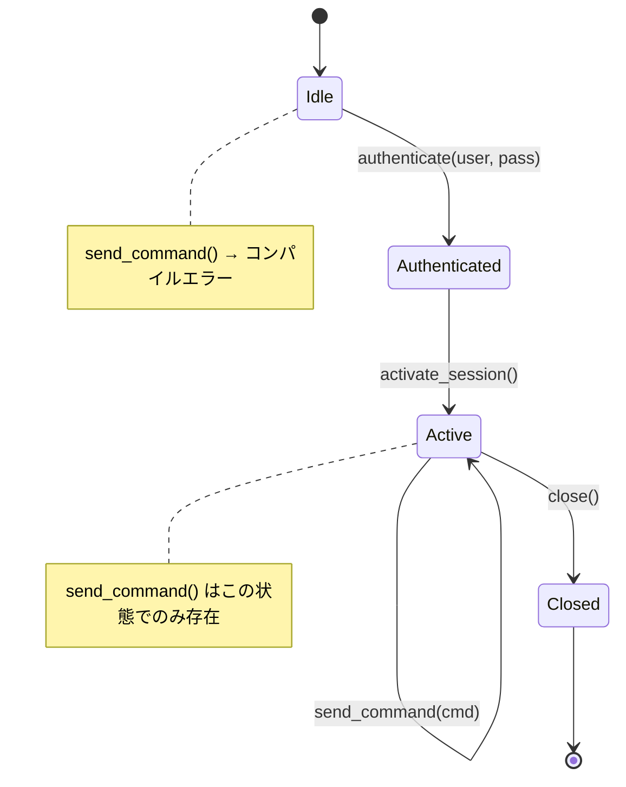
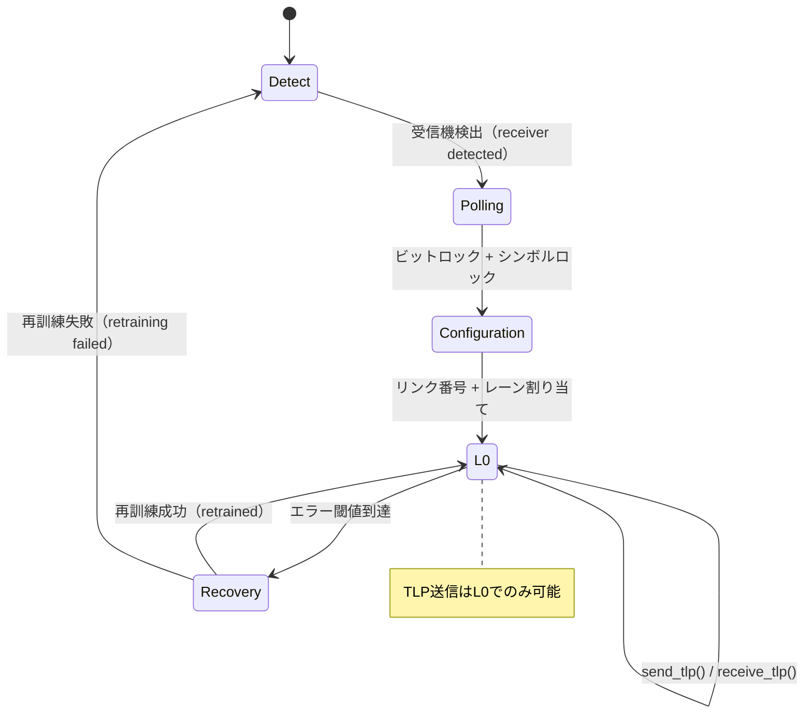
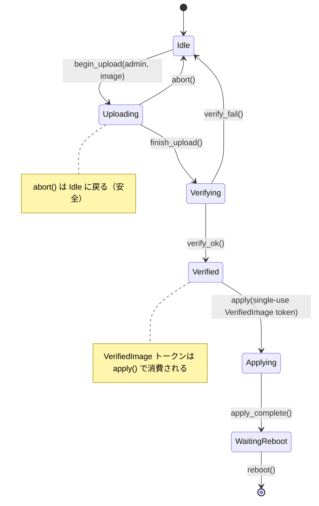

# プロトコル状態機械 — 実ハードウェア向け型状態（タイプステート） 🔴

> **学修目標:** 型状態（タイプステート）のエンコーディングによってプロトコル違反（順序の誤ったコマンド送信、クローズ後の使用など）をコンパイルエラーにする方法を、IPMIセッションのライフサイクルとPCIeリンク訓練への適用を通じて学びます。
>
> **関連章:** [第1章](ch01-the-philosophy-why-types-beat-tests.md)（レベル2 — 状態の正しさ）、[第4章](ch04-capability-tokens-zero-cost-proof-of-aut.md)（トークン）、[第9章](ch09-phantom-types-for-resource-tracking.md)（Phantom型）、[第11章](ch11-fourteen-tricks-from-the-trenches.md)（テクニック4 — タイプステートビルダー、テクニック8 — 非同期型状態）

## 課題: プロトコル違反

ハードウェアプロトコルには**厳密な状態機械（ステートマシン）**が存在します。たとえばIPMIセッションには、Unauthenticated（未認証）→ Authenticated（認証済み）→ Active（アクティブ）→ Closed（クローズ）という状態があります。PCIeのリンク訓練（LTSSM）は、Detect（検出）→ Polling（ポーリング）→ Configuration（設定）→ L0 という遷移をたどります。誤った状態でコマンドを送信すると、セッションが破損したりバスがハングアップしたりします。

**IPMIセッション状態機械:**



**PCIeリンク訓練状態機械（LTSSM）:**



C/C++では、状態は列挙型（enum）と実行時チェックで追跡されます：

```c
typedef enum { IDLE, AUTHENTICATED, ACTIVE, CLOSED } session_state_t;

typedef struct {
    session_state_t state;
    uint32_t session_id;
    // ...
} ipmi_session_t;

int ipmi_send_command(ipmi_session_t *s, uint8_t cmd, uint8_t *data, int len) {
    if (s->state != ACTIVE) {        // 実行時チェック — 忘れがち
        return -EINVAL;
    }
    // ... コマンド送信 ...
    return 0;
}
```

## 型状態（タイプステート）パターン

型状態パターンでは、各プロトコル状態が**個別の型**になります。状態遷移は、ある状態を消費して別の状態を返すメソッドとして表現されます。誤った状態でのメソッド呼び出しは、**その型にそのメソッドが存在しない**ため、コンパイラによって防がれます。

```rust,ignore
use std::marker::PhantomData;

// 状態 — サイズゼロのマーカー型
pub struct Idle;
## Case Study: IPMI Session Lifecycle

pub struct Authenticated;
pub struct Active;
pub struct Closed;

/// 現在の状態でパラメタライズされたIPMIセッション。
/// 状態は型システム上にのみ存在します（PhantomDataはサイズゼロ）。
pub struct IpmiSession<State> {
    transport: String,     // 例: "192.168.1.100"
    session_id: Option<u32>,
    _state: PhantomData<State>,
}

// 遷移: Idle → Authenticated
impl IpmiSession<Idle> {
    pub fn new(host: &str) -> Self {
        IpmiSession {
            transport: host.to_string(),
            session_id: None,
            _state: PhantomData,
        }
    }

    pub fn authenticate(
        self,              // ← Idleセッションを消費
        user: &str,
        pass: &str,
    ) -> Result<IpmiSession<Authenticated>, String> {
        println!("{user} を {} で認証中", self.transport);
        Ok(IpmiSession {
            transport: self.transport,
            session_id: Some(42),
            _state: PhantomData,
        })
    }
}

// 遷移: Authenticated → Active
impl IpmiSession<Authenticated> {
    pub fn activate(self) -> Result<IpmiSession<Active>, String> {
        // session_idは型状態の遷移パスによってSomeであることが保証される
        println!("セッション {} をアクティブ化中", self.session_id.unwrap());
        Ok(IpmiSession {
            transport: self.transport,
            session_id: self.session_id,
            _state: PhantomData,
        })
    }
}

// Active状態でのみ利用可能な操作
impl IpmiSession<Active> {
    pub fn send_command(&mut self, netfn: u8, cmd: u8, data: &[u8]) -> Vec<u8> {
        // Active状態ではsession_idがSomeであることが保証される
        println!("セッション {} でコマンド 0x{cmd:02X} を送信中", self.session_id.unwrap());
        vec![0x00] // スタブ: 完了コード OK
    }

    pub fn close(self) -> IpmiSession<Closed> {
        // Active状態ではsession_idがSomeであることが保証される
        println!("セッション {} をクローズ中", self.session_id.unwrap());
        IpmiSession {
            transport: self.transport,
            session_id: None,
            _state: PhantomData,
        }
    }
}

fn ipmi_workflow() -> Result<(), String> {
    let session = IpmiSession::new("192.168.1.100");

    // session.send_command(0x04, 0x2D, &[]);
    //  ^^^^^^ エラー: IpmiSession<Idle> に `send_command` メソッドは存在しない ❌

    let session = session.authenticate("admin", "password")?;

    // session.send_command(0x04, 0x2D, &[]);
    //  ^^^^^^ エラー: IpmiSession<Authenticated> に `send_command` メソッドは存在しない ❌

    let mut session = session.activate()?;

    // ✅ これで send_command が利用可能になる:
    let response = session.send_command(0x04, 0x2D, &[1]);

    let _closed = session.close();

    // _closed.send_command(0x04, 0x2D, &[]);
    //  ^^^^^^ エラー: IpmiSession<Closed> に `send_command` メソッドは存在しない ❌

    Ok(())
}
```

**実行時状態チェックは一切不要です。** コンパイラが以下を強制します：
- アクティブ化前の認証
- コマンド送信前のアクティブ化
- クローズ後はコマンドを送信できないこと

## PCIeリンク訓練状態機械（LTSSM）

PCIeリンク訓練は、PCIe仕様で定義されたマルチフェーズプロトコルです。型状態パターンを使うことで、リンクの準備が整う前にデータが送信されるのを防止できます：

```rust,ignore
use std::marker::PhantomData;

// PCIe LTSSM状態（簡略化版）
pub struct Detect;
pub struct Polling;
pub struct Configuration;
pub struct L0;         // 完全に動作可能な状態
pub struct Recovery;

pub struct PcieLink<State> {
    slot: u32,
    width: u8,          // ネゴシエートされたリンク幅 (x1, x4, x8, x16)
    speed: u8,          // Gen1=1, Gen2=2, Gen3=3, Gen4=4, Gen5=5
    _state: PhantomData<State>,
}

impl PcieLink<Detect> {
    pub fn new(slot: u32) -> Self {
        PcieLink {
            slot, width: 0, speed: 0,
            _state: PhantomData,
        }
    }

    pub fn detect_receiver(self) -> Result<PcieLink<Polling>, String> {
        println!("スロット {}: 受信機を検出しました", self.slot);
        Ok(PcieLink {
            slot: self.slot, width: 0, speed: 0,
            _state: PhantomData,
        })
    }
}

impl PcieLink<Polling> {
    pub fn poll_compliance(self) -> Result<PcieLink<Configuration>, String> {
        println!("スロット {}: ポーリング完了、設定状態に入ります", self.slot);
        Ok(PcieLink {
            slot: self.slot, width: 0, speed: 0,
            _state: PhantomData,
        })
    }
}

impl PcieLink<Configuration> {
    pub fn negotiate(self, width: u8, speed: u8) -> Result<PcieLink<L0>, String> {
        println!("スロット {}: x{width} Gen{speed} をネゴシエートしました", self.slot);
        Ok(PcieLink {
            slot: self.slot, width, speed,
            _state: PhantomData,
        })
    }
}

impl PcieLink<L0> {
    /// TLPを送信 — リンクが完全に訓練された（L0）状態でのみ可能
    pub fn send_tlp(&mut self, tlp: &[u8]) -> Vec<u8> {
        println!("スロット {}: {} バイトのTLPを送信中", self.slot, tlp.len());
        vec![0x00] // スタブ
    }

    /// リカバリ状態へ遷移 — Recovery状態を返す
    pub fn enter_recovery(self) -> PcieLink<Recovery> {
        PcieLink {
            slot: self.slot, width: self.width, speed: self.speed,
            _state: PhantomData,
        }
    }

    pub fn link_info(&self) -> String {
        format!("x{} Gen{}", self.width, self.speed)
    }
}

impl PcieLink<Recovery> {
    pub fn retrain(self, speed: u8) -> Result<PcieLink<L0>, String> {
        println!("スロット {}: Gen{speed} で再訓練しました", self.slot);
        Ok(PcieLink {
            slot: self.slot, width: self.width, speed,
            _state: PhantomData,
        })
    }
}

fn pcie_workflow() -> Result<(), String> {
    let link = PcieLink::new(0);

    // link.send_tlp(&[0x01]);  // ❌ エラー: PcieLink<Detect> に `send_tlp` メソッドは存在しない

    let link = link.detect_receiver()?;
    let link = link.poll_compliance()?;
    let mut link = link.negotiate(16, 5)?; // x16 Gen5

    // ✅ これでTLPを送信可能:
    let _resp = link.send_tlp(&[0x00, 0x01, 0x02]);
    println!("リンク情報: {}", link.link_info());

    // リカバリと再訓練:
    let recovery = link.enter_recovery();
    let mut link = recovery.retrain(4)?;  // Gen4にダウングレード
    let _resp = link.send_tlp(&[0x03]);

    Ok(())
}
```

## 型状態と機能トークンの結合

型状態と機能トークン（ケーパビリティトークン）は自然に組み合わせることができます。たとえば、アクティブなIPMIセッション**かつ**管理者権限を要求する診断処理を考えてみましょう：

```rust,ignore
# use std::marker::PhantomData;
# pub struct Active;
# pub struct AdminToken { _p: () }
# pub struct IpmiSession<S> { _s: PhantomData<S> }
# impl IpmiSession<Active> {
#     pub fn send_command(&mut self, _nf: u8, _cmd: u8, _d: &[u8]) -> Vec<u8> { vec![] }
# }

/// ファームウェア更新の実行 — 以下を要求:
/// 1. アクティブなIPMIセッション（型状態）
/// 2. 管理者権限（機能トークン）
pub fn firmware_update(
    session: &mut IpmiSession<Active>,   // セッションがアクティブであることを証明
    _admin: &AdminToken,                 // 呼び出し元が管理者であることを証明
    image: &[u8],
) -> Result<(), String> {
    // 実行時チェックは不要 — シグネチャ自体がチェックそのもの
    session.send_command(0x2C, 0x01, image);
    Ok(())
}
```

呼び出し元は次の手順を踏む必要があります：
1. セッションを作成する（`Idle`）
2. 認証する（`Authenticated`）
3. アクティブ化する（`Active`）
4. `AdminToken` を取得する
5. これらすべてを満たして初めて `firmware_update()` を呼び出すことができる

これらはすべてコンパイル時に強制され、実行時コストはゼロです。

## ビート3: ファームウェア更新 — 合成によるマルチフェーズ有限状態機械

ファームウェア更新のライフサイクルは、通常のセッションよりも多くの状態を持ち、機能トークンおよび単一使用（使い捨て）型（[第3章](ch03-linear-types-single-use-enforcement-f.md)）の双方と合成されます。これは本書で最も複雑な型状態の例ですが、これを理解できればこのパターンを完全にマスターしたと言えます。



```rust,ignore
use std::marker::PhantomData;

// ── 状態 ──
pub struct Idle;
pub struct Uploading;
pub struct Verifying;
pub struct Verified;
pub struct Applying;
pub struct WaitingReboot;

// ── イメージが検証に合格したことを示す単一使用の証明（第3章） ──
pub struct VerifiedImage {
    _private: (),
    pub digest: [u8; 32],
}

// ── 機能トークン: 管理者のみが開始可能（第4章） ──
pub struct FirmwareAdminToken { _private: () }

pub struct FwUpdate<S> {
    version: String,
    _state: PhantomData<S>,
}

impl FwUpdate<Idle> {
    pub fn new() -> Self {
        FwUpdate { version: String::new(), _state: PhantomData }
    }

    /// アップロード開始 — 管理者権限が必要
    pub fn begin_upload(
        self,
        _admin: &FirmwareAdminToken,
        version: &str,
    ) -> FwUpdate<Uploading> {
        println!("ファームウェア v{version} をアップロード中...");
        FwUpdate { version: version.to_string(), _state: PhantomData }
    }
}

impl FwUpdate<Uploading> {
    pub fn finish_upload(self) -> FwUpdate<Verifying> {
        println!("アップロード完了、v{} を検証中...", self.version);
        FwUpdate { version: self.version, _state: PhantomData }
    }

    /// 中止すると Idle に戻る — アップロード中のどの時点でも安全
    pub fn abort(self) -> FwUpdate<Idle> {
        println!("アップロードを中止しました。");
        FwUpdate { version: String::new(), _state: PhantomData }
    }
}

impl FwUpdate<Verifying> {
    /// 成功時、単一使用の VerifiedImage トークンを生成
    pub fn verify_ok(self, digest: [u8; 32]) -> (FwUpdate<Verified>, VerifiedImage) {
        println!("v{} の検証に合格しました", self.version);
        (
            FwUpdate { version: self.version, _state: PhantomData },
            VerifiedImage { _private: (), digest },
        )
    }

    pub fn verify_fail(self) -> FwUpdate<Idle> {
        println!("検証に失敗しました — アイドル状態に戻ります。");
        FwUpdate { version: String::new(), _state: PhantomData }
    }
}

impl FwUpdate<Verified> {
    /// apply は VerifiedImage トークンを消費する — 2回適用することはできない
    pub fn apply(self, proof: VerifiedImage) -> FwUpdate<Applying> {
        println!("v{} を適用中 (ダイジェスト: {:02x?})", self.version, &proof.digest[..4]);
        // proof はムーブされる — 再利用不可
        FwUpdate { version: self.version, _state: PhantomData }
    }
}

impl FwUpdate<Applying> {
    pub fn apply_complete(self) -> FwUpdate<WaitingReboot> {
        println!("適用完了 — 再起動待機中。");
        FwUpdate { version: self.version, _state: PhantomData }
    }
}

impl FwUpdate<WaitingReboot> {
    pub fn reboot(self) {
        println!("v{} への再起動を実行中...", self.version);
    }
}

// ── 使用例 ──

fn firmware_workflow() {
    let fw = FwUpdate::new();

    // fw.finish_upload();  // ❌ エラー: FwUpdate<Idle> に `finish_upload` メソッドは存在しない

    let admin = FirmwareAdminToken { _private: () }; // 認証システムから取得
    let fw = fw.begin_upload(&admin, "2.10.1");
    let fw = fw.finish_upload();

    let digest = [0xAB; 32]; // 検証中に計算
    let (fw, token) = fw.verify_ok(digest);

    let fw = fw.apply(token);
    // fw.apply(token);  // ❌ ムーブされた値の使用: `token`

    let fw = fw.apply_complete();
    fw.reboot();
}
```

**3つのビートが全体として示すもの:**

| ビート | プロトコル | 状態数 | 合成 |
|:----:|----------|:------:|-------------|
| 1 | IPMIセッション | 4 | 純粋な型状態 |
| 2 | PCIe LTSSM | 5 | 型状態 + リカバリ分岐 |
| 3 | ファームウェア更新 | 6 | 型状態 + 機能トークン（[第4章](ch04-capability-tokens-zero-cost-proof-of-aut.md)） + 単一使用の証明（[第3章](ch03-linear-types-single-use-enforcement-f.md)） |

各ビートごとに複雑さの階層が追加されます。ビート3に達する頃には、コンパイラが状態の順序、管理者権限、**そして**1回限りの適用をすべて強制するようになります。つまり、3種類のバグが単一の有限状態機械で根絶されるのです。

### いつ型状態を使用すべきか

| プロトコル | 型状態を適用する価値があるか？ |
|----------|:------:|
| IPMIセッションライフサイクル | ✅ あり — 認証 → アクティブ化 → コマンド送信 → クローズ |
| PCIeリンク訓練 | ✅ あり — 検出 → ポーリング → 設定 → L0 |
| TLSハンドシェイク | ✅ あり — ClientHello → ServerHello → Finished |
| USB列挙 | ✅ あり — Attached → Powered → Default → Addressed → Configured |
| 単純なリクエスト/レスポンス | ⚠️ おそらく不要 — 2状態のみ |
| 送りっぱなし（Fire-and-forget）のメッセージ | ❌ 不要 — 追跡すべき状態がない |

## 演習問題: USBデバイス列挙の型状態

USBデバイスが `Attached` → `Powered` → `Default` → `Addressed` → `Configured` という状態を経由するモデルを作成してください。各遷移は前の状態を消費して次の状態を生成する必要があります。`send_data()` は `Configured` 状態でのみ利用可能にしてください。

<details>
<summary>解答例</summary>

```rust,ignore
use std::marker::PhantomData;

pub struct Attached;
pub struct Powered;
pub struct Default;
pub struct Addressed;
pub struct Configured;

pub struct UsbDevice<State> {
    address: u8,
    _state: PhantomData<State>,
}

impl UsbDevice<Attached> {
    pub fn new() -> Self {
        UsbDevice { address: 0, _state: PhantomData }
    }
    pub fn power_on(self) -> UsbDevice<Powered> {
        UsbDevice { address: self.address, _state: PhantomData }
    }
}

impl UsbDevice<Powered> {
    pub fn reset(self) -> UsbDevice<Default> {
        UsbDevice { address: self.address, _state: PhantomData }
    }
}

impl UsbDevice<Default> {
    pub fn set_address(self, addr: u8) -> UsbDevice<Addressed> {
        UsbDevice { address: addr, _state: PhantomData }
    }
}

impl UsbDevice<Addressed> {
    pub fn configure(self) -> UsbDevice<Configured> {
        UsbDevice { address: self.address, _state: PhantomData }
    }
}

impl UsbDevice<Configured> {
    pub fn send_data(&self, _data: &[u8]) {
        // Configured 状態でのみ利用可能
    }
}
```

</details>

## 重要なポイント

1. **型状態により誤った順序の呼び出しが不可能になる** — メソッドはその呼び出しが妥当な状態の型にのみ存在します。
2. **各遷移は `self` を消費する** — 遷移後に古い状態を保持し続けることはできません。
3. **機能トークンと組み合わせる** — `firmware_update()` は `Session<Active>` と `AdminToken` の*両方*を要求します。
4. **3つのビートによる段階的な複雑さ** — IPMI（純粋な状態機械）、PCIe LTSSM（リカバリ分岐）、ファームウェア更新（状態機械 + トークン + 単一使用の証明）は、このパターンがシンプルなものからリッチに合成されたものまでスケールすることを示しています。
5. **過剰な適用を避ける** — 2状態のリクエスト/レスポンスプロトコルなどは、型状態を使わない方がシンプルです。
6. **このパターンは完全なRedfishワークフローへと拡張される** — 第17章ではRedfishセッションのライフサイクルに型状態を適用し、第18章ではレスポンス構築にビルダー型状態を使用します。

---
