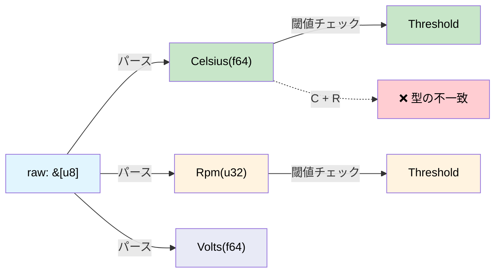

# 次元解析 — コンパイラに単位を検査させる 🟢

> **学修目標:** ニュータイプ（Newtype）ラッパーと `uom` クレートを利用してコンパイラを単位検査エンジンへと変え、3億2800万ドルの宇宙探査機を失わせたような類のバグを防ぐ方法を学びます。
>
> **関連章:** [第2章](ch02-typed-command-interfaces-request-determi.md)（型付きコマンドでこれらの型を使用）、[第7章](ch07-validated-boundaries-parse-dont-validate.md)（検証済み境界）、[第10章](ch10-putting-it-all-together-a-complete-diagn.md)（総合演習）

## マーズ・クライメイト・オービターの教訓

1999年、NASAの火星探査機マーズ・クライメイト・オービター（Mars Climate Orbiter）は、一方のチームが推力データを**重量ポンド秒（pound-force seconds）**で送信していたのに対し、ナビゲーションチームが**ニュートン秒（newton-seconds）**を想定していたために失われました。探査機は予定の高度226 kmではなく57 kmで大気圏に突入し、空中分解しました。被害額は3億2760万ドルに達しました。

根本原因は、**両方の値が単なる `double` 型だった**ことです。コンパイラはそれらを区別できませんでした。

物理量を扱うあらゆるハードウェア診断プログラムにも、まったく同じ種類のバグが潜んでいます：

```c
// C — すべて double 型、単位の検査はない
double read_temperature(int sensor_id);   // 摂氏？ 華氏？ ケルビン？
double read_voltage(int channel);          // ボルト？ ミリボルト？
double read_fan_speed(int fan_id);         // RPM？ ラジアン毎秒？

// バグ: 摂氏と華氏の比較
if (read_temperature(0) > read_temperature(1)) { ... }  // 単位が異なっている可能性がある！
```

## 物理量のためのニュータイプ（Newtype）

「正しさを構造によって担保する（correct-by-construction）」最もシンプルなアプローチは、**各単位を専用の独自の型でラップする**ことです。

```rust,ignore
use std::fmt;

/// 摂氏温度（°C）。
#[derive(Debug, Clone, Copy, PartialEq, PartialOrd)]
pub struct Celsius(pub f64);

/// 華氏温度（°F）。
#[derive(Debug, Clone, Copy, PartialEq, PartialOrd)]
pub struct Fahrenheit(pub f64);

/// 電圧（V）。
#[derive(Debug, Clone, Copy, PartialEq, PartialOrd)]
pub struct Volts(pub f64);

/// 電圧（mV）。
#[derive(Debug, Clone, Copy, PartialEq, PartialOrd)]
pub struct Millivolts(pub f64);

/// ファン回転数（RPM）。
#[derive(Debug, Clone, Copy, PartialEq, PartialOrd)]
pub struct Rpm(pub f64);

// 変換は明示的:
impl From<Celsius> for Fahrenheit {
    fn from(c: Celsius) -> Self {
        Fahrenheit(c.0 * 9.0 / 5.0 + 32.0)
    }
}

impl From<Fahrenheit> for Celsius {
    fn from(f: Fahrenheit) -> Self {
        Celsius((f.0 - 32.0) * 5.0 / 9.0)
    }
}

impl From<Volts> for Millivolts {
    fn from(v: Volts) -> Self {
        Millivolts(v.0 * 1000.0)
    }
}

impl From<Millivolts> for Volts {
    fn from(mv: Millivolts) -> Self {
        Volts(mv.0 / 1000.0)
    }
}

impl fmt::Display for Celsius {
    fn fmt(&self, f: &mut fmt::Formatter<'_>) -> fmt::Result {
        write!(f, "{:.1}°C", self.0)
    }
}

impl fmt::Display for Rpm {
    fn fmt(&self, f: &mut fmt::Formatter<'_>) -> fmt::Result {
        write!(f, "{:.0} RPM", self.0)
    }
}
```

これで、コンパイラが単位の不一致を捕捉します：

```rust,ignore
# #[derive(Debug, Clone, Copy, PartialEq, PartialOrd)]
# pub struct Celsius(pub f64);
# #[derive(Debug, Clone, Copy, PartialEq, PartialOrd)]
# pub struct Volts(pub f64);

fn check_thermal_limit(temp: Celsius, limit: Celsius) -> bool {
    temp > limit  // ✅ 同じ単位 — コンパイル成功
}

// fn bad_comparison(temp: Celsius, voltage: Volts) -> bool {
//     temp > voltage  // ❌ エラー: 型の不一致 — Celsius vs Volts
// }
```

**実行時コストはゼロ** — ニュータイプは生の `f64` 値へとコンパイルされます。ラッパーは純粋に型レベルの概念にすぎません。

## ハードウェア物理量のためのニュータイプマクロ

手作業でニュータイプをいくつも書くのは退屈で冗長です。マクロを使えばボイラープレートを排除できます：

```rust,ignore
/// 物理量のニュータイプを生成するマクロ。
macro_rules! quantity {
    ($Name:ident, $unit:expr) => {
        #[derive(Debug, Clone, Copy, PartialEq, PartialOrd)]
        pub struct $Name(pub f64);

        impl $Name {
            pub fn new(value: f64) -> Self { $Name(value) }
            pub fn value(self) -> f64 { self.0 }
        }

        impl std::fmt::Display for $Name {
            fn fmt(&self, f: &mut std::fmt::Formatter<'_>) -> std::fmt::Result {
                write!(f, "{:.2} {}", self.0, $unit)
            }
        }

        impl std::ops::Add for $Name {
            type Output = Self;
            fn add(self, rhs: Self) -> Self { $Name(self.0 + rhs.0) }
        }

        impl std::ops::Sub for $Name {
            type Output = Self;
            fn sub(self, rhs: Self) -> Self { $Name(self.0 - rhs.0) }
        }
    };
}

// 使用例:
quantity!(Celsius, "°C");
quantity!(Fahrenheit, "°F");
quantity!(Volts, "V");
quantity!(Millivolts, "mV");
quantity!(Rpm, "RPM");
quantity!(Watts, "W");
quantity!(Amperes, "A");
quantity!(Pascals, "Pa");
quantity!(Hertz, "Hz");
quantity!(Bytes, "B");
```

各行が、Display、Add、Sub、および比較演算子を備えた完全な型を生成します。**これらすべてが実行時コストゼロで実現されます。**

> **物理学上の注意点:** このマクロは `Celsius` を含む*すべての*物理量に対して `Add` を生成します。絶対温度の足し算（`25°C + 30°C = 55°C`）は物理的に意味をなしません — 温度差を表すには別途 `TemperatureDelta` 型が必要です。後述する `uom` クレートはこの問題を正しく扱います。単に比較や表示を行うだけのシンプルなセンサー診断であれば、温度型からは `Add`/`Sub` を除外しておき、加算が物理的に意味をなす量（Watts、Volts、Bytes）にのみ残すのが適切です。もし温度差の演算が必要な場合は、`CelsiusDelta(f64)` というニュータイプを定義し、`impl Add<CelsiusDelta> for Celsius` を実装してください。

## 実践例: センサーパイプライン

一般的な診断プログラムでは、生のADC値を読み取り、それを物理単位に変換したうえで、閾値と比較します。次元型（単位付きの型）を使用すると、各ステップが静的に型チェックされます：

```rust,ignore
# macro_rules! quantity {
#     ($Name:ident, $unit:expr) => {
#         #[derive(Debug, Clone, Copy, PartialEq, PartialOrd)]
#         pub struct $Name(pub f64);
#         impl $Name {
#             pub fn new(value: f64) -> Self { $Name(value) }
#             pub fn value(self) -> f64 { self.0 }
#         }
#         impl std::fmt::Display for $Name {
#             fn fmt(&self, f: &mut std::fmt::Formatter<'_>) -> std::fmt::Result {
#                 write!(f, "{:.2} {}", self.0, $unit)
#             }
#         }
#     };
# }
# quantity!(Celsius, "°C");
# quantity!(Volts, "V");
# quantity!(Rpm, "RPM");

/// 生のADC読み取り値 — まだ物理量ではない
#[derive(Debug, Clone, Copy)]
pub struct AdcReading {
    pub channel: u8,
    pub raw: u16,   // 12ビットADC値 (0–4095)
}

/// ADC → 物理単位変換用の校正（キャリブレーション）係数
pub struct TemperatureCalibration {
    pub offset: f64,
    pub scale: f64,   // ADCカウントあたりの°C
}

pub struct VoltageCalibration {
    pub reference_mv: f64,
    pub divider_ratio: f64,
}

impl TemperatureCalibration {
    /// 生のADC → Celsiusに変換。戻り値の型が出力がCelsiusであることを保証する。
    pub fn convert(&self, adc: AdcReading) -> Celsius {
        Celsius::new(adc.raw as f64 * self.scale + self.offset)
    }
}

impl VoltageCalibration {
    /// 生のADC → Voltsに変換。戻り値の型が出力がVoltsであることを保証する。
    pub fn convert(&self, adc: AdcReading) -> Volts {
        Volts::new(adc.raw as f64 * self.reference_mv / 4096.0 / self.divider_ratio / 1000.0)
    }
}

/// 閾値チェック — 単位が一致する場合にのみコンパイルされる
pub struct Threshold<T: PartialOrd> {
    pub warning: T,
    pub critical: T,
}

#[derive(Debug, PartialEq)]
pub enum ThresholdResult {
    Normal,
    Warning,
    Critical,
}

impl<T: PartialOrd> Threshold<T> {
    pub fn check(&self, value: &T) -> ThresholdResult {
        if *value >= self.critical {
            ThresholdResult::Critical
        } else if *value >= self.warning {
            ThresholdResult::Warning
        } else {
            ThresholdResult::Normal
        }
    }
}

fn sensor_pipeline_example() {
    let temp_cal = TemperatureCalibration { offset: -50.0, scale: 0.0625 };
    let temp_threshold = Threshold {
        warning: Celsius::new(85.0),
        critical: Celsius::new(100.0),
    };

    let adc = AdcReading { channel: 0, raw: 2048 };
    let temp: Celsius = temp_cal.convert(adc);

    let result = temp_threshold.check(&temp);
    println!("温度: {temp}, 判定: {result:?}");

    // これはコンパイル不可 — Celsius の読み取り値を Volts の閾値と比較することはできない:
    // let volt_threshold = Threshold {
    //     warning: Volts::new(11.4),
    //     critical: Volts::new(10.8),
    // };
    // volt_threshold.check(&temp);  // ❌ エラー: expected &Volts, found &Celsius
}
```

**パイプライン全体**が静的に型チェックされます：
- ADCの読み取り値は生カウント値（単位ではない）
- 校正処理によって型付けされた物理量（Celsius、Volts）が生成される
- 閾値（Threshold）は物理量の型に対してジェネリック
- Celsius と Volts の比較は**コンパイルエラー**になる

## uom クレート

本番環境での利用には、[`uom`](https://crates.io/crates/uom) クレートが数百種類もの単位、自動変換、実行時オーバーヘッドゼロを備えた包括的な次元解析システムを提供します：

```rust,ignore
// Cargo.toml: uom = { version = "0.36", features = ["f64"] }
//
// use uom::si::f64::*;
// use uom::si::thermodynamic_temperature::degree_celsius;
// use uom::si::electric_potential::volt;
// use uom::si::power::watt;
//
// let temp = ThermodynamicTemperature::new::<degree_celsius>(85.0);
// let voltage = ElectricPotential::new::<volt>(12.0);
// let power = Power::new::<watt>(250.0);
//
// // temp + voltage;  // ❌ コンパイルエラー — 温度と電圧は加算できない
// // power > temp;    // ❌ コンパイルエラー — 電力と温度は比較できない
```

自動的な組立単位のサポート（例: Watts = Volts × Amperes）が必要な場合は `uom` を使用してください。組立単位の演算を必要とせず、単純な物理量のみを扱う場合は自作のニュータイプで十分です。

### いつ次元型を使用すべきか

| シナリオ | 推奨事項 |
|----------|---------------|
| センサー読み取り値（温度、電圧、ファン回転数） | ✅ 常に使用 — 単位の混同を防止 |
| 閾値との比較 | ✅ 常に使用 — ジェネリックな `Threshold<T>` |
| サブシステム間のデータ交換 | ✅ 常に使用 — API境界で契約を強制 |
| 内部計算（全体を通じて同一単位） | ⚠️ 任意 — バグの混入リスクは低い |
| 文字列/画面表示のフォーマット | ❌ 物理量の型に Display を実装して使用 |

## センサーパイプラインの型フロー



## 演習問題: 電力バジェット計算機

`Watts(f64)` と `Amperes(f64)` のニュータイプを作成してください。以下を実装してください：
- `Watts::from_vi(volts: Volts, amps: Amperes) -> Watts` （P = V × I）
- 合計ワット数を追跡し、設定された上限値を超える加算を拒絶する `PowerBudget`
- `Watts + Celsius` の試みがコンパイルエラーになること

<details>
<summary>解答例</summary>

```rust,ignore
#[derive(Debug, Clone, Copy, PartialEq, PartialOrd)]
pub struct Watts(pub f64);

#[derive(Debug, Clone, Copy, PartialEq, PartialOrd)]
pub struct Amperes(pub f64);

#[derive(Debug, Clone, Copy, PartialEq, PartialOrd)]
pub struct Volts(pub f64);

#[derive(Debug, Clone, Copy, PartialEq, PartialOrd)]
pub struct Celsius(pub f64);

impl Watts {
    pub fn from_vi(volts: Volts, amps: Amperes) -> Self {
        Watts(volts.0 * amps.0)
    }
}

impl std::ops::Add for Watts {
    type Output = Watts;
    fn add(self, rhs: Watts) -> Self {
        Watts(self.0 + rhs.0)
    }
}

pub struct PowerBudget {
    total: Watts,
    limit: Watts,
}

impl PowerBudget {
    pub fn new(limit: Watts) -> Self {
        PowerBudget { total: Watts(0.0), limit }
    }
    pub fn add(&mut self, w: Watts) -> Result<(), String> {
        let new_total = Watts(self.total.0 + w.0);
        if new_total > self.limit {
            return Err(format!("バジェット超過: {:?} > {:?}", new_total, self.limit));
        }
        self.total = new_total;
        Ok(())
    }
}

// ❌ コンパイルエラー: Watts + Celsius → "mismatched types"
// let bad = Watts(100.0) + Celsius(50.0);
```

</details>

## 重要なポイント

1. **ニュータイプは実行時コストゼロで単位の混同を防ぐ** — `Celsius` と `Rpm` は内部的にはどちらも `f64` ですが、コンパイラはそれらを別の型として扱います。
2. **マーズ・クライメイト・オービターのバグは起こり得ない** — `Newtons` が期待されている場所に `Pounds` を渡すとコンパイルエラーになります。
3. **`quantity!` マクロでボイラープレートを削減する** — 各単位に対して Display、算術演算、閾値ロジックを一括生成できます。
4. **`uom` クレートで組立単位を扱う** — `Watts = Volts × Amperes` などの自動的な組立単位計算が必要な場合は `uom` を活用します。
5. **閾値は物理量の型に対してジェネリック** — `Threshold<Celsius>` を誤って `Threshold<Rpm>` と比較することはできません。

---
