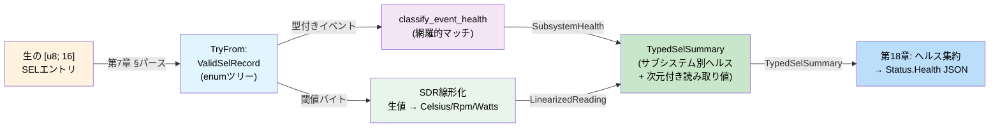
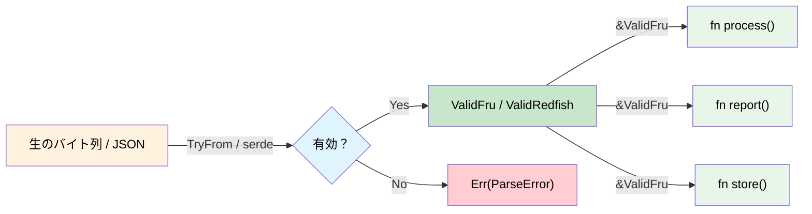

# 検証済み境界 — バリデーションではなくパースせよ 🟡

> **学修目標:** システム境界でデータを一度だけ検証し、その正当性の証明を専用の型に保持して二度と再検査しない設計手法を学びます。IPMI FRUレコード（フラットなバイト列）、Redfish JSON（構造化ドキュメント）、IPMI SELレコード（ネストされたディスパッチを持つ多相バイナリ）への適用と、完全なエンドツーエンドのウォークスルーを通じて理解を深めます。
>
> **関連章:** [第2章](ch02-typed-command-interfaces-request-determi.md)（型付きコマンド）、[第6章](ch06-dimensional-analysis-making-the-compiler.md)（次元型）、[第11章](ch11-fourteen-tricks-from-the-trenches.md)（テクニック2 — シールされたトレイト、テクニック3 — `#[non_exhaustive]`、テクニック5 — FromStr）、[第14章](ch14-testing-type-level-guarantees.md)（proptest）

## 課題: 散弾銃バリデーション（Shotgun Validation）

典型的なコードでは、バリデーションがいたるところに散乱しています。データを受け取るすべての関数が「念のため」とばかりに再検査を行います：

```c
// C — コードベース全体に散乱したバリデーション
int process_fru_data(uint8_t *data, int len) {
    if (data == NULL) return -1;          // チェック: nullでないこと
    if (len < 8) return -1;              // チェック: 最小長
    if (data[0] != 0x01) return -1;      // チェック: フォーマットバージョン
    if (checksum(data, len) != 0) return -1; // チェック: チェックサム

    // ... 同じチェックを繰り返す関数が他に10個もある ...
}
```

このパターン（「散弾銃バリデーション（Shotgun Validation）」）には2つの問題があります：
1. **冗長性** — 同じチェックが何十箇所にも現れる
2. **不完全性** — ひとつの関数でひとつのチェックを忘れただけでバグになる

## バリデーションではなくパースせよ（Parse, Don't Validate）

「正しさを構造によって担保する」アプローチでは、**境界で一度だけ検証し、その妥当性の証明を型に持たせます**。

```rust,ignore
/// 通信路（ワイヤ）からの生のバイト列 — まだ検証されていない
#[derive(Debug)]
pub struct RawFruData(Vec<u8>);
```

### ケーススタディ: IPMI FRU データ

```rust,ignore
# #[derive(Debug)]
# pub struct RawFruData(Vec<u8>);

/// 検証済みのIPMI FRUデータ。すべての不変条件を強制する
/// TryFrom を経由してのみ作成可能。一度 ValidFru を取得すれば、
/// すべてのデータが正しいことが保証される。
#[derive(Debug)]
pub struct ValidFru {
    format_version: u8,
    internal_area_offset: u8,
    chassis_area_offset: u8,
    board_area_offset: u8,
    product_area_offset: u8,
    data: Vec<u8>,
}

#[derive(Debug)]
pub enum FruError {
    TooShort { actual: usize, minimum: usize },
    BadFormatVersion(u8),
    ChecksumMismatch { expected: u8, actual: u8 },
    InvalidAreaOffset { area: &'static str, offset: u8 },
}

impl std::fmt::Display for FruError {
    fn fmt(&self, f: &mut std::fmt::Formatter<'_>) -> std::fmt::Result {
        match self {
            Self::TooShort { actual, minimum } =>
                write!(f, "FRUデータが短すぎます: {actual} バイト（最小 {minimum}）"),
            Self::BadFormatVersion(v) =>
                write!(f, "サポートされていないFRUフォーマットバージョン: {v}"),
            Self::ChecksumMismatch { expected, actual } =>
                write!(f, "チェックサム不一致: 期待値 0x{expected:02X}, 実際 0x{actual:02X}"),
            Self::InvalidAreaOffset { area, offset } =>
                write!(f, "不正な{area}領域オフセット: {offset}"),
        }
    }
}

impl TryFrom<RawFruData> for ValidFru {
    type Error = FruError;

    fn try_from(raw: RawFruData) -> Result<Self, FruError> {
        let data = raw.0;

        // 1. 長さチェック
        if data.len() < 8 {
            return Err(FruError::TooShort {
                actual: data.len(),
                minimum: 8,
            });
        }

        // 2. フォーマットバージョン
        if data[0] != 0x01 {
            return Err(FruError::BadFormatVersion(data[0]));
        }

        // 3. チェックサム（ヘッダは先頭8バイト、チェックサムはバイト7）
        let checksum: u8 = data[..8].iter().fold(0u8, |acc, &b| acc.wrapping_add(b));
        if checksum != 0 {
            return Err(FruError::ChecksumMismatch {
                expected: 0,
                actual: checksum,
            });
        }

        // 4. 領域オフセットが範囲内であること
        for (name, idx) in [
            ("internal", 1), ("chassis", 2),
            ("board", 3), ("product", 4),
        ] {
            let offset = data[idx];
            if offset != 0 && (offset as usize * 8) >= data.len() {
                return Err(FruError::InvalidAreaOffset {
                    area: name,
                    offset,
                });
            }
        }

        // すべてのチェックに合格 — 検証済み型を構築
        Ok(ValidFru {
            format_version: data[0],
            internal_area_offset: data[1],
            chassis_area_offset: data[2],
            board_area_offset: data[3],
            product_area_offset: data[4],
            data,
        })
    }
}

impl ValidFru {
    /// バリデーション不要 — 型が正しさを保証している
    pub fn board_area(&self) -> Option<&[u8]> {
        if self.board_area_offset == 0 {
            return None;
        }
        let start = self.board_area_offset as usize * 8;
        Some(&self.data[start..])  // 安全 — パース時に境界チェック済み
    }

    pub fn product_area(&self) -> Option<&[u8]> {
        if self.product_area_offset == 0 {
            return None;
        }
        let start = self.product_area_offset as usize * 8;
        Some(&self.data[start..])
    }

    pub fn format_version(&self) -> u8 {
        self.format_version
    }
}
```

`&ValidFru` を受け取る任意の関数は、データが整形式（well-formed）であることを**知っています**。再チェックは不要です：

```rust,ignore
# pub struct ValidFru { board_area_offset: u8, data: Vec<u8> }
# impl ValidFru {
#     pub fn board_area(&self) -> Option<&[u8]> { None }
# }

/// この関数はFRUデータを検証する必要がありません。
/// 型シグネチャがすでに有効であることを保証しています。
fn extract_board_serial(fru: &ValidFru) -> Option<String> {
    let board = fru.board_area()?;
    // ... ボード領域からシリアル番号をパース ...
    // 境界チェックは不要 — ValidFruがオフセットが範囲内であることを保証
    Some("ABC123".to_string()) // スタブ
}

fn extract_board_manufacturer(fru: &ValidFru) -> Option<String> {
    let board = fru.board_area()?;
    // 同様にバリデーションは不要 — 同じ保証が適用される
    Some("Acme Corp".to_string()) // スタブ
}
```

## 検証済みの Redfish JSON

同じパターンは Redfish API のレスポンスにも適用できます。一度パースし、正当性を型で持ち運びます：

```rust,ignore
use std::collections::HashMap;

/// Redfishエンドポイントからの生のJSON文字列
pub struct RawRedfishResponse(pub String);

/// 検証済みのRedfish Thermal（温度・ファン）レスポンス。
/// すべての必須フィールドが存在し、範囲内であることが保証される。
#[derive(Debug)]
pub struct ValidThermalResponse {
    pub temperatures: Vec<ValidTemperatureReading>,
    pub fans: Vec<ValidFanReading>,
}

#[derive(Debug)]
pub struct ValidTemperatureReading {
    pub name: String,
    pub reading_celsius: f64,     // NaNでなく、センサーの有効範囲内であることが保証される
    pub upper_critical: f64,
    pub status: HealthStatus,
}

#[derive(Debug)]
pub struct ValidFanReading {
    pub name: String,
    pub reading_rpm: u32,        // 存在するファンについて > 0 であることが保証される
    pub status: HealthStatus,
}

#[derive(Debug, Clone, Copy, PartialEq)]
pub enum HealthStatus {
    Ok,
    Warning,
    Critical,
}

#[derive(Debug)]
pub enum RedfishValidationError {
    MissingField(&'static str),
    OutOfRange { field: &'static str, value: f64 },
    InvalidStatus(String),
}

impl std::fmt::Display for RedfishValidationError {
    fn fmt(&self, f: &mut std::fmt::Formatter<'_>) -> std::fmt::Result {
        match self {
            Self::MissingField(name) => write!(f, "必須フィールドが見つかりません: {name}"),
            Self::OutOfRange { field, value } =>
                write!(f, "フィールド {field} が範囲外です: {value}"),
            Self::InvalidStatus(s) => write!(f, "無効なヘルスステータス: {s}"),
        }
    }
}

// 一度検証されれば、下流のコードが再検査することはない:
fn check_thermal_health(thermal: &ValidThermalResponse) -> bool {
    // フィールドの欠落やNaN値をチェックする必要はない。
    // ValidThermalResponse はすべての読み取り値が妥当であることを保証している。
    thermal.temperatures.iter().all(|t| {
        t.reading_celsius < t.upper_critical && t.status != HealthStatus::Critical
    }) && thermal.fans.iter().all(|f| {
        f.reading_rpm > 0 && f.status != HealthStatus::Critical
    })
}
```

## 多相バリデーション: IPMI SEL レコード

最初の2つのケーススタディでは**フラット**な構造を検証しました — 固定バイトレイアウト（FRU）と既知のJSONスキーマ（Redfish）です。しかし現実世界のデータはしばしば**多相的（polymorphic）**です。つまり、後ろのバイトの意味解釈が、手前のバイトの値に依存します。IPMI システムイベントログ（SEL）レコードはその典型的な例です。

### 課題の全体像

すべてのSELレコードは厳密に16バイトです。しかし、それらのバイトが何を*意味*するかは、ディスパッチの連鎖に依存します：

```
バイト 2: レコードタイプ
  ├─ 0x02 → システムイベント
  │    バイト 10[6:4]: イベントタイプ
  │      ├─ 0x01       → 閾値イベント（データバイト 2-3 に読み取り値と閾値）
  │      ├─ 0x02-0x0C  → ディスクリートイベント（オフセットフィールドのビット）
  │      └─ 0x6F       → センサー固有（意味はバイト7のセンサータイプに依存）
  │           バイト 7: センサータイプ
  │             ├─ 0x01 → 温度イベント
  │             ├─ 0x02 → 電圧イベント
  │             ├─ 0x04 → ファンイベント
  │             ├─ 0x07 → プロセッサイベント
  │             ├─ 0x0C → メモリイベント
  │             ├─ 0x08 → 電源イベント
  │             └─ ...  → （IPMI 2.0 表42-3 にある42種類のセンサータイプ）
  ├─ 0xC0-0xDF → OEM タイムスタンプ付き
  └─ 0xE0-0xFF → OEM タイムスタンプなし
```

C言語では、これは「`switch` の中の `switch` の中の `switch`」となり、各レベルで同じ `uint8_t *data` ポインタを共有します。1つのレベルを忘れたり、仕様書の表を読み間違えたり、誤ったバイトをインデックス指定したりすると、バグは静かに潜み続けます。

```c
// C — 多相パースの課題
void process_sel_entry(uint8_t *data, int len) {
    if (data[2] == 0x02) {  // システムイベント
        uint8_t event_type = (data[10] >> 4) & 0x07;
        if (event_type == 0x01) {  // 閾値
            uint8_t reading = data[11];   // 🐛 それとも data[13] か？
            uint8_t threshold = data[12]; // 🐛 仕様書ではバイト12はトリガーであり閾値ではない
            printf("Temp: %d crossed %d\n", reading, threshold);
        } else if (event_type == 0x6F) {  // センサー固有
            uint8_t sensor_type = data[7];
            if (sensor_type == 0x0C) {  // メモリ
                // 🐛 イベントデータ1のオフセットビットのチェックを失念
                printf("Memory ECC error\n");
            }
            // 🐛 else がない — 30種類以上の他のセンサータイプが暗黙のうちにドロップされる
        }
    }
    // 🐛 OEM レコードタイプが静かに無視される
}
```

### ステップ1 — 外枠のパース

最初の `TryFrom` はレコードタイプ（共用体の最外層）に基づいてディスパッチします：

```rust,ignore
/// `Get SEL Entry`（IPMIコマンド 0x43）から得られる生の16バイトSELレコード
pub struct RawSelRecord(pub [u8; 16]);

/// 検証済みSELレコード — レコードタイプでディスパッチされ、全フィールドチェック済み
pub enum ValidSelRecord {
    SystemEvent(SystemEventRecord),
    OemTimestamped(OemTimestampedRecord),
    OemNonTimestamped(OemNonTimestampedRecord),
}

#[derive(Debug)]
pub struct OemTimestampedRecord {
    pub record_id: u16,
    pub timestamp: u32,
    pub manufacturer_id: [u8; 3],
    pub oem_data: [u8; 6],
}

#[derive(Debug)]
pub struct OemNonTimestampedRecord {
    pub record_id: u16,
    pub oem_data: [u8; 13],
}

#[derive(Debug)]
pub enum SelParseError {
    UnknownRecordType(u8),
    UnknownSensorType(u8),
    UnknownEventType(u8),
    InvalidEventData { reason: &'static str },
}

impl std::fmt::Display for SelParseError {
    fn fmt(&self, f: &mut std::fmt::Formatter<'_>) -> std::fmt::Result {
        match self {
            Self::UnknownRecordType(t) => write!(f, "未知のレコードタイプ: 0x{t:02X}"),
            Self::UnknownSensorType(t) => write!(f, "未知のセンサータイプ: 0x{t:02X}"),
            Self::UnknownEventType(t) => write!(f, "未知のイベントタイプ: 0x{t:02X}"),
            Self::InvalidEventData { reason } => write!(f, "無効なイベントデータ: {reason}"),
        }
    }
}

impl TryFrom<RawSelRecord> for ValidSelRecord {
    type Error = SelParseError;

    fn try_from(raw: RawSelRecord) -> Result<Self, SelParseError> {
        let d = &raw.0;
        let record_id = u16::from_le_bytes([d[0], d[1]]);

        match d[2] {
            0x02 => {
                let system = parse_system_event(record_id, d)?;
                Ok(ValidSelRecord::SystemEvent(system))
            }
            0xC0..=0xDF => {
                Ok(ValidSelRecord::OemTimestamped(OemTimestampedRecord {
                    record_id,
                    timestamp: u32::from_le_bytes([d[3], d[4], d[5], d[6]]),
                    manufacturer_id: [d[7], d[8], d[9]],
                    oem_data: [d[10], d[11], d[12], d[13], d[14], d[15]],
                }))
            }
            0xE0..=0xFF => {
                Ok(ValidSelRecord::OemNonTimestamped(OemNonTimestampedRecord {
                    record_id,
                    oem_data: [d[3], d[4], d[5], d[6], d[7], d[8], d[9],
                               d[10], d[11], d[12], d[13], d[14], d[15]],
                }))
            }
            other => Err(SelParseError::UnknownRecordType(other)),
        }
    }
}
```

この境界を越えた後は、すべての消費側コードが列挙型に対してパターンマッチングを行います。コンパイラが3つのレコードタイプすべての処理を強制するため、OEMレコードを「忘れる」ことはあり得ません。

### ステップ2 — システムイベントのパース: センサータイプ → 型付きイベント

内部ディスパッチは、イベントデータバイトをセンサータイプによって索引付けされた直和型（sum type）へと変換します。ここで、C言語の「`switch` 内の `switch`」がネストされた列挙型（enum）へと生まれ変わります：

```rust,ignore
#[derive(Debug)]
pub struct SystemEventRecord {
    pub record_id: u16,
    pub timestamp: u32,
    pub generator: GeneratorId,
    pub sensor_type: SensorType,
    pub sensor_number: u8,
    pub event_direction: EventDirection,
    pub event: TypedEvent,      // ← 最も重要: イベントデータが「型付け」されている
}

#[derive(Debug)]
pub enum GeneratorId {
    Software(u8),
    Ipmb { slave_addr: u8, channel: u8, lun: u8 },
}

#[derive(Debug, Clone, Copy, PartialEq)]
pub enum EventDirection { Assertion, Deassertion }

// ──── センサー/イベントタイプの階層 ────

/// IPMI 表42-3 のセンサータイプ。将来のIPMIリビジョンやOEM範囲で
/// バリアントが追加されるため non_exhaustive（第11章テクニック3を参照）。
#[non_exhaustive]
#[derive(Debug, Clone, Copy, PartialEq)]
pub enum SensorType {
    Temperature,    // 0x01
    Voltage,        // 0x02
    Current,        // 0x03
    Fan,            // 0x04
    PhysicalSecurity, // 0x05
    Processor,      // 0x07
    PowerSupply,    // 0x08
    Memory,         // 0x0C
    SystemEvent,    // 0x12
    Watchdog2,      // 0x23
}

/// 多相ペイロード — 各バリアントが専用の型付きデータを保持する
#[derive(Debug)]
pub enum TypedEvent {
    Threshold(ThresholdEvent),
    SensorSpecific(SensorSpecificEvent),
    Discrete { offset: u8, event_data: [u8; 3] },
}

/// 閾値イベントはトリガー読み取り値と閾値を保持する。
/// どちらも生のセンサー値（線形化前）であり、u8として保持される。
/// SDR線形化の後、次元型になる（第6章）。
#[derive(Debug)]
pub struct ThresholdEvent {
    pub crossing: ThresholdCrossing,
    pub trigger_reading: u8,
    pub threshold_value: u8,
}

#[derive(Debug, Clone, Copy, PartialEq)]
pub enum ThresholdCrossing {
    LowerNonCriticalLow,
    LowerNonCriticalHigh,
    LowerCriticalLow,
    LowerCriticalHigh,
    LowerNonRecoverableLow,
    LowerNonRecoverableHigh,
    UpperNonCriticalLow,
    UpperNonCriticalHigh,
    UpperCriticalLow,
    UpperCriticalHigh,
    UpperNonRecoverableLow,
    UpperNonRecoverableHigh,
}

/// センサー固有イベント — 各センサータイプが専用のバリアントを持ち、
/// そのセンサーで定義されたイベントの網羅的列挙型を持つ
#[derive(Debug)]
pub enum SensorSpecificEvent {
    Temperature(TempEvent),
    Voltage(VoltageEvent),
    Fan(FanEvent),
    Processor(ProcessorEvent),
    PowerSupply(PowerSupplyEvent),
    Memory(MemoryEvent),
    PhysicalSecurity(PhysicalSecurityEvent),
    Watchdog(WatchdogEvent),
}

// ──── センサータイプごとのイベント列挙型（IPMI 表42-3 より） ────

#[derive(Debug, Clone, Copy, PartialEq)]
pub enum MemoryEvent {
    CorrectableEcc,
    UncorrectableEcc,
    Parity,
    MemoryBoardScrubFailed,
    MemoryDeviceDisabled,
    CorrectableEccLogLimit,
    PresenceDetected,
    ConfigurationError,
    Spare,
    Throttled,
    CriticalOvertemperature,
}

#[derive(Debug, Clone, Copy, PartialEq)]
pub enum PowerSupplyEvent {
    PresenceDetected,
    Failure,
    PredictiveFailure,
    InputLost,
    InputOutOfRange,
    InputLostOrOutOfRange,
    ConfigurationError,
    InactiveStandby,
}

#[derive(Debug, Clone, Copy, PartialEq)]
pub enum TempEvent {
    UpperNonCritical,
    UpperCritical,
    UpperNonRecoverable,
    LowerNonCritical,
    LowerCritical,
    LowerNonRecoverable,
}

#[derive(Debug, Clone, Copy, PartialEq)]
pub enum VoltageEvent {
    UpperNonCritical,
    UpperCritical,
    UpperNonRecoverable,
    LowerNonCritical,
    LowerCritical,
    LowerNonRecoverable,
}

#[derive(Debug, Clone, Copy, PartialEq)]
pub enum FanEvent {
    UpperNonCritical,
    UpperCritical,
    UpperNonRecoverable,
    LowerNonCritical,
    LowerCritical,
    LowerNonRecoverable,
}

#[derive(Debug, Clone, Copy, PartialEq)]
pub enum ProcessorEvent {
    Ierr,
    ThermalTrip,
    Frb1BistFailure,
    Frb2HangInPost,
    Frb3ProcessorStartupFailure,
    ConfigurationError,
    UncorrectableMachineCheck,
    PresenceDetected,
    Disabled,
    TerminatorPresenceDetected,
    Throttled,
}

#[derive(Debug, Clone, Copy, PartialEq)]
pub enum PhysicalSecurityEvent {
    ChassisIntrusion,
    DriveIntrusion,
    IOCardAreaIntrusion,
    ProcessorAreaIntrusion,
    LanLeashedLost,
    UnauthorizedDocking,
    FanAreaIntrusion,
}

#[derive(Debug, Clone, Copy, PartialEq)]
pub enum WatchdogEvent {
    BiosReset,
    OsReset,
    OsShutdown,
    OsPowerDown,
    OsPowerCycle,
    BiosNmi,
    Timer,
}
```

### ステップ3 — パーサーの実装

```rust,ignore
fn parse_system_event(record_id: u16, d: &[u8]) -> Result<SystemEventRecord, SelParseError> {
    let timestamp = u32::from_le_bytes([d[3], d[4], d[5], d[6]]);

    let generator = if d[7] & 0x01 == 0 {
        GeneratorId::Ipmb {
            slave_addr: d[7] & 0xFE,
            channel: (d[8] >> 4) & 0x0F,
            lun: d[8] & 0x03,
        }
    } else {
        GeneratorId::Software(d[7])
    };

    let sensor_type = parse_sensor_type(d[10])?;
    let sensor_number = d[11];
    let event_direction = if d[12] & 0x80 != 0 {
        EventDirection::Deassertion
    } else {
        EventDirection::Assertion
    };

    let event_type_code = d[12] & 0x7F;
    let event_data = [d[13], d[14], d[15]];

    let event = match event_type_code {
        0x01 => {
            // 閾値 — イベントデータバイト2がトリガー読み取り値、バイト3が閾値
            let offset = event_data[0] & 0x0F;
            TypedEvent::Threshold(ThresholdEvent {
                crossing: parse_threshold_crossing(offset)?,
                trigger_reading: event_data[1],
                threshold_value: event_data[2],
            })
        }
        0x6F => {
            // センサー固有 — センサータイプに基づいてディスパッチ
            let offset = event_data[0] & 0x0F;
            let specific = parse_sensor_specific(&sensor_type, offset)?;
            TypedEvent::SensorSpecific(specific)
        }
        0x02..=0x0C => {
            // 汎用ディスクリート
            TypedEvent::Discrete { offset: event_data[0] & 0x0F, event_data }
        }
        other => return Err(SelParseError::UnknownEventType(other)),
    };

    Ok(SystemEventRecord {
        record_id,
        timestamp,
        generator,
        sensor_type,
        sensor_number,
        event_direction,
        event,
    })
}

fn parse_sensor_type(code: u8) -> Result<SensorType, SelParseError> {
    match code {
        0x01 => Ok(SensorType::Temperature),
        0x02 => Ok(SensorType::Voltage),
        0x03 => Ok(SensorType::Current),
        0x04 => Ok(SensorType::Fan),
        0x05 => Ok(SensorType::PhysicalSecurity),
        0x07 => Ok(SensorType::Processor),
        0x08 => Ok(SensorType::PowerSupply),
        0x0C => Ok(SensorType::Memory),
        0x12 => Ok(SensorType::SystemEvent),
        0x23 => Ok(SensorType::Watchdog2),
        other => Err(SelParseError::UnknownSensorType(other)),
    }
}

fn parse_threshold_crossing(offset: u8) -> Result<ThresholdCrossing, SelParseError> {
    match offset {
        0x00 => Ok(ThresholdCrossing::LowerNonCriticalLow),
        0x01 => Ok(ThresholdCrossing::LowerNonCriticalHigh),
        0x02 => Ok(ThresholdCrossing::LowerCriticalLow),
        0x03 => Ok(ThresholdCrossing::LowerCriticalHigh),
        0x04 => Ok(ThresholdCrossing::LowerNonRecoverableLow),
        0x05 => Ok(ThresholdCrossing::LowerNonRecoverableHigh),
        0x06 => Ok(ThresholdCrossing::UpperNonCriticalLow),
        0x07 => Ok(ThresholdCrossing::UpperNonCriticalHigh),
        0x08 => Ok(ThresholdCrossing::UpperCriticalLow),
        0x09 => Ok(ThresholdCrossing::UpperCriticalHigh),
        0x0A => Ok(ThresholdCrossing::UpperNonRecoverableLow),
        0x0B => Ok(ThresholdCrossing::UpperNonRecoverableHigh),
        _ => Err(SelParseError::InvalidEventData {
            reason: "threshold offset out of range",
        }),
    }
}

fn parse_sensor_specific(
    sensor_type: &SensorType,
    offset: u8,
) -> Result<SensorSpecificEvent, SelParseError> {
    match sensor_type {
        SensorType::Memory => {
            let ev = match offset {
                0x00 => MemoryEvent::CorrectableEcc,
                0x01 => MemoryEvent::UncorrectableEcc,
                0x02 => MemoryEvent::Parity,
                0x03 => MemoryEvent::MemoryBoardScrubFailed,
                0x04 => MemoryEvent::MemoryDeviceDisabled,
                0x05 => MemoryEvent::CorrectableEccLogLimit,
                0x06 => MemoryEvent::PresenceDetected,
                0x07 => MemoryEvent::ConfigurationError,
                0x08 => MemoryEvent::Spare,
                0x09 => MemoryEvent::Throttled,
                0x0A => MemoryEvent::CriticalOvertemperature,
                _ => return Err(SelParseError::InvalidEventData {
                    reason: "unknown memory event offset",
                }),
            };
            Ok(SensorSpecificEvent::Memory(ev))
        }
        SensorType::PowerSupply => {
            let ev = match offset {
                0x00 => PowerSupplyEvent::PresenceDetected,
                0x01 => PowerSupplyEvent::Failure,
                0x02 => PowerSupplyEvent::PredictiveFailure,
                0x03 => PowerSupplyEvent::InputLost,
                0x04 => PowerSupplyEvent::InputOutOfRange,
                0x05 => PowerSupplyEvent::InputLostOrOutOfRange,
                0x06 => PowerSupplyEvent::ConfigurationError,
                0x07 => PowerSupplyEvent::InactiveStandby,
                _ => return Err(SelParseError::InvalidEventData {
                    reason: "unknown power supply event offset",
                }),
            };
            Ok(SensorSpecificEvent::PowerSupply(ev))
        }
        SensorType::Processor => {
            let ev = match offset {
                0x00 => ProcessorEvent::Ierr,
                0x01 => ProcessorEvent::ThermalTrip,
                0x02 => ProcessorEvent::Frb1BistFailure,
                0x03 => ProcessorEvent::Frb2HangInPost,
                0x04 => ProcessorEvent::Frb3ProcessorStartupFailure,
                0x05 => ProcessorEvent::ConfigurationError,
                0x06 => ProcessorEvent::UncorrectableMachineCheck,
                0x07 => ProcessorEvent::PresenceDetected,
                0x08 => ProcessorEvent::Disabled,
                0x09 => ProcessorEvent::TerminatorPresenceDetected,
                0x0A => ProcessorEvent::Throttled,
                _ => return Err(SelParseError::InvalidEventData {
                    reason: "unknown processor event offset",
                }),
            };
            Ok(SensorSpecificEvent::Processor(ev))
        }
        // Temperature、Voltage、Fan なども同様のパターンが繰り返される。
        // 各センサータイプがそのオフセットを専用の列挙型にマップする。
        _ => Err(SelParseError::InvalidEventData {
            reason: "sensor-specific dispatch not implemented for this sensor type",
        }),
    }
}
```

### ステップ4 — 型付きSELレコードの消費

一度パースされれば、下流のコードはネストされた列挙型に対してパターンマッチを行います。コンパイラが網羅的な処理を強制するため、暗黙のフォールスルーやセンサータイプの失念は起こり得ません：

```rust,ignore
/// SELイベントがハードウェアアラートを発生させるべきかを判定。
/// コンパイラがすべてのバリアントの処理を保証する。
fn should_alert(record: &ValidSelRecord) -> bool {
    match record {
        ValidSelRecord::SystemEvent(sys) => match &sys.event {
            TypedEvent::Threshold(t) => {
                // 重大（Critical）または回復不能（Non-recoverable）の閾値超過 → アラート
                matches!(t.crossing,
                    ThresholdCrossing::UpperCriticalLow
                    | ThresholdCrossing::UpperCriticalHigh
                    | ThresholdCrossing::LowerCriticalLow
                    | ThresholdCrossing::LowerCriticalHigh
                    | ThresholdCrossing::UpperNonRecoverableLow
                    | ThresholdCrossing::UpperNonRecoverableHigh
                    | ThresholdCrossing::LowerNonRecoverableLow
                    | ThresholdCrossing::LowerNonRecoverableHigh
                )
            }
            TypedEvent::SensorSpecific(ss) => match ss {
                SensorSpecificEvent::Memory(m) => matches!(m,
                    MemoryEvent::UncorrectableEcc
                    | MemoryEvent::Parity
                    | MemoryEvent::CriticalOvertemperature
                ),
                SensorSpecificEvent::PowerSupply(p) => matches!(p,
                    PowerSupplyEvent::Failure
                    | PowerSupplyEvent::InputLost
                ),
                SensorSpecificEvent::Processor(p) => matches!(p,
                    ProcessorEvent::Ierr
                    | ProcessorEvent::ThermalTrip
                    | ProcessorEvent::UncorrectableMachineCheck
                ),
                // 将来のバージョンで新しいセンサータイプのバリアントが追加されたら？
                // ❌ コンパイルエラー: 網羅的でないパターン
                _ => false,
            },
            TypedEvent::Discrete { .. } => false,
        },
        // このポリシーではOEMレコードはアラート対象外
        ValidSelRecord::OemTimestamped(_) => false,
        ValidSelRecord::OemNonTimestamped(_) => false,
    }
}

/// 人間が読める説明文を生成。
/// すべての分岐が固有のメッセージを生成 — 「不明なイベント」へのフォールバックは不要。
fn describe(record: &ValidSelRecord) -> String {
    match record {
        ValidSelRecord::SystemEvent(sys) => {
            let sensor = format!("{:?} sensor #{}", sys.sensor_type, sys.sensor_number);
            let dir = match sys.event_direction {
                EventDirection::Assertion => "asserted",
                EventDirection::Deassertion => "deasserted",
            };
            match &sys.event {
                TypedEvent::Threshold(t) => {
                    format!("{sensor}: {:?} {dir} (reading: 0x{:02X}, threshold: 0x{:02X})",
                        t.crossing, t.trigger_reading, t.threshold_value)
                }
                TypedEvent::SensorSpecific(ss) => {
                    format!("{sensor}: {ss:?} {dir}")
                }
                TypedEvent::Discrete { offset, .. } => {
                    format!("{sensor}: discrete offset {offset:#x} {dir}")
                }
            }
        }
        ValidSelRecord::OemTimestamped(oem) =>
            format!("OEM record 0x{:04X} (mfr {:02X}{:02X}{:02X})",
                oem.record_id,
                oem.manufacturer_id[0], oem.manufacturer_id[1], oem.manufacturer_id[2]),
        ValidSelRecord::OemNonTimestamped(oem) =>
            format!("OEM non-ts record 0x{:04X}", oem.record_id),
    }
}
```

### ウォークスルー: エンドツーエンドのSEL処理

ワイヤからの生のバイト列からアラート判定に至るまでの完全なフローを以下に示します。型による受け渡しのすべてを確認できます：

```rust,ignore
/// BMCからのすべてのSELエントリを処理し、型付きアラートを生成
fn process_sel_log(raw_entries: &[[u8; 16]]) -> Vec<String> {
    let mut alerts = Vec::new();

    for (i, raw_bytes) in raw_entries.iter().enumerate() {
        // ─── 境界: 生のバイト列 → 検証済みレコード ───
        let raw = RawSelRecord(*raw_bytes);
        let record = match ValidSelRecord::try_from(raw) {
            Ok(r) => r,
            Err(e) => {
                eprintln!("SEL entry {i}: parse error: {e}");
                continue;
            }
        };

        // ─── ここから先はすべて型付けされている ───

        // 1. イベントを説明（網羅的マッチ — 全バリアントをカバー）
        let description = describe(&record);
        println!("SEL[{i}]: {description}");

        // 2. アラートポリシーを検査（網羅的マッチ — コンパイラが完全性を証明）
        if should_alert(&record) {
            alerts.push(description);
        }

        // 3. 閾値イベントから次元付きの読み取り値を抽出
        if let ValidSelRecord::SystemEvent(sys) = &record {
            if let TypedEvent::Threshold(t) = &sys.event {
                // コンパイラは t.trigger_reading が任意のバイトではなく閾値イベントの読み取り値であることを知っている。
                // SDR線形化（第6章）の後、これは以下になる:
                //   let temp: Celsius = linearize(t.trigger_reading, &sdr);
                // そして Celsius は Rpm と比較できなくなる。
                println!(
                    "  → raw reading: 0x{:02X}, raw threshold: 0x{:02X}",
                    t.trigger_reading, t.threshold_value
                );
            }
        }
    }

    alerts
}

fn main() {
    // 例: 2つのSELエントリ（説明用の架空データ）
    let sel_data: Vec<[u8; 16]> = vec![
        // エントリ 1: システムイベント, メモリセンサー #3, センサー固有,
        //            オフセット 0x00 = CorrectableEcc, アサーション
        [
            0x01, 0x00,       // レコードID: 1
            0x02,             // レコードタイプ: システムイベント
            0x00, 0x00, 0x00, 0x00, // タイムスタンプ（スタブ）
            0x20,             // ジェネレータ: IPMBスレーブアドレス 0x20
            0x00,             // チャネル/LUN
            0x04,             // イベントメッセージリビジョン
            0x0C,             // センサータイプ: メモリ (0x0C)
            0x03,             // センサー番号: 3
            0x6F,             // イベント方向: アサーション, イベントタイプ: センサー固有
            0x00,             // イベントデータ 1: オフセット 0x00 = CorrectableEcc
            0x00, 0x00,       // イベントデータ 2-3
        ],
        // エントリ 2: システムイベント, 温度センサー #1, 閾値,
        //            オフセット 0x09 = UpperCriticalHigh, 読み取り値=95, 閾値=90
        [
            0x02, 0x00,       // レコードID: 2
            0x02,             // レコードタイプ: システムイベント
            0x00, 0x00, 0x00, 0x00, // タイムスタンプ（スタブ）
            0x20,             // ジェネレータ
            0x00,             // チャネル/LUN
            0x04,             // イベントメッセージリビジョン
            0x01,             // センサータイプ: 温度 (0x01)
            0x01,             // センサー番号: 1
            0x01,             // イベント方向: アサーション, イベントタイプ: 閾値 (0x01)
            0x09,             // イベントデータ 1: オフセット 0x09 = UpperCriticalHigh
            0x5F,             // イベントデータ 2: トリガー読み取り値 (生値 95)
            0x5A,             // イベントデータ 3: 閾値 (生値 90)
        ],
    ];

    let alerts = process_sel_log(&sel_data);
    println!("\n=== ALERTS ({}) ===", alerts.len());
    for alert in &alerts {
        println!("  🚨 {alert}");
    }
}
```

**期待される出力:**

```text
SEL[0]: Memory sensor #3: Memory(CorrectableEcc) asserted
SEL[1]: Temperature sensor #1: UpperCriticalHigh asserted (reading: 0x5F, threshold: 0x5A)
  → raw reading: 0x5F, raw threshold: 0x5A

=== ALERTS (1) ===
  🚨 Temperature sensor #1: UpperCriticalHigh asserted (reading: 0x5F, threshold: 0x5A)
```

エントリ0（訂正可能ECC）はログ記録されますがアラートは発生しません。エントリ1（上限臨界温度超過）はアラートをトリガーします。どちらの判定も網羅的なパターンマッチングによって強制されており、すべてのセンサータイプと閾値超過が処理されていることがコンパイラによって証明されます。

### パース済みイベントからRedfishヘルスへ: 消費側パイプライン

上のウォークスルーはアラートで終わっていますが、実際のBMCでは、パースされたSELレコードはRedfishのヘルス集約（[第18章](ch18-redfish-server-walkthrough.md)）へと送られます。現在の受け渡しは情報が失われる `bool` です：

```rust,ignore
// ❌ 不可逆（情報損失） — サブシステムごとの詳細が失われる
pub struct SelSummary {
    pub has_critical_events: bool,
    pub total_entries: u32,
}
```

これでは、型システムがもたらしてくれた情報 — どのサブシステムが影響を受けているのか、どの重要度レベルか、読み取り値に次元データが付いているか — がすべて失われてしまいます。完全なパイプラインを構築しましょう。

#### ステップ1 — SDR線形化: 生バイト → 次元型（第6章）

閾値SELイベントは、イベントデータバイト2-3に生のセンサー読み取り値を保持しています。IPMIのSDR（Sensor Data Record）が線形化の計算式を提供します。線形化の後、生のバイトは次元型になります：

```rust,ignore
/// 単一センサーのSDR線形化係数。
/// 完全な計算式はIPMI仕様書セクション36.3を参照。
pub struct SdrLinearization {
    pub sensor_type: SensorType,
    pub m: i16,        // 乗数
    pub b: i16,        // オフセット
    pub r_exp: i8,     // 結果指数（10の累乗）
    pub b_exp: i8,     // B指数
}

/// 単位が付与された線形化済みのセンサー読み取り値。
/// 戻り値の型はセンサータイプに依存する — 温度センサーがRpmではなくCelsiusを生成することをコンパイラが強制する。
#[derive(Debug, Clone)]
pub enum LinearizedReading {
    Temperature(Celsius),
    Voltage(Volts),
    Fan(Rpm),
    Current(Amps),
    Power(Watts),
}

#[derive(Debug, Clone, Copy, PartialEq, PartialOrd)]
pub struct Amps(pub f64);

impl SdrLinearization {
    /// IPMI線形化の計算式を適用:
    ///   y = (M × raw + B × 10^B_exp) × 10^R_exp
    /// センサータイプに基づく次元型を返す。
    pub fn linearize(&self, raw: u8) -> LinearizedReading {
        let y = (self.m as f64 * raw as f64
                + self.b as f64 * 10_f64.powi(self.b_exp as i32))
                * 10_f64.powi(self.r_exp as i32);

        match self.sensor_type {
            SensorType::Temperature => LinearizedReading::Temperature(Celsius(y)),
            SensorType::Voltage     => LinearizedReading::Voltage(Volts(y)),
            SensorType::Fan         => LinearizedReading::Fan(Rpm(y as u32)),
            SensorType::Current     => LinearizedReading::Current(Amps(y)),
            SensorType::PowerSupply => LinearizedReading::Power(Watts(y)),
            // その他のセンサータイプ — 必要に応じて拡張
            _ => LinearizedReading::Temperature(Celsius(y)),
        }
    }
}
```

これによって、SELウォークスルーの生バイト `0x5F`（10進数で95）は `Celsius(95.0)` になり、コンパイラによって `Rpm` や `Watts` との比較が防止されます。

#### ステップ2 — サブシステムごとのヘルス分類

すべてを `has_critical_events: bool` に集約するのではなく、パースされた各SELイベントをサブシステムごとのヘルス分類バケットに分類します：

```rust,ignore
/// 最悪値のヘルス値 — Ord により `.max()` が自動で利用可能
/// （完全な定義は第18章にあり、ここではSELパイプラインのために再現）
#[derive(Debug, Clone, Copy, PartialEq, Eq, PartialOrd, Ord)]
pub enum HealthValue { OK, Warning, Critical }

/// 単一のSELイベントによるヘルスの寄与度。サブシステムごとに分類。
#[derive(Debug, Clone)]
pub enum SubsystemHealth {
    Processor(HealthValue),
    Memory(HealthValue),
    PowerSupply(HealthValue),
    Thermal(HealthValue),
    Fan(HealthValue),
    Storage(HealthValue),
    Security(HealthValue),
}

/// 型付きSELイベントをサブシステムごとのヘルスに分類。
/// 網羅的マッチングにより、すべてのセンサータイプが確実に寄与する。
fn classify_event_health(record: &SystemEventRecord) -> SubsystemHealth {
    match &record.event {
        TypedEvent::Threshold(t) => {
            // 閾値の重要度は超過レベルに依存する
            let health = match t.crossing {
                // 非重大（Non-critical） → Warning
                ThresholdCrossing::UpperNonCriticalLow
                | ThresholdCrossing::UpperNonCriticalHigh
                | ThresholdCrossing::LowerNonCriticalLow
                | ThresholdCrossing::LowerNonCriticalHigh => HealthValue::Warning,

                // 重大（Critical）または回復不能（Non-recoverable） → Critical
                ThresholdCrossing::UpperCriticalLow
                | ThresholdCrossing::UpperCriticalHigh
                | ThresholdCrossing::LowerCriticalLow
                | ThresholdCrossing::LowerCriticalHigh
                | ThresholdCrossing::UpperNonRecoverableLow
                | ThresholdCrossing::UpperNonRecoverableHigh
                | ThresholdCrossing::LowerNonRecoverableLow
                | ThresholdCrossing::LowerNonRecoverableHigh => HealthValue::Critical,
            };

            // センサータイプに基づいて適切なサブシステムに振り分ける
            match record.sensor_type {
                SensorType::Temperature => SubsystemHealth::Thermal(health),
                SensorType::Voltage     => SubsystemHealth::PowerSupply(health),
                SensorType::Current     => SubsystemHealth::PowerSupply(health),
                SensorType::Fan         => SubsystemHealth::Fan(health),
                SensorType::Processor   => SubsystemHealth::Processor(health),
                SensorType::PowerSupply => SubsystemHealth::PowerSupply(health),
                SensorType::Memory      => SubsystemHealth::Memory(health),
                _                       => SubsystemHealth::Thermal(health),
            }
        }

        TypedEvent::SensorSpecific(ss) => match ss {
            SensorSpecificEvent::Memory(m) => {
                let health = match m {
                    MemoryEvent::UncorrectableEcc
                    | MemoryEvent::Parity
                    | MemoryEvent::CriticalOvertemperature => HealthValue::Critical,

                    MemoryEvent::CorrectableEccLogLimit
                    | MemoryEvent::MemoryBoardScrubFailed
                    | MemoryEvent::Throttled => HealthValue::Warning,

                    MemoryEvent::CorrectableEcc
                    | MemoryEvent::PresenceDetected
                    | MemoryEvent::MemoryDeviceDisabled
                    | MemoryEvent::ConfigurationError
                    | MemoryEvent::Spare => HealthValue::OK,
                };
                SubsystemHealth::Memory(health)
            }

            SensorSpecificEvent::PowerSupply(p) => {
                let health = match p {
                    PowerSupplyEvent::Failure
                    | PowerSupplyEvent::InputLost => HealthValue::Critical,

                    PowerSupplyEvent::PredictiveFailure
                    | PowerSupplyEvent::InputOutOfRange
                    | PowerSupplyEvent::InputLostOrOutOfRange
                    | PowerSupplyEvent::ConfigurationError => HealthValue::Warning,

                    PowerSupplyEvent::PresenceDetected
                    | PowerSupplyEvent::InactiveStandby => HealthValue::OK,
                };
                SubsystemHealth::PowerSupply(health)
            }

            SensorSpecificEvent::Processor(p) => {
                let health = match p {
                    ProcessorEvent::Ierr
                    | ProcessorEvent::ThermalTrip
                    | ProcessorEvent::UncorrectableMachineCheck => HealthValue::Critical,

                    ProcessorEvent::Frb1BistFailure
                    | ProcessorEvent::Frb2HangInPost
                    | ProcessorEvent::Frb3ProcessorStartupFailure
                    | ProcessorEvent::ConfigurationError
                    | ProcessorEvent::Disabled => HealthValue::Warning,

                    ProcessorEvent::PresenceDetected
                    | ProcessorEvent::TerminatorPresenceDetected
                    | ProcessorEvent::Throttled => HealthValue::OK,
                };
                SubsystemHealth::Processor(health)
            }

            SensorSpecificEvent::PhysicalSecurity(_) =>
                SubsystemHealth::Security(HealthValue::Warning),

            SensorSpecificEvent::Watchdog(_) =>
                SubsystemHealth::Processor(HealthValue::Warning),

            // 温度、電圧、ファンのセンサー固有イベント
            SensorSpecificEvent::Temperature(_) =>
                SubsystemHealth::Thermal(HealthValue::Warning),
            SensorSpecificEvent::Voltage(_) =>
                SubsystemHealth::PowerSupply(HealthValue::Warning),
            SensorSpecificEvent::Fan(_) =>
                SubsystemHealth::Fan(HealthValue::Warning),
        },

        TypedEvent::Discrete { .. } => {
            // 汎用ディスクリート — センサータイプごとにWarningとして分類
            match record.sensor_type {
                SensorType::Processor => SubsystemHealth::Processor(HealthValue::Warning),
                SensorType::Memory    => SubsystemHealth::Memory(HealthValue::Warning),
                _                     => SubsystemHealth::Thermal(HealthValue::OK),
            }
        }
    }
}
```

すべての `match` アームは網羅的です — 新しい `MemoryEvent` バリアントを追加すると、コンパイラはその重要度の決定を強制します。新しい `SensorSpecificEvent` バリアントを追加すると、すべての消費側がそれを分類しなければなりません。これがパースセクションで構築した列挙型ツリーの恩恵です。

#### ステップ3 — 型付きSELサマリへの集約

情報が失われる `bool` を、サブシステムごとのヘルスを保持する構造化サマリに置き換えます：

```rust,ignore
use std::collections::HashMap;

/// リッチなSELサマリ — 型付きイベントから導出されたサブシステムごとのヘルス。
/// これがヘルス集約のためにRedfishサーバー（第18章）に渡される。
#[derive(Debug, Clone)]
pub struct TypedSelSummary {
    pub total_entries: u32,
    pub processor_health: HealthValue,
    pub memory_health: HealthValue,
    pub power_health: HealthValue,
    pub thermal_health: HealthValue,
    pub fan_health: HealthValue,
    pub storage_health: HealthValue,
    pub security_health: HealthValue,
    /// 閾値イベントからの次元付き読み取り値（線形化後）
    pub threshold_readings: Vec<LinearizedThresholdEvent>,
}

/// 線形化された読み取り値が付与された閾値イベント
#[derive(Debug, Clone)]
pub struct LinearizedThresholdEvent {
    pub sensor_type: SensorType,
    pub sensor_number: u8,
    pub crossing: ThresholdCrossing,
    pub trigger_reading: LinearizedReading,
    pub threshold_value: LinearizedReading,
}

/// パースされたSELレコードから TypedSelSummary を構築。
/// これが消費側パイプライン: パース（上記ステップ0）→ 分類 → 集約。
pub fn summarize_sel(
    records: &[ValidSelRecord],
    sdr_table: &HashMap<u8, SdrLinearization>,
) -> TypedSelSummary {
    let mut processor = HealthValue::OK;
    let mut memory = HealthValue::OK;
    let mut power = HealthValue::OK;
    let mut thermal = HealthValue::OK;
    let mut fan = HealthValue::OK;
    let mut storage = HealthValue::OK;
    let mut security = HealthValue::OK;
    let mut threshold_readings = Vec::new();
    let mut count = 0u32;

    for record in records {
        count += 1;

        let ValidSelRecord::SystemEvent(sys) = record else {
            continue; // OEMレコードはヘルスに寄与しない
        };

        // ── イベントの分類 → サブシステム別ヘルス ──
        let health = classify_event_health(sys);
        match &health {
            SubsystemHealth::Processor(h) => processor = processor.max(*h),
            SubsystemHealth::Memory(h)    => memory = memory.max(*h),
            SubsystemHealth::PowerSupply(h) => power = power.max(*h),
            SubsystemHealth::Thermal(h)   => thermal = thermal.max(*h),
            SubsystemHealth::Fan(h)       => fan = fan.max(*h),
            SubsystemHealth::Storage(h)   => storage = storage.max(*h),
            SubsystemHealth::Security(h)  => security = security.max(*h),
        }

        // ── SDRが存在する場合は閾値読み取り値を線形化 ──
        if let TypedEvent::Threshold(t) = &sys.event {
            if let Some(sdr) = sdr_table.get(&sys.sensor_number) {
                threshold_readings.push(LinearizedThresholdEvent {
                    sensor_type: sys.sensor_type,
                    sensor_number: sys.sensor_number,
                    crossing: t.crossing,
                    trigger_reading: sdr.linearize(t.trigger_reading),
                    threshold_value: sdr.linearize(t.threshold_value),
                });
            }
        }
    }

    TypedSelSummary {
        total_entries: count,
        processor_health: processor,
        memory_health: memory,
        power_health: power,
        thermal_health: thermal,
        fan_health: fan,
        storage_health: storage,
        security_health: security,
        threshold_readings,
    }
}
```

#### ステップ4 — 完全なパイプライン: 生バイト → Redfishヘルス

生のSELバイト列からRedfish対応のヘルス値に至る、型による受け渡しの全貌を示す完全な消費側パイプラインです：



```rust,ignore
use std::collections::HashMap;

fn full_sel_pipeline() {
    // ── BMCからの生のSELデータ ──
    let raw_entries: Vec<[u8; 16]> = vec![
        // センサー #3 でのメモリ訂正可能ECC
        [0x01,0x00, 0x02, 0x00,0x00,0x00,0x00,
         0x20,0x00, 0x04, 0x0C, 0x03, 0x6F, 0x00, 0x00,0x00],
        // センサー #1 での温度上限臨界値超過、読み取り値=95, 閾値=90
        [0x02,0x00, 0x02, 0x00,0x00,0x00,0x00,
         0x20,0x00, 0x04, 0x01, 0x01, 0x01, 0x09, 0x5F,0x5A],
        // センサー #5 でのPSU障害
        [0x03,0x00, 0x02, 0x00,0x00,0x00,0x00,
         0x20,0x00, 0x04, 0x08, 0x05, 0x6F, 0x01, 0x00,0x00],
    ];

    // ── ステップ 0: 境界でのパース（第7章 TryFrom） ──
    let records: Vec<ValidSelRecord> = raw_entries.iter()
        .filter_map(|raw| ValidSelRecord::try_from(RawSelRecord(*raw)).ok())
        .collect();

    // ── ステップ 1-3: 分類 + 線形化 + 集約 ──
    let mut sdr_table = HashMap::new();
    sdr_table.insert(1u8, SdrLinearization {
        sensor_type: SensorType::Temperature,
        m: 1, b: 0, r_exp: 0, b_exp: 0,  // この例では1:1のマッピング
    });

    let summary = summarize_sel(&records, &sdr_table);

    // ── 結果: 構造化され、型付けされた、Redfish対応のデータ ──
    println!("SEL Summary:");
    println!("  Total entries: {}", summary.total_entries);
    println!("  Processor:  {:?}", summary.processor_health);  // OK
    println!("  Memory:     {:?}", summary.memory_health);      // OK (訂正可能 → OK)
    println!("  Power:      {:?}", summary.power_health);       // Critical (PSU障害)
    println!("  Thermal:    {:?}", summary.thermal_health);     // Critical (上限臨界超過)
    println!("  Fan:        {:?}", summary.fan_health);         // OK
    println!("  Security:   {:?}", summary.security_health);    // OK

    // 閾値イベントから保持された次元付き読み取り値:
    for r in &summary.threshold_readings {
        println!("  Threshold: sensor {:?} #{} — {:?} crossed {:?}",
            r.sensor_type, r.sensor_number,
            r.trigger_reading, r.crossing);
        // trigger_reading は LinearizedReading::Temperature(Celsius(95.0))
        // — 生のバイトでも、型のない f64 でもない
    }

    // ── このサマリは第18章のヘルス集約に直接送られる ──
    // compute_system_health() は単一の `has_critical_events: bool` の代わりに
    // サブシステムごとの値を使用できるようになる
}
```

**期待される出力:**

```text
SEL Summary:
  Total entries: 3
  Processor:  OK
  Memory:     OK
  Power:      Critical
  Thermal:    Critical
  Fan:        OK
  Security:   OK
  Threshold: sensor Temperature #1 — Temperature(Celsius(95.0)) crossed UpperCriticalHigh
```

#### 消費側パイプラインが証明するもの

| ステージ | パターン | 強制される事項 |
|-------|---------|-----------------|
| パース | 検証済み境界（第7章） | すべての消費側が生バイトではなく型付き列挙型を扱う |
| 分類 | 網羅的パターンマッチング | すべてのセンサータイプとイベントバリアントがヘルス値にマップされる（忘れることができない） |
| 線形化 | 次元解析（第6章） | 生バイト0x5Fが `f64` ではなく `Celsius(95.0)` になる（RPMと混同できない） |
| 集約 | 型付き畳み込み（Fold） | サブシステム別ヘルスに `HealthValue::max()` を使用（`Ord` が正しさを保証） |
| 引き渡し | 構造化サマリ | 第18章が単なる `bool` ではなく7つのサブシステムヘルス値を含む `TypedSelSummary` を受け取る |

型付けされていないCのパイプラインとの比較：

| ステップ | C言語 | Rust |
|------|---|------|
| レコードタイプのパース | フォールスルーの可能性がある `switch` | 列挙型に対する `match` — 網羅的 |
| 重要度の分類 | 手動の `if` 連鎖、PSUの処理忘れ | 網羅的な `match` — バリアント欠落時はコンパイルエラー |
| 読み取り値の線形化 | `double` — 単位なし | `Celsius` / `Rpm` / `Watts` — 個別の型 |
| ヘルスの集約 | `bool has_critical` | 7つの型付きサブシステムフィールド |
| Redfishへの引き渡し | 型のない `json_object_set("Health", "OK")` | `TypedSelSummary` → 型付きヘルス集約（第18章） |

Rustパイプラインはバグを防ぐだけでなく、**よりリッチな出力を生み出します**。Cのパイプラインはすべての段階で情報を失いますが（多相→フラット、次元付き→型なし、サブシステム別→単一bool）、Rustのパイプラインはすべてを保持します。型システムによって**構造を捨てるよりも保持する方が簡単になる**からです。

### コンパイラが証明するもの

| C言語でのバグ | Rustでの防止策 |
|----------|---------------------|
| レコードタイプのチェック忘れ | `ValidSelRecord` に対する `match` — 3つのバリアントすべてを処理する必要がある |
| トリガー読み取り値の誤ったバイト位置指定 | `ThresholdEvent.trigger_reading` に一度だけパース — 消費側が生バイトに触れることはない |
| あるセンサータイプの `case` の書き忘れ | `SensorSpecificEvent` のマッチは網羅的 — バリアント欠落時はコンパイルエラー |
| OEMレコードの暗黙のドロップ | 列挙型バリアントが存在 — 処理するか明示的に `_ =>` で無視する必要がある |
| 閾値読み取り値（°C）とファンオフセットの比較 | SDR線形化後、`Celsius` ≠ `Rpm`（第6章） |
| 新しいセンサータイプを追加したがアラートロジックを更新し忘れた | `#[non_exhaustive]` + 網羅的マッチ → 下流クレートでコンパイルエラー |
| 2つのコードパスでイベントデータが異なってパースされた | 単一の `parse_system_event()` 境界 — 信頼できる唯一の情報源（Single Source of Truth） |

### 3段階のビートパターン

本章の3つのケーススタディを振り返ると、**段階的な発展の弧**が見て取れます：

| ケーススタディ | 入力形式 | パースの複雑さ | 主要テクニック |
|---|---|---|---|
| **FRU**（バイト列） | フラット、固定レイアウト | 単一の `TryFrom`、各フィールドをチェック | 検証済み境界型 |
| **Redfish**（JSON） | 構造化、既知のスキーマ | 単一の `TryFrom`、フィールドとネストをチェック | 同じテクニック、異なるトランスポート |
| **SEL**（多相バイト列） | ネストされたタグ付き共用体 | ディスパッチの連鎖: レコードタイプ → イベントタイプ → センサータイプ | 列挙型ツリー + 網羅的マッチング |

3つすべてにおいて原則は同一です：**境界で一度だけ検証し、証明を型に持たせ、二度と再検査しない。** SELのケーススタディは、この原則が任意の複雑さを持つ多相データにもスケールすることを示しています — 型システムはフラットなフィールド検証と同様に、ネストされたディスパッチも自然に扱えるのです。

## 検証済み型の合成

検証済みの型は合成可能です — 検証済みのフィールドからなる構造体も、それ自体が検証済みとなります：

```rust,ignore
# #[derive(Debug)]
# pub struct ValidFru { format_version: u8 }
# #[derive(Debug)]
# pub struct ValidThermalResponse { }

/// 完全に検証されたシステムスナップショット。
/// 各フィールドが独立して検証されており、その複合体もまた有効である。
#[derive(Debug)]
pub struct ValidSystemSnapshot {
    pub fru: ValidFru,
    pub thermal: ValidThermalResponse,
    // 各フィールドが独自の妥当性保証を保持している。
    // 「validate_snapshot()」関数を用意する必要はない。
}

/// ValidSystemSnapshot は検証済みの部品で構成されているため、
/// これを受け取る関数はすべてのデータを信頼できる。
fn generate_health_report(snapshot: &ValidSystemSnapshot) {
    println!("FRU version: {}", snapshot.fru.format_version);
    // バリデーション不要 — 型がすべてを保証している
}
```

### 核心となる洞察

> **境界で検証せよ。証明を型に持たせよ。二度と再検査するな。**

これにより、「この関数でのバリデーションを忘れていた」という類のバグ全体が根絶されます。関数が `&ValidFru` を受け取るなら、そのデータは間違いなく有効です。例外はありません。

### いつ検証済み境界型を使用すべきか

| データソース | 検証済み境界型を使うべきか？ |
|------------|:------:|
| BMCからのIPMI FRUデータ | ✅ 常に使用 — 複雑なバイナリ形式 |
| Redfish JSONレスポンス | ✅ 常に使用 — 多数の必須フィールド |
| PCIeコンフィグレーション空間 | ✅ 常に使用 — レジスタレイアウトが厳格 |
| SMBIOSテーブル | ✅ 常に使用 — チェックサム付きのバージョン管理されたフォーマット |
| ユーザー指定のテストパラメータ | ✅ 常に使用 — インジェクションを防止 |
| 内部関数呼び出し | ❌ 通常は不要 — すでに型によって制約されている |
| ログメッセージ | ❌ 不要 — ベストエフォートであり安全上クリティカルではない |

## バリデーション境界のフロー



## 演習問題: 検証済みSMBIOSテーブル

SMBIOS Type 17（Memory Device）レコード用の `ValidSmbiosType17` 型を設計してください：
- 生の入力は `&[u8]`、最小長21バイト、バイト0は0x11である必要があります。
- フィールド: `handle: u16`, `size_mb: u16`, `speed_mhz: u16`。
- すべての下流関数が `&ValidSmbiosType17` を受け取れるように `TryFrom<&[u8]>` を実装してください。

<details>
<summary>解答例</summary>

```rust,ignore
#[derive(Debug)]
pub struct ValidSmbiosType17 {
    pub handle: u16,
    pub size_mb: u16,
    pub speed_mhz: u16,
}

impl TryFrom<&[u8]> for ValidSmbiosType17 {
    type Error = String;
    fn try_from(raw: &[u8]) -> Result<Self, Self::Error> {
        if raw.len() < 21 {
            return Err(format!("データが短すぎます: {} < 21", raw.len()));
        }
        if raw[0] != 0x11 {
            return Err(format!("誤ったタイプ: 0x{:02X} != 0x11", raw[0]));
        }
        Ok(ValidSmbiosType17 {
            handle: u16::from_le_bytes([raw[1], raw[2]]),
            size_mb: u16::from_le_bytes([raw[12], raw[13]]),
            speed_mhz: u16::from_le_bytes([raw[19], raw[20]]),
        })
    }
}

// 下流関数は検証済み型を受け取る — 再検査は不要
pub fn report_dimm(dimm: &ValidSmbiosType17) -> String {
    format!("DIMM handle 0x{:04X}: {}MB @ {}MHz",
        dimm.handle, dimm.size_mb, dimm.speed_mhz)
}
```

</details>

## 重要なポイント

1. **境界で一度だけパースする** — `TryFrom` が生のデータを厳密に一度だけ検証し、すべての下流コードはその型を信頼します。
2. **散弾銃バリデーションを根絶する** — 関数が `&ValidFru` を受け取るなら、そのデータは間違いなく有効です。例外はありません。
3. **フラットから多相までスケールする** — FRU（フラットなバイト列）、Redfish（構造化JSON）、SEL（ネストされたタグ付き共用体）はすべて、複雑さを増しながらも同じテクニックを使用しています。
4. **網羅的マッチングこそがバリデーション** — SELのような多相データに対して、コンパイラの列挙型網羅性チェックが「センサータイプの処理漏れ」というバグを実行時コストゼロで防ぎます。
5. **消費側パイプラインが構造を保持する** — パース → 分類 → 線形化 → 集約により、C言語では単一の `bool` に情報縮約されてしまうサブシステム別ヘルスや次元付き読み取り値が完全に保持されます。型システムのおかげで、情報を捨てるよりも保持する方が簡単になります。
6. **`serde` は自然な境界** — `#[serde(try_from)]` を付けた `#[derive(Deserialize)]` により、JSONをパース時に検証できます。
7. **検証済み型を合成する** — `ValidServerHealth` は `ValidFru` + `ValidThermal` + `ValidPower` を要求するように合成できます。
8. **proptestと組み合わせる（[第14章](ch14-testing-type-level-guarantees.md)）** — `TryFrom` 境界にファジングを行い、正当な入力が拒絶されず、不正な入力がすり抜けないことを保証します。
9. **これらのパターンは完全なRedfishワークフローへと合成される** — 第17章ではクライアント側で検証済み境界を適用し（JSONレスポンスを型付き構造体にパース）、第18章ではサーバー側でパターンを反転させます（ビルダー型状態によりシリアライズ前にすべての必須フィールドが存在することを保証）。ここで構築したSEL消費側パイプラインは、第18章の `TypedSelSummary` ヘルス集約へと直結します。

---
