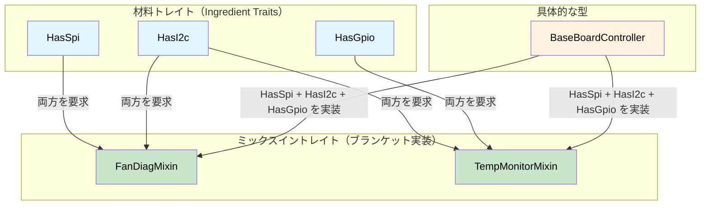

# 機能ミックスイン — コンパイル時ハードウェア契約 🟡

> **学修目標:** 材料トレイト（Ingredient Trait、バス機能）をミックスイントレイトおよびブランケット実装（Blanket Impl）と組み合わせることで、ハードウェアの依存関係がすべて満たされていることをコンパイル時に保証しながら、診断コードの重複を排除する方法を学びます。
>
> **関連章:** [第4章](ch04-capability-tokens-zero-cost-proof-of-aut.md)（機能トークン）、[第9章](ch09-phantom-types-for-resource-tracking.md)（Phantom型）、[第10章](ch10-putting-it-all-together-a-complete-diagn.md)（総合演習）

## 課題: 診断コードの重複

サーバープラットフォームでは、サブシステム間で診断パターンが共通しています。ファン診断、温度監視、電源シーケンス制御はすべて類似したワークフローをたどりますが、操作するハードウェアバスが異なります。適切な抽象化がないと、コピー＆ペーストの温床になります：

```c
// C — サブシステム間で重複したロジック
int run_fan_diag(spi_bus_t *spi, i2c_bus_t *i2c) {
    // ... 50行のSPIセンサー読み取り ...
    // ... 30行のI2Cレジスタチェック ...
    // ... 20行の閾値比較（CPU診断と同じ） ...
}

int run_cpu_temp_diag(i2c_bus_t *i2c, gpio_t *gpio) {
    // ... 30行のI2Cレジスタチェック（ファン診断と同じ） ...
    // ... 15行のGPIOアラートチェック ...
    // ... 20行の閾値比較（ファン診断と同じ） ...
}
```

閾値比較のロジックは同一ですが、バスの型が異なるため共通化して抽出することが困難です。機能ミックスイン（Capability Mixin）を使用すると、各ハードウェアバスが**材料トレイト（Ingredient Trait）**となり、適切な材料が揃ったときに診断の振る舞いが自動的に提供されます。

## 材料トレイト（ハードウェア機能）

各バスやペリフェラル（周辺機器）は、トレイト上の関連型として表現されます。診断コントローラは、自身がどのバスを保持しているかを宣言します：

```rust,ignore
/// SPIバス機能。
pub trait HasSpi {
    type Spi: SpiBus;
    fn spi(&self) -> &Self::Spi;
}

/// I2Cバス機能。
pub trait HasI2c {
    type I2c: I2cBus;
    fn i2c(&self) -> &Self::I2c;
}

/// GPIOピンアクセス機能。
pub trait HasGpio {
    type Gpio: GpioController;
    fn gpio(&self) -> &Self::Gpio;
}

/// IPMIアクセス機能。
pub trait HasIpmi {
    type Ipmi: IpmiClient;
    fn ipmi(&self) -> &Self::Ipmi;
}

// バストレイトの定義:
pub trait SpiBus {
    fn transfer(&self, data: &[u8]) -> Vec<u8>;
}

pub trait I2cBus {
    fn read_register(&self, addr: u8, reg: u8) -> u8;
    fn write_register(&self, addr: u8, reg: u8, value: u8);
}

pub trait GpioController {
    fn read_pin(&self, pin: u32) -> bool;
    fn set_pin(&self, pin: u32, value: bool);
}

pub trait IpmiClient {
    fn send_raw(&self, netfn: u8, cmd: u8, data: &[u8]) -> Vec<u8>;
}
```

## ミックスイントレイト（診断動作）

ミックスインは、要求される機能を備えたあらゆる型に対して、その振る舞いを**自動的**に提供します：

```rust,ignore
# pub trait SpiBus { fn transfer(&self, data: &[u8]) -> Vec<u8>; }
# pub trait I2cBus {
#     fn read_register(&self, addr: u8, reg: u8) -> u8;
#     fn write_register(&self, addr: u8, reg: u8, value: u8);
# }
# pub trait GpioController { fn read_pin(&self, pin: u32) -> bool; }
# pub trait IpmiClient { fn send_raw(&self, netfn: u8, cmd: u8, data: &[u8]) -> Vec<u8>; }
# pub trait HasSpi { type Spi: SpiBus; fn spi(&self) -> &Self::Spi; }
# pub trait HasI2c { type I2c: I2cBus; fn i2c(&self) -> &Self::I2c; }
# pub trait HasGpio { type Gpio: GpioController; fn gpio(&self) -> &Self::Gpio; }
# pub trait HasIpmi { type Ipmi: IpmiClient; fn ipmi(&self) -> &Self::Ipmi; }

/// ファン診断ミックスイン — SPI + I2C を持つあらゆる型に自動実装される。
pub trait FanDiagMixin: HasSpi + HasI2c {
    fn read_fan_speed(&self, fan_id: u8) -> u32 {
        // SPI経由でタコメータを読み取る
        let cmd = [0x80 | fan_id, 0x00];
        let response = self.spi().transfer(&cmd);
        u32::from_be_bytes([0, 0, response[0], response[1]])
    }

    fn set_fan_pwm(&self, fan_id: u8, duty_percent: u8) {
        // I2Cコントローラ経由でPWMを設定
        self.i2c().write_register(0x2E, fan_id, duty_percent);
    }

    fn run_fan_diagnostic(&self) -> bool {
        // 完全な診断: すべてのファンを読み取り、閾値をチェック
        for fan_id in 0..6 {
            let speed = self.read_fan_speed(fan_id);
            if speed < 1000 || speed > 20000 {
                println!("ファン {fan_id}: 失敗 ({speed} RPM)");
                return false;
            }
        }
        true
    }
}

// ブランケット実装（一括実装） — SPI + I2C を備えた「任意の」型が FanDiagMixin を無償で獲得する
impl<T: HasSpi + HasI2c> FanDiagMixin for T {}

/// 温度監視ミックスイン — I2C + GPIO を要求。
pub trait TempMonitorMixin: HasI2c + HasGpio {
    fn read_temperature(&self, sensor_addr: u8) -> f64 {
        let raw = self.i2c().read_register(sensor_addr, 0x00);
        raw as f64 * 0.5  // LSBあたり0.5°C
    }

    fn check_thermal_alert(&self, alert_pin: u32) -> bool {
        self.gpio().read_pin(alert_pin)
    }

    fn run_thermal_diagnostic(&self) -> bool {
        for addr in [0x48, 0x49, 0x4A] {
            let temp = self.read_temperature(addr);
            if temp > 95.0 {
                println!("センサー 0x{addr:02X}: 危機的 ({temp}°C)");
                return false;
            }
            if self.check_thermal_alert(addr as u32) {
                println!("センサー 0x{addr:02X}: ALERTピンがアサートされています");
                return false;
            }
        }
        true
    }
}

impl<T: HasI2c + HasGpio> TempMonitorMixin for T {}

/// 電源シーケンス制御ミックスイン — I2C + IPMI を要求。
pub trait PowerSeqMixin: HasI2c + HasIpmi {
    fn read_voltage_rail(&self, rail: u8) -> f64 {
        let raw = self.i2c().read_register(0x40, rail);
        raw as f64 * 0.01  // LSBあたり10mV
    }

    fn check_power_good(&self) -> bool {
        let resp = self.ipmi().send_raw(0x04, 0x2D, &[0x01]);
        !resp.is_empty() && resp[0] == 0x00
    }
}

impl<T: HasI2c + HasIpmi> PowerSeqMixin for T {}
```

## 具体的なコントローラ — 組み合わせと適合

具体的な診断コントローラは自身の機能を宣言するだけで、該当するすべてのミックスインを**自動的に継承**します：

```rust,ignore
# pub trait SpiBus { fn transfer(&self, data: &[u8]) -> Vec<u8>; }
# pub trait I2cBus {
#     fn read_register(&self, addr: u8, reg: u8) -> u8;
#     fn write_register(&self, addr: u8, reg: u8, value: u8);
# }
# pub trait GpioController { fn read_pin(&self, pin: u32) -> bool; }
# pub trait IpmiClient { fn send_raw(&self, netfn: u8, cmd: u8, data: &[u8]) -> Vec<u8>; }
# pub trait HasSpi { type Spi: SpiBus; fn spi(&self) -> &Self::Spi; }
# pub trait HasI2c { type I2c: I2cBus; fn i2c(&self) -> &Self::I2c; }
# pub trait HasGpio { type Gpio: GpioController; fn gpio(&self) -> &Self::Gpio; }
# pub trait HasIpmi { type Ipmi: IpmiClient; fn ipmi(&self) -> &Self::Ipmi; }
# pub trait FanDiagMixin: HasSpi + HasI2c {}
# impl<T: HasSpi + HasI2c> FanDiagMixin for T {}
# pub trait TempMonitorMixin: HasI2c + HasGpio {}
# impl<T: HasI2c + HasGpio> TempMonitorMixin for T {}
# pub trait PowerSeqMixin: HasI2c + HasIpmi {}
# impl<T: HasI2c + HasIpmi> PowerSeqMixin for T {}

// 具体的なバス実装（説明用スタブ）
pub struct LinuxSpi { bus: u8 }
impl SpiBus for LinuxSpi {
    fn transfer(&self, data: &[u8]) -> Vec<u8> { vec![0; data.len()] }
}

pub struct LinuxI2c { bus: u8 }
impl I2cBus for LinuxI2c {
    fn read_register(&self, _addr: u8, _reg: u8) -> u8 { 42 }
    fn write_register(&self, _addr: u8, _reg: u8, _value: u8) {}
}

pub struct LinuxGpio;
impl GpioController for LinuxGpio {
    fn read_pin(&self, _pin: u32) -> bool { false }
    fn set_pin(&self, _pin: u32, _value: bool) {}
}

pub struct IpmiToolClient;
impl IpmiClient for IpmiToolClient {
    fn send_raw(&self, _netfn: u8, _cmd: u8, _data: &[u8]) -> Vec<u8> { vec![0x00] }
}

/// BaseBoardController は「すべての」バスを保持 → 「すべての」ミックスインを獲得。
pub struct BaseBoardController {
    spi: LinuxSpi,
    i2c: LinuxI2c,
    gpio: LinuxGpio,
    ipmi: IpmiToolClient,
}

impl HasSpi for BaseBoardController {
    type Spi = LinuxSpi;
    fn spi(&self) -> &LinuxSpi { &self.spi }
}

impl HasI2c for BaseBoardController {
    type I2c = LinuxI2c;
    fn i2c(&self) -> &LinuxI2c { &self.i2c }
}

impl HasGpio for BaseBoardController {
    type Gpio = LinuxGpio;
    fn gpio(&self) -> &LinuxGpio { &self.gpio }
}

impl HasIpmi for BaseBoardController {
    type Ipmi = IpmiToolClient;
    fn ipmi(&self) -> &IpmiToolClient { &self.ipmi }
}

// BaseBoardController は自動的に以下を獲得する:
// - FanDiagMixin    (HasSpi + HasI2c を実装しているため)
// - TempMonitorMixin (HasI2c + HasGpio を実装しているため)
// - PowerSeqMixin   (HasI2c + HasIpmi を実装しているため)
// 手動での実装は一切不要 — ブランケット実装がすべてを行う。
```

## 正しさを構造によって担保する側面

ミックスインパターンが「構造によって正しさを担保（correct-by-construction）」できるのは、以下の理由からです：

1. **SPIなしに `read_fan_speed()` を呼び出すことはできない** — このメソッドは `HasSpi + HasI2c` を実装した型にしか存在しません。
2. **バスの考慮漏れが発生しない** — `BaseBoardController` から `HasSpi` を削除すると、`FanDiagMixin` の各メソッドはコンパイル時に消失します。
3. **モックテストが極めて容易** — `LinuxSpi` を `MockSpi` に差し替えるだけで、すべてのミックスインロジックがモックに対してそのまま動作します。
4. **新しいプラットフォームでは機能を宣言するだけ** — I2Cしか持たないGPUドーターカードは、（GPIOも持っていれば）`TempMonitorMixin` は獲得しますが、`FanDiagMixin`（SPIがないため）は獲得しません。

### いつ機能ミックスインを使用すべきか

| シナリオ | ミックスインを使うべきか？ |
|----------|:------:|
| 横断的な診断の振る舞い | ✅ 使う — コピー＆ペーストを防止 |
| 複数バスを扱うハードウェアコントローラ | ✅ 使う — 機能を宣言して振る舞いを獲得 |
| プラットフォーム固有のテストハーネス | ✅ 使う — テスト用に機能をモック化 |
| 単一バスの単純な周辺機器 | ⚠️ オーバーヘッドに見合わない可能性あり |
| 純粋なビジネスロジック（ハードウェアなし） | ❌ よりシンプルなパターンで十分 |

## ミックスイントレイトのアーキテクチャ



## 演習問題: ネットワーク診断ミックスイン

ネットワーク診断用のミックスインシステムを設計してください：
- 材料トレイト: `HasEthernet`, `HasIpmi`
- ミックスイン: `check_link_status(&self)` を持つ `LinkHealthMixin`（`HasEthernet` を要求）
- ミックスイン: `remote_health_check(&self)` を持つ `RemoteDiagMixin`（`HasEthernet + HasIpmi` を要求）
- 具体的な型: 両方の材料を実装した `NicController`。

<details>
<summary>解答例</summary>

```rust,ignore
pub trait HasEthernet {
    fn eth_link_up(&self) -> bool;
}

pub trait HasIpmi {
    fn ipmi_ping(&self) -> bool;
}

pub trait LinkHealthMixin: HasEthernet {
    fn check_link_status(&self) -> &'static str {
        if self.eth_link_up() { "link: UP" } else { "link: DOWN" }
    }
}
impl<T: HasEthernet> LinkHealthMixin for T {}

pub trait RemoteDiagMixin: HasEthernet + HasIpmi {
    fn remote_health_check(&self) -> &'static str {
        if self.eth_link_up() && self.ipmi_ping() {
            "remote: HEALTHY"
        } else {
            "remote: DEGRADED"
        }
    }
}
impl<T: HasEthernet + HasIpmi> RemoteDiagMixin for T {}

pub struct NicController;
impl HasEthernet for NicController {
    fn eth_link_up(&self) -> bool { true }
}
impl HasIpmi for NicController {
    fn ipmi_ping(&self) -> bool { true }
}
// NicController は自動的に両方のミックスインメソッドを獲得する
```

</details>

## 重要なポイント

1. **材料トレイトがハードウェア機能を宣言する** — `HasSpi`、`HasI2c`、`HasGpio` は関連型を持つトレイトです。
2. **ミックスイントレイトがブランケット実装を通じて振る舞いを提供する** — `impl<T: HasSpi + HasI2c> FanDiagMixin for T {}`。
3. **新しいプラットフォームの追加 = 保持する機能の列挙** — 条件に一致するすべてのミックスインメソッドがコンパイラから提供されます。
4. **バスの削除 = そのバスを使用する箇所すべてでコンパイルエラー** — 下流コードの修正を失念することはあり得ません。
5. **モックテストが無償で手に入る** — `LinuxSpi` を `MockSpi` に差し替えるだけで、すべてのミックスインロジックを変更なしでテストできます。

---
