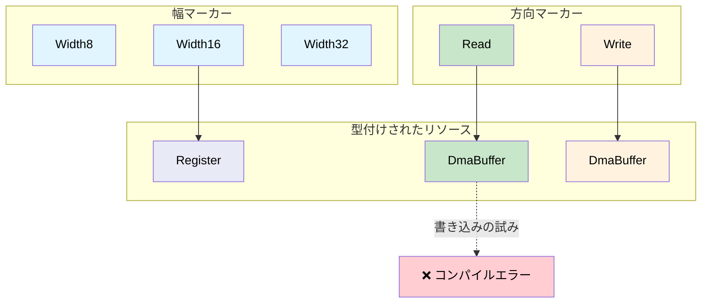

# リソース追跡のためのPhantom型 🟡

> **学修目標:** `PhantomData` マーカーを使用してレジスタ幅、DMA転送方向、ファイルディスクリプタの状態を型レベルでエンコードし、実行時コストゼロでリソース不一致によるバグを根絶する方法を学びます。
>
> **関連章:** [第5章](ch05-protocol-state-machines-type-state-for-r.md)（型状態）、[第6章](ch06-dimensional-analysis-making-the-compiler.md)（次元型）、[第8章](ch08-capability-mixins-compile-time-hardware-.md)（ミックスイン）、[第10章](ch10-putting-it-all-together-a-complete-diagn.md)（総合演習）

## 課題: リソースの取り違え

ハードウェアリソースはコード上では似たように見えますが、相互に互換性があるわけではありません：

- 32ビットレジスタと16ビットレジスタは、どちらも単なる「レジスタ」に見える
- 読み込み用DMAバッファと書き込み用DMAバッファは、どちらも `*mut u8` に見える
- オープン状態のファイルディスクリプタとクローズ済みのそれは、どちらも `i32` に見える

C言語では次のようになります：

```c
// C — すべてのレジスタが同じに見える
uint32_t read_reg32(volatile void *base, uint32_t offset);
uint16_t read_reg16(volatile void *base, uint32_t offset);

// バグ: 16ビットレジスタを32ビット関数で読み取ってしまう
uint32_t status = read_reg32(pcie_bar, LINK_STATUS_REG);  // 本来は reg16 であるべき！
```

## Phantom型パラメータ

**Phantom型（幽霊型）**とは、構造体の定義に現れるものの、どのフィールドでも値として使用されない型パラメータのことです。純粋に型レベルの情報を保持するために存在します：

```rust,ignore
use std::marker::PhantomData;

// レジスタ幅マーカー — サイズゼロ
pub struct Width8;
pub struct Width16;
pub struct Width32;
pub struct Width64;

/// レジスタ幅によってパラメタライズされたレジスタハンドル。
/// PhantomData<W> のサイズは0バイト — コンパイル時のみのマーカー。
pub struct Register<W> {
    base: usize,
    offset: usize,
    _width: PhantomData<W>,
}

impl Register<Width8> {
    pub fn read(&self) -> u8 {
        // ... base + offset から1バイト読み取る ...
        0 // スタブ
    }
    pub fn write(&self, _value: u8) {
        // ... 1バイト書き込む ...
    }
}

impl Register<Width16> {
    pub fn read(&self) -> u16 {
        // ... base + offset から2バイト読み取る ...
        0 // スタブ
    }
    pub fn write(&self, _value: u16) {
        // ... 2バイト書き込む ...
    }
}

impl Register<Width32> {
    pub fn read(&self) -> u32 {
        // ... base + offset から4バイト読み取る ...
        0 // スタブ
    }
    pub fn write(&self, _value: u32) {
        // ... 4バイト書き込む ...
    }
}

/// PCIeコンフィグレーション空間のレジスタ定義。
pub struct PcieConfig {
    base: usize,
}

impl PcieConfig {
    pub fn vendor_id(&self) -> Register<Width16> {
        Register { base: self.base, offset: 0x00, _width: PhantomData }
    }

    pub fn device_id(&self) -> Register<Width16> {
        Register { base: self.base, offset: 0x02, _width: PhantomData }
    }

    pub fn command(&self) -> Register<Width16> {
        Register { base: self.base, offset: 0x04, _width: PhantomData }
    }

    pub fn status(&self) -> Register<Width16> {
        Register { base: self.base, offset: 0x06, _width: PhantomData }
    }

    pub fn bar0(&self) -> Register<Width32> {
        Register { base: self.base, offset: 0x10, _width: PhantomData }
    }
}

fn pcie_example() {
    let cfg = PcieConfig { base: 0xFE00_0000 };

    let vid: u16 = cfg.vendor_id().read();    // u16 を返す ✅
    let bar: u32 = cfg.bar0().read();         // u32 を返す ✅

    // 混同することはできない:
    // let bad: u32 = cfg.vendor_id().read(); // ❌ エラー: u16 が期待される
    // cfg.bar0().write(0u16);                // ❌ エラー: u32 が期待される
}
```

## DMAバッファのアクセス制御

DMAバッファには転送方向が存在します。**デバイスからホストへ**（読み取り）のものもあれば、**ホストからデバイスへ**（書き込み）のものもあります。誤った方向で使用すると、データが破損したりバスエラーが発生したりします：

```rust,ignore
use std::marker::PhantomData;

// 方向マーカー
pub struct ToDevice;     // ホストが書き込み、デバイスが読み取る
pub struct FromDevice;   // デバイスが書き込み、ホストが読み取る

/// 転送方向が強制されたDMAバッファ。
pub struct DmaBuffer<Dir> {
    ptr: *mut u8,
    len: usize,
    dma_addr: u64,  // デバイス用の物理アドレス
    _dir: PhantomData<Dir>,
}

impl DmaBuffer<ToDevice> {
    /// デバイスに送信するデータをバッファに書き込む。
    pub fn write_data(&mut self, data: &[u8]) {
        assert!(data.len() <= self.len);
        // SAFETY: ptr は self.len バイトに対して有効であり（構築時に割り当て済み）、
        // data.len() <= self.len である（上記のアサートで確認済み）。
        unsafe { std::ptr::copy_nonoverlapping(data.as_ptr(), self.ptr, data.len()) }
    }

    /// デバイスが読み取るためのDMAアドレスを取得。
    pub fn device_addr(&self) -> u64 {
        self.dma_addr
    }
}

impl DmaBuffer<FromDevice> {
    /// デバイスがバッファに書き込んだデータを読み取る。
    pub fn read_data(&self) -> &[u8] {
        // SAFETY: ptr は self.len バイトに対して有効であり、
        // デバイスの書き込みが完了している（呼び出し元がDMA転送完了を保証）。
        unsafe { std::slice::from_raw_parts(self.ptr, self.len) }
    }

    /// デバイスが書き込むためのDMAアドレスを取得。
    pub fn device_addr(&self) -> u64 {
        self.dma_addr
    }
}

// FromDevice バッファへの書き込みは不可:
// fn oops(buf: &mut DmaBuffer<FromDevice>) {
//     buf.write_data(&[1, 2, 3]);  // ❌ DmaBuffer<FromDevice> に `write_data` メソッドは存在しない
// }

// ToDevice バッファからの読み取りは不可:
// fn oops2(buf: &DmaBuffer<ToDevice>) {
//     let data = buf.read_data();  // ❌ DmaBuffer<ToDevice> に `read_data` メソッドは存在しない
// }
```

## ファイルディスクリプタの所有権

よくあるバグとして、クローズされた後のファイルディスクリプタを使用してしまう（use-after-close）問題があります。Phantom型を使用すれば、オープン/クローズ状態を追跡できます：

```rust,ignore
use std::marker::PhantomData;

pub struct Open;
pub struct Closed;

/// 状態追跡機能付きファイルディスクリプタ。
pub struct Fd<State> {
    raw: i32,
    _state: PhantomData<State>,
}

impl Fd<Open> {
    pub fn open(path: &str) -> Result<Self, String> {
        // ... ファイルをオープン ...
        Ok(Fd { raw: 3, _state: PhantomData }) // スタブ
    }

    pub fn read(&self, buf: &mut [u8]) -> Result<usize, String> {
        // ... fd から読み取り ...
        Ok(0) // スタブ
    }

    pub fn write(&self, data: &[u8]) -> Result<usize, String> {
        // ... fd に書き込み ...
        Ok(data.len()) // スタブ
    }

    /// fd をクローズ — Closed ハンドルを返す。
    /// Open ハンドルが消費されるため、クローズ後の使用（use-after-close）が防止される。
    pub fn close(self) -> Fd<Closed> {
        // ... fd をクローズ ...
        Fd { raw: self.raw, _state: PhantomData }
    }
}

impl Fd<Closed> {
    // read() や write() メソッドは存在しない — Fd<Closed> には定義されていない。
    // これにより、クローズ後の使用がコンパイルエラーになる。

    pub fn raw_fd(&self) -> i32 {
        self.raw
    }
}

fn fd_example() -> Result<(), String> {
    let fd = Fd::open("/dev/ipmi0")?;
    let mut buf = [0u8; 256];
    fd.read(&mut buf)?;

    let closed = fd.close();

    // closed.read(&mut buf)?;  // ❌ Fd<Closed> に `read` メソッドは存在しない
    // closed.write(&[1])?;     // ❌ Fd<Closed> に `write` メソッドは存在しない

    Ok(())
}
```

## Phantom型とこれまでのパターンの結合

Phantom型は、これまでに学んだすべてのパターンと組み合わせることができます：

```rust,ignore
# use std::marker::PhantomData;
# pub struct Width32;
# pub struct Width16;
# pub struct Register<W> { _w: PhantomData<W> }
# impl Register<Width16> { pub fn read(&self) -> u16 { 0 } }
# impl Register<Width32> { pub fn read(&self) -> u32 { 0 } }
# #[derive(Debug, Clone, Copy, PartialEq, PartialOrd)]
# pub struct Celsius(pub f64);

/// Phantom型（レジスタ幅）と次元型（Celsius）の結合。
fn read_temp_sensor(reg: &Register<Width16>) -> Celsius {
    let raw = reg.read();  // Phantom型により u16 であることが保証される
    Celsius(raw as f64 * 0.0625)  // 戻り値の型により Celsius であることが保証される
}

// コンパイラが以下を強制する:
// 1. レジスタが16ビットであること（Phantom型）
// 2. 結果が Celsius であること（ニュータイプ）
// どちらも実行時コストはゼロ。
```

### いつPhantom型を使用すべきか

| シナリオ | Phantom型パラメータを使うべきか？ |
|----------|:------:|
| レジスタ幅のエンコード | ✅ 常に使用 — 幅の不一致を防止 |
| DMAバッファの転送方向 | ✅ 常に使用 — データ破損を防止 |
| ファイルディスクリプタの状態 | ✅ 常に使用 — クローズ後の使用を防止 |
| メモリ領域のパーミッション（R/W/X） | ✅ 常に使用 — アクセス制御を強制 |
| 汎用コンテナ（Vec, HashMap） | ❌ 不要 — 具体的な型パラメータを使用 |
| 実行時に変化する属性 | ❌ 不適 — Phantom型はコンパイル時専用 |

## Phantom型のリソースマトリクス



## 演習問題: メモリ領域パーミッション

読み取り、書き込み、実行のパーミッションを持つメモリ領域用のPhantom型を設計してください：
- `MemRegion<ReadOnly>` は `fn read(&self, offset: usize) -> u8` を持つ
- `MemRegion<ReadWrite>` は `read` と `write` の両方を持つ
- `MemRegion<Executable>` は `read` と `fn execute(&self)` を持つ
- `ReadOnly` への書き込みや、`ReadWrite` の実行はコンパイルできないようにする。

<details>
<summary>解答例</summary>

```rust,ignore
use std::marker::PhantomData;

pub struct ReadOnly;
pub struct ReadWrite;
pub struct Executable;

pub struct MemRegion<Perm> {
    base: *mut u8,
    len: usize,
    _perm: PhantomData<Perm>,
}

// すべてのパーミッション型で read が利用可能
impl<P> MemRegion<P> {
    pub fn read(&self, offset: usize) -> u8 {
        assert!(offset < self.len);
        // SAFETY: offset < self.len（上記アサート）、base は len バイトに対して有効。
        unsafe { *self.base.add(offset) }
    }
}

impl MemRegion<ReadWrite> {
    pub fn write(&mut self, offset: usize, val: u8) {
        assert!(offset < self.len);
        // SAFETY: offset < self.len（上記アサート）、base は len バイトに対して有効、
        // かつ &mut self により排他アクセスが保証される。
        unsafe { *self.base.add(offset) = val; }
    }
}

impl MemRegion<Executable> {
    pub fn execute(&self) {
        // ベースアドレスにジャンプ（概念コード）
    }
}

// ❌ region_ro.write(0, 0xFF);  // コンパイルエラー: `write` メソッドが存在しない
// ❌ region_rw.execute();       // コンパイルエラー: `execute` メソッドが存在しない
```

</details>

## 重要なポイント

1. **PhantomData はサイズゼロで型レベルの情報を保持する** — マーカーはコンパイラのためだけに存在します。
2. **レジスタ幅の不一致がコンパイルエラーになる** — `Register<Width16>` は `u32` ではなく `u16` を返します。
3. **DMAの転送方向が構造的に強制される** — `DmaBuffer<Read>` には `write()` メソッドが存在しません。
4. **次元型（[第6章](ch06-dimensional-analysis-making-the-compiler.md)）と組み合わせる** — `Register<Width16>` はパース工程を経由して `Celsius` を返すことができます。
5. **Phantom型はコンパイル時限定** — 実行時に変化する属性には機能しないため、そうした用途には列挙型を使用してください。

---
