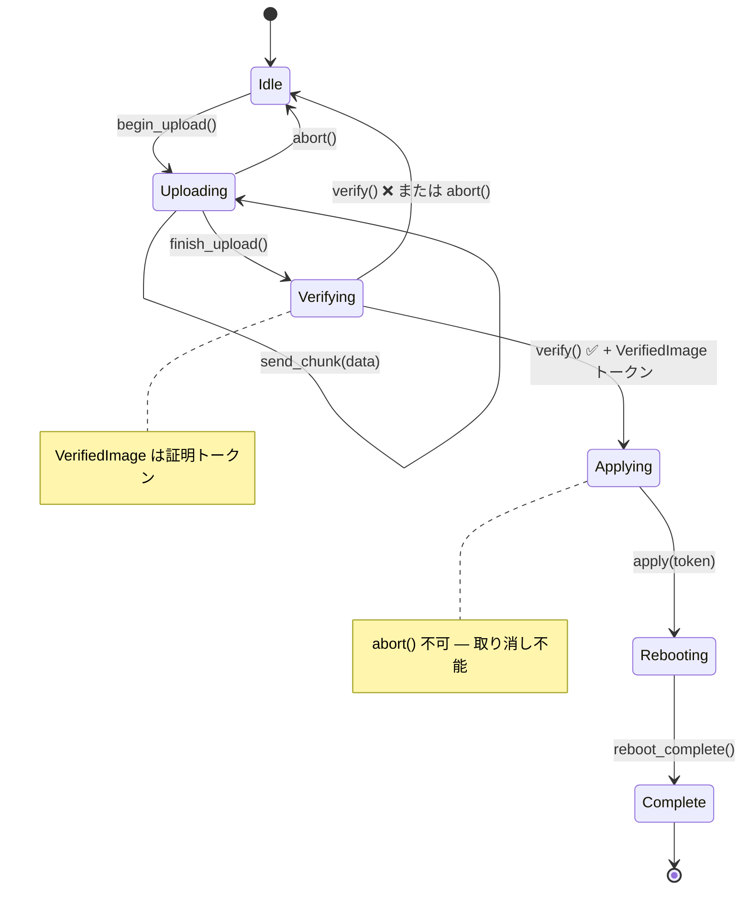

# 演習問題 🟡

> **学べること:** 構造的に正しくするパターンを、実践的なハードウェアシナリオ — NVMe管理コマンド、ファームウェア更新の状態機械、センサーパイプライン、PCIe幽霊型、マルチプロトコル健全性チェック、セッション型の診断プロトコル — に適用するハンズオン練習。
>
> **相互参照:** [第2章](ch02-typed-command-interfaces-request-determi.md)（演習1）、[第5章](ch05-protocol-state-machines-type-state-for-r.md)（演習2）、[第6章](ch06-dimensional-analysis-making-the-compiler.md)（演習3）、[第9章](ch09-phantom-types-for-resource-tracking.md)（演習4）、[第10章](ch10-putting-it-all-together-a-complete-diagn.md)（演習5）

## 練習問題

### 演習1: NVMe管理コマンド（型付きコマンド）

NVMe管理コマンドに対する型付きコマンドインターフェースを設計してください：

- `Identify` → `IdentifyResponse`（モデル番号、シリアル番号、ファームウェアリビジョン）
- `GetLogPage` → `SmartLog`（温度、使用可能な予備領域、読み取りデータユニット数）
- `GetFeature` → 機能固有のレスポンス

要件：
1. コマンド型によってレスポンス型が一意に決定されること
2. ランタイムディスパッチを行わず、静的ディスパッチのみを使用すること
3. 名前空間IDが他の `u32` と混同されるのを防ぐ `NamespaceId` ニュータイプを追加すること

**ヒント:** 第2章の `IpmiCmd` トレイトパターンに従い、NVMe固有の定数を使用してください。

<details>
<summary>解答例（演習1）</summary>

```rust,ignore
use std::io;

#[derive(Debug, Clone, Copy, PartialEq, Eq, PartialOrd, Ord, Hash)]
pub struct NamespaceId(pub u32);

#[derive(Debug, Clone, PartialEq)]
pub struct IdentifyResponse {
    pub model: String,
    pub serial: String,
    pub firmware_rev: String,
}

#[derive(Debug, Clone, PartialEq)]
pub struct SmartLog {
    pub temperature_kelvin: u16,
    pub available_spare_pct: u8,
    pub data_units_read: u64,
}

#[derive(Debug, Clone, PartialEq)]
pub struct ArbitrationFeature {
    pub high_priority_weight: u8,
    pub medium_priority_weight: u8,
    pub low_priority_weight: u8,
}

/// コアパターン: 関連型によって各コマンドのレスポンスを固定する。
pub trait NvmeAdminCmd {
    type Response;
    fn opcode(&self) -> u8;
    fn nsid(&self) -> Option<NamespaceId>;
    fn parse_response(&self, raw: &[u8]) -> io::Result<Self::Response>;
}

pub struct Identify { pub nsid: NamespaceId }

impl NvmeAdminCmd for Identify {
    type Response = IdentifyResponse;
    fn opcode(&self) -> u8 { 0x06 }
    fn nsid(&self) -> Option<NamespaceId> { Some(self.nsid) }
    fn parse_response(&self, raw: &[u8]) -> io::Result<IdentifyResponse> {
        if raw.len() < 12 {
            return Err(io::Error::new(io::ErrorKind::InvalidData, "too short"));
        }
        Ok(IdentifyResponse {
            model: String::from_utf8_lossy(&raw[0..4]).trim().to_string(),
            serial: String::from_utf8_lossy(&raw[4..8]).trim().to_string(),
            firmware_rev: String::from_utf8_lossy(&raw[8..12]).trim().to_string(),
        })
    }
}

pub struct GetLogPage { pub log_id: u8 }

impl NvmeAdminCmd for GetLogPage {
    type Response = SmartLog;
    fn opcode(&self) -> u8 { 0x02 }
    fn nsid(&self) -> Option<NamespaceId> { None }
    fn parse_response(&self, raw: &[u8]) -> io::Result<SmartLog> {
        if raw.len() < 11 {
            return Err(io::Error::new(io::ErrorKind::InvalidData, "too short"));
        }
        Ok(SmartLog {
            temperature_kelvin: u16::from_le_bytes([raw[0], raw[1]]),
            available_spare_pct: raw[2],
            data_units_read: u64::from_le_bytes(raw[3..11].try_into().unwrap()),
        })
    }
}

pub struct GetFeature { pub feature_id: u8 }

impl NvmeAdminCmd for GetFeature {
    type Response = ArbitrationFeature;
    fn opcode(&self) -> u8 { 0x0A }
    fn nsid(&self) -> Option<NamespaceId> { None }
    fn parse_response(&self, raw: &[u8]) -> io::Result<ArbitrationFeature> {
        if raw.len() < 3 {
            return Err(io::Error::new(io::ErrorKind::InvalidData, "too short"));
        }
        Ok(ArbitrationFeature {
            high_priority_weight: raw[0],
            medium_priority_weight: raw[1],
            low_priority_weight: raw[2],
        })
    }
}

/// 静的ディスパッチ — コンパイラがコマンド型ごとに単相化する。
pub struct NvmeController;

impl NvmeController {
    pub fn execute<C: NvmeAdminCmd>(&self, cmd: &C) -> io::Result<C::Response> {
        // cmd.opcode()/cmd.nsid() から SQE を構築し、
        // SQ に投入して CQ を待機したのち:
        let raw = self.submit_and_read(cmd.opcode())?;
        cmd.parse_response(&raw)
    }

    fn submit_and_read(&self, _opcode: u8) -> io::Result<Vec<u8>> {
        // 実際の実装では /dev/nvme0 と通信する
        Ok(vec![0; 512])
    }
}
```

**重要ポイント:**
- `NamespaceId(u32)` により、名前空間IDと任意の `u32` 値の混同を防止します。
- `NvmeAdminCmd::Response` が「型のインデックス」として機能し、`execute()` は正確に `C::Response` を返します。
- 完全な静的ディスパッチ: `Box<dyn …>` や実行時のダウンキャストは不要です。

</details>

### 演習2: ファームウェア更新の状態機械（型状態）

BMCファームウェア更新のライフサイクルをモデル化してください：



要件：
1. 各状態が個別の型であること
2. アップロードは Idle からのみ開始できること
3. 検証（Verification）はアップロードが完了していることを要求すること
4. 適用（Apply）は検証に成功した後にのみ実行可能であること — `VerifiedImage` 証明トークンを受け取ること
5. 適用後に可能な操作は再起動のみであること
6. Uploading および Verifying で利用可能な `abort()` メソッドを追加すること（ただし Applying では手遅れのため利用不可とすること）

**ヒント:** 型状態（第5章）とケイパビリティトークン（第4章）を組み合わせてください。

<details>
<summary>解答例（演習2）</summary>

```rust,ignore
// --- 状態の型 ---
// 設計上の選択: ここでは第5章のアプローチ（PhantomData<S>）ではなく、
// 状態をインライン（_state: S）で保持しています。これにより、
// 状態が進捗状況を追跡する（例: Uploading { bytes_sent: usize }）などのデータを持てるようになります。
// 状態が純粋なマーカー（ゼロサイズ）の場合は PhantomData を使用し、
// 状態が意味のあるランタイムデータを運ぶ場合はインライン保持を使用します。
pub struct Idle;
pub struct Uploading { bytes_sent: usize }  // ZST ではない — 進捗データを保持
pub struct Verifying;
pub struct Applying;
pub struct Rebooting;
pub struct Complete;

/// 証明トークン: verify() の内部でのみ構築可能。
pub struct VerifiedImage { _private: () }

pub struct FwUpdate<S> {
    bmc_addr: String,
    _state: S,
}

impl FwUpdate<Idle> {
    pub fn new(bmc_addr: &str) -> Self {
        FwUpdate { bmc_addr: bmc_addr.to_string(), _state: Idle }
    }
    pub fn begin_upload(self) -> FwUpdate<Uploading> {
        FwUpdate { bmc_addr: self.bmc_addr, _state: Uploading { bytes_sent: 0 } }
    }
}

impl FwUpdate<Uploading> {
    pub fn send_chunk(mut self, chunk: &[u8]) -> Self {
        self._state.bytes_sent += chunk.len();
        self
    }
    pub fn finish_upload(self) -> FwUpdate<Verifying> {
        FwUpdate { bmc_addr: self.bmc_addr, _state: Verifying }
    }
    /// アップロード中に利用可能な中断 — Idle に戻る。
    pub fn abort(self) -> FwUpdate<Idle> {
        FwUpdate { bmc_addr: self.bmc_addr, _state: Idle }
    }
}

impl FwUpdate<Verifying> {
    /// 成功時に次の状態と VerifiedImage 証明トークンを返す。
    pub fn verify(self) -> Result<(FwUpdate<Applying>, VerifiedImage), FwUpdate<Idle>> {
        // 実際には: CRC、署名、互換性をチェック
        let token = VerifiedImage { _private: () };
        Ok((
            FwUpdate { bmc_addr: self.bmc_addr, _state: Applying },
            token,
        ))
    }
    /// 検証中に利用可能な中断。
    pub fn abort(self) -> FwUpdate<Idle> {
        FwUpdate { bmc_addr: self.bmc_addr, _state: Idle }
    }
}

impl FwUpdate<Applying> {
    /// VerifiedImage 証明を消費する — 検証なしに適用することはできない。
    /// 注意: ここには abort() メソッドは存在しない — いったん書き込みが始まったら危険すぎるため。
    pub fn apply(self, _proof: VerifiedImage) -> FwUpdate<Rebooting> {
        FwUpdate { bmc_addr: self.bmc_addr, _state: Rebooting }
    }
}

impl FwUpdate<Rebooting> {
    pub fn wait_for_reboot(self) -> FwUpdate<Complete> {
        FwUpdate { bmc_addr: self.bmc_addr, _state: Complete }
    }
}

impl FwUpdate<Complete> {
    pub fn version(&self) -> &str { "2.1.0" }
}

// 使い方:
// let fw = FwUpdate::new("192.168.1.100")
//     .begin_upload()
//     .send_chunk(b"image_data")
//     .finish_upload();
// let (fw, proof) = fw.verify().map_err(|_| "verify failed")?;
// let fw = fw.apply(proof).wait_for_reboot();
// println!("New version: {}", fw.version());
```

**重要ポイント:**
- `abort()` は `FwUpdate<Uploading>` と `FwUpdate<Verifying>` にのみ存在します — `FwUpdate<Applying>` で呼び出そうとすると、ランタイムチェックではなく**コンパイルエラー**になります。
- `VerifiedImage` は非公開フィールドを持つため、`verify()` だけがこれを作成できます。
- `apply()` は証明トークンを消費します — 検証をスキップすることはできません。

</details>

### 演習3: センサー読み取りパイプライン（次元解析）

完全なセンサーパイプラインを構築してください：

1. ニュータイプを定義する: `RawAdc`, `Celsius`, `Fahrenheit`, `Volts`, `Millivolts`, `Watts`
2. `From<Celsius> for Fahrenheit` およびその逆を実装する
3. `impl Mul<Volts, Output=Watts> for Amperes` を作成する（P = V × I）
4. ジェネリックなしきい値チェッカー `Threshold<T>` を構築する
5. パイプラインを作成する: ADC → キャリブレーション → しきい値チェック → 結果

コンパイラは以下を拒否しなければなりません：`Celsius` と `Volts` の比較、`Watts` と `Rpm` の加算、`Volts` が要求される場所への `Millivolts` の受け渡し。

<details>
<summary>解答例（演習3）</summary>

```rust,ignore
use std::ops::{Add, Sub, Mul};

#[derive(Debug, Clone, Copy, PartialEq, PartialOrd)]
pub struct RawAdc(pub u16);

#[derive(Debug, Clone, Copy, PartialEq, PartialOrd)]
pub struct Celsius(pub f64);

#[derive(Debug, Clone, Copy, PartialEq, PartialOrd)]
pub struct Fahrenheit(pub f64);

#[derive(Debug, Clone, Copy, PartialEq, PartialOrd)]
pub struct Volts(pub f64);

#[derive(Debug, Clone, Copy, PartialEq, PartialOrd)]
pub struct Millivolts(pub f64);

#[derive(Debug, Clone, Copy, PartialEq, PartialOrd)]
pub struct Amperes(pub f64);

#[derive(Debug, Clone, Copy, PartialEq, PartialOrd)]
pub struct Watts(pub f64);

// --- 安全な変換 ---
impl From<Celsius> for Fahrenheit {
    fn from(c: Celsius) -> Self { Fahrenheit(c.0 * 9.0 / 5.0 + 32.0) }
}
impl From<Fahrenheit> for Celsius {
    fn from(f: Fahrenheit) -> Self { Celsius((f.0 - 32.0) * 5.0 / 9.0) }
}
impl From<Millivolts> for Volts {
    fn from(mv: Millivolts) -> Self { Volts(mv.0 / 1000.0) }
}
impl From<Volts> for Millivolts {
    fn from(v: Volts) -> Self { Millivolts(v.0 * 1000.0) }
}

// --- 同一単位の型どうしの算術演算 ---
// 注意: 絶対温度の加算（25°C + 30°C）は物理的に疑問符がつきます — より厳密なアプローチについては
// 第6章の ΔT ニュータイプの議論を参照してください。ここでは演習のためにシンプルにしています。
impl Add for Celsius {
    type Output = Celsius;
    fn add(self, rhs: Self) -> Celsius { Celsius(self.0 + rhs.0) }
}
impl Sub for Celsius {
    type Output = Celsius;
    fn sub(self, rhs: Self) -> Celsius { Celsius(self.0 - rhs.0) }
}

// P = V × I  (異なる単位どうしの乗算)
impl Mul<Amperes> for Volts {
    type Output = Watts;
    fn mul(self, rhs: Amperes) -> Watts { Watts(self.0 * rhs.0) }
}

// --- ジェネリックなしきい値チェッカー ---
// 演習3では、第6章の Threshold を、トリガーとなった読み取り値を運ぶジェネリックな
// ThresholdResult<T> で拡張しています — これは第6章のより単純な ThresholdResult { Normal, Warning, Critical } 列挙型の発展形です。
pub enum ThresholdResult<T> {
    Normal(T),
    Warning(T),
    Critical(T),
}

pub struct Threshold<T> {
    pub warning: T,
    pub critical: T,
}

// ジェネリック実装 — PartialOrd をサポートする任意の単位型で動作する。
impl<T: PartialOrd + Copy> Threshold<T> {
    pub fn check(&self, reading: T) -> ThresholdResult<T> {
        if reading >= self.critical {
            ThresholdResult::Critical(reading)
        } else if reading >= self.warning {
            ThresholdResult::Warning(reading)
        } else {
            ThresholdResult::Normal(reading)
        }
    }
}
// これで `Threshold<Rpm>`, `Threshold<Volts>` などがすべて自動的に機能する。

// --- パイプライン: ADC → キャリブレーション → しきい値 → 結果 ---
pub struct CalibrationParams {
    pub scale: f64,  // °C あたりの ADC カウント
    pub offset: f64, // ADC が 0 のときの °C
}

pub fn calibrate(raw: RawAdc, params: &CalibrationParams) -> Celsius {
    Celsius(raw.0 as f64 / params.scale + params.offset)
}

pub fn sensor_pipeline(
    raw: RawAdc,
    params: &CalibrationParams,
    threshold: &Threshold<Celsius>,
) -> ThresholdResult<Celsius> {
    let temp = calibrate(raw, params);
    threshold.check(temp)
}

// コンパイル時の安全性 — これらはコンパイル「できない」:
// let _ = Celsius(25.0) + Volts(12.0);   // エラー: 型が一致しない
// let _: Millivolts = Volts(1.0);         // エラー: 暗黙の型変換はない
// let _ = Watts(100.0) + Rpm(3000);       // エラー: 型が一致しない
```

**重要ポイント:**
- 各物理単位は個別の型であり、偶発的な混同は起こり得ません。
- `Mul<Amperes> for Volts` は `Watts` を生成し、P = V × I を型システムにエンコードします。
- 関連する単位間（mV ↔ V、°C ↔ °F）には明示的な `From` 変換を用意します。
- `Threshold<Celsius>` は `Celsius` のみを受け入れます — 誤って RPM のしきい値チェックを行うことはできません。

</details>

### 演習4: PCIeケイパビリティ走査（幽霊型 + 境界でのバリデーション）

PCIeケイパビリティの連結リストをモデル化してください：

1. `RawCapability` — コンフィグ空間からの未検証バイト列
2. `ValidCapability` — （TryFrom経由で）パースおよびバリデーション済み
3. 各ケイパビリティ型（MSI, MSI-X, PCIe Express, Power Management）が独自の幽霊型レジスタレイアウトを持つこと
4. リストの走査により `ValidCapability` 値のイテレータが返されること

**ヒント:** 境界でのバリデーション（第7章）と幽霊型（第9章）を組み合わせてください。

<details>
<summary>解答例（演習4）</summary>

```rust,ignore
use std::marker::PhantomData;

// --- ケイパビリティ型用の幽霊マーカー ---
pub struct Msi;
pub struct MsiX;
pub struct PciExpress;
pub struct PowerMgmt;

// 仕様書で定義されている PCI ケイパビリティ ID
const CAP_ID_PM:   u8 = 0x01;
const CAP_ID_MSI:  u8 = 0x05;
const CAP_ID_PCIE: u8 = 0x10;
const CAP_ID_MSIX: u8 = 0x11;

/// 未検証のバイト列 — ゴミデータである可能性がある。
#[derive(Debug)]
pub struct RawCapability {
    pub id: u8,
    pub next_ptr: u8,
    pub data: Vec<u8>,
}

/// バリデーション済みかつ型タグ付けされたケイパビリティ。
#[derive(Debug)]
pub struct ValidCapability<Kind> {
    id: u8,
    next_ptr: u8,
    data: Vec<u8>,
    _kind: PhantomData<Kind>,
}

// --- TryFrom: 「バリデーションではなくパースする」境界 ---
impl TryFrom<RawCapability> for ValidCapability<PowerMgmt> {
    type Error = &'static str;
    fn try_from(raw: RawCapability) -> Result<Self, Self::Error> {
        if raw.id != CAP_ID_PM { return Err("not a PM capability"); }
        if raw.data.len() < 2 { return Err("PM data too short"); }
        Ok(ValidCapability {
            id: raw.id, next_ptr: raw.next_ptr,
            data: raw.data, _kind: PhantomData,
        })
    }
}

impl TryFrom<RawCapability> for ValidCapability<Msi> {
    type Error = &'static str;
    fn try_from(raw: RawCapability) -> Result<Self, Self::Error> {
        if raw.id != CAP_ID_MSI { return Err("not an MSI capability"); }
        if raw.data.len() < 6 { return Err("MSI data too short"); }
        Ok(ValidCapability {
            id: raw.id, next_ptr: raw.next_ptr,
            data: raw.data, _kind: PhantomData,
        })
    }
}

// (MsiX, PciExpress に対する同様の TryFrom 実装 — 簡潔さのため省略)

// --- 型安全なアクセサ: 正しいケイパビリティでのみ利用可能 ---
impl ValidCapability<PowerMgmt> {
    pub fn pm_control(&self) -> u16 {
        u16::from_le_bytes([self.data[0], self.data[1]])
    }
}

impl ValidCapability<Msi> {
    pub fn message_control(&self) -> u16 {
        u16::from_le_bytes([self.data[0], self.data[1]])
    }
    pub fn vectors_requested(&self) -> u32 {
        1 << ((self.message_control() >> 1) & 0x07)
    }
}

impl ValidCapability<MsiX> {
    pub fn table_size(&self) -> u16 {
        (u16::from_le_bytes([self.data[0], self.data[1]]) & 0x07FF) + 1
    }
}

// --- ケイパビリティウォーカー: 連結リストを走査する ---
pub struct CapabilityWalker<'a> {
    config_space: &'a [u8],
    next_ptr: u8,
}

impl<'a> CapabilityWalker<'a> {
    pub fn new(config_space: &'a [u8]) -> Self {
        // ケイパビリティポインタは PCI コンフィグ空間のオフセット 0x34 に配置されている
        let first_ptr = if config_space.len() > 0x34 {
            config_space[0x34]
        } else { 0 };
        CapabilityWalker { config_space, next_ptr: first_ptr }
    }
}

impl<'a> Iterator for CapabilityWalker<'a> {
    type Item = RawCapability;
    fn next(&mut self) -> Option<RawCapability> {
        if self.next_ptr == 0 { return None; }
        let off = self.next_ptr as usize;
        if off + 2 > self.config_space.len() { return None; }
        let id = self.config_space[off];
        let next = self.config_space[off + 1];
        let end = if next > 0 { next as usize } else {
            (off + 16).min(self.config_space.len())
        };
        let data = self.config_space[off + 2..end].to_vec();
        self.next_ptr = next;
        Some(RawCapability { id, next_ptr: next, data })
    }
}

// 使い方:
// for raw_cap in CapabilityWalker::new(&config_space) {
//     if let Ok(pm) = ValidCapability::<PowerMgmt>::try_from(raw_cap) {
//         println!("PM control: 0x{:04X}", pm.pm_control());
//     }
// }
```

**重要ポイント:**
- `RawCapability` → `ValidCapability<Kind>` は「バリデーションではなくパースする」境界です。
- `pm_control()` は `ValidCapability<PowerMgmt>` にのみ存在します — MSIケイパビリティに対して呼び出すとコンパイルエラーになります。
- `CapabilityWalker` イテレータは生のケイパビリティを生成し、呼び出し元は `TryFrom` を使用して関心のあるものをバリデーションします。

</details>

### 演習5: マルチプロトコル健全性チェック（ケイパビリティミックスイン）

健全性チェックフレームワークを作成してください：

1. 要素トレイト（Ingredient Traits）を定義する: `HasIpmi`, `HasRedfish`, `HasNvmeCli`, `HasGpio`
2. ミックスイントレイトを作成する:
   - `ThermalHealthMixin`（HasIpmi + HasGpio を要求） — 温度を読み取り、アラートをチェック
   - `StorageHealthMixin`（HasNvmeCli を要求） — SMARTデータのチェック
   - `BmcHealthMixin`（HasIpmi + HasRedfish を要求） — BMCデータの相互検証
3. すべての要素トレイトを実装する `FullPlatformController` を構築する
4. `HasNvmeCli` のみを実装する `StorageOnlyController` を構築する
5. `StorageOnlyController` が `StorageHealthMixin` を獲得し、他のミックスインは獲得**しない**ことを検証する

<details>
<summary>解答例（演習5）</summary>

```rust,ignore
// --- 要素トレイト（Ingredient Traits） ---
pub trait HasIpmi {
    fn ipmi_read_sensor(&self, id: u8) -> f64;
}
pub trait HasRedfish {
    fn redfish_get(&self, path: &str) -> String;
}
pub trait HasNvmeCli {
    fn nvme_smart_log(&self, dev: &str) -> SmartData;
}
pub trait HasGpio {
    fn gpio_read_alert(&self, pin: u8) -> bool;
}

pub struct SmartData {
    pub temperature_kelvin: u16,
    pub spare_pct: u8,
}

// --- ブランケット実装（一括実装）を持つミックスイントレイト ---
pub trait ThermalHealthMixin: HasIpmi + HasGpio {
    fn thermal_check(&self) -> ThermalStatus {
        let temp = self.ipmi_read_sensor(0x01);
        let alert = self.gpio_read_alert(12);
        ThermalStatus { temperature: temp, alert_active: alert }
    }
}
impl<T: HasIpmi + HasGpio> ThermalHealthMixin for T {}

pub trait StorageHealthMixin: HasNvmeCli {
    fn storage_check(&self) -> StorageStatus {
        let smart = self.nvme_smart_log("/dev/nvme0");
        StorageStatus {
            temperature_ok: smart.temperature_kelvin < 343, // 70 °C
            spare_ok: smart.spare_pct > 10,
        }
    }
}
impl<T: HasNvmeCli> StorageHealthMixin for T {}

pub trait BmcHealthMixin: HasIpmi + HasRedfish {
    fn bmc_health(&self) -> BmcStatus {
        let ipmi_temp = self.ipmi_read_sensor(0x01);
        let rf_temp = self.redfish_get("/Thermal/Temperatures/0");
        BmcStatus { ipmi_temp, redfish_temp: rf_temp, consistent: true }
    }
}
impl<T: HasIpmi + HasRedfish> BmcHealthMixin for T {}

pub struct ThermalStatus { pub temperature: f64, pub alert_active: bool }
pub struct StorageStatus { pub temperature_ok: bool, pub spare_ok: bool }
pub struct BmcStatus { pub ipmi_temp: f64, pub redfish_temp: String, pub consistent: bool }

// --- フルプラットフォーム: すべての要素を備えている → 3つのミックスインすべてを無償で獲得 ---
pub struct FullPlatformController;

impl HasIpmi for FullPlatformController {
    fn ipmi_read_sensor(&self, _id: u8) -> f64 { 42.0 }
}
impl HasRedfish for FullPlatformController {
    fn redfish_get(&self, _path: &str) -> String { "42.0".into() }
}
impl HasNvmeCli for FullPlatformController {
    fn nvme_smart_log(&self, _dev: &str) -> SmartData {
        SmartData { temperature_kelvin: 310, spare_pct: 95 }
    }
}
impl HasGpio for FullPlatformController {
    fn gpio_read_alert(&self, _pin: u8) -> bool { false }
}

// --- ストレージ専用: HasNvmeCli のみ → StorageHealthMixin のみ ---
pub struct StorageOnlyController;

impl HasNvmeCli for StorageOnlyController {
    fn nvme_smart_log(&self, _dev: &str) -> SmartData {
        SmartData { temperature_kelvin: 315, spare_pct: 80 }
    }
}

// StorageOnlyController は自動的に storage_check() を獲得する。
// これに対して thermal_check() や bmc_health() を呼び出すとコンパイルエラーになる。
```

**重要ポイント:**
- ブランケット実装 `impl<T: HasIpmi + HasGpio> ThermalHealthMixin for T {}` — 両方の要素を実装するすべての型が、自動的にミックスインを獲得します。
- `StorageOnlyController` は `HasNvmeCli` のみを実装するため、コンパイラは `StorageHealthMixin` を付与しますが、`thermal_check()` や `bmc_health()` は拒否します — ランタイムチェックは不要です。
- 新しいミックスインの追加（例: `NetworkHealthMixin: HasRedfish + HasGpio`）は、1つのトレイトと1つのブランケット実装を追加するだけで済みます — 既存のコントローラーが要件を満たしていれば自動的に適用されます。

</details>

### 演習6: セッション型による診断プロトコル（単一使用 + 型状態）

単一使用のテスト実行トークンを用いた診断セッションを設計してください：

1. `DiagSession` は `Setup` 状態から開始する
2. `Running` 状態に遷移する — `N` 個の実行トークンを発行する（テストケースごとに1つ）
3. 各 `TestToken` はテスト実行時に消費される — 同じテストの2回実行を防止する
4. すべてのトークンが消費された後、`Complete` 状態に遷移する
5. レポートを生成する（`Complete` 状態でのみ可能）

**発展:** const ジェネリクス `N` を使用して、残りのテスト数を型レベルで追跡してみてください。

<details>
<summary>解答例（演習6）</summary>

```rust,ignore
// --- 状態の型 ---
pub struct Setup;
pub struct Running;
pub struct Complete;

/// 単一使用のテストトークン。Clone も Copy も実装しない — 使用時に消費される。
pub struct TestToken {
    test_name: String,
}

#[derive(Debug)]
pub struct TestResult {
    pub test_name: String,
    pub passed: bool,
}

pub struct DiagSession<S> {
    name: String,
    results: Vec<TestResult>,
    _state: S,
}

impl DiagSession<Setup> {
    pub fn new(name: &str) -> Self {
        DiagSession {
            name: name.to_string(),
            results: Vec::new(),
            _state: Setup,
        }
    }

    /// Running に遷移 — テストケースごとに1つのトークンを発行。
    pub fn start(self, test_names: &[&str]) -> (DiagSession<Running>, Vec<TestToken>) {
        let tokens = test_names.iter()
            .map(|n| TestToken { test_name: n.to_string() })
            .collect();
        (
            DiagSession {
                name: self.name,
                results: Vec::new(),
                _state: Running,
            },
            tokens,
        )
    }
}

impl DiagSession<Running> {
    /// トークンを消費して1つのテストを実行。ムーブにより二重実行を防止。
    pub fn run_test(mut self, token: TestToken) -> Self {
        let passed = true; // 実際のコードではここで実際の診断を実行する
        self.results.push(TestResult {
            test_name: token.test_name,
            passed,
        });
        self
    }

    /// Complete に遷移。
    ///
    /// **注意:** この解答例では、すべてのトークンが消費されたことを強制してはいません —
    /// 未使用のトークンが残っていても finish() を呼び出すことができてしまいます。
    /// トークンは単にドロップされます（#[must_use] ではないため）。
    /// 完全なコンパイル時強制を行うには、以下の「発展」の注記にある const ジェネリクス版を使用してください。
    /// その場合、finish() は DiagSession<Running, 0> でのみ利用可能になります。
    pub fn finish(self) -> DiagSession<Complete> {
        DiagSession {
            name: self.name,
            results: self.results,
            _state: Complete,
        }
    }
}

impl DiagSession<Complete> {
    /// レポートは Complete 状態でのみ利用可能。
    pub fn report(&self) -> String {
        let total = self.results.len();
        let passed = self.results.iter().filter(|r| r.passed).count();
        format!("{}: {}/{} passed", self.name, passed, total)
    }
}

// 使い方:
// let session = DiagSession::new("GPU stress");
// let (mut session, tokens) = session.start(&["vram", "compute", "thermal"]);
// for token in tokens {
//     session = session.run_test(token);
// }
// let session = session.finish();
// println!("{}", session.report());  // "GPU stress: 3/3 passed"
//
// // これらはコンパイル「できない」:
// // session.run_test(used_token);  →  エラー: ムーブされた値の使用
// // running_session.report();      →  エラー: DiagSession<Running> にメソッド `report` は存在しない
```

**重要ポイント:**
- `TestToken` は `Clone` も `Copy` も実装していません — `run_test(token)` で消費するとムーブされるため、同じテストを再実行しようとするとコンパイルエラーになります。
- `report()` は `DiagSession<Complete>` にのみ存在します — 実行の途中で呼び出すことは不可能です。
- **発展**のバリエーションでは、const ジェネリクスを用いた `DiagSession<Running, N>` を使用します。この場合、`run_test` は `DiagSession<Running, {N-1}>` を返し、`finish` は `DiagSession<Running, 0>` でのみ利用可能になります — これにより、終了前に*すべての*トークンが確実に消費されることが保証されます。

</details>

## 重要ポイント

1. **現実的なプロトコルで実践する** — NVMe、ファームウェア更新、センサーパイプライン、PCIeはすべて、これらのパターンの格好の実践対象です。
2. **各演習がコアの章に対応している** — 取り組む前に相互参照を確認してパターンを復習してください。
3. **解答には展開可能な折りたたみ（details）を活用** — 解答を見る前に自分で演習に挑戦してみてください。
4. **演習5でパターンを組み合わせる** — マルチプロトコル健全性チェックは、型付きコマンド、次元の型、境界でのバリデーションを統合します。
5. **セッション型（演習6）は最先端の領域** — チャネルを越えたメッセージの順序付けを強制し、型状態の概念を分散システムへと拡張します。

---
