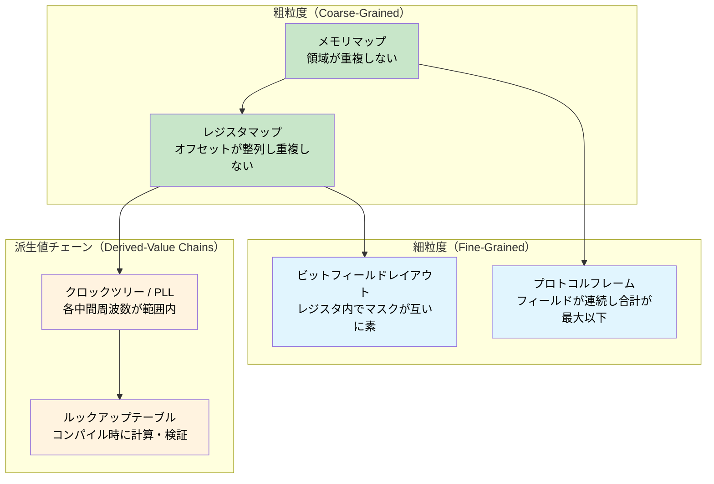
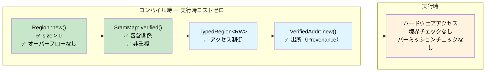

# const fn — コンパイル時正しさの証明 🟠

> **学習内容:** `const fn` と `assert!` を使ってコンパイラを証明エンジンに変える方法 — SRAM メモリマップ、レジスタレイアウト、プロトコルフレーム、ビットフィールドマスク、クロックツリー、およびルックアップテーブルを実行時コストゼロでコンパイル時に検証します。
>
> **関連章:** [第4章](ch04-capability-tokens-zero-cost-proof-of-aut.md)（ケーパビリティトークン）、[第6章](ch06-dimensional-analysis-making-the-compiler.md)（次元解析）、[第9章](ch09-phantom-types-for-resource-tracking.md)（幽霊型（ファントム型））

## 問題: 嘘をつくメモリマップ

組み込みやシステムプログラミングにおいて、メモリマップはすべての基盤です — ブートローダ、ファームウェア、データセクション、スタックがどこに配置されるかを定義します。境界を1つでも間違えれば、2つのサブシステムが知らぬ間に互いを破壊してしまいます。C 言語では、これらのマップは通常、構造的な関係性のない `#define` 定数として記述されます：

```c
/* STM32F4 SRAM レイアウト — 0x20000000 に配置された 256 KB */
#define SRAM_BASE       0x20000000
#define SRAM_SIZE       (256 * 1024)

#define BOOT_BASE       0x20000000
#define BOOT_SIZE       (16 * 1024)

#define FW_BASE         0x20004000
#define FW_SIZE         (128 * 1024)

#define DATA_BASE       0x20024000
#define DATA_SIZE       (80 * 1024)     /* 誰かが 64K から 80K に増やした */

#define STACK_BASE      0x20038000
#define STACK_SIZE      (48 * 1024)     /* 0x20038000 + 48K = 0x20044000 — SRAM の終端を超えている！ */
```

バグの原因：`16 + 128 + 80 + 48 = 272 KB` ですが、SRAM は 256 KB しかありません。スタックは物理メモリの終端から 16 KB もはみ出しています。コンパイラの警告もなく、リンカエラーもなく、実行時チェックもありません — スタックがマップされていない空間に伸びたときに、サイレントなメモリ破損が発生するだけです。

**すべての障害モードはデプロイ後に発見されます** — データセクションのサイズを変更してから数週間後、スタックが高負荷で使用されたときにのみ発生する不可解なクラッシュとして顕在化する可能性があります。

## const fn: コンパイラを証明エンジンに変える

Rust の `const fn` 関数はコンパイル時に実行できます。コンパイル時の評価中に `const fn` がパニックすると、そのパニックは**コンパイルエラー**になります。`assert!` と組み合わせることで、コンパイラを不変条件の定理証明器として活用できます：

```rust
pub const fn checked_add(a: u32, b: u32) -> u32 {
    let sum = a as u64 + b as u64;
    assert!(sum <= u32::MAX as u64, "overflow");
    sum as u32
}

// ✅ コンパイル成功 — 100 + 200 は u32 に収まる
const X: u32 = checked_add(100, 200);

// ❌ コンパイルエラー: "overflow"
// const Y: u32 = checked_add(u32::MAX, 1);

fn main() {
    println!("{X}");
}
```

> **重要な洞察:** `const fn` + `assert!` = 証明義務（proof obligation）。各アサーションはコンパイラが検証しなければならない定理です。証明に失敗した場合、プログラムはコンパイルされません。テストスイートも不要で、コードレビューでの見落としもありません — コンパイラ自身が監査役となります。

## 検証済み SRAM メモリマップの構築

### Region 型

`Region` は連続したメモリブロックを表します。そのコンストラクタは基本的な妥当性を強制する `const fn` です：

```rust
#[derive(Debug, Clone, Copy)]
pub struct Region {
    pub base: u32,
    pub size: u32,
}

impl Region {
    /// 領域を作成する。不変条件に違反した場合はコンパイル時にパニックする。
    pub const fn new(base: u32, size: u32) -> Self {
        assert!(size > 0, "region size must be non-zero");
        assert!(
            base as u64 + size as u64 <= u32::MAX as u64,
            "region overflows 32-bit address space"
        );
        Self { base, size }
    }

    pub const fn end(&self) -> u32 {
        self.base + self.size
    }

    /// `inner` が完全に `self` の内側に収まる場合 true。
    pub const fn contains(&self, inner: &Region) -> bool {
        inner.base >= self.base && inner.end() <= self.end()
    }

    /// 2つの領域がアドレスを共有している場合 true。
    pub const fn overlaps(&self, other: &Region) -> bool {
        self.base < other.end() && other.base < self.end()
    }

    /// `addr` がこの領域内に含まれる場合 true。
    pub const fn contains_addr(&self, addr: u32) -> bool {
        addr >= self.base && addr < self.end()
    }
}

// すべての Region は正当な状態で生成される — 不正なものを構築することはできない
const R: Region = Region::new(0x2000_0000, 1024);

fn main() {
    println!("Region: {:#010X}..{:#010X}", R.base, R.end());
}
```

### 検証済みメモリマップ

ここで領域を組み合わせて完全な SRAM マップを構成します。コンストラクタは 6 つの重複なし（overlap-freedom）不変条件と 4 つの包含（containment）不変条件を — すべてコンパイル時に証明します：

```rust
# #[derive(Debug, Clone, Copy)]
# pub struct Region { pub base: u32, pub size: u32 }
# impl Region {
#     pub const fn new(base: u32, size: u32) -> Self {
#         assert!(size > 0, "region size must be non-zero");
#         assert!(base as u64 + size as u64 <= u32::MAX as u64, "overflow");
#         Self { base, size }
#     }
#     pub const fn end(&self) -> u32 { self.base + self.size }
#     pub const fn contains(&self, inner: &Region) -> bool {
#         inner.base >= self.base && inner.end() <= self.end()
#     }
#     pub const fn overlaps(&self, other: &Region) -> bool {
#         self.base < other.end() && other.base < self.end()
#     }
# }
pub struct SramMap {
    pub total:      Region,
    pub bootloader: Region,
    pub firmware:   Region,
    pub data:       Region,
    pub stack:      Region,
}

impl SramMap {
    pub const fn verified(
        total: Region,
        bootloader: Region,
        firmware: Region,
        data: Region,
        stack: Region,
    ) -> Self {
        // ── 包含関係: すべてのサブ領域が SRAM 全体に収まっている ──
        assert!(total.contains(&bootloader), "bootloader exceeds SRAM");
        assert!(total.contains(&firmware),   "firmware exceeds SRAM");
        assert!(total.contains(&data),       "data section exceeds SRAM");
        assert!(total.contains(&stack),      "stack exceeds SRAM");

        // ── 重複なし: いかなるサブ領域のペアもアドレスを共有しない ──
        assert!(!bootloader.overlaps(&firmware), "bootloader/firmware overlap");
        assert!(!bootloader.overlaps(&data),     "bootloader/data overlap");
        assert!(!bootloader.overlaps(&stack),    "bootloader/stack overlap");
        assert!(!firmware.overlaps(&data),       "firmware/data overlap");
        assert!(!firmware.overlaps(&stack),      "firmware/stack overlap");
        assert!(!data.overlaps(&stack),          "data/stack overlap");

        Self { total, bootloader, firmware, data, stack }
    }
}

// ✅ 10個すべての不変条件がコンパイル時に検証される — 実行時コストはゼロ
const SRAM: SramMap = SramMap::verified(
    Region::new(0x2000_0000, 256 * 1024),   // 256 KB SRAM 全体
    Region::new(0x2000_0000,  16 * 1024),   // ブートローダ: 16 KB
    Region::new(0x2000_4000, 128 * 1024),   // ファームウェア:  128 KB
    Region::new(0x2002_4000,  64 * 1024),   // データ:       64 KB
    Region::new(0x2003_4000,  48 * 1024),   // スタック:      48 KB
);

fn main() {
    println!("SRAM:  {:#010X} — {} KB", SRAM.total.base, SRAM.total.size / 1024);
    println!("Boot:  {:#010X} — {} KB", SRAM.bootloader.base, SRAM.bootloader.size / 1024);
    println!("FW:    {:#010X} — {} KB", SRAM.firmware.base, SRAM.firmware.size / 1024);
    println!("Data:  {:#010X} — {} KB", SRAM.data.base, SRAM.data.size / 1024);
    println!("Stack: {:#010X} — {} KB", SRAM.stack.base, SRAM.stack.size / 1024);
}
```

10個のコンパイル時チェックがありながら、実行時命令はゼロです。バイナリには検証済みの定数のみが含まれます。

### マップを破壊してみる

誰かが他の設定を調整せずに、データセクションを 64 KB から 80 KB に増やしたとします：

```rust,ignore
// ❌ コンパイルできない
const BAD_SRAM: SramMap = SramMap::verified(
    Region::new(0x2000_0000, 256 * 1024),
    Region::new(0x2000_0000,  16 * 1024),
    Region::new(0x2000_4000, 128 * 1024),
    Region::new(0x2002_4000,  80 * 1024),   // 80 KB — 16 KB 大きすぎる
    Region::new(0x2003_8000,  48 * 1024),   // スタックが SRAM の終端からはみ出る
);
```

コンパイラは次のように報告します：

```text
error[E0080]: evaluation of constant value failed
  --> src/main.rs:38:9
   |
38 |         assert!(total.contains(&stack), "stack exceeds SRAM");
   |         ^^^^^^^^^^^^^^^^^^^^^^^^^^^^^^^^^^^^^^^^^^^^^^^^^^^^^
   |         the evaluated program panicked at 'stack exceeds SRAM'
```

> **現場での不可解な障害となっていたはずのバグが、今やコンパイルエラーになります。** 単体テストも不要で、コードレビューでの見落としもなく — コンパイラがそれが不可能であることを証明します。同じバグが何事もなく出荷され、数ヶ月後に現場でスタック破損として現れる C 言語と比較してみてください。

## 幽霊型によるアクセス制御の階層化

`const fn` による検証と、幽霊型（ファントム型）によるアクセスパーミッション（[第9章](ch09-phantom-types-for-resource-tracking.md)）を組み合わせて、読み書きの制約を型レベルで強制します：

```rust
use std::marker::PhantomData;

pub struct ReadOnly;
pub struct ReadWrite;

pub struct TypedRegion<Access> {
    base: u32,
    size: u32,
    _access: PhantomData<Access>,
}

impl<A> TypedRegion<A> {
    pub const fn new(base: u32, size: u32) -> Self {
        assert!(size > 0, "region size must be non-zero");
        Self { base, size, _access: PhantomData }
    }
}

// 読み取りはいかなるアクセスレベルでも利用可能
fn read_word<A>(region: &TypedRegion<A>, offset: u32) -> u32 {
    assert!(offset + 4 <= region.size, "read out of bounds");
    // 実際のファームウェアでは: unsafe { core::ptr::read_volatile((region.base + offset) as *const u32) }
    0 // スタブ
}

// 書き込みには ReadWrite が必要 — 関数シグネチャによって強制される
fn write_word(region: &TypedRegion<ReadWrite>, offset: u32, value: u32) {
    assert!(offset + 4 <= region.size, "write out of bounds");
    // 実際のファームウェアでは: unsafe { core::ptr::write_volatile(...) }
    let _ = value; // スタブ
}

const BOOTLOADER: TypedRegion<ReadOnly>  = TypedRegion::new(0x2000_0000, 16 * 1024);
const DATA:       TypedRegion<ReadWrite> = TypedRegion::new(0x2002_4000, 64 * 1024);

fn main() {
    read_word(&BOOTLOADER, 0);      // ✅ 読み取り専用領域からの読み取り
    read_word(&DATA, 0);            // ✅ 読み書き可能領域からの読み取り
    write_word(&DATA, 0, 42);       // ✅ 読み書き可能領域への書き込み
    // write_word(&BOOTLOADER, 0, 42); // ❌ コンパイルエラー: expected ReadWrite, found ReadOnly
}
```

ブートローダ領域は物理的には書き込み可能です（SRAM です）が、型システムが誤った書き込みを防止します。この**ハードウェアの能力（capability）**と**ソフトウェアのパーミッション（permission）**の区別こそが、「正しさを構造的に保証する」ことの本質です。

## ポインタの出所（Provenance）: アドレスが領域に属することの証明

さらに進めて、特定領域内に存在することが静的に証明された値である「検証済みアドレス」を作成できます：

```rust
# #[derive(Debug, Clone, Copy)]
# pub struct Region { pub base: u32, pub size: u32 }
# impl Region {
#     pub const fn new(base: u32, size: u32) -> Self {
#         assert!(size > 0);
#         assert!(base as u64 + size as u64 <= u32::MAX as u64);
#         Self { base, size }
#     }
#     pub const fn end(&self) -> u32 { self.base + self.size }
#     pub const fn contains_addr(&self, addr: u32) -> bool {
#         addr >= self.base && addr < self.end()
#     }
# }
/// コンパイル時に特定の Region 内にあることが証明されたアドレス。
pub struct VerifiedAddr {
    addr: u32, // private — チェック済みのコンストラクタ経由でのみ作成可能
}

impl VerifiedAddr {
    /// `addr` が `region` の外側にある場合はコンパイル時にパニックする。
    pub const fn new(region: &Region, addr: u32) -> Self {
        assert!(region.contains_addr(addr), "address outside region");
        Self { addr }
    }

    pub const fn raw(&self) -> u32 {
        self.addr
    }
}

const DATA: Region = Region::new(0x2002_4000, 64 * 1024);

// ✅ コンパイル時にデータ領域内にあることが証明されている
const STATUS_WORD: VerifiedAddr = VerifiedAddr::new(&DATA, 0x2002_4000);
const CONFIG_WORD: VerifiedAddr = VerifiedAddr::new(&DATA, 0x2002_5000);

// ❌ コンパイル不可: アドレスはブートローダ領域内にあり、データ領域ではない
// const BAD_ADDR: VerifiedAddr = VerifiedAddr::new(&DATA, 0x2000_0000);

fn main() {
    println!("Status register at {:#010X}", STATUS_WORD.raw());
    println!("Config register at {:#010X}", CONFIG_WORD.raw());
}
```

**出所がコンパイル時に確立される** — これらのアドレスにアクセスする際に、実行時の境界チェックは必要ありません。コンストラクタが private であるため、`VerifiedAddr` はコンパイラが有効であると証明した場合にのみ存在できます。

## メモリマップを超えて

`const fn` による証明パターンは、**構造的不変条件を持つコンパイル時既知の値**が存在するあらゆる場面に適用できます。上記の SRAM マップでは*領域間*のプロパティ（包含関係、非重複）を証明しました。同じ技術は、よりきめ細かい領域へとスケールします：



以降の各サブセクションは同じパターンに従います：不変条件をエンコードした `const fn` コンストラクタを持つ型を定義し、`const _: () = { ... }` または `const` バインディングを使用して検証をトリガーします。

### レジスタマップ

ハードウェアレジスタブロックは固定のオフセットと幅を持ちます。アライメントが狂っていたり重複していたりするレジスタ定義は常にバグです：

```rust
#[derive(Debug, Clone, Copy)]
pub struct Register {
    pub offset: u32,
    pub width: u32,
}

impl Register {
    pub const fn new(offset: u32, width: u32) -> Self {
        assert!(
            width == 1 || width == 2 || width == 4,
            "register width must be 1, 2, or 4 bytes"
        );
        assert!(offset % width == 0, "register must be naturally aligned");
        Self { offset, width }
    }

    pub const fn end(&self) -> u32 {
        self.offset + self.width
    }
}

const fn disjoint(a: &Register, b: &Register) -> bool {
    a.end() <= b.offset || b.end() <= a.offset
}

// UART ペリフェラルレジスタ
const DATA:   Register = Register::new(0x00, 4);
const STATUS: Register = Register::new(0x04, 4);
const CTRL:   Register = Register::new(0x08, 4);
const BAUD:   Register = Register::new(0x0C, 4);

// コンパイル時証明: レジスタ同士が重複しない
const _: () = {
    assert!(disjoint(&DATA,   &STATUS));
    assert!(disjoint(&DATA,   &CTRL));
    assert!(disjoint(&DATA,   &BAUD));
    assert!(disjoint(&STATUS, &CTRL));
    assert!(disjoint(&STATUS, &BAUD));
    assert!(disjoint(&CTRL,   &BAUD));
};

fn main() {
    println!("UART DATA:   offset={:#04X}, width={}", DATA.offset, DATA.width);
    println!("UART STATUS: offset={:#04X}, width={}", STATUS.offset, STATUS.width);
}
```

`const _: () = { ... };` イディオムに注目してください — コンパイル時アサーションを実行することだけを目的とした無名定数です。いずれかのアサーションが失敗すると、定数を評価できずコンパイルが停止します。

#### ミニ演習: SPI レジスタバンク

以下の SPI コントローラレジスタが与えられたとき、次を証明する const fn アサーションを追加してください：
1. すべてのレジスタが自然に整列していること（offset % width == 0）
2. どの2つのレジスタも重複していないこと
3. すべてのレジスタが 64 バイトのレジスタブロック内に収まっていること

<details>
<summary>ヒント</summary>

上記の UART の例の `Register` および `disjoint` 関数を再利用してください。3つまたは4つの `const Register` 値（例: オフセット 0x00 幅 4 の `CTRL`、0x04 幅 4 の `STATUS`、0x08 幅 1 の `TX_DATA`、0x0C 幅 1 の `RX_DATA`）を定義し、3つのプロパティをアサートします。

</details>

### プロトコルフレームのレイアウト

ネットワークやバスプロトコルのフレームは、特定のオフセットにフィールドを持ちます。`then()` メソッドにより連続性が構造的になり、ギャップや重複が構造上不可能になります：

```rust
#[derive(Debug, Clone, Copy)]
pub struct Field {
    pub offset: usize,
    pub size: usize,
}

impl Field {
    pub const fn new(offset: usize, size: usize) -> Self {
        assert!(size > 0, "field size must be non-zero");
        Self { offset, size }
    }

    pub const fn end(&self) -> usize {
        self.offset + self.size
    }

    /// このフィールドの直後に続く次のフィールドを作成する。
    pub const fn then(&self, size: usize) -> Field {
        Field::new(self.end(), size)
    }
}

const MAX_FRAME: usize = 256;

const HEADER:  Field = Field::new(0, 4);
const SEQ_NUM: Field = HEADER.then(2);
const PAYLOAD: Field = SEQ_NUM.then(246);
const CRC:     Field = PAYLOAD.then(4);

// コンパイル時証明: フレームが最大サイズ内に収まっている
const _: () = assert!(CRC.end() <= MAX_FRAME, "frame exceeds maximum size");

fn main() {
    println!("Header:  [{}..{})", HEADER.offset, HEADER.end());
    println!("SeqNum:  [{}..{})", SEQ_NUM.offset, SEQ_NUM.end());
    println!("Payload: [{}..{})", PAYLOAD.offset, PAYLOAD.end());
    println!("CRC:     [{}..{})", CRC.offset, CRC.end());
    println!("Total:   {}/{} bytes", CRC.end(), MAX_FRAME);
}
```

フィールドは構造的に連続しています — 各フィールドは直前のフィールドが終了した場所から正確に始まります。最後のアサーションは、フレームがプロトコルの最大サイズ内に収まっていることを証明します。

### ジェネリック検証のためのインライン const ブロック

Rust 1.79 以降、`const { ... }` ブロックを使用すると、使用箇所で const ジェネリックパラメータを検証できます — DMA バッファサイズの制約やアライメント要件に最適です：

```rust,ignore
fn dma_transfer<const N: usize>(buf: &[u8; N]) {
    const { assert!(N % 4 == 0, "DMA buffer must be 4-byte aligned in size") };
    const { assert!(N <= 65536, "DMA transfer exceeds maximum size") };
    // ... 転送を開始 ...
}

dma_transfer(&[0u8; 1024]);   // ✅ 1024 は 4 で割り切れ、かつ ≤ 65536
// dma_transfer(&[0u8; 1023]); // ❌ コンパイルエラー: 4 バイト整列されていない
```

アサーションは関数が単相化（モノモルフィズ）されるときに評価されます — 異なる `N` を持つ各呼び出し元が、独自のコンパイル時チェックを受けます。

### レジスタ内のビットフィールドレイアウト

レジスタマップはレジスタが*互いに重複しない*ことを証明しますが、**単一のレジスタ内のビット**についてはどうでしょうか？制御レジスタは複数のフィールドを1つのワードにパックします。2つのフィールドがビット位置を共有している場合、読み書きによって互いが知らぬ間に破損してしまいます。C 言語では、これは通常マスク定数の手動レビューによって捕捉される（あるいは見落とされる）ものです。

`const fn` は、すべてのフィールドのマスク/シフトのペアが同じレジスタ内の他のすべてのフィールドと互いに素であることを証明できます：

```rust
#[derive(Debug, Clone, Copy)]
pub struct BitField {
    pub mask: u32,
    pub shift: u8,
}

impl BitField {
    pub const fn new(shift: u8, width: u8) -> Self {
        assert!(width > 0, "bit field width must be non-zero");
        assert!(shift as u32 + width as u32 <= 32, "bit field exceeds 32-bit register");
        // マスクの構築: ビット `shift` から始まる `width` 個の 1
        let mask = ((1u64 << width as u64) - 1) as u32;
        Self { mask: mask << shift as u32, shift }
    }

    pub const fn positioned_mask(&self) -> u32 {
        self.mask
    }

    pub const fn encode(&self, value: u32) -> u32 {
        assert!(value & !( self.mask >> self.shift as u32 ) == 0, "value exceeds field width");
        value << self.shift as u32
    }
}

const fn fields_disjoint(a: &BitField, b: &BitField) -> bool {
    a.positioned_mask() & b.positioned_mask() == 0
}

// SPI 制御レジスタのフィールド: enable[0], mode[1:2], clock_div[4:7], irq_en[8]
const SPI_EN:     BitField = BitField::new(0, 1);   // ビット 0
const SPI_MODE:   BitField = BitField::new(1, 2);   // ビット 1–2
const SPI_CLKDIV: BitField = BitField::new(4, 4);   // ビット 4–7
const SPI_IRQ:    BitField = BitField::new(8, 1);   // ビット 8

// コンパイル時証明: どのフィールドもビット位置を共有しない
const _: () = {
    assert!(fields_disjoint(&SPI_EN,   &SPI_MODE));
    assert!(fields_disjoint(&SPI_EN,   &SPI_CLKDIV));
    assert!(fields_disjoint(&SPI_EN,   &SPI_IRQ));
    assert!(fields_disjoint(&SPI_MODE, &SPI_CLKDIV));
    assert!(fields_disjoint(&SPI_MODE, &SPI_IRQ));
    assert!(fields_disjoint(&SPI_CLKDIV, &SPI_IRQ));
};

fn main() {
    let ctrl = SPI_EN.encode(1)
             | SPI_MODE.encode(0b10)
             | SPI_CLKDIV.encode(0b0110)
             | SPI_IRQ.encode(1);
    println!("SPI_CTRL = {:#010b} ({:#06X})", ctrl, ctrl);
}
```

これは上記のレジスタマップのパターンを補完します — レジスタマップが*レジスタ間*の素（disjointness）を証明するのに対し、ビットフィールドレイアウトは*レジスタ内*の素を証明します。両者を合わせることで、レジスタブロックから個々のビットに至るまでの完全なカバレッジが提供されます。

### クロックツリー / PLL 設定

マイクロコントローラは、乗算器/分周器チェーンを通じてペリフェラルクロックを導出します。PLL は `f_vco = f_in × N / M` を生成し、VCO 周波数はハードウェアで指定された範囲内に収まらなければなりません。特定の基板に対してパラメータを1つでも間違えると、チップは不正なクロックを出力するか、ロックを拒否します。これらの制約は `const fn` に最適です：

```rust
#[derive(Debug, Clone, Copy)]
pub struct PllConfig {
    pub input_khz: u32,     // 外部水晶発振子
    pub m: u32,             // 入力分周器
    pub n: u32,             // VCO 乗算器
    pub p: u32,             // システムクロック分周器
}

impl PllConfig {
    pub const fn verified(input_khz: u32, m: u32, n: u32, p: u32) -> Self {
        // 入力分周器が PLL 入力周波数を生成する
        let pll_input = input_khz / m;
        assert!(pll_input >= 1_000 && pll_input <= 2_000,
            "PLL input must be 1–2 MHz");

        // VCO 周波数はハードウェアの制限内でなければならない
        let vco = pll_input as u64 * n as u64;
        assert!(vco >= 192_000 && vco <= 432_000,
            "VCO must be 192–432 MHz");

        // システムクロック分周器は偶数でなければならない（ハードウェア制約）
        assert!(p == 2 || p == 4 || p == 6 || p == 8,
            "P must be 2, 4, 6, or 8");

        // 最終システムクロック
        let sysclk = vco / p as u64;
        assert!(sysclk <= 168_000,
            "system clock exceeds 168 MHz maximum");

        Self { input_khz, m, n, p }
    }

    pub const fn vco_khz(&self) -> u32 {
        (self.input_khz / self.m) * self.n
    }

    pub const fn sysclk_khz(&self) -> u32 {
        self.vco_khz() / self.p
    }
}

// 8 MHz HSE 水晶発振子を備えた STM32F4 → 168 MHz システムクロック
const PLL: PllConfig = PllConfig::verified(8_000, 8, 336, 2);

// ❌ コンパイル不可: VCO = 480 MHz が 432 MHz の上限を超過
// const BAD: PllConfig = PllConfig::verified(8_000, 8, 480, 2);

fn main() {
    println!("VCO:    {} MHz", PLL.vco_khz() / 1_000);
    println!("SYSCLK: {} MHz", PLL.sysclk_khz() / 1_000);
}
```

`BAD` 定数のコメントを解除すると、違反した制約を特定するコンパイル時エラーが発生します：

```text
error[E0080]: evaluation of constant value failed
  --> src/main.rs:18:9
   |
18 |         assert!(vco >= 192_000 && vco <= 432_000,
   |         ^^^^^^^^^^^^^^^^^^^^^^^^^^^^^^^^^^^^^^^^^
   |         the evaluated program panicked at 'VCO must be 192–432 MHz'
```

コンパイラは制約違反を導出チェーンの*途中*で捕捉します — 末尾ではありません。代わりにシステムクロックの上限（`sysclk > 168 MHz`）に違反していた場合は、エラーメッセージはそのアサーションを指し示します。

> **派生値制約チェーンは、単一の `const fn` を多段階の証明に変換します。** 各中間値にはハードウェアで義務付けられた独自の範囲があります。1つのパラメータを変更すると（例: 25 MHz の水晶発振子に交換する）、下流のいかなる違反も即座に表面化します。

### コンパイル時ルックアップテーブル

`const fn` はコンパイル時にルックアップテーブル全体を計算し、起動コストゼロで `.rodata` に配置できます。これは CRC テーブル、三角関数、エンコーディングマップ、誤り訂正符号など — 通常ビルドスクリプトやコード生成を使用するようなあらゆる場所で特に価値があります：

```rust
const fn crc32_table() -> [u32; 256] {
    let mut table = [0u32; 256];
    let mut i: usize = 0;
    while i < 256 {
        let mut crc = i as u32;
        let mut j = 0;
        while j < 8 {
            if crc & 1 != 0 {
                crc = (crc >> 1) ^ 0xEDB8_8320; // 標準 CRC-32 多項式
            } else {
                crc >>= 1;
            }
            j += 1;
        }
        table[i] = crc;
        i += 1;
    }
    table
}

/// 完全な CRC-32 テーブル — コンパイル時に計算され、.rodata に配置される
const CRC32_TABLE: [u32; 256] = crc32_table();

/// 事前計算されたテーブルを使用して実行時にバイトスライス全体の CRC-32 を計算する。
fn crc32(data: &[u8]) -> u32 {
    let mut crc: u32 = !0;
    for &byte in data {
        let index = ((crc ^ byte as u32) & 0xFF) as usize;
        crc = (crc >> 8) ^ CRC32_TABLE[index];
    }
    !crc
}

// スモークテスト: "123456789" の周知の CRC-32
const _: () = {
    // コンパイル時に単一のテーブルエントリを検証する
    assert!(CRC32_TABLE[0] == 0x0000_0000);
    assert!(CRC32_TABLE[1] == 0x7707_3096);
};

fn main() {
    let check = crc32(b"123456789");
    // "123456789" の既知の CRC-32 は 0xCBF43926
    assert_eq!(check, 0xCBF4_3926);
    println!("CRC-32 of '123456789' = {:#010X} ✓", check);
    println!("Table size: {} entries × 4 bytes = {} bytes in .rodata",
        CRC32_TABLE.len(), CRC32_TABLE.len() * 4);
}
```

`crc32_table()` 関数は完全にコンパイル中に実行されます。生成された 1 KB のテーブルはバイナリの読み取り専用データセクションに焼き込まれます — アロケータも、初期化コードも、起動コストもありません。コードジェネレータを使用するか起動時にテーブルを計算する C 言語のアプローチとこれを比較してみてください。Rust 版は証明可能に正しく（`const _` アサーションが既知の値を検証します）、証明可能に完全です（関数が有効なテーブルを生成できなかった場合、コンパイラはプログラムを拒否します）。

## いつ const fn による証明を使用すべきか

| シナリオ | 推奨事項 |
|----------|:---:|
| メモリマップ、レジスタオフセット、パーティションテーブル | ✅ 常に使用 |
| 固定フィールドを持つプロトコルフレームレイアウト | ✅ 常に使用 |
| レジスタ内のビットフィールドマスク | ✅ 常に使用 |
| クロックツリー / PLL パラメータチェーン | ✅ 常に使用 |
| ルックアップテーブル（CRC、三角関数、エンコーディング） | ✅ 常に使用 — 起動コストゼロ |
| 値をまたぐ不変条件を持つ定数（非重複、合計 ≤ 境界） | ✅ 常に使用 |
| ドメイン制約を持つ設定値 | ✅ コンパイル時に値が判明している場合 |
| ユーザー入力やファイルから計算される値 | ❌ 実行時バリデーションを使用 |
| 高度に動的な構造（木、グラフ） | ❌ プロパティベーステストを使用 |
| 単一値の範囲チェック | ⚠️  代わりにニュータイプ + `From` を検討（[第7章](ch07-validated-boundaries-parse-dont-validate.md)） |

### コストのまとめ

| 項目 | 実行時コスト |
|------|:------:|
| `const fn` アサーション（`assert!`, `panic!`） | コンパイル時のみ — 0 命令 |
| `const _: () = { ... }` 検証ブロック | コンパイル時のみ — バイナリには含まれない |
| `Region`, `Register`, `Field` 構造体 | 単純なデータ — 生の整数と同じレイアウト |
| インライン `const { }` ジェネリック検証 | コンパイル時に単相化 — コスト 0 |
| ルックアップテーブル（`crc32_table()`） | コンパイル時に計算 — `.rodata` に配置 |
| 幽霊型アクセスマーカー（`TypedRegion<RW>`） | ゼロサイズ — 最適化で消去 |

すべての行が**実行時コストゼロ**です — 証明はコンパイル中にのみ存在します。結果として得られるバイナリには検証済みの定数とルックアップテーブルのみが含まれ、アサーションチェックのコードは一切含まれません。

## 演習: フラッシュパーティションマップ

`0x0800_0000` から始まる 1 MB NOR フラッシュ用の検証済みフラッシュパーティションマップを設計してください。要件：

1. 4つのパーティション: **ブートローダ**（64 KB）、**アプリケーション**（640 KB）、**設定**（64 KB）、**OTA ステージング**（256 KB）
2. すべてのパーティションは **4 KB 整列** でなければならない（フラッシュの消去粒度）: ベースとサイズの両方が 4096 の倍数であること
3. どのパーティションも他のパーティションと重複してはならない
4. すべてのパーティションがフラッシュ内に収まらなければならない
5. すべてのパーティションサイズの合計を返す `const fn total_used()` を追加し、それが 1 MB と等しいことをアサートする

<details>
<summary>解答例</summary>

```rust
#[derive(Debug, Clone, Copy)]
pub struct FlashRegion {
    pub base: u32,
    pub size: u32,
}

impl FlashRegion {
    pub const fn new(base: u32, size: u32) -> Self {
        assert!(size > 0, "partition size must be non-zero");
        assert!(base % 4096 == 0, "partition base must be 4 KB aligned");
        assert!(size % 4096 == 0, "partition size must be 4 KB aligned");
        assert!(
            base as u64 + size as u64 <= u32::MAX as u64,
            "partition overflows address space"
        );
        Self { base, size }
    }

    pub const fn end(&self) -> u32 { self.base + self.size }

    pub const fn contains(&self, inner: &FlashRegion) -> bool {
        inner.base >= self.base && inner.end() <= self.end()
    }

    pub const fn overlaps(&self, other: &FlashRegion) -> bool {
        self.base < other.end() && other.base < self.end()
    }
}

pub struct FlashMap {
    pub total:  FlashRegion,
    pub boot:   FlashRegion,
    pub app:    FlashRegion,
    pub config: FlashRegion,
    pub ota:    FlashRegion,
}

impl FlashMap {
    pub const fn verified(
        total: FlashRegion,
        boot: FlashRegion,
        app: FlashRegion,
        config: FlashRegion,
        ota: FlashRegion,
    ) -> Self {
        assert!(total.contains(&boot),   "bootloader exceeds flash");
        assert!(total.contains(&app),    "application exceeds flash");
        assert!(total.contains(&config), "config exceeds flash");
        assert!(total.contains(&ota),    "OTA staging exceeds flash");

        assert!(!boot.overlaps(&app),    "boot/app overlap");
        assert!(!boot.overlaps(&config), "boot/config overlap");
        assert!(!boot.overlaps(&ota),    "boot/ota overlap");
        assert!(!app.overlaps(&config),  "app/config overlap");
        assert!(!app.overlaps(&ota),     "app/ota overlap");
        assert!(!config.overlaps(&ota),  "config/ota overlap");

        Self { total, boot, app, config, ota }
    }

    pub const fn total_used(&self) -> u32 {
        self.boot.size + self.app.size + self.config.size + self.ota.size
    }
}

const FLASH: FlashMap = FlashMap::verified(
    FlashRegion::new(0x0800_0000, 1024 * 1024),  // 合計 1 MB
    FlashRegion::new(0x0800_0000,   64 * 1024),   // ブートローダ: 64 KB
    FlashRegion::new(0x0801_0000,  640 * 1024),   // アプリケーション: 640 KB
    FlashRegion::new(0x080B_0000,   64 * 1024),   // 設定: 64 KB
    FlashRegion::new(0x080C_0000,  256 * 1024),   // OTA ステージング: 256 KB
);

// フラッシュのすべてのバイトが考慮されている
const _: () = assert!(
    FLASH.total_used() == 1024 * 1024,
    "partitions must exactly fill flash"
);

fn main() {
    println!("Flash map: {} KB used / {} KB total",
        FLASH.total_used() / 1024,
        FLASH.total.size / 1024);
}
```

</details>



## 主なポイント

1. **`const fn` + `assert!` = コンパイル時の証明義務** — const 評価中にアサーションが失敗した場合、プログラムはコンパイルされません。テストも不要で、コードレビューでの見落としもなく — コンパイラがそれを証明します。

2. **メモリマップは理想的な適用対象** — サブ領域の包含関係、重複なし、合計サイズ境界、アライメント制約はすべて const fn アサーションとして表現できます。C 言語の `#define` アプローチでは、これらの保証は一切得られません。

3. **幽霊型をその上に階層化する** — const fn（値の検証）と幽霊型のアクセスマーカー（パーミッションの検証）を組み合わせることで、実行時コストゼロで多層防御を実現します。

4. **出所（Provenance）はコンパイル時に確立できる** — `VerifiedAddr` はアドレスが特定の領域に属することをコンパイル時に証明し、アクセスごとの実行時境界チェックを排除します。

5. **パターンはメモリを超えて一般化される** — レジスタマップ、ビットフィールドマスク、プロトコルフレーム、クロックツリー、DMA パラメータなど — 構造的不変条件を持つコンパイル時既知の値が存在するあらゆる場所に適用できます。

6. **ビットフィールドとクロックツリーは理想的な適用対象** — レジスタ内のビットの素性や、派生値制約チェーン（VCO 範囲、分周器の制限）は、まさに `const fn` が難なく証明できる不変条件です。

7. **`const fn` はルックアップテーブルのためのコードジェネレータやビルドスクリプトを置き換える** — CRC テーブル、三角関数、エンコーディングマップ — コンパイル時に計算されて `.rodata` に配置され、起動コストゼロで外部ツールも不要です。

8. **インライン `const { }` ブロックがジェネリックパラメータを検証する** — Rust 1.79 以降、呼び出し元で const ジェネリクスに対する制約を強制し、コードが実行される前に誤用を捕捉できます。
